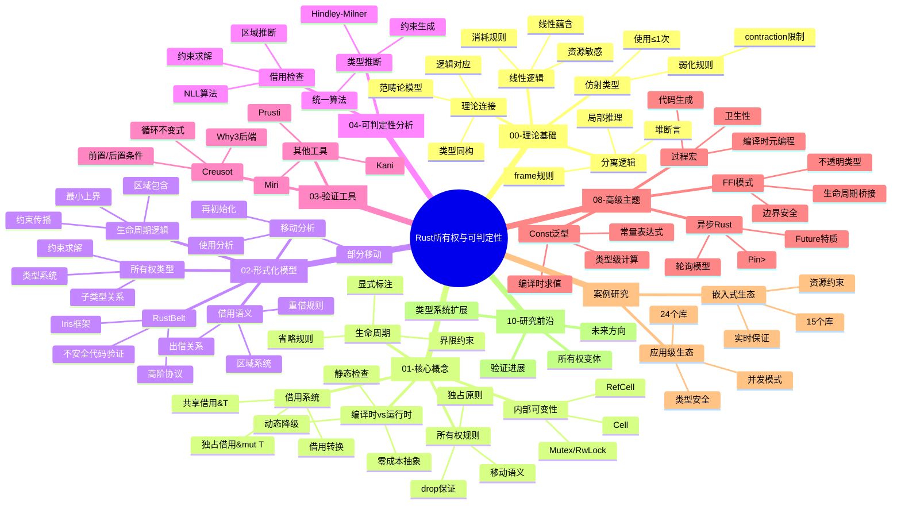

# Rust所有权与可判定性 - 总体脉络思维导图



---

## 核心论证脉络

### 主线论证：从理论基础到工程实践

```text
┌─────────────────────────────────────────────────────────────────┐
│                     理论基础层                                    │
│  线性逻辑 ──→ 仿射类型 ──→ 分离逻辑 ──→ 范畴论语义                 │
│     │           │           │           │                        │
│     ↓           ↓           ↓           ↓                        │
│  资源敏感     使用≤1次     堆推理      结构映射                    │
└─────────────────────────────────────────────────────────────────┘
                              │
                              ▼
┌─────────────────────────────────────────────────────────────────┐
│                     核心机制层                                    │
│  所有权规则 ──→ 借用系统 ──→ 生命周期 ──→ 内部可变性              │
│     │           │           │           │                        │
│     ↓           ↓           ↓           ↓                        │
│   RAII        引用的引用    作用域      编译时→运行时              │
│   独占访问    读写分离      约束求解    安全降级                   │
└─────────────────────────────────────────────────────────────────┘
                              │
                              ▼
┌─────────────────────────────────────────────────────────────────┐
│                     形式化验证层                                  │
│  RustBelt ──→ 分离逻辑 ──→ 协议验证 ──→ 不安全代码边界            │
│     │           │           │           │                        │
│     ↓           ↓           ↓           ↓                        │
│  Iris框架     资源抽象     高阶幽灵状态   机器检查                 │
│  高阶逻辑     权限分离     不变式传播    证明携带代码              │
└─────────────────────────────────────────────────────────────────┘
                              │
                              ▼
┌─────────────────────────────────────────────────────────────────┐
│                     工程应用层                                    │
│  39个库案例研究 ──→ 模式提取 ──→ 最佳实践 ──→ 决策指南            │
│     │              │           │           │                     │
│     ↓              ↓           ↓           ↓                     │
│  嵌入式/应用级   类型模式      反模式      场景选择                │
│  安全证明        并发模式      重构建议    工具链                  │
└─────────────────────────────────────────────────────────────────┘
```
