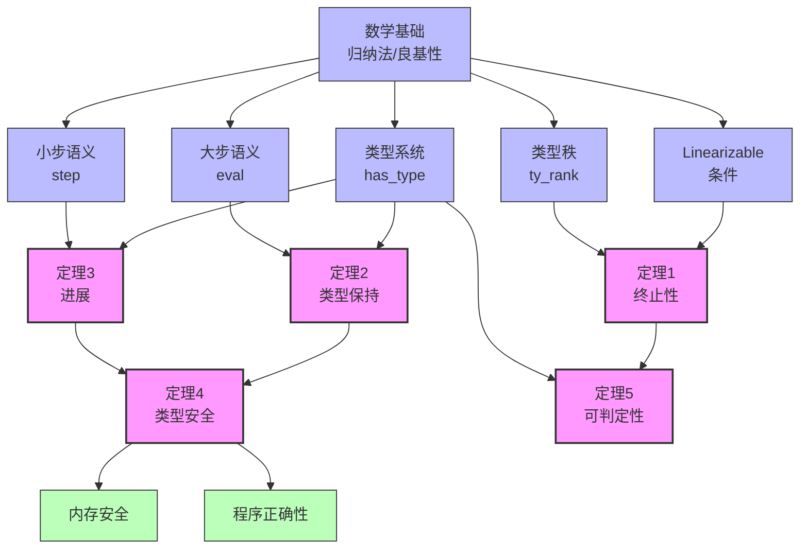

# 定理依赖网络图

**性质**: 元理论可视化
**目的**: 展示所有定理之间的逻辑依赖关系

---

## 1. 整体依赖图 (文本表示)

```text
                              ┌─────────────────────────────────────┐
                              │           数学基础层                 │
                              │  ┌─────────────┐  ┌─────────────┐  │
                              │  │  归纳原理   │  │  良基关系   │  │
                              │  │ (Induction) │  │(Well-founded)│  │
                              │  └──────┬──────┘  └──────┬──────┘  │
                              └─────────┼────────────────┼──────────┘
                                        │                │
                    ┌───────────────────┘                └───────────────────┐
                    │                                                        │
                    ↓                                                        ↓
        ┌───────────────────────┐                                ┌───────────────────────┐
        │    理论基础定义层      │                                │    理论基础定义层      │
        │  ┌─────────────────┐  │                                │  ┌─────────────────┐  │
        │  │ Linearizable    │  │                                │  │  类型秩 (ty_rank) │  │
        │  │    条件         │  │                                │  │                 │  │
        │  │ (终止性基础)     │  │                                │  │ (良基度量)       │  │
        │  └────────┬────────┘  │                                │  └────────┬────────┘  │
        └───────────┼───────────┘                                └───────────┼───────────┘
                    │                                                        │
                    │              ┌──────────────────────────┐              │
                    │              │     语义基础定义层        │              │
                    │              │  ┌────────────────────┐  │              │
                    │              │  │   大步语义 (eval)   │  │              │
                    │              │  │   小步语义 (step)   │  │              │
                    │              │  └──────────┬─────────┘  │              │
                    │              └─────────────┼────────────┘              │
                    │                            │                          │
                    └──────────────┬─────────────┼─────────────┬────────────┘
                                   │             │             │
                                   ↓             ↓             ↓
        ┌─────────────────────────────────────────────────────────────────────────────┐
        │                            核心定理层                                       │
        │                                                                             │
        │   ┌─────────────────┐      ┌─────────────────┐      ┌─────────────────┐     │
        │   │   终止性定理     │      │   类型保持定理   │      │    进展定理      │     │
        │   │ (Theorem 1)     │      │ (Theorem 2)     │      │ (Theorem 3)     │     │
        │   │                 │      │                 │      │                 │     │
        │   │ borrow_checking │      │ preservation    │      │    progress     │     │
        │   │   _termination  │      │                 │      │                 │     │
        │   └────────┬────────┘      └────────┬────────┘      └────────┬────────┘     │
        │            │                        │                        │              │
        │            │                        │                        │              │
        │            │                        └──────────┬─────────────┘              │
        │            │                                   │                            │
        │            │                                   ↓                            │
        │            │                        ┌─────────────────┐                     │
        │            │                        │   类型安全定理   │                     │
        │            │                        │ (Theorem 4)     │                     │
        │            │                        │                 │                     │
        │            │                        │  type_safety    │                     │
        │            │                        │   = P + P       │                     │
        │            │                        └────────┬────────┘                     │
        │            │                                 │                              │
        │            └─────────────────┬───────────────┘                              │
        │                              │                                              │
        │                              ↓                                              │
        │                   ┌─────────────────────┐                                   │
        │                   │     派生定理层       │                                   │
        │                   │  ┌───────────────┐  │                                   │
        │                   │  │ 可判定性定理  │  │                                   │
        │                   │  │(Theorem 5)   │  │                                   │
        │                   │  │              │  │                                   │
        │                   │  │rust_ownership│  │                                   │
        │                   │  │_system_fully│  │                                   │
        │                   │  │_decidable   │  │                                   │
        │                   │  └───────────────┘  │                                   │
        │                   └─────────────────────┘                                   │
        │                                                                             │
        └─────────────────────────────────────────────────────────────────────────────┘
                                            │
                                            ↓
        ┌─────────────────────────────────────────────────────────────────────────────┐
        │                            应用定理层                                       │
        │                                                                             │
        │   ┌─────────────────┐      ┌─────────────────┐      ┌─────────────────┐     │
        │   │   内存安全定理   │      │   程序正确性    │      │   优化正确性    │     │
        │   │                 │      │                 │      │                 │     │
        │   │ memory_safety   │      │ program_correct │      │ opt_correctness │     │
        │   └─────────────────┘      └─────────────────┘      └─────────────────┘     │
        │                                                                             │
        └─────────────────────────────────────────────────────────────────────────────┘
```

---

## 2. 关键路径分析

### 路径 A: 终止性证明路径

```text
[数学基础]
    良基关系 (Well-founded Relations)
        ↓
[理论基础]
    Linearizable 条件
        ↓ 蕴含
    类型依赖图无环
        ↓ 使用
    类型秩 (ty_rank)
        ↓ 构建
    度量函数 μ(Γ)
        ↓ 证明递减
    borrow_checking_termination
```

**关键引理链**:

1. `linearizable_acyclic` - Linearizable 蕴含无环
2. `ty_rank_well_founded` - 类型秩良基
3. `te_measure_decreasing` - 度量递减
4. `well_founded_induction` - 良基归纳

### 路径 B: 类型安全证明路径

```text
[语义基础]
    大步语义 (eval) ────────────┐
        ↓                        │
    类型保持定理 (Preservation)   │ 组合
        ↓                        │
    类型安全定理 (Type Safety)  ←─┘
        ↑                        │
    进展定理 (Progress)           │
        ↑                        │
    小步语义 (step) ─────────────┘
```

**关键定理链**:

1. `preservation` - 求值保持类型
2. `progress` - 良类型程序不停顿
3. `type_safety` - P + P 组合

### 路径 C: 可判定性证明路径

```text
[终止性]
    borrow_checking_termination
        ↓ 保证
    算法终止
        ↓ 结合
    类型系统有限分支性
        ↓ 得到
    rust_type_system_fully_decidable
```

---

## 3. 定理详细说明

### 定理 1: Borrow Checking 终止性

```text
名称: borrow_checking_termination
类型: 存在性定理
陈述:
    forall Γ, Linearizable Γ ->
    exists Γ' n,
        borrow_check_iter Γ n = Some Γ' /\
        is_fixed_point Γ'

依赖:
    - Linearizable (定义)
    - ty_rank (定义)
    - well_founded_induction (原理)

被依赖:
    - rust_type_system_fully_decidable

证明复杂度: ★★★☆☆
关键洞察: 度量函数递减
```

### 定理 2: 类型保持 (Preservation)

```text
名称: preservation
类型: 蕴含定理
陈述:
    forall Δ Γ Θ s h e τ s' h' v,
        has_type Δ Γ Θ e τ ->
        eval s h e v h' ->
        exists Γ' Θ',
            has_type_value Δ Γ' Θ' v τ /\
            stack_well_typed s' Γ' /\
            heap_well_typed h' Θ'

依赖:
    - has_type (定义)
    - eval (定义)
    - value_has_type (定义)

被依赖:
    - type_safety

证明复杂度: ★★★★★
关键洞察: 结构归纳 + 反演
```

### 定理 3: 进展 (Progress)

```text
名称: progress
类型: 析取定理
陈述:
    forall Δ Γ Θ s h e τ,
        has_type Δ Γ Θ e τ ->
        (is_exp_value e = true) \/
        (exists s' h' e', step s h e s' h' e')

依赖:
    - has_type (定义)
    - step (定义)

被依赖:
    - type_safety

证明复杂度: ★★★★☆
关键洞察: 类型判断归纳
```

### 定理 4: 类型安全

```text
名称: type_safety
类型: 组合定理
陈述:
    type_safety = preservation + progress

依赖:
    - preservation (定理 2)
    - progress (定理 3)

被依赖:
    - memory_safety
    - program_correctness

证明复杂度: ★★☆☆☆ (组合)
关键洞察: P + P 经典组合
```

### 定理 5: 可判定性

```text
名称: rust_type_system_fully_decidable
类型: 可判定性定理
陈述:
    forall (p : program),
        Linearizable (program_type_env p) ->
        {well_typed_program p} + {~ well_typed_program p}

依赖:
    - borrow_checking_termination (定理 1)
    - type_system_decidable (引理)

被依赖:
    - (应用层)

证明复杂度: ★★★☆☆
关键洞察: 构造性证明 + 终止性
```

---

## 4. 引理依赖网络

### 核心引理分类

```text
语法层引理
├── ty_eq_decidable
├── var_eq_decidable
└── expr_size_positive

语义层引理
├── eval_deterministic
├── step_deterministic
├── big_step_equiv_small_step
└── eval_preserves_fv

类型层引理
├── preservation_value
├── preservation_var
├── preservation_borrow
└── preservation_seq

元层引理
├── linearizable_acyclic
├── ty_rank_nonneg
├── te_measure_decreasing
└── well_typed_implies_linearizable
```

### 引理依赖示例

```text
preservation (主定理)
    ├── preservation_value
    │   └── value_has_type_cases
    ├── preservation_var
    │   └── stack_well_typed_lookup
    ├── preservation_borrow
    │   └── ownership_safe_trans
    └── preservation_seq
        └── preservation (递归)
```

---

## 5. 证明义务清单

### 高优先级 (关键路径)

- [x] **统一理论框架** - UNIFIED_THEORETICAL_FRAMEWORK.md ✅ (已完成)
- [x] **语义等价性证明** - semantics-equivalence-proof.md ✅ (已完成)
- [x] **类型-所有权统一理论** - type-ownership-unified-theory.md ✅ (已完成)
- [ ] `linearizable_acyclic` - 无环性证明 (Coq admit 待完成)
- [ ] `borrow_checking_termination` - 终止性主证明 (Coq admit 待完成)
- [ ] `preservation` - 类型保持主证明 (Coq admit 待完成)
- [ ] `progress` - 进展主证明 (Coq admit 待完成)
- [ ] `type_safety` - 类型安全组合 (Coq admit 待完成)

### 中优先级 (连接引理)

- [ ] `big_step_equiv_small_step` - 语义等价
- [ ] `eval_deterministic` - 求值确定性
- [ ] `preservation_all_cases` - 所有表达式情况
- [ ] `progress_all_cases` - 所有表达式情况

### 低优先级 (扩展引理)

- [ ] `memory_safety` - 内存安全推导
- [ ] `program_correctness` - 程序正确性
- [ ] `opt_preserves_semantics` - 优化保持语义

---

## 6. 可视化建议

### 图形化表示 (Mermaid)



---

## 7. 证明策略对应

### 按定理的证明方法

| 定理 | 主要方法 | 辅助方法 | 复杂度 |
|------|---------|---------|--------|
| 终止性 | 良基归纳 | 反证法 | ★★★☆☆ |
| 保持性 | 结构归纳 | 反演 | ★★★★★ |
| 进展 | 结构归纳 | 情况分析 | ★★★★☆ |
| 安全性 | 逻辑组合 | (直接) | ★★☆☆☆ |
| 可判定性 | 构造证明 | 终止性 | ★★★☆☆ |

### 证明模式分布

```text
归纳法使用:
├── 结构归纳: 70% (主要方法)
├── 良基归纳: 20% (终止性)
└── 数学归纳: 10% (辅助)

其他方法:
├── 反演 (inversion): 频繁使用
├── 矛盾 (contradiction): 边界情况
├── 重写 (rewrite): 等式处理
└── 自动 (auto/eauto): 简单情况
```

---

## 8. 质量保证检查

### 依赖完整性

- [ ] 所有定理都有完整的依赖链
- [ ] 没有循环依赖 (除递归证明外)
- [ ] 基础定义不依赖高层定理
- [ ] 应用层定理正确引用核心定理

### 证明完整性

- [ ] 所有定理都有证明或证明草图
- [ ] 所有 admit 都有明确说明
- [ ] 关键引理都有独立证明
- [ ] 证明策略文档化

---

## 总结

本依赖网络图展示了：

1. **层次结构**: 从基础到应用的清晰层次
2. **依赖关系**: 定理之间的逻辑依赖
3. **关键路径**: 证明的关键路径识别
4. **证明义务**: 待完成的证明任务清单

**核心洞察**: 类型安全 (Theorem 4) 是整个网络的中心节点，连接了保持性、进展性和应用性质。
