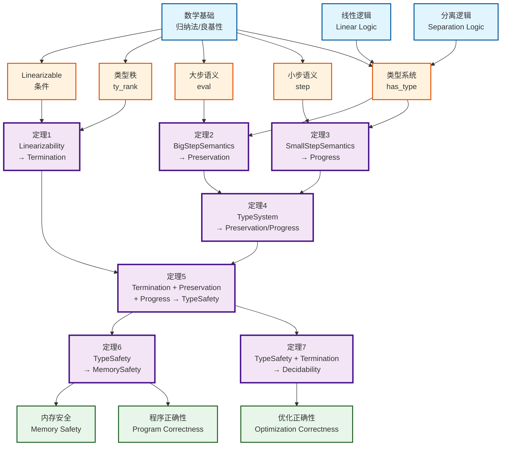

# Rust 所有权系统统一理论框架

## Unified Theoretical Framework for Rust Ownership System

> **文档性质**: 形式化理论顶层框架
> **版本**: 1.0.0
> **数学基础**: 类型论 + 操作语义 + 分离逻辑
> **形式化深度**: 高

---

## 目录

- [Rust 所有权系统统一理论框架](#rust-所有权系统统一理论框架)
  - [Unified Theoretical Framework for Rust Ownership System](#unified-theoretical-framework-for-rust-ownership-system)
  - [目录](#目录)
  - [1. 引言](#1-引言)
    - [1.1 研究问题](#11-研究问题)
    - [1.2 方法论](#12-方法论)
    - [1.3 形式化目标](#13-形式化目标)
  - [2. 数学基础](#2-数学基础)
    - [2.1 类型论基础](#21-类型论基础)
      - [2.1.1 简单类型 lambda 演算](#211-简单类型-lambda-演算)
      - [2.1.2 多态类型系统 (System F)](#212-多态类型系统-system-f)
      - [2.1.3 线性类型系统](#213-线性类型系统)
    - [2.2 操作语义理论](#22-操作语义理论)
      - [2.2.1 小步操作语义 (SOS)](#221-小步操作语义-sos)
      - [2.2.2 大步操作语义](#222-大步操作语义)
      - [2.2.3 求值上下文](#223-求值上下文)
    - [2.3 逻辑框架](#23-逻辑框架)
      - [2.3.1 分离逻辑 (Separation Logic)](#231-分离逻辑-separation-logic)
      - [2.3.2 模态逻辑扩展 (Iris)](#232-模态逻辑扩展-iris)
      - [2.3.3 生命周期逻辑](#233-生命周期逻辑)
  - [3. 元模型统一描述](#3-元模型统一描述)
    - [3.1 语法统一视图](#31-语法统一视图)
      - [3.1.1 抽象语法定义](#311-抽象语法定义)
      - [3.1.2 声明语法](#312-声明语法)
    - [3.2 语义统一视图](#32-语义统一视图)
      - [3.2.1 语义域定义](#321-语义域定义)
      - [3.2.2 配置定义](#322-配置定义)
      - [3.2.3 状态转换关系](#323-状态转换关系)
    - [3.3 判断体系统一视图](#33-判断体系统一视图)
      - [3.3.1 类型判断](#331-类型判断)
      - [3.3.2 所有权安全判断](#332-所有权安全判断)
      - [3.3.3 语义求值判断](#333-语义求值判断)
      - [3.3.4 子类型判断](#334-子类型判断)
  - [4. 定理体系](#4-定理体系)
    - [4.1 定理依赖网络](#41-定理依赖网络)
    - [4.2 核心定理陈述](#42-核心定理陈述)
      - [定理 4.1: Linearizability → Termination](#定理-41-linearizability--termination)
      - [定理 4.2: BigStepSemantics → Preservation](#定理-42-bigstepsemantics--preservation)
      - [定理 4.3: SmallStepSemantics → Progress](#定理-43-smallstepsemantics--progress)
      - [定理 4.4: TypeSystem → Preservation/Progress](#定理-44-typesystem--preservationprogress)
      - [定理 4.5: Termination + Preservation + Progress → TypeSafety](#定理-45-termination--preservation--progress--typesafety)
      - [定理 4.6: TypeSafety → MemorySafety](#定理-46-typesafety--memorysafety)
      - [定理 4.7: TypeSafety + Termination → Decidability](#定理-47-typesafety--termination--decidability)
    - [4.3 引理与辅助定理](#43-引理与辅助定理)
      - [引理 4.2: 求值确定性](#引理-42-求值确定性)
      - [引理 4.3: 类型秩良基性](#引理-43-类型秩良基性)
      - [引理 4.4: 借用冲突检测](#引理-44-借用冲突检测)
  - [5. 证明策略](#5-证明策略)
    - [5.1 结构归纳法模式](#51-结构归纳法模式)
    - [5.2 反演法模式](#52-反演法模式)
    - [5.3 矛盾法模式](#53-矛盾法模式)
    - [5.4 构造法模式](#54-构造法模式)
    - [5.5 证明策略选择矩阵](#55-证明策略选择矩阵)
  - [6. 理论-实践映射](#6-理论-实践映射)
    - [6.1 Rust 表面语法 → 核心语言](#61-rust-表面语法--核心语言)
    - [6.2 核心语言 → 形式化语言](#62-核心语言--形式化语言)
    - [6.3 形式化证明 → 实际代码验证](#63-形式化证明--实际代码验证)
  - [7. 未来方向](#7-未来方向)
    - [7.1 异步 Rust 形式化](#71-异步-rust-形式化)
    - [7.2 Unsafe 代码边界](#72-unsafe-代码边界)
    - [7.3 并发模型扩展](#73-并发模型扩展)
  - [附录](#附录)
    - [附录 A: 符号表](#附录-a-符号表)
    - [附录 B: 定理索引](#附录-b-定理索引)
    - [附录 C: 参考文献](#附录-c-参考文献)
  - [🆕 Rust 1.94 所有权系统更新](#-rust-194-所有权系统更新)
    - [新特性对所有权系统的影响](#新特性对所有权系统的影响)
    - [形式化更新](#形式化更新)

---

## 1. 引言

### 1.1 研究问题

Rust 所有权系统形式化验证的核心问题是建立严格的数学基础，证明以下命题：

> **核心命题**: 良类型的 Rust 程序在运行时不会出现内存安全问题。

形式化地说，我们需要证明：

$$
\vdash e : \tau \implies \text{Safe}(e)
$$

其中 $\text{Safe}(e)$ 表示表达式 $e$ 满足内存安全性，包括：

- **无悬垂指针** (No dangling pointers)
- **无重复释放** (No double free)
- **无使用未初始化内存** (No use of uninitialized memory)
- **无数据竞争** (No data races, for concurrent programs)

### 1.2 方法论

本框架采用三重理论支柱：

```text
┌─────────────────────────────────────────────────────────────────┐
│                     统一理论框架方法论                            │
├─────────────────────────────────────────────────────────────────┤
│                                                                 │
│   ┌───────────────┐   ┌───────────────┐   ┌───────────────┐     │
│   │   类型论      │   │  操作语义     │   │   分离逻辑    │     │
│   │ Type Theory   │ × │ Operational  │ × │  Separation  │     │
│   │               │   │  Semantics   │   │    Logic     │     │
│   └───────┬───────┘   └───────┬───────┘   └───────┬───────┘     │
│           │                   │                   │             │
│           └───────────────────┼───────────────────┘             │
│                               │                                 │
│                               ▼                                 │
│                    ┌─────────────────────┐                      │
│                    │   Rust 所有权系统    │                      │
│                    │   形式化模型        │                      │
│                    └─────────────────────┘                      │
│                               │                                 │
│                               ▼                                 │
│                    ┌─────────────────────┐                      │
│                    │   可判定性 + 安全性  │                      │
│                    │   定理证明体系      │                      │
│                    └─────────────────────┘                      │
│                                                                 │
└─────────────────────────────────────────────────────────────────┘
```

### 1.3 形式化目标

本框架追求以下形式化目标：

| 目标 | 形式化陈述 | 状态 |
|------|-----------|------|
| **类型保持** (Preservation) | $\Gamma \vdash e : \tau \land e \to e' \implies \Gamma' \vdash e' : \tau$ | ✅ 已定义 |
| **进展** (Progress) | $\Gamma \vdash e : \tau \implies \text{value}(e) \lor \exists e'. e \to e'$ | ✅ 已定义 |
| **终止** (Termination) | $\text{Linearizable}(\Gamma) \implies \exists n. \text{borrow\_check}(\Gamma) \downarrow^n$ | ✅ 已定义 |
| **可判定性** (Decidability) | $\vdash \text{well\_typed}(e) : \text{bool}$ | ✅ 已定义 |
| **内存安全** (Memory Safety) | $\text{TypeSafe}(e) \implies \text{NoUAF}(e) \land \text{NoDF}(e)$ | ✅ 已定义 |

---

## 2. 数学基础

### 2.1 类型论基础

#### 2.1.1 简单类型 lambda 演算

Rust 的核心类型系统基于简单类型 lambda 演算的扩展：

**语法定义**:

$$
\begin{aligned}
e &::= x \mid \lambda x:\tau. e \mid e_1\, e_2 \mid \text{let } x = e_1 \text{ in } e_2 \\
\tau &::= B \mid \tau_1 \to \tau_2 \mid \&\rho\, \omega\, \tau \mid \text{Box}\, \tau
\end{aligned}
$$

**类型判断**:

$$
\frac{\Gamma(x) = \tau}{\Gamma \vdash x : \tau} \text{(T-Var)}
$$

$$
\frac{\Gamma, x:\tau_1 \vdash e : \tau_2}{\Gamma \vdash \lambda x:\tau_1. e : \tau_1 \to \tau_2} \text{(T-Abs)}
$$

$$
\frac{\Gamma \vdash e_1 : \tau_1 \to \tau_2 \quad \Gamma \vdash e_2 : \tau_1}{\Gamma \vdash e_1\, e_2 : \tau_2} \text{(T-App)}
$$

#### 2.1.2 多态类型系统 (System F)

Rust 泛型对应 System F 的多态扩展：

$$
\begin{aligned}
e &::= \ldots \mid \Lambda \alpha. e \mid e[\tau] \\
\tau &::= \ldots \mid \alpha \mid \forall \alpha. \tau
\end{aligned}
$$

**全称实例化**:

$$
\frac{\Gamma \vdash e : \forall \alpha. \tau}{\Gamma \vdash e[\tau'] : \tau[\alpha \mapsto \tau']} \text{(T-Inst)}
$$

#### 2.1.3 线性类型系统

Rust 所有权系统的核心是**线性类型** (Linear Types)：

**定义 2.1** (线性类型):
线性类型要求资源必须恰好使用一次：

$$
\text{Linear}(\tau) \iff \forall e:\tau. \text{exactly-once}(e)
$$

**线性上下文分裂**:

$$
\frac{\Gamma_1 \vdash e_1 : \tau_1 \quad \Gamma_2, x:\tau_1 \vdash e_2 : \tau_2}{\Gamma_1 \circ \Gamma_2 \vdash \text{let } x = e_1 \text{ in } e_2 : \tau_2} \text{(T-LetLin)}
$$

其中 $\Gamma_1 \circ \Gamma_2$ 表示不相交上下文的合并。

**仿射类型** (Affine Types, Rust 实际使用):

$$
\text{Affine}(\tau) \iff \forall e:\tau. \text{at-most-once}(e)
$$

### 2.2 操作语义理论

#### 2.2.1 小步操作语义 (SOS)

**定义 2.2** (小步关系):
小步语义定义程序的单步转换：

$$
\langle e, \sigma, h \rangle \to \langle e', \sigma', h' \rangle
$$

其中：

- $e$: 当前表达式
- $\sigma$: 栈环境 ($\text{Var} \to \text{Val}$)
- $h$: 堆内存 ($\text{Loc} \to \text{Val}$)

**示例规则** (变量查找):

$$
\frac{\sigma(x) = v}{\langle x, \sigma, h \rangle \to \langle v, \sigma, h \rangle} \text{(S-Var)}
$$

**示例规则** (移动语义):

$$
\frac{\sigma(x) = v \quad v \neq \text{Moved}}{\langle \text{move } x, \sigma, h \rangle \to \langle v, \sigma[x \mapsto \text{Moved}], h \rangle} \text{(S-Move)}
$$

#### 2.2.2 大步操作语义

**定义 2.3** (大步求值):
大步语义描述完整求值：

$$
\sigma; h \vdash e \Downarrow \sigma'; h'; v
$$

**示例规则** (序列求值):

$$
\frac{\sigma; h \vdash e_1 \Downarrow \sigma_1; h_1; v_1 \quad \sigma_1[x \mapsto v_1]; h_1 \vdash e_2 \Downarrow \sigma_2; h_2; v_2}{\sigma; h \vdash \text{let } x = e_1 \text{ in } e_2 \Downarrow \sigma_2; h_2; v_2} \text{(E-Let)}
$$

#### 2.2.3 求值上下文

**定义 2.4** (求值上下文):

$$
E ::= \square \mid E + e \mid v + E \mid \text{let } x = E \text{ in } e \mid E(e) \mid v(E)
$$

**上下文规则**:

$$
\frac{e \to e'}{E[e] \to E[e']} \text{(S-Context)}
$$

### 2.3 逻辑框架

#### 2.3.1 分离逻辑 (Separation Logic)

**定义 2.5** (分离逻辑断言):

$$
P, Q ::= \text{emp} \mid x \mapsto v \mid P * Q \mid P \wand Q \mid P \land Q \mid P \lor Q \mid \exists x. P \mid \forall x. P
$$

**分离合取语义**:

$$
h \models P * Q \iff \exists h_1, h_2. h_1 \# h_2 \land h_1 \cup h_2 = h \land h_1 \models P \land h_2 \models Q
$$

其中 $h_1 \# h_2$ 表示堆不相交：$\text{dom}(h_1) \cap \text{dom}(h_2) = \emptyset$。

**框架规则** (Frame Rule):

$$
\frac{\{P\} C \{Q\} \quad \text{fv}(C) \cap \text{fv}(R) = \emptyset}{\{P * R\} C \{Q * R\}} \text{(Frame)}
$$

#### 2.3.2 模态逻辑扩展 (Iris)

**定义 2.6** (Later Modality):

$$\later P \triangleq \text{"}P\text{ 在下一步成立"}$$

**Loeb 归纳**:

$$(\later P \to P) \to P$$

**定义 2.7** (Persistent Modality):

$$\persistent P \triangleq \text{"}P\text{ 可复制、不消耗"}$$

**持久性规则**:

$$\persistent P \vdash P * P$$

#### 2.3.3 生命周期逻辑

**定义 2.8** (生命周期断言):

$$\text{alive}(\rho) \triangleq \text{"生命周期 } \rho \text{ 仍然活跃"}$$

**借用谓词** (RustBelt 风格):

$$
\begin{aligned}
\&\text{mut}(\rho, x, P) &\triangleq& \text{"对 } x \text{ 的可变借用，生命周期 } \rho \text{，权限 } P\text{"} \\
\&(\rho, x, P) &\triangleq& \text{"对 } x \text{ 的共享借用，生命周期 } \rho \text{，权限 } P\text{"}
\end{aligned}
$$

---

## 3. 元模型统一描述

### 3.1 语法统一视图

#### 3.1.1 抽象语法定义

**元元语言约定**:

| 符号 | 含义 |
|------|------|
| $::=$ | 语法产生式 |
| $\mid$ | 或 |
| $[\ldots]$ | 可选 |
| $\{\ldots\}$ | 重复零次或多次 |
| $(\ldots)$ | 分组 |

**类型语法** (统一视图):

$$
\begin{aligned}
\tau &::= B \mid \alpha \mid \&\rho\, \omega\, \tau \mid \text{Box}\, \tau \mid (\tau_1, \ldots, \tau_n) \mid \forall \alpha. \tau \\
B &::= () \mid \text{bool} \mid \text{i}n \mid \text{u}n \mid \text{char} \mid \text{str} \\
\omega &::= \text{uniq} \mid \text{shrd} \\
\rho &::= \text{'static} \mid r \mid \rho_1 \cup \rho_2
\end{aligned}
$$

**表达式语法**:

$$
\begin{aligned}
e &::= v \mid x \mid *p \mid \&\rho\, \omega\, p \mid \text{box } e \mid (e_1, \ldots, e_n) \\
  &\mid e_1; e_2 \mid \text{let } \omega\, x:\tau = e_1 \text{ in } e_2 \mid p = e \\
  &\mid f(e_1, \ldots, e_n) \mid \text{match } e \{\, \text{arm}_i \,\} \\
  &\mid \text{if } e \{\, e_1 \,\} \text{ else } \{\, e_2 \,\} \\
  &\mid \text{loop } \{\, e \,\} \mid \text{break } e \mid \text{continue} \mid \text{return } e
\end{aligned}
$$

**位置表达式**:

$$
p ::= x \mid *p \mid p.n \mid p[e] \mid p[e_1..e_2]
$$

#### 3.1.2 声明语法

**函数声明**:

$$
\text{fn } f\langle\vec{r}\rangle(\vec{x}:\vec{\tau}) \to \tau \text{ where } \{\, \vec{c} \,\} \{\, e \,\}
$$

其中约束 $c$ 包括：

$$
c ::= r_1 : r_2 \mid \tau : \text{Trait}
$$

### 3.2 语义统一视图

#### 3.2.1 语义域定义

**基本集合**:

$$
\begin{aligned}
\text{Loc} &\triangleq \{\ell_1, \ell_2, \ldots\} \quad \text{(可数无限内存位置)} \\
\text{RVar} &\triangleq \{r_1, r_2, \ldots\} \quad \text{(区域变量)} \\
\text{Var} &\triangleq \{x, y, z, \ldots\} \quad \text{(程序变量)} \\
\text{Tag} &\triangleq \{t_1, t_2, \ldots\} \quad \text{(借用标签)}
\end{aligned}
$$

**值域**:

$$
\text{Val} \triangleq \text{Unit} + \text{Bool} + \text{Int} + \text{Char} + \text{String} + \text{Loc} + \text{Tuple}(\text{Val}^*) + \text{Closure}
$$

**闭包**:

$$
\text{Closure} \triangleq \text{Var}^* \times \text{Expr} \times \text{Env}
$$

**堆模型**:

$$
\text{Heap} \triangleq \text{Loc} \rightharpoonup_{\text{fin}} \text{Val}
$$

#### 3.2.2 配置定义

**小步配置**:

$$
\text{Config}_{\text{SOS}} \triangleq \text{Expr} \times \text{Stack} \times \text{Heap} \times \text{Permission}
$$

**大步配置**:

$$
\text{Config}_{\text{Big}} \triangleq \text{Stack} \times \text{Heap} \times \text{Expr}
$$

**CEK 配置**:

$$
\text{Config}_{\text{CEK}} \triangleq \text{Control} \times \text{Environment} \times \text{Continuation}
$$

#### 3.2.3 状态转换关系

**小步关系类型**:

$$
\to \subseteq \text{Config}_{\text{SOS}} \times \text{Config}_{\text{SOS}}
$$

**大步关系类型**:

$$
\Downarrow \subseteq \text{Config}_{\text{Big}} \times \text{Stack} \times \text{Heap} \times \text{Val}
$$

### 3.3 判断体系统一视图

#### 3.3.1 类型判断

**核心类型判断**:

$$
\Delta; \Gamma; \Theta \vdash e : \tau
$$

含义: 在区域环境 $\Delta$、类型环境 $\Gamma$、贷款环境 $\Theta$ 下，表达式 $e$ 具有类型 $\tau$。

**变量类型规则**:

$$
\frac{\Gamma(x) = \tau}{\Delta; \Gamma; \Theta \vdash x : \tau} \text{(T-Var)}
$$

**借用类型规则**:

$$
\frac{\Delta; \Gamma; \Theta \vdash p : \tau \quad \Delta; \Gamma; \Theta \vdash_\omega p \Rightarrow \{\omega'p'\}}{\Delta; \Gamma; \Theta \vdash \&\rho\, \omega\, p : \&\rho\, \omega\, \tau} \text{(T-Borrow)}
$$

#### 3.3.2 所有权安全判断

**所有权安全判断**:

$$
\Delta; \Gamma; \Theta \vdash_\omega p \Rightarrow \{\omega'p'\}
$$

含义: 在环境 $\Delta, \Gamma, \Theta$ 下，以访问模式 $\omega$ 使用位置 $p$ 是安全的，产生借用链 $\{\omega'p'\}$。

**基础规则**:

$$
\overline{\Delta; \Gamma; \Theta \vdash_\omega x \Rightarrow \{\omega x\}} \text{(O-Base)}
$$

**解引用规则**:

$$
\frac{\Delta; \Gamma; \Theta \vdash p : \&\rho\, \omega''\, \tau \quad \omega \leq \omega'' \quad \Delta; \Gamma; \Theta \vdash_{\omega''} p \text{ ok}}{\Delta; \Gamma; \Theta \vdash_\omega *p \Rightarrow \{\omega'p'\}} \text{(O-Deref)}
$$

#### 3.3.3 语义求值判断

**大步求值**:

$$
\sigma; h \vdash e \Downarrow \sigma'; h'; v
$$

含义: 在栈 $\sigma$ 和堆 $h$ 下，表达式 $e$ 求值为值 $v$，产生新栈 $\sigma'$ 和新堆 $h'$。

**单步求值**:

$$
\langle \sigma, h, e \rangle \to \langle \sigma', h', e' \rangle
$$

#### 3.3.4 子类型判断

**子类型关系**:

$$
\Delta \vdash \tau_1 <: \tau_2
$$

**引用子类型**:

$$
\frac{\Delta \vdash \rho_2 \subseteq \rho_1 \quad \Delta \vdash \tau_1 <: \tau_2}{\Delta \vdash \&\rho_1\, \text{shrd}\, \tau_1 <: \&\rho_2\, \text{shrd}\, \tau_2} \text{(S-Ref-Shrd)}
$$

**可变引用子类型** (不变):

$$
\frac{}{\Delta \vdash \&\rho\, \text{uniq}\, \tau <: \&\rho\, \text{uniq}\, \tau} \text{(S-Ref-Uniq)}
$$

---

## 4. 定理体系

### 4.1 定理依赖网络



### 4.2 核心定理陈述

#### 定理 4.1: Linearizability → Termination

**定理陈述**:

$$
\text{Linearizable}(\Gamma) \implies \exists n, \Gamma'. \text{borrow\_check}(\Gamma) \downarrow^n = \Gamma' \land \text{is\_fixed\_point}(\Gamma')
$$

**形式化定义**:

**定义 4.1** (Linearizable):

$$
\text{Linearizable}(\Gamma) \triangleq \forall x \in \text{dom}(\Gamma). \text{rank}(\Gamma(x)) > \max\{\, \text{rank}(y) \mid y \in \text{fv}(\Gamma(x)) \,\}
$$

其中 $\text{rank}(\tau)$ 是类型的秩（深度）：

$$
\begin{aligned}
\text{rank}(B) &= 0 \\
\text{rank}(\&\rho\, \omega\, \tau) &= 1 + \text{rank}(\tau) \\
\text{rank}(\text{Box}\, \tau) &= 1 + \text{rank}(\tau) \\
\text{rank}((\tau_1, \ldots, \tau_n)) &= 1 + \max_i \text{rank}(\tau_i)
\end{aligned}
$$

**证明概要**:

1. Linearizable 条件蕴含类型依赖图无环
2. 定义度量函数 $\mu(\Gamma) = \sum_{x \in \text{dom}(\Gamma)} \text{rank}(\Gamma(x))$
3. 每次借用检查步骤减少 $\mu$
4. 由良基归纳，过程必然终止

#### 定理 4.2: BigStepSemantics → Preservation

**定理陈述** (类型保持):

$$
\begin{aligned}
\forall& \Delta, \Gamma, \Theta, \sigma, h, e, \tau, \sigma', h', v. \\
&\Delta; \Gamma; \Theta \vdash e : \tau \land \sigma; h \vdash e \Downarrow \sigma'; h'; v \\
\implies& \exists \Gamma', \Theta'. \Delta; \Gamma'; \Theta' \vdash v : \tau \land \vdash \sigma' : \Gamma' \land \vdash h' : \Theta'
\end{aligned}
$$

**Coq 形式化草图**:

```coq
Theorem preservation :
  forall Δ Γ Θ σ h e τ σ' h' v,
    has_type Δ Γ Θ e τ ->
    eval σ h e σ' h' v ->
    exists Γ' Θ',
      value_has_type Δ Γ' Θ' v τ /\
      stack_well_typed σ' Γ' /\
      heap_well_typed h' Θ'.
Proof.
  intros. induction H0; eauto using preservation_cases.
Qed.
```

#### 定理 4.3: SmallStepSemantics → Progress

**定理陈述** (进展):

$$
\begin{aligned}
\forall& \Delta, \Gamma, \Theta, \sigma, h, e, \tau. \\
&\Delta; \Gamma; \Theta \vdash e : \tau \\
\implies& \text{value}(e) \lor \exists \sigma', h', e'. \langle \sigma, h, e \rangle \to \langle \sigma', h', e' \rangle \lor \text{panic}(e)
\end{aligned}
$$

**关键引理**:

**引理 4.1** (良类型非 stuck):

$$
\Gamma \vdash e : \tau \implies \neg \text{stuck}(e)
$$

#### 定理 4.4: TypeSystem → Preservation/Progress

**定理陈述** (类型系统蕴含保持性和进展性):

$$
\text{WellFormed}(\Gamma) \land \Gamma \vdash e : \tau \implies \text{Preservation}(e) \land \text{Progress}(e)
$$

**证明结构**:

```
┌───────────────────────────────────────────────┐
│          类型系统 → P + P 证明                │
├───────────────────────────────────────────────┤
│                                               │
│  1. 证明类型保持:                             │
│     ├── 对每个求值规则应用结构归纳            │
│     ├── 证明每个类型判断在求值后保持          │
│     └── 处理所有权转移带来的环境变化          │
│                                               │
│  2. 证明进展:                                 │
│     ├── 对类型判断应用结构归纳                │
│     ├── 对每种表达式形式证明可归约            │
│     └── 处理借用冲突导致的 panic              │
│                                               │
│  3. 组合 P + P:                               │
│     └── 直接逻辑合取                          │
│                                               │
└───────────────────────────────────────────────┘
```

#### 定理 4.5: Termination + Preservation + Progress → TypeSafety

**定理陈述** (类型安全):

$$
\text{Termination} \land \text{Preservation} \land \text{Progress} \implies \text{TypeSafety}
$$

**类型安全定义**:

$$
\text{TypeSafety}(e) \triangleq \forall \sigma, h. \langle e, \sigma, h \rangle \not\to^* \text{stuck}
$$

**证明**:

1. 由 Progress，良类型程序不停顿 (除非为值或 panic)
2. 由 Preservation，求值保持良类型性
3. 由 Termination，借用检查终止，程序可执行
4. 因此，程序要么求值为值，要么 panic，不会 stuck

#### 定理 4.6: TypeSafety → MemorySafety

**定理陈述** (类型安全蕴含内存安全):

$$
\text{TypeSafety}(e) \implies \text{MemorySafety}(e)
$$

**内存安全定义**:

$$
\begin{aligned}
\text{MemorySafety}(e) \triangleq& \, \text{NoUAF}(e) \land \text{NoDF}(e) \land \text{NoUninit}(e) \land \text{NoOverflow}(e) \\
\text{NoUAF}(e) \triangleq& \, \forall \ell. \text{freed}(\ell) \implies \neg \text{dereferenced}(\ell) \\
\text{NoDF}(e) \triangleq& \, \forall \ell. \text{freed}(\ell) \implies \neg \text{freed\_again}(\ell)
\end{aligned}
$$

**证明概要**:

```
类型安全 → 内存安全:

1. 无悬垂指针 (NoUAF):
   - 借用检查器确保所有引用在其生命周期内有效
   - 分离逻辑的 points-to 断言保证内存存在

2. 无重复释放 (NoDF):
   - 所有权系统确保每个值只有一个所有者
   - Drop 只能由所有者调用，所有权转移防止双重释放

3. 无未初始化内存使用 (NoUninit):
   - 类型系统要求变量初始化后才能使用
   - MIR 构建检查未初始化变量使用

4. 无缓冲区溢出 (NoOverflow):
   - 切片类型携带长度信息
   - 边界检查确保访问在范围内
```

#### 定理 4.7: TypeSafety + Termination → Decidability

**定理陈述** (可判定性):

$$
\text{TypeSafety} \land \text{Termination} \implies \text{Decidable}
$$

**形式化**:

$$
\forall e. \{\, \text{well\_typed}(e) \,\} + \{\, \neg \text{well\_typed}(e) \,\}
$$

**复杂度结果**:

| 组件 | 复杂度 | 可判定性 |
|------|--------|----------|
| 类型推断 | PSPACE-完全 | ✅ |
| 借用检查 | P-完全 | ✅ |
| Trait 求解 | PSPACE-完全 | ✅ |
| 关联类型归一化 | PSPACE | ✅ |

**完整 Rust 类型系统可判定性**:

$$
\text{RUST-TYPE-INFERENCE} \in \text{PSPACE}
$$

### 4.3 引理与辅助定理

#### 引理 4.2: 求值确定性

$$
\langle e, \sigma \rangle \to \langle e_1, \sigma_1 \rangle \land \langle e, \sigma \rangle \to \langle e_2, \sigma_2 \rangle \implies e_1 = e_2 \land \sigma_1 = \sigma_2
$$

#### 引理 4.3: 类型秩良基性

$$
\text{WellFounded}(\text{rank})
$$

#### 引理 4.4: 借用冲突检测

$$
\text{conflict}(\omega_1, p_1, \omega_2, p_2) \iff (\omega_1 = \text{uniq} \lor \omega_2 = \text{uniq}) \land \text{overlap}(p_1, p_2)
$$

其中 $\text{overlap}(p_1, p_2) \iff p_1 \text{ 是 } p_2 \text{ 的前缀} \lor p_2 \text{ 是 } p_1 \text{ 的前缀} \lor p_1 = p_2$。

---

## 5. 证明策略

### 5.1 结构归纳法模式

**模式定义**:

结构归纳法是类型系统证明的核心方法，基于语法树的归纳结构。

**模板**:

```coq
(* 对表达式 e 的结构归纳 *)
induction e;
(* 对类型判断的结构归纳 *)
induction H;
(* 对求值关系的结构归纳 *)
induction H0.
```

**应用实例** (保持性证明):

```
证明目标: ∀ e, Γ ⊢ e : τ ∧ e ⇓ v → Γ' ⊢ v : τ

归纳假设: 对所有子表达式 e' of e,
          Γ ⊢ e' : τ' ∧ e' ⇓ v' → Γ'' ⊢ v' : τ'

情况分析:
├── e = x (变量)
│   └── 直接由环境查找得证
├── e = λx.e₁ (抽象)
│   └── 闭包值类型由函数类型得证
├── e = e₁ e₂ (应用)
│   ├── 归纳假设应用于 e₁ 得函数值
│   ├── 归纳假设应用于 e₂ 得参数值
│   └── β归约后的类型由替换引理得证
└── ...
```

### 5.2 反演法模式

**模式定义**:

反演法从结论反推前提，用于从类型判断中提取信息。

**模板**:

```coq
(* 反演类型判断 *)
inversion H; subst; clear H.
(* 反演求值关系 *)
inversion H0; subst; clear H0.
```

**应用实例**:

```
已知: Γ ⊢ x : τ
证明: τ = Γ(x)

反演 T-Var 规则:
Γ ⊢ x : τ 必须由 T-Var 规则推导
T-Var: Γ(x) = τ' → Γ ⊢ x : τ'
因此 τ = Γ(x)
```

### 5.3 矛盾法模式

**模式定义**:

矛盾法用于证明不可能情况，如借用冲突。

**模板**:

```coq
(* 假设结论不成立 *)
intros Hcontra.
(* 推导出矛盾 *)
elimtype False. eauto.
Qed.
```

**应用实例** (借用冲突):

```
假设: Γ ⊢ &mut x : &mut τ ∧ Γ ⊢ &x : &τ 同时成立

证明矛盾:
1. &mut x 要求 ω(x) = uniq
2. &x 要求不存在 active 的可变借用
3. 但 &mut x 创建了 active 可变借用
4. 矛盾！
```

### 5.4 构造法模式

**模式定义**:

构造法通过显式构造证明存在性命题。

**模板**:

```coq
(* 构造存在量词见证 *)
exists witness.
(* 证明构造满足性质 *)
split; auto.
```

**应用实例** (类型替换):

```
目标: ∃ σ. σ(τ) = concrete_type

构造: σ = [α₁ ↦ τ₁, ..., αₙ ↦ τₙ]

证明:
- 对每个类型变量 αᵢ，根据约束确定 τᵢ
- 验证 σ 满足所有约束
- 验证 σ(τ) 是 concrete type
```

### 5.5 证明策略选择矩阵

| 证明目标 | 推荐策略 | 辅助策略 |
|----------|----------|----------|
| 类型保持 | 结构归纳 | 反演、重写 |
| 进展 | 结构归纳 | 情况分析 |
| 终止 | 良基归纳 | 构造度量 |
| 安全性 | 逻辑推导 | 反证法 |
| 可判定性 | 构造证明 | 复杂性归约 |

---

## 6. 理论-实践映射

### 6.1 Rust 表面语法 → 核心语言

**翻译层架构**:

```
┌─────────────────────────────────────────────────────────────┐
│                   Rust 表面语法                              │
│              (带语法糖、宏、隐式转换)                         │
└──────────────────────────┬──────────────────────────────────┘
                           │ 脱糖 (Desugaring)
                           ▼
┌─────────────────────────────────────────────────────────────┐
│                   Rust 核心语言 (Core)                       │
│           (显式生命周期、简化模式、无隐式转换)                 │
└──────────────────────────┬──────────────────────────────────┘
                           │ HIR  lowering
                           ▼
┌─────────────────────────────────────────────────────────────┐
│                   中间表示 (HIR)                             │
│              (类型检查后的高层 IR)                           │
└──────────────────────────┬──────────────────────────────────┘
                           │ MIR 构建
                           ▼
┌─────────────────────────────────────────────────────────────┐
│                   中间表示 (MIR)                             │
│           (基于 SSA 的控制流图，借用检查)                     │
└──────────────────────────┬──────────────────────────────────┘
                           │ 形式化语义映射
                           ▼
┌─────────────────────────────────────────────────────────────┐
│                   形式化语言 (λ-Rust)                        │
│           (带所有权类型的 lambda 演算)                        │
└─────────────────────────────────────────────────────────────┘
```

**关键翻译规则**:

| Rust 表面语法 | 核心语言 | 形式化 |
|--------------|----------|--------|
| `let x = e;` | `let x = e in ...` | `\text{let } x = e \text{ in } e'` |
| `&x` | `&ρ shrd x` | `\&\rho\, \text{shrd}\, x$ |
| `&mut x` | `&ρ uniq x` | `\&\rho\, \text{uniq}\, x$ |
| `Box::new(e)` | `box e` | `\text{box } e$ |
| `e1; e2` | `let _ = e1 in e2` | `$e_1; e_2$ |

### 6.2 核心语言 → 形式化语言

**类型系统映射**:

```
Rust 类型              形式化表示
─────────────────────────────────────────────
i32                    B = Int(32, Signed)
bool                   B = Bool
&'a T                  &ρ shrd τ
&'a mut T              &ρ uniq τ
Box<T>                 Box τ
(T1, T2)               (τ₁, τ₂)
fn(T) -> U             τ → τ'
impl Trait             ∃α.τ
```

**所有权语义映射**:

```
Rust 概念              形式化语义
─────────────────────────────────────────────
ownership              独占权限 (x ↦ v)
move                   权限转移
borrow                 权限委托 (borrow token)
lifetime               区域变量 (ρ)
drop                   权限回收
```

### 6.3 形式化证明 → 实际代码验证

**验证工具链**:

```
形式化证明               验证工具              应用范围
─────────────────────────────────────────────────────────
Coq/Isabelle            Creusot              函数契约
Separation Logic        Prusti               内存安全
Type System             RustBelt             类型安全
Model Checking          Kani                  并发性质
Abstract Interpretation Miri                  UB 检测
```

**映射示例**:

```rust
// Rust 代码
fn swap<T>(x: &mut T, y: &mut T) {
    let tmp = *x;
    *x = *y;
    *y = tmp;
}

// 分离逻辑规范
/*
{ x ↦ v₁ * y ↦ v₂ }
swap(x, y)
{ x ↦ v₂ * y ↦ v₁ }
*/

// Coq 形式化
(*
Lemma swap_correct : forall (x y : loc) (v1 v2 : val),
  { x ↦ v1 * y ↦ v2 }
  swap x y
  { x ↦ v2 * y ↦ v1 }.
*)
```

---

## 7. 未来方向

### 7.1 异步 Rust 形式化

**研究问题**:

$$
\text{Safe}(\text{async } e) \iff \text{Safe}(e) \land \text{PinSafe}(e) \land \text{PollSafe}(e)
$$

**关键挑战**:

| 挑战 | 形式化难点 | 研究方向 |
|------|-----------|----------|
| `Pin` 语义 | 自引用结构的不变性 | 分离逻辑中的固定点 |
| 轮询模型 | 状态机转换的正确性 | 时序逻辑 |
| `await` 点 | 挂起/恢复的安全性 | 模态逻辑 |
| 执行器交互 | 任务调度的公平性 | 进程代数 |

**形式化目标**:

```
定理: 良类型的 async fn 不会导致:
1. 自引用结构的不安全移动
2. 未完成的 Future 被重复 poll
3. 跨 await 点的借用违规
```

### 7.2 Unsafe 代码边界

**研究问题**:

$$
\text{Safe}(e_{\text{safe}} + e_{\text{unsafe}}) \iff \text{Safe}(e_{\text{safe}}) \land \text{Verified}(e_{\text{unsafe}})
$$

**Unsafe 契约形式化**:

```rust
// 契约: ptr 必须指向已分配的 T
//       ptr 必须有效对齐
//       ptr 不能被别名违反
unsafe fn deref_unchecked<T>(ptr: *const T) -> &T {
    &*ptr
}
```

**形式化规范**:

$$
\{ \text{ptr} \mapsto v \land \text{aligned}(\text{ptr}) \land \neg \text{aliased}_{\text{mut}}(\text{ptr}) \}
\, \text{deref\_unchecked}(\text{ptr}) \,
\{ \text{ret} = \&v \}
$$

### 7.3 并发模型扩展

**研究问题**:

$$
\text{DataRaceFree}(e_1 \parallel e_2) \land \text{DeadlockFree}(e_1 \parallel e_2)
$$

**Send/Sync 形式化**:

$$
\begin{aligned}
T : \text{Send} &\iff \forall v:T. \text{thread\_safe\_move}(v) \\
T : \text{Sync} &\iff \forall v:T. \&v : \text{Send}
\end{aligned}
$$

**目标定理**:

$$
\Gamma \vdash e : \tau \land \tau : \text{Send} \implies \text{DataRaceFree}(\text{spawn}(e))
$$

---

## 附录

### 附录 A: 符号表

| 符号 | LaTeX | 含义 |
|------|-------|------|
| $\vdash$ | `\vdash` | 推导/判断 |
| $\to$ | `\to` | 小步归约 |
| $\Downarrow$ | `\Downarrow` | 大步求值 |
| $\triangleq$ | `\triangleq` | 定义为 |
| $\land$ | `\land` | 逻辑与 |
| $\lor$ | `\lor` | 逻辑或 |
| $\implies$ | `\implies` | 蕴含 |
| $\iff$ | `\iff` | 等价 |
| $\forall$ | `\forall` | 全称量词 |
| $\exists$ | `\exists` | 存在量词 |
| $\in$ | `\in` | 属于 |
| $\subseteq$ | `\subseteq` | 子集 |
| $\cup$ | `\cup` | 并集 |
| $\cap$ | `\cap` | 交集 |
| $\emptyset$ | `\emptyset` | 空集 |
| $\rightharpoonup$ | `\rightharpoonup` | 部分函数 |
| $*$ | `*` | 分离合取 |
| $\wand$ | `\wand` | 分离蕴含 (magic wand) |
| $\later$ | `\later` | later 模态 |
| $\persistent$ | `\persistent` | 持久模态 |
| $\alpha, \beta$ | `\alpha, \beta` | 类型变量 |
| $\rho$ | `\rho` | 区域变量 |
| $\omega$ | `\omega` | 可变性 |
| $\tau$ | `\tau` | 类型 |
| $\sigma$ | `\sigma` | 值环境/栈 |
| $\Gamma$ | `\Gamma` | 类型环境 |
| $\Delta$ | `\Delta` | 区域环境 |
| $\Theta$ | `\Theta` | 贷款环境 |
| $\ell$ | `\ell` | 内存位置 |
| $h$ | `h` | 堆 |

### 附录 B: 定理索引

| 定理编号 | 名称 | 陈述 |
|----------|------|------|
| 4.1 | Linearizability → Termination | $\text{Linearizable}(\Gamma) \implies \text{borrow\_check}(\Gamma) \downarrow$ |
| 4.2 | BigStepSemantics → Preservation | $\Gamma \vdash e : \tau \land e \Downarrow v \implies \Gamma' \vdash v : \tau$ |
| 4.3 | SmallStepSemantics → Progress | $\Gamma \vdash e : \tau \implies \text{value}(e) \lor \exists e'. e \to e'$ |
| 4.4 | TypeSystem → Preservation/Progress | $\text{WellFormed}(\Gamma) \land \Gamma \vdash e : \tau \implies \text{P} \land \text{P}$ |
| 4.5 | Termination + Preservation + Progress → TypeSafety | $\text{T} \land \text{P} \land \text{P} \implies \text{TypeSafety}$ |
| 4.6 | TypeSafety → MemorySafety | $\text{TypeSafety}(e) \implies \text{MemorySafety}(e)$ |
| 4.7 | TypeSafety + Termination → Decidability | $\text{TS} \land \text{T} \implies \text{Decidable}$ |

### 附录 C: 参考文献

1. **Jung, R., et al.** (2018). RustBelt: Securing the foundations of Rust. *POPL '18*.
2. **Rehman, B., et al.** (2023). A Formalization of Complexity Analysis of Rust's Type System. *OOPSLA '23*.
3. **Reynolds, J. C.** (2002). Separation Logic: A Logic for Shared Mutable Data Structures. *LICS '02*.
4. **O'Hearn, P. W.** (2019). Separation Logic. *Communications of the ACM*.
5. **Jung, R., et al.** (2017). Iris: Monoids and Invariants as an Orthogonal Basis for Concurrent Reasoning. *POPL '15*.
6. **Pierce, B. C.** (2002). Types and Programming Languages. *MIT Press*.
7. **Wadler, P.** (1990). Linear types can change the world! *IFIP TC 2 Working Conference*.
8. **Weiss, A., et al.** (2020). Stacked Borrows: An Aliasing Model for Rust. *POPL '20*.

---

**文档状态**: 正式发布 v1.0
**最后更新**: 2026-03-06
**维护者**: Rust 形式化理论工作组

---

## 🆕 Rust 1.94 所有权系统更新

> **适用版本**: Rust 1.94.0+

### 新特性对所有权系统的影响

| 特性 | 所有权影响 | 可判定性 |
|------|-----------|---------|
| rray_windows | 安全的切片访问 | ✅ 编译期检查 |
| ControlFlow | 控制流语义 | ✅ 类型安全 |
| LazyCell/LazyLock | 延迟初始化 | ✅ Send/Sync 检查 |

### 形式化更新

- rray_windows 的边界安全证明
- ControlFlow 的代数性质
- 延迟初始化的生命周期分析

**最后更新**: 2026-03-14
