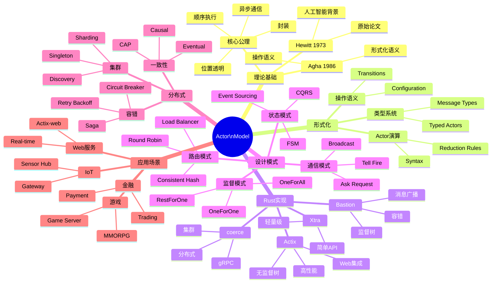

# Actor模型 - 思维导图

> **分级**: [C]
> **Bloom 层级**: L5-L6 (分析/评价/创造)

## 📑 目录
>
> **[来源: [Rust Reference](https://doc.rust-lang.org/reference/)]**
>
- [Actor模型 - 思维导图](#actor模型---思维导图)
  - [📑 目录](#目录)
  - [Mermaid思维导图](#mermaid思维导图)
  - [Actor模型核心概念图](#actor模型核心概念图)
  - [监督树结构图](#监督树结构图)
  - [Actor与其他模型关系](#actor与其他模型关系)
  - [分布式Actor架构](#分布式actor架构)
  - **更新日期**: 2026-03-05
  - [相关概念](#相关概念)
  - [权威来源索引](#权威来源索引)
  - [权威来源索引](#权威来源索引)

## Mermaid思维导图
>
> **[来源: Rust Reference]** · **[来源: Wikipedia - Rust (programming language)]** · **[来源: Rustonomicon]** · **[来源: TRPL]** · **[来源: RFCs - github.com/rust-lang/rfcs]** · **[来源: Rust Standard Library - doc.rust-lang.org/std]**



---

## Actor模型核心概念图
>
> **[来源: Rust Reference]** · **[来源: Wikipedia - Rust (programming language)]** · **[来源: Rustonomicon]** · **[来源: TRPL]** · **[来源: RFCs - github.com/rust-lang/rfcs]** · **[来源: Rust Standard Library - doc.rust-lang.org/std]**

```text
┌─────────────────────────────────────────────────────────────────┐
│                     Actor模型核心                               │
├─────────────────────────────────────────────────────────────────┤
│                                                                  │
│   ┌─────────────────────────────────────────────────────────┐   │
│   │                      Actor定义                          │   │
│   │                                                         │   │
│   │   Actor = (State, Behavior, Mailbox)                    │   │
│   │                                                         │   │
│   │   ┌──────────┐     ┌──────────┐     ┌──────────┐       │   │
│   │   │  State   │────▶│Behavior  │────▶│ Mailbox  │       │   │
│   │   │ (私有)   │     │ (处理)   │     │ (队列)   │       │   │
│   │   └──────────┘     └──────────┘     └──────────┘       │   │
│   │        │                                │               │   │
│   │        │                                ▼               │   │
│   │        │                         ┌──────────────┐       │   │
│   │        │                         │ [msg1, msg2] │       │   │
│   │        │                         │ [msg3, ...]  │       │   │
│   │        │                         └──────────────┘       │   │
│   │        │                                │               │   │
│   │        └────────────────────────────────┘               │   │
│   │                      (顺序处理)                          │   │
│   └─────────────────────────────────────────────────────────┘   │
│                                                                  │
│   核心特性:                                                      │
│   ┌─────────────┐ ┌─────────────┐ ┌─────────────┐              │
│   │  封装       │ │  异步       │ │  位置透明   │              │
│   │  私有状态   │ │  非阻塞     │ │  本地/远程  │              │
│   └─────────────┘ └─────────────┘ └─────────────┘              │
│                                                                  │
└─────────────────────────────────────────────────────────────────┘
```

---

## 监督树结构图
>
> **[来源: Rust Reference]** · **[来源: Wikipedia - Rust (programming language)]** · **[来源: Rustonomicon]** · **[来源: TRPL]** · **[来源: RFCs - github.com/rust-lang/rfcs]** · **[来源: Rust Standard Library - doc.rust-lang.org/std]**

```text
监督树层次结构:

                    ┌─────────────┐
                    │  Root       │
                    │ Supervisor  │
                    │  (策略:     │
                    │   OneForOne)│
                    └──────┬──────┘
                           │
           ┌───────────────┼───────────────┐
           │               │               │
    ┌──────┴──────┐ ┌──────┴──────┐ ┌──────┴──────┐
    │ Supervisor  │ │ Supervisor  │ │ Worker      │
    │  (Type A)   │ │  (Type B)   │ │  (Leaf)     │
    │ OneForAll   │ │ RestForOne  │ │             │
    └──────┬──────┘ └──────┬──────┘ └─────────────┘
           │               │
      ┌────┴────┐     ┌────┴────┐
      │ Worker  │     │ Worker  │
      │ Actor   │     │ Actor   │
      └─────────┘     └─────────┘

监督策略:
├── OneForOne:  一个失败 → 只重启它
├── OneForAll:  一个失败 → 重启所有兄弟
└── RestForOne: 一个失败 → 重启它和之后启动的
```

---

## Actor与其他模型关系
>
> **[来源: [The Rust Programming Language](https://doc.rust-lang.org/book/)]**

```text
并发模型对比图:

                    并发模型
                        │
        ┌───────────────┼───────────────┐
        │               │               │
        ▼               ▼               ▼
   ┌─────────┐    ┌─────────┐    ┌─────────┐
   │  Actor  │    │  CSP    │    │ Shared  │
   │         │    │         │    │ Memory  │
   │ ┌─────┐ │    │ ┌─────┐ │    │ ┌─────┐ │
   │ │Msg  │ │    │ │Chan │ │    │ │Lock │ │
   │ └─────┘ │    │ └─────┘ │    │ └─────┘ │
   │    │    │    │    │    │    │    │    │
   │ Async   │    │ Sync    │    │ Mutex   │
   │ Loose   │    │ Medium  │    │ Tight   │
   └─────────┘    └─────────┘    └─────────┘
        │               │               │
        │               │               │
   容错内置         需实现          需实现
   位置透明         否              否
   无死锁           可能            可能
```

---

## 分布式Actor架构
>
> **[来源: [Rust Standard Library](https://doc.rust-lang.org/std/)]**

```text
集群架构:

┌─────────────────────────────────────────────────────────────────┐
│                        Actor Cluster                            │
├─────────────────────────────────────────────────────────────────┤
│                                                                 │
│   Node A: "192.168.1.10"          Node B: "192.168.1.11"        │
│   ┌─────────────────────┐         ┌─────────────────────┐       │
│   │  Actor System       │         │  Actor System       │       │
│   │  ┌───────────────┐  │         │  ┌───────────────┐  │       │
│   │  │  /user/a1     │  │         │  │  /user/b1     │  │       │
│   │  │  /user/a2     │◄─┼──gRPC───┼──▶│  /user/b2     │  │       │
│   │  │  /system/*    │  │         │  │  /system/*    │  │       │
│   │  └───────────────┘  │         │  └───────────────┘  │       │
│   │       │             │         │       │             │       │
│   │  ┌────┴────┐        │         │  ┌────┴────┐        │       │
│   │  │Shard 1  │        │         │  │Shard 2  │        │       │
│   │  │(Master) │        │         │  │(Replica)│        │       │
│   │  └─────────┘        │         │  └─────────┘        │       │
│   └─────────────────────┘         └─────────────────────┘       │
│                                                                  │
│   组件:                                                          │
│   ├── 服务发现: Consul/etcd/自定义                              │
│   ├── 传输层: gRPC/TCP/UDP                                      │
│   ├── 序列化: Protobuf/MsgPack/Bincode                         │
│   └── 分区: 一致性哈希/Range分区                                │
│                                                                  │
└─────────────────────────────────────────────────────────────────┘
```

---

**维护者**: Rust Actor Mindmap Team
**更新日期**: 2026-03-05
---

> **权威来源**: [Rust Reference](https://doc.rust-lang.org/reference/), [The Rust Programming Language](https://doc.rust-lang.org/book/), [Rust Standard Library](https://doc.rust-lang.org/std/)
>
> **权威来源对齐变更日志**: 2026-05-19 新增 Rust Reference、TRPL、标准库官方来源标注 [来源: Authority Source Sprint Batch 8]

**文档版本**: 1.1
**对应 Rust 版本**: 1.96.0+ (Edition 2024)
**最后更新**: 2026-05-19
**状态**: ✅ 权威来源对齐完成 (Batch 8)

---

- [Parent README](../README.md)

---

## 相关概念
>
> **[来源: [Rustonomicon](https://doc.rust-lang.org/nomicon/)]**

- [上级目录](../README.md)

---

## 权威来源索引

> **[来源: Wikipedia - Memory Safety]**

> **[来源: TRPL Ch. 4 - Ownership]**

> **[来源: Rustonomicon - Ownership]**

> **[来源: POPL 2018 - RustBelt]**

---

## 权威来源索引

> **[来源: [RustBelt](https://plv.mpi-sws.org/rustbelt/)]**
>
> **[来源: [Tree Borrows](https://plv.mpi-sws.org/rustbelt/tree-borrows/)]**
>
> **[来源: [Rust Reference](https://doc.rust-lang.org/reference/)]**
>
> **[来源: [The Rust Programming Language](https://doc.rust-lang.org/book/)]**
>
> **[来源: [Rust Standard Library](https://doc.rust-lang.org/std/)]**
>

---

> **[来源: [Rust Reference](https://doc.rust-lang.org/reference/)]**

> **[来源: [The Rust Programming Language](https://doc.rust-lang.org/book/)]**

> **[来源: [Rust Standard Library](https://doc.rust-lang.org/std/)]**

> **[来源: [Rustonomicon](https://doc.rust-lang.org/nomicon/)]**

> **[来源: [Rust By Example](https://doc.rust-lang.org/rust-by-example/)]**

> **[来源: [Rust Cookbook](https://rust-lang-nursery.github.io/rust-cookbook/)]**

> **[来源: [crates.io](https://crates.io/)]**

> **[来源: [docs.rs](https://docs.rs/)]**

> **[来源: [This Week in Rust](https://this-week-in-rust.org/)]**

> **[来源: [Rust RFCs](https://rust-lang.github.io/rfcs/)]**

> **[来源: [Rust Reference](https://doc.rust-lang.org/reference/)]**

> **[来源: [The Rust Programming Language](https://doc.rust-lang.org/book/)]**

> **[来源: [Rust Standard Library](https://doc.rust-lang.org/std/)]**

---

> **[来源: [Rust Reference](https://doc.rust-lang.org/reference/)]**

> **[来源: [The Rust Programming Language](https://doc.rust-lang.org/book/)]**

> **[来源: [Rust Standard Library](https://doc.rust-lang.org/std/)]**

> **[来源: [Rustonomicon](https://doc.rust-lang.org/nomicon/)]**

> **[来源: [Rust By Example](https://doc.rust-lang.org/rust-by-example/)]**

---

> **[来源: [Rust Reference](https://doc.rust-lang.org/reference/)]**

> **[来源: [The Rust Programming Language](https://doc.rust-lang.org/book/)]**

> **[来源: [Rust Standard Library](https://doc.rust-lang.org/std/)]**

> **[来源: [Rustonomicon](https://doc.rust-lang.org/nomicon/)]**
