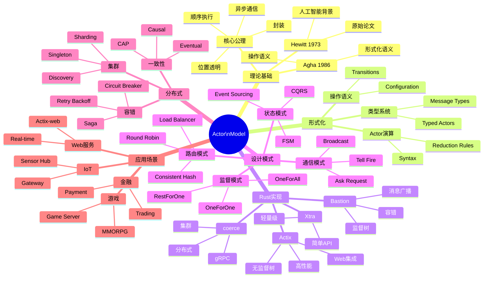

# Actor模型 - 思维导图

## Mermaid思维导图



---

## Actor模型核心概念图

```text
┌─────────────────────────────────────────────────────────────────┐
│                     Actor模型核心                               │
├─────────────────────────────────────────────────────────────────┤
│                                                                  │
│   ┌─────────────────────────────────────────────────────────┐   │
│   │                      Actor定义                          │   │
│   │                                                         │   │
│   │   Actor = (State, Behavior, Mailbox)                    │   │
│   │                                                         │   │
│   │   ┌──────────┐     ┌──────────┐     ┌──────────┐       │   │
│   │   │  State   │────▶│Behavior  │────▶│ Mailbox  │       │   │
│   │   │ (私有)   │     │ (处理)   │     │ (队列)   │       │   │
│   │   └──────────┘     └──────────┘     └──────────┘       │   │
│   │        │                                │               │   │
│   │        │                                ▼               │   │
│   │        │                         ┌──────────────┐       │   │
│   │        │                         │ [msg1, msg2] │       │   │
│   │        │                         │ [msg3, ...]  │       │   │
│   │        │                         └──────────────┘       │   │
│   │        │                                │               │   │
│   │        └────────────────────────────────┘               │   │
│   │                      (顺序处理)                          │   │
│   └─────────────────────────────────────────────────────────┘   │
│                                                                  │
│   核心特性:                                                      │
│   ┌─────────────┐ ┌─────────────┐ ┌─────────────┐              │
│   │  封装       │ │  异步       │ │  位置透明   │              │
│   │  私有状态   │ │  非阻塞     │ │  本地/远程  │              │
│   └─────────────┘ └─────────────┘ └─────────────┘              │
│                                                                  │
└─────────────────────────────────────────────────────────────────┘
```

---

## 监督树结构图

```text
监督树层次结构:

                    ┌─────────────┐
                    │  Root       │
                    │ Supervisor  │
                    │  (策略:     │
                    │   OneForOne)│
                    └──────┬──────┘
                           │
           ┌───────────────┼───────────────┐
           │               │               │
    ┌──────┴──────┐ ┌──────┴──────┐ ┌──────┴──────┐
    │ Supervisor  │ │ Supervisor  │ │ Worker      │
    │  (Type A)   │ │  (Type B)   │ │  (Leaf)     │
    │ OneForAll   │ │ RestForOne  │ │             │
    └──────┬──────┘ └──────┬──────┘ └─────────────┘
           │               │
      ┌────┴────┐     ┌────┴────┐
      │ Worker  │     │ Worker  │
      │ Actor   │     │ Actor   │
      └─────────┘     └─────────┘

监督策略:
├── OneForOne:  一个失败 → 只重启它
├── OneForAll:  一个失败 → 重启所有兄弟
└── RestForOne: 一个失败 → 重启它和之后启动的
```

---

## Actor与其他模型关系

```text
并发模型对比图:

                    并发模型
                        │
        ┌───────────────┼───────────────┐
        │               │               │
        ▼               ▼               ▼
   ┌─────────┐    ┌─────────┐    ┌─────────┐
   │  Actor  │    │  CSP    │    │ Shared  │
   │         │    │         │    │ Memory  │
   │ ┌─────┐ │    │ ┌─────┐ │    │ ┌─────┐ │
   │ │Msg  │ │    │ │Chan │ │    │ │Lock │ │
   │ └─────┘ │    │ └─────┘ │    │ └─────┘ │
   │    │    │    │    │    │    │    │    │
   │ Async   │    │ Sync    │    │ Mutex   │
   │ Loose   │    │ Medium  │    │ Tight   │
   └─────────┘    └─────────┘    └─────────┘
        │               │               │
        │               │               │
   容错内置         需实现          需实现
   位置透明         否              否
   无死锁           可能            可能
```

---

## 分布式Actor架构

```text
集群架构:

┌─────────────────────────────────────────────────────────────────┐
│                        Actor Cluster                            │
├─────────────────────────────────────────────────────────────────┤
│                                                                 │
│   Node A: "192.168.1.10"          Node B: "192.168.1.11"        │
│   ┌─────────────────────┐         ┌─────────────────────┐       │
│   │  Actor System       │         │  Actor System       │       │
│   │  ┌───────────────┐  │         │  ┌───────────────┐  │       │
│   │  │  /user/a1     │  │         │  │  /user/b1     │  │       │
│   │  │  /user/a2     │◄─┼──gRPC───┼──▶│  /user/b2     │  │       │
│   │  │  /system/*    │  │         │  │  /system/*    │  │       │
│   │  └───────────────┘  │         │  └───────────────┘  │       │
│   │       │             │         │       │             │       │
│   │  ┌────┴────┐        │         │  ┌────┴────┐        │       │
│   │  │Shard 1  │        │         │  │Shard 2  │        │       │
│   │  │(Master) │        │         │  │(Replica)│        │       │
│   │  └─────────┘        │         │  └─────────┘        │       │
│   └─────────────────────┘         └─────────────────────┘       │
│                                                                  │
│   组件:                                                          │
│   ├── 服务发现: Consul/etcd/自定义                              │
│   ├── 传输层: gRPC/TCP/UDP                                      │
│   ├── 序列化: Protobuf/MsgPack/Bincode                         │
│   └── 分区: 一致性哈希/Range分区                                │
│                                                                  │
└─────────────────────────────────────────────────────────────────┘
```

---

**维护者**: Rust Actor Mindmap Team
**更新日期**: 2026-03-05
