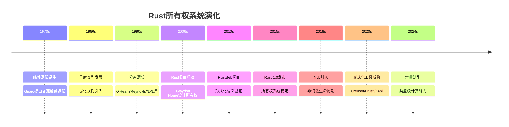
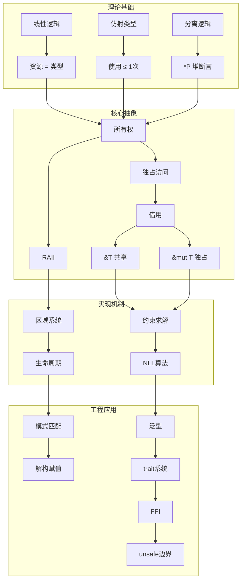
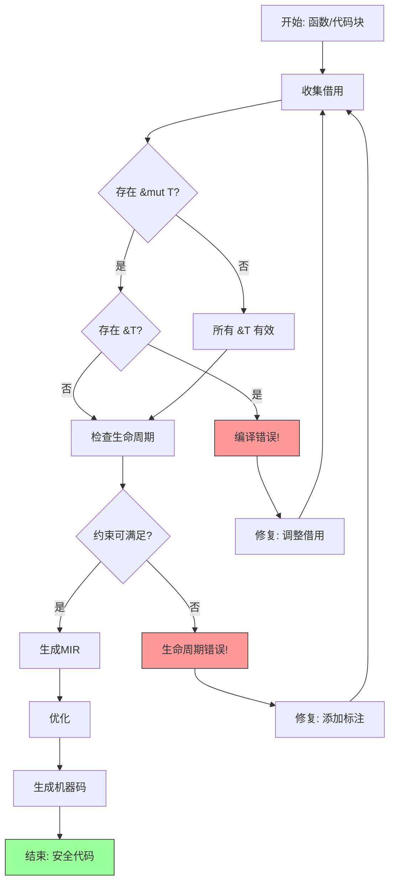
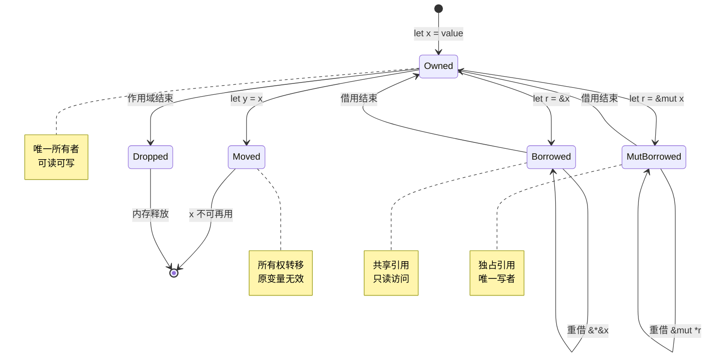
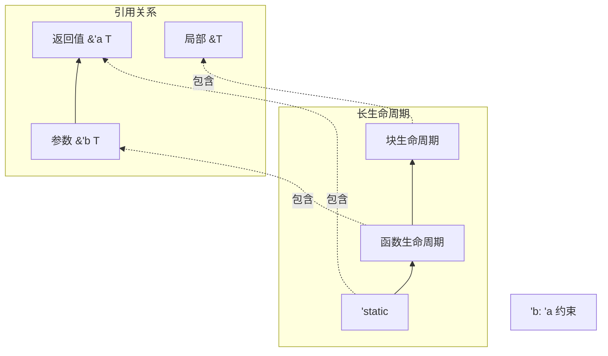

# Rust所有权与可判定性 - 可视化指南

本指南提供多种思维表征方式，帮助理解整个论证体系。

---

## 一、所有权系统演化时间线



---

## 二、概念层次结构图



---

## 三、安全保证层次金字塔

```text
                    ▲
                   /│\
                  / │ \
                 /  │  \        Level 4: 形式化验证
                /   │   \       (RustBelt定理证明)
               /────┼────\
              /     │      \     Level 3: 工具验证
             /      │       \    (Creusot/Kani)
            /───────┼────────\
           /        │         \  Level 2: 类型系统
          /         │          \ (编译器检查)
         /──────────┼───────────\
        /           │            \ Level 1: 运行时
       /            │             \ (panic/UB检测)
      /─────────────┼──────────────\
     /              │               \ Level 0: 硬件
    /               │                \ (内存保护)
   ───────────────────────────────────
```

### 各层说明

| 层级 | 机制 | 保证 | 失败模式 |
|:-----|:-----|:-----|:---------|
| L4 | 定理证明 | 数学正确性 | 证明错误 |
| L3 | 模型检测 | 属性满足 | 状态爆炸 |
| L2 | 类型检查 | 内存安全 | 编译错误 |
| L1 | 运行时检查 | 越界检测 | panic/崩溃 |
| L0 | MMU/保护 | 物理隔离 | 硬件故障 |

---

## 四、借用检查流程图



---

## 五、类型状态转换图



---

## 六、生命周期包含关系图



---

## 七、验证工具能力矩阵雷达图

```text
                    表达能力
                       5
                       │
                       │
        自动化 4 ─────┼───── 4 自动化
                    ╱ │ ╲
                 ╱   │   ╲
              ╱      │      ╲
     可用性 3 ────────┼──────── 3 可用性
              ╲      │      ╱
                 ╲   │   ╱
                    ╲ │ ╱
        性能 2 ─────┼───── 2 性能
                       │
                       │
                       1
                    覆盖范围

    RustBelt  ████████████████████  (4,2,3,4,4) 高表达,低自动
    Creusot   ████████████████     (4,3,3,3,4) 平衡
    Prusti    ██████████████       (3,4,4,3,3) 高自动
    Kani      ████████████         (3,4,4,2,3) 模型检测
    Miri      ██████████           (2,5,5,2,2) 运行时
    rustc     ████████████████     (3,5,5,3,3) 类型系统
```

---

## 八、案例研究分类树

```text
案例研究/
├── 嵌入式生态 (15个)
│   ├── 异步运行时
│   │   ├── embassy (静态任务)
│   │   └── rtic (实时调度)
│   ├── 网络协议
│   │   └── smoltcp (零拷贝TCP/IP)
│   ├── 存储
│   │   ├── embedded-storage
│   │   └── littlefs2 (断电安全)
│   ├── 硬件抽象
│   │   ├── nrf-hal
│   │   ├── stm32f4xx-hal
│   │   └── embedded-hal
│   └── 工具
│       ├── defmt
│       ├── panic-probe
│       └── probe-rs
│
└── 应用级生态 (24个)
    ├── Web/网络 (7个)
    │   ├── axum (类型安全路由)
    │   ├── actix-web (Actor模型)
    │   ├── tokio (异步运行时)
    │   ├── tower (服务组合)
    │   ├── hyper (HTTP实现)
    │   ├── reqwest (HTTP客户端)
    │   └── tonic (gRPC)
    ├── 数据库 (3个)
    │   ├── diesel (编译时SQL)
    │   ├── sqlx (宏验证)
    │   └── sea-orm (类型安全)
    ├── 并发原语 (5个)
    │   ├── rayon (数据并行)
    │   ├── crossbeam (无锁)
    │   ├── dashmap (分片锁)
    │   ├── parking_lot (紧凑锁)
    │   └── tokio-stream (流处理)
    ├── 异步基础设施 (4个)
    │   ├── async-trait
    │   ├── pin-project
    │   └── bytes
    ├── 序列化/CLI (2个)
    │   ├── serde
    │   └── clap
    ├── 错误处理/日志 (2个)
    │   ├── thiserror/anyhow
    │   └── tracing
    └── FFI/工具 (1个)
        ├── wasm-bindgen
        ├── pyo3
        └── chrono
```

---

## 九、学习路径图


---

## 十、核心定理汇总表

| 定理名称 | 领域 | 陈述 | 意义 |
|:---------|:-----|:-----|:-----|
| **所有权唯一性** | 核心 | ∀x: T. owner(x) = 1 | 内存安全基础 |
| **借用互斥** | 借用 | &mut T ⟹ ¬&T | 防止数据竞争 |
| **生命周期包含** | 区域 | 'a: 'b ⟹ 'a ≥ 'b | 引用有效性 |
| **NLL可判定性** | 算法 | 借用检查 ∈ P | 编译可行性 |
| **RustBelt安全性** | 形式化 | Rust ⊨ memory safety | 数学保证 |
| **零成本抽象** | 性能 | 静态检查 → 0运行时开销 | 效率保证 |

---

## 十一、反模式检测决策树

```text
                    ┌─────────────────────────┐
                    │     编译错误？           │
                    └───────────┬─────────────┘
                                │
              ┌─────────────────┼─────────────────┐
              │borrow checker    │lifetime           │其他
              ▼                  ▼                  ▼
    ┌──────────────────┐ ┌──────────────┐ ┌─────────────────┐
    │ 同时持有&和&mut？ │ │ 'a vs 'static │ │ 类型不匹配      │
    └────────┬─────────┘ └──────┬───────┘ └────────┬────────┘
             │                  │                  │
    ┌────────┴────────┐  ┌──────┴──────┐  ┌────────┴────────┐
    │是                │否 │需要更长生长期 │ │ 检查trait实现   │
    ▼                  ▼  ▼             │否 ▼                 │
┌──────────┐    ┌──────────┐  ┌────────┴────────┐  ┌─────────┴───┐
│ 重构访问  │    │ 检查     │  │ 显式标注        │  │ 添加derive  │
│ 模式      │    │ 借用     │  │ 生命周期        │  │ 或impl      │
│ 分离读写  │    │ 顺序     │  │                 │  │             │
└──────────┘    └──────────┘  └─────────────────┘  └─────────────┘
```

---

## 十二、资源与进一步阅读

| 主题 | 推荐资源 |
|:-----|:---------|
| 理论基础 | TAPL (Types and Programming Languages) |
| 线性逻辑 | Girard's "Linear Logic" |
| 分离逻辑 | O'Hearn's papers on Separation Logic |
| RustBelt | POPL 2018 paper |
| 实践指南 | The Rust Programming Language (Book) |
| 高级主题 | Rust for Rustaceans |
| 形式化工具 | Creusot tutorial, Prusti user guide |
