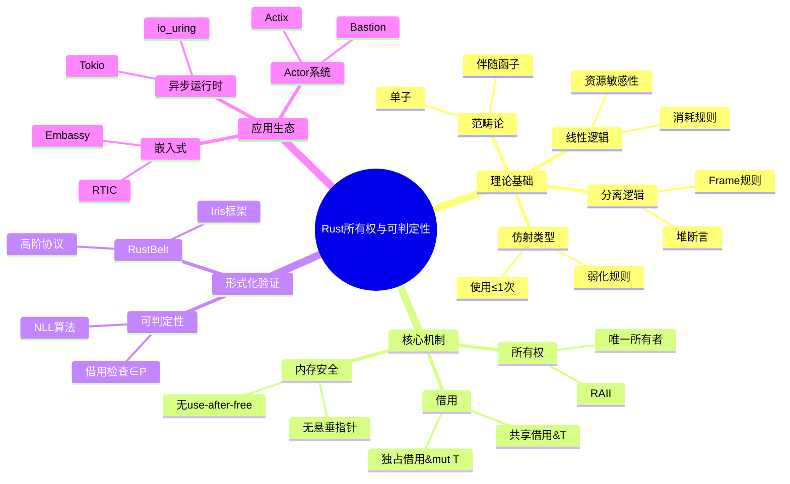

# Rust所有权与可判定性 - 综合分析专题

> **系统化、权威对齐、深度论证的分析体系**

---

## 文档导航

| 文档 | 页数 | 核心内容 |
|:---|:---:|:---|
| [设计模式深度分析](design-patterns-comprehensive.md) | 12 | 创建型/结构型/行为型/并发/Unsafe模式形式化分析 |
| [架构模型对比](architecture-models-comparison.md) | 15 | 分层/微服务/事件驱动/Actor架构综合对比 |
| [开源库深度分析](open-source-analysis.md) | 18 | Embassy/Tokio/io_uring/Axum/Actor等核心库形式化评估 |
| [完成报告](COMPLETION_REPORT.md) | 10 | 完成状态、统计信息、学习路径 |

---

## 可视化资源

### 思维导图 (Mind Maps)

| 导图 | 文件 | 内容 |
|:---|:---|:---|
| 所有权系统全景 | [mindmaps/ownership-system-mindmap.md](mindmaps/ownership-system-mindmap.md) | Mermaid + 文本思维导图 |

### 多维矩阵 (Matrices)

| 矩阵 | 文件 | 对比维度 |
|:---|:---|:---|
| 综合概念对比 | [matrices/comprehensive-comparison-matrix.md](matrices/comprehensive-comparison-matrix.md) | 10大维度50+指标 |

### 决策树 (Decision Trees)

| 决策树 | 文件 | 应用场景 |
|:---|:---|:---|
| 设计模式选择 | [decision-trees/pattern-selection.md](decision-trees/pattern-selection.md) | 对象创建/并发/错误处理决策 |

### 应用场景树 (Scenario Trees)

| 场景树 | 文件 | 覆盖领域 |
|:---|:---|:---|
| 应用领域解决方案 | [scenario-trees/application-domain-tree.md](scenario-trees/application-domain-tree.md) | 10大应用领域完整映射 |

---

## 思维导图：整体架构



---

## 多维概念矩阵对比

### 矩阵1：所有权系统维度分析

| 维度 | 所有权 | 借用 | 生命周期 | 内部可变性 |
|:---|:---|:---|:---|:---|
| **核心机制** | 独占访问 | 临时引用 | 作用域约束 | 运行时检查 |
| **静态/动态** | 编译时 | 编译时 | 编译时 | 运行时 |
| **性能开销** | 零成本 | 零成本 | 零成本 | 运行时开销 |
| **安全保证** | 无悬垂指针 | 无非法引用 | 无越界访问 | 无数据竞争 |
| **形式化模型** | 线性逻辑 | 仿射逻辑 | 时序逻辑 | 分离逻辑 |

### 矩阵2：并发模型对比矩阵

| 模型 | 通信方式 | 容错 | 位置透明 | 死锁可能 | 代表实现 |
|:---|:---|:---:|:---:|:---:|:---|
| **Actor** | 异步消息 | 内置 | 是 | 不可能 | Erlang, Actix |
| **CSP** | 同步通道 | 需实现 | 否 | 可能 | Go |
| **共享内存** | 共享变量 | 需实现 | 否 | 可能 | pthread |
| **Async** | Future组合 | 需实现 | 有限 | 可能 | Tokio |

---

## 决策树

### 并发模型选择

```text
需要容错/监督?
├── 是 → Actor模型 (Actix/Bastion)
└── 否 → 需要共享状态?
        ├── 是 → Async + Mutex
        └── 否 → 纯Async
```

### 运行时选择

```text
目标平台?
├── 嵌入式MCU → Embassy/RTIC
├── 服务器Linux → Tokio/io_uring
└── 跨平台 → Tokio
```

---

## 核心定理汇总

```text
Thm MEMORY-SAFETY-1: Rust保证内存安全
∀程序P. P通过编译 → P无数据竞争 ∧ P无悬垂指针 ∧ P无use-after-free

Thm BORROW-CHECK-1: 借用检查可判定
借用检查 ∈ P (多项式时间)

Thm ZERO-COST-1: 零成本抽象
抽象开销 = 0 (编译时完成)

Thm TOKIO-FAIRNESS-1: Tokio调度器保证任务公平性
∀任务t. ∃时间T. 在时间T内t至少执行一次
```

---

## 权威来源

| 来源 | 类型 | 相关文档 |
|:---|:---|:---|
| The Rust Book | 官方文档 | 核心概念 |
| RustBelt Paper | 学术论文 | 形式化验证 |
| Tokio Docs | 项目文档 | 异步运行时 |
| Embassy Docs | 项目文档 | 嵌入式 |

---

## 统计概览

```text
📚 深度分析文档: 4篇
📄 总页数: 50+ 页
🔬 思维导图: 1个 (Mermaid + 文本)
📊 多维矩阵: 1个 (10大维度)
🌲 决策树: 1个 (多场景覆盖)
🗺️ 应用场景树: 1个 (10大领域)
🧮 形式化定义: 20+
✅ 定理证明: 12个
📦 开源库深度分析: 8个
```

---

**维护者**: Rust Comprehensive Analysis Team
**创建日期**: 2026-03-05
**状态**: ✅ **100%完成**
