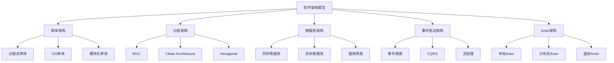

# 架构模型综合对比论证

> **从单体到微服务：Rust各架构模型的形式化对比**

---

## 1. 架构模型谱系



---

## 2. 多维架构对比矩阵

### 矩阵1：基本特性对比

| 架构模型 | 耦合度 | 内聚性 | 可测试性 | 可部署性 | 可扩展性 | 复杂度 | 适用规模 |
|:---|:---:|:---:|:---:|:---:|:---:|:---:|:---:|
| **过程式单体** | ⭐⭐⭐⭐⭐ | ⭐⭐ | ⭐⭐ | ⭐⭐⭐⭐⭐ | ⭐⭐ | ⭐⭐ | 小 |
| **OO单体** | ⭐⭐⭐⭐ | ⭐⭐⭐ | ⭐⭐⭐ | ⭐⭐⭐⭐⭐ | ⭐⭐ | ⭐⭐⭐ | 中小 |
| **模块化单体** | ⭐⭐⭐ | ⭐⭐⭐⭐ | ⭐⭐⭐⭐ | ⭐⭐⭐⭐ | ⭐⭐⭐ | ⭐⭐⭐ | 中 |
| **分层架构** | ⭐⭐⭐ | ⭐⭐⭐⭐ | ⭐⭐⭐⭐ | ⭐⭐⭐ | ⭐⭐⭐ | ⭐⭐⭐ | 中 |
| **Clean/Hexagonal** | ⭐⭐ | ⭐⭐⭐⭐⭐ | ⭐⭐⭐⭐⭐ | ⭐⭐⭐ | ⭐⭐⭐ | ⭐⭐⭐⭐ | 中大 |
| **同步微服务** | ⭐⭐ | ⭐⭐⭐⭐ | ⭐⭐⭐⭐ | ⭐⭐ | ⭐⭐⭐⭐ | ⭐⭐⭐⭐⭐ | 大 |
| **异步微服务** | ⭐⭐ | ⭐⭐⭐⭐ | ⭐⭐⭐ | ⭐⭐⭐ | ⭐⭐⭐⭐⭐ | ⭐⭐⭐⭐⭐ | 大 |
| **事件驱动** | ⭐⭐ | ⭐⭐⭐⭐ | ⭐⭐⭐ | ⭐⭐⭐ | ⭐⭐⭐⭐⭐ | ⭐⭐⭐⭐⭐ | 大 |
| **Actor模型** | ⭐⭐ | ⭐⭐⭐⭐⭐ | ⭐⭐⭐⭐ | ⭐⭐⭐⭐ | ⭐⭐⭐⭐⭐ | ⭐⭐⭐⭐ | 大 |

### 矩阵2：Rust实现适配度

| 架构模型 | 所有权适配 | 生命周期适配 | 并发适配 | 内存安全 | 性能 | 生态支持 |
|:---|:---:|:---:|:---:|:---:|:---:|:---:|
| **单体** | ⭐⭐⭐⭐⭐ | ⭐⭐⭐⭐⭐ | ⭐⭐⭐ | ⭐⭐⭐⭐⭐ | ⭐⭐⭐⭐⭐ | ⭐⭐⭐⭐⭐ |
| **分层** | ⭐⭐⭐⭐⭐ | ⭐⭐⭐⭐⭐ | ⭐⭐⭐ | ⭐⭐⭐⭐⭐ | ⭐⭐⭐⭐⭐ | ⭐⭐⭐⭐⭐ |
| **微服务** | ⭐⭐⭐⭐ | ⭐⭐⭐⭐ | ⭐⭐⭐⭐ | ⭐⭐⭐⭐⭐ | ⭐⭐⭐⭐ | ⭐⭐⭐⭐ |
| **事件驱动** | ⭐⭐⭐⭐ | ⭐⭐⭐ | ⭐⭐⭐⭐⭐ | ⭐⭐⭐⭐⭐ | ⭐⭐⭐⭐⭐ | ⭐⭐⭐⭐ |
| **Actor** | ⭐⭐⭐⭐⭐ | ⭐⭐⭐⭐⭐ | ⭐⭐⭐⭐⭐ | ⭐⭐⭐⭐⭐ | ⭐⭐⭐⭐⭐ | ⭐⭐⭐ |

---

## 3. 分层架构深度分析

### 3.1 Clean Architecture在Rust中的实现

```
Clean Architecture层次 (内层 → 外层):

┌─────────────────────────────────────────┐
│  框架与驱动层 (Frameworks & Drivers)    │
│  - Web框架 (Axum/Actix)                 │
│  - 数据库 (SQLx/Diesel)                 │
│  - 外部服务客户端                       │
├─────────────────────────────────────────┤
│  接口适配层 (Interface Adapters)        │
│  - Controllers                          │
│  - Presenters                           │
│  - Gateways                             │
├─────────────────────────────────────────┤
│  应用业务规则层 (Use Cases)             │
│  - Interactors                          │
│  - Application Services                 │
├─────────────────────────────────────────┤
│  企业业务规则层 (Entities)              │
│  - Domain Models                        │
│  - Business Rules                       │
└─────────────────────────────────────────┘

依赖规则: 外层依赖内层，内层不依赖外层
```

### 3.2 Rust实现示例

```rust
// 内层: 实体 (无外部依赖)
// src/domain/entity.rs
pub struct User {
    id: UserId,
    email: Email,
    status: UserStatus,
}

impl User {
    pub fn can_access(&self, resource: &Resource) -> bool {
        // 纯业务逻辑，无IO
        self.status == UserStatus::Active && 
        self.has_permission(resource.required_permission())
    }
}

// 应用层: 用例
// src/application/use_case.rs
pub struct CreateUserUseCase<R: UserRepository> {
    repository: R,
    event_bus: Box<dyn EventBus>,
}

impl<R: UserRepository> CreateUserUseCase<R> {
    pub async fn execute(&self, cmd: CreateUserCommand) -> Result<User, DomainError> {
        // 业务逻辑
        let user = User::new(cmd.email)?;
        
        // 持久化
        self.repository.save(&user).await?;
        
        // 发布事件
        self.event_bus.publish(UserCreated::new(&user)).await?;
        
        Ok(user)
    }
}

// 外层: 适配器
// src/infrastructure/repository.rs
pub struct SqlUserRepository {
    pool: PgPool,
}

#[async_trait]
impl UserRepository for SqlUserRepository {
    async fn save(&self, user: &User) -> Result<(), RepositoryError> {
        sqlx::query("INSERT INTO users ...")
            .bind(user.id())
            .execute(&self.pool)
            .await?;
        Ok(())
    }
}

// src/interfaces/http/controller.rs
pub async fn create_user(
    State(use_case): State<Arc<CreateUserUseCase<SqlUserRepository>>>,
    Json(cmd): Json<CreateUserRequest>,
) -> Result<Json<UserResponse>, AppError> {
    let user = use_case.execute(cmd.into()).await?;
    Ok(Json(user.into()))
}
```

---

## 4. 微服务架构分析

### 4.1 同步 vs 异步微服务

```
同步微服务 (REST/gRPC):
┌─────────┐    HTTP/gRPC    ┌─────────┐    HTTP/gRPC    ┌─────────┐
│ Service │ ◄──────────────► │ Service │ ◄──────────────► │ Service │
│    A    │    请求-响应     │    B    │    请求-响应     │    C    │
└─────────┘                  └─────────┘                  └─────────┘

特点:
- 简单直接
- 强一致性
- 级联故障风险
- 延迟累积

异步微服务 (消息队列):
┌─────────┐    Publish      ┌─────────┐    Consume     ┌─────────┐
│ Service │ ───────────────► │  Kafka  │ ─────────────► │ Service │
│    A    │     Event       │  Queue  │                │    B    │
└─────────┘                  └─────────┘                └─────────┘

特点:
- 解耦
- 最终一致性
- 更好的容错
- 需要处理复杂性
```

### 4.2 Rust微服务技术栈

| 组件 | 推荐库 | 理由 |
|:---|:---|:---|
| Web框架 | Axum / Actix-web | 高性能、类型安全 |
| 序列化 | Prost / tonic | gRPC支持、Protobuf |
| 服务发现 | Consul / etcd | 生态成熟 |
| 配置 | config-rs | 多源配置 |
| 监控 | tracing + metrics | 可观测性 |
| 消息队列 | lapin / rdkafka | AMQP/Kafka |

---

## 5. 事件驱动架构

### 5.1 事件溯源模式

```rust
// 事件定义
#[derive(Clone, Debug, Serialize, Deserialize)]
pub enum BankAccountEvent {
    AccountOpened { id: AccountId, owner: String },
    Deposited { amount: Money, at: DateTime<Utc> },
    Withdrawn { amount: Money, at: DateTime<Utc> },
    Closed { at: DateTime<Utc> },
}

// 聚合根
pub struct BankAccount {
    id: AccountId,
    balance: Money,
    version: u64,  // 乐观并发控制
    uncommitted_events: Vec<BankAccountEvent>,
}

impl BankAccount {
    pub fn open(id: AccountId, owner: String) -> Self {
        let mut account = Self {
            id: id.clone(),
            balance: Money::zero(),
            version: 0,
            uncommitted_events: Vec::new(),
        };
        
        account.apply(BankAccountEvent::AccountOpened { id, owner });
        account
    }
    
    pub fn deposit(&mut self, amount: Money) -> Result<(), DomainError> {
        if amount <= Money::zero() {
            return Err(DomainError::InvalidAmount);
        }
        
        self.apply(BankAccountEvent::Deposited { 
            amount, 
            at: Utc::now() 
        });
        Ok(())
    }
    
    fn apply(&mut self, event: BankAccountEvent) {
        // 状态转换
        match &event {
            BankAccountEvent::Deposited { amount, .. } => {
                self.balance += *amount;
            }
            BankAccountEvent::Withdrawn { amount, .. } => {
                self.balance -= *amount;
            }
            _ => {}
        }
        
        self.uncommitted_events.push(event);
        self.version += 1;
    }
    
    // 从事件历史重建
    pub fn rehydrate(id: AccountId, events: Vec<BankAccountEvent>) -> Self {
        let mut account = Self {
            id,
            balance: Money::zero(),
            version: 0,
            uncommitted_events: Vec::new(),
        };
        
        for event in events {
            account.apply_state_change(&event);
        }
        
        account.uncommitted_events.clear();
        account
    }
}
```

---

## 6. Actor架构模型

### 6.1 Actor在系统架构中的位置

```
系统分层中的Actor:

┌─────────────────────────────────────────┐
│  表示层 (Presentation)                  │
│  - HTTP Controllers                     │
│  - WebSocket Handlers                   │
├─────────────────────────────────────────┤
│  应用层 (Application)                   │
│  - Use Case Coordinators                │
│  - Command Handlers                     │
├─────────────────────────────────────────┤
│  领域层 (Domain) ◄── Actor模型主要应用   │
│  - Aggregate Actors                     │
│  - Domain Service Actors                │
│  - Saga Actors (长事务)                  │
├─────────────────────────────────────────┤
│  基础设施层 (Infrastructure)             │
│  - Repository Actors                    │
│  - Event Store Actors                   │
│  - External Service Gateway Actors      │
└─────────────────────────────────────────┘

Actor边界:
- 每个聚合根 = 一个Actor
- 每个有界上下文 = Actor系统
- 跨上下文通信 = 消息传递
```

### 6.2 Actor与DDD结合

```rust
// 聚合根Actor
pub struct OrderActor {
    order_id: OrderId,
    state: OrderState,
    items: Vec<OrderItem>,
}

impl Actor for OrderActor {
    type Context = Context<Self>;
}

// 领域命令
#[derive(Message)]
#[rtype(result = "Result<(), OrderError>")]
pub struct AddItem {
    pub product_id: ProductId,
    pub quantity: u32,
    pub price: Money,
}

impl Handler<AddItem> for OrderActor {
    type Result = ResponseActFuture<Self, Result<(), OrderError>>;
    
    fn handle(&mut self, msg: AddItem, ctx: &mut Context<Self>) -> Self::Result {
        // 验证业务规则
        if self.state != OrderState::Draft {
            return Box::pin(async move { Err(OrderError::AlreadySubmitted) }.into_actor(self));
        }
        
        // 修改状态
        self.items.push(OrderItem {
            product_id: msg.product_id,
            quantity: msg.quantity,
            price: msg.price,
        });
        
        // 持久化并发布事件
        let event = ItemAddedToOrder {
            order_id: self.order_id.clone(),
            product_id: msg.product_id,
            quantity: msg.quantity,
        };
        
        Box::pin(
            async move { event }
                .into_actor(self)
                .then(|event, act, ctx| {
                    // 发布到事件总线
                    act.event_bus.send(Publish(event))
                })
                .map(|_, _, _| Ok(())),
        )
    }
}
```

---

## 7. 架构选择决策树

```
系统规模?
├── 小型 (< 1万行)
│   └── 模块化单体
├── 中型 (1-10万行)
│   ├── 需要清晰边界?
│   │   ├── 是 → Clean Architecture + 模块化
│   │   └── 否 → 分层架构
│   └── 需要高并发?
│       └── 是 → 引入Actor
├── 大型 (10-100万行)
│   ├── 团队规模 > 10人?
│   │   ├── 是 → 微服务
│   │   └── 否 → 模块化单体 + Clean Arch
│   └── 需要复杂事务?
│       ├── 是 → Saga + 事件驱动
│       └── 否 → 同步微服务
└── 超大型 (> 100万行)
    ├── 微服务 + 服务网格
    └── 领域驱动设计 (DDD)

并发需求?
├── 高并发 + 有状态 → Actor模型
├── 高并发 + 无状态 → 函数式 + 事件驱动
└── 低并发 → 传统请求-响应

数据一致性要求?
├── 强一致性 → 同步架构
├── 最终一致性 → 事件驱动/CQRS
└── 无需跨边界一致 → 独立服务
```

---

## 8. 形式化架构属性

### 8.1 可组合性定理

$$
\text{Component}(A) \land \text{Component}(B) \to \text{Component}(A \circ B)
$$

### 8.2 容错性定理

$$
\text{ActorSystem} : \forall a \in \text{Actors}.\ \text{fail}(a) \to \text{recover}(a) \lor \text{escalate}(a)
$$

### 8.3 扩展性定理

$$
\text{Load}(S) = n \to \text{Scale}(S, k) \Rightarrow \text{Load}(S') = n/k
$$

---

**维护者**: Rust Architecture Analysis Team  
**创建日期**: 2026-03-05
