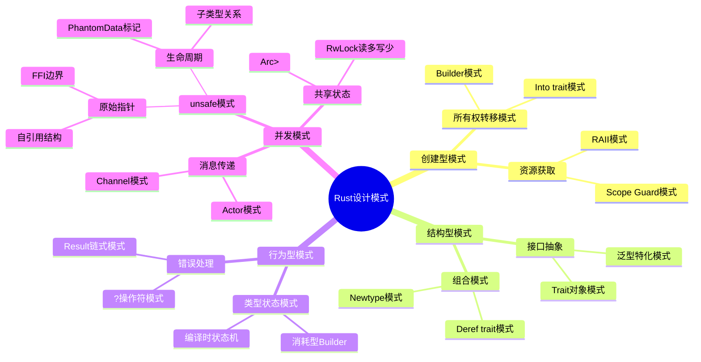

# Rust设计模式综合论证

> **基于所有权系统的模式语言：从GoF到Rust特有的模式**

---

## 1. 模式分类体系

### 1.1 思维导图：Rust设计模式全景



---

## 2. 创建型模式

### 2.1 Into Trait模式 (所有权转移)

**问题**: 如何优雅地实现类型转换同时转移所有权？

**解决方案**: 使用`Into` trait进行类型转换

```rust
// 定义
pub trait Into<T>: Sized {
    fn into(self) -> T;
}

// 应用示例
struct Config {
    timeout: Duration,
    retries: u32,
}

// 从元组转换
impl Into<Config> for (u64, u32) {
    fn into(self) -> Config {
        Config {
            timeout: Duration::from_secs(self.0),
            retries: self.1,
        }
    }
}

// 使用
let config: Config = (30, 3).into();
```

**形式化定义**:

$$
\text{Into}<T> : \text{Self} \to T \text{ where } \text{self consumed}
$$

**定理 INTO-SAFETY-1**: Into转换保持所有权安全

$$
\forall x: S.\ x \text{ owned} \land x.into(): T \to \text{x ownership transferred}
$$

### 2.2 Builder模式 (分阶段构造)

**变体1: 消耗型Builder (所有权严格)**:

```rust
pub struct HttpRequestBuilder {
    url: Option<String>,
    method: Option<Method>,
    headers: HeaderMap,
}

impl HttpRequestBuilder {
    pub fn new() -> Self {
        Self {
            url: None,
            method: None,
            headers: HeaderMap::new(),
        }
    }

    pub fn url(mut self, url: impl Into<String>) -> Self {
        self.url = Some(url.into());
        self
    }

    pub fn method(mut self, method: Method) -> Self {
        self.method = Some(method);
        self
    }

    pub fn build(self) -> Result<HttpRequest, BuilderError> {
        Ok(HttpRequest {
            url: self.url.ok_or(BuilderError::MissingUrl)?,
            method: self.method.unwrap_or(Method::GET),
            headers: self.headers,
        })
    }
}

// 使用
let request = HttpRequestBuilder::new()
    .url("https://api.example.com")
    .method(Method::POST)
    .build()?;
```

**变体2: 类型状态Builder (编译时验证)**:

```rust
// 使用类型状态确保正确构建顺序
pub struct HttpRequestBuilder<State> {
    url: State::Url,
    method: Option<Method>,
    _phantom: PhantomData<State>,
}

pub struct NoUrl;
pub struct HasUrl(String);

trait BuilderState {
    type Url;
}

impl BuilderState for NoUrl {
    type Url = ();
}

impl BuilderState for HasUrl {
    type Url = String;
}

impl HttpRequestBuilder<NoUrl> {
    pub fn new() -> Self {
        Self {
            url: (),
            method: None,
            _phantom: PhantomData,
        }
    }

    pub fn url(self, url: impl Into<String>) -> HttpRequestBuilder<HasUrl> {
        HttpRequestBuilder {
            url: url.into(),
            method: self.method,
            _phantom: PhantomData,
        }
    }
}

impl HttpRequestBuilder<HasUrl> {
    pub fn build(self) -> HttpRequest {
        HttpRequest {
            url: self.url,
            method: self.method.unwrap_or(Method::GET),
        }
    }
}

// 编译时保证：必须先调用url()
let request = HttpRequestBuilder::new()
    // .build() // 编译错误！NoUrl状态没有build方法
    .url("https://api.example.com")
    .build(); // 正确！HasUrl状态有build方法
```

---

## 3. 结构型模式

### 3.1 Newtype模式 (零成本抽象)

**问题**: 如何为现有类型添加语义同时保持性能？

**解决方案**: 元组结构体包装

```rust
// 基本Newtype
pub struct UserId(u64);
pub struct OrderId(u64);

// 防止混淆
fn find_user(id: UserId) -> Option<User> {}
fn find_order(id: OrderId) -> Option<Order> {}

// 编译时错误！
// find_user(OrderId(123)); // 类型不匹配

// 实现Deref以访问内部方法
impl std::ops::Deref for UserId {
    type Target = u64;
    fn deref(&self) -> &Self::Target { &self.0 }
}
```

**定理 NEWTYPE-ZERO-COST-1**: Newtype是零成本抽象

$$
\text{struct Wrapper}(T) \equiv T \text{ at runtime}
$$

### 3.2 Deref多态模式

**问题**: 如何在保持封装的同时提供透明访问？

```rust
pub struct SmartBuffer {
    inner: Vec<u8>,
    modified: bool,
}

impl Deref for SmartBuffer {
    type Target = [u8];

    fn deref(&self) -> &Self::Target {
        &self.inner
    }
}

impl DerefMut for SmartBuffer {
    fn deref_mut(&mut self) -> &mut Self::Target {
        self.modified = true;
        &mut self.inner
    }
}

// 使用：像普通切片一样使用，但自动跟踪修改
let mut buf = SmartBuffer::new();
buf.extend_from_slice(b"data"); // 通过DerefMut，modified = true
```

---

## 4. 行为型模式

### 4.1 类型状态模式 (编译时状态机)

**问题**: 如何在编译时确保状态转换正确？

```rust
// TCP连接状态机
pub struct TcpConnection<State> {
    socket: TcpStream,
    _state: PhantomData<State>,
}

pub struct Disconnected;
pub struct Connected;
pub struct Listening;

impl TcpConnection<Disconnected> {
    pub fn connect(addr: &str) -> Result<TcpConnection<Connected>, Error> {
        Ok(TcpConnection {
            socket: TcpStream::connect(addr)?,
            _state: PhantomData,
        })
    }

    pub fn bind(addr: &str) -> Result<TcpConnection<Listening>, Error> {
        // ...
    }
}

impl TcpConnection<Listening> {
    pub fn accept(self) -> Result<TcpConnection<Connected>, Error> {
        // ...
    }
}

impl TcpConnection<Connected> {
    pub fn send(&mut self, data: &[u8]) -> Result<usize, Error> {
        self.socket.write(data)
    }

    pub fn receive(&mut self, buf: &mut [u8]) -> Result<usize, Error> {
        self.socket.read(buf)
    }

    pub fn close(self) -> TcpConnection<Disconnected> {
        // ...
    }
}

// 编译时保证正确性
let conn = TcpConnection::connect("127.0.0.1:8080")?;
// conn.accept(); // 编译错误！Connected状态没有accept方法
conn.send(b"hello")?; // 正确！
```

**形式化定义**:

$$
\text{StateMachine} = \sum_{s \in \text{States}} \text{Connection}<s> \times \text{ValidTransitions}(s)
$$

**定理 TYPESTATE-SAFETY-1**: 类型状态模式在编译时防止无效状态转换

$$
\forall s_1, s_2.\ \text{no transition}(s_1, s_2) \to \text{compile\_error}
$$

---

## 5. 并发模式

### 5.1 `Arc<Mutex<T>>`模式 (共享可变状态)

**问题**: 如何在多线程间安全共享可变状态？

```rust
use std::sync::{Arc, Mutex};
use std::thread;

// 共享计数器
let counter = Arc::new(Mutex::new(0));
let mut handles = vec![];

for _ in 0..10 {
    let counter = Arc::clone(&counter);
    let handle = thread::spawn(move || {
        let mut num = counter.lock().unwrap();
        *num += 1;
    });
    handles.push(handle);
}

for handle in handles {
    handle.join().unwrap();
}

println!("Result: {}", *counter.lock().unwrap());
```

**形式化分析**:

$$
\text{Arc}<\text{Mutex}<T>> : \text{Send} + \text{Sync} \text{ when } T: \text{Send}
$$

$$
\text{lock}() : \text{Mutex}<T> \to \text{MutexGuard}<T> \text{ (RAII解锁)}
$$

### 5.2 Channel模式 (消息传递)

**问题**: 如何避免共享状态？

```rust
use std::sync::mpsc;
use std::thread;

// 创建通道
let (tx, rx) = mpsc::channel();

// 生产者线程
thread::spawn(move || {
    for i in 0..10 {
        tx.send(i).unwrap();
    }
});

// 消费者
for received in rx {
    println!("Got: {}", received);
}
```

**定理 CHANNEL-ISOLATION-1**: 通道保证所有权转移，无数据竞争

$$
\text{send} : T \to \text{Receiver} \text{ (ownership transferred)}
$$

---

## 6. Unsafe模式

### 6.1 自引用结构模式

**问题**: 如何安全创建自引用结构？

```rust
use std::pin::Pin;
use std::marker::PhantomPinned;

pub struct SelfReferential {
    data: String,
    // 指向data的指针
    ptr_to_data: *const String,
    // 防止Unpin自动实现
    _pin: PhantomPinned,
}

impl SelfReferential {
    pub fn new(data: String) -> Pin<Box<Self>> {
        let mut boxed = Box::pin(Self {
            data,
            ptr_to_data: std::ptr::null(),
            _pin: PhantomPinned,
        });

        // 初始化自引用指针
        let ptr = &boxed.data as *const String;
        unsafe {
            let mut_ref = Pin::as_mut(&mut boxed);
            Pin::get_unchecked_mut(mut_ref).ptr_to_data = ptr;
        }

        boxed
    }

    pub fn data_ref(self: Pin<&Self>) -> &String {
        unsafe { &*self.ptr_to_data }
    }
}
```

**安全证明**:

```text
Pin<Box<Self>>保证:
1. 堆分配，地址稳定
2. Pin防止移动
3. ptr_to_data始终有效
```

---

## 7. 模式选择决策树

```text
需要创建复杂对象?
├── 是 → 构造过程多步骤?
│       ├── 是 → 需要编译时验证顺序?
│       │       ├── 是 → 类型状态Builder
│       │       └── 否 → 消耗型Builder
│       └── 否 → 需要类型转换?
│               ├── 是 → Into trait模式
│               └── 否 → 直接构造
└── 否 → 需要添加语义?
        ├── 是 → Newtype模式
        └── 否 → 直接使用

需要并发?
├── 是 → 需要共享状态?
│       ├── 是 → 读多写少?
│       │       ├── 是 → RwLock
│       │       └── 否 → Mutex
│       └── 否 → Channel模式
└── 否 → 单线程

需要状态机?
├── 是 → 状态转换复杂?
│       ├── 是 → 类型状态模式
│       └── 否 → Enum + Match
└── 否 → 直接实现
```

---

## 8. 模式与所有权的关系

| 模式 | 所有权策略 | 借用策略 | 典型应用 |
|:---|:---|:---|:---|
| Builder | 分阶段转移 | 临时可变借用 | 复杂对象构造 |
| Into | 完全转移 | 无 | 类型转换 |
| Newtype | 继承内部 | 委托Deref | 语义增强 |
| 类型状态 | 状态关联 | 状态限制 | 状态机 |
| `Arc<Mutex>` | 共享所有 | 运行时独占 | 并发共享 |
| Channel | 转移所有 | 无 | 并发隔离 |
| 自引用 | Pin固定 | 生命周期标记 | 复杂数据结构 |

---

**维护者**: Rust Design Patterns Analysis Team
**创建日期**: 2026-03-05
**对齐来源**: Rust Book, Rust API Guidelines, crate文档
