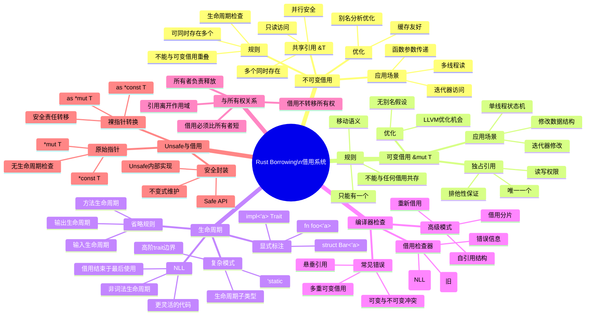

# Rust借用系统 - 思维导图

## Mermaid思维导图



---

## 借用系统核心关系图

```text
┌─────────────────────────────────────────────────────────────────┐
│                    Rust 借用系统全景                             │
├─────────────────────────────────────────────────────────────────┤
│                                                                  │
│   ┌─────────────────────────────────────────────────────────┐   │
│   │                     所有权 Owner                         │   │
│   │                    ┌─────────┐                          │   │
│   │                    │   值    │                          │   │
│   │                    └────┬────┘                          │   │
│   │                         │                                 │   │
│   └─────────────────────────┼─────────────────────────────────┘   │
│                             │                                    │
│              ┌──────────────┴──────────────┐                     │
│              │                             │                      │
│              ▼                             ▼                      │
│   ┌──────────────────┐         ┌──────────────────┐              │
│   │   不可变借用 &T   │         │   可变借用 &mut T │              │
│   │                  │         │                  │              │
│   │  • 多个同时存在   │         │  • 唯一一个       │              │
│   │  • 只读访问      │         │  • 读写权限       │              │
│   │  • 并行安全      │         │  • 排他性保证     │              │
│   │                  │         │                  │              │
│   │  规则:           │         │  规则:           │              │
│   │  &T1, &T2, &T3   │         │  只能有&mut T    │              │
│   │  不能与&mut共存  │         │  不能与其他借用   │              │
│   │  生命周期有效    │         │  共存            │              │
│   └──────────────────┘         └──────────────────┘              │
│                                                                  │
│   关键约束:                                                       │
│   ┌─────────────────────────────────────────────────────────┐   │
│   │  借用生命周期 ⊆ 所有者生命周期                           │   │
│   │  ∀借用b. 有效性(借用b) → 有效性(所有者)                 │   │
│   │  不能同时存在 &mut T 和 &T (或 &mut T)                   │   │
│   └─────────────────────────────────────────────────────────┘   │
│                                                                  │
└─────────────────────────────────────────────────────────────────┘
```

---

## 生命周期关系图

```text
生命周期层级:

'static ──────────────────────────────────────────────→ 最长
  │
  ├──▶ 程序运行期间一直存在
  │     例如: 字符串字面量, 全局变量
  │
  └──▶ 'a ────────────────────────────────────────▶ 任意生命周期
        │
        ├──▶ 函数参数生命周期
        │      fn foo<'a>(x: &'a T)
        │
        ├──▶ 结构体字段生命周期
        │      struct Bar<'a> { x: &'a T }
        │
        └──▶ impl块生命周期
               impl<'a> Trait for Type<'a>

生命周期约束:

'a: 'b  表示 'a 至少和 'b 一样长
        (a outlives b)

示例:
    fn example<'a, 'b>(x: &'a T, y: &'b T) where 'a: 'b
    // x的生命周期至少和y一样长
```

---

## 借用检查演进

```text
借用检查器演进:

┌─────────────┐     ┌─────────────┐     ┌─────────────┐
│   AST-based │ ──▶ │  MIR-based  │ ──▶ │  Polonius   │
│  (Rust 1.0) │     │   (NLL)     │     │   (未来)    │
└─────────────┘     └─────────────┘     └─────────────┘
      │                   │                   │
      ▼                   ▼                   ▼
  词法作用域           非词法作用域         更精确分析

  {                  {                   {
    let x = 5;         let x = 5;          let x = 5;
    let y = &x;        let y = &x;         let y = &x;
    println!(y);       println!(y);        println!(y);
                       // y不再使用        // 复杂控制流
    x = 6;    // 错误   x = 6;    // OK    x = 6;    // OK
  }                  }                   }
```

---

## 借用模式速查表

| 模式 | 语法 | 约束 | 典型应用 |
|:---|:---|:---|:---|
| 共享借用 | `&T` | 多个共存，只读 | 参数传递，遍历 |
| 可变借用 | `&mut T` | 唯一，读写 | 修改数据，状态机 |
| 重新借用 | `&mut *r` | 临时降级 | 部分借用 |
| 切片借用 | `&[T]` | 连续内存 | 数组访问 |
| 字符串借用 | `&str` | UTF-8验证 | 字符串处理 |
|  trait借用 | `&dyn Trait` | 对象安全 | 多态 |

---

**维护者**: Rust Analysis Team
**更新日期**: 2026-03-05
