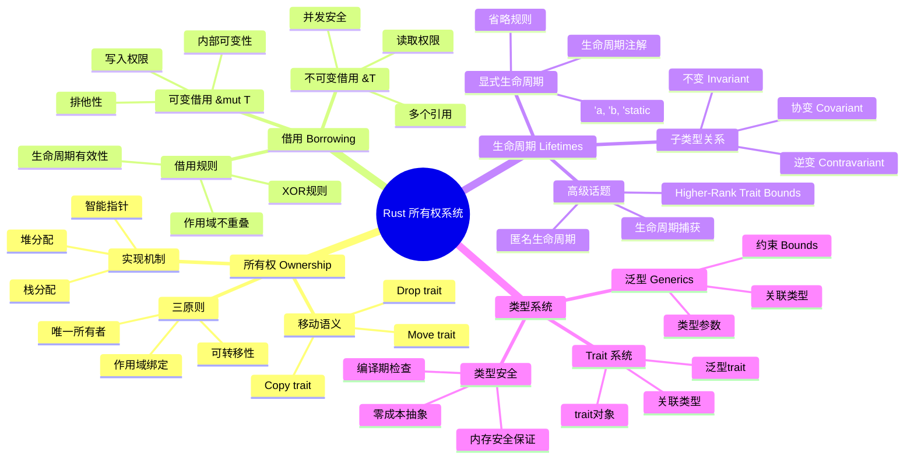
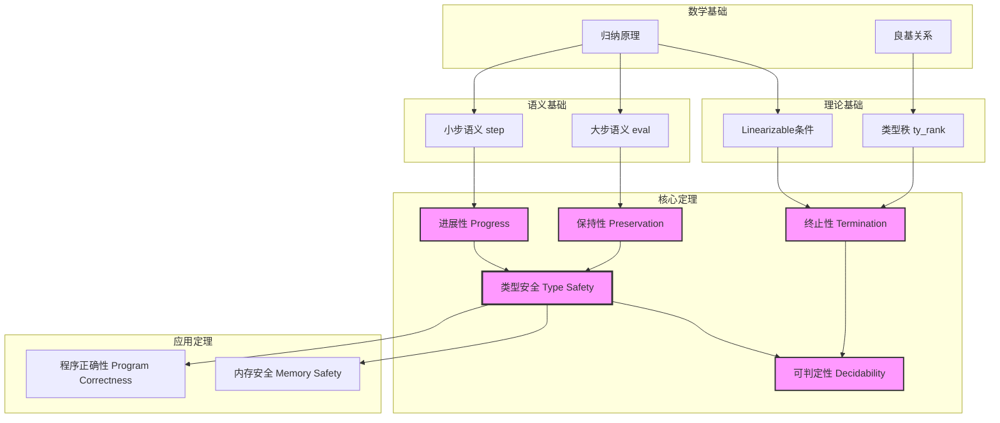
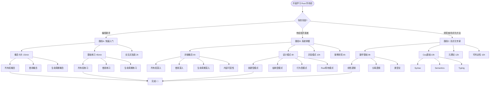
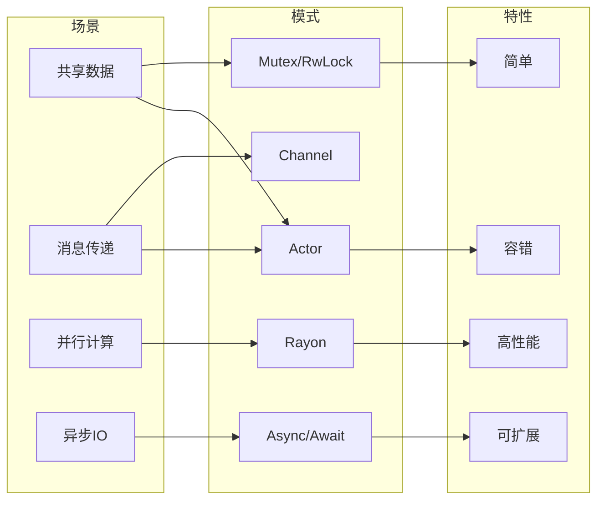
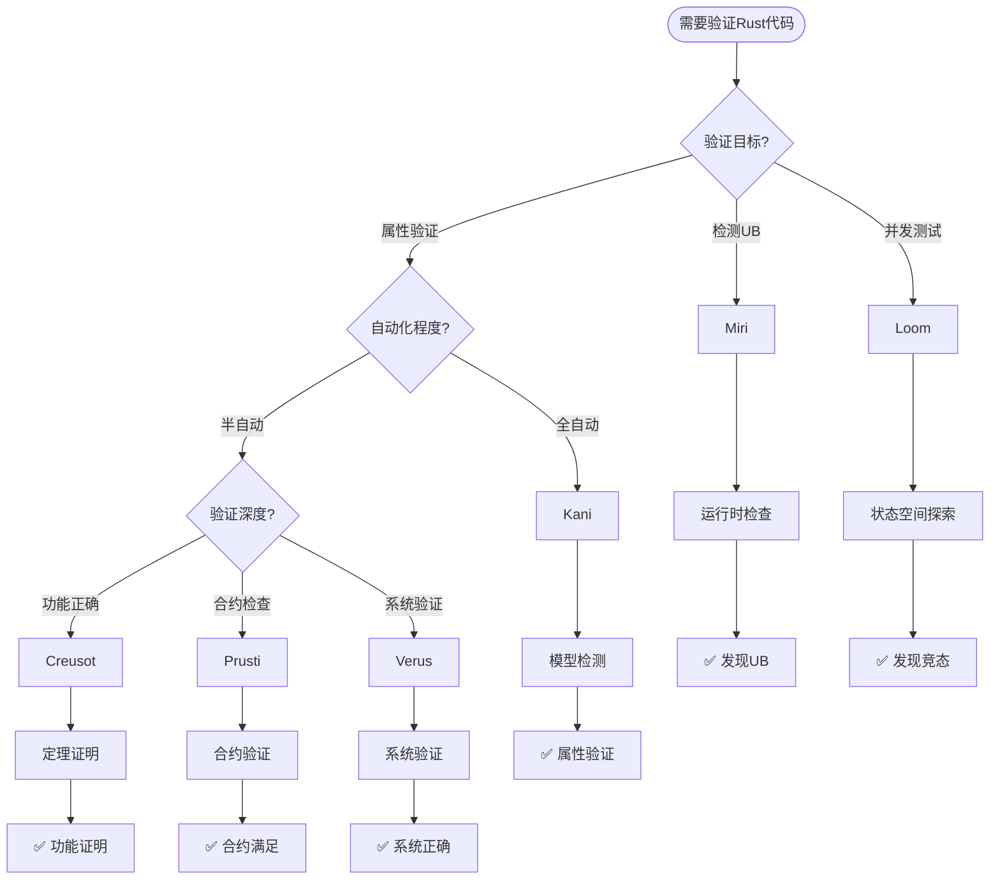
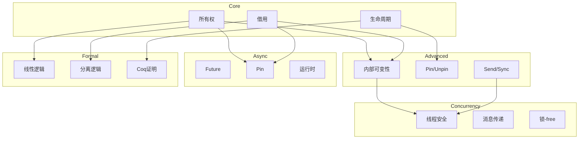
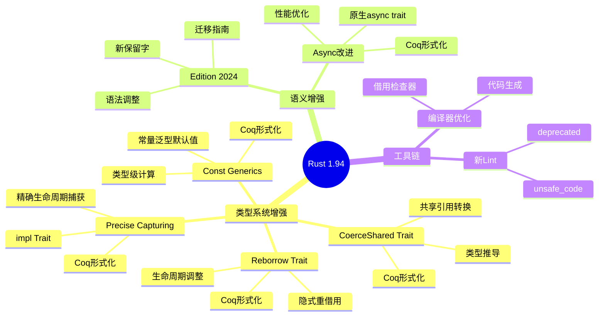
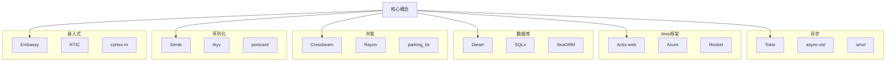
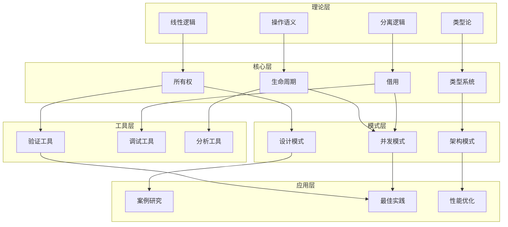

# Rust 所有权系统 - 知识图谱思维导图

> 完整的知识体系可视化导航

---

## 1. 核心概念思维导图



---

## 2. 定理依赖网络图



---

## 3. 学习路径决策树



---

## 4. 并发模式选择矩阵



---

## 5. 所有权转换状态机

```mermaid
stateDiagram-v2
    [*] --> Owned: let x = T::new()

    Owned --> Moved: let y = x
    Owned --> Borrowed: &x
    Owned --> MutBorrowed: &mut x
    Owned --> Dropped: 作用域结束

    Moved --> [*]: 值转移

    Borrowed --> Owned: 借用结束
    Borrowed --> Borrowed: 多个 &x

    MutBorrowed --> Owned: 借用结束
    MutBorrowed --> [*]: 修改后drop

    Dropped --> [*]: 释放资源
```

---

## 6. 验证工具选择决策树



---

## 7. 模块依赖图



---

## 8. Rust 1.94 特性映射



---

## 9. 案例研究分类图



---

## 10. 完整知识图谱



---

## 使用指南

### 如何选择图表

| 目的 | 推荐图表 |
|:-----|:---------|
| 了解整体结构 | 完整知识图谱、核心概念思维导图 |
| 规划学习路径 | 学习路径决策树 |
| 理解定理关系 | 定理依赖网络图 |
| 选择并发模式 | 并发模式选择矩阵、模式选择决策树 |
| 验证代码 | 验证工具选择决策树 |
| 查看所有权状态 | 所有权转换状态机 |

---

*这些图表使用 Mermaid 语法，可在支持 Mermaid 的 Markdown 查看器中渲染*
