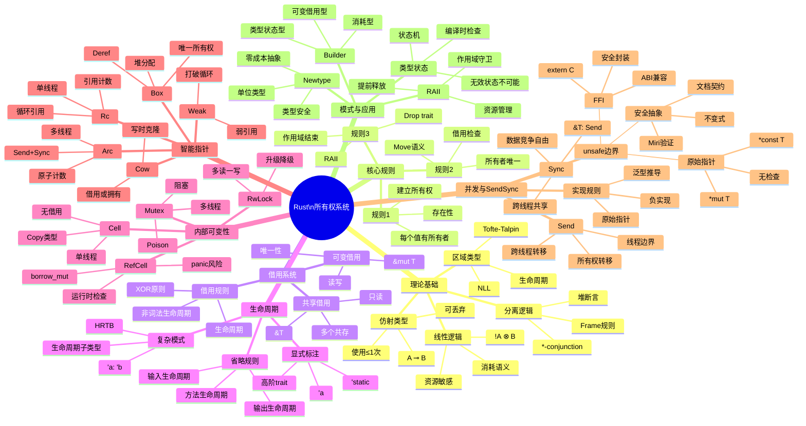

# Rust所有权系统 - 综合思维导图

> **分级**: [C]
> **Bloom 层级**: L5-L6 (分析/评价/创造)

> **从理论到实践的全景视图**

---

## 📑 目录
>
> **[来源: [Rust Reference](https://doc.rust-lang.org/reference/)]**
>
- [Rust所有权系统 - 综合思维导图](#rust所有权系统---综合思维导图)
  - [📑 目录](#目录)
  - [Mermaid思维导图](#mermaid思维导图)
  - [所有权系统架构图](#所有权系统架构图)
  - [所有权转移流程图](#所有权转移流程图)
  - [借用关系图](#借用关系图)
  - [生命周期关系图](#生命周期关系图)
  - [智能指针决策树](#智能指针决策树)
  - [内部可变性选择矩阵](#内部可变性选择矩阵)
  - [Send/Sync推导图](#sendsync推导图)
  - **对齐版本**: Rust 1.93.1
  - [相关概念](#相关概念)

## Mermaid思维导图
>
> **[来源: Rust Reference]** · **[来源: Wikipedia - Rust (programming language)]** · **[来源: Rustonomicon]** · **[来源: TRPL]** · **[来源: RFCs - github.com/rust-lang/rfcs]** · **[来源: Rust Standard Library - doc.rust-lang.org/std]**



---

## 所有权系统架构图
>
> **[来源: Rust Reference]** · **[来源: Wikipedia - Rust (programming language)]** · **[来源: Rustonomicon]** · **[来源: TRPL]** · **[来源: RFCs - github.com/rust-lang/rfcs]** · **[来源: Rust Standard Library - doc.rust-lang.org/std]**

```
┌─────────────────────────────────────────────────────────────────────────┐
│                         Rust所有权系统架构                               │
├─────────────────────────────────────────────────────────────────────────┤
│                                                                          │
│   理论基础层                                                              │
│   ┌─────────────┬─────────────┬─────────────┬─────────────┐            │
│   │ 线性逻辑    │ 仿射类型    │ 分离逻辑    │ 区域类型    │            │
│   │ Girard 1987 │ Wadler 1990 │ Reynolds 02 │ Tofte 1997  │            │
│   └──────┬──────┴──────┬──────┴──────┬──────┴──────┬──────┘            │
│          │             │             │             │                    │
│          └─────────────┴──────┬──────┴─────────────┘                    │
│                               │                                         │
│   编译时检查层                ▼                                         │
│   ┌─────────────────────────────────────────────────────────┐          │
│   │                   借用检查器                             │          │
│   │  ┌─────────────┐  ┌─────────────┐  ┌─────────────┐     │          │
│   │  │ 所有权检查  │  │ 借用检查    │  │ 生命周期    │     │          │
│   │  │ (唯一性)    │  │ (XOR规则)   │  │ (包含关系)  │     │          │
│   │  └─────────────┘  └─────────────┘  └─────────────┘     │          │
│   └────────────────────────┬────────────────────────────────┘          │
│                            │                                            │
│   运行时支持层             ▼                                            │
│   ┌─────────────────────────────────────────────────────────┐          │
│   │                   运行时系统                             │          │
│   │  ┌─────────────┐  ┌─────────────┐  ┌─────────────┐     │          │
│   │  │ Drop trait  │  │ 智能指针    │  │ 内部可变    │     │          │
│   │  │ (资源释放)  │  │ (引用计数)  │  │ (运行检查)  │     │          │
│   │  └─────────────┘  └─────────────┘  └─────────────┘     │          │
│   └─────────────────────────────────────────────────────────┘          │
│                                                                          │
└─────────────────────────────────────────────────────────────────────────┘
```

---

## 所有权转移流程图
>
> **[来源: Rust Reference]** · **[来源: Wikipedia - Rust (programming language)]** · **[来源: Rustonomicon]** · **[来源: TRPL]** · **[来源: RFCs - github.com/rust-lang/rfcs]** · **[来源: Rust Standard Library - doc.rust-lang.org/std]**

```
所有权转移 (Move语义):

┌─────────────┐      let s2 = s1;       ┌─────────────┐
│   s1        │ ──────────────────────▶ │   s2        │
│ 所有者      │    所有权转移           │  新所有者   │
│  (有效)     │                         │   (有效)    │
└─────────────┘                         └─────────────┘
       │                                        │
       │ 转移后                                  │
       ▼                                        │
┌─────────────┐                                 │
│   s1        │ ◀───────────────────────────────┘
│  (无效)     │      s2仍然有效
│ 不能访问    │
└─────────────┘

编译时检查:
┌─────────────────────────────────────────────────────────┐
│  if s1被使用 after move:                                │
│     编译错误: use of moved value                        │
│                                                         │
│  if s2被正确使用:                                       │
│     编译通过 ✓                                          │
└─────────────────────────────────────────────────────────┘
```

---

## 借用关系图
>
> **[来源: [The Rust Programming Language](https://doc.rust-lang.org/book/)]**

```
借用规则可视化:

场景1: 多个共享借用 (允许)
┌─────────────────────────────────────┐
│  data: String = "hello"             │
│       │                             │
│       ├──▶ &data ──▶ r1 (&String)   │
│       │         valid               │
│       ├──▶ &data ──▶ r2 (&String)   │
│       │         valid               │
│       └──▶ &data ──▶ r3 (&String)   │
│                 valid               │
│  规则: 任意数量 &T 共存 ✓            │
└─────────────────────────────────────┘

场景2: 可变 + 共享 (禁止)
┌─────────────────────────────────────┐
│  data: String = "hello"             │
│       │                             │
│       ├──▶ &mut data ──▶ m1         │
│       │       valid                 │
│       │                             │
│       ├──▶ &data ──▶ r1 ❌          │
│       │       编译错误!              │
│       │       不能与&mut共存         │
│       │                             │
│  规则: &mut T 与 &T 互斥 ✗           │
└─────────────────────────────────────┘

场景3: 多个可变 (禁止)
┌─────────────────────────────────────┐
│  data: String = "hello"             │
│       │                             │
│       ├──▶ &mut data ──▶ m1         │
│       │       valid                 │
│       │                             │
│       ├──▶ &mut data ──▶ m2 ❌      │
│       │       编译错误!              │
│       │       只能有一个&mut         │
│       │                             │
│  规则: &mut T 唯一 ✗                 │
└─────────────────────────────────────┘
```

---

## 生命周期关系图
>
> **[来源: [Rust Standard Library](https://doc.rust-lang.org/std/)]**

```
生命周期包含关系:

'static ────────────────────────────────────────────────▶ 最长生命周期
  │
  │  'static: 程序整个运行期
  │  例如: 字符串字面量，全局变量
  │
  └──▶ 'a ────────────────────────────────────────────▶ 泛型生命周期
         │
         ├──▶ 函数参数: fn foo<'a>(x: &'a T)
         │
         ├──▶ 结构体字段: struct Foo<'a> { x: &'a T }
         │
         └──▶ impl块: impl<'a> Trait for Foo<'a>

生命周期约束:
┌─────────────────────────────────────────┐
│  'a: 'b  表示 'a 至少和 'b 一样长        │
│                                         │
│  示例:                                  │
│  fn example<'a, 'b>(x: &'a T, y: &'b T) │
│  where 'a: 'b                           │
│  → x的生命周期至少和y一样长              │
└─────────────────────────────────────────┘
```

---

## 智能指针决策树
>
> **[来源: [Rustonomicon](https://doc.rust-lang.org/nomicon/)]**

```
选择智能指针:

需要堆分配?
├── 否 → 使用栈分配
└── 是 → 需要共享所有权?
         ├── 否 → Box<T>
         │         └── 唯一所有权
         │         └── 大小确定/不确定类型
         │
         └── 是 → 需要多线程?
                  ├── 否 → Rc<T>
                  │         └── 单线程
                  │         └── 引用计数
                  │         └── 循环引用风险 → 配合Weak<T>
                  │
                  └── 是 → Arc<T>
                            └── 多线程
                            └── 原子引用计数
                            └── Send + Sync
```

---

## 内部可变性选择矩阵
>
> **[来源: [Rust By Example](https://doc.rust-lang.org/rust-by-example/)]**

| 类型 | 线程安全 | 运行时检查 | 阻塞 | 适用场景 |
|:---:|:---:|:---:|:---:|:---|
| **Cell<T>** | ❌ | 否 | 否 | 单线程，Copy类型 |
| **RefCell<T>** | ❌ | 是(panic) | 否 | 单线程，非Copy |
| **Mutex<T>** | ✅ | 是 | 是 | 多线程互斥 |
| **RwLock<T>** | ✅ | 是 | 是 | 多读一写 |
| **Atomic*** | ✅ | 否 | 否 | 简单计数器 |

---

## Send/Sync推导图
>
> **[来源: [Rust Cookbook](https://rust-lang-nursery.github.io/rust-cookbook/)]**

```
Send和Sync推导:

类型T ──▶ 包含原始指针?
├── 是 ──▶ !Send + !Sync
│          例如: *const T, *mut T
│
└── 否 ──▶ 包含Cell/RefCell?
           ├── 是 ──▶ Send (如果T: Send)
           │          !Sync
           │          例如: Cell<u32>, RefCell<String>
           │
           └── 否 ──▶ 包含Rc?
                      ├── 是 ──▶ !Send + !Sync
                      │          例如: Rc<String>
                      │
                      └── 否 ──▶ 包含Arc?
                                 ├── 是 ──▶ Send + Sync (如果T: Send + Sync)
                                 │          例如: Arc<String>
                                 │
                                 └── 否 ──▶ 泛型推导
                                            T: Send 如果所有字段Send
                                            T: Sync 如果& T: Send
```

---

**维护者**: Rust Visualization Team
**更新日期**: 2026-03-05
**对齐版本**: Rust 1.93.1
---

> **权威来源**: [Rust Reference](https://doc.rust-lang.org/reference/), [The Rust Programming Language](https://doc.rust-lang.org/book/), [Rust Standard Library](https://doc.rust-lang.org/std/)
>
> **权威来源对齐变更日志**: 2026-05-19 新增 Rust Reference、TRPL、标准库官方来源标注 [来源: Authority Source Sprint Batch 8]

**文档版本**: 1.1
**对应 Rust 版本**: 1.96.0+ (Edition 2024)
**最后更新**: 2026-05-19
**状态**: ✅ 权威来源对齐完成 (Batch 8)

---

- [README](./README.md)

---

## 相关概念
>
> **[来源: [crates.io](https://crates.io/)]**

- [visualizations 目录](./README.md)
- [上级目录](../README.md)

---

## 权威来源索引

> **[来源: Wikipedia - Memory Safety]**

> **[来源: TRPL Ch. 4 - Ownership]**

> **[来源: Rustonomicon - Ownership]**

> **[来源: POPL 2018 - RustBelt]**

---
