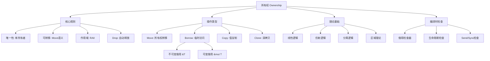

# 所有权系统思维导图



## ASCII版本

```
                            ┌─────────────┐
                            │   所有权    │
                            │  Ownership  │
                            └──────┬──────┘
                                   │
        ┌──────────────────────────┼──────────────────────────┐
        │                          │                          │
        ▼                          ▼                          ▼
┌───────────────┐        ┌─────────────────┐        ┌─────────────────┐
│   核心规则    │        │    操作类型     │        │    理论基础     │
└───────┬───────┘        └────────┬────────┘        └────────┬────────┘
        │                         │                          │
   ┌────┴────┐              ┌─────┴──────┐            ┌─────┴──────┐
   │• 唯一性 │              │• Move      │            │• 线性逻辑  │
   │• 可转移 │              │• Borrow    │            │• 仿射逻辑  │
   │• 作用域 │              │• Copy      │            │• 分离逻辑  │
   │• Drop  │              │• Clone     │            │• 区域理论  │
   └─────────┘              └─────┬──────┘            └────────────┘
                                  │
                           ┌──────┴──────┐
                           │• &T 不可变  │
                           │• &mut T可变 │
                           └─────────────┘
```
