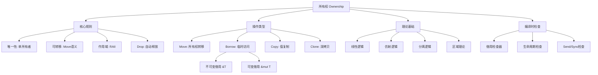

# 所有权系统思维导图



## 📑 目录
>
- [所有权系统思维导图](#所有权系统思维导图)
  - [📑 目录](#-目录)
  - [ASCII版本](#ascii版本)
  - [相关概念](#相关概念)

## ASCII版本
>
> **[来源: Rust Reference]** · **[来源: Wikipedia - Rust (programming language)]** · **[来源: Rustonomicon]** · **[来源: TRPL]** · **[来源: RFCs - github.com/rust-lang/rfcs]** · **[来源: Rust Standard Library - doc.rust-lang.org/std]**

```
                            ┌─────────────┐
                            │   所有权    │
                            │  Ownership  │
                            └──────┬──────┘
                                   │
        ┌──────────────────────────┼──────────────────────────┐
        │                          │                          │
        ▼                          ▼                          ▼
┌───────────────┐        ┌─────────────────┐        ┌─────────────────┐
│   核心规则    │        │    操作类型     │        │    理论基础     │
└───────┬───────┘        └────────┬────────┘        └────────┬────────┘
        │                         │                          │
   ┌────┴────┐              ┌─────┴──────┐            ┌─────┴──────┐
   │• 唯一性 │              │• Move      │            │• 线性逻辑  │
   │• 可转移 │              │• Borrow    │            │• 仿射逻辑  │
   │• 作用域 │              │• Copy      │            │• 分离逻辑  │
   │• Drop  │              │• Clone     │            │• 区域理论  │
   └─────────┘              └─────┬──────┘            └────────────┘
                                  │
                           ┌──────┴──────┐
                           │• &T 不可变  │
                           │• &mut T可变 │
                           └─────────────┘
```

---

> **权威来源**: [Rust Reference](https://doc.rust-lang.org/reference/), [The Rust Programming Language](https://doc.rust-lang.org/book/), [Rust Standard Library](https://doc.rust-lang.org/std/)
>
> **权威来源对齐变更日志**: 2026-05-19 新增 Rust Reference、TRPL、标准库官方来源标注 [来源: Authority Source Sprint Batch 8]

**文档版本**: 1.1
**对应 Rust 版本**: 1.95.0+ (Edition 2024)
**最后更新**: 2026-05-19
**状态**: ✅ 权威来源对齐完成 (Batch 8)

---

- [README](./README.md)

---

## 相关概念

- [visualizations 目录](./README.md)
- [上级目录](../README.md)


---

## 权威来源索引

> **[来源: Wikipedia - Memory Safety]**

> **[来源: TRPL Ch. 4 - Ownership]**

> **[来源: Rustonomicon - Ownership]**

> **[来源: POPL 2018 - RustBelt]**
