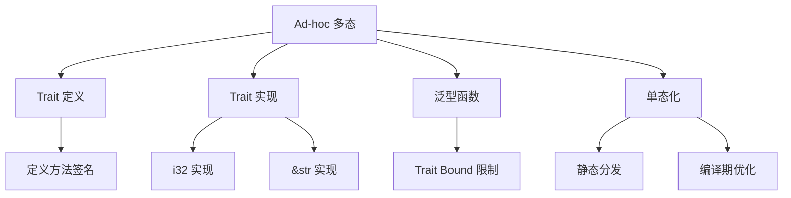

# Ad-hoc Polymorphism

下面我们详细探讨一下 Rust 中 **ad-hoc 多态**（Ad-hoc Polymorphism）的机制，包括其基本原理、实现方式、具体示例以及在设计中的作用。

---

## 1. 什么是 ad-hoc 多态

**Ad-hoc 多态** 指的是根据传入参数的具体类型来选择合适实现（例如方法或函数），而不是将所有类型统一对待。也就是说，同一抽象（函数或接口）可以针对不同类型有不同的实现行为。

在 Rust 中，ad-hoc 多态主要通过 **Trait** 实现。
Trait 类似于其他语言中的接口，定义了一组行为规范，同时可以针对具体类型实现不同的具体行为。
这种机制使得代码可以在编译时确定函数调用的具体实现，从而实现了静态的 ad-hoc 多态。

---

## 2. Rust 中 ad-hoc 多态的实现机制

### 2.1 Trait 定义与实现

- **Trait 定义：**  
  Trait 是对一组方法的约定。通过定义 trait，开发者声明某类操作或行为，然后针对不同类型给出相应实现。

- **实现 Trait：**  
  通过 `impl TraitName for Type` 实现 trait，可以为不同类型提供各自的实现。这样，同一 trait 的方法在不同类型上表现各异，从而实现 ad-hoc 多态。

#### 示例

```rust:src/ad_hoc_polymorphism.rs
// 定义一个 trait，表示能打印自身内容
trait Printable {
    fn print(&self);
}

// 为 i32 实现 Printable trait
impl Printable for i32 {
    fn print(&self) {
        println!("i32 value: {}", self);
    }
}

// 为 &str 实现 Printable trait
impl Printable for &str {
    fn print(&self) {
        println!("str value: {}", self);
    }
}

// 泛型函数，要求类型 T 必须实现 Printable trait
fn display<T: Printable>(item: T) {
    item.print();
}

fn main() {
    let number = 42;
    let text = "Hello, Rust!";
    
    display(number);
    display(text);
}
```

这里，`display` 函数能接受任何实现了 `Printable` trait 的类型。这就是一种 ad-hoc 多态的体现：在不同的具体类型上调用 `print` 方法，会执行不同的实现。

---

### 2.2 静态分发与单态化

在编译时，Rust 对泛型函数进行 **单态化（Monomorphization）**。
这意味着对于每个使用具体类型时，编译器会生成一份针对该类型的特化代码。  

- **静态分发：**  
  编译器根据传入的类型在编译期就选择了对应的实现（接口实现），这与动态分发（运行时确定）不同。  
- **高性能：**  
  静态分发能在不引入运行时开销的情况下实现多态性，因此 Rust 的 ad-hoc 多态既安全又高效。

---

### 2.3 关联函数和方法调用

在 Rust 中，通过 trait 实现的 ad-hoc 多态还融入了方法调用机制。带有 trait 的类型能够调用 trait 内定义的方法，也可以通过泛型关联函数来实现同一接口对不同类型的不同行为。  
例如，上述示例中的 `print` 方法，通过 trait 分发机制，会在调用时自动根据具体类型选择对应的实现，从而完成多态效果。

---

## 3. ad-hoc 多态的优势与设计思路

- **接口约定和松耦合：**  
  Trait 定义了一个抽象接口，不同类型可以自由实现相同接口，这样扩展新类型时，不必修改原有代码，符合开放封闭原则。

- **编译时安全检查：**  
  编译器在处理 trait bound 时会进行静态检查，保证所有调用对应的方法实现都存在，避免运行时错误。

- **零成本抽象：**  
  因为单态化的存在，ad-hoc 多态不会引入额外的运行时开销，实现了高级抽象与底层性能的平衡。

- **可组合性：**  
  Trait 可相互叠加和组合，允许一个类型实现多个 trait，从而支持更丰富的行为组合，满足复杂应用需求。

---

## 4. 思维导图示例

下面给出一个 Mermaid 格式的思维导图，展示 Rust 中 ad-hoc 多态的核心机制及其关联关系：



---

## 5. 总结

- **Ad-hoc 多态** 是通过为不同类型分别实现同一 trait 来实现的，它使得同一接口在不同类型上表现出不同的行为。  
- **Trait** 是 Rust 语言实现这种多态性的核心工具，结合泛型函数、trait bound 和单态化机制，确保在编译期完成所有调度，从而实现高性能且安全的多态调用。  
- 这种机制不仅提供接口抽象和代码复用，还能保证静态类型安全，是 Rust 设计中实现灵活性与性能平衡的重要一环。

通过这种设计，Rust 实现了类似于其他语言中接口和抽象类的效果，同时借助静态分发和单态化避免了运行时开销，打造了安全、高效且灵活的编程模型。

下面将详细对比 **ad-hoc 多态**（Rust 中常见的基于 Trait 的多态机制）与 **面向对象编程（OOP）的多态机制**，从实现原理、调度方式、性能、设计理念等方面进行解释，并说明它们之间的联系与区别。

---

## 1. 实现原理与调度方式

### 1.1 Rust 中的 ad-hoc 多态

- **基于 Trait 的接口约定**  
  Rust 使用 Trait 定义行为接口，不同类型可以各自实现相同的 Trait，从而在同一个接口下表现出不同的行为。例如，定义一个 `Printable` Trait，不同的数据类型分别实现 `print` 方法。

- **静态分发与单态化**  
  当你使用带有 Trait Bound 的泛型函数时，Rust 编译器会对泛型代码进行单态化（Monomorphization）：  
  - 在编译时，根据每一个具体类型生成专用版本的代码。  
  - 这种静态分发方式不会引入运行时的额外成本，被称为 “零成本抽象”。

- **编译期验证**  
  编译器通过 Trait Bound 检查确保所有类型都实现了所需方法，这在编译期提供了强类型检查，防止运行时出现方法调用错误。

### 1.2 OOP 中的多态

- **基于继承与虚函数的接口**  
  传统的面向对象编程通过类继承和接口（或抽象类）的方式实现多态。基类定义虚函数，子类通过重写虚函数实现不同的行为。

- **动态分发（Virtual Dispatch）**  
  当通过基类指针或引用调用虚函数时，实际调用的版本是由运行时机制决定的，即动态分发：  
  - 这通常依赖于虚函数表（vtable），在运行时根据对象的实际类型进行查找。  
  - 动态分发带来了一定的运行时性能开销。

- **运行时灵活性**  
  OOP 允许在运行时通过基类指针指向不同子类对象，从而实现运行时的动态多态。这也为扩展和插件机制提供了便捷实现手段。

---

## 2. 性能与安全性的对比

### 2.1 性能考虑

- **Rust 的 ad-hoc 多态**  
  - **单态化**：编译器在编译期间生成每个具体版本的代码，因此调用时不存在虚函数表查找，从而能够获得与专用代码相近的性能。  
  - **零成本抽象**：这种机制在不损失抽象能力的前提下，确保最终执行代码高速且无附加调度开销。

- **OOP 的动态多态**  
  - **动态分发**：每次调用虚函数时需要通过 vtable 进行查找，并且一些编译器优化可能受限，导致运行时略微的性能开销。  
  - **灵活性与开销权衡**：动态多态在提供运行时灵活性的同时，不可避免地带来一定的性能损失，尤其在对性能要求极高的场景下显得较为明显。

### 2.2 安全性与静态检查

- **Rust 的方式**  
  - 编译期通过 Trait Bound 和所有权、借用检查等机制保证类型安全，能在编译过程中发现错误。  
  - 没有隐式继承，所有多态行为都需要显式声明，避免了一些隐性错误的发生。

- **OOP 的方式**  
  - 虚函数调用依赖运行时判定，虽然现代语言通过良好的设计和工具也能提供安全性，但有时可能会因错误的类型转换或未覆盖分支导致运行时错误（如空指针引用等问题）。
  - 动态多态在扩展性上很灵活，但在某些情况下，可能引入难以追踪的运行时错误。

---

## 3. 设计理念与表达

### 3.1 Rust 的 ad-hoc 多态

- **基于 Trait 的设计**  
  - 强调**接口与实现分离**。不同类型可以独立实现 Trait，而无需依赖继承关系。  
  - 通过静态泛型和 Trait Bound，使代码在编写时就确定了具体接口调用，展现出明确的类型契约。

- **扩展性与组合性**  
  - 支持将多个 Trait 组合（trait 叠加），形成更丰富的行为组合模式。  
  - 在设计上注重**显式声明**，使得代码更清晰、可维护，同时降低隐性耦合。

### 3.2 OOP 的多态

- **继承-重载机制**  
  - 通过基类和子类的层次结构实现多态，强调**父类接口与子类实现**之间的关系。  
  - 这种模式在很多传统面向对象语言中较为普遍，方便直观但有时会导致大而臃肿的继承树。

- **运行时灵活性**  
  - 动态分发使得对象在运行时灵活变化，但这种灵活性也可能导致接口不明确或设计不够严谨的问题（如钻石问题、隐式依赖等）。

---

## 4. 联系与共同点

- **目的相同**：  
  无论是 Rust 的 ad-hoc 多态还是 OOP 的多态，其共同目标都是通过统一接口调用不同实现，提高代码复用性和扩展性。

- **接口约定**：  
  两种机制都依赖于抽象接口（Rust 的 Trait 与 OOP 的抽象类/接口），确保提供一致的方法调用方式。

- **分发机制**：  
  不同之处在于 Rust 在编译期完成分发，而传统 OOP 语言则在运行时决定调用哪个实现。  
  这决定了性能、灵活性与类型安全的平衡点。

---

## 5. 思维导图示例

下面给出一个 Mermaid 格式的思维导图，展示 Rust 的 ad-hoc 多态与 OOP 动态多态的核心机制对比：

```mermaid:polymorphism_comparison.mmd
flowchart TD
    A[多态机制对比]
    
    %% Rust 的 ad-hoc 多态
    A --> B[Rust: ad-hoc 多态]
    B --> B1[基于 Trait 实现]
    B --> B2[静态分发 / 单态化]
    B --> B3[编译期检查 & 零成本抽象]
    
    %% OOP 的多态
    A --> C[OOP: 动态多态]
    C --> C1[基于继承与抽象类]
    C --> C2[动态分发 (vtable)]
    C --> C3[运行时灵活性]
    
    %% 对比联系
    B1 --- C1[均使用接口约定]
    B2 --- C2[分发方式不同]
    B3 --- C3[权衡性能与灵活性]
```

---

## 6. 总结

- **实现角度**：  
  Rust 采用 Trait 和泛型进行静态多态，通过编译期单态化实现零成本抽象；而 OOP 通过继承与虚函数实现动态多态，允许运行时根据对象类型选择方法。
  
- **性能与安全**：  
  Rust 的方式能在编译期确保安全性与高性能；OOP 的动态分发提供了灵活性但可能带来额外开销及潜在的运行时错误。
  
- **设计理念**：  
  Rust 强调显式声明和接口契约，避免隐式耦合；OOP 则强调继承层次和重载，但有时可能因复杂继承关系带来设计上的问题。

通过这些对比，我们可以看到虽然二者都致力于实现多态这一目标，但在实现机制、调度方式以及设计理念上存在显著差异。Rust 的 ad-hoc 多态特别适合需要高性能与编译期安全检查的场景，而传统 OOP 的动态多态则在需要更多灵活性和运行时扩展的场景下有其优势。
