# Rust异步编程模型: 批判性分析与改进方向

## 目录

- [Rust异步编程模型: 批判性分析与改进方向](#rust异步编程模型-批判性分析与改进方向)
  - [目录](#目录)
  - [1. 思维导图](#1-思维导图)
  - [2. 理论基础与模型](#2-理论基础与模型)
    - [2.1 异步计算理论](#21-异步计算理论)
      - [2.1.1 并发与并行的形式化区分](#211-并发与并行的形式化区分)
      - [2.1.2 异步计算的代数模型](#212-异步计算的代数模型)
    - [2.2 Rust异步模型的形式化定义](#22-rust异步模型的形式化定义)
      - [2.2.1 Future Trait的数学基础](#221-future-trait的数学基础)
      - [2.2.2 Pin与自引用结构](#222-pin与自引用结构)
    - [2.3 运行时与执行模型](#23-运行时与执行模型)
      - [2.3.1 调度器理论与实现](#231-调度器理论与实现)
      - [2.3.2 唤醒机制与执行保证](#232-唤醒机制与执行保证)
  - [3. 核心模式与抽象](#3-核心模式与抽象)
    - [3.1 Future与状态机](#31-future与状态机)
      - [3.1.1 状态机转换理论](#311-状态机转换理论)
      - [3.1.2 轮询模型的理论局限](#312-轮询模型的理论局限)
    - [3.2 生成器模式的批判性分析](#32-生成器模式的批判性分析)
      - [3.2.1 生成器与异步迭代的形式化对比](#321-生成器与异步迭代的形式化对比)
      - [3.2.2 生成器内存模型与性能特性](#322-生成器内存模型与性能特性)
    - [3.3 响应式流处理](#33-响应式流处理)
      - [3.3.1 流处理的代数基础](#331-流处理的代数基础)
      - [3.3.2 背压机制的形式化模型](#332-背压机制的形式化模型)
    - [3.4 同步原语与通信模型](#34-同步原语与通信模型)
      - [3.4.1 异步同步原语的正确性证明](#341-异步同步原语的正确性证明)
      - [3.4.2 通道选择与组合策略](#342-通道选择与组合策略)
  - [4. 设计模式与架构](#4-设计模式与架构)
    - [4.1 Actor模型与CSP对比](#41-actor模型与csp对比)
      - [4.1.1 Actor模型的形式化定义与优势](#411-actor模型的形式化定义与优势)
      - [4.1.2 CSP与通道通信](#412-csp与通道通信)
    - [4.2 任务分发与资源管理](#42-任务分发与资源管理)
      - [4.2.1 任务调度模型与算法](#421-任务调度模型与算法)
      - [4.2.2 隔离性与资源边界](#422-隔离性与资源边界)
    - [4.3 背压策略与流量控制](#43-背压策略与流量控制)
      - [4.3.1 背压数学模型与实现策略](#431-背压数学模型与实现策略)
      - [4.3.2 流量整形与服务质量](#432-流量整形与服务质量)
    - [4.4 容错设计与错误传播](#44-容错设计与错误传播)
      - [4.4.1 错误模型与异步传播](#441-错误模型与异步传播)
      - [4.4.2 超时与取消的语义与实现](#442-超时与取消的语义与实现)
  - [5. 实现评估与权衡](#5-实现评估与权衡)
    - [5.1 异步算法的复杂性与效率](#51-异步算法的复杂性与效率)
      - [5.1.1 异步算法的复杂度分析](#511-异步算法的复杂度分析)
      - [5.1.2 异步数据结构的设计与实现权衡](#512-异步数据结构的设计与实现权衡)
    - [5.2 网络协议与IO抽象](#52-网络协议与io抽象)
      - [5.2.1 异步网络模型与协议实现](#521-异步网络模型与协议实现)
      - [5.2.2 IO抽象与适配器模式](#522-io抽象与适配器模式)
    - [5.3 存储访问模式](#53-存储访问模式)
      - [5.3.1 异步数据库交互模式](#531-异步数据库交互模式)
      - [5.3.2 缓存与键值存储访问模式](#532-缓存与键值存储访问模式)
    - [5.4 分布式系统一致性](#54-分布式系统一致性)
      - [5.4.1 共识算法与实现](#541-共识算法与实现)
      - [5.4.2 最终一致性模型与CRDT](#542-最终一致性模型与crdt)
  - [6. 工程实践与优化](#6-工程实践与优化)
    - [6.1 性能分析与调优](#61-性能分析与调优)
      - [6.1.1 异步性能分析工具与方法](#611-异步性能分析工具与方法)
      - [6.1.2 异步优化策略与最佳实践](#612-异步优化策略与最佳实践)
    - [6.2 可观测性设计](#62-可观测性设计)
      - [6.2.1 分布式追踪与日志关联](#621-分布式追踪与日志关联)
      - [6.2.2 指标收集与异常检测](#622-指标收集与异常检测)
    - [6.3 代码生成与API抽象](#63-代码生成与api抽象)
      - [6.3.1 OpenAPI和AsyncAPI自动生成](#631-openapi和asyncapi自动生成)
    - [6.4 测试策略](#64-测试策略)
      - [6.4.1 异步测试模式与实践](#641-异步测试模式与实践)
    - [6.5 性能优化模式](#65-性能优化模式)
      - [6.5.1 异步任务调度与资源管理](#651-异步任务调度与资源管理)
    - [6.6 微服务设计模式](#66-微服务设计模式)
      - [6.6.1 服务网关与API聚合](#661-服务网关与api聚合)
      - [6.6.2 事件驱动架构与消息队列](#662-事件驱动架构与消息队列)
    - [6.7 异步系统调试与问题排查](#67-异步系统调试与问题排查)
      - [6.7.1 死锁、活锁与饥饿检测](#671-死锁活锁与饥饿检测)
    - [6.8 高级并发模式](#68-高级并发模式)
      - [6.8.1 Actor模式与监督树](#681-actor模式与监督树)
  - [总结](#总结)
    - [Rust异步编程模型批判性分析与改进方向](#rust异步编程模型批判性分析与改进方向)
      - [1. 核心异步抽象的挑战](#1-核心异步抽象的挑战)
      - [2. 异步生态系统的不一致性](#2-异步生态系统的不一致性)
      - [3. 性能与资源管理](#3-性能与资源管理)
      - [4. 并发模式支持](#4-并发模式支持)
      - [5. 开发体验与工具支持](#5-开发体验与工具支持)
      - [6. 分布式系统与弹性模式](#6-分布式系统与弹性模式)
      - [7. 教育与文档](#7-教育与文档)
    - [总体评估](#总体评估)

## 1. 思维导图

```mermaid
graph TD
    A[Rust异步编程模型] --> B(理论基础与模型)
    A --> C(核心模式与抽象)
    A --> D(设计模式与架构)
    A --> E(实现评估与权衡)
    A --> F(工程实践与优化)
    A --> G(结论与展望)

    B --> B1(异步计算理论)
    B --> B2(Rust异步模型形式化定义)
    B --> B3(运行时与执行模型)

    C --> C1(Future与状态机)
    C --> C2(生成器模式分析)
    C --> C3(响应式流处理)
    C --> C4(同步原语与通信模型)

    D --> D1(Actor模型与CSP对比)
    D --> D2(任务分发与资源管理)
    D --> D3(背压策略与流量控制)
    D --> D4(容错设计与错误传播)

    E --> E1(异步算法复杂性与效率)
    E --> E2(网络协议与IO抽象)
    E --> E3(存储访问模式)
    E --> E4(分布式系统一致性)

    F --> F1(性能分析与调优)
    F --> F2(可观测性设计)
    F --> F3(代码生成与API抽象)
    F --> F4(测试策略)

    G --> G1(Rust异步编程统一理论)
    G --> G2(未来发展方向)

    %% 理论基础详细分解
    B1 --> B1_1(并发vs并行模型)
    B1 --> B1_2(异步语义与代数作用)
    B1 --> B1_3(状态迁移理论)

    B2 --> B2_1(Future trait 形式化)
    B2 --> B2_2(Pin/Unpin 内存模型)
    B2 --> B2_3(async/await状态机变换)

    B3 --> B3_1(调度器定义与特性)
    B3 --> B3_2(工作窃取算法分析)
    B3 --> B3_3(运行时系统边界)

    %% 核心抽象详细分解
    C1 --> C1_1(状态机表示理论)
    C1 --> C1_2(Poll模型的权衡)
    C1 --> C1_3(Waker机制与唤醒传播)

    C2 --> C2_1(Generator形式化定义)
    C2 --> C2_2(gen块vs async-stream)
    C2 --> C2_3(可读性与维护性权衡)

    C3 --> C3_1(Stream trait形式化)
    C3 --> C3_2(背压机制形式化)
    C3 --> C3_3(组合器设计模式)

    C4 --> C4_1(同步原语正确性证明)
    C4 --> C4_2(通道类型选择决策树)
    C4 --> C4_3(死锁避免策略)

    %% 设计模式详细分解
    D1 --> D1_1(Actor形式化定义)
    D1 --> D1_2(CSP形式化定义)
    D1 --> D1_3(性能与可组合性对比)

    D2 --> D2_1(工作者池优化策略)
    D2 --> D2_2(资源边界与隔离性)
    D2 --> D2_3(优先级反转问题)

    D3 --> D3_1(背压数学模型)
    D3 --> D3_2(通道缓冲策略)
    D3 --> D3_3(丢弃策略与QoS)

    D4 --> D4_1(错误传播形式化)
    D4 --> D4_2(超时与取消语义)
    D4 --> D4_3(恢复策略设计)
```



## 2. 理论基础与模型

### 2.1 异步计算理论

异步编程范式基于几个关键的理论基础，这些理论对于理解Rust实现的权衡至关重要。

#### 2.1.1 并发与并行的形式化区分

**定义**：

- **并发(Concurrency)**: 表示多个计算可能在重叠的时间段内进行，但不一定同时执行。形式化定义为一组任务 $T = \{t_1, t_2, ..., t_n\}$ 的执行满足：对于任意时间点 $\tau$，执行的任务集合 $E_\tau \subseteq T$ 且 $|E_\tau| \leq 1$（单线程情况）。
- **并行(Parallelism)**: 表示多个计算真正同时执行。形式上, $\exists \tau$ 使得 $|E_\tau| > 1$。

**批判分析**：Rust文档常混用这两个概念，导致对Tokio运行时特性的误解。例如，`workers.md`中的工作者池实际上是在多线程环境中实现并行，而非单纯的并发。

#### 2.1.2 异步计算的代数模型

异步计算可以通过代数效应(Algebraic Effects)形式化表示，这为理解`async/await`和解释异步任务组合提供了理论框架。

**定义**：

```math
type Future<T> = ∀R. ((T → R) → R)
```

这是一种延续传递风格(CPS)的表达，表明`Future<T>`是一种接受消费者函数的计算。

**批判分析**：
Rust的`Future` trait实现选择了"拉取"模型(Poll)而非"推送"模型(如JavaScript Promise的`then`)，这一选择有以下理论意义：

1. **空间复杂度**：推送模型在长链条上可能导致栈溢出，而拉取模型的栈使用是有界的。
2. **组合性**：拉取模型更易于与Rust的所有权系统集成，避免传统回调地狱。
3. **取消操作**：拉取模型使取消变得简单 - 只需停止轮询即可。

```rust
// Rust Future trait的形式化表示
pub trait Future {
    type Output;
    fn poll(self: Pin<&mut Self>, cx: &mut Context<'_>) -> Poll<Self::Output>;
}

// 代数上等价于:
trait Future<T> {
    fn poll<R>(self, k: impl FnOnce(T) -> R) -> Poll<R>;
}
```

### 2.2 Rust异步模型的形式化定义

#### 2.2.1 Future Trait的数学基础

Rust的`Future` trait可以通过状态转移系统(State Transition System)形式化：

**定义**：
`Future<T>`是状态机 $M = (S, s_0, \delta, F)$，其中：

- $S$ 是状态集
- $s_0 \in S$ 是初始状态
- $\delta: S \times W \to S$ 是转移函数，W是唤醒器集
- $F \subseteq S \times T$ 是终止状态集，关联最终值

**批判分析**：
这个模型解释了为什么Rust需要`Pin`：因为状态机包含对自身状态的引用，这在内存模型中需要固定位置。文档中对这一点的解释不足，例如`gen.md`展示了生成器但没有深入解释其状态管理。

#### 2.2.2 Pin与自引用结构

`Pin`的需求源于异步状态机的自引用性质，这是Rust异步模型的核心挑战。

**定义**：
对于类型`T`，`Pin<P<T>>`确保：

1. 如果`T: !Unpin`，那么`T`内存位置在`Pin<P<T>>`存在期间不会移动
2. 这一保证是传递的 - 被引用的数据也不会移动

**形式化证明**：
考虑自引用结构`struct SelfRef { value: String, ptr: *const String }`，移动该结构会导致`ptr`指向无效位置。`Pin`通过类型系统强制验证确保这种结构安全。

```rust
// 说明Pin的必要性的最小示例
async fn self_referential() {
    let mut x = String::from("hello");
    let ptr = &x as *const String;
    // 在这里有隐式的await点
    some_future().await;
    // 如果async代码体被移动，ptr可能指向无效位置
    println!("{}, {:p}", x, ptr);
}
```

**批判分析**：
文档如`tokio.md`和`gen.md`缺乏对`Pin`必要性的充分解释，导致开发者常常遇到难以理解的错误。应提供更多关于`Pin`内部工作原理的详细说明。

### 2.3 运行时与执行模型

#### 2.3.1 调度器理论与实现

Tokio调度器基于工作窃取算法(Work Stealing Algorithm)和轮询模型(Poll Model)，这对理解其性能特性至关重要。

**定义**：
工作窃取调度器包含：

- 工作者线程集 $W = \{w_1, w_2, ..., w_n\}$
- 每个工作者拥有本地队列 $Q_i$
- 任务分配策略函数 $\sigma: T \to W$
- 窃取策略函数 $\theta: W \times 2^W \to W \cup \{\emptyset\}$

**理论属性**：

1. **工作平衡性**：当 $\exists w_i, w_j \in W$ 使得 $|Q_i| - |Q_j| > \delta$（负载不平衡阈值），工作窃取算法确保 $E[|Q_i| - |Q_j|] \to 0$ 随时间趋于平衡。
2. **缓存局部性**：任务优先在原工作者上执行，最大化缓存命中率。

```rust
// Tokio调度器核心设计的简化表示
pub struct Scheduler {
    workers: Vec<Worker>,
    global_queue: Arc<Mutex<VecDeque<Task>>>,
    injector: Arc<Injector<Task>>,
}

impl Scheduler {
    // 任务提交策略
    fn schedule(&self, task: Task) {
        if let Some(worker) = self.current_worker() {
            // 优先放入当前工作者队列（缓存局部性）
            worker.local_queue.push(task);
        } else {
            // 否则放入全局队列
            self.global_queue.lock().push_back(task);
        }
    }
    
    // 工作窃取算法
    fn steal_work(&self, worker: &Worker) -> Option<Task> {
        // 随机选择受害者
        let victim = self.workers.choose()?;
        victim.local_queue.steal()
    }
}
```

**批判分析**：
`tokio.md`和`tokio2024.md`对调度器的深度分析不足，特别是忽略了不同工作线程数配置对性能的影响。一个改进示例:

```rust
// 更完整的调度器配置与权衡分析
#[tokio::main(worker_threads = 4, max_blocking_threads = 16)]
async fn main() {
    // 工作线程数选择依据:
    // 1. IO密集型应用: worker_threads = CPU核心数 * (1 + IO等待率)
    // 2. CPU密集型应用: worker_threads ≈ CPU核心数
    // 3. 混合型应用: 需要性能测试确定最佳值
    
    // 通过metrics监控工作线程利用率
    tokio_metrics::TaskMonitor::new()
        .with_poll_count(true)
        .with_poll_duration(true)
        .build();
}
```

#### 2.3.2 唤醒机制与执行保证

Rust的异步运行时依赖于`Waker`机制进行任务唤醒，这是理解异步执行效率的关键。

**定义**：
`Waker`是满足以下属性的抽象:

1. **唯一性**：每个`Future`关联唯一的`Waker`
2. **安全性**：可以从任意线程调用
3. **有效性**：调用会导致关联`Future`最终被轮询

**形式化保证**：
对于任何`Future` $f$，如果存在输入使其转换到准备状态，则存在有限步骤 $k$，使得在最多 $k$ 次唤醒后，$f$ 将被轮询并产生`Poll::Ready`。

```rust
// Waker机制的简化示例
fn example_reactor<F: Future>(future: F) -> F::Output {
    let mut future = Pin::new(future);
    let waker = create_waker();
    let mut cx = Context::from_waker(&waker);
    
    loop {
        match future.as_mut().poll(&mut cx) {
            Poll::Ready(output) => return output,
            Poll::Pending => {
                // 异步IO操作完成时会调用waker.wake()
                wait_for_event();
            }
        }
    }
}
```

**批判分析**：
文档忽略了`Waker`的性能影响，特别是在高并发场景下。深入理解`Waker`传播路径对优化关键路径至关重要。应增加唤醒器工作原理的深入探讨。

## 3. 核心模式与抽象

### 3.1 Future与状态机

#### 3.1.1 状态机转换理论

每个`async fn`或`async`块在编译时被转换为状态机，这是理解Rust异步性能特性的基础。

**定义**：
对于`async fn f(args) -> T {...}`，编译器生成:

```math
enum FState {
    Start,
    State1(IntermediateState1),
    State2(IntermediateState2),
    // ... 每个await点一个状态
    Done,
}

impl Future for FStateMachine {
    type Output = T;
    
    fn poll(mut self: Pin<&mut Self>, cx: &mut Context<'_>) -> Poll<T> {
        loop {
            match self.state {
                FState::Start => { /* 初始化 */ }
                FState::State1(ref mut state) => { /* await点1处理 */ }
                // ...
                FState::Done => return Poll::Ready(result),
            }
        }
    }
}
```

**代码膨胀分析**：
状态机转换可能导致代码膨胀，特别是对于深度嵌套的`async`函数。每个`await`点产生状态转移代码，这是静态分析Rust异步代码时需要考虑的关键因素。

```rust
// 状态机生成的复杂性示例
async fn complex() -> u32 {
    let a = async_op_1().await;  // 状态1
    
    if a > 10 {
        let b = async_op_2().await;  // 状态2
        let c = async_op_3(b).await;  // 状态3
        b + c
    } else {
        let d = async_op_4(a).await;  // 状态4
        d * 2
    }
}
```

此函数生成的状态机至少有5个状态，包括初始状态和4个中间状态。

**批判分析**：
文档缺乏对状态机生成细节的解释，如`algorithm.md`中的异步算法可能导致大量状态膨胀。更详细地解释编译器优化异步状态机的策略，以及如何编写避免状态爆炸的异步代码，将帮助开发者优化性能。

#### 3.1.2 轮询模型的理论局限

Rust的基于轮询的Future模型有其优势，但也存在理论局限。

**定义**：
轮询模型的最佳和最差时间复杂度:

- 最佳情况: $O(1)$ - Future立即完成
- 最差情况: $O(n)$ - 所有n个Future都需要轮询才能发现一个已完成

**批判分析**：
`tokio.md`未充分讨论轮询模型的局限，如轮询效率问题。特别是，对比基于回调的推送模型，轮询模型可能在某些情况下引入额外开销。应增加不同异步模型的理论对比。

```rust
// 轮询模型与回调模型性能对比示例
// 1. 轮询模型 - Rust Future方式
async fn poll_model() {
    let mut futures = Vec::new();
    for i in 0..1000 {
        futures.push(async_operation(i));
    }
    
    // 轮询1000个future - O(n)复杂度
    let results = join_all(futures).await;
}

// 2. 理论上的回调模型
fn callback_model() {
    let mut completed = 0;
    let total = 1000;
    
    for i in 0..total {
        async_operation_with_callback(i, |result| {
            // 每个操作完成时立即处理 - O(1)延迟
            process_result(result);
            completed += 1;
            if completed == total {
                finalize();
            }
        });
    }
}
```

### 3.2 生成器模式的批判性分析

#### 3.2.1 生成器与异步迭代的形式化对比

生成器和异步迭代可通过范畴论形式化对比，揭示其深层关系。

**定义**：

- 生成器: $G(T) = Generator<Yield=T, Return=()>$
- 异步流: $S(T) = Stream<Item=T>$

两者之间存在自然变换(natural transformation) $\phi: G \to S$，但并非同构，这解释了为何有时需要手动适配。

```rust
// 生成器到Stream的变换
fn generator_to_stream<T>(
    gen: impl Generator<Yield = T, Return = ()> + Unpin
) -> impl Stream<Item = T> {
    stream::unfold(gen, |mut gen| async move {
        match Pin::new(&mut gen).resume(()) {
            GeneratorState::Yielded(item) => Some((item, gen)),
            GeneratorState::Complete(()) => None,
        }
    })
}
```

**批判分析**：
`gen.md`和`gen_algorithm.md`展示了生成器用法，但未深入探讨其与`Stream` trait的理论关联。两者在语义和表达能力上的差异值得更深入分析。

#### 3.2.2 生成器内存模型与性能特性

生成器的内存模型直接影响其性能特性，特别是在大规模数据处理中。

**定义**：
生成器状态机内存布局:

```math
struct GeneratorStateMachine<YieldType, ReturnType> {
    state: u8,  // 当前状态索引
    locals: Locals,  // 保存跨yield点存活的局部变量
}

struct Locals {
    // 跨yield点存活的局部变量
    var1: Type1,
    var2: Type2,
    // ...
}
```

**内存分析**：
生成器状态机的大小取决于任意yield点活跃变量集合的最大大小，而非所有局部变量的总和。

```rust
// 生成器内存布局优化示例
fn memory_efficient_generator() -> impl Generator<Yield = i32, Return = ()> {
    move || {
        // 作用域A - 大对象只在这个作用域存活
        {
            let large_object = vec![0; 1000000];
            yield 1;
            // large_object处理完成后退出作用域
        }
        
        // 作用域B - 另一个大对象
        {
            let another_large_object = vec![0; 1000000];
            yield 2;
        }
        
        // 生成器状态机只需存储一个大对象的空间，而非两个
    }
}
```

**批判分析**：
文档如`gen.md`忽略了生成器内存布局优化的重要性。应增加对生成器内存效率的深入讨论，以及与手动状态机实现的性能对比。

### 3.3 响应式流处理

#### 3.3.1 流处理的代数基础

响应式流处理可以通过函数式编程中的组合子(combinator)代数形式化。

**定义**：
基本流组合子形成代数结构:

- 映射(map): $map: Stream[A] \times (A \to B) \to Stream[B]$
- 过滤(filter): $filter: Stream[A] \times (A \to bool) \to Stream[A]$
- 平展(flat_map): $flat\_map: Stream[A] \times (A \to Stream[B]) \to Stream[B]$
- 合并(merge): $merge: Stream[A] \times Stream[A] \to Stream[A]$

这些组合子满足特定代数法则，如结合律、分配律等。

```rust
// 流代数法则示例实现
async fn stream_laws() {
    let stream1 = stream::iter(1..=10);
    let stream2 = stream::iter(11..=20);
    let f = |x| x * 2;
    let g = |x| x + 3;
    
    // 映射组合律: map(stream, f).map(g) == map(stream, x -> g(f(x)))
    let result1 = stream1.clone()
        .map(f)
        .map(g)
        .collect::<Vec<_>>().await;
        
    let result2 = stream1.clone()
        .map(|x| g(f(x)))
        .collect::<Vec<_>>().await;
        
    assert_eq!(result1, result2);
    
    // 合并交换律: merge(s1, s2) == merge(s2, s1)
    let merged1 = stream::select(stream1.clone(), stream2.clone())
        .collect::<HashSet<_>>().await;
        
    let merged2 = stream::select(stream2.clone(), stream1.clone())
        .collect::<HashSet<_>>().await;
        
    assert_eq!(merged1, merged2);
}
```

**批判分析**：
文档中如`gen_algorithm.md`展示了流处理示例，但缺乏对流组合子代数性质的探讨。这些代数法则对于优化流处理管道和保证语义等价性至关重要。

#### 3.3.2 背压机制的形式化模型

背压是流处理系统中的关键概念，需要形式化模型以理解其行为。

**定义**：
背压系统可建模为:

- 生产速率: $\lambda_p$
- 消费速率: $\lambda_c$
- 缓冲区大小: $B$
- 背压触发条件: 当缓冲区占用率 $\rho > \rho_{threshold}$ 时

背压效果:
当 $\lambda_p > \lambda_c$ 且缓冲区即将溢出时，系统需要降低生产速率至 $\lambda_p' \leq \lambda_c$。

```rust
// 带背压机制的异步流处理示例
async fn backpressure_example() {
    // 生产者速率调节
    let (tx, rx) = mpsc::channel::<Data>(32);  // 有界通道作为背压机制
    
    // 快速生产者
    tokio::spawn(async move {
        for i in 0..1000 {
            let data = produce_data(i);
            
            // 背压点: 如果通道已满，send将阻塞直到有空间
            // 这自动将生产速率降至与消费速率匹配
            if let Err(e) = tx.send(data).await {
                eprintln!("接收方已关闭: {}", e);
                break;
            }
        }
    });
    
    // 慢速消费者
    let mut rx_stream = tokio_stream::wrappers::ReceiverStream::new(rx);
    while let Some(data) = rx_stream.next().await {
        process_data(data).await;  // 处理时间较长
    }
}
```

**批判分析**：
`channel.md`和`tokio.md`对背压机制的解释不足，特别是对比不同背压策略的优缺点。应增加不同背压策略的形式化分析和选择指南。

### 3.4 同步原语与通信模型

#### 3.4.1 异步同步原语的正确性证明

异步同步原语需要满足特定不变性以确保正确性，这些可以通过形式化验证。

**定义**：
异步互斥锁(Mutex)应满足:

1. **互斥性**: 同一时刻最多一个任务持有锁
2. **无死锁**: 如果没有持有者，至少一个等待者能获得锁
3. **无饥饿**: 每个等待者最终能获得锁

**形式化证明**：
通过构建状态转移系统和模型检查，可验证Tokio的`Mutex`满足这些属性。

```rust
// Tokio Mutex实现中确保正确性的关键部分
struct Mutex<T> {
    state: AtomicUsize, // 0=未锁定, 1=锁定无等待者, 2+=锁定有(n-1)个等待者
    waiters: Semaphore,
    data: UnsafeCell<T>,
}

impl<T> Mutex<T> {
    async fn lock(&self) -> MutexGuard<'_, T> {
        // 快速路径: 尝试立即获取锁
        if self.state.compare_exchange(0, 1, Acquire, Relaxed).is_ok() {
            return MutexGuard::new(self);
        }
        
        // 慢路径: 增加等待者并等待
        self.state.fetch_add(1, Relaxed);  // 增加等待者
        
        // 等待信号量允许获取锁
        self.waiters.acquire().await;
        
        // 获得锁后返回守卫
        MutexGuard::new(self)
    }
}
```

**批判分析**：
`sync.md`提供了同步原语的基本用法，但缺乏对其正确性保证的讨论。应增加对异步同步原语内部实现的深入解释，以及其与同步版本的区别分析。

#### 3.4.2 通道选择与组合策略

通道选择是并发系统中的基本模式，其不同实现策略影响性能和正确性。

**定义**：
设通道集 $C = \{c_1, c_2, ..., c_n\}$，选择操作 $select: 2^C \to (C \cup \{\emptyset\}) \times V$ 返回一个就绪通道及其值，或表示所有通道均未就绪的空结果。

选择策略可以是:

- 公平策略: 所有就绪通道有均等机会被选中
- 优先级策略: 按预定义顺序检查通道
- 随机策略: 随机选择就绪通道

```rust
// 通道选择策略对比示例
async fn channel_selection_comparison() {
    let (tx1, mut rx1) = mpsc::channel(1);
    let (tx2, mut rx2) = mpsc::channel(1);
    
    // 1. Tokio select!宏 - 优先级策略(按分支顺序)
    tokio::select! {
        val = rx1.recv() => println!("rx1: {:?}", val),
        val = rx2.recv() => println!("rx2: {:?}", val),
    }
    
    // 2. futures::select_biased! - 明确的优先级策略
    futures::select_biased! {
        val = rx1.next().fuse() => println!("rx1: {:?}", val),
        val = rx2.next().fuse() => println!("rx2: {:?}", val),
    }
    
    // 3. futures::select! - 公平策略
    futures::select! {
        val = rx1.next().fuse() => println!("rx1: {:?}", val),
        val = rx2.next().fuse() => println!("rx2: {:?}", val),
    }
}
```

**批判分析**：
`channel.md`未充分讨论不同选择策略对系统行为的影响，如优先级策略可能导致某些通道饥饿。应增加对通道选择语义和性能特性的深入比较。

## 4. 设计模式与架构

### 4.1 Actor模型与CSP对比

#### 4.1.1 Actor模型的形式化定义与优势

Actor模型是一种强大的并发抽象，Rust提供了多种实现方式。

**定义**：
Actor系统形式化为 $(A, M, B, P)$:

- $A$ 是actor集合
- $M$ 是消息集合
- $B: A \times M \to 2^A \times 2^M$ 是行为函数，定义actor接收消息后的动作
- $P: A \to 2^A$ 是父子关系，定义监督树

```rust
// 形式化Actor模型在Rust中的实现
struct Actor {
    state: ActorState,
    mailbox: mpsc::Receiver<Message>,
    context: ActorContext,
}

impl Actor {
    async fn run(mut self) {
        while let Some(msg) = self.mailbox.recv().await {
            // 行为函数B的实现
            match msg {
                Message::DoWork(data) => {
                    // 处理工作
                    self.state.process(data);
                },
                Message::CreateChild(config) => {
                    // 创建子Actor (修改P关系)
                    let child = self.context.spawn_child(config);
                    self.state.children.push(child);
                },
                Message::Stop => break,
            }
        }
    }
}
```

**理论优势**：

1. **局部状态封装**：每个Actor维护自己的状态，避免共享内存并发问题
2. **位置透明性**：Actor之间通过地址通信，可以跨线程甚至网络
3. **监督层次**：父Actor可以监控和重启子Actor，提供错误隔离

**批判分析**：
`actor.md`提供了基于`actix`的Actor实现，但缺乏与CSP等其他并发模型的对比分析。应增加不同并发模型的理论对比，以及各自适用的场景分析。

#### 4.1.2 CSP与通道通信

CSP(通信顺序进程)模型是Rust并发编程中的另一种重要范式。

**定义**：
CSP系统形式化为 $(P, C, E)$:

- $P$ 是进程集合
- $C$ 是通道集合
- $E: P \to 2^{C \times Op}$ 是事件函数，定义进程可执行的通道操作

其中 $Op = \{send, receive\}$ 是基本操作集。

```rust
// CSP模型在Rust/Tokio中的实现
async fn csp_example() {
    // 创建通道C={c1, c2}
    let (tx1, mut rx1) = mpsc::channel::<i32>(10); 
    let (tx2, mut rx2) = mpsc::channel::<String>(10);
    
    // 进程p1: E(p1) = {(c1, send), (c2, send)}
    let p1 = tokio::spawn(async move {
        for i in 0..10 {
            tx1.send(i).await.unwrap();
            tx2.send(format!("消息{}", i)).await.unwrap();
        }
    });
    
    // 进程p2: E(p2) = {(c1, receive)}
    let p2 = tokio::spawn(async move {
        while let Some(i) = rx1.recv().await {
            println!("接收数字: {}", i);
        }
    });
    
    // 进程p3: E(p3) = {(c2, receive)}
    let p3 = tokio::spawn(async move {
        while let Some(s) = rx2.recv().await {
            println!("接收字符串: {}", s);
        }
    });
    
    // 等待所有进程完成
    let _ = tokio::join!(p1, p2, p3);
}
```

**与Actor模型对比**：

| 特性 | CSP | Actor |
|------|-----|-------|
| 通信方式 | 通过命名通道 | 通过地址直接发送 |
| 耦合度 | 发送者与接收者解耦 | 发送者需知道接收者地址 |
| 复用性 | 多个进程可接收同一通道 | 每个Actor有私有邮箱 |
| 背压处理 | 通过通道缓冲自然实现 | 需显式实现邮箱策略 |
| 错误处理 | 通道断开错误显式处理 | 通过监督层次处理 |

**批判分析**：
`channel.md`和`sync.md`展示了Rust中CSP模型的基本工具，但未与其他模型如Actor进行系统性对比。两种模型各有优势——CSP更适合数据流处理场景，而Actor更适合具有复杂状态和生命周期的实体建模。文档应提供选择依据和混合使用策略。

### 4.2 任务分发与资源管理

#### 4.2.1 任务调度模型与算法

任务调度是异步系统性能的关键因素，其形式化模型有助于理解系统行为。

**定义**：
任务调度系统形式化为:

- 任务集 $T = \{t_1, t_2, ..., t_n\}$，每个任务具有优先级 $p(t_i)$
- 资源集 $R = \{r_1, r_2, ..., r_m\}$，每个资源有容量 $c(r_j)$
- 分配函数 $A: T \to 2^R$，表示任务占用的资源
- 调度算法 $S: 2^T \times 2^R \to T$，选择下一个执行的任务

常见调度算法包括：

- 先进先出(FIFO): 按提交顺序执行
- 优先级调度: 按优先级顺序执行
- 公平调度: 确保每个任务获得公平的执行时间

```rust
// 优先级工作者池实现示例
struct PriorityTask<T> {
    priority: u32,
    value: T,
}

impl<T> Ord for PriorityTask<T> {
    fn cmp(&self, other: &Self) -> Ordering {
        self.priority.cmp(&other.priority)
    }
}

struct PriorityWorkerPool<T> {
    queue: Arc<Mutex<BinaryHeap<PriorityTask<T>>>>,
    workers: Vec<JoinHandle<()>>,
    task_available: Arc<Notify>,
}

impl<T: Send + 'static> PriorityWorkerPool<T> {
    fn new(num_workers: usize) -> Self {
        let queue = Arc::new(Mutex::new(BinaryHeap::new()));
        let task_available = Arc::new(Notify::new());
        let mut workers = Vec::with_capacity(num_workers);
        
        for worker_id in 0..num_workers {
            let queue = queue.clone();
            let task_available = task_available.clone();
            
            let handle = tokio::spawn(async move {
                loop {
                    // 尝试从队列获取任务
                    let task = {
                        let mut queue = queue.lock().await;
                        queue.pop()
                    };
                    
                    match task {
                        Some(task) => {
                            // 处理任务
                            process_task(worker_id, task.value).await;
                        }
                        None => {
                            // 等待任务通知
                            task_available.notified().await;
                        }
                    }
                }
            });
            
            workers.push(handle);
        }
        
        Self { queue, workers, task_available }
    }
    
    async fn submit(&self, priority: u32, task: T) {
        let priority_task = PriorityTask { priority, value: task };
        
        {
            let mut queue = self.queue.lock().await;
            queue.push(priority_task);
        }
        
        // 通知等待的工作者
        self.task_available.notify_one();
    }
}
```

**批判分析**：
`workers.md`提供了任务池实现，但忽略了几个关键问题：

1. **优先级反转**：高优先级任务可能被低优先级任务阻塞的问题未讨论
2. **资源控制**：缺乏对并发任务数、内存使用等资源的精细控制
3. **公平性保证**：未解决低优先级任务可能永远得不到执行的饥饿问题

#### 4.2.2 隔离性与资源边界

在多租户或高可用系统中，资源隔离对于防止互相干扰至关重要。

**定义**：
隔离性分为多个维度:

- **CPU隔离**: 限制任务使用的CPU时间
- **内存隔离**: 限制任务使用的内存
- **IO隔离**: 限制任务的IO吞吐量
- **延迟隔离**: 确保一个任务的延迟不影响其他任务

```rust
// 资源隔离的多租户工作者池示例
struct TenantConfig {
    tenant_id: String,
    max_concurrent_tasks: usize,
    max_memory_mb: usize,
    priority: u32,
}

struct MultiTenantWorkerPool {
    tenants: HashMap<String, TenantSemaphore>,
    global_queue: Arc<Mutex<HashMap<String, VecDeque<Task>>>>,
    workers: Vec<JoinHandle<()>>,
}

struct TenantSemaphore {
    permits: Arc<Semaphore>,
    config: TenantConfig,
}

impl MultiTenantWorkerPool {
    async fn submit(&self, tenant_id: &str, task: Task) -> Result<(), Error> {
        let tenant = self.tenants.get(tenant_id)
            .ok_or(Error::UnknownTenant)?;
            
        // 将任务添加到租户队列
        {
            let mut queues = self.global_queue.lock().await;
            queues.entry(tenant_id.to_string())
                .or_insert_with(VecDeque::new)
                .push_back(task);
        }
        
        Ok(())
    }
    
    async fn worker_loop(&self, worker_id: usize) {
        loop {
            // 按优先级选择租户
            let (tenant_id, task, _permit) = self.select_next_task().await;
            
            // 执行任务，确保资源限制
            let mem_limit = self.tenants[&tenant_id].config.max_memory_mb;
            
            // 使用cgroup或类似机制限制资源
            let _guard = ResourceGuard::new()
                .with_memory_limit(mem_limit)
                .acquire();
                
            task.execute().await;
        }
    }
    
    async fn select_next_task(&self) -> (String, Task, SemaphorePermit) {
        // 按租户优先级选择下一个任务
        // 并获取租户信号量许可
        // 实现略
        unimplemented!()
    }
}
```

**批判分析**：
`processor.md`和`workers.md`对资源隔离和多租户支持的讨论不足。特别是，缺乏对以下方面的考虑：

1. **动态资源调整**：根据负载自动调整资源分配
2. **公平性保证**：确保低优先级租户仍能获得最低服务保证
3. **监控与计量**：跟踪每个租户的资源使用以便计费或调整

### 4.3 背压策略与流量控制

#### 4.3.1 背压数学模型与实现策略

背压是处理生产者-消费者速率不匹配的关键机制，需要形式化理解。

**定义**：
设生产者速率为 $\lambda_p$，消费者速率为 $\lambda_c$，系统中的背压可建模为:

1. **硬限制(阻塞)**：当缓冲区满时，生产者被阻塞直到有空间
   - 有效吞吐量: $\lambda_{eff} = min(\lambda_p, \lambda_c)$
   - 延迟影响: 当 $\lambda_p > \lambda_c$ 时，生产者延迟无限增加

2. **软限制(丢弃)**：当缓冲区满时，根据策略丢弃消息
   - 有效吞吐量: $\lambda_{eff} = \lambda_c$
   - 信息丢失率: $L = max(0, 1 - \frac{\lambda_c}{\lambda_p})$

3. **自适应限制**：动态调整生产者速率
   - 目标: 使 $\lambda_p' \approx \lambda_c$，同时最小化延迟波动

```rust
// 不同背压策略实现比较
async fn backpressure_strategies() {
    // 1. 硬限制 - 阻塞生产者
    let (tx1, mut rx1) = mpsc::channel::<Data>(32);  // 固定大小缓冲区
    
    // 生产者在缓冲区满时阻塞
    let producer1 = tokio::spawn(async move {
        for i in 0..1000 {
            let data = produce_data(i);
            if let Err(_) = tx1.send(data).await {  // 可能阻塞
                break;
            }
        }
    });
    
    // 2. 软限制 - 丢弃策略
    let (tx2, mut rx2) = broadcast::channel::<Data>(32);  // 固定大小环形缓冲区
    
    // 生产者在缓冲区满时覆盖最老的消息
    let producer2 = tokio::spawn(async move {
        for i in 0..1000 {
            let data = produce_data(i);
            let _ = tx2.send(data);  // 永不阻塞，可能覆盖旧消息
        }
    });
    
    // 3. 自适应限制 - 令牌桶
    struct TokenBucket {
        tokens: AtomicUsize,
        max_tokens: usize,
        refill_interval: Duration,
        tokens_per_refill: usize,
    }
    
    impl TokenBucket {
        async fn acquire(&self) -> bool {
            loop {
                let current = self.tokens.load(Ordering::Relaxed);
                if current == 0 {
                    // 等待令牌补充
                    tokio::time::sleep(self.refill_interval).await;
                    continue;
                }
                
                if self.tokens.compare_exchange(
                    current, current - 1, Ordering::Acquire, Ordering::Relaxed
                ).is_ok() {
                    return true;
                }
            }
        }
        
        fn refill_task(self: Arc<Self>) {
            tokio::spawn(async move {
                let mut interval = tokio::time::interval(self.refill_interval);
                loop {
                    interval.tick().await;
                    let current = self.tokens.load(Ordering::Relaxed);
                    let new_tokens = (current + self.tokens_per_refill)
                        .min(self.max_tokens);
                    self.tokens.store(new_tokens, Ordering::Relaxed);
                }
            });
        }
    }
    
    // 生产者使用令牌桶限速
    let bucket = Arc::new(TokenBucket {
        tokens: AtomicUsize::new(100),
        max_tokens: 100,
        refill_interval: Duration::from_millis(100),
        tokens_per_refill: 10,
    });
    
    bucket.clone().refill_task();
    
    let producer3 = tokio::spawn(async move {
        let bucket = bucket.clone();
        for i in 0..1000 {
            // 等待获取令牌后再生产
            bucket.acquire().await;
            let data = produce_data(i);
            // 发送数据...
        }
    });
}
```

**批判分析**：
`channel.md`未深入分析不同背压策略的优缺点，特别是在延迟敏感、吞吐量优先或可靠性要求高的场景下的适用性。背压策略选择应考虑具体应用需求，如金融交易系统可能优先考虑可靠性，而视频流处理可能优先考虑低延迟。

#### 4.3.2 流量整形与服务质量

流量整形(Traffic Shaping)是高级背压策略的一种，可以维持服务质量(QoS)。

**定义**：
流量整形算法包括:

- **漏桶(Leaky Bucket)**: 恒定速率处理，超出容量的请求被丢弃
- **令牌桶(Token Bucket)**: 允许突发流量，但长期速率受限
- **自适应整形**: 根据系统负载和可用资源动态调整速率

服务质量(QoS)维度:

- **吞吐量**: 单位时间内处理的请求数
- **延迟**: 请求响应时间
- **抖动**: 延迟的变化程度
- **丢弃率**: 因背压而丢弃的请求比例

```rust
// 流量整形与QoS实现示例
struct QosParameters {
    max_latency_ms: u64,       // 最大延迟
    min_throughput: u32,       // 最小吞吐量
    max_drop_rate: f64,        // 最大丢弃率
}

enum DropStrategy {
    DropNewest,                // 丢弃最新请求
    DropOldest,                // 丢弃最旧请求
    DropRandom,                // 随机丢弃
    DropPriority(Fn(&Request) -> u32), // 基于优先级丢弃
}

struct AdaptiveShaper {
    current_rate: AtomicU32,
    qos: QosParameters,
    strategy: DropStrategy,
    metrics: ShapingMetrics,
}

impl AdaptiveShaper {
    async fn shape<T>(&self, requests: impl Stream<Item = T>) -> impl Stream<Item = T> {
        let (tx, rx) = mpsc::channel(100);
        let shaper = self.clone();
        
        tokio::spawn(async move {
            let mut interval = tokio::time::interval(Duration::from_millis(10));
            let mut buffered_requests = VecDeque::new();
            let mut request_stream = pin!(requests);
            
            loop {
                tokio::select! {
                    _ = interval.tick() => {
                        // 根据当前速率处理请求
                        let rate = shaper.current_rate.load(Ordering::Relaxed);
                        let to_process = rate / 100; // 每10ms处理的请求数
                        
                        for _ in 0..to_process {
                            if let Some(req) = buffered_requests.pop_front() {
                                if let Err(_) = tx.send(req).await {
                                    return;
                                }
                            }
                        }
                        
                        // 调整速率
                        shaper.adjust_rate().await;
                    }
                    
                    Some(req) = request_stream.next() => {
                        buffered_requests.push_back(req);
                        
                        // 如果缓冲区过大，应用丢弃策略
                        if buffered_requests.len() > shaper.max_buffer_size() {
                            shaper.apply_drop_strategy(&mut buffered_requests);
                        }
                    }
                    
                    else => break,
                }
            }
        });
        
        ReceiverStream::new(rx)
    }
    
    async fn adjust_rate(&self) {
        // 根据测量的延迟、吞吐量和丢弃率调整速率
        let metrics = self.metrics.get_current();
        
        let mut new_rate = self.current_rate.load(Ordering::Relaxed);
        
        // 延迟过高 -> 降低速率
        if metrics.latency_ms > self.qos.max_latency_ms {
            new_rate = (new_rate as f64 * 0.9) as u32;
        }
        
        // 吞吐量过低 -> 提高速率
        if metrics.throughput < self.qos.min_throughput {
            new_rate = (new_rate as f64 * 1.1) as u32;
        }
        
        // 丢弃率过高 -> 降低速率
        if metrics.drop_rate > self.qos.max_drop_rate {
            new_rate = (new_rate as f64 * 0.8) as u32;
        }
        
        self.current_rate.store(new_rate, Ordering::Relaxed);
    }
}
```

**批判分析**：
`tokio.md`和`channel.md`缺乏对高级流量控制策略的讨论，如自适应流量整形和QoS保证。
此外，不同丢弃策略(如最新、最旧、随机、优先级)的影响也未深入分析。
系统设计者需要理解这些策略的影响，以便根据应用需求做出合适选择。

### 4.4 容错设计与错误传播

#### 4.4.1 错误模型与异步传播

异步系统中的错误处理需要特殊考虑，特别是错误的传播和恢复。

**定义**：
异步错误可以分类为:

- **局部错误**: 仅影响单个任务
- **传播错误**: 可能影响依赖任务
- **系统错误**: 影响整个运行时

错误处理策略包括:

- **向上传播**: 错误沿调用链传递
- **本地恢复**: 在出错处立即处理
- **监督恢复**: 由监督者(如父任务)处理

```rust
// 异步错误传播模式示例
enum ErrorStrategy<T, E> {
    // 向上传播 - 返回错误给调用者
    Propagate,
    
    // 本地恢复 - 提供默认值或重试
    Recover(Box<dyn Fn(E) -> Result<T, E> + Send + Sync>),
    
    // 监督恢复 - 通知监督任务
    Supervise(mpsc::Sender<SupervisionEvent<E>>),
}

struct SupervisionEvent<E> {
    task_id: String,
    error: E,
    timestamp: Instant,
}

// 使用特定错误策略执行异步操作
async fn with_error_strategy<T, E, F>(
    future: F,
    strategy: ErrorStrategy<T, E>
) -> Result<T, E>
where
    F: Future<Output = Result<T, E>>,
    E: std::error::Error,
{
    match strategy {
        ErrorStrategy::Propagate => {
            // 直接传播错误
            future.await
        },
        
        ErrorStrategy::Recover(recovery_fn) => {
            // 尝试本地恢复
            match future.await {
                Ok(value) => Ok(value),
                Err(e) => recovery_fn(e),
            }
        },
        
        ErrorStrategy::Supervise(supervisor_tx) => {
            // 通知监督任务
            match future.await {
                Ok(value) => Ok(value),
                Err(e) => {
                    let event = SupervisionEvent {
                        task_id: "task-1".to_string(),
                        error: e,
                        timestamp: Instant::now(),
                    };
                    
                    // 发送错误通知
                    if let Err(_) = supervisor_tx.send(event).await {
                        // 监督通道已关闭，回退到传播
                        return Err(e);
                    }
                    
                    // 返回空结果，表示错误已处理
                    Err(e)
                }
            }
        }
    }
}
```

**批判分析**：
`tokio.md`和相关文档对异步错误传播的讨论不足，特别是缺乏对复杂系统中错误隔离和恢复的深入分析。例如，如何防止错误级联失败、如何确保在错误情况下资源被正确释放等问题未得到充分讨论。

#### 4.4.2 超时与取消的语义与实现

超时和取消是异步编程中的基本容错机制，需要明确其语义和正确实现。

**定义**：
超时操作可形式化为:
$timeout(f, t) = race(f, delay(t))$
其中$race$表示二者中先完成的胜出。

取消语义的关键问题:

- **传播**: 取消操作是否应传播到子任务
- **清理**: 取消后是否执行资源清理
- **恢复**: 取消后是否可能重试

```rust
// 超时和取消语义示例
struct CancellationToken {
    is_cancelled: Arc<AtomicBool>,
    cancel_notify: Arc<Notify>,
}

impl CancellationToken {
    fn new() -> Self {
        Self {
            is_cancelled: Arc::new(AtomicBool::new(false)),
            cancel_notify: Arc::new(Notify::new()),
        }
    }
    
    fn cancel(&self) {
        self.is_cancelled.store(true, Ordering::Relaxed);
        self.cancel_notify.notify_waiters();
    }
    
    // 可取消的超时运行
    async fn run_cancellable_with_timeout<F, T>(
        &self,
        future: F,
        timeout: Duration,
        on_cancel: impl FnOnce() -> T,
    ) -> Result<F::Output, TimeoutOrCancelled<T>>
    where
        F: Future,
    {
        // 同时监听超时、取消和完成
        tokio::select! {
            result = future => Ok(result),
            
            _ = tokio::time::sleep(timeout) => {
                Err(TimeoutOrCancelled::Timeout)
            },
            
            _ = self.cancel_notify.notified() => {
                // 执行取消回调
                Err(TimeoutOrCancelled::Cancelled(on_cancel()))
            }
        }
    }
}

enum TimeoutOrCancelled<T> {
    Timeout,
    Cancelled(T),
}

// 支持精细控制的取消传播
async fn with_cancellation_control<T>(
    token: &CancellationToken,
    propagate_to_children: bool,
    cleanup_on_cancel: bool,
    future: impl Future<Output = T>,
) -> Result<T, Cancelled> {
    let mut child_token = None;
    
    if propagate_to_children {
        // 创建子令牌，用于传播取消
        let child = CancellationToken::new();
        
        // 设置传播观察者
        let parent_token = token.clone();
        let child_token_clone = child.clone();
        tokio::spawn(async move {
            parent_token.cancel_notify.notified().await;
            if parent_token.is_cancelled.load(Ordering::Relaxed) {
                child_token_clone.cancel();
            }
        });
        
        child_token = Some(child);
    }
    
    // 监听取消和完成
    tokio::select! {
        result = future => Ok(result),
        
        _ = token.cancel_notify.notified() => {
            if token.is_cancelled.load(Ordering::Relaxed) {
                if cleanup_on_cancel {
                    // 执行清理代码
                    perform_cleanup().await;
                }
                
                Err(Cancelled)
            } else {
                // 假唤醒，继续执行
                with_cancellation_control(token, propagate_to_children, cleanup_on_cancel, future).await
            }
        }
    }
}

struct Cancelled;

async fn perform_cleanup() {
    // 资源清理逻辑
}
```

**批判分析**：
`tokio.md`中的超时和取消示例相对简单，缺乏对复杂场景的深入讨论，如：

1. **传播语义**：取消操作应如何传播到嵌套任务
2. **清理保证**：确保在任务取消后资源被正确释放
3. **部分结果**：如何处理已完成部分工作的结果
4. **取消安全性**：确保数据结构在取消后保持一致性

系统设计者需要明确定义这些语义，以避免资源泄漏和数据不一致。

## 5. 实现评估与权衡

### 5.1 异步算法的复杂性与效率

#### 5.1.1 异步算法的复杂度分析

异步算法的复杂度分析需要同时考虑计算复杂度和调度开销。

**定义**：
异步算法的总复杂度可以表示为:
$T_{total}(n) = T_{compute}(n) + T_{schedule}(n) + T_{await}(n)$

其中:

- $T_{compute}(n)$ 是算法本身的计算复杂度
- $T_{schedule}(n)$ 是任务调度的开销
- $T_{await}(n)$ 是等待IO或其他资源的时间

当 $T_{await}(n) \gg T_{compute}(n)$ 时，异步化通常有利；反之可能适得其反。

```rust
// 异步算法复杂度对比示例
async fn async_vs_sync_sort() {
    // 同步排序 - 只有计算复杂度O(n log n)
    let sync_sort = || {
        let mut data = vec![/* 大量数据 */];
        data.sort();
        data
    };
    
    // 朴素异步排序 - 增加了调度开销，不一定更快
    let naive_async_sort = async {
        let mut data = vec![/* 大量数据 */];
        data.sort();
        data
    };
    
    // 并行异步排序 - 可能在多核上获得加速
    let parallel_async_sort = async {
        let data = vec![/* 大量数据 */];
        
        // 分割数据
        let mid = data.len() / 2;
        let (left, right) = (data[..mid].to_vec(), data[mid..].to_vec());
        
        // 并行排序两部分
        let (sorted_left, sorted_right) = tokio::join!(
            tokio::task::spawn_blocking(move || {
                let mut part = left;
                part.sort();
                part
            }),
            tokio::task::spawn_blocking(move || {
                let mut part = right;
                part.sort();
                part
            })
        );
        
        // 合并结果
        merge(sorted_left?, sorted_right?)
    };
    
    // IO绑定算法 - 非常适合异步
    let io_bound_algorithm = async {
        let mut result = Vec::new();
        
        // 并发获取多个文件内容
        let mut handles = Vec::new();
        for i in 0..100 {
            let handle = tokio::spawn(async move {
                // IO操作支配了总时间
                tokio::fs::read_to_string(format!("file_{}.txt", i)).await
            });
            handles.push(handle);
        }
        
        // 等待所有IO完成
        for handle in handles {
            let content = handle.await??;
            result.push(content);
        }
        
        result
    };
}
```

**批判分析**：
`algorithm.md`和`gen_algorithm.md`中的异步算法示例未包含复杂度分析，特别是未讨论异步调度开销何时会超过收益。对于计算密集型算法，简单异步化可能反而降低性能，应当考虑以下因素：

1. **IO与计算比率**：IO占主导的任务更适合异步
2. **任务粒度**：过小的任务调度开销可能超过收益
3. **并行机会**：能否通过异步并行化获得实质加速

#### 5.1.2 异步数据结构的设计与实现权衡

异步数据结构设计面临多种权衡，包括互斥粒度、锁竞争和一致性保证。

**定义**：
异步数据结构设计权衡:

- **粒度(Granularity)**: 锁保护数据的范围，细粒度支持更高并发但增加开销
- **无锁技术(Lock-free)**: 使用原子操作避免锁，提高并发但增加复杂性
- **弱一致性(Weak Consistency)**: 允许暂时不一致降低同步开销，但提高编程复杂性

```rust
// 异步数据结构设计权衡示例

// 1. 粗粒度锁 - 简单但并发度低
struct CoarseHashMap<K, V> {
    inner: Mutex<HashMap<K, V>>,
}

impl<K, V> CoarseHashMap<K, V>
where
    K: Eq + Hash + Clone,
    V: Clone,
{
    async fn insert(&self, key: K, value: V) {
        let mut map = self.inner.lock().await;
        map.insert(key, value);
    }
    
    async fn get(&self, key: &K) -> Option<V> {
        let map = self.inner.lock().await;
        map.get(key).cloned()
    }
}

// 2. 细粒度锁 - 复杂但并发度高
struct FineGrainedHashMap<K, V> {
    // 使用分片减少锁竞争
    shards: Vec<Mutex<HashMap<K, V>>>,
    shard_count: usize,
}

impl<K, V> FineGrainedHashMap<K, V>
where
    K: Eq + Hash + Clone,
    V: Clone,
{
    fn new(shard_count: usize) -> Self {
        let mut shards = Vec::with_capacity(shard_count);
        for _ in 0..shard_count {
            shards.push(Mutex::new(HashMap::new()));
        }
        Self { shards, shard_count }
    }
    
    fn shard_index(&self, key: &K) -> usize {
        let mut hasher = DefaultHasher::new();
        key.hash(&mut hasher);
        (hasher.finish() as usize) % self.shard_count
    }
    
    async fn insert(&self, key: K, value: V) {
        let idx = self.shard_index(&key);
        let mut shard = self.shards[idx].lock().await;
        shard.insert(key, value);
    }
    
    async fn get(&self, key: &K) -> Option<V> {
        let idx = self.shard_index(key);
        let shard = self.shards[idx].lock().await;
        shard.get(key).cloned()
    }
}

// 3. 无锁实现 - 最高并发但最复杂
struct LockFreeCounter {
    value: AtomicU64,
}

impl LockFreeCounter {
    fn new(initial: u64) -> Self {
        Self { value: AtomicU64::new(initial) }
    }
    
    // 无需异步，无锁操作本身非常快
    fn increment(&self) -> u64 {
        self.value.fetch_add(1, Ordering::SeqCst)
    }
    
    fn get(&self) -> u64 {
        self.value.load(Ordering::SeqCst)
    }
}

// 4. 弱一致性实现 - 高性能但保证弱
struct EventuallyConsistentMap<K, V> {
    // 主存储
    main_storage: Arc<DashMap<K, V>>,
    // 写入缓冲，定期合并到主存储
    write_buffer: Mutex<HashMap<K, V>>,
    // 合并间隔
    flush_interval: Duration,
}

impl<K, V> EventuallyConsistentMap<K, V>
where
    K: Eq + Hash + Clone + Send + Sync + 'static,
    V: Clone + Send + Sync + '

```rust
impl<K, V> EventuallyConsistentMap<K, V>
where
    K: Eq + Hash + Clone + Send + Sync + 'static,
    V: Clone + Send + Sync + 'static,
{
    fn new(flush_interval: Duration) -> Self {
        let map = Self {
            main_storage: Arc::new(DashMap::new()),
            write_buffer: Mutex::new(HashMap::new()),
            flush_interval,
        };
        
        // 启动后台刷新任务
        let storage = map.main_storage.clone();
        let buffer = map.write_buffer.clone();
        let interval = map.flush_interval;
        
        tokio::spawn(async move {
            let mut timer = tokio::time::interval(interval);
            loop {
                timer.tick().await;
                // 将写缓冲区合并到主存储
                let mut buffer_guard = buffer.lock().await;
                for (k, v) in buffer_guard.drain() {
                    storage.insert(k, v);
                }
            }
        });
        
        map
    }
    
    // 写入很快，但不保证立即可见
    async fn insert(&self, key: K, value: V) {
        let mut buffer = self.write_buffer.lock().await;
        buffer.insert(key, value);
    }
    
    // 读取主存储，可能看不到最近的写入
    fn get(&self, key: &K) -> Option<V> {
        self.main_storage.get(key).map(|v| v.clone())
        // 注意：这里不检查写缓冲区，保持简单和高性能
    }
    
    // 强一致性读取，但性能较差
    async fn consistent_get(&self, key: &K) -> Option<V> {
        // 先检查写缓冲区
        let buffer = self.write_buffer.lock().await;
        if let Some(value) = buffer.get(key) {
            return Some(value.clone());
        }
        
        // 再检查主存储
        self.main_storage.get(key).map(|v| v.clone())
    }
}
```

**批判分析**：
`algorithm.md`中的数据结构示例未深入探讨锁粒度和一致性权衡。关键考虑因素包括：

1. **粒度优化**：`FineGrainedHashMap`示例通过分片减少锁竞争，但这增加了实现复杂性和内存开销。选择适当的分片数对性能至关重要，这可能需要基于特定工作负载的基准测试确定。

2. **弱一致性**：`EventuallyConsistentMap`通过放松一致性保证提高性能，但这为用户增加了认知负担，需要理解最终一致性模型。用户需要明确了解何时数据可见，并编写容忍暂时不一致的代码。

3. **适用场景**：不同的数据结构设计适合不同场景。无锁结构(`LockFreeCounter`)适合高竞争、简单操作；分片锁(`FineGrainedHashMap`)适合中等复杂度、可预测访问模式；弱一致性结构适合读多写少、对一致性要求不严格的场景。

理想的文档应该包含这些权衡的明确讨论，并提供选择指南。

### 5.2 网络协议与IO抽象

#### 5.2.1 异步网络模型与协议实现

异步网络编程需要对底层IO模型和协议特性有清晰理解。

**定义**：
异步网络处理可以按照以下层次分解：

1. **原始IO**: 异步读写字节流
2. **帧解析**: 识别消息边界
3. **协议状态机**: 处理协议状态转换
4. **应用逻辑**: 业务处理

```rust
// 网络协议层次实现示例
use tokio::io::{AsyncRead, AsyncWrite};
use tokio_util::codec::{Framed, LengthDelimitedCodec};
use futures::{SinkExt, StreamExt};

// 1. 协议消息定义
#[derive(Debug, Serialize, Deserialize)]
enum Message {
    Request { id: u32, content: String },
    Response { id: u32, result: String },
    Error { id: u32, code: u32, message: String },
    Ping,
    Pong,
}

// 2. 协议编解码器
struct ProtocolCodec;

impl Decoder for ProtocolCodec {
    type Item = Message;
    type Error = io::Error;
    
    fn decode(&mut self, src: &mut BytesMut) -> Result<Option<Self::Item>, Self::Error> {
        if src.is_empty() {
            return Ok(None);
        }
        
        match serde_json::from_slice(&src) {
            Ok(message) => {
                src.clear();
                Ok(Some(message))
            }
            Err(e) => Err(io::Error::new(io::ErrorKind::InvalidData, e)),
        }
    }
}

impl Encoder<Message> for ProtocolCodec {
    type Error = io::Error;
    
    fn encode(&mut self, item: Message, dst: &mut BytesMut) -> Result<(), Self::Error> {
        let json = serde_json::to_vec(&item)
            .map_err(|e| io::Error::new(io::ErrorKind::InvalidData, e))?;
        dst.extend_from_slice(&json);
        Ok(())
    }
}

// 3. 协议状态机
struct ProtocolState {
    last_ping: Instant,
    pending_requests: HashMap<u32, oneshot::Sender<Result<String, ProtocolError>>>,
    next_request_id: u32,
}

// 4. 协议处理器
struct ProtocolHandler<T> {
    state: ProtocolState,
    transport: Framed<T, LengthDelimitedCodec>,
    codec: ProtocolCodec,
}

impl<T> ProtocolHandler<T>
where
    T: AsyncRead + AsyncWrite + Unpin,
{
    fn new(transport: T) -> Self {
        let length_delimited = Framed::new(transport, LengthDelimitedCodec::new());
        
        Self {
            state: ProtocolState {
                last_ping: Instant::now(),
                pending_requests: HashMap::new(),
                next_request_id: 1,
            },
            transport: length_delimited,
            codec: ProtocolCodec,
        }
    }
    
    // 发送请求并等待响应
    async fn request(&mut self, content: String) -> Result<String, ProtocolError> {
        let request_id = self.state.next_request_id;
        self.state.next_request_id += 1;
        
        // 创建用于接收响应的通道
        let (tx, rx) = oneshot::channel();
        self.state.pending_requests.insert(request_id, tx);
        
        // 发送请求
        let message = Message::Request { id: request_id, content };
        self.send_message(message).await?;
        
        // 等待响应或超时
        tokio::select! {
            result = rx => {
                result.unwrap_or_else(|_| Err(ProtocolError::Cancelled))
            }
            _ = tokio::time::sleep(Duration::from_secs(30)) => {
                // 清理待处理请求
                self.state.pending_requests.remove(&request_id);
                Err(ProtocolError::Timeout)
            }
        }
    }
    
    // 发送消息
    async fn send_message(&mut self, message: Message) -> Result<(), ProtocolError> {
        let mut buf = BytesMut::new();
        self.codec.encode(message, &mut buf)
            .map_err(|e| ProtocolError::Encoding(e.to_string()))?;
            
        self.transport.send(buf.freeze()).await
            .map_err(|e| ProtocolError::Transport(e.to_string()))?;
            
        Ok(())
    }
    
    // 启动消息处理循环
    async fn run(mut self) {
        // 心跳定时器
        let mut ping_interval = tokio::time::interval(Duration::from_secs(15));
        
        loop {
            tokio::select! {
                // 处理接收到的消息
                frame = self.transport.next() => {
                    match frame {
                        Some(Ok(bytes)) => {
                            let mut buf = BytesMut::from(&bytes[..]);
                            match self.codec.decode(&mut buf) {
                                Ok(Some(message)) => self.handle_message(message).await,
                                Ok(None) => continue,
                                Err(e) => {
                                    eprintln!("解码错误: {}", e);
                                    break;
                                }
                            }
                        }
                        Some(Err(e)) => {
                            eprintln!("传输错误: {}", e);
                            break;
                        }
                        None => {
                            // 连接关闭
                            break;
                        }
                    }
                }
                
                // 心跳检查
                _ = ping_interval.tick() => {
                    // 发送PING消息
                    if let Err(e) = self.send_message(Message::Ping).await {
                        eprintln!("发送PING失败: {:?}", e);
                        break;
                    }
                    
                    // 检查上次PING时间，超时断开
                    if self.state.last_ping.elapsed() > Duration::from_secs(60) {
                        eprintln!("心跳超时，关闭连接");
                        break;
                    }
                }
            }
        }
        
        // 清理所有待处理请求
        for (_, sender) in self.state.pending_requests.drain() {
            let _ = sender.send(Err(ProtocolError::ConnectionClosed));
        }
    }
    
    // 处理接收到的消息
    async fn handle_message(&mut self, message: Message) {
        match message {
            Message::Response { id, result } => {
                if let Some(sender) = self.state.pending_requests.remove(&id) {
                    let _ = sender.send(Ok(result));
                }
            }
            
            Message::Error { id, code, message } => {
                if let Some(sender) = self.state.pending_requests.remove(&id) {
                    let _ = sender.send(Err(ProtocolError::RemoteError { code, message }));
                }
            }
            
            Message::Ping => {
                // 响应PING
                let _ = self.send_message(Message::Pong).await;
            }
            
            Message::Pong => {
                // 更新最后心跳时间
                self.state.last_ping = Instant::now();
            }
            
            _ => {
                // 其他消息处理
            }
        }
    }
}

#[derive(Debug, thiserror::Error)]
enum ProtocolError {
    #[error("编码错误: {0}")]
    Encoding(String),
    
    #[error("传输错误: {0}")]
    Transport(String),
    
    #[error("远程错误: {code} - {message}")]
    RemoteError { code: u32, message: String },
    
    #[error("请求超时")]
    Timeout,
    
    #[error("请求已取消")]
    Cancelled,
    
    #[error("连接已关闭")]
    ConnectionClosed,
}
```

**批判分析**：
`tcp.md`、`http.md`等文档中的网络协议实现示例较为基础，未充分展示完整的协议层次和错误处理。关键考虑因素包括：

1. **分层设计**：示例展示了从字节流、帧、消息到应用逻辑的完整分层，但实际文档中这种分层不够清晰。良好的分层有助于处理复杂协议和提高可维护性。

2. **状态管理**：协议状态机(`ProtocolState`)明确捕获了协议的状态，包括请求-响应追踪和超时管理。文档中对协议状态管理的讨论不足。

3. **错误处理**：示例包括了全面的错误类型(`ProtocolError`)，涵盖编码、传输、远程和超时错误。文档中的错误处理常常过于简化。

4. **资源管理**：示例展示了如何在连接关闭时清理资源（如待处理请求），这是实际应用中的关键考虑，但在文档中常被忽略。

协议实现应该是健壮的，能够处理各种边缘情况，如连接断开、协议错误、超时等。文档应该展示更完整的协议处理生命周期。

#### 5.2.2 IO抽象与适配器模式

异步IO抽象允许高级代码与底层IO机制解耦，通过适配器模式增加灵活性。

**定义**：
IO适配器是将一种IO抽象转换为另一种的组件，常见模式包括：

- **Sink/Stream适配**：将异步读写接口适配为Sink/Stream
- **缓冲适配**：添加缓冲层提高性能
- **变换适配**：在IO流上应用变换（如压缩、加密）
- **多路复用**：将多个流合并或拆分

```rust
// IO适配器模式示例
use futures::{Stream, Sink};
use tokio::io::{AsyncRead, AsyncWrite};
use tokio_util::codec::{FramedRead, FramedWrite, LinesCodec};
use tokio_util::compat::{TokioAsyncReadCompatExt, TokioAsyncWriteCompatExt};

// 1. 行解析适配器 - 将字节流转换为行流
fn lines_adapter<R>(reader: R) -> impl Stream<Item = Result<String, io::Error>>
where
    R: AsyncRead + Unpin,
{
    FramedRead::new(reader, LinesCodec::new())
}

// 2. 压缩适配器 - 对流应用压缩
struct CompressedWriter<W> {
    inner: flate2::write::GzEncoder<W>,
}

impl<W: AsyncWrite + Unpin> AsyncWrite for CompressedWriter<W> {
    fn poll_write(
        self: Pin<&mut Self>,
        cx: &mut Context<'_>,
        buf: &[u8],
    ) -> Poll<Result<usize, io::Error>> {
        // 实现压缩写入逻辑...
        unimplemented!()
    }
    
    fn poll_flush(
        self: Pin<&mut Self>,
        cx: &mut Context<'_>,
    ) -> Poll<Result<(), io::Error>> {
        // 实现刷新逻辑...
        unimplemented!()
    }
    
    fn poll_shutdown(
        self: Pin<&mut Self>,
        cx: &mut Context<'_>,
    ) -> Poll<Result<(), io::Error>> {
        // 实现关闭逻辑...
        unimplemented!()
    }
}

// 3. 限速适配器 - 限制IO速率
struct RateLimitedReader<R> {
    inner: R,
    tokens: Arc<Semaphore>,
    refill_task: Option<JoinHandle<()>>,
}

impl<R> RateLimitedReader<R> {
    fn new(reader: R, bytes_per_second: usize) -> Self {
        let tokens = Arc::new(Semaphore::new(0));
        let tokens_clone = tokens.clone();
        
        // 创建令牌补充任务
        let refill_task = tokio::spawn(async move {
            let mut interval = tokio::time::interval(Duration::from_secs(1));
            loop {
                interval.tick().await;
                tokens_clone.add_permits(bytes_per_second);
            }
        });
        
        Self {
            inner: reader,
            tokens,
            refill_task: Some(refill_task),
        }
    }
}

impl<R: AsyncRead + Unpin> AsyncRead for RateLimitedReader<R> {
    fn poll_read(
        mut self: Pin<&mut Self>,
        cx: &mut Context<'_>,
        buf: &mut [u8],
    ) -> Poll<Result<usize, io::Error>> {
        // 尝试获取令牌
        let max_bytes = buf.len();
        
        match self.tokens.try_acquire(max_bytes) {
            Ok(permit) => {
                // 成功获取令牌，读取不超过许可的字节数
                let bytes_allowed = permit.available_permits();
                let limited_buf = &mut buf[..bytes_allowed];
                
                // 委托给内部读取器
                Pin::new(&mut self.inner).poll_read(cx, limited_buf)
            }
            Err(_) => {
                // 无法获取令牌，让调度器稍后重试
                cx.waker().wake_by_ref();
                Poll::Pending
            }
        }
    }
}

impl<R> Drop for RateLimitedReader<R> {
    fn drop(&mut self) {
        // 取消令牌补充任务
        if let Some(handle) = self.refill_task.take() {
            handle.abort();
        }
    }
}

// 4. 多路复用适配器 - 合并多个流
fn multiplex_streams<T, E>(
    streams: Vec<impl Stream<Item = Result<T, E>>>
) -> impl Stream<Item = Result<(usize, T), E>> {
    let mut indexed_streams = streams.into_iter()
        .enumerate()
        .map(|(idx, stream)| stream.map(move |result| {
            result.map(|item| (idx, item))
        }))
        .collect::<Vec<_>>();
    
    futures::stream::select_all(indexed_streams)
}

// 5. 跨框架适配 - 将Tokio的IO类型转换为futures兼容类型
fn adapt_tokio_to_futures<R>(reader: R) -> impl futures::io::AsyncRead
where
    R: AsyncRead + Unpin,
{
    reader.compat()
}
```

**批判分析**：
`tcp.md`和`http.md`等文档中的IO处理相对简单，缺乏对适配器模式的深入讨论。这种模式对于构建复杂的IO处理管道至关重要，特别是在处理以下场景时：

1. **基于组合的模块化**：适配器模式允许将IO处理拆分为可重用、可组合的小组件。示例中的`lines_adapter`、`CompressedWriter`和`RateLimitedReader`都是可独立使用和组合的组件。

2. **性能优化**：适配器如`RateLimitedReader`可用于控制资源使用，防止IO饱和。缓冲适配器可以减少系统调用，提高吞吐量。

3. **跨框架互操作**：示例中的`adapt_tokio_to_futures`展示了如何在不同异步框架之间进行适配，这在实际项目中非常重要，特别是当使用的库依赖不同的异步运行时时。

4. **资源管理责任**：适配器需要正确处理资源生命周期，如`RateLimitedReader`中的`Drop`实现确保令牌补充任务被正确取消。

文档应该更深入地探讨这些复杂IO处理模式，并提供更完整的示例，展示如何构建高效、可维护的IO处理管道。

### 5.3 存储访问模式

#### 5.3.1 异步数据库交互模式

异步数据库交互需要特别考虑连接管理、事务处理和查询优化。

**定义**：
异步数据库访问常见模式包括：

- **连接池管理**：高效复用数据库连接
- **事务传播**：跨异步边界维护事务
- **批处理优化**：合并多个查询减少往返

```rust
// 异步数据库交互模式示例
use sqlx::{Pool, Postgres, Transaction};
use async_trait::async_trait;

// 1. 连接池管理与依赖注入
struct DatabaseExecutor {
    pool: Pool<Postgres>,
}

impl DatabaseExecutor {
    async fn new(connection_string: &str) -> Result<Self, sqlx::Error> {
        let pool_options = sqlx::postgres::PgPoolOptions::new()
            .max_connections(32)
            .min_connections(5)
            .max_lifetime(Duration::from_secs(1800))
            .idle_timeout(Duration::from_secs(600))
            .connect(connection_string)
            .await?;
            
        Ok(Self { pool: pool_options })
    }
    
    async fn with_connection<F, R>(&self, f: F) -> Result<R, sqlx::Error>
    where
        F: FnOnce(&mut sqlx::PgConnection) -> BoxFuture<'_, Result<R, sqlx::Error>> + Send,
        R: Send + 'static,
    {
        let mut conn = self.pool.acquire().await?;
        f(&mut conn).await
    }
    
    async fn with_transaction<F, R>(&self, f: F) -> Result<R, sqlx::Error>
    where
        F: FnOnce(&mut Transaction<'_, Postgres>) -> BoxFuture<'_, Result<R, sqlx::Error>> + Send,
        R: Send + 'static,
    {
        let mut tx = self.pool.begin().await?;
        
        let result = match f(&mut tx).await {
            Ok(result) => {
                tx.commit().await?;
                Ok(result)
            }
            Err(e) => {
                // 尝试回滚事务
                let _ = tx.rollback().await;
                Err(e)
            }
        };
        
        result
    }
}

// 2. 仓储模式 - 封装数据库访问逻辑
#[async_trait]
trait UserRepository {
    async fn find_by_id(&self, id: i64) -> Result<Option<User>, sqlx::Error>;
    async fn save(&self, user: &User) -> Result<(), sqlx::Error>;
    async fn find_active_users(&self, limit: i64) -> Result<Vec<User>, sqlx::Error>;
}

struct SqlxUserRepository {
    executor: Arc<DatabaseExecutor>,
}

#[async_trait]
impl UserRepository for SqlxUserRepository {
    async fn find_by_id(&self, id: i64) -> Result<Option<User>, sqlx::Error> {
        self.executor.with_connection(|conn| {
            Box::pin(async move {
                sqlx::query_as::<_, User>("SELECT * FROM users WHERE id = $1")
                    .bind(id)
                    .fetch_optional(conn)
                    .await
            })
        }).await
    }
    
    async fn save(&self, user: &User) -> Result<(), sqlx::Error> {
        self.executor.with_transaction(|tx| {
            Box::pin(async move {
                // 检查是新增还是更新
                let exists = sqlx::query("SELECT 1 FROM users WHERE id = $1")
                    .bind(user.id)
                    .fetch_optional(tx)
                    .await?
                    .is_some();
                    
                if exists {
                    // 更新现有用户
                    sqlx::query("UPDATE users SET name = $1, email = $2, updated_at = $3 WHERE id = $4")
                        .bind(&user.name)
                        .bind(&user.email)
                        .bind(chrono::Utc::now())
                        .bind(user.id)
                        .execute(tx)
                        .await?;
                } else {
                    // 插入新用户
                    sqlx::query("INSERT INTO users (id, name, email, created_at, updated_at) VALUES ($1, $2, $3, $4, $4)")
                        .bind(user.id)
                        .bind(&user.name)
                        .bind(&user.email)
                        .bind(chrono::Utc::now())
                        .execute(tx)
                        .await?;
                }
                
                Ok(())
            })
        }).await
    }
    
    async fn find_active_users(&self, limit: i64) -> Result<Vec<User>, sqlx::Error> {
        self.executor.with_connection(|conn| {
            Box::pin(async move {
                sqlx::query_as::<_, User>(
                    "SELECT * FROM users WHERE active = true ORDER BY created_at DESC LIMIT $1"
                )
                .bind(limit)
                .fetch_all(conn)
                .await
            })
        }).await
    }
}

// 3. 批处理与流处理
impl SqlxUserRepository {
    // 批量插入 - 使用事务和COPY提高性能
    async fn bulk_insert(&self, users: &[User]) -> Result<(), sqlx::Error> {
        if users.is_empty() {
            return Ok(());
        }
        
        self.executor.with_transaction(|tx| {
            Box::pin(async move {
                // 创建临时表
                sqlx::query("CREATE TEMPORARY TABLE tmp_users (id BIGINT, name TEXT, email TEXT) ON COMMIT DROP")
                    .execute(tx)
                    .await?;
                
                // 构建COPY语句
                let mut copy = String::from("COPY tmp_users (id, name, email) FROM STDIN");
                let mut copy_writer = tx.copy_in_raw(&copy).await?;
                
                // 写入数据
                for user in users {
                    let row = format!("{}\t{}\t{}\n", user.id, user.name, user.email);
                    copy_writer.write_all(row.as_bytes()).await?;
                }
                
                // 完成COPY
                copy_writer.finish().await?;
                
                // 从临时表插入到实际表
                sqlx::query(
                    "INSERT INTO users (id, name, email, created_at, updated_at) 
                     SELECT id, name, email, NOW(), NOW() FROM tmp_users 
                     ON CONFLICT (id) DO UPDATE 
                     SET name = EXCLUDED.name, email = EXCLUDED.email, updated_at = NOW()"
                )
                .execute(tx)
                .await?;
                
                Ok(())
            })
        }).await
    }
    
    // 流式处理 - 使用游标处理大量数据
    async fn stream_all_users(&self) -> Result<impl Stream<Item = Result<User, sqlx::Error>>, sqlx::Error> {
        let pool = self.executor.pool.clone();
        
        // 创建游标查询
        let stream = sqlx::query_as::<_, User>("SELECT * FROM users")
            .fetch(pool);
            
        Ok(stream)
    }
}

// 4. 事务传播 - 在服务间传递事务
struct UserService {
    user_repo: Arc<dyn UserRepository>,
    activity_repo: Arc<dyn ActivityRepository>,
}

impl UserService {
    // 原子性操作 - 创建用户并记录活动
    async fn create_user_with_activity(&self, user_data: CreateUserDto) -> Result<User, ApplicationError> {
        // 使用事务包装整个操作
        let executor = match self.user_repo {
            repo as SqlxUserRepository => repo.executor.clone(),
            _ => return Err(ApplicationError::UnsupportedRepository),
        };
        
        executor.with_transaction(|tx| {
            Box::pin(async move {
                // 创建托管事务连接
                let tx_manager = TransactionManager::new(tx);
                
                // 创建用户
                let user = self.user_repo.save_with_transaction(&tx_manager, &user_data).await?;
                
                // 记录活动
                let activity = Activity {
                    user_id: user.id,
                    action: "user_created".to_string(),
                    timestamp: chrono::Utc::now(),
                };
                
                self.activity_repo.save_with_transaction(&tx_manager, &activity).await?;
                
                Ok(user)
            })
        }).await.map_err(|e| e.into())
    }
}

// 事务管理器 - 可跨仓储传递
struct TransactionManager<'a> {
    tx: &'a mut Transaction<'_, Postgres>,
}

#[async_trait]
trait TransactionalRepository<T> {
    async fn save_with_transaction(&self, tx: &TransactionManager<'_>, entity: &T) -> Result<T, sqlx::Error>;
}
```

**批判分析**：
`sql.md`提供了基本的异步数据库交互示例，但缺乏对高级模式的深入探讨：

1. **连接管理深度**：示例展示了连接池的配置和使用，但文档未充分讨论连接泄漏、池大小调优、健康检查等关键考虑因素。

2. **事务传播复杂性**：跨多个仓储或服务的事务传播是异步环境中的挑战。示例中的`TransactionManager`展示了一种传递事务的方法，但`sql.md`对此讨论不足。

3. **批处理优化**：示例中的`bulk_insert`使用PostgreSQL的COPY命令大幅提高插入性能，但文档中缺乏对此类批处理优化的讨论。

4. **流式处理**：处理大量数据时，流式处理（如`stream_all_users`）是避免内存溢出的关键，但文档对此涉及较少。

5. **仓储模式**：示例使用仓储模式(Repository Pattern)封装数据访问，提高抽象和可测试性，但这种模式在文档中未被充分强调。

异步数据库交互不仅仅是使用`async/await`调用数据库函数，还涉及连接生命周期管理、事务传播、批处理优化等复杂问题。完整的文档应该深入探讨这些主题，并提供最佳实践指南。

#### 5.3.2 缓存与键值存储访问模式

缓存和键值存储是提高系统性能的关键组件，需要特定的访问模式保证效率和一致性。

**定义**：
缓存访问常见模式包括：

- **缓存一致性策略**：Write-Through, Write-Back, Write-Around, Read-Through
- **失效策略**：TTL, LRU, LFU
- **缓存穿透保护**：空值缓存, 布隆过滤器
- **缓存击穿保护**：单飞(Singleflight), 热点互斥

```rust
// 缓存与键值存储访问模式示例
use redis::AsyncCommands;
use std::sync::Arc;
use tokio::sync::Mutex;
use futures::future::join_all;

// 1. 多级缓存 - 结合内存和Redis缓存
struct MultiLevelCache<T> {
    memory_cache: Arc<Mutex<LruCache<String, T>>>,
    redis_client: Arc<redis::Client>,
    prefix: String,
    ttl: Duration,
}

impl<T> MultiLevelCache<T>
where
    T: Clone + Send + Sync + DeserializeOwned + Serialize + 'static,
{
    async fn get(&self, key: &str) -> Result<Option<T>, CacheError> {
        let cache_key = format!("{}:{}", self.prefix, key);
        
        // 1. 检查内存缓存
        {
            let mut cache = self.memory_cache.lock().await;
            if let Some(value) = cache.get(&cache_key) {
                return Ok(Some(value.clone()));
            }
        }
        
        // 2. 检查Redis缓存
        let mut conn = self.redis_client.get_async_connection().await?;
        let redis_value: Option<String> = conn.get(&cache_key).await?;
        
        // 3. 反序列化并更新内存缓存
        if let Some(json) = redis_value {
            match serde_json::from_str(&json) {
                Ok(value) => {
                    let mut cache = self.memory_cache.lock().await;
                    cache.put(cache_key, value.clone());
                    Ok(Some(value))
                }
                Err(_) => Err(CacheError::DeserializationError),
            }
        } else {
            Ok(None)
        }
    }
    
    async fn set(&self, key: &str, value: T) -> Result<(), CacheError> {
        let cache_key = format!("{}:{}", self.prefix, key);
        let json = serde_json::to_string(&value)?;
        
        // 1. 更新内存缓存
        {
            let mut cache = self.memory_cache.lock().await;
            cache.put(cache_key.clone(), value);
        }
        
        // 2. 更新Redis缓存
        let mut conn = self.redis_client.get_async_connection().await?;
        conn.set_ex(&cache_key, json, self.ttl.as_secs() as usize).await?;
        
        Ok(())
    }
    
    async fn invalidate(&self, key: &str) -> Result<(), CacheError> {
        let cache_key = format!("{}:{}", self.prefix, key);
        
        // 1. 从内存缓存中删除
        {
            let mut cache = self.memory_cache.lock().await;
            cache.pop(&cache_key);
        }
        
        // 2. 从Redis缓存中删除
        let mut conn = self.redis_client.get_async_connection().await?;
        conn.del(&cache_key).await?;
        
        Ok(())
    }
}

// 2. 单飞模式 - 防止缓存击穿
struct Singleflight<K, V> {
    // 进行中的请求
    in_flight: Arc<Mutex<HashMap<K, oneshot::Sender<Result<Arc<V>, CacheError>>>>>,
}

impl<K, V> Singleflight<K, V>
where
    K: Eq + Hash + Clone + Send + 'static,
    V: Clone + Send + 'static,
{
    fn new() -> Self {
        Self {
            in_flight: Arc::new(Mutex::new(HashMap::new())),
        }
    }
    
    // 执行操作，确保相同键只有一个请求在进行
    async fn do_once<F, Fut>(&self, key: K, operation: F) -> Result<Arc<V>, CacheError>
    where
        F: FnOnce() -> Fut + Send + 'static,
        Fut: Future<Output = Result<V, CacheError>> + Send,
    {
        // 检查是否已有请求在进行
        let rx = {
            let mut in_flight = self.in_flight.lock().await;
            
            if let Some(entry) = in_flight.get(&key) {
                // 创建新接收器接收已有请求的结果
                let (tx, rx) = oneshot::channel();
                in_flight.insert(key.clone(), tx);
                Some(rx)
            } else {
                // 为新请求创建通道
                let (tx, rx) = oneshot::channel();
                in_flight.insert(key.clone(), tx);
                None
            }
        };
        
        // 如果已有请求在进行，等待其结果
        if let Some(rx) = rx {
            return rx

```rust
            return rx.await.unwrap_or(Err(CacheError::ChannelClosed));
        }
        
        // 执行实际操作
        let key_clone = key.clone();
        let in_flight = self.in_flight.clone();
        
        // 在后台执行操作并通知所有等待者
        let result = tokio::spawn(async move {
            let result = operation().await.map(Arc::new);
            
            // 获取等待此操作的接收者并删除此键
            let waiting_receivers = {
                let mut in_flight = in_flight.lock().await;
                in_flight.remove(&key_clone)
            };
            
            // 通知等待者
            if let Some(tx) = waiting_receivers {
                let _ = tx.send(result.clone());
            }
            
            result
        }).await??;
        
        Ok(result)
    }
}

// 3. 缓存模式 - 不同读写策略
enum CacheWritePolicy {
    WriteThrough, // 同时写入缓存和数据源
    WriteBack,    // 先写入缓存，异步写入数据源
    WriteAround,  // 只写入数据源，使缓存失效
}

struct CachedRepository<T> {
    cache: Arc<MultiLevelCache<T>>,
    db_repo: Arc<dyn Repository<T>>,
    singleflight: Arc<Singleflight<String, T>>,
    write_policy: CacheWritePolicy,
}

impl<T> CachedRepository<T>
where
    T: Clone + Send + Sync + DeserializeOwned + Serialize + 'static + HasKey,
{
    async fn get(&self, id: &str) -> Result<Option<T>, ApplicationError> {
        let cache_key = format!("entity:{}", id);
        
        // 先查缓存
        if let Some(cached) = self.cache.get(&cache_key).await? {
            return Ok(Some(cached));
        }
        
        // 缓存未命中，使用单飞模式从数据库加载
        let db_repo = self.db_repo.clone();
        let cache = self.cache.clone();
        let id_str = id.to_string();
        
        let entity = self.singleflight.do_once(cache_key.clone(), move || async move {
            // 从数据库查询
            let entity = db_repo.find_by_id(&id_str).await
                .map_err(|e| CacheError::SourceError(e.to_string()))?;
                
            if let Some(entity) = entity {
                // 更新缓存 (Read-Through)
                cache.set(&cache_key, entity.clone()).await?;
                Ok(entity)
            } else {
                // 缓存空值防止缓存穿透
                cache.set(&cache_key, T::null_value()).await?;
                Err(CacheError::NotFound)
            }
        }).await;
        
        match entity {
            Ok(arc_entity) => Ok(Some(arc_entity.as_ref().clone())),
            Err(CacheError::NotFound) => Ok(None),
            Err(e) => Err(e.into()),
        }
    }
    
    async fn save(&self, entity: T) -> Result<(), ApplicationError> {
        let key = entity.key();
        let cache_key = format!("entity:{}", key);
        
        match self.write_policy {
            CacheWritePolicy::WriteThrough => {
                // 同时写入数据库和缓存
                self.db_repo.save(&entity).await?;
                self.cache.set(&cache_key, entity).await?;
            },
            
            CacheWritePolicy::WriteBack => {
                // 先写入缓存
                self.cache.set(&cache_key, entity.clone()).await?;
                
                // 异步写入数据库
                let db_repo = self.db_repo.clone();
                let entity_clone = entity.clone();
                tokio::spawn(async move {
                    if let Err(e) = db_repo.save(&entity_clone).await {
                        // 记录错误，可能需要重试机制
                        eprintln!("写回错误: {:?}", e);
                    }
                });
            },
            
            CacheWritePolicy::WriteAround => {
                // 只写入数据库，使缓存失效
                self.db_repo.save(&entity).await?;
                self.cache.invalidate(&cache_key).await?;
            }
        }
        
        Ok(())
    }
}

// 4. 分布式锁 - 用于协调分布式操作
struct RedisLock {
    redis_client: Arc<redis::Client>,
    key: String,
    token: String,
    ttl: Duration,
}

impl RedisLock {
    async fn new(redis_client: Arc<redis::Client>, resource: &str, ttl: Duration) -> Self {
        let key = format!("lock:{}", resource);
        let token = uuid::Uuid::new_v4().to_string();
        
        Self {
            redis_client,
            key,
            token,
            ttl,
        }
    }
    
    async fn acquire(&self) -> Result<bool, redis::RedisError> {
        let mut conn = self.redis_client.get_async_connection().await?;
        
        // 使用SET NX获取锁
        let result: bool = redis::cmd("SET")
            .arg(&self.key)
            .arg(&self.token)
            .arg("NX")  // 仅当key不存在时设置
            .arg("PX")  // 过期时间单位为毫秒
            .arg(self.ttl.as_millis() as usize)
            .query_async(&mut conn)
            .await?;
            
        Ok(result)
    }
    
    async fn release(&self) -> Result<bool, redis::RedisError> {
        let mut conn = self.redis_client.get_async_connection().await?;
        
        // 使用Lua脚本原子性地检查并删除锁
        let script = r"
            if redis.call('get', KEYS[1]) == ARGV[1] then
                return redis.call('del', KEYS[1])
            else
                return 0
            end
        ";
        
        let result: i32 = redis::Script::new(script)
            .key(&self.key)
            .arg(&self.token)
            .invoke_async(&mut conn)
            .await?;
            
        Ok(result == 1)
    }
    
    // 使用RAII模式自动释放锁
    async fn with_lock<F, Fut, T>(&self, operation: F) -> Result<Option<T>, redis::RedisError>
    where
        F: FnOnce() -> Fut + Send,
        Fut: Future<Output = T> + Send,
    {
        // 尝试获取锁
        if !self.acquire().await? {
            return Ok(None);  // 无法获取锁
        }
        
        // 确保锁被释放
        let result = operation().await;
        let _ = self.release().await;
        
        Ok(Some(result))
    }
}

// 5. 批量获取与管道 - 优化吞吐量
async fn batch_and_pipeline_example<T: DeserializeOwned>(
    redis_client: &redis::Client,
    keys: &[String]
) -> Result<Vec<Option<T>>, redis::RedisError> {
    if keys.is_empty() {
        return Ok(vec![]);
    }
    
    let mut conn = redis_client.get_async_connection().await?;
    
    // 使用管道批量获取
    let mut pipe = redis::pipe();
    for key in keys {
        pipe.get(key);
    }
    
    // 执行管道
    let results: Vec<Option<String>> = pipe.query_async(&mut conn).await?;
    
    // 反序列化结果
    let parsed_results = results.into_iter()
        .map(|opt_json| {
            opt_json.and_then(|json| serde_json::from_str(&json).ok())
        })
        .collect();
        
    Ok(parsed_results)
}
```

**批判分析**：
`reids.md`和`etcd.md`文档涵盖了基本的键值存储操作，但缺乏对高级缓存模式的深入探讨：

1. **多级缓存策略**：示例中的`MultiLevelCache`展示了如何结合内存和Redis缓存，形成多级缓存，但文档中缺乏对此类架构的讨论。多级缓存可以大幅提高性能，减少网络延迟和反序列化开销。

2. **缓存一致性**：不同写入策略（写透、写回、写绕）各有优缺点。示例中的`CacheWritePolicy`枚举和`CachedRepository`实现展示了如何应用这些策略，但文档未深入分析其影响。特别是写回策略需要考虑数据丢失风险和一致性问题。

3. **缓存穿透与击穿保护**：示例中的空值缓存和`Singleflight`模式分别解决了缓存穿透和击穿问题，这是生产系统中的关键考虑，但文档未详细讨论。

4. **分布式锁**：`RedisLock`实现展示了如何使用Redis实现分布式锁，处理并发安全，但文档未充分探讨分布式锁的注意事项（如锁超时、重入等）。

5. **批量操作优化**：`batch_and_pipeline_example`展示了如何使用管道优化批量操作，减少网络往返，但文档中对此类性能优化讨论不足。

完整的缓存与键值存储文档应该深入探讨这些模式，并提供选择指南，帮助开发者根据应用特性选择合适的缓存策略和实现方式。

### 5.4 分布式系统一致性

#### 5.4.1 共识算法与实现

分布式系统中，共识算法用于确保多节点间的状态一致，对于构建可靠系统至关重要。

**定义**：
共识算法应满足以下属性：

- **安全性(Safety)**: 不会达成错误的共识
- **活性(Liveness)**: 最终会达成共识
- **容错性(Fault Tolerance)**: 在一定数量节点失败的情况下仍能工作

常见共识算法：

- **Raft**: Leader-based，强一致性，相对易于理解和实现
- **Paxos**: 复杂但理论基础坚实
- **PBFT**: 拜占庭容错，适用于不信任环境

```rust
// Raft共识算法实现示例
use async_trait::async_trait;
use std::collections::HashMap;
use std::sync::Arc;
use tokio::sync::{Mutex, RwLock};
use tokio::time::{Duration, sleep};

// 1. Raft节点状态
#[derive(Debug, Clone, PartialEq)]
enum NodeState {
    Follower,
    Candidate,
    Leader,
}

// 2. 日志条目
#[derive(Debug, Clone, Serialize, Deserialize)]
struct LogEntry {
    term: u64,
    index: u64,
    command: Vec<u8>,
}

// 3. Raft节点
struct RaftNode {
    id: String,
    state: RwLock<NodeState>,
    current_term: RwLock<u64>,
    voted_for: RwLock<Option<String>>,
    log: RwLock<Vec<LogEntry>>,
    commit_index: RwLock<u64>,
    last_applied: RwLock<u64>,
    
    // Leader状态
    next_index: RwLock<HashMap<String, u64>>,
    match_index: RwLock<HashMap<String, u64>>,
    
    // 网络和存储
    peers: Vec<String>,
    state_machine: Arc<dyn StateMachine>,
    rpc_client: Arc<dyn RaftRpcClient>,
}

// 4. 状态机接口
#[async_trait]
trait StateMachine: Send + Sync {
    async fn apply(&self, command: &[u8]) -> Result<Vec<u8>, RaftError>;
}

// 5. RPC客户端接口
#[async_trait]
trait RaftRpcClient: Send + Sync {
    async fn request_vote(
        &self,
        target: &str,
        term: u64,
        candidate_id: &str,
        last_log_index: u64,
        last_log_term: u64,
    ) -> Result<(u64, bool), RaftError>;
    
    async fn append_entries(
        &self,
        target: &str,
        term: u64,
        leader_id: &str,
        prev_log_index: u64,
        prev_log_term: u64,
        entries: Vec<LogEntry>,
        leader_commit: u64,
    ) -> Result<(u64, bool), RaftError>;
}

impl RaftNode {
    // 初始化节点
    async fn new(
        id: String,
        peers: Vec<String>,
        state_machine: Arc<dyn StateMachine>,
        rpc_client: Arc<dyn RaftRpcClient>,
    ) -> Self {
        let node = Self {
            id,
            state: RwLock::new(NodeState::Follower),
            current_term: RwLock::new(0),
            voted_for: RwLock::new(None),
            log: RwLock::new(Vec::new()),
            commit_index: RwLock::new(0),
            last_applied: RwLock::new(0),
            next_index: RwLock::new(HashMap::new()),
            match_index: RwLock::new(HashMap::new()),
            peers,
            state_machine,
            rpc_client,
        };
        
        // 初始化leader状态
        let mut next_index = node.next_index.write().await;
        let mut match_index = node.match_index.write().await;
        
        for peer in &node.peers {
            next_index.insert(peer.clone(), 1);
            match_index.insert(peer.clone(), 0);
        }
        
        node
    }
    
    // 启动Raft节点
    async fn start(&self) {
        // 启动主循环
        let self_arc = Arc::new(self.clone());
        
        // 启动定时器线程
        let timer_arc = self_arc.clone();
        tokio::spawn(async move {
            timer_arc.run_election_timer().await;
        });
        
        // 启动应用线程
        let apply_arc = self_arc.clone();
        tokio::spawn(async move {
            apply_arc.apply_committed_entries().await;
        });
    }
    
    // 选举定时器
    async fn run_election_timer(&self) {
        loop {
            // 随机化选举超时
            let timeout = rand::thread_rng().gen_range(150..300);
            sleep(Duration::from_millis(timeout)).await;
            
            // 检查当前状态
            let state = self.state.read().await.clone();
            if state == NodeState::Leader {
                // 作为Leader发送心跳
                self.heartbeat().await;
            } else {
                // 作为Follower或Candidate检查是否需要开始选举
                // 省略复杂的选举逻辑...
                
                // 在实际实现中，这里会检查上次收到心跳的时间，
                // 如果超时就开始选举
            }
        }
    }
    
    // 发送心跳
    async fn heartbeat(&self) {
        // 对每个peer发送空的AppendEntries
        for peer in &self.peers {
            let term = *self.current_term.read().await;
            let leader_id = self.id.clone();
            let rpc_client = self.rpc_client.clone();
            
            tokio::spawn(async move {
                let _ = rpc_client.append_entries(
                    peer,
                    term,
                    &leader_id,
                    0,  // prev_log_index
                    0,  // prev_log_term
                    vec![],  // 空日志条目
                    0,  // leader_commit
                ).await;
            });
        }
    }
    
    // 开始选举
    async fn start_election(&self) {
        // 更新状态为Candidate
        *self.state.write().await = NodeState::Candidate;
        
        // 增加任期并投票给自己
        let mut term = self.current_term.write().await;
        *term += 1;
        let current_term = *term;
        *self.voted_for.write().await = Some(self.id.clone());
        
        // 获取最后的日志索引和任期
        let log = self.log.read().await;
        let last_log_index = log.len() as u64;
        let last_log_term = if last_log_index > 0 {
            log[last_log_index as usize - 1].term
        } else {
            0
        };
        
        // 请求投票
        let mut votes = 1;  // 包括自己的一票
        let peers = self.peers.clone();
        let id = self.id.clone();
        let rpc_client = self.rpc_client.clone();
        
        // 为简化，使用join_all而非实际的按需结束逻辑
        let vote_futures = peers.iter().map(|peer| {
            let peer = peer.clone();
            let id = id.clone();
            let rpc_client = rpc_client.clone();
            
            async move {
                let result = rpc_client.request_vote(
                    &peer,
                    current_term,
                    &id,
                    last_log_index,
                    last_log_term,
                ).await;
                
                match result {
                    Ok((term, granted)) => {
                        if term > current_term {
                            // 发现更高任期，转为follower
                            // 省略状态更新代码...
                            (false, false)
                        } else if granted {
                            (true, true)  // 获得选票
                        } else {
                            (true, false)  // 未获得选票
                        }
                    }
                    Err(_) => (true, false),  // RPC失败
                }
            }
        });
        
        let results = futures::future::join_all(vote_futures).await;
        
        // 计算选票
        for (valid, granted) in results {
            if valid && granted {
                votes += 1;
            }
        }
        
        // 检查是否获得多数票
        if votes > (self.peers.len() + 1) / 2 {
            // 当选为Leader
            *self.state.write().await = NodeState::Leader;
            
            // 初始化Leader状态
            let mut next_index = self.next_index.write().await;
            let mut match_index = self.match_index.write().await;
            let log_len = log.len() as u64 + 1;
            
            for peer in &self.peers {
                next_index.insert(peer.clone(), log_len);
                match_index.insert(peer.clone(), 0);
            }
            
            // 立即发送心跳
            drop(log);
            self.heartbeat().await;
        }
    }
    
    // 提交命令
    async fn submit_command(&self, command: Vec<u8>) -> Result<Vec<u8>, RaftError> {
        // 只有Leader能接受命令
        let state = self.state.read().await.clone();
        if state != NodeState::Leader {
            return Err(RaftError::NotLeader);
        }
        
        // 创建新的日志条目
        let term = *self.current_term.read().await;
        let mut log = self.log.write().await;
        let index = log.len() as u64;
        
        let entry = LogEntry {
            term,
            index,
            command: command.clone(),
        };
        
        log.push(entry.clone());
        drop(log);
        
        // 复制到多数派
        let replicated = self.replicate_log(index).await?;
        
        if !replicated {
            return Err(RaftError::ReplicationFailed);
        }
        
        // 应用到状态机
        self.state_machine.apply(&command).await
    }
    
    // 复制日志到多数派
    async fn replicate_log(&self, index: u64) -> Result<bool, RaftError> {
        // 获取多数派阈值
        let majority = (self.peers.len() + 1) / 2;
        let mut acks = 1;  // 包括自己
        
        // 对每个peer复制日志
        let mut futures = Vec::new();
        let term = *self.current_term.read().await;
        let log = self.log.read().await;
        
        for peer in &self.peers {
            let peer = peer.clone();
            let self_clone = self.clone();
            let log_clone = log.clone();
            
            futures.push(tokio::spawn(async move {
                self_clone.replicate_to_peer(peer, term, log_clone).await
            }));
        }
        
        let results = futures::future::join_all(futures).await;
        
        for result in results {
            match result {
                Ok(Ok(_)) => acks += 1,
                _ => {},
            }
            
            if acks > majority {
                // 更新commitIndex
                let mut commit_index = self.commit_index.write().await;
                *commit_index = (*commit_index).max(index);
                return Ok(true);
            }
        }
        
        // 未达到多数派
        if acks <= majority {
            return Ok(false);
        }
        
        Ok(true)
    }
    
    // 复制日志到单个peer
    async fn replicate_to_peer(
        &self,
        peer: String,
        term: u64,
        log: Vec<LogEntry>,
    ) -> Result<(), RaftError> {
        let mut next_index_value = {
            let next_index = self.next_index.read().await;
            *next_index.get(&peer).unwrap_or(&1)
        };
        
        // 尝试复制直到成功或超时
        let mut retries = 0;
        while retries < 5 {
            let prev_log_index = next_index_value - 1;
            let prev_log_term = if prev_log_index > 0 && prev_log_index <= log.len() as u64 {
                log[(prev_log_index - 1) as usize].term
            } else {
                0
            };
            
            // 准备要发送的条目
            let entries = if next_index_value <= log.len() as u64 {
                log[(next_index_value - 1) as usize..].to_vec()
            } else {
                vec![]
            };
            
            // 发送AppendEntries RPC
            let result = self.rpc_client.append_entries(
                &peer,
                term,
                &self.id,
                prev_log_index,
                prev_log_term,
                entries.clone(),
                *self.commit_index.read().await,
            ).await;
            
            match result {
                Ok((reply_term, success)) => {
                    if reply_term > term {
                        // 发现更高任期，转为follower
                        // 省略状态更新代码...
                        return Err(RaftError::HigherTerm);
                    }
                    
                    if success {
                        // 更新matchIndex和nextIndex
                        let mut match_index = self.match_index.write().await;
                        let mut next_index = self.next_index.write().await;
                        
                        let new_match_index = prev_log_index + entries.len() as u64;
                        match_index.insert(peer.clone(), new_match_index);
                        next_index.insert(peer.clone(), new_match_index + 1);
                        
                        return Ok(());
                    } else {
                        // 复制失败，减少nextIndex重试
                        next_index_value = next_index_value.saturating_sub(1);
                        
                        let mut next_index = self.next_index.write().await;
                        next_index.insert(peer.clone(), next_index_value);
                    }
                }
                Err(_) => {
                    // RPC失败，稍后重试
                    retries += 1;
                    sleep(Duration::from_millis(50)).await;
                }
            }
        }
        
        Err(RaftError::ReplicationFailed)
    }
    
    // 应用已提交的日志条目到状态机
    async fn apply_committed_entries(&self) {
        loop {
            // 检查是否有新的已提交日志
            let commit_index = *self.commit_index.read().await;
            let mut last_applied = self.last_applied.write().await;
            
            if commit_index > *last_applied {
                let log = self.log.read().await;
                
                // 应用所有已提交但未应用的条目
                while *last_applied < commit_index && (*last_applied as usize) < log.len() {
                    let entry = &log[*last_applied as usize];
                    
                    // 应用到状态机
                    if let Err(e) = self.state_machine.apply(&entry.command).await {
                        eprintln!("应用日志条目失败: {:?}", e);
                        // 在实际系统中，这应该触发更严重的错误处理
                    }
                    
                    *last_applied += 1;
                }
            }
            
            // 定期检查
            sleep(Duration::from_millis(10)).await;
        }
    }
}

#[derive(Debug, thiserror::Error)]
enum RaftError {
    #[error("节点不是Leader")]
    NotLeader,
    
    #[error("发现更高任期")]
    HigherTerm,
    
    #[error("日志复制失败")]
    ReplicationFailed,
    
    #[error("RPC错误: {0}")]
    RpcError(String),
    
    #[error("状态机错误: {0}")]
    StateMachineError(String),
}
```

**批判分析**：
`raft.md`和`raft-nats.md`提供了Raft算法的基本实现，但存在一些局限和简化：

1. **复杂性削减**：示例中的Raft实现比完整的生产级实现简化很多，省略了许多重要细节，如：
   - 持久化状态（如任期、投票、日志）
   - 成员变更（动态调整集群成员）
   - 日志压缩和快照
   - 领导者转移

2. **错误处理不足**：实际分布式系统需要处理各种网络和节点故障，但示例中的错误处理相对简单。特别是：
   - 网络分区处理不完善
   - 长时间失联节点的恢复策略
   - 配置不一致的检测与修复

3. **性能考虑欠缺**：Raft实现中有许多性能优化点，示例未深入探讨：
   - 批处理请求
   - 管道复制（不等待前一个复制完成）
   - 预投票（减少不必要的任期增加）

4. **集成挑战**：将共识算法集成到实际系统中涉及多种挑战，如：
   - 状态机快照与恢复
   - 与存储层的集成
   - 客户端会话管理

完整的分布式共识文档应该更深入地探讨这些主题，并提供更完整的实现指南，或者明确指出简化之处，引导读者查阅更全面的资源。

#### 5.4.2 最终一致性模型与CRDT

在某些分布式系统中，最终一致性模型可以提供更好的可用性和性能，而CRDT(冲突无关数据类型)是实现最终一致性的重要工具。

**定义**：
最终一致性系统具有以下特性：

- 在无更新的情况下，所有副本最终收敛到相同状态
- 系统继续接受更新不会永远阻塞
- 更新传播到所有副本需要一定时间

CRDT具有以下数学性质：

- 各操作满足交换律、结合律和幂等性
- 状态合并操作形成半格(semi-lattice)，具有单调性

```rust
// CRDT实现示例
use std::collections::{HashMap, HashSet};
use std::hash::Hash;
use std::time::SystemTime;

// 1. 增长型寄存器(G-Counter)
#[derive(Clone, Debug, Serialize, Deserialize)]
struct GCounter {
    values: HashMap<String, u64>,
    node_id: String,
}

impl GCounter {
    fn new(node_id: String) -> Self {
        Self {
            values: HashMap::new(),
            node_id,
        }
    }
    
    // 增加计数器
    fn increment(&mut self, amount: u64) {
        let current = self.values.entry(self.node_id.clone()).or_insert(0);
        *current += amount;
    }
    
    // 获取当前值
    fn value(&self) -> u64 {
        self.values.values().sum()
    }
    
    // 合并两个计数器 (交换律、结合律、幂等性)
    fn merge(&mut self, other: &GCounter) {
        for (node, &count) in &other.values {
            let entry = self.values.entry(node.clone()).or_insert(0);
            *entry = (*entry).max(count);
        }
    }
}

// 2. 双向计数器(PN-Counter)
#[derive(Clone, Debug, Serialize, Deserialize)]
struct PNCounter {
    increments: GCounter,
    decrements: GCounter,
}

impl PNCounter {
    fn new(node_id: String) -> Self {
        Self {
            increments: GCounter::new(node_id.clone()),
            decrements: GCounter::new(node_id),
        }
    }
    
    // 增加计数器
    fn increment(&mut self, amount: u64) {
        self.increments.increment(amount);
    }
    
    // 减少计数器
    fn decrement(&mut self, amount: u64) {
        self.decrements.increment(amount);
    }
    
    // 获取当前值
    fn value(&self) -> i64 {
        self.increments.value() as i64 - self.decrements.value() as i64
    }
    
    // 合并两个计数器
    fn merge(&mut self, other: &PNCounter) {
        self.increments.merge(&other.increments);
        self.decrements.merge(&other.decrements);
    }
}

// 3. 最后写入胜利寄存器(LWW-Register)
#[derive(Clone, Debug, Serialize, Deserialize)]
struct LWWRegister<T> {
    value: T,
    timestamp: u128,
    node_id: String,
}

impl<T: Clone> LWWRegister<T> {
    fn new(node_id: String, value: T) -> Self {
        Self {
            value,
            timestamp: SystemTime::now()
                .duration_since(SystemTime::UNIX_EPOCH)
                .unwrap()
                .as_nanos(),
            node_id,
        }
    }
    
    // 设置新值
    fn set(&mut self, value: T) {
        self.value = value;
        self.timestamp = SystemTime::now()
            .duration_since(SystemTime::UNIX_EPOCH)
            .unwrap()
            .as_nanos();
    }
    
    // 获取当前值
    fn get(&self) -> &T {
        &self.value
    }
    
    // 合并 (以时间戳最大的为准)
    fn merge(&mut self, other: &LWWRegister<T>) {
        if other.timestamp > self.timestamp || 
           (other.timestamp == self.timestamp && other.node_id > self.node_id) {
            self.value = other.value.clone();
            self.timestamp = other.timestamp;
            self.node_id = other.node_id.clone();
        }
    }
}

// 4. 增长型集合(G-Set)
#[derive(Clone, Debug, Serialize, Deserialize)]
struct GSet<T: Eq + Hash + Clone> {
    elements: HashSet<T>,
}

impl<T: Eq + Hash + Clone> GSet<T> {
    fn new() -> Self {
        Self {
            elements: HashSet::new(),
        }
    }
    
    // 添加元素
    fn add(&mut self, element: T) {
        self.elements.insert(element);
    }
    
    // 检查元素是否存在
    fn contains(&self, element: &T) -> bool {
        self.elements.contains(element)
    }
    
    // 获取所有元素
    fn elements(&self) -> Vec<T> {
        self.elements.iter().cloned().collect()
    }
    
    // 合并两个集合
    fn merge(&mut self, other: &GSet<T>) {
        for element in &other.elements {
            self.elements.insert(element.clone());
        }
    }
}

// 5. 二合一集合(2P-Set)
#[derive(Clone, Debug, Serialize, Deserialize)]
struct TwoPSet<T: Eq + Hash + Clone> {
    added: GSet<T>,
    removed: GSet<T>,
}

impl<T: Eq + Hash + Clone> TwoPSet<T> {
    fn new() -> Self {
        Self {
            added: GSet::new(),
            removed: GSet::new(),
        }
    }
    
    // 添加元素
    fn add(&mut self, element: T) {
        self.added.add(element);
    }
    
    // 删除元素
    fn remove(&mut self, element: T) {
        if self.added.contains(&element) {
            self.removed.add(element);
        }
    }
    
    // 检查元素是否存在
    fn contains(&self, element: &T) -> bool {
        self.added.contains(element) && !self.removed.contains(element)
    }
    
    // 获取所有元素
    fn elements(&self) -> Vec<T> {
        self.added.elements().into_iter()
            .filter(|e| !self.removed.contains(e))
            .collect()
    }
    
    // 合并两个集合
    fn merge(&mut self, other: &TwoPSet<T>) {
        self.added.merge(&other.added);
        self.removed.merge(&other.removed);
    }
}

// 使用CRDT构建分布式系统示例
struct DistributedCounter {
    counter: PNCounter,
    node_id: String,
    peers: Vec<String>,
    gossip_client: Arc<dyn GossipClient>,
}

#[async_trait]
trait GossipClient: Send + Sync {
    async fn send_update(&self, target: &str, data: Vec<u8>) -> Result<(), GossipError>;
}

impl DistributedCounter {
    fn new(node_id: String, peers: Vec<String>, gossip_client: Arc<dyn GossipClient>) -> Self {
        Self {
            counter: PNCounter::new(node_id.clone()),
            node_id,
            peers,
            gossip_client,
        }
    }
    
    // 递增计数器并传播更新
    async fn increment(&mut self, amount: u64) -> Result<(), GossipError> {
        // 本地更新
        self.counter.increment(amount

```rust
        // 本地更新
        self.counter.increment(amount);
        
        // 传播更新
        self.propagate_update().await
    }
    
    // 递减计数器并传播更新
    async fn decrement(&mut self, amount: u64) -> Result<(), GossipError> {
        // 本地更新
        self.counter.decrement(amount);
        
        // 传播更新
        self.propagate_update().await
    }
    
    // 获取当前值
    fn value(&self) -> i64 {
        self.counter.value()
    }
    
    // 传播更新到所有对等节点
    async fn propagate_update(&self) -> Result<(), GossipError> {
        // 序列化计数器状态
        let data = serde_json::to_vec(&self.counter)
            .map_err(|e| GossipError::SerializationError(e.to_string()))?;
        
        // 向所有对等节点发送更新
        let mut futures = Vec::new();
        
        for peer in &self.peers {
            let peer = peer.clone();
            let data = data.clone();
            let client = self.gossip_client.clone();
            
            let future = tokio::spawn(async move {
                client.send_update(&peer, data).await
            });
            
            futures.push(future);
        }
        
        // 等待所有更新完成
        let results = futures::future::join_all(futures).await;
        
        // 检查是否有错误
        for result in results {
            match result {
                Ok(Ok(_)) => {},
                Ok(Err(e)) => {
                    // 记录错误但继续，符合最终一致性模型
                    eprintln!("传播更新失败: {:?}", e);
                }
                Err(e) => {
                    eprintln!("传播任务失败: {:?}", e);
                }
            }
        }
        
        // 即使部分失败也返回成功，保证系统可用性
        Ok(())
    }
    
    // 处理来自对等节点的更新
    fn process_update(&mut self, data: &[u8]) -> Result<(), GossipError> {
        // 反序列化计数器状态
        let other_counter: PNCounter = serde_json::from_slice(data)
            .map_err(|e| GossipError::DeserializationError(e.to_string()))?;
        
        // 合并状态
        self.counter.merge(&other_counter);
        
        Ok(())
    }
}

#[derive(Debug, thiserror::Error)]
enum GossipError {
    #[error("序列化错误: {0}")]
    SerializationError(String),
    
    #[error("反序列化错误: {0}")]
    DeserializationError(String),
    
    #[error("网络错误: {0}")]
    NetworkError(String),
}
```

**批判分析**：
分布式系统文档中缺乏对最终一致性模型和CRDT的深入讨论，这是构建高可用分布式系统的重要工具：

1. **CAP定理权衡**：示例展示了分布式计数器如何优先保证可用性(Availability)和分区容忍性(Partition Tolerance)，而放宽一致性要求，但文档未深入探讨CAP权衡。

2. **CRDT特性与限制**：示例实现了多种CRDT（G-Counter、PN-Counter、LWW-Register、G-Set、2P-Set），展示了其数学性质，但未讨论CRDT的限制，如：
   - 元数据开销（特别是在大规模系统中）
   - 某些操作的复杂性（如LWW中的冲突解决策略）
   - 对删除操作的弱支持（如2P-Set中删除是"逻辑删除"）

3. **实际应用**：文档缺乏CRDT在实际系统中的应用案例分析，如：
   - 协作编辑系统（如分布式文档编辑器）
   - 分布式缓存一致性
   - 多主数据库复制

4. **实现挑战**：示例的`DistributedCounter`展示了基本的传播机制，但实际系统中还需考虑：
   - 高效的状态同步（而非全量复制）
   - 成员变更处理
   - 网络拓扑优化

CRDT和最终一致性模型为分布式系统提供了强大工具，允许在保持高可用性的同时实现最终一致性。完整的文档应深入探讨这些概念，并提供更多实际应用案例和性能考量。

## 6. 工程实践与优化

### 6.1 性能分析与调优

#### 6.1.1 异步性能分析工具与方法

异步程序的性能分析需要特殊工具和方法，以理解非阻塞执行模型中的性能瓶颈。

**定义**：
性能分析维度包括：

- **延迟(Latency)**: 单个操作完成的时间
- **吞吐量(Throughput)**: 单位时间内完成的操作数
- **资源利用率(Utilization)**: CPU、内存、IO资源使用情况
- **可扩展性(Scalability)**: 资源增加时性能的提升程度

```rust
// 异步性能分析工具示例
use tokio::time::{Duration, Instant};
use tokio_metrics::{TaskMonitor, RuntimeMonitor};
use metrics::{counter, gauge, histogram};
use tracing::{info, span, Level};

// 1. 任务级性能测量
struct AsyncTaskMetrics {
    name: String,
    running_tasks: AtomicUsize,
    completed_tasks: AtomicUsize,
    total_duration: Mutex<Duration>,
}

impl AsyncTaskMetrics {
    fn new(name: &str) -> Arc<Self> {
        Arc::new(Self {
            name: name.to_string(),
            running_tasks: AtomicUsize::new(0),
            completed_tasks: AtomicUsize::new(0),
            total_duration: Mutex::new(Duration::from_secs(0)),
        })
    }
    
    // 创建任务追踪器
    fn task_tracer(self: &Arc<Self>) -> TaskTracer {
        self.running_tasks.fetch_add(1, Ordering::SeqCst);
        TaskTracer {
            metrics: self.clone(),
            start_time: Instant::now(),
        }
    }
    
    // 导出指标
    fn export_metrics(&self) {
        gauge!("async_tasks_running", self.running_tasks.load(Ordering::SeqCst) as f64, "name" => self.name.clone());
        counter!("async_tasks_completed", self.completed_tasks.load(Ordering::SeqCst) as u64, "name" => self.name.clone());
        
        let avg_duration = {
            let total = *self.total_duration.lock().unwrap();
            let completed = self.completed_tasks.load(Ordering::SeqCst);
            if completed > 0 {
                total.as_secs_f64() / completed as f64
            } else {
                0.0
            }
        };
        
        gauge!("async_task_avg_duration", avg_duration, "name" => self.name.clone());
    }
}

// 任务追踪器 - 使用RAII模式自动测量
struct TaskTracer {
    metrics: Arc<AsyncTaskMetrics>,
    start_time: Instant,
}

impl Drop for TaskTracer {
    fn drop(&mut self) {
        let duration = self.start_time.elapsed();
        
        // 更新指标
        self.metrics.running_tasks.fetch_sub(1, Ordering::SeqCst);
        self.metrics.completed_tasks.fetch_add(1, Ordering::SeqCst);
        
        let mut total = self.metrics.total_duration.lock().unwrap();
        *total += duration;
        
        // 记录到直方图
        histogram!("async_task_duration", duration.as_secs_f64(), "name" => self.metrics.name.clone());
    }
}

// 2. tokio-metrics集成
async fn monitor_tokio_runtime() {
    // 创建运行时监控器
    let runtime_monitor = RuntimeMonitor::new();
    
    // 定期采集运行时指标
    let runtime_intervals = runtime_monitor.intervals();
    tokio::spawn(async move {
        let mut runtime_intervals = runtime_intervals;
        
        while let Some(interval) = runtime_intervals.next().await {
            // 输出Tokio运行时指标
            info!(
                worker_threads = interval.worker_threads,
                blocking_threads = interval.blocking_threads,
                active_tasks = interval.active_tasks,
                idle_worker_threads = interval.idle_worker_threads,
                injection_queue_depth = interval.injection_queue_depth,
                blocking_queue_depth = interval.blocking_queue_depth,
                "Runtime metrics"
            );
            
            // 导出为Prometheus指标
            gauge!("tokio_active_tasks", interval.active_tasks as f64);
            gauge!("tokio_idle_worker_threads", interval.idle_worker_threads as f64);
            gauge!("tokio_injection_queue_depth", interval.injection_queue_depth as f64);
            gauge!("tokio_blocking_queue_depth", interval.blocking_queue_depth as f64);
        }
    });
    
    // 创建任务监控器
    let task_monitor = TaskMonitor::new();
    
    // 监控特定任务类型
    let db_task_metrics = task_monitor.clone().with_name("db");
    tokio::spawn(async move {
        // 使用监控器包装任务
        let _guard = db_task_metrics.instrument();
        
        // 执行数据库操作
        database_operation().await;
    });
    
    // 定期采集任务指标
    let task_intervals = task_monitor.intervals();
    tokio::spawn(async move {
        let mut task_intervals = task_intervals;
        
        while let Some(interval) = task_intervals.next().await {
            // 输出任务指标
            info!(
                name = interval.name,
                poll_count = interval.poll_count,
                poll_duration = ?interval.poll_duration_max,
                first_poll_delay = ?interval.first_poll_delay_max,
                scheduled_count = interval.scheduled_count,
                "Task metrics"
            );
            
            // 导出为Prometheus指标
            histogram!("task_poll_duration", interval.poll_duration_sum.as_secs_f64(), "name" => interval.name.clone());
            histogram!("task_first_poll_delay", interval.first_poll_delay_sum.as_secs_f64(), "name" => interval.name.clone());
            counter!("task_poll_count", interval.poll_count, "name" => interval.name.clone());
            counter!("task_scheduled_count", interval.scheduled_count, "name" => interval.name.clone());
        }
    });
}

// 3. 基准测试与分析
async fn benchmark_async_operation<F, Fut, T>(
    operation: F,
    iterations: usize,
) -> (Duration, Vec<Duration>)
where
    F: Fn() -> Fut,
    Fut: Future<Output = T>,
{
    let mut individual_times = Vec::with_capacity(iterations);
    let overall_start = Instant::now();
    
    for _ in 0..iterations {
        let start = Instant::now();
        let _ = operation().await;
        individual_times.push(start.elapsed());
    }
    
    let overall_time = overall_start.elapsed();
    
    // 计算统计数据
    individual_times.sort();
    let min = individual_times.first().unwrap();
    let max = individual_times.last().unwrap();
    let p50 = individual_times[iterations / 2];
    let p90 = individual_times[iterations * 90 / 100];
    let p99 = individual_times[iterations * 99 / 100];
    
    // 输出结果
    println!("Benchmark results:");
    println!("  Total time: {:?}", overall_time);
    println!("  Operations/sec: {:.2}", iterations as f64 / overall_time.as_secs_f64());
    println!("  Min: {:?}", min);
    println!("  Max: {:?}", max);
    println!("  p50: {:?}", p50);
    println!("  p90: {:?}", p90);
    println!("  p99: {:?}", p99);
    
    (overall_time, individual_times)
}

// 4. 火焰图生成示例
async fn generate_flamegraph() {
    // 注意：此函数仅展示概念，实际使用需要与系统性能分析工具集成
    
    // 启动性能记录
    let guard = pprof::ProfilerGuard::new(100).unwrap();
    
    // 执行需要分析的代码
    let complex_operation = async {
        // 模拟复杂操作
        for _ in 0..1000 {
            tokio::spawn(compute_intensive_task()).await.unwrap();
        }
    };
    
    complex_operation.await;
    
    // 生成报告
    if let Ok(report) = guard.report().build() {
        let file = std::fs::File::create("flamegraph.svg").unwrap();
        report.flamegraph(file).unwrap();
        
        println!("Flamegraph generated at flamegraph.svg");
    }
}

async fn compute_intensive_task() -> u64 {
    // 模拟计算密集型任务
    let mut result = 0;
    for i in 1..10000 {
        result = result.wrapping_add(i);
    }
    result
}
```

**批判分析**：
`metric.md`和`trace.md`文档涉及了性能测量的基础，但缺乏对异步特有性能问题的深入分析：

1. **异步特有指标**：示例中的`TaskMonitor`和`RuntimeMonitor`捕获了异步特有的指标（如轮询计数、调度延迟），这些对理解异步性能至关重要，但文档未充分强调它们的重要性。

2. **轮询开销**：异步任务的轮询策略直接影响性能。示例跟踪了轮询次数和轮询持续时间，但文档未深入分析过度轮询或轮询不足的后果。

3. **可视化工具**：火焰图(`generate_flamegraph`)是理解异步程序性能瓶颈的强大工具，但需要正确解释异步任务的执行模式，文档中对此讨论不足。

4. **调度延迟**：示例跟踪了首次轮询延迟，这是理解异步调度效率的关键指标，但文档未充分讨论调度延迟对性能的影响和优化策略。

5. **整合方法**：将性能分析整合到异步应用中需要考虑对应用性能的影响。示例使用了轻量级的指标收集和RAII模式，但文档未讨论在生产环境中集成性能分析的最佳实践。

性能分析对于构建高效的异步系统至关重要，完整的文档应该深入探讨这些异步特有的性能考量，并提供实用的分析和调优指南。

#### 6.1.2 异步优化策略与最佳实践

基于性能分析结果，可以应用多种优化策略提高异步程序的性能。

**定义**：
异步优化关键策略包括：

- **任务粒度优化**: 平衡并发度和调度开销
- **IO批处理**: 减少IO操作次数
- **内存管理**: 减少分配和拷贝
- **反应式设计**: 避免阻塞，使用事件驱动模型

```rust
// 异步优化策略示例
use futures::{stream, StreamExt, SinkExt};
use tokio::sync::{mpsc, Semaphore};
use tokio_util::sync::PollSemaphore;
use std::collections::VecDeque;

// 1. 任务粒度优化
async fn optimize_task_granularity<T, F, Fut, R>(
    items: Vec<T>,
    operation: F,
    batch_size: usize,
) -> Vec<R>
where
    F: Fn(Vec<T>) -> Fut,
    Fut: Future<Output = Vec<R>>,
{
    // 分批处理，而非每个项单独处理
    let mut results = Vec::new();
    let mut current_batch = Vec::with_capacity(batch_size);
    
    for item in items {
        current_batch.push(item);
        
        if current_batch.len() >= batch_size {
            // 处理当前批次
            let batch_results = operation(current_batch).await;
            results.extend(batch_results);
            current_batch = Vec::with_capacity(batch_size);
        }
    }
    
    // 处理剩余项
    if !current_batch.is_empty() {
        let batch_results = operation(current_batch).await;
        results.extend(batch_results);
    }
    
    results
}

// 2. 并发控制与背压
async fn controlled_concurrency<T, F, Fut, R>(
    items: Vec<T>,
    operation: F,
    max_concurrent: usize,
) -> Vec<R>
where
    F: Fn(T) -> Fut + Clone + Send + 'static,
    Fut: Future<Output = R> + Send + 'static,
    T: Send + 'static,
    R: Send + 'static,
{
    // 使用信号量控制并发度
    let semaphore = Arc::new(Semaphore::new(max_concurrent));
    let (tx, mut rx) = mpsc::channel(max_concurrent * 2);  // 添加一些缓冲
    
    // 启动处理任务
    let process_handle = tokio::spawn(async move {
        let mut results = Vec::with_capacity(items.len());
        
        while let Some(result) = rx.recv().await {
            results.push(result);
        }
        
        results
    });
    
    // 处理所有项
    let mut handles = Vec::new();
    
    for item in items {
        let permit = semaphore.clone().acquire_owned().await.unwrap();
        let operation = operation.clone();
        let tx = tx.clone();
        
        let handle = tokio::spawn(async move {
            // 执行操作
            let result = operation(item).await;
            
            // 发送结果
            tx.send(result).await.ok();
            
            // 释放许可
            drop(permit);
        });
        
        handles.push(handle);
    }
    
    // 等待所有任务完成
    for handle in handles {
        let _ = handle.await;
    }
    
    // 关闭发送者，允许接收者完成
    drop(tx);
    
    // 等待所有结果收集完成
    process_handle.await.unwrap()
}

// 3. IO批处理优化
struct BatchingClient<T> {
    inner_client: Arc<dyn AsyncClient<T>>,
    batch_size: usize,
    flush_interval: Duration,
    queue: Mutex<VecDeque<(T, oneshot::Sender<Result<(), Error>>)>>,
}

#[async_trait]
trait AsyncClient<T>: Send + Sync {
    async fn send_single(&self, item: T) -> Result<(), Error>;
    async fn send_batch(&self, items: Vec<T>) -> Result<Vec<Result<(), Error>>, Error>;
}

impl<T: Clone + Send + 'static> BatchingClient<T> {
    fn new(
        inner_client: Arc<dyn AsyncClient<T>>,
        batch_size: usize,
        flush_interval: Duration,
    ) -> Self {
        let client = Self {
            inner_client,
            batch_size,
            flush_interval,
            queue: Mutex::new(VecDeque::new()),
        };
        
        // 启动周期性刷新任务
        let client_clone = client.clone();
        tokio::spawn(async move {
            let mut interval = tokio::time::interval(client_clone.flush_interval);
            
            loop {
                interval.tick().await;
                client_clone.flush().await;
            }
        });
        
        client
    }
    
    // 发送单个项，自动批处理
    async fn send(&self, item: T) -> Result<(), Error> {
        let (tx, rx) = oneshot::channel();
        
        // 将项添加到队列
        let should_flush;
        {
            let mut queue = self.queue.lock().await;
            queue.push_back((item, tx));
            should_flush = queue.len() >= self.batch_size;
        }
        
        // 如果队列已满，立即刷新
        if should_flush {
            self.flush().await;
        }
        
        // 等待结果
        rx.await.unwrap_or(Err(Error::ChannelClosed))
    }
    
    // 刷新队列中的所有项
    async fn flush(&self) {
        // 获取当前队列中的所有项
        let batch = {
            let mut queue = self.queue.lock().await;
            std::mem::take(&mut *queue)
        };
        
        if batch.is_empty() {
            return;
        }
        
        // 分离项和发送者
        let (items, senders): (Vec<_>, Vec<_>) = batch.into_iter().unzip();
        
        // 发送批处理请求
        match self.inner_client.send_batch(items).await {
            Ok(results) => {
                // 向每个发送者发送其项的结果
                for (sender, result) in senders.into_iter().zip(results) {
                    let _ = sender.send(result);
                }
            }
            Err(e) => {
                // 批处理整体失败，向所有发送者报告错误
                for sender in senders {
                    let _ = sender.send(Err(e.clone()));
                }
            }
        }
    }
}

// 4. 内存优化与零拷贝
struct ZeroCopyBuffer {
    inner: bytes::Bytes,
}

impl ZeroCopyBuffer {
    fn new(data: Vec<u8>) -> Self {
        Self {
            inner: bytes::Bytes::from(data),
        }
    }
    
    // 获取子缓冲区，不复制数据
    fn slice(&self, start: usize, end: usize) -> Self {
        Self {
            inner: self.inner.slice(start..end),
        }
    }
}

async fn zero_copy_pipeline(data: Vec<u8>) -> io::Result<()> {
    // 创建零拷贝缓冲区
    let buffer = ZeroCopyBuffer::new(data);
    
    // 处理头部，不复制数据
    let header = buffer.slice(0, 16);
    process_header(&header).await?;
    
    // 处理主体，不复制数据
    let body = buffer.slice(16, buffer.inner.len());
    process_body(&body).await?;
    
    Ok(())
}

// 5. 反应式设计 - 使用流处理替代阻塞操作
async fn reactive_processing<T, R>(
    input: impl Stream<Item = T>,
    process: impl Fn(T) -> impl Future<Output = R>,
    max_concurrent: usize,
) -> impl Stream<Item = R> {
    // 使用buffer_unordered进行受控并发处理
    input
        .map(|item| {
            let process = &process;
            async move { process(item).await }
        })
        .buffer_unordered(max_concurrent)
}

// 6. 线程亲和性与任务迁移优化
struct ProcessorAffinity {
    worker_queues: Vec<WorkQueue>,
}

struct WorkQueue {
    inner: mpsc::Sender<Task>,
    worker_id: usize,
}

type Task = Box<dyn FnOnce() + Send + 'static>;

impl ProcessorAffinity {
    fn new(worker_count: usize) -> Self {
        let mut worker_queues = Vec::with_capacity(worker_count);
        
        for worker_id in 0..worker_count {
            let (tx, mut rx) = mpsc::channel::<Task>(1000);
            
            // 启动工作线程
            let worker_thread = std::thread::spawn(move || {
                let rt = tokio::runtime::Builder::new_current_thread()
                    .enable_all()
                    .build()
                    .unwrap();
                
                rt.block_on(async move {
                    while let Some(task) = rx.recv().await {
                        task();
                    }
                });
            });
            
            // 设置线程亲和性
            if let Some(core_ids) = core_affinity::get_core_ids() {
                if worker_id < core_ids.len() {
                    core_affinity::set_for_current(core_ids[worker_id]);
                }
            }
            
            worker_queues.push(WorkQueue {
                inner: tx,
                worker_id,
            });
        }
        
        Self { worker_queues }
    }
    
    // 提交任务到特定工作线程
    async fn submit_to_worker<F>(&self, worker_id: usize, f: F)
    where
        F: FnOnce() + Send + 'static,
    {
        let queue = &self.worker_queues[worker_id % self.worker_queues.len()];
        let _ = queue.inner.send(Box::new(f)).await;
    }
    
    // 根据哈希值分配任务，确保相关任务在同一线程上执行
    async fn submit<K, F>(&self, key: K, f: F)
    where
        K: Hash,
        F: FnOnce() + Send + 'static,
    {
        // 计算哈希并分配给工作线程
        let mut hasher = DefaultHasher::new();
        key.hash(&mut hasher);
        let hash = hasher.finish();
        let worker_id = (hash % self.worker_queues.len() as u64) as usize;
        
        self.submit_to_worker(worker_id, f).await;
    }
}
```

**批判分析**：
异步程序的优化需要考虑许多因素，文档对此探讨不足：

1. **任务粒度权衡**：示例中的`optimize_task_granularity`展示了如何通过批处理减少任务数量和调度开销，但文档未深入讨论如何确定合适的批处理大小——太大会增加延迟，太小会增加调度开销。

2. **并发控制策略**：`controlled_concurrency`使用信号量限制并发度，但文档缺乏对如何根据系统特性和负载确定最佳并发度的讨论。对于IO密集型、内存密集型或CPU密集型工作负载，最佳并发度会有很大差异。

3. **IO批处理复杂性**：`BatchingClient`展示了IO批处理的实现，但文档未充分探讨批处理的权衡，如增加的延迟、错误处理复杂性、批处理失败策略等。

4. **内存管理**：零拷贝技术（如`ZeroCopyBuffer`）在高性能系统中至关重要，但文档未强调Rust特有的内存优化策略，如避免不必要的克隆、使用引用而非所有权传递、合理使用堆栈分配等。

5. **硬件感知**：`ProcessorAffinity`展示了线程亲和性的实现，但文档未讨论现代CPU架构中的NUMA、缓存一致性等因素对异步性能的影响，以及如何通过任务调度优化硬件利用率。

异步优化需要系统性方法，文档应该更全面地探讨这些策略，并提供实用的决策指南，帮助开发者权衡适合其特定应用的优化策略。

### 6.2 可观测性设计

#### 6.2.1 分布式追踪与日志关联

在分布式异步系统中，可观测性是理解系统行为的关键，特别是跟踪请求如何在服务间流动。

**定义**：
分布式追踪组件包括：

- **追踪上下文(Trace Context)**: 包含追踪ID、父SpanID等信息
- **Span**: 表示分布式系统中的单个操作单元
- **传播(Propagation)**: 在服务间传递追踪上下文的机制

```rust
// 分布式追踪与日志关联示例
use opentelemetry::{global, trace::{Span, TraceContextExt, Tracer}};
use opentelemetry::trace::TracerProvider;
use tracing::{info, span, Instrument, Level};
use tracing_opentelemetry::OpenTelemetrySpanExt;
use std::collections::HashMap;

// 1. 异步上下文传播与操作包装
struct RequestContext {
    trace_id: String,
    span_context: opentelemetry::trace::SpanContext,
    user_id: Option<String>,
    request_id: String,
    attributes: HashMap<String, String>,
}

impl RequestContext {
    // 创建根请求上下文
    fn new_root(request_id: String) -> Self {
        // 获取OpenTelemetry跟踪器
        let tracer = global::tracer("app_tracer");
        
        // 创建根span
        let span = tracer.start("request.root");
        let span_context = span.span_context().clone();
        let trace_id = span_context.trace_id().to_string();
        
        Self {
            trace_id,
            span_context,
            user_id: None,
            request_id,
            attributes: HashMap::new(),
        }
    }
    
    // 创建子请求上下文
    fn new_child(&self, name: &str) -> Self {
        let tracer = global::tracer("app_tracer");
        
        // 从父上下文创建子span
        let span = tracer
            .span_builder(name)
            .with_parent_context(self.span_context.clone())
            .start(&tracer);
            
        let span_context = span.span_context().clone();
        
        Self {
            trace_id: self.trace_id.clone(),
            span_context,
            user_id: self.user_id.clone(),
            request_id: self.request_id.clone(),
            attributes: self.attributes.clone(),
        }
    }
    
    // 设置用户ID
    fn with_user_id(mut self, user_id: String) -> Self {
        self.user_id = Some(user_id);
        self.attributes.insert("user_id".to_string(), user_id);
        self
    }
    
    // 添加自定义属性
    fn with_attribute(mut self, key: String, value: String) -> Self {
        self.attributes.insert(key, value);
        self
    }
    
    // 跟踪异步操作
    async fn trace<F, Fut, T>(&self, name: &str, operation: F) -> T
    where
        F: FnOnce() -> Fut,
        Fut: Future<Output = T>,
    {
        // 创建tracing span
        let span = span!(
            Level::INFO,
            name,
            trace_id = %self.trace_id,
            request_id = %self.request_id,
        );
        
        // 将OpenTelemetry上下文链接到span
        span.set_parent(self.span_context.clone());
        
        // 添加自定义属性
        for (key, value) in &self.attributes {
            span.record(key, value.as_str());
        }
        
        // 在span上下文中执行操作
        operation().instrument(span).await
    }
}

// 2. 跨服务边界传播上下文
#[derive(Serialize, Deserialize)]
struct TracingHeaders {
    trace_id: String,
    parent_span_id: String,
    request_id: String,
    user_id: Option<String>,
}

impl RequestContext {
    // 导出上下文用于传播
    fn to_headers(&self) -> TracingHeaders {
        TracingHeaders {
            trace_id: self.trace_id.clone(),
            parent_span_id: self.span_context.span_id().to_string(),
            request_id: self.request_id.clone(),
            user_id: self.user_id.clone(),
        }
    }
    
    // 从传入请求头还原上下文
    fn from_headers(headers: &TracingHeaders) -> Self {
        // 创建OpenTelemetry跟踪上下文
        let trace_id = opentelemetry::trace::TraceId::from_hex(&headers.trace_id).unwrap();
        let span_id = opentelemetry::trace::SpanId::from_hex(&headers.parent_span_id).unwrap();
        
        let span_context = opentelemetry::trace::SpanContext::new(
            trace_id,
            span_id,
            opentelemetry::trace::TraceFlags::SAMPLED,
            true,
            opentelemetry::trace::TraceState::default(),
        );
        
        let mut ctx = Self {
            trace_id: headers.trace_id.clone(),
            span_context,
            user_id: headers.user_id.clone(),
            request_id: headers.request_id.clone(),
            attributes: HashMap::new(),
        };
        
        if let Some(user_id) = &headers.user_id {
            ctx.attributes.insert("user_id".to_string(), user_id.clone());
        }
        
        ctx
    }
}

// 3. 演示使用上下文跟踪分布式请求
async fn process_request(request_data: Vec<u8>) -> Result<Vec<u8>, Error> {
    // 创建根请求上下文
    let request_id = uuid::Uuid::new_v4().to_string();
    let ctx = RequestContext::new_root(request_id)
        .with_attribute("request_size".to_string(), request_data.len().to_string());
    
    info!(
        trace_id = %ctx.trace_id,
        request_id = %ctx.request_id,
        "开始处理请求"
    );
    
    // 第一个服务操作
    let user_id = ctx.trace("auth.validate", || async {
        // 模拟验证操作
        tokio::time::sleep(Duration::from_millis(50)).await;
        "user-123".to_string()
    }).await;
    
    // 添加用户ID到上下文
    let ctx = ctx.with_user_id(user_id);
    
    // 调用数据库服务
    let db_result = ctx.trace("db.query", || async {
        // 模拟数据库调用
        // 在实际应用中，这会发送请求到另一个服务
        // 将上下文传递为请求头
        let headers = ctx.to_headers();
        
        // 模拟发送请求到数据库服务
        call_database_service(headers, "query_data").await
    }).await?;
    
    // 调用外部API
    let api_result = ctx.trace("api.external_call", || async {
        // 模拟API调用
        let headers = ctx.to_headers();
        call_external_api(headers, db_result).await
    }).await?;
    
    // 最

```rust
    // 最终处理
    let result = ctx.trace("response.prepare", || async {
        // 模拟响应准备
        tokio::time::sleep(Duration::from_millis(30)).await;
        
        info!(
            trace_id = %ctx.trace_id,
            request_id = %ctx.request_id,
            user_id = ?ctx.user_id,
            "请求处理成功"
        );
        
        // 返回响应数据
        api_result
    }).await;
    
    Ok(result)
}

// 模拟调用数据库服务
async fn call_database_service(
    headers: TracingHeaders,
    query: &str,
) -> Result<Vec<u8>, Error> {
    // 在实际应用中，这将向实际服务发送请求
    
    // 从请求头还原上下文
    let ctx = RequestContext::from_headers(&headers);
    
    // 跟踪数据库服务内的操作
    ctx.trace("db.internal.execute_query", || async {
        info!(
            trace_id = %ctx.trace_id,
            request_id = %ctx.request_id,
            query = %query,
            "执行数据库查询"
        );
        
        // 模拟数据库操作
        tokio::time::sleep(Duration::from_millis(100)).await;
        
        Ok(vec![1, 2, 3, 4]) // 模拟查询结果
    }).await
}

// 模拟调用外部API
async fn call_external_api(
    headers: TracingHeaders,
    data: Vec<u8>,
) -> Result<Vec<u8>, Error> {
    // 从请求头还原上下文
    let ctx = RequestContext::from_headers(&headers);
    
    // 跟踪API服务内的操作
    ctx.trace("api.internal.process", || async {
        info!(
            trace_id = %ctx.trace_id,
            request_id = %ctx.request_id,
            data_size = %data.len(),
            "处理API请求"
        );
        
        // 模拟API处理
        tokio::time::sleep(Duration::from_millis(150)).await;
        
        // 返回处理结果
        Ok(data.iter().map(|&x| x * 2).collect())
    }).await
}
```

**批判分析**：
`trace.md`和`log.md`文档涵盖了基本的跟踪和日志记录，但缺乏对分布式上下文传播的深入探讨：

1. **上下文传播复杂性**：示例中的`RequestContext`展示了如何在服务间传播跟踪上下文，但文档未充分讨论分布式跟踪的挑战，如：
   - 异步边界上下文丢失（当跨越多个`.await`点）
   - 不同服务间的兼容性（如不同跟踪格式）
   - 采样策略（何时跟踪，何时跳过）

2. **结构化日志关联**：示例将跟踪ID和请求ID添加到日志中以实现关联，但文档未深入探讨结构化日志的设计考虑，如：
   - 日志格式标准化
   - 关键字段选择（哪些上下文应该记录）
   - 性能影响（过度日志记录）

3. **可观测性基础设施整合**：文档缺乏对如何将分布式跟踪与其他可观测性工具（如指标监控、告警）整合的讨论。真正有效的可观测性需要这些工具协同工作。

4. **跨语言/框架跟踪**：在现实的微服务环境中，不同服务可能使用不同语言和框架。文档未讨论如何在这种异构环境中保持一致的跟踪体验。

分布式追踪对于理解和排查分布式系统问题至关重要，完整的文档应该更深入地探讨这些主题，并提供实用的最佳实践指南。

#### 6.2.2 指标收集与异常检测

度量指标是理解系统健康状况和性能特性的关键，特别是在异步系统中。

**定义**：
关键指标类型包括：

- **计数器(Counter)**: 只增不减的累积值，如请求总数
- **表(Gauge)**: 可增可减的值，如活跃连接数
- **直方图(Histogram)**: 分布式测量，如请求延迟分布
- **摘要(Summary)**: 类似直方图，但包含滑动窗口百分位计算

```rust
// 指标收集与异常检测示例
use metrics::{counter, gauge, histogram, register_counter, register_gauge, register_histogram};
use metrics_exporter_prometheus::PrometheusBuilder;
use std::collections::VecDeque;
use std::sync::Arc;
use tokio::sync::Mutex;

// 1. 定义关键指标并提供访问方法
struct ServiceMetrics {
    // 缓存指标名称以避免重复字符串创建
    request_total_name: String,
    request_active_name: String,
    request_duration_name: String,
    error_total_name: String,
}

impl ServiceMetrics {
    fn new(service_name: &str) -> Self {
        let service = service_name.to_string();
        
        // 创建指标名称
        let request_total_name = format!("{}_requests_total", service);
        let request_active_name = format!("{}_requests_active", service);
        let request_duration_name = format!("{}_request_duration_seconds", service);
        let error_total_name = format!("{}_errors_total", service);
        
        // 注册指标
        register_counter!(request_total_name.clone());
        register_gauge!(request_active_name.clone());
        register_histogram!(request_duration_name.clone());
        register_counter!(error_total_name.clone());
        
        Self {
            request_total_name,
            request_active_name,
            request_duration_name,
            error_total_name,
        }
    }
    
    // 记录请求开始
    fn request_start(&self, endpoint: &str) {
        counter!(self.request_total_name, "endpoint" => endpoint.to_string());
        gauge!(self.request_active_name, 1.0, "endpoint" => endpoint.to_string());
    }
    
    // 记录请求结束
    fn request_end(&self, endpoint: &str, duration: Duration, status_code: u16) {
        gauge!(self.request_active_name, -1.0, "endpoint" => endpoint.to_string());
        histogram!(
            self.request_duration_name, 
            duration.as_secs_f64(),
            "endpoint" => endpoint.to_string(),
            "status" => status_code.to_string()
        );
        
        // 如果是错误，增加错误计数
        if status_code >= 400 {
            counter!(
                self.error_total_name, 
                "endpoint" => endpoint.to_string(),
                "status" => status_code.to_string()
            );
        }
    }
    
    // 使用RAII模式自动记录请求指标
    fn request_tracker<'a>(&'a self, endpoint: &'a str) -> RequestTracker<'a> {
        self.request_start(endpoint);
        
        RequestTracker {
            metrics: self,
            endpoint,
            start_time: Instant::now(),
            status_code: None,
        }
    }
}

// RAII请求跟踪器
struct RequestTracker<'a> {
    metrics: &'a ServiceMetrics,
    endpoint: &'a str,
    start_time: Instant,
    status_code: Option<u16>,
}

impl<'a> RequestTracker<'a> {
    fn set_status_code(&mut self, status_code: u16) {
        self.status_code = Some(status_code);
    }
}

impl<'a> Drop for RequestTracker<'a> {
    fn drop(&mut self) {
        let duration = self.start_time.elapsed();
        let status_code = self.status_code.unwrap_or(500); // 默认为500，表示未设置
        
        self.metrics.request_end(self.endpoint, duration, status_code);
    }
}

// 2. 异常检测 - 使用滑动窗口进行异常值检测
struct AnomalyDetector {
    history: Mutex<VecDeque<f64>>,
    window_size: usize,
    threshold: f64,
}

impl AnomalyDetector {
    fn new(window_size: usize, threshold: f64) -> Self {
        Self {
            history: Mutex::new(VecDeque::with_capacity(window_size)),
            window_size,
            threshold,
        }
    }
    
    // 检查新值是否为异常值
    async fn is_anomaly(&self, value: f64) -> bool {
        let mut history = self.history.lock().await;
        
        // 如果没有足够的历史数据，不能确定异常
        if history.len() < self.window_size / 2 {
            history.push_back(value);
            return false;
        }
        
        // 计算均值和标准差
        let mean = history.iter().sum::<f64>() / history.len() as f64;
        
        let variance = history.iter()
            .map(|&x| (x - mean).powi(2))
            .sum::<f64>() / history.len() as f64;
            
        let std_dev = variance.sqrt();
        
        // 检查值是否超过阈值
        let is_anomaly = (value - mean).abs() > std_dev * self.threshold;
        
        // 更新历史
        if history.len() >= self.window_size {
            history.pop_front();
        }
        
        // 只有非异常值才加入历史
        if !is_anomaly {
            history.push_back(value);
        }
        
        is_anomaly
    }
}

// 3. 创建基于指标的自动告警
struct AlertManager {
    anomaly_detectors: HashMap<String, Arc<AnomalyDetector>>,
    alert_channel: mpsc::Sender<Alert>,
}

#[derive(Debug, Clone)]
struct Alert {
    name: String,
    value: f64,
    threshold: f64,
    timestamp: DateTime<Utc>,
    message: String,
}

impl AlertManager {
    fn new(alert_channel: mpsc::Sender<Alert>) -> Self {
        Self {
            anomaly_detectors: HashMap::new(),
            alert_channel,
        }
    }
    
    // 注册需要监控的指标
    fn register_metric(
        &mut self,
        name: &str,
        window_size: usize,
        threshold: f64,
    ) -> Arc<AnomalyDetector> {
        let detector = Arc::new(AnomalyDetector::new(window_size, threshold));
        self.anomaly_detectors.insert(name.to_string(), detector.clone());
        detector
    }
    
    // 处理新的指标值
    async fn process_metric(&self, name: &str, value: f64) {
        if let Some(detector) = self.anomaly_detectors.get(name) {
            if detector.is_anomaly(value).await {
                // 创建告警
                let alert = Alert {
                    name: name.to_string(),
                    value,
                    threshold: detector.threshold,
                    timestamp: Utc::now(),
                    message: format!("指标 {} 值 {} 超出阈值", name, value),
                };
                
                // 发送告警
                if let Err(e) = self.alert_channel.send(alert).await {
                    eprintln!("发送告警失败: {:?}", e);
                }
            }
        }
    }
}

// 4. 定期收集系统指标
async fn collect_system_metrics(interval: Duration) {
    let mut ticker = tokio::time::interval(interval);
    
    loop {
        ticker.tick().await;
        
        // 收集系统指标
        let memory_usage = measure_memory_usage();
        let cpu_usage = measure_cpu_usage();
        let open_files = measure_open_files();
        
        // 记录指标
        gauge!("system_memory_usage_bytes", memory_usage);
        gauge!("system_cpu_usage_percent", cpu_usage);
        gauge!("system_open_files", open_files as f64);
    }
}

// 5. 整合指标和链路跟踪
async fn handle_request(
    req: Request,
    metrics: &ServiceMetrics,
    tracer: &Tracer,
) -> Response {
    // 创建跟踪span
    let span = tracer.start("request.handle");
    let span_context = span.context();
    
    // 创建指标跟踪器
    let mut tracker = metrics.request_tracker(req.endpoint());
    
    // 将span信息添加到指标标签
    let trace_id = span_context.trace_id().to_string();
    
    // 处理请求
    let result = process_request_with_context(req, trace_id).await;
    
    // 设置响应状态码
    tracker.set_status_code(result.status_code());
    
    // 结束span
    span.end();
    
    result
}
```

**批判分析**：
`metric.md`文档涵盖了基本的指标收集，但缺乏对高级主题的深入讨论：

1. **指标设计原则**：示例展示了如何设计和使用指标，但文档未提供关于指标选择、命名和维度设计的指导。良好的指标设计应遵循命名一致性、合适的基数（标签数量）和明确的语义。

2. **异常检测深度**：`AnomalyDetector`示例实现了基本的异常检测，但文档未探讨更复杂的检测算法，如季节性调整、变化点检测或机器学习模型。在生产系统中，简单的阈值检测常常不够用。

3. **指标聚合挑战**：在分布式系统中，指标聚合（特别是直方图和百分位数）是有挑战的。文档未讨论聚合指标时的陷阱，如百分位数不可加性、热点偏差等。

4. **指标基数与性能**：高基数指标（有大量不同标签组合）可能导致性能问题，但文档未讨论如何平衡详细信息和性能。

5. **长尾延迟分析**：异步系统性能分析特别需要关注长尾延迟，文档未提供特定于异步操作的指标设计指导。

一个全面的可观测性文档应该更深入地探讨这些主题，并提供实用的指标设计和异常检测最佳实践。

### 6.3 代码生成与API抽象

#### 6.3.1 OpenAPI和AsyncAPI自动生成

API规范可以驱动代码生成，减少重复劳动并确保客户端和服务器实现的一致性。

**定义**：
API代码生成包括：

- **模型生成**: 从规范生成数据结构
- **客户端生成**: 从规范生成API客户端
- **服务器存根生成**: 从规范生成服务器框架代码
- **验证生成**: 从规范生成输入验证

```rust
// OpenAPI和AsyncAPI代码生成示例
use async_openapi::OpenApiGenerator;
use async_trait::async_trait;
use serde::{Deserialize, Serialize};

// 1. 定义OpenAPI规范(通常在YAML或JSON文件中)
const OPENAPI_SPEC: &str = r#"
openapi: 3.0.0
info:
  title: 用户API
  version: 1.0.0
paths:
  /users:
    get:
      summary: 获取用户列表
      responses:
        '200':
          description: 成功
          content:
            application/json:
              schema:
                type: array
                items:
                  $ref: '#/components/schemas/User'
    post:
      summary: 创建用户
      requestBody:
        content:
          application/json:
            schema:
              $ref: '#/components/schemas/NewUser'
      responses:
        '201':
          description: 用户创建成功
          content:
            application/json:
              schema:
                $ref: '#/components/schemas/User'
components:
  schemas:
    User:
      type: object
      properties:
        id:
          type: integer
        name:
          type: string
        email:
          type: string
      required:
        - id
        - name
        - email
    NewUser:
      type: object
      properties:
        name:
          type: string
        email:
          type: string
      required:
        - name
        - email
"#;

// 2. 代码生成器（简化示例）
struct OpenApiGenerator;

impl OpenApiGenerator {
    // 从OpenAPI规范生成模型
    fn generate_models(spec: &str) -> String {
        // 在实际应用中，会解析规范并生成完整的Rust代码
        // 此处简化为返回手动编写的模型代码
        
        r#"
        use serde::{Deserialize, Serialize};
        
        #[derive(Debug, Clone, Serialize, Deserialize)]
        pub struct User {
            pub id: i32,
            pub name: String,
            pub email: String,
        }
        
        #[derive(Debug, Clone, Serialize, Deserialize)]
        pub struct NewUser {
            pub name: String,
            pub email: String,
        }
        "#.to_string()
    }
    
    // 从OpenAPI规范生成客户端
    fn generate_client(spec: &str) -> String {
        r#"
        use async_trait::async_trait;
        use reqwest::Client;
        use crate::models::{User, NewUser};
        
        pub struct UserApiClient {
            client: Client,
            base_url: String,
        }
        
        impl UserApiClient {
            pub fn new(base_url: String) -> Self {
                Self {
                    client: Client::new(),
                    base_url,
                }
            }
            
            pub async fn get_users(&self) -> Result<Vec<User>, ApiError> {
                let url = format!("{}/users", self.base_url);
                let response = self.client.get(&url).send().await?;
                
                if response.status().is_success() {
                    let users = response.json().await?;
                    Ok(users)
                } else {
                    Err(ApiError::HttpError(response.status().as_u16()))
                }
            }
            
            pub async fn create_user(&self, new_user: NewUser) -> Result<User, ApiError> {
                let url = format!("{}/users", self.base_url);
                let response = self.client.post(&url)
                    .json(&new_user)
                    .send()
                    .await?;
                
                if response.status().is_success() {
                    let user = response.json().await?;
                    Ok(user)
                } else {
                    Err(ApiError::HttpError(response.status().as_u16()))
                }
            }
        }
        
        #[derive(Debug, thiserror::Error)]
        pub enum ApiError {
            #[error("HTTP错误: {0}")]
            HttpError(u16),
            #[error("请求错误: {0}")]
            RequestError(#[from] reqwest::Error),
        }
        "#.to_string()
    }
    
    // 从OpenAPI规范生成服务器存根
    fn generate_server(spec: &str) -> String {
        r#"
        use axum::{
            routing::{get, post},
            Router, Json,
            extract::Path,
        };
        use crate::models::{User, NewUser};
        
        // 服务接口特质
        #[async_trait]
        pub trait UserService: Send + Sync + 'static {
            async fn get_users(&self) -> Result<Vec<User>, ServiceError>;
            async fn create_user(&self, new_user: NewUser) -> Result<User, ServiceError>;
        }
        
        // 创建路由器
        pub fn create_router<S: UserService>(service: S) -> Router {
            Router::new()
                .route("/users", get(get_users_handler::<S>))
                .route("/users", post(create_user_handler::<S>))
                .with_state(service)
        }
        
        // 请求处理器
        async fn get_users_handler<S: UserService>(
            State(service): State<S>,
        ) -> Result<Json<Vec<User>>, ServiceError> {
            let users = service.get_users().await?;
            Ok(Json(users))
        }
        
        async fn create_user_handler<S: UserService>(
            State(service): State<S>,
            Json(new_user): Json<NewUser>,
        ) -> Result<Json<User>, ServiceError> {
            let user = service.create_user(new_user).await?;
            Ok(Json(user))
        }
        
        // 服务错误
        #[derive(Debug, thiserror::Error)]
        pub enum ServiceError {
            #[error("内部错误: {0}")]
            InternalError(String),
            #[error("未找到: {0}")]
            NotFound(String),
            #[error("验证错误: {0}")]
            ValidationError(String),
        }
        
        // 错误转HTTP响应
        impl IntoResponse for ServiceError {
            fn into_response(self) -> axum::response::Response {
                let (status, error_message) = match &self {
                    ServiceError::InternalError(_) => (StatusCode::INTERNAL_SERVER_ERROR, self.to_string()),
                    ServiceError::NotFound(_) => (StatusCode::NOT_FOUND, self.to_string()),
                    ServiceError::ValidationError(_) => (StatusCode::BAD_REQUEST, self.to_string()),
                };
                
                let body = Json(serde_json::json!({
                    "error": error_message,
                }));
                
                (status, body).into_response()
            }
        }
        "#.to_string()
    }
    
    // 生成验证代码
    fn generate_validators(spec: &str) -> String {
        r#"
        use crate::models::{User, NewUser};
        use validator::{Validate, ValidationError};
        
        #[derive(Debug, Validate, Serialize, Deserialize)]
        pub struct ValidatedNewUser {
            #[validate(length(min = 1, message = "名称不能为空"))]
            pub name: String,
            
            #[validate(email(message = "无效的邮箱格式"))]
            pub email: String,
        }
        
        impl From<ValidatedNewUser> for NewUser {
            fn from(validated: ValidatedNewUser) -> Self {
                NewUser {
                    name: validated.name,
                    email: validated.email,
                }
            }
        }
        
        impl TryFrom<NewUser> for ValidatedNewUser {
            type Error = ValidationError;
            
            fn try_from(user: NewUser) -> Result<Self, Self::Error> {
                let validated = ValidatedNewUser {
                    name: user.name,
                    email: user.email,
                };
                
                validated.validate()?;
                Ok(validated)
            }
        }
        "#.to_string()
    }
}

// 3. AsyncAPI生成器（用于异步API）
struct AsyncApiGenerator;

impl AsyncApiGenerator {
    // 从AsyncAPI规范生成代码
    fn generate_async_client(spec: &str) -> String {
        // AsyncAPI处理异步API，如消息传递或Websocket
        r#"
        use tokio::sync::mpsc;
        use futures::stream::{Stream, StreamExt};
        
        pub struct UserEventsClient {
            base_url: String,
            client: Option<tokio_tungstenite::WebSocketStream<tokio_tungstenite::MaybeTlsStream<tokio::net::TcpStream>>>,
        }
        
        impl UserEventsClient {
            pub fn new(base_url: String) -> Self {
                Self {
                    base_url,
                    client: None,
                }
            }
            
            // 连接到事件流
            pub async fn connect(&mut self) -> Result<(), WebSocketError> {
                let url = format!("ws://{}/events", self.base_url);
                let (ws_stream, _) = tokio_tungstenite::connect_async(url).await?;
                self.client = Some(ws_stream);
                Ok(())
            }
            
            // 订阅用户事件
            pub async fn subscribe_user_events(&mut self) -> Result<impl Stream<Item = UserEvent>, WebSocketError> {
                if self.client.is_none() {
                    self.connect().await?;
                }
                
                let mut client = self.client.take().unwrap();
                
                // 发送订阅消息
                let subscribe_msg = serde_json::json!({
                    "action": "subscribe",
                    "channel": "user_events"
                });
                
                client.send(tokio_tungstenite::tungstenite::Message::Text(
                    subscribe_msg.to_string()
                )).await?;
                
                // 创建事件通道
                let (tx, rx) = mpsc::channel(100);
                
                // 处理接收到的消息
                tokio::spawn(async move {
                    while let Some(msg) = client.next().await {
                        match msg {
                            Ok(tokio_tungstenite::tungstenite::Message::Text(text)) => {
                                if let Ok(event) = serde_json::from_str::<UserEvent>(&text) {
                                    if tx.send(event).await.is_err() {
                                        break;
                                    }
                                }
                            }
                            _ => continue,
                        }
                    }
                });
                
                Ok(tokio_stream::wrappers::ReceiverStream::new(rx))
            }
        }
        
        #[derive(Debug, Serialize, Deserialize)]
        pub enum UserEvent {
            Created { user: User },
            Updated { user: User },
            Deleted { user_id: i32 },
        }
        
        #[derive(Debug, thiserror::Error)]
        pub enum WebSocketError {
            #[error("连接错误: {0}")]
            ConnectionError(#[from] tokio_tungstenite::tungstenite::Error),
            #[error("消息发送错误")]
            SendError,
        }
        "#.to_string()
    }
}

// 4. 集成代码生成到构建过程
fn build_api_client() {
    println!("生成API客户端代码...");
    
    // 读取OpenAPI规范
    let spec = OPENAPI_SPEC;
    
    // 生成代码
    let models = OpenApiGenerator::generate_models(spec);
    let client = OpenApiGenerator::generate_client(spec);
    let validators = OpenApiGenerator::generate_validators(spec);
    
    // 在实际项目中，这里会将生成的代码写入文件
    println!("生成模型代码:\n{}", models);
    println!("生成客户端代码:\n{}", client);
    println!("生成验证代码:\n{}", validators);
}

// 5. 集成服务器代码生成
fn build_api_server() {
    println!("生成API服务器代码...");
    
    // 读取OpenAPI规范
    let spec = OPENAPI_SPEC;
    
    // 生成代码
    let models = OpenApiGenerator::generate_models(spec);
    let server = OpenApiGenerator::generate_server(spec);
    
    // 在实际项目中，这里会将生成的代码写入文件
    println!("生成模型代码:\n{}", models);
    println!("生成服务器代码:\n{}", server);
}
```

**批判分析**：
`openapi.md`和`asyncapi.md`文档提供了API代码生成的基础介绍，但存在一些局限：

1. **生成代码质量**：文档未深入讨论生成代码的质量考虑，如：
   - 可读性与维护性
   - 与手写代码的集成
   - 自定义点和扩展机制

2. **规范限制**：OpenAPI和AsyncAPI规范都有其局限性，特别是在表达复杂业务逻辑方面，但文档未充分讨论这些限制及其解决方法。

3. **生成策略**：代码生成有多种策略（模板引擎、AST操作等），每种有其优缺点，文档未提供选择指南。

4. **版本管理**：生成代码的版本管理是一个常见挑战，特别是当规范和生成器版本变化时，文档缺乏对此的讨论。

5. **测试策略**：生成代码的测试需要特殊考虑，包括如何测试生成的代码和如何处理规范变更，文档未涉及这一重要方面。

代码生成可以显著提高开发效率，但需要仔细考虑上述因素。完整的文档应该更深入地探讨这些主题，并提供实用的最佳实践指南。

### 6.4 测试策略

#### 6.4.1 异步测试模式与实践

测试异步代码需要特殊考虑，以确保测试的可靠性和有效性。

**定义**：
异步测试关键概念：

- **模拟时间(Mocking Time)**: 控制异步操作的时间流逝
- **并发控制(Concurrency Control)**: 管理测试中的并发度
- **异步断言(Async Assertions)**: 在异步上下文中进行断言
- **资源清理(Resource Cleanup)**: 确保测试资源正确释放

```rust
// 异步测试模式示例
use tokio::test;
use tokio::time::{self, Duration, Instant};
use mockall::{automock, predicate::*};

// 1. 基本异步测试结构
#[tokio::test]
async fn test_async_operation() {
    // 设置
    let mut service = setup_service().await;
    
    // 执行
    let result = service.process().await;
    
    // 验证
    assert_eq!(result, expected_result());
}

// 2. 模拟时间控制
#[tokio::test]
async fn test_with_time_control() {
    // 使用模拟时间
    let mut time = tokio::time::pause();
    
    // 设置初始时间
    time.set_time(Instant::now());
    
    // 创建超时操作
    let timeout_future = time::timeout(Duration::from_secs(5), async {
        // 一些长时间操作
        time::sleep(Duration::from_secs(2)).await;
        "完成"
    });
    
    // 推进时间
    time.advance(Duration::from_secs(3)).await;
    
    // 验证操作完成但未超时
    let result = timeout_future.await;
    assert!(result.is_ok());
    assert_eq!(result.unwrap(), "完成");
    
    // 测试超时情况
    let slow_operation = time::timeout(Duration::from_secs(2), async {
        time::sleep(Duration::from_secs(5)).await;
        "永不完成"
    });
    
    // 推进时间，但不足以完成操作
    time.advance(Duration::from_secs(3)).await;
    
    // 验证操作超时
    let result = slow_operation.await;
    assert!(result.is_err());
}

// 3. 模拟异步依赖
#[automock]
#[async_trait]
trait DatabaseClient {
    async fn get_user(&self, id: u64) -> Result<User, DbError>;
    async fn save_user(&self, user: &User) -> Result<(), DbError>;
}

struct UserService {
    db: Arc<dyn DatabaseClient>,
}

impl UserService {
    async fn get_user_with_cache(&self, id: u64) -> Result<User, ServiceError> {
        // 简化实现
        self.db.get_user(id).await.map_err(|e| e.into())
    }
}

#[tokio::test]
async fn test_user_service_with_mock() {
    // 创建模拟数据库客户端
    let mut mock_db = MockDatabaseClient::new();
    
    // 设置期望行为
    mock_db.expect_get_user()
        .with(eq(42))  // 期望参数
        .times(1)      // 期望调用次数
        .returning(|_| {
            // 返回模拟数据
            Ok(User {
                id: 42,
                name: "测试用户".to_string(),
                email: "test@example.com".to_string(),
            })
        });
    
    // 创建被测服务
    let service = UserService {
        db: Arc::new(mock_db),
    };
    
    // 执行测试
    let user = service.get_user_with_cache(42).await.unwrap();
    
    // 验证结果
    assert_eq!(user.id, 42);
    assert_eq!(user.name, "测试用户");
}

// 4. 并发测试
#[tokio::test(flavor = "multi_thread", worker_threads = 4)]
async fn test_concurrent_operations() {
    // 创建共享状态
    let counter = Arc::new(AtomicUsize::new(0));
    
    // 创建多个并发任务
    let mut handles = Vec::new();
    
    for _ in 0..100 {
        let counter = counter.clone();
        
        let handle = tokio::spawn(async move {
            // 模拟并发操作
            tokio::time::sleep(Duration::from_millis(10)).await;
            counter.fetch_add(1, Ordering::SeqCst);
        });
        
        handles.push(handle);
    }
    
    // 等待所有任务完成
    for handle in handles {
        handle.await.unwrap();
    }
    
    // 验证最终状态
    assert_eq!(counter.load(Ordering::SeqCst), 100);
}

// 5. 集成测试 - 使用真实服务器
#[tokio::test]
async fn integration_test_with_server() {
    // 启动测试服务器
    let server = TestServer::start().await;
    
    // 创建客户端
    let client = reqwest::Client::new();
    
    // 执行请求
    let response = client.get(&format!("http://{}/health", server.address()))
        .send()
        .await
        .unwrap();
    
    // 验证响应
    assert_eq!(response.status(), 200);
    
    let body = response.text().await.unwrap();
    assert_eq!(body, r#"{"status":"ok"}"#);
    
    // 服务器在测试结束时自动关闭
}

// 测试服务器辅助结构
struct TestServer {
    address: String,
    _shutdown_tx: oneshot::Sender<()>,
}

impl TestServer {
    async fn start() -> Self {
        // 创建关闭通道
        let (shutdown_tx, shutdown_rx) = oneshot::channel();
        
        // 绑定随机端口
        let listener = TcpListener::bind("127.0.0.1:0").await.unwrap();
        let

```rust
        let addr = listener.local_addr().unwrap();
        let address = format!("{}:{}", addr.ip(), addr.port());
        
        // 启动服务器
        let server_address = address.clone();
        tokio::spawn(async move {
            let app = create_test_app();
            let server = axum::Server::from_tcp(listener)
                .unwrap()
                .serve(app.into_make_service());
                
            let server = server.with_graceful_shutdown(async {
                shutdown_rx.await.ok();
            });
            
            server.await.unwrap();
        });
        
        // 等待服务器启动
        tokio::time::sleep(Duration::from_millis(100)).await;
        
        Self {
            address,
            _shutdown_tx: shutdown_tx,
        }
    }
    
    fn address(&self) -> &str {
        &self.address
    }
}

// 6. 属性驱动测试
use proptest::prelude::*;

proptest! {
    #[test]
    fn test_concurrent_queue_operations(operations in vec(
        prop_oneof![
            Just(QueueOp::Enqueue(1)),
            Just(QueueOp::Enqueue(2)),
            Just(QueueOp::Enqueue(3)),
            Just(QueueOp::Dequeue),
        ], 
        1..100
    )) {
        let rt = tokio::runtime::Runtime::new().unwrap();
        rt.block_on(async {
            let queue = Arc::new(AsyncQueue::new());
            
            // 执行随机操作序列
            let mut expected_size = 0;
            
            for op in operations {
                match op {
                    QueueOp::Enqueue(item) => {
                        queue.enqueue(item).await;
                        expected_size += 1;
                    }
                    QueueOp::Dequeue => {
                        if expected_size > 0 {
                            queue.dequeue().await;
                            expected_size -= 1;
                        }
                    }
                }
            }
            
            // 验证最终队列大小
            assert_eq!(queue.size().await, expected_size);
        });
    }
}

enum QueueOp {
    Enqueue(i32),
    Dequeue,
}

// 7. 测试超时控制
#[tokio::test(flavor = "multi_thread")]
#[timeout(5000)]  // 5秒超时
async fn test_with_global_timeout() {
    // 这个测试如果运行超过5秒会失败
    
    // 模拟一些异步工作
    tokio::time::sleep(Duration::from_secs(1)).await;
    
    // 断言
    assert!(true);
}

// 8. 资源清理和测试夹具
struct TestFixture {
    temp_dir: TempDir,
    db_client: TestDatabaseClient,
}

impl TestFixture {
    async fn new() -> Self {
        // 创建临时目录
        let temp_dir = TempDir::new().unwrap();
        
        // 初始化测试数据库
        let db_path = temp_dir.path().join("test.db");
        let db_client = TestDatabaseClient::new(&db_path).await;
        
        // 返回夹具
        Self {
            temp_dir,
            db_client,
        }
    }
    
    async fn cleanup(self) {
        // 关闭数据库连接
        self.db_client.close().await;
        
        // 临时目录会在Drop时自动删除
    }
}

#[tokio::test]
async fn test_with_fixture() {
    // 设置测试夹具
    let fixture = TestFixture::new().await;
    
    // 使用夹具进行测试
    let result = fixture.db_client.execute_query("SELECT 1").await;
    assert!(result.is_ok());
    
    // 清理资源
    fixture.cleanup().await;
}

// 9. 并发测试辅助函数
async fn run_concurrent_tasks<F, Fut, T>(
    count: usize,
    task_fn: F,
) -> Vec<T>
where
    F: Fn(usize) -> Fut + Send + Sync + 'static,
    Fut: Future<Output = T> + Send + 'static,
    T: Send + 'static,
{
    let task_fn = Arc::new(task_fn);
    
    let handles: Vec<_> = (0..count)
        .map(|i| {
            let task_fn = task_fn.clone();
            tokio::spawn(async move {
                task_fn(i).await
            })
        })
        .collect();
    
    let mut results = Vec::with_capacity(count);
    for handle in handles {
        results.push(handle.await.unwrap());
    }
    
    results
}

#[tokio::test]
async fn test_concurrent_inserts() {
    // 设置测试数据库
    let db = setup_test_db().await;
    
    // 执行并发插入
    let results = run_concurrent_tasks(100, |i| {
        let db = db.clone();
        async move {
            db.insert(&format!("key-{}", i), &format!("value-{}", i)).await
        }
    }).await;
    
    // 验证所有插入都成功
    for result in results {
        assert!(result.is_ok());
    }
    
    // 验证数据库状态
    assert_eq!(db.count().await, 100);
}

// 10. 内存泄漏检测
#[tokio::test]
async fn test_no_memory_leaks() {
    // 使用弱引用进行追踪
    let (tracker, weak) = create_leak_tracker();
    
    // 执行潜在的泄漏操作
    {
        // 创建一个新作用域
        let _result = execute_operation(tracker).await;
        
        // 作用域结束，tracker应该被释放
    }
    
    // 强制GC
    drop(Vec::<u8>::with_capacity(1024 * 1024));
    
    // 验证弱引用已失效
    assert!(weak.upgrade().is_none(), "内存泄漏检测：对象未被释放");
}

fn create_leak_tracker() -> (Arc<()>, Weak<()>) {
    let tracker = Arc::new(());
    let weak = Arc::downgrade(&tracker);
    (tracker, weak)
}

async fn execute_operation(tracker: Arc<()>) -> Result<(), ()> {
    // 使用跟踪器，但不持有它
    // 在实际场景中，这可能是一个可能导致内存泄漏的操作
    tokio::time::sleep(Duration::from_millis(10)).await;
    Ok(())
}
```

**批判分析**：
`testing.md`文档提供了异步测试的基础介绍，但存在一些局限：

1. **测试隔离**：示例中展示了如何设置独立的测试环境，但未充分讨论异步测试的隔离挑战，特别是：
   - 共享资源的安全访问
   - 任务泄露（未完成的任务）
   - 测试间潜在的干扰

2. **测试确定性**：异步测试的一个主要挑战是确定性，文档未深入探讨：
   - 竞态条件检测
   - 可重现性策略
   - 不确定性测试（模糊测试、混沌测试）

3. **执行模型限制**：不同异步运行时（Tokio、async-std等）有不同的执行模型和限制，文档未提供在不同运行时间进行测试的指导。

4. **全面的测试覆盖**：异步代码的测试需要考虑额外场景，如：
   - 取消传播
   - 资源竞争
   - 恢复策略

5. **测试双面针**：模拟复杂异步行为（如网络分区）的挑战未得到充分讨论。开发高质量的测试替身对于异步系统至关重要。

完善的异步测试文档应该更深入地探讨这些主题，并提供处理这些挑战的实用模式和工具。

### 6.5 性能优化模式

#### 6.5.1 异步任务调度与资源管理

异步系统的性能很大程度上取决于任务调度策略和资源管理效率。

**定义**：
关键概念包括：

- **任务调度策略**：决定如何分配计算资源给不同任务
- **背压机制**：控制生产者速率以适应消费者处理能力
- **资源限制**：限制同时使用的系统资源数量

```rust
// 异步任务调度与资源管理示例
use std::future::Future;
use std::pin::Pin;
use std::sync::Arc;
use std::time::{Duration, Instant};
use tokio::sync::{mpsc, Semaphore};
use tokio::time::timeout;

// 1. 基本任务队列与工作线程池
struct TaskScheduler<T, R> {
    // 任务发送通道
    task_tx: mpsc::Sender<Task<T, R>>,
    // 任务接收通道
    task_rx: mpsc::Receiver<Task<T, R>>,
    // 工作线程数量
    worker_count: usize,
    // 队列深度
    queue_depth: usize,
    // 正在处理的任务数
    active_tasks: Arc<AtomicUsize>,
}

type TaskFn<T, R> = Box<dyn FnOnce(T) -> Pin<Box<dyn Future<Output = R> + Send>> + Send>;
type TaskComplete<R> = oneshot::Sender<R>;

struct Task<T, R> {
    input: T,
    handler: TaskFn<T, R>,
    completion: TaskComplete<R>,
    priority: u8,
    created_at: Instant,
}

impl<T: Send + 'static, R: Send + 'static> TaskScheduler<T, R> {
    fn new(worker_count: usize, queue_depth: usize) -> Self {
        let (task_tx, task_rx) = mpsc::channel(queue_depth);
        
        Self {
            task_tx,
            task_rx,
            worker_count,
            queue_depth,
            active_tasks: Arc::new(AtomicUsize::new(0)),
        }
    }
    
    // 启动工作线程池
    async fn start(&mut self) {
        let active_tasks = self.active_tasks.clone();
        
        for worker_id in 0..self.worker_count {
            let mut task_rx = self.task_rx.clone();
            
            tokio::spawn(async move {
                while let Some(task) = task_rx.recv().await {
                    // 增加活跃任务计数
                    active_tasks.fetch_add(1, Ordering::SeqCst);
                    
                    // 处理任务
                    let start = Instant::now();
                    let wait_time = start.duration_since(task.created_at);
                    
                    tracing::debug!(
                        worker_id = worker_id,
                        priority = task.priority,
                        wait_time_ms = wait_time.as_millis(),
                        "处理任务"
                    );
                    
                    // 执行任务处理函数
                    let result = (task.handler)(task.input).await;
                    
                    // 计算任务处理时间
                    let duration = start.elapsed();
                    
                    tracing::debug!(
                        worker_id = worker_id,
                        duration_ms = duration.as_millis(),
                        "任务完成"
                    );
                    
                    // 发送结果（如果接收者仍然存在）
                    let _ = task.completion.send(result);
                    
                    // 减少活跃任务计数
                    active_tasks.fetch_sub(1, Ordering::SeqCst);
                }
                
                tracing::info!(worker_id = worker_id, "工作线程退出");
            });
        }
    }
    
    // 提交任务到调度器
    async fn submit<F>(&self, input: T, priority: u8, handler: F) 
    -> Result<oneshot::Receiver<R>, SchedulerError>
    where
        F: FnOnce(T) -> Pin<Box<dyn Future<Output = R> + Send>> + Send + 'static,
    {
        // 创建完成通道
        let (completion_tx, completion_rx) = oneshot::channel();
        
        // 创建任务
        let task = Task {
            input,
            handler: Box::new(handler),
            completion: completion_tx,
            priority,
            created_at: Instant::now(),
        };
        
        // 尝试发送任务，带超时
        match timeout(Duration::from_millis(100), self.task_tx.send(task)).await {
            Ok(Ok(_)) => Ok(completion_rx),
            Ok(Err(_)) => Err(SchedulerError::QueueFull),
            Err(_) => Err(SchedulerError::Timeout),
        }
    }
    
    // 获取活跃任务数
    fn active_tasks(&self) -> usize {
        self.active_tasks.load(Ordering::SeqCst)
    }
    
    // 停止调度器
    async fn shutdown(self) {
        // 关闭任务发送通道，所有工作线程将退出
        drop(self.task_tx);
        
        // 等待所有任务完成
        let mut interval = tokio::time::interval(Duration::from_millis(100));
        while self.active_tasks() > 0 {
            interval.tick().await;
        }
    }
}

#[derive(Debug, thiserror::Error)]
enum SchedulerError {
    #[error("任务队列已满")]
    QueueFull,
    #[error("提交任务超时")]
    Timeout,
}

// 2. 背压机制示例
struct BackpressureProcessor<T> {
    // 处理信号量，限制并发任务数
    semaphore: Arc<Semaphore>,
    // 处理函数
    process_fn: Arc<dyn Fn(T) -> Pin<Box<dyn Future<Output = ()> + Send>> + Send + Sync>,
}

impl<T: Send + 'static> BackpressureProcessor<T> {
    fn new(
        max_concurrent: usize,
        process_fn: impl Fn(T) -> Pin<Box<dyn Future<Output = ()> + Send>> + Send + Sync + 'static
    ) -> Self {
        Self {
            semaphore: Arc::new(Semaphore::new(max_concurrent)),
            process_fn: Arc::new(process_fn),
        }
    }
    
    // 处理项目，应用背压
    async fn process(&self, item: T) -> Result<(), BackpressureError> {
        // 尝试获取信号量许可，带超时
        let permit = match timeout(
            Duration::from_secs(5),
            self.semaphore.acquire()
        ).await {
            Ok(Ok(permit)) => permit,
            Ok(Err(_)) => return Err(BackpressureError::Unavailable),
            Err(_) => return Err(BackpressureError::Timeout),
        };
        
        // 创建处理任务
        let process_fn = self.process_fn.clone();
        
        // 启动处理，但确保信号量许可在完成时释放
        tokio::spawn(async move {
            // 执行处理
            (process_fn)(item).await;
            
            // 许可在这里被释放
            drop(permit);
        });
        
        Ok(())
    }
    
    // 检查是否可以处理更多项目
    fn available_capacity(&self) -> usize {
        self.semaphore.available_permits()
    }
}

#[derive(Debug, thiserror::Error)]
enum BackpressureError {
    #[error("处理器不可用")]
    Unavailable,
    #[error("等待处理超时")]
    Timeout,
}

// 3. 流控制与速率限制
struct RateLimitedStream<T> {
    // 底层流
    inner: Pin<Box<dyn Stream<Item = T> + Send>>,
    // 令牌桶速率限制器
    limiter: Arc<RateLimiter>,
}

struct RateLimiter {
    // 最大突发令牌数
    burst_size: usize,
    // 剩余令牌
    tokens: AtomicUsize,
    // 上次添加令牌时间
    last_add: Mutex<Instant>,
    // 令牌填充速率（每秒）
    fill_rate: f64,
}

impl RateLimiter {
    fn new(rate_per_second: f64, burst_size: usize) -> Self {
        Self {
            burst_size,
            tokens: AtomicUsize::new(burst_size),
            last_add: Mutex::new(Instant::now()),
            fill_rate: rate_per_second,
        }
    }
    
    // 尝试获取令牌
    async fn acquire(&self, count: usize) -> bool {
        // 更新令牌
        self.add_tokens().await;
        
        // 尝试消费令牌
        let current = self.tokens.load(Ordering::Acquire);
        if current < count {
            return false;
        }
        
        // 尝试原子减少令牌
        self.tokens
            .fetch_update(Ordering::SeqCst, Ordering::SeqCst, |current| {
                if current >= count {
                    Some(current - count)
                } else {
                    None
                }
            })
            .is_ok()
    }
    
    // 添加新令牌
    async fn add_tokens(&self) {
        let mut last_add = self.last_add.lock().await;
        let now = Instant::now();
        let elapsed = now.duration_since(*last_add).as_secs_f64();
        
        // 计算要添加的令牌数
        let new_tokens = (elapsed * self.fill_rate) as usize;
        if new_tokens > 0 {
            // 添加令牌，但不超过burst_size
            let current = self.tokens.load(Ordering::Acquire);
            let new_count = std::cmp::min(current + new_tokens, self.burst_size);
            self.tokens.store(new_count, Ordering::Release);
            
            // 更新上次添加时间
            *last_add = now;
        }
    }
}

impl<T> Stream for RateLimitedStream<T> {
    type Item = T;
    
    fn poll_next(
        mut self: Pin<&mut Self>,
        cx: &mut Context<'_>,
    ) -> Poll<Option<Self::Item>> {
        // 首先检查是否可以获取令牌
        if let Poll::Ready(true) = Pin::new(&self.limiter).poll_acquire(cx, 1) {
            // 如果有令牌，则从内部流中获取项目
            self.inner.as_mut().poll_next(cx)
        } else {
            // 否则告诉轮询器稍后再试
            cx.waker().wake_by_ref();
            Poll::Pending
        }
    }
}

impl RateLimiter {
    fn poll_acquire(
        self: Pin<&Self>,
        cx: &mut Context<'_>,
        count: usize,
    ) -> Poll<bool> {
        // 尝试获取令牌
        if self.acquire_immediate(count) {
            return Poll::Ready(true);
        }
        
        // 如果立即获取失败，安排稍后重试
        let waker = cx.waker().clone();
        let rate_limiter = self.get_ref().clone();
        
        tokio::spawn(async move {
            tokio::time::sleep(Duration::from_millis(100)).await;
            waker.wake();
        });
        
        Poll::Pending
    }
    
    // 尝试立即获取令牌，无需异步等待
    fn acquire_immediate(&self, count: usize) -> bool {
        let current = self.tokens.load(Ordering::Acquire);
        if current < count {
            return false;
        }
        
        self.tokens
            .fetch_update(Ordering::SeqCst, Ordering::SeqCst, |current| {
                if current >= count {
                    Some(current - count)
                } else {
                    None
                }
            })
            .is_ok()
    }
}

// 4. 优先级队列调度
struct PriorityTaskQueue<T> {
    // 高优先级队列
    high: mpsc::Sender<T>,
    // 中优先级队列
    medium: mpsc::Sender<T>,
    // 低优先级队列
    low: mpsc::Sender<T>,
    // 合并的接收端
    receiver: PriorityReceiver<T>,
}

struct PriorityReceiver<T> {
    high: mpsc::Receiver<T>,
    medium: mpsc::Receiver<T>,
    low: mpsc::Receiver<T>,
}

impl<T> PriorityTaskQueue<T> {
    fn new(high_capacity: usize, medium_capacity: usize, low_capacity: usize) -> Self {
        let (high_tx, high_rx) = mpsc::channel(high_capacity);
        let (medium_tx, medium_rx) = mpsc::channel(medium_capacity);
        let (low_tx, low_rx) = mpsc::channel(low_capacity);
        
        Self {
            high: high_tx,
            medium: medium_tx,
            low: low_tx,
            receiver: PriorityReceiver {
                high: high_rx,
                medium: medium_rx,
                low: low_rx,
            },
        }
    }
    
    // 提交任务
    async fn submit(&self, item: T, priority: Priority) -> Result<(), mpsc::error::SendError<T>> {
        match priority {
            Priority::High => self.high.send(item).await,
            Priority::Medium => self.medium.send(item).await,
            Priority::Low => self.low.send(item).await,
        }
    }
    
    // 获取接收器
    fn receiver(&mut self) -> &mut PriorityReceiver<T> {
        &mut self.receiver
    }
}

enum Priority {
    High,
    Medium,
    Low,
}

impl<T> Stream for PriorityReceiver<T> {
    type Item = T;
    
    fn poll_next(
        mut self: Pin<&mut Self>,
        cx: &mut Context<'_>,
    ) -> Poll<Option<Self::Item>> {
        // 首先检查高优先级队列
        if let Poll::Ready(Some(item)) = Pin::new(&mut self.high).poll_recv(cx) {
            return Poll::Ready(Some(item));
        }
        
        // 然后检查中优先级队列
        if let Poll::Ready(Some(item)) = Pin::new(&mut self.medium).poll_recv(cx) {
            return Poll::Ready(Some(item));
        }
        
        // 最后检查低优先级队列
        if let Poll::Ready(Some(item)) = Pin::new(&mut self.low).poll_recv(cx) {
            return Poll::Ready(Some(item));
        }
        
        // 检查是否所有队列都已关闭
        if let Poll::Ready(None) = Pin::new(&mut self.high).poll_recv(cx) {
            if let Poll::Ready(None) = Pin::new(&mut self.medium).poll_recv(cx) {
                if let Poll::Ready(None) = Pin::new(&mut self.low).poll_recv(cx) {
                    return Poll::Ready(None);
                }
            }
        }
        
        // 所有队列都是Pending
        Poll::Pending
    }
}

// 5. 资源自适应控制
struct AdaptiveExecutor {
    // 核心线程池大小
    core_pool_size: usize,
    // 最大线程池大小
    max_pool_size: usize,
    // 当前工作线程数
    worker_count: AtomicUsize,
    // 任务队列
    task_queue: mpsc::Sender<Box<dyn FnOnce() + Send>>,
    // 负载统计
    stats: Arc<ExecutorStats>,
}

struct ExecutorStats {
    // 队列长度历史
    queue_length_history: Mutex<VecDeque<usize>>,
    // 处理时间历史（毫秒）
    processing_time_history: Mutex<VecDeque<u64>>,
    // 上次调整时间
    last_adjustment: AtomicU64,
    // 历史窗口大小
    history_window_size: usize,
}

impl AdaptiveExecutor {
    fn new(core_size: usize, max_size: usize, queue_capacity: usize) -> Self {
        let (task_tx, task_rx) = mpsc::channel(queue_capacity);
        
        let stats = Arc::new(ExecutorStats {
            queue_length_history: Mutex::new(VecDeque::with_capacity(10)),
            processing_time_history: Mutex::new(VecDeque::with_capacity(100)),
            last_adjustment: AtomicU64::new(now_millis()),
            history_window_size: 100,
        });
        
        let executor = Self {
            core_pool_size: core_size,
            max_pool_size: max_size,
            worker_count: AtomicUsize::new(0),
            task_queue: task_tx,
            stats: stats.clone(),
        };
        
        // 启动初始工作线程（核心线程池）
        for _ in 0..core_size {
            executor.start_worker(task_rx.clone(), stats.clone());
        }
        
        // 启动调整线程
        let stats_clone = stats.clone();
        let task_queue = executor.task_queue.clone();
        let worker_count = Arc::new(executor.worker_count.clone());
        let core_size = executor.core_pool_size;
        let max_size = executor.max_pool_size;
        
        tokio::spawn(async move {
            let mut interval = tokio::time::interval(Duration::from_secs(5));
            
            loop {
                interval.tick().await;
                
                // 分析负载并调整工作线程数
                let current_workers = worker_count.load(Ordering::SeqCst);
                let queue_pressure = get_queue_pressure(&stats_clone).await;
                
                // 根据队列压力调整
                match queue_pressure {
                    QueuePressure::High => {
                        // 增加工作线程（如果未达到最大值）
                        if current_workers < max_size {
                            worker_count.fetch_add(1, Ordering::SeqCst);
                            start_worker_static(
                                task_rx.clone(),
                                stats_clone.clone(),
                                worker_count.clone()
                            );
                            
                            stats_clone.last_adjustment.store(now_millis(), Ordering::SeqCst);
                            
                            tracing::info!(
                                current = current_workers + 1,
                                max = max_size,
                                pressure = ?queue_pressure,
                                "增加工作线程"
                            );
                        }
                    },
                    QueuePressure::Low => {
                        // 减少工作线程（如果超过核心大小）
                        if current_workers > core_size {
                            worker_count.fetch_sub(1, Ordering::SeqCst);
                            // 实际工作线程将在完成当前任务后退出
                            
                            stats_clone.last_adjustment.store(now_millis(), Ordering::SeqCst);
                            
                            tracing::info!(
                                current = current_workers - 1,
                                core = core_size,
                                pressure = ?queue_pressure,
                                "减少工作线程"
                            );
                        }
                    },
                    QueuePressure::Normal => {
                        // 维持当前大小
                    }
                }
            }
        });
        
        executor
    }
    
    // 启动工作线程
    fn start_worker(&self, mut task_rx: mpsc::Receiver<Box<dyn FnOnce() + Send>>, stats: Arc<ExecutorStats>) {
        self.worker_count.fetch_add(1, Ordering::SeqCst);
        let worker_count = Arc::new(self.worker_count.clone());
        
        tokio::spawn(async move {
            let should_exit = Arc::new(AtomicBool::new(false));
            
            while let Some(task) = task_rx.recv().await {
                // 记录开始时间
                let start = Instant::now();
                
                // 执行任务
                task();
                
                // 记录处理时间
                let elapsed = start.elapsed().as_millis() as u64;
                record_processing_time(&stats, elapsed).await;
                
                // 检查是否应该退出
                if should_exit.load(Ordering::SeqCst) {
                    break;
                }
            }
            
            // 减少工作线程计数
            worker_count.fetch_sub(1, Ordering::SeqCst);
        });
    }
    
    // 提交任务
    async fn submit<F>(&self, task: F) -> Result<(), mpsc::error::SendError<Box<dyn FnOnce() + Send>>>
    where
        F: FnOnce() + Send + 'static,
    {
        let boxed_task = Box::new(task);
        
        // 记录队列长度
        let queue_length = self.task_queue.capacity().unwrap_or(0) - self.task_queue.capacity().unwrap_or(0);
        record_queue_length(&self.stats, queue_length).await;
        
        self.task_queue.send(boxed_task).await
    }
}

// 静态工作线程启动函数
fn start_worker_static(
    mut task_rx: mpsc::Receiver<Box<dyn FnOnce() + Send>>,
    stats: Arc<ExecutorStats>,
    worker_count: Arc<AtomicUsize>,
) {
    tokio::spawn(async move {
        let should_exit = Arc::new(AtomicBool::new(false));
        
        while let Some(task) = task_rx.recv().await {
            // 记录开始时间
            let start = Instant::now();
            
            // 执行任务
            task();
            
            // 记录处理时间
            let elapsed = start.elapsed().as_millis() as u64;
            record_processing_time(&stats, elapsed).await;
            
            // 检查是否应该退出
            if should_exit.load(Ordering::SeqCst) {
                break;
            }
        }
        
        // 减少工作线程计数
        worker_count.fetch_sub(1, Ordering::SeqCst);
    });
}

// 队列压力枚举
enum QueuePressure {
    Low,    // 队列压力低，可以减少工作线程
    Normal, // 队列压力正常，维持当前工作线程数
    High,   // 队列压力高，需要增加工作线程
}

// 计算队列压力
async fn get_queue_pressure(stats: &ExecutorStats) -> QueuePressure {
    let queue_history = stats.queue_length_history.lock().await;
    
    if queue_history.len() < 3 {
        return QueuePressure::Normal;
    }
    
    // 计算平均队列长度
    let avg_queue_length: f64 = queue_history.iter().sum::<usize>() as f64 / queue_history.len() as f64;
    
    // 根据平均队列长度确定压力
    if avg_queue_length > 10.0 {
        QueuePressure::High
    } else if avg_queue_length < 2.0 {
        QueuePressure::Low
    } else {
        QueuePressure::Normal
    }
}

// 记录处理时间
async fn record_processing_time(stats: &ExecutorStats, elapsed_ms: u64) {
    let mut history = stats.processing_time_history.lock().await;
    
    if history.len() >= stats.history_window_size {
        history.pop_front();
    }
    
    history.push_back(elapsed_ms);
}

// 记录队列长度
async fn record_queue_length(stats: &ExecutorStats, length: usize) {
    let mut history = stats.queue_length_history.lock().await;
    
    if history.len() >= 10 {
        history.pop_front();
    }
    
    history.push_back(length);
}

// 获取当前时间（毫秒）
fn now_millis() -> u64 {
    let now = std::time::SystemTime::now()
        .duration_since(std::time::UNIX_EPOCH)
        .unwrap_or_default();
        
    now.as_millis() as u64
}
```

**批判分析**：
`concurrency.md`文档涵盖了并发控制的基础知识，但缺乏对更高级主题的深入探讨：

1. **工作负载特征化**：示例中的`AdaptiveExecutor`展示了自适应线程池，但文档未深入讨论如何根据不同工作负载类型（CPU密集型、IO密集型、混合型）优化调度策略。有效的资源管理需要了解工作负载特征。

2. **任务亲和性**：文档未探讨任务亲和性策略，如将相关任务调度到同一工作线程，或保持任务和缓存的关联，这对于性能可能至关重要。

3. **调度器公平性**：虽然展示了优先级队列，但文档未讨论调度公平性和饥饿预防策略。在高负载情况下，低优先级任务可能永远得不到执行。

4. **硬件拓扑感知**：现代系统性能优化需要考虑CPU缓存、NUMA架构等硬件特性，但文档未提及如何设计调度器以利用这些特性。

5. **反馈机制的复杂性**：自适应系统需要复杂的反馈机制，文档的示例使用了简单的队列长度指标，但实际系统可能需要更复杂的指标组合和学习算法。

6. **优雅降级策略**：文档未讨论在系统过载时如何优雅降级，例如请求丢弃策略、服务质量保证等。

一个全面的并发控制文档应该深入讨论这些主题，并提供具体的实现模式和权衡分析。

### 6.6 微服务设计模式

完整的微服务架构需要多种设计模式共同支持，特别是在异步通信方面。

#### 6.6.1 服务网关与API聚合

网关模式提供了统一的入口点，并可以处理横切关注点。

```rust
// 服务网关示例
use axum::{
    extract::{Extension, Path},
    http::StatusCode,
    routing::{get, post},
    Router, Json,
};
use serde::{Deserialize, Serialize};
use std::collections::HashMap;
use std::sync::Arc;
use tokio::sync::RwLock;

// 1. 定义API网关结构
struct ApiGateway {
    // 路由表 - 将路径前缀映射到后端服务
    routes: HashMap<String, ServiceConfig>,
    // 全局中间件
    middlewares: Vec<Box<dyn Middleware>>,
    // 限速器
    rate_limiter: Arc

```rust
    rate_limiter: Arc<RateLimiter>,
    // 断路器
    circuit_breakers: Arc<RwLock<HashMap<String, Arc<CircuitBreaker>>>>,
    // 服务发现
    service_discovery: Arc<dyn ServiceDiscovery>,
}

// 服务配置
struct ServiceConfig {
    // 服务名称
    name: String,
    // 服务特定中间件
    middlewares: Vec<Box<dyn Middleware>>,
    // 超时时间（毫秒）
    timeout_ms: u64,
    // 重试策略
    retry_policy: RetryPolicy,
    // 负载均衡策略
    load_balancer: Box<dyn LoadBalancer>,
}

// 中间件接口
#[async_trait]
trait Middleware: Send + Sync {
    async fn process(
        &self,
        request: Request,
        next: Next,
    ) -> Result<Response, GatewayError>;
}

// 速率限制器
struct RateLimiter {
    // 按IP地址限制
    ip_limiters: RwLock<HashMap<IpAddr, Arc<TokenBucket>>>,
    // 按API路径限制
    path_limiters: RwLock<HashMap<String, Arc<TokenBucket>>>,
    // 全局限制
    global_limiter: TokenBucket,
}

// 令牌桶实现
struct TokenBucket {
    // 最大令牌数
    capacity: usize,
    // 当前令牌数
    tokens: AtomicUsize,
    // 令牌填充速率（每秒）
    fill_rate: f64,
    // 上次填充时间
    last_fill: Mutex<Instant>,
}

// 断路器实现
struct CircuitBreaker {
    // 断路器状态
    state: AtomicU8,
    // 失败计数
    failure_count: AtomicUsize,
    // 失败阈值
    failure_threshold: usize,
    // 半开状态尝试次数
    half_open_attempts: AtomicUsize,
    // 重置时间
    reset_timeout: Duration,
    // 上次状态改变时间
    last_state_change: Mutex<Instant>,
}

// 断路器状态
const CIRCUIT_CLOSED: u8 = 0;    // 正常，请求通过
const CIRCUIT_OPEN: u8 = 1;      // 断开，请求失败
const CIRCUIT_HALF_OPEN: u8 = 2; // 半开，部分请求尝试

// 重试策略
struct RetryPolicy {
    // 最大重试次数
    max_retries: usize,
    // 重试间隔（毫秒）
    retry_interval_ms: u64,
    // 重试间隔增长因子
    backoff_factor: f64,
    // 可重试的状态码
    retryable_status_codes: Vec<StatusCode>,
}

// 负载均衡器接口
#[async_trait]
trait LoadBalancer: Send + Sync {
    async fn select_instance(
        &self,
        service_name: &str,
        instances: &[ServiceInstance],
    ) -> Option<ServiceInstance>;
}

// 轮询负载均衡器
struct RoundRobinLoadBalancer {
    counters: RwLock<HashMap<String, AtomicUsize>>,
}

// 服务发现接口
#[async_trait]
trait ServiceDiscovery: Send + Sync {
    async fn get_instances(&self, service_name: &str) -> Vec<ServiceInstance>;
    async fn register_instance(&self, instance: ServiceInstance) -> Result<(), DiscoveryError>;
    async fn deregister_instance(&self, instance_id: &str) -> Result<(), DiscoveryError>;
}

// 服务实例
#[derive(Clone, Debug)]
struct ServiceInstance {
    id: String,
    service_name: String,
    host: String,
    port: u16,
    metadata: HashMap<String, String>,
    health_status: HealthStatus,
    last_updated: Instant,
}

// 健康状态
#[derive(Clone, Copy, Debug, PartialEq)]
enum HealthStatus {
    UP,
    DOWN,
    UNKNOWN,
}

// 2. 网关中间件实现
// 认证中间件
struct AuthenticationMiddleware {
    auth_service: Arc<dyn AuthService>,
}

#[async_trait]
impl Middleware for AuthenticationMiddleware {
    async fn process(
        &self,
        mut request: Request,
        next: Next,
    ) -> Result<Response, GatewayError> {
        // 从请求头获取令牌
        let token = request
            .headers()
            .get("Authorization")
            .and_then(|h| h.to_str().ok())
            .and_then(|h| h.strip_prefix("Bearer "))
            .ok_or(GatewayError::Unauthorized("缺少认证令牌".to_string()))?;
        
        // 验证令牌
        let auth_result = self.auth_service.validate_token(token).await;
        if let Err(e) = auth_result {
            return Err(GatewayError::Unauthorized(format!("无效令牌: {}", e)));
        }
        
        // 将用户信息添加到请求上下文
        let user_info = auth_result.unwrap();
        request.extensions_mut().insert(user_info);
        
        // 继续处理请求
        next.run(request).await
    }
}

// 日志中间件
struct LoggingMiddleware;

#[async_trait]
impl Middleware for LoggingMiddleware {
    async fn process(
        &self,
        request: Request,
        next: Next,
    ) -> Result<Response, GatewayError> {
        let path = request.uri().path().to_string();
        let method = request.method().to_string();
        let start_time = Instant::now();
        
        // 记录请求
        tracing::info!(
            method = method,
            path = path,
            "收到请求"
        );
        
        // 处理请求
        let result = next.run(request).await;
        
        // 记录响应
        let elapsed = start_time.elapsed();
        match &result {
            Ok(response) => {
                tracing::info!(
                    method = method,
                    path = path,
                    status = response.status().as_u16(),
                    elapsed_ms = elapsed.as_millis(),
                    "请求完成"
                );
            }
            Err(e) => {
                tracing::error!(
                    method = method,
                    path = path,
                    error = %e,
                    elapsed_ms = elapsed.as_millis(),
                    "请求失败"
                );
            }
        }
        
        result
    }
}

// 请求追踪中间件
struct TracingMiddleware;

#[async_trait]
impl Middleware for TracingMiddleware {
    async fn process(
        &self,
        mut request: Request,
        next: Next,
    ) -> Result<Response, GatewayError> {
        // 生成或提取跟踪ID
        let trace_id = request
            .headers()
            .get("X-Trace-ID")
            .and_then(|h| h.to_str().ok())
            .map(|s| s.to_string())
            .unwrap_or_else(|| Uuid::new_v4().to_string());
        
        // 添加到请求头
        request.headers_mut().insert(
            "X-Trace-ID",
            HeaderValue::from_str(&trace_id).unwrap(),
        );
        
        // 将跟踪ID添加到日志上下文
        let span = tracing::info_span!("request", trace_id = %trace_id);
        let _guard = span.enter();
        
        // 继续处理请求
        let mut response = next.run(request).await?;
        
        // 添加到响应头
        response.headers_mut().insert(
            "X-Trace-ID",
            HeaderValue::from_str(&trace_id).unwrap(),
        );
        
        Ok(response)
    }
}

// 3. 网关实现
impl ApiGateway {
    fn new(
        service_discovery: Arc<dyn ServiceDiscovery>,
        rate_limiter: Arc<RateLimiter>,
    ) -> Self {
        Self {
            routes: HashMap::new(),
            middlewares: Vec::new(),
            rate_limiter,
            circuit_breakers: Arc::new(RwLock::new(HashMap::new())),
            service_discovery,
        }
    }
    
    // 添加路由
    fn add_route(&mut self, prefix: &str, config: ServiceConfig) {
        self.routes.insert(prefix.to_string(), config);
    }
    
    // 添加全局中间件
    fn add_middleware<M: Middleware + 'static>(&mut self, middleware: M) {
        self.middlewares.push(Box::new(middleware));
    }
    
    // 处理请求
    async fn handle_request(&self, mut request: Request) -> Result<Response, GatewayError> {
        // 查找匹配的路由
        let path = request.uri().path();
        let (service_config, path_suffix) = self.find_route(path)?;
        
        // 应用全局中间件
        let mut middlewares = Vec::new();
        for middleware in &self.middlewares {
            middlewares.push(middleware.as_ref());
        }
        
        // 应用服务特定中间件
        for middleware in &service_config.middlewares {
            middlewares.push(middleware.as_ref());
        }
        
        // 创建中间件链
        let next = self.create_middleware_chain(
            middlewares,
            service_config,
            path_suffix,
        );
        
        // 执行中间件链
        next.run(request).await
    }
    
    // 寻找匹配的路由
    fn find_route(&self, path: &str) -> Result<(&ServiceConfig, &str), GatewayError> {
        for (prefix, config) in &self.routes {
            if path.starts_with(prefix) {
                let suffix = &path[prefix.len()..];
                return Ok((config, suffix));
            }
        }
        
        Err(GatewayError::NotFound(format!("未找到路由: {}", path)))
    }
    
    // 创建中间件处理链
    fn create_middleware_chain<'a>(
        &'a self,
        middlewares: Vec<&'a dyn Middleware>,
        service_config: &'a ServiceConfig,
        path_suffix: &'a str,
    ) -> Next<'a> {
        let mut chain = Next::new(middlewares);
        
        // 设置最终处理函数
        chain.set_endpoint(move |mut request| {
            let service_config = service_config.clone();
            let path_suffix = path_suffix.to_string();
            
            Box::pin(async move {
                // 获取目标服务实例
                let instances = self.service_discovery
                    .get_instances(&service_config.name)
                    .await;
                
                if instances.is_empty() {
                    return Err(GatewayError::ServiceUnavailable(
                        format!("服务不可用: {}", service_config.name)
                    ));
                }
                
                // 使用负载均衡器选择实例
                let instance = service_config.load_balancer
                    .select_instance(&service_config.name, &instances)
                    .await
                    .ok_or_else(|| {
                        GatewayError::ServiceUnavailable(
                            format!("无可用实例: {}", service_config.name)
                        )
                    })?;
                
                // 检查断路器
                let circuit_breaker = self.get_or_create_circuit_breaker(&service_config.name).await;
                if !circuit_breaker.allow_request().await {
                    return Err(GatewayError::ServiceUnavailable(
                        format!("断路器开启: {}", service_config.name)
                    ));
                }
                
                // 构建转发URL
                let target_uri = format!(
                    "http://{}:{}{}",
                    instance.host,
                    instance.port,
                    path_suffix
                );
                
                // 修改请求URI
                *request.uri_mut() = Uri::from_str(&target_uri).unwrap();
                
                // 设置超时
                let timeout_duration = Duration::from_millis(service_config.timeout_ms);
                
                // 执行带超时的请求
                let client = reqwest::Client::new();
                let result = timeout(timeout_duration, self.forward_request(client, request)).await;
                
                match result {
                    Ok(Ok(response)) => {
                        // 请求成功，重置断路器
                        circuit_breaker.record_success().await;
                        Ok(response)
                    }
                    Ok(Err(e)) => {
                        // 请求失败，记录失败
                        circuit_breaker.record_failure().await;
                        
                        // 检查是否需要重试
                        if self.should_retry(&service_config.retry_policy, &e) {
                            // 执行重试逻辑
                            self.retry_request(request, service_config, path_suffix).await
                        } else {
                            Err(e)
                        }
                    }
                    Err(_) => {
                        // 超时
                        circuit_breaker.record_failure().await;
                        Err(GatewayError::Timeout(
                            format!("请求超时: {}", service_config.name)
                        ))
                    }
                }
            })
        });
        
        chain
    }
    
    // 转发请求
    async fn forward_request(
        &self,
        client: reqwest::Client,
        mut original_request: Request,
    ) -> Result<Response, GatewayError> {
        // 构建新请求
        let method = original_request.method().clone();
        let uri = original_request.uri().clone();
        
        // 构建请求
        let mut req_builder = client
            .request(method, uri.to_string())
            .headers(original_request.headers().clone());
        
        // 如果有请求体，添加
        if let Some(body) = hyper::body::to_bytes(original_request.body_mut()).await.ok() {
            req_builder = req_builder.body(body.to_vec());
        }
        
        // 发送请求
        let resp = req_builder
            .send()
            .await
            .map_err(|e| GatewayError::ProxyError(format!("代理请求失败: {}", e)))?;
        
        // 构建响应
        let status = resp.status();
        let headers = resp.headers().clone();
        let body = resp
            .bytes()
            .await
            .map_err(|e| GatewayError::ProxyError(format!("读取响应体失败: {}", e)))?;
        
        let mut response = Response::builder()
            .status(status)
            .body(Body::from(body))
            .unwrap();
        
        // 复制响应头
        let response_headers = response.headers_mut();
        for (name, value) in headers {
            if let Some(name) = name {
                response_headers.insert(name, value);
            }
        }
        
        Ok(response)
    }
    
    // 重试请求
    async fn retry_request(
        &self,
        original_request: Request,
        service_config: &ServiceConfig,
        path_suffix: &str,
    ) -> Result<Response, GatewayError> {
        let retry_policy = &service_config.retry_policy;
        let mut last_error = None;
        
        for retry in 0..retry_policy.max_retries {
            // 等待退避时间
            let backoff = retry_policy.retry_interval_ms as f64 
                * retry_policy.backoff_factor.powi(retry as i32);
            
            tokio::time::sleep(Duration::from_millis(backoff as u64)).await;
            
            // 获取服务实例
            let instances = self.service_discovery
                .get_instances(&service_config.name)
                .await;
            
            if instances.is_empty() {
                last_error = Some(GatewayError::ServiceUnavailable(
                    format!("重试: 服务不可用: {}", service_config.name)
                ));
                continue;
            }
            
            // 使用负载均衡器选择实例
            let instance = match service_config.load_balancer
                .select_instance(&service_config.name, &instances)
                .await
            {
                Some(instance) => instance,
                None => {
                    last_error = Some(GatewayError::ServiceUnavailable(
                        format!("重试: 无可用实例: {}", service_config.name)
                    ));
                    continue;
                }
            };
            
            // 构建转发URL
            let target_uri = format!(
                "http://{}:{}{}",
                instance.host,
                instance.port,
                path_suffix
            );
            
            // 重新创建请求
            let mut retry_request = original_request.clone();
            *retry_request.uri_mut() = Uri::from_str(&target_uri).unwrap();
            
            // 执行请求
            let client = reqwest::Client::new();
            let timeout_duration = Duration::from_millis(service_config.timeout_ms);
            
            let result = timeout(
                timeout_duration,
                self.forward_request(client, retry_request)
            ).await;
            
            match result {
                Ok(Ok(response)) => {
                    // 重试成功
                    tracing::info!(
                        service = service_config.name,
                        retry = retry + 1,
                        "重试成功"
                    );
                    return Ok(response);
                }
                Ok(Err(e)) => {
                    // 重试失败
                    tracing::warn!(
                        service = service_config.name,
                        retry = retry + 1,
                        error = %e,
                        "重试失败"
                    );
                    last_error = Some(e);
                }
                Err(_) => {
                    // 重试超时
                    tracing::warn!(
                        service = service_config.name,
                        retry = retry + 1,
                        "重试超时"
                    );
                    last_error = Some(GatewayError::Timeout(
                        format!("重试超时: {}", service_config.name)
                    ));
                }
            }
        }
        
        // 所有重试都失败
        Err(last_error.unwrap_or_else(|| {
            GatewayError::ProxyError("所有重试尝试均失败".to_string())
        }))
    }
    
    // 获取或创建断路器
    async fn get_or_create_circuit_breaker(&self, service_name: &str) -> Arc<CircuitBreaker> {
        let breakers = self.circuit_breakers.read().await;
        
        if let Some(breaker) = breakers.get(service_name) {
            return breaker.clone();
        }
        
        drop(breakers); // 释放读锁
        
        // 获取写锁并创建新断路器
        let mut breakers = self.circuit_breakers.write().await;
        
        // 双重检查
        if let Some(breaker) = breakers.get(service_name) {
            return breaker.clone();
        }
        
        // 创建新断路器
        let breaker = Arc::new(CircuitBreaker::new(10, Duration::from_secs(30)));
        breakers.insert(service_name.to_string(), breaker.clone());
        
        breaker
    }
    
    // 检查是否应该重试
    fn should_retry(&self, policy: &RetryPolicy, error: &GatewayError) -> bool {
        match error {
            GatewayError::ProxyError(_) => true,
            GatewayError::Timeout(_) => true,
            GatewayError::StatusCode(status) => {
                policy.retryable_status_codes.contains(status)
            }
            _ => false,
        }
    }
}

// 4. API聚合器 - 组合多个微服务的结果
struct ApiAggregator {
    gateway: Arc<ApiGateway>,
}

impl ApiAggregator {
    fn new(gateway: Arc<ApiGateway>) -> Self {
        Self { gateway }
    }
    
    // 聚合多个服务的结果
    async fn aggregate_requests(
        &self,
        requests: Vec<AggregateRequest>,
    ) -> Result<HashMap<String, Value>, GatewayError> {
        // 创建任务集合
        let mut tasks = Vec::new();
        
        for req in requests {
            let gateway = self.gateway.clone();
            
            // 为每个请求创建异步任务
            let task = tokio::spawn(async move {
                let result = gateway.handle_request(req.request).await;
                (req.key, result)
            });
            
            tasks.push(task);
        }
        
        // 等待所有任务完成
        let mut results = HashMap::new();
        
        for task in tasks {
            match task.await {
                Ok((key, Ok(response))) => {
                    // 解析响应体为JSON
                    let body_bytes = hyper::body::to_bytes(response.into_body())
                        .await
                        .map_err(|e| {
                            GatewayError::InternalError(format!("读取响应体失败: {}", e))
                        })?;
                    
                    let json: Value = serde_json::from_slice(&body_bytes)
                        .map_err(|e| {
                            GatewayError::InternalError(format!("解析JSON失败: {}", e))
                        })?;
                    
                    results.insert(key, json);
                }
                Ok((key, Err(e))) => {
                    // 请求失败，但继续处理其他请求
                    tracing::error!(key = key, error = %e, "聚合请求失败");
                    
                    // 添加错误信息
                    results.insert(key, json!({
                        "error": format!("{}", e)
                    }));
                }
                Err(e) => {
                    // 任务执行失败
                    tracing::error!(error = %e, "聚合任务执行失败");
                }
            }
        }
        
        Ok(results)
    }
}

struct AggregateRequest {
    key: String,
    request: Request,
}

// 5. 创建网关
fn create_gateway() -> ApiGateway {
    // 创建服务发现
    let service_discovery = Arc::new(ConsulServiceDiscovery::new(
        "http://localhost:8500".to_string(),
    ));
    
    // 创建速率限制器
    let rate_limiter = Arc::new(RateLimiter::new(
        1000, // 全局每秒最大请求数
        100,  // IP每秒最大请求数
        50,   // 路径每秒最大请求数
    ));
    
    // 创建网关
    let mut gateway = ApiGateway::new(service_discovery, rate_limiter);
    
    // 添加全局中间件
    gateway.add_middleware(LoggingMiddleware);
    gateway.add_middleware(TracingMiddleware);
    
    // 配置用户服务路由
    let user_service_config = ServiceConfig {
        name: "user-service".to_string(),
        middlewares: vec![Box::new(AuthenticationMiddleware::new())],
        timeout_ms: 3000,
        retry_policy: RetryPolicy {
            max_retries: 3,
            retry_interval_ms: 100,
            backoff_factor: 2.0,
            retryable_status_codes: vec![
                StatusCode::INTERNAL_SERVER_ERROR,
                StatusCode::BAD_GATEWAY,
                StatusCode::SERVICE_UNAVAILABLE,
            ],
        },
        load_balancer: Box::new(RoundRobinLoadBalancer::new()),
    };
    gateway.add_route("/users", user_service_config);
    
    // 配置产品服务路由
    let product_service_config = ServiceConfig {
        name: "product-service".to_string(),
        middlewares: vec![],
        timeout_ms: 2000,
        retry_policy: RetryPolicy {
            max_retries: 2,
            retry_interval_ms: 100,
            backoff_factor: 1.5,
            retryable_status_codes: vec![
                StatusCode::INTERNAL_SERVER_ERROR,
                StatusCode::SERVICE_UNAVAILABLE,
            ],
        },
        load_balancer: Box::new(RoundRobinLoadBalancer::new()),
    };
    gateway.add_route("/products", product_service_config);
    
    gateway
}

// 6. API聚合示例 - 组合多个服务结果
async fn aggregate_user_with_orders(
    aggregator: &ApiAggregator,
    user_id: &str,
) -> Result<Value, GatewayError> {
    // 创建用户请求
    let user_request = Request::builder()
        .method("GET")
        .uri(format!("/users/{}", user_id))
        .body(Body::empty())
        .unwrap();
    
    // 创建订单请求
    let orders_request = Request::builder()
        .method("GET")
        .uri(format!("/orders?userId={}", user_id))
        .body(Body::empty())
        .unwrap();
    
    // 创建购物车请求
    let cart_request = Request::builder()
        .method("GET")
        .uri(format!("/carts/active?userId={}", user_id))
        .body(Body::empty())
        .unwrap();
    
    // 创建聚合请求集合
    let requests = vec![
        AggregateRequest {
            key: "user".to_string(),
            request: user_request,
        },
        AggregateRequest {
            key: "orders".to_string(),
            request: orders_request,
        },
        AggregateRequest {
            key: "cart".to_string(),
            request: cart_request,
        },
    ];
    
    // 执行聚合请求
    let results = aggregator.aggregate_requests(requests).await?;
    
    // 构建聚合响应
    Ok(json!({
        "user": results.get("user").cloned().unwrap_or(json!(null)),
        "orders": results.get("orders").cloned().unwrap_or(json!([])),
        "cart": results.get("cart").cloned().unwrap_or(json!(null)),
    }))
}
```

**批判分析**：
`gateway.md`文档涵盖了API网关的基础功能，但存在一些关键缺失：

1. **配置管理**：示例中的网关配置是硬编码的，实际系统需要动态配置管理。文档未讨论如何设计可扩展的配置系统，包括配置持久化、热更新和版本控制。

2. **安全防护深度**：虽然包含了基本认证，但缺乏深入的安全防护讨论，如：
   - API密钥管理
   - 请求签名验证
   - CSRF/XSS防护
   - Web应用防火墙集成

3. **监控与可观测性**：示例提供了基本日志和跟踪，但缺乏对指标收集、健康检查和告警的深入讨论。网关作为所有流量的入口点，应该是监控的核心。

4. **高级路由功能**：未讨论内容路由、A/B测试、金丝雀发布等高级路由策略。

5. **网关扩展性**：示例的网关架构难以适应更复杂的扩展需求，如自定义插件系统、动态加载中间件等。

6. **传输协议多样性**：只关注了HTTP，未讨论如何处理WebSocket、gRPC、GraphQL等多种协议。

一个全面的API网关文档应深入探讨这些主题，并提供更灵活、可扩展的架构设计。

#### 6.6.2 事件驱动架构与消息队列

事件驱动架构使服务间通过异步事件进行解耦通信。

```rust
// 事件驱动架构示例
use serde::{Deserialize, Serialize};
use std::collections::HashMap;
use std::sync::Arc;
use tokio::sync::{mpsc, Mutex, RwLock};

// 1. 定义事件结构
#[derive(Clone, Debug, Serialize, Deserialize)]
struct Event<T> {
    // 事件类型
    event_type: String,
    // 事件来源
    source: String,
    // 发生时间
    timestamp: u64,
    // 事件ID
    id: String,
    // 事件数据
    data: T,
}

impl<T> Event<T> {
    fn new(event_type: &str, source: &str, data: T) -> Self {
        Self {
            event_type: event_type.to_string(),
            source: source.to_string(),
            timestamp: now_millis(),
            id: Uuid::new_v4().to_string(),
            data,
        }
    }
}

// 2. 事件总线 - 内存中事件分发器
struct EventBus {
    // 主题订阅（主题 -> 订阅者列表）
    subscribers: RwLock<HashMap<String, Vec<Subscriber>>>,
}

// 订阅者
struct Subscriber {
    id: String,
    sender: mpsc::Sender<String>,
}

impl EventBus {
    fn new() -> Self {
        Self {
            subscribers: RwLock::new(HashMap::new()),
        }
    }
    
    // 发布事件
    async fn publish<T: Serialize>(&self, event: Event<T>) -> Result<(), EventBusError> {
        // 序列化事件
        let event_json = serde_json::to_string(&event)
            .map_err(|e| EventBusError::SerializationError(e.to_string()))?;
        
        // 获取主题订阅者
        let subscribers = {
            let subscribers_map = self.subscribers.read().await;
            subscribers_map.get(&event.event_type)
                .map(|s| s.clone())
                .unwrap_or_default()
        };
        
        // 发送到所有订阅者
        for subscriber in subscribers {
            if let Err(e) = subscriber.sender.send(event_json.clone()).await {
                tracing::warn!(
                    subscriber_id = subscriber.id,
                    event_type = event.event_type,
                    error = %e,
                    "向订阅者发送事件失败"
                );
            }
        }
        
        Ok(())
    }
    
    // 订阅主题
    async fn subscribe(
        &self,
        topic: &str,
        buffer_size: usize,
    ) -> (String, mpsc::Receiver<String>) {
        let subscriber_id = Uuid::new_v4().to_string();
        let (tx, rx) = mpsc::channel(buffer_size);
        
        let subscriber = Subscriber {
            id: subscriber_id.clone(),
            sender: tx,
        };
        
        // 添加到订阅列表
        let mut subscribers_map = self.subscribers.write().await;
        
        subscribers_map
            .entry(topic.to_string())
            .or_insert_with(Vec::new)
            .push(subscriber);
        
        (subscriber_id, rx)
    }
    
    // 取消订阅
    async fn unsubscribe(&self, topic: &str, subscriber_id: &str) -> Result<(), EventBusError> {
        let mut subscribers_map = self.subscribers.write().await;
        
        if let Some(subscribers) = subscribers_map.get_mut(topic) {
            // 移除订阅者
            let len_before = subscribers.len();
            subscribers.retain(|s| s.id != subscriber_id);
            
            if subscribers.len() == len_before {
                return Err(EventBusError::SubscriberNotFound);
            }
            
            // 如果没有更多订阅者，移除主题
            if subscribers.is_empty() {
                subscribers_map.remove(topic);
            }
            
            Ok(())
        } else {
            Err(EventBusError::TopicNotFound)
        }
    }
}

#[derive(Debug, thiserror::Error)]
enum EventBusError {
    #[error("序列化错误: {0}")]
    SerializationError(String),
    #[error("主题不存在")]
    TopicNotFound,
    #[error("订阅者不存在")]
    SubscriberNotFound,
}

// 3. 事件处理器 - 消费事件
struct EventHandler<T> {
    // 处理器名称
    name: String,
    // 事件通道接收端
    receiver: mpsc::Receiver<String>,
    // 事件处理函数
    handler: Box<dyn Fn(Event<T>) -> Pin<Box<dyn Future<Output = Result<(), HandlerError>> + Send>> + Send + Sync>,
    // 重试策略
    retry_policy: RetryPolicy,
    // 死信队列
    dead_letter_sender: Option<mpsc::Sender<Event<T>>>,
}

#[derive(Debug, thiserror::Error)]
enum HandlerError {
    #[error("反序列化错误: {0}")]
    DeserializationError(String),
    #[error("处理错误: {0}")]
    ProcessingError(String),
}

impl<T: for<'de> Deserialize<'de> + Send + 'static> EventHandler<T> {
    fn new(
        name: &str,
        receiver: mpsc::Receiver<String>,
        handler: impl Fn(Event<T>) -> Pin<Box<dyn Future<Output = Result<(), HandlerError>> + Send>> + Send + Sync + 'static,
        retry_policy: RetryPolicy,
        dead_letter_sender: Option<mpsc::Sender<Event<T>>>,
    ) -> Self {
        Self {
            name: name.to_string(),
            receiver,
            handler: Box::new(handler),
            retry_policy,
            dead_letter_sender,
        }
    }
    
    // 启动处理
    async fn start(mut self) {
        // 开始处理事件
        while let Some(event_json) = self.receiver.recv().await {
            // 反序列化事件
            let event = match serde_json::from_str::<Event<T>>(&event_json) {
                Ok(event) => event,
                Err(e) => {
                    tracing::error!(
                        handler = self.name,
                        error = %e,
                        "反序列化事件失败"
                    );
                    continue;
                }
            };
            
            // 处理事件，带重试
            let result = self.process_with_retry(event).await;
            
            if let Err(e) = result {
                tracing::error!(
                    handler = self.name,
                    event_id = %e.event.id,
                    error = %e.error,
                    "事件处理失败"
                );
                
                // 发送到死信队列
                if let Some(ref sender) = self.dead_letter_sender {
                    if let Err(send_err) = sender.send(e.event).await {
                        tracing::error!(
                            handler = self.name,
                            event_id = %send_err.0.id,
                            "发送到死信队列失败"
                        );
                    }
                }
            }
        }
        
        tracing::info!(handler = self.name, "事件处理器已停止");
    }
    
    // 带重试的

```rust
    // 带重试的事件处理
    async fn process_with_retry(&self, event: Event<T>) -> Result<(), FailedEventError<T>> {
        let mut attempts = 0;
        let max_attempts = self.retry_policy.max_retries + 1; // 包括初始尝试
        
        loop {
            attempts += 1;
            
            // 执行处理
            let result = (self.handler)(event.clone()).await;
            
            match result {
                Ok(_) => {
                    // 处理成功
                    if attempts > 1 {
                        tracing::info!(
                            handler = self.name,
                            event_id = %event.id,
                            attempts = attempts,
                            "重试处理成功"
                        );
                    }
                    return Ok(());
                }
                Err(e) => {
                    // 处理失败
                    if attempts >= max_attempts {
                        // 达到最大重试次数
                        return Err(FailedEventError {
                            event,
                            error: format!("达到最大重试次数 ({}): {}", max_attempts, e),
                            attempts,
                        });
                    }
                    
                    // 计算退避时间
                    let delay = self.retry_policy.calculate_delay(attempts);
                    
                    tracing::warn!(
                        handler = self.name,
                        event_id = %event.id,
                        attempt = attempts,
                        next_attempt_in_ms = delay.as_millis(),
                        error = %e,
                        "事件处理失败，将重试"
                    );
                    
                    // 等待退避时间
                    tokio::time::sleep(delay).await;
                }
            }
        }
    }
}

struct FailedEventError<T> {
    event: Event<T>,
    error: String,
    attempts: usize,
}

// 4. 实现可靠的分布式消息队列连接器
struct MessageQueueConnector<T> {
    // 队列名称
    queue_name: String,
    // 消息队列客户端
    client: Arc<dyn MessageQueueClient<T>>,
    // 重连策略
    reconnect_policy: ReconnectPolicy,
    // 批处理配置
    batch_config: BatchConfig,
    // 本地缓冲区（用于网络故障时）
    local_buffer: Arc<Mutex<VecDeque<Event<T>>>>,
}

// 消息队列客户端接口
#[async_trait]
trait MessageQueueClient<T>: Send + Sync {
    async fn connect(&self) -> Result<(), MqError>;
    async fn disconnect(&self) -> Result<(), MqError>;
    async fn publish(&self, queue: &str, event: &Event<T>) -> Result<(), MqError>;
    async fn publish_batch(&self, queue: &str, events: &[Event<T>]) -> Result<(), MqError>;
    async fn subscribe(&self, queue: &str, handler: MessageHandler<T>) -> Result<(), MqError>;
    async fn is_connected(&self) -> bool;
}

// 消息处理回调
type MessageHandler<T> = Box<dyn Fn(Event<T>) -> Pin<Box<dyn Future<Output = Result<(), HandlerError>> + Send>> + Send + Sync>;

// 消息队列错误
#[derive(Debug, thiserror::Error)]
enum MqError {
    #[error("连接错误: {0}")]
    ConnectionError(String),
    #[error("发布错误: {0}")]
    PublishError(String),
    #[error("订阅错误: {0}")]
    SubscribeError(String),
    #[error("断开连接错误: {0}")]
    DisconnectError(String),
}

// 重连策略
struct ReconnectPolicy {
    // 初始重连延迟（毫秒）
    initial_delay_ms: u64,
    // 最大重连延迟（毫秒）
    max_delay_ms: u64,
    // 退避因子
    backoff_factor: f64,
    // 最大重试次数（None表示无限）
    max_retries: Option<usize>,
}

// 批处理配置
struct BatchConfig {
    // 最大批处理大小
    max_batch_size: usize,
    // 最大批处理等待时间（毫秒）
    max_batch_wait_ms: u64,
}

impl<T: Clone + Serialize + for<'de> Deserialize<'de> + Send + Sync + 'static> MessageQueueConnector<T> {
    fn new(
        queue_name: &str,
        client: Arc<dyn MessageQueueClient<T>>,
        reconnect_policy: ReconnectPolicy,
        batch_config: BatchConfig,
    ) -> Self {
        Self {
            queue_name: queue_name.to_string(),
            client,
            reconnect_policy,
            batch_config,
            local_buffer: Arc::new(Mutex::new(VecDeque::new())),
        }
    }
    
    // 启动连接器
    async fn start(&self) -> Result<(), MqError> {
        // 连接到消息队列
        self.connect_with_retry().await?;
        
        // 启动本地缓冲区刷新任务
        self.start_buffer_flush_task().await;
        
        Ok(())
    }
    
    // 带重试的连接
    async fn connect_with_retry(&self) -> Result<(), MqError> {
        let mut attempts = 0;
        let mut delay = self.reconnect_policy.initial_delay_ms;
        
        loop {
            attempts += 1;
            
            match self.client.connect().await {
                Ok(_) => {
                    tracing::info!(
                        queue = self.queue_name,
                        "已连接到消息队列"
                    );
                    return Ok(());
                }
                Err(e) => {
                    if let Some(max_retries) = self.reconnect_policy.max_retries {
                        if attempts > max_retries {
                            return Err(MqError::ConnectionError(
                                format!("达到最大重连次数 ({}): {}", max_retries, e)
                            ));
                        }
                    }
                    
                    tracing::warn!(
                        queue = self.queue_name,
                        attempt = attempts,
                        next_attempt_in_ms = delay,
                        error = %e,
                        "连接消息队列失败，将重试"
                    );
                    
                    // 等待重试
                    tokio::time::sleep(Duration::from_millis(delay)).await;
                    
                    // 计算下一次延迟（指数退避）
                    delay = ((delay as f64) * self.reconnect_policy.backoff_factor) as u64;
                    delay = delay.min(self.reconnect_policy.max_delay_ms);
                }
            }
        }
    }
    
    // 启动缓冲区刷新任务
    async fn start_buffer_flush_task(&self) {
        let client = self.client.clone();
        let queue_name = self.queue_name.clone();
        let local_buffer = self.local_buffer.clone();
        let batch_config = self.batch_config.clone();
        
        tokio::spawn(async move {
            let mut interval = tokio::time::interval(
                Duration::from_millis(batch_config.max_batch_wait_ms)
            );
            
            loop {
                interval.tick().await;
                
                // 检查是否有缓冲的消息
                let events_to_flush = {
                    let mut buffer = local_buffer.lock().await;
                    
                    if buffer.is_empty() {
                        // 没有消息需要刷新
                        continue;
                    }
                    
                    // 取出要刷新的消息（最多batch_size个）
                    let count = buffer.len().min(batch_config.max_batch_size);
                    let mut events = Vec::with_capacity(count);
                    
                    for _ in 0..count {
                        if let Some(event) = buffer.pop_front() {
                            events.push(event);
                        }
                    }
                    
                    events
                };
                
                // 尝试刷新缓冲区
                if !events_to_flush.is_empty() {
                    if client.is_connected().await {
                        match client.publish_batch(&queue_name, &events_to_flush).await {
                            Ok(_) => {
                                tracing::debug!(
                                    queue = queue_name,
                                    count = events_to_flush.len(),
                                    "成功刷新消息缓冲区"
                                );
                            }
                            Err(e) => {
                                tracing::error!(
                                    queue = queue_name,
                                    error = %e,
                                    count = events_to_flush.len(),
                                    "刷新消息缓冲区失败，将重新缓冲消息"
                                );
                                
                                // 将消息放回缓冲区
                                let mut buffer = local_buffer.lock().await;
                                for event in events_to_flush {
                                    buffer.push_back(event);
                                }
                            }
                        }
                    } else {
                        // 客户端未连接，放回缓冲区
                        tracing::warn!(
                            queue = queue_name,
                            count = events_to_flush.len(),
                            "消息队列客户端未连接，保持消息在缓冲区"
                        );
                        
                        let mut buffer = local_buffer.lock().await;
                        for event in events_to_flush {
                            buffer.push_back(event);
                        }
                    }
                }
            }
        });
    }
    
    // 发布事件
    async fn publish(&self, event: Event<T>) -> Result<(), MqError> {
        // 检查客户端是否已连接
        if self.client.is_connected().await {
            // 尝试直接发布
            match self.client.publish(&self.queue_name, &event).await {
                Ok(_) => {
                    return Ok(());
                }
                Err(e) => {
                    tracing::warn!(
                        queue = self.queue_name,
                        event_id = %event.id,
                        error = %e,
                        "发布事件失败，将添加到本地缓冲区"
                    );
                    
                    // 失败时添加到本地缓冲区
                    let mut buffer = self.local_buffer.lock().await;
                    buffer.push_back(event);
                    
                    return Ok(()); // 返回OK，因为消息已被安全地缓冲
                }
            }
        } else {
            // 客户端未连接，直接添加到缓冲区
            tracing::debug!(
                queue = self.queue_name,
                event_id = %event.id,
                "客户端未连接，添加事件到本地缓冲区"
            );
            
            let mut buffer = self.local_buffer.lock().await;
            buffer.push_back(event);
            
            Ok(())
        }
    }
    
    // 订阅并处理事件
    async fn subscribe<F, Fut>(&self, handler: F) -> Result<(), MqError>
    where
        F: Fn(Event<T>) -> Fut + Send + Sync + 'static,
        Fut: Future<Output = Result<(), HandlerError>> + Send + 'static,
    {
        // 将处理函数包装成消息处理器
        let handler_fn = Box::new(move |event: Event<T>| -> Pin<Box<dyn Future<Output = Result<(), HandlerError>> + Send>> {
            Box::pin(handler(event))
        });
        
        // 订阅队列
        self.client.subscribe(&self.queue_name, handler_fn).await
    }
}

// 5. Kafka消息队列客户端实现
struct KafkaClient<T> {
    // Kafka配置
    config: KafkaConfig,
    // 连接状态
    connected: AtomicBool,
    // 模拟的Kafka生产者（实际应用会使用rdkafka客户端）
    _producer: PhantomData<T>,
    // 模拟的Kafka消费者
    _consumer: PhantomData<T>,
}

struct KafkaConfig {
    // Kafka服务器列表
    brokers: Vec<String>,
    // 客户端ID
    client_id: String,
    // 消费者组ID
    group_id: String,
    // 其他Kafka特定配置
    extra_config: HashMap<String, String>,
}

#[async_trait]
impl<T: Clone + Serialize + for<'de> Deserialize<'de> + Send + Sync + 'static> MessageQueueClient<T> for KafkaClient<T> {
    async fn connect(&self) -> Result<(), MqError> {
        // 模拟连接到Kafka
        // 在实际应用中，这里会创建真正的Kafka生产者和消费者
        
        tokio::time::sleep(Duration::from_millis(100)).await;
        self.connected.store(true, Ordering::SeqCst);
        
        Ok(())
    }
    
    async fn disconnect(&self) -> Result<(), MqError> {
        // 模拟断开连接
        self.connected.store(false, Ordering::SeqCst);
        
        Ok(())
    }
    
    async fn publish(&self, queue: &str, event: &Event<T>) -> Result<(), MqError> {
        if !self.connected.load(Ordering::SeqCst) {
            return Err(MqError::ConnectionError("未连接到Kafka".to_string()));
        }
        
        // 序列化事件
        let payload = serde_json::to_vec(event)
            .map_err(|e| MqError::PublishError(format!("序列化错误: {}", e)))?;
            
        // 模拟发送消息到Kafka
        tracing::debug!(
            topic = queue,
            event_id = %event.id,
            event_type = %event.event_type,
            "发送消息到Kafka"
        );
        
        // 模拟网络延迟
        tokio::time::sleep(Duration::from_millis(5)).await;
        
        Ok(())
    }
    
    async fn publish_batch(&self, queue: &str, events: &[Event<T>]) -> Result<(), MqError> {
        if !self.connected.load(Ordering::SeqCst) {
            return Err(MqError::ConnectionError("未连接到Kafka".to_string()));
        }
        
        // 模拟批量发送消息到Kafka
        tracing::debug!(
            topic = queue,
            count = events.len(),
            "批量发送消息到Kafka"
        );
        
        // 模拟网络延迟
        tokio::time::sleep(Duration::from_millis(10)).await;
        
        Ok(())
    }
    
    async fn subscribe(&self, queue: &str, handler: MessageHandler<T>) -> Result<(), MqError> {
        if !self.connected.load(Ordering::SeqCst) {
            return Err(MqError::ConnectionError("未连接到Kafka".to_string()));
        }
        
        // 模拟订阅Kafka主题
        tracing::info!(
            topic = queue,
            group_id = self.config.group_id,
            "订阅Kafka主题"
        );
        
        // 在实际应用中，这里会启动一个消费者循环，从Kafka读取消息并调用处理函数
        
        Ok(())
    }
    
    async fn is_connected(&self) -> bool {
        self.connected.load(Ordering::SeqCst)
    }
}

// 6. 事件溯源 - 通过事件重建状态
struct EventSourcedEntity<T, S> {
    // 实体ID
    id: String,
    // 当前状态
    state: Arc<RwLock<S>>,
    // 事件存储
    event_store: Arc<dyn EventStore<T>>,
    // 状态变更函数
    apply_event: Box<dyn Fn(&mut S, &Event<T>) + Send + Sync>,
}

// 事件存储接口
#[async_trait]
trait EventStore<T>: Send + Sync {
    async fn append_event(&self, entity_id: &str, event: Event<T>) -> Result<(), EventStoreError>;
    async fn get_events(&self, entity_id: &str) -> Result<Vec<Event<T>>, EventStoreError>;
}

#[derive(Debug, thiserror::Error)]
enum EventStoreError {
    #[error("存储错误: {0}")]
    StorageError(String),
    #[error("序列化错误: {0}")]
    SerializationError(String),
    #[error("不存在的实体: {0}")]
    EntityNotFound(String),
}

impl<T: Clone + Send + Sync + 'static, S: Send + Sync + 'static> EventSourcedEntity<T, S> {
    async fn new(
        id: &str,
        initial_state: S,
        event_store: Arc<dyn EventStore<T>>,
        apply_event: impl Fn(&mut S, &Event<T>) + Send + Sync + 'static,
    ) -> Result<Self, EventStoreError> {
        let entity = Self {
            id: id.to_string(),
            state: Arc::new(RwLock::new(initial_state)),
            event_store,
            apply_event: Box::new(apply_event),
        };
        
        // 从事件存储中加载事件，重建状态
        entity.rebuild_state().await?;
        
        Ok(entity)
    }
    
    // 从事件历史重建状态
    async fn rebuild_state(&self) -> Result<(), EventStoreError> {
        // 获取所有历史事件
        let events = self.event_store.get_events(&self.id).await?;
        
        if events.is_empty() {
            return Ok(());
        }
        
        // 应用所有事件以重建状态
        let mut state = self.state.write().await;
        
        for event in events {
            (self.apply_event)(&mut state, &event);
        }
        
        tracing::info!(
            entity_id = self.id,
            event_count = events.len(),
            "从事件历史重建实体状态"
        );
        
        Ok(())
    }
    
    // 应用新事件
    async fn apply(&self, event: Event<T>) -> Result<(), EventStoreError> {
        // 首先存储事件
        self.event_store.append_event(&self.id, event.clone()).await?;
        
        // 然后更新内存状态
        let mut state = self.state.write().await;
        (self.apply_event)(&mut state, &event);
        
        Ok(())
    }
    
    // 获取当前状态（只读）
    async fn get_state(&self) -> S 
    where
        S: Clone,
    {
        self.state.read().await.clone()
    }
}

// 7. 命令处理器 - 处理命令并产生事件
struct CommandHandler<C, E, S> {
    // 实体
    entity: Arc<EventSourcedEntity<E, S>>,
    // 命令处理函数
    handle_command: Box<dyn Fn(C, &S) -> Result<Vec<Event<E>>, CommandError> + Send + Sync>,
    // 事件总线
    event_bus: Arc<EventBus>,
}

#[derive(Debug, thiserror::Error)]
enum CommandError {
    #[error("验证错误: {0}")]
    ValidationError(String),
    #[error("业务规则错误: {0}")]
    BusinessRuleError(String),
    #[error("并发错误: {0}")]
    ConcurrencyError(String),
    #[error("内部错误: {0}")]
    InternalError(String),
}

impl<C, E, S> CommandHandler<C, E, S>
where
    C: Send + Sync + 'static,
    E: Clone + Serialize + Send + Sync + 'static,
    S: Clone + Send + Sync + 'static,
{
    fn new(
        entity: Arc<EventSourcedEntity<E, S>>,
        event_bus: Arc<EventBus>,
        handle_command: impl Fn(C, &S) -> Result<Vec<Event<E>>, CommandError> + Send + Sync + 'static,
    ) -> Self {
        Self {
            entity,
            handle_command: Box::new(handle_command),
            event_bus,
        }
    }
    
    // 处理命令
    async fn execute(&self, command: C) -> Result<(), CommandError> {
        // 获取当前状态
        let state = self.entity.get_state().await;
        
        // 处理命令，产生事件
        let events = (self.handle_command)(command, &state)?;
        
        if events.is_empty() {
            // 没有事件产生，说明命令没有效果
            return Ok(());
        }
        
        // 应用并存储所有事件
        for event in &events {
            if let Err(e) = self.entity.apply(event.clone()).await {
                return Err(CommandError::InternalError(
                    format!("应用事件失败: {}", e)
                ));
            }
        }
        
        // 发布所有事件到事件总线
        for event in events {
            if let Err(e) = self.event_bus.publish(event).await {
                tracing::error!(
                    entity_id = self.entity.id,
                    error = %e,
                    "发布事件到事件总线失败，状态已更新但未通知订阅者"
                );
                // 不回滚，因为事件已经被保存
            }
        }
        
        Ok(())
    }
}

// 8. 用户服务示例 - 使用事件溯源和CQRS
// 用户命令
enum UserCommand {
    CreateUser { name: String, email: String },
    ChangeEmail { new_email: String },
    ChangeName { new_name: String },
    DeleteUser,
}

// 用户事件
#[derive(Clone, Serialize, Deserialize)]
enum UserEvent {
    UserCreated { name: String, email: String },
    EmailChanged { old_email: String, new_email: String },
    NameChanged { old_name: String, new_name: String },
    UserDeleted,
}

// 用户状态
#[derive(Clone, Default)]
struct UserState {
    name: String,
    email: String,
    is_deleted: bool,
}

// 创建用户服务
async fn create_user_service() -> Arc<CommandHandler<UserCommand, UserEvent, UserState>> {
    // 创建事件存储
    let event_store = Arc::new(InMemoryEventStore::<UserEvent>::new());
    
    // 创建事件总线
    let event_bus = Arc::new(EventBus::new());
    
    // 定义事件应用函数
    let apply_event = |state: &mut UserState, event: &Event<UserEvent>| {
        match &event.data {
            UserEvent::UserCreated { name, email } => {
                state.name = name.clone();
                state.email = email.clone();
                state.is_deleted = false;
            }
            UserEvent::EmailChanged { new_email, .. } => {
                state.email = new_email.clone();
            }
            UserEvent::NameChanged { new_name, .. } => {
                state.name = new_name.clone();
            }
            UserEvent::UserDeleted => {
                state.is_deleted = true;
            }
        }
    };
    
    // 创建用户实体
    let user_id = "user-1";
    let entity = Arc::new(
        EventSourcedEntity::new(
            user_id,
            UserState::default(),
            event_store,
            apply_event
        ).await.unwrap()
    );
    
    // 定义命令处理函数
    let handle_command = |cmd: UserCommand, state: &UserState| -> Result<Vec<Event<UserEvent>>, CommandError> {
        match cmd {
            UserCommand::CreateUser { name, email } => {
                // 验证命令
                if !state.name.is_empty() {
                    return Err(CommandError::ValidationError("用户已存在".to_string()));
                }
                
                // 创建事件
                let event = Event::new(
                    "user.created",
                    "user-service",
                    UserEvent::UserCreated { name, email }
                );
                
                Ok(vec![event])
            }
            UserCommand::ChangeEmail { new_email } => {
                // 验证命令
                if state.is_deleted {
                    return Err(CommandError::ValidationError("无法修改已删除的用户".to_string()));
                }
                
                if state.email == new_email {
                    return Ok(vec![]); // 没有变化，不产生事件
                }
                
                // 创建事件
                let event = Event::new(
                    "user.email_changed",
                    "user-service",
                    UserEvent::EmailChanged {
                        old_email: state.email.clone(),
                        new_email,
                    }
                );
                
                Ok(vec![event])
            }
            UserCommand::ChangeName { new_name } => {
                // 验证命令
                if state.is_deleted {
                    return Err(CommandError::ValidationError("无法修改已删除的用户".to_string()));
                }
                
                if state.name == new_name {
                    return Ok(vec![]); // 没有变化，不产生事件
                }
                
                // 创建事件
                let event = Event::new(
                    "user.name_changed",
                    "user-service",
                    UserEvent::NameChanged {
                        old_name: state.name.clone(),
                        new_name,
                    }
                );
                
                Ok(vec![event])
            }
            UserCommand::DeleteUser => {
                // 验证命令
                if state.is_deleted {
                    return Ok(vec![]); // 已经删除，不产生事件
                }
                
                // 创建事件
                let event = Event::new(
                    "user.deleted",
                    "user-service",
                    UserEvent::UserDeleted
                );
                
                Ok(vec![event])
            }
        }
    };
    
    // 创建命令处理器
    Arc::new(CommandHandler::new(entity, event_bus, handle_command))
}

// 9. 内存事件存储实现
struct InMemoryEventStore<T> {
    events: RwLock<HashMap<String, Vec<Event<T>>>>,
}

impl<T> InMemoryEventStore<T> {
    fn new() -> Self {
        Self {
            events: RwLock::new(HashMap::new()),
        }
    }
}

#[async_trait]
impl<T: Clone + Send + Sync + 'static> EventStore<T> for InMemoryEventStore<T> {
    async fn append_event(&self, entity_id: &str, event: Event<T>) -> Result<(), EventStoreError> {
        let mut events = self.events.write().await;
        
        let entity_events = events
            .entry(entity_id.to_string())
            .or_insert_with(Vec::new);
            
        entity_events.push(event);
        
        Ok(())
    }
    
    async fn get_events(&self, entity_id: &str) -> Result<Vec<Event<T>>, EventStoreError> {
        let events = self.events.read().await;
        
        if let Some(entity_events) = events.get(entity_id) {
            Ok(entity_events.clone())
        } else {
            // 实体不存在事件，返回空列表（新实体）
            Ok(Vec::new())
        }
    }
}

// 10. 创建读模型投影器
struct Projector<T, S> {
    // 事件总线订阅ID
    subscriber_id: String,
    // 事件接收通道
    receiver: mpsc::Receiver<String>,
    // 读模型存储
    read_model_store: Arc<dyn ReadModelStore<S>>,
    // 投影函数
    project_event: Box<dyn Fn(&Event<T>, Option<S>) -> Option<S> + Send + Sync>,
}

// 读模型存储接口
#[async_trait]
trait ReadModelStore<S>: Send + Sync {
    async fn save(&self, id: &str, model: S) -> Result<(), ReadModelError>;
    async fn get(&self, id: &str) -> Result<Option<S>, ReadModelError>;
    async fn delete(&self, id: &str) -> Result<(), ReadModelError>;
}

#[derive(Debug, thiserror::Error)]
enum ReadModelError {
    #[error("存储错误: {0}")]
    StorageError(String),
    #[error("序列化错误: {0}")]
    SerializationError(String),
}

impl<T, S> Projector<T, S>
where
    T: for<'de> Deserialize<'de> + Send + 'static,
    S: Clone + Send + Sync + 'static,
{
    async fn new(
        event_bus: Arc<EventBus>,
        topic: &str,
        read_model_store: Arc<dyn ReadModelStore<S>>,
        project_event: impl Fn(&Event<T>, Option<S>) -> Option<S> + Send + Sync + 'static,
    ) -> Self {
        // 订阅事件总线
        let (subscriber_id, receiver) = event_bus.subscribe(topic, 100).await;
        
        Self {
            subscriber_id,
            receiver,
            read_model_store,
            project_event: Box::new(project_event),
        }
    }
    
    // 启动投影器
    async fn start(mut self) {
        tracing::info!(
            subscriber_id = self.subscriber_id,
            "启动投影器"
        );
        
        while let Some(event_json) = self.receiver.recv().await {
            // 反序列化事件
            let event = match serde_json::from_str::<Event<T>>(&event_json) {
                Ok(event) => event,
                Err(e) => {
                    tracing::error!(
                        error = %e,
                        "投影器反序列化事件失败"
                    );
                    continue;
                }
            };
            
            // 获取实体ID
            let entity_id = match self.extract_entity_id(&event) {
                Some(id) => id,
                None => {
                    tracing::warn!(
                        event_id = %event.id,
                        "无法从事件中提取实体ID，跳过投影"
                    );
                    continue;
                }
            };
            
            // 从存储中获取当前读模型
            let current_model = match self.read_model_store.get(&entity_id).await {
                Ok(model) => model,
                Err(e) => {
                    tracing::error!(
                        entity_id = entity_id,
                        error = %e,
                        "获取读模型失败"
                    );
                    continue;
                }
            };
            
            // 应用投影函数
            let new_model = (self.project_event)(&event, current_model);
            
            // 更新或删除读模型
            match new_model {
                Some(model) => {
                    // 保存新的读模型
                    if let Err(e) = self.read_model_store.save(&entity_id, model).await {
                        tracing::error!(
                            entity_id = entity_id,
                            error = %e,
                            "保存读模型失败"
                        );
                    }
                }
                None => {
                    // 投影函数返回None，表示应该删除读模型
                    if let Err(e) = self.read_model_store.delete(&entity_id).await {
                        tracing::error!(
                            entity_id = entity_id,
                            error = %e,
                            "删除读模型失败"
                        );
                    }
                }
            }
        }
        
        tracing::info!(
            subscriber_id = self.subscriber_id,
            "投影器已停止"
        );
    }
    
    // 从事件中提取实体ID
    fn extract_entity_id(&self, event: &Event<T>) -> Option<String> {
        // 简化实现：假设实体ID是从事件源中提取的
        // 实际实现可能需要从事件数据中解析
        Some(event.source.clone())
    }
}
```

**批判分析**：
`events.md`文档涵盖了事件驱动架构的基础知识，但有一些关键缺失：

1. **事件版本化与演变**：文档未深入讨论事件架构的长期维护问题，特别是：
   - 事件模式版本控制策略
   - 向前/向后兼容性处理
   - 事件升级和迁移策略

2. **跨界限上下文通信**：示例主要关注单个边界上下文内的事件处理，但未充分探讨跨边界上下文的事件集成挑战，如：
   - 事件翻译和转换
   - 上下文映射策略
   - 防腐层实现

3. **一致性保证**：虽然提供了本地缓冲和重试机制，但未深入讨论不同一致性级别的设计策略和权衡，例如：
   - 最终一致性与记录重复处理
   - 幂等性设计模式
   - 分布式事务与补偿

4. **事件流处理**：文档未讨论事件流处理模式，如：
   - 时间窗口聚合
   - 事件流连接
   - 流处理拓扑设计

5. **事件溯源扩展性**：虽然包含了事件溯源的基本实现，但未讨论事件历史增长带来的挑战和解决方案，如：
   - 快照策略
   - 事件分片
   - 写入和读取的性能优化

一个全面的事件驱动架构文档应深入探讨这些主题，并提供实用的模式和反模式。

### 6.7 异步系统调试与问题排查

异步系统的调试具有特殊挑战，需要专门的工具和技术。

#### 6.7.1 死锁、活锁与饥饿检测

**定义**：

- **死锁**：多个任务互相等待对方持有的资源，导致都无法继续执行
- **活锁**：任务不断改变状态，但无法取得实际进展
- **饥饿**：任务始终无法获得所需资源

```rust
// 死锁、活锁与饥饿检测示例
use std::collections::{HashMap, HashSet};
use std::sync::Arc;
use std::time::{Duration, Instant};
use tokio::sync::{Mutex, MutexGuard, RwLock};

// 1. 资源依赖图 - 用于死锁检测
struct ResourceDependencyGraph {
    // 资源ID -> 持有任务ID
    resource_holders: RwLock<HashMap<String, String>>,
    // 任务ID -> 等待资源ID集合
    task_waiters: RwLock<HashMap<String, HashSet<String>>>,
    // 死锁检测回调
    deadlock_callback: Box<dyn Fn(Vec<String>) + Send + Sync>,
}

impl ResourceDependencyGraph {
    fn new(deadlock_callback: impl Fn(Vec<String>) + Send + Sync + 'static) -> Self {
        Self {
            resource_holders: Rw

```rust
            resource_holders: RwLock::new(HashMap::new()),
            task_waiters: RwLock::new(HashMap::new()),
            deadlock_callback: Box::new(deadlock_callback),
        }
    }
    
    // 记录资源获取
    async fn acquire_resource(&self, task_id: &str, resource_id: &str) {
        let mut holders = self.resource_holders.write().await;
        holders.insert(resource_id.to_string(), task_id.to_string());
        
        // 移除等待状态（如果有）
        if let Some(waiters) = self.task_waiters.write().await.get_mut(task_id) {
            waiters.remove(resource_id);
        }
    }
    
    // 记录资源释放
    async fn release_resource(&self, resource_id: &str) {
        let mut holders = self.resource_holders.write().await;
        holders.remove(resource_id);
    }
    
    // 记录资源等待
    async fn wait_for_resource(&self, task_id: &str, resource_id: &str) {
        // 记录任务等待
        let mut waiters = self.task_waiters.write().await;
        waiters.entry(task_id.to_string())
              .or_insert_with(HashSet::new)
              .insert(resource_id.to_string());
    }
    
    // 检测死锁
    async fn detect_deadlocks(&self) -> Vec<Vec<String>> {
        // 构建等待图：任务ID -> 持有该任务等待资源的任务集合
        let mut wait_graph: HashMap<String, Vec<String>> = HashMap::new();
        
        // 读取当前状态
        let holders = self.resource_holders.read().await;
        let waiters = self.task_waiters.read().await;
        
        // 构建等待图
        for (task_id, waiting_resources) in waiters.iter() {
            for resource_id in waiting_resources {
                if let Some(holder_task) = holders.get(resource_id) {
                    wait_graph.entry(holder_task.clone())
                             .or_insert_with(Vec::new)
                             .push(task_id.clone());
                }
            }
        }
        
        // 执行循环检测
        let mut deadlocks = Vec::new();
        let mut visited = HashSet::new();
        
        for task_id in wait_graph.keys() {
            if visited.contains(task_id) {
                continue;
            }
            
            let mut path = Vec::new();
            let mut stack = Vec::new();
            let mut in_stack = HashSet::new();
            
            self.dfs_detect_cycle(
                task_id,
                &wait_graph,
                &mut visited,
                &mut path,
                &mut stack,
                &mut in_stack,
                &mut deadlocks
            );
        }
        
        // 如果发现死锁，调用回调
        if !deadlocks.is_empty() {
            let all_tasks = deadlocks.iter().flatten().cloned().collect();
            (self.deadlock_callback)(all_tasks);
        }
        
        deadlocks
    }
    
    // 深度优先搜索检测循环
    fn dfs_detect_cycle(
        &self,
        task_id: &str,
        wait_graph: &HashMap<String, Vec<String>>,
        visited: &mut HashSet<String>,
        path: &mut Vec<String>,
        stack: &mut Vec<String>,
        in_stack: &mut HashSet<String>,
        deadlocks: &mut Vec<Vec<String>>
    ) {
        visited.insert(task_id.to_string());
        stack.push(task_id.to_string());
        in_stack.insert(task_id.to_string());
        
        if let Some(waiting_tasks) = wait_graph.get(task_id) {
            for next_task in waiting_tasks {
                if !visited.contains(next_task) {
                    path.push(next_task.to_string());
                    self.dfs_detect_cycle(
                        next_task,
                        wait_graph,
                        visited,
                        path,
                        stack,
                        in_stack,
                        deadlocks
                    );
                    path.pop();
                } else if in_stack.contains(next_task) {
                    // 找到循环，这是一个死锁
                    let mut deadlock = Vec::new();
                    let mut i = stack.len() - 1;
                    loop {
                        let current = &stack[i];
                        deadlock.push(current.clone());
                        if current == next_task {
                            break;
                        }
                        if i == 0 {
                            break;
                        }
                        i -= 1;
                    }
                    
                    // 反转以使循环更容易理解
                    deadlock.reverse();
                    deadlocks.push(deadlock);
                }
            }
        }
        
        stack.pop();
        in_stack.remove(task_id);
    }
}

// 2. 智能互斥锁包装器 - 用于死锁检测和预防
struct TrackedMutex<T> {
    // 内部互斥锁
    mutex: Mutex<T>,
    // 资源ID
    resource_id: String,
    // 依赖图
    graph: Arc<ResourceDependencyGraph>,
    // 锁获取超时
    acquire_timeout: Duration,
    // 最后一次获取时间
    last_acquired: RwLock<Option<(String, Instant)>>,
}

impl<T> TrackedMutex<T> {
    fn new(
        resource_id: &str,
        value: T,
        graph: Arc<ResourceDependencyGraph>,
        acquire_timeout: Duration,
    ) -> Self {
        Self {
            mutex: Mutex::new(value),
            resource_id: resource_id.to_string(),
            graph,
            acquire_timeout,
            last_acquired: RwLock::new(None),
        }
    }
    
    // 加锁，带超时和跟踪
    async fn lock(&self, task_id: &str) -> Result<MutexGuard<T>, LockError> {
        // 记录等待
        self.graph.wait_for_resource(task_id, &self.resource_id).await;
        
        // 尝试获取锁，带超时
        let result = tokio::time::timeout(
            self.acquire_timeout,
            self.mutex.lock()
        ).await;
        
        match result {
            Ok(guard) => {
                // 成功获取锁
                self.graph.acquire_resource(task_id, &self.resource_id).await;
                
                // 记录获取时间
                let mut last = self.last_acquired.write().await;
                *last = Some((task_id.to_string(), Instant::now()));
                
                Ok(guard)
            }
            Err(_) => {
                // 超时
                Err(LockError::Timeout(format!(
                    "获取资源 {} 超时", self.resource_id
                )))
            }
        }
    }
    
    // 获取锁持有者信息
    async fn get_holder_info(&self) -> Option<(String, Duration)> {
        let last = self.last_acquired.read().await;
        
        if let Some((holder, time)) = &*last {
            Some((holder.clone(), time.elapsed()))
        } else {
            None
        }
    }
}

struct TrackedMutexGuard<'a, T> {
    // 内部互斥锁守护
    guard: MutexGuard<'a, T>,
    // 资源ID
    resource_id: String,
    // 依赖图
    graph: Arc<ResourceDependencyGraph>,
}

impl<'a, T> Drop for TrackedMutexGuard<'a, T> {
    fn drop(&mut self) {
        // 创建一个阻塞任务来更新图
        // 这不是最佳实践，但为了简单起见
        let resource_id = self.resource_id.clone();
        let graph = self.graph.clone();
        
        tokio::spawn(async move {
            graph.release_resource(&resource_id).await;
        });
    }
}

#[derive(Debug, thiserror::Error)]
enum LockError {
    #[error("锁获取超时: {0}")]
    Timeout(String),
    #[error("死锁风险: {0}")]
    DeadlockRisk(String),
}

// 3. 活锁检测器
struct LivelockDetector {
    // 任务状态历史
    task_history: RwLock<HashMap<String, Vec<TaskState>>>,
    // 历史窗口大小
    history_size: usize,
    // 活锁阈值（状态变化次数）
    livelock_threshold: usize,
    // 回调函数
    livelock_callback: Box<dyn Fn(String, Vec<TaskState>) + Send + Sync>,
}

#[derive(Clone, Debug, PartialEq)]
struct TaskState {
    // 状态标识
    state_id: String,
    // 状态时间戳
    timestamp: Instant,
}

impl LivelockDetector {
    fn new(
        history_size: usize,
        livelock_threshold: usize,
        livelock_callback: impl Fn(String, Vec<TaskState>) + Send + Sync + 'static,
    ) -> Self {
        Self {
            task_history: RwLock::new(HashMap::new()),
            history_size,
            livelock_threshold,
            livelock_callback: Box::new(livelock_callback),
        }
    }
    
    // 记录任务状态变化
    async fn record_state(&self, task_id: &str, state_id: &str) {
        let mut history = self.task_history.write().await;
        
        let task_states = history.entry(task_id.to_string())
                              .or_insert_with(Vec::new);
        
        // 添加新状态
        task_states.push(TaskState {
            state_id: state_id.to_string(),
            timestamp: Instant::now(),
        });
        
        // 限制历史大小
        if task_states.len() > self.history_size {
            task_states.remove(0);
        }
        
        // 检测活锁
        if task_states.len() >= self.livelock_threshold {
            self.check_livelock(task_id, task_states);
        }
    }
    
    // 检测活锁
    fn check_livelock(&self, task_id: &str, states: &Vec<TaskState>) {
        // 检查是否有循环模式
        if states.len() < 3 {
            return;
        }
        
        // 寻找状态循环
        // 简化版：检查是否有相同状态反复出现
        let mut state_counts = HashMap::new();
        
        for state in states {
            *state_counts.entry(state.state_id.clone()).or_insert(0) += 1;
        }
        
        // 检查任何状态是否出现超过阈值的一半
        for (state, count) in state_counts {
            if count >= self.livelock_threshold / 2 {
                // 可能的活锁
                let time_span = states.last().unwrap().timestamp.duration_since(
                    states.first().unwrap().timestamp
                );
                
                // 如果在短时间内有大量状态变化，可能是活锁
                if time_span < Duration::from_secs(5) && states.len() > 5 {
                    (self.livelock_callback)(task_id.to_string(), states.clone());
                    return;
                }
            }
        }
    }
    
    // 清除任务历史
    async fn clear_task(&self, task_id: &str) {
        let mut history = self.task_history.write().await;
        history.remove(task_id);
    }
}

// 4. 资源使用监视器 - 检测饥饿
struct ResourceMonitor {
    // 资源访问历史
    access_history: RwLock<HashMap<String, Vec<ResourceAccess>>>,
    // 饥饿检测阈值（毫秒）
    starvation_threshold_ms: u64,
    // 饥饿回调
    starvation_callback: Box<dyn Fn(String, String, Duration) + Send + Sync>,
}

struct ResourceAccess {
    // 任务ID
    task_id: String,
    // 访问开始时间
    start_time: Instant,
    // 访问结束时间（如果已完成）
    end_time: Option<Instant>,
}

impl ResourceMonitor {
    fn new(
        starvation_threshold_ms: u64,
        starvation_callback: impl Fn(String, String, Duration) + Send + Sync + 'static,
    ) -> Self {
        Self {
            access_history: RwLock::new(HashMap::new()),
            starvation_threshold_ms,
            starvation_callback: Box::new(starvation_callback),
        }
    }
    
    // 记录资源访问开始
    async fn record_access_start(&self, resource_id: &str, task_id: &str) {
        let mut history = self.access_history.write().await;
        
        let resource_history = history.entry(resource_id.to_string())
                                  .or_insert_with(Vec::new);
        
        resource_history.push(ResourceAccess {
            task_id: task_id.to_string(),
            start_time: Instant::now(),
            end_time: None,
        });
    }
    
    // 记录资源访问结束
    async fn record_access_end(&self, resource_id: &str, task_id: &str) {
        let mut history = self.access_history.write().await;
        
        if let Some(resource_history) = history.get_mut(resource_id) {
            // 寻找匹配的未完成访问
            for access in resource_history.iter_mut().rev() {
                if access.task_id == task_id && access.end_time.is_none() {
                    access.end_time = Some(Instant::now());
                    break;
                }
            }
        }
    }
    
    // 检测饥饿
    async fn detect_starvation(&self) {
        let history = self.access_history.read().await;
        
        let now = Instant::now();
        let threshold = Duration::from_millis(self.starvation_threshold_ms);
        
        for (resource_id, accesses) in history.iter() {
            // 查找正在等待访问的任务（开始但未结束）
            let waiting: Vec<_> = accesses.iter()
                .filter(|a| a.end_time.is_none())
                .collect();
            
            if !waiting.is_empty() {
                // 找出等待时间最长的
                if let Some(oldest) = waiting.iter().min_by_key(|a| a.start_time) {
                    let wait_time = now.duration_since(oldest.start_time);
                    
                    // 如果等待时间超过阈值，可能是饥饿
                    if wait_time > threshold {
                        (self.starvation_callback)(
                            oldest.task_id.clone(),
                            resource_id.clone(),
                            wait_time
                        );
                    }
                }
            }
        }
    }
    
    // 清除资源历史
    async fn clear_resource(&self, resource_id: &str) {
        let mut history = self.access_history.write().await;
        history.remove(resource_id);
    }
}

// 5. 创建定期检测任务
async fn start_detectors(
    graph: Arc<ResourceDependencyGraph>,
    livelock_detector: Arc<LivelockDetector>,
    resource_monitor: Arc<ResourceMonitor>,
) {
    // 创建死锁检测任务
    let graph_clone = graph.clone();
    tokio::spawn(async move {
        let mut interval = tokio::time::interval(Duration::from_secs(5));
        
        loop {
            interval.tick().await;
            
            // 检测死锁
            let deadlocks = graph_clone.detect_deadlocks().await;
            
            if !deadlocks.is_empty() {
                tracing::warn!(
                    deadlock_count = deadlocks.len(),
                    "检测到死锁"
                );
                
                for (i, cycle) in deadlocks.iter().enumerate() {
                    tracing::warn!(
                        deadlock_id = i,
                        cycle = ?cycle,
                        "死锁循环"
                    );
                }
            }
        }
    });
    
    // 创建饥饿检测任务
    let monitor_clone = resource_monitor.clone();
    tokio::spawn(async move {
        let mut interval = tokio::time::interval(Duration::from_secs(10));
        
        loop {
            interval.tick().await;
            
            // 检测资源饥饿
            monitor_clone.detect_starvation().await;
        }
    });
}

// 6. 创建一个死锁场景示例
async fn deadlock_scenario() {
    // 创建死锁检测回调
    let deadlock_callback = |tasks: Vec<String>| {
        tracing::error!(
            tasks = ?tasks,
            "检测到死锁！需要干预"
        );
    };
    
    // 创建依赖图
    let graph = Arc::new(ResourceDependencyGraph::new(deadlock_callback));
    
    // 创建跟踪互斥锁
    let mutex_a = Arc::new(TrackedMutex::new(
        "resource-a",
        "A的值".to_string(),
        graph.clone(),
        Duration::from_secs(2)
    ));
    
    let mutex_b = Arc::new(TrackedMutex::new(
        "resource-b",
        "B的值".to_string(),
        graph.clone(),
        Duration::from_secs(2)
    ));
    
    // 任务1：先获取A，再获取B
    let mutex_a_1 = mutex_a.clone();
    let mutex_b_1 = mutex_b.clone();
    let task1 = tokio::spawn(async move {
        let task_id = "task-1";
        
        tracing::info!(task = task_id, "尝试获取资源A");
        let guard_a = mutex_a_1.lock(task_id).await.unwrap();
        tracing::info!(task = task_id, "获取资源A成功");
        
        // 睡眠一段时间，增加死锁可能性
        tokio::time::sleep(Duration::from_millis(100)).await;
        
        tracing::info!(task = task_id, "尝试获取资源B");
        let guard_b = mutex_b_1.lock(task_id).await.unwrap();
        tracing::info!(task = task_id, "获取资源B成功");
    });
    
    // 任务2：先获取B，再获取A（相反顺序）
    let mutex_a_2 = mutex_a.clone();
    let mutex_b_2 = mutex_b.clone();
    let task2 = tokio::spawn(async move {
        let task_id = "task-2";
        
        tracing::info!(task = task_id, "尝试获取资源B");
        let guard_b = mutex_b_2.lock(task_id).await.unwrap();
        tracing::info!(task = task_id, "获取资源B成功");
        
        // 睡眠一段时间，增加死锁可能性
        tokio::time::sleep(Duration::from_millis(100)).await;
        
        tracing::info!(task = task_id, "尝试获取资源A");
        let guard_a = mutex_a_2.lock(task_id).await.unwrap();
        tracing::info!(task = task_id, "获取资源A成功");
    });
    
    // 启动死锁检测器
    let livelock_detector = Arc::new(LivelockDetector::new(
        10,
        5,
        |task_id, states| {
            tracing::error!(
                task = task_id,
                states = ?states,
                "检测到活锁！"
            );
        }
    ));
    
    let resource_monitor = Arc::new(ResourceMonitor::new(
        5000, // 5秒阈值
        |task_id, resource_id, wait_time| {
            tracing::error!(
                task = task_id,
                resource = resource_id,
                wait_ms = wait_time.as_millis(),
                "检测到资源饥饿！"
            );
        }
    ));
    
    start_detectors(graph, livelock_detector, resource_monitor).await;
    
    // 等待任务完成或超时
    let result = tokio::time::timeout(
        Duration::from_secs(10),
        tokio::try_join!(task1, task2)
    ).await;
    
    match result {
        Ok(_) => {
            tracing::info!("所有任务成功完成，没有死锁");
        }
        Err(_) => {
            tracing::error!("任务执行超时，可能是死锁");
        }
    }
}

// 7. 活锁场景示例
async fn livelock_scenario(livelock_detector: Arc<LivelockDetector>) {
    let task_id = "livelock-task";
    
    // 模拟两个任务不断让步给对方的场景
    let detector = livelock_detector.clone();
    tokio::spawn(async move {
        let mut state = 0;
        
        for _ in 0..20 {
            // 记录状态变化
            detector.record_state(task_id, &format!("state-{}", state)).await;
            
            // 在两个状态之间循环
            state = 1 - state;
            
            // 短暂睡眠
            tokio::time::sleep(Duration::from_millis(50)).await;
        }
        
        tracing::info!(task = task_id, "活锁任务完成");
    });
    
    // 等待足够长的时间
    tokio::time::sleep(Duration::from_secs(2)).await;
}

// 8. 饥饿场景示例
async fn starvation_scenario(resource_monitor: Arc<ResourceMonitor>) {
    let resource_id = "shared-resource";
    
    // 模拟一个长时间持有资源的任务
    let monitor = resource_monitor.clone();
    let greedy_task = tokio::spawn(async move {
        let task_id = "greedy-task";
        
        // 记录资源访问开始
        monitor.record_access_start(resource_id, task_id).await;
        tracing::info!(task = task_id, "获取资源");
        
        // 长时间持有资源
        tokio::time::sleep(Duration::from_secs(8)).await;
        
        // 记录资源访问结束
        monitor.record_access_end(resource_id, task_id).await;
        tracing::info!(task = task_id, "释放资源");
    });
    
    // 多个饥饿的任务尝试获取资源
    for i in 0..5 {
        let task_id = format!("starved-task-{}", i);
        let monitor = resource_monitor.clone();
        
        tokio::spawn(async move {
            // 记录资源访问开始（尝试）
            monitor.record_access_start(resource_id, &task_id).await;
            tracing::info!(task = task_id, "尝试获取资源");
            
            // 模拟等待
            tokio::time::sleep(Duration::from_secs(10)).await;
            
            // 如果能执行到这里，记录结束
            monitor.record_access_end(resource_id, &task_id).await;
            tracing::info!(task = task_id, "获取资源成功");
        });
        
        // 间隔启动
        tokio::time::sleep(Duration::from_millis(100)).await;
    }
    
    // 等待贪婪任务完成
    let _ = greedy_task.await;
}

// 9. 异步死锁预防 - 按序获取资源
struct OrderedResourceManager {
    // 资源映射表
    resources: RwLock<HashMap<String, Arc<TrackedMutex<()>>>>,
    // 依赖图
    graph: Arc<ResourceDependencyGraph>,
}

impl OrderedResourceManager {
    fn new(graph: Arc<ResourceDependencyGraph>) -> Self {
        Self {
            resources: RwLock::new(HashMap::new()),
            graph,
        }
    }
    
    // 注册资源
    async fn register_resource(&self, resource_id: &str) -> Arc<TrackedMutex<()>> {
        let mut resources = self.resources.write().await;
        
        if let Some(resource) = resources.get(resource_id) {
            return resource.clone();
        }
        
        let resource = Arc::new(TrackedMutex::new(
            resource_id,
            (),
            self.graph.clone(),
            Duration::from_secs(5)
        ));
        
        resources.insert(resource_id.to_string(), resource.clone());
        resource
    }
    
    // 按顺序获取多个资源，防止死锁
    async fn acquire_resources<'a>(
        &self,
        task_id: &str,
        resource_ids: &[&str],
    ) -> Result<Vec<MutexGuard<'a, ()>>, LockError> {
        // 确保所有资源都已注册
        let mut resources = Vec::new();
        
        for &id in resource_ids {
            resources.push(self.register_resource(id).await);
        }
        
        // 按资源ID字典序排序
        resources.sort_by(|a, b| a.resource_id.cmp(&b.resource_id));
        
        // 按顺序获取锁
        let mut guards = Vec::new();
        
        for resource in resources {
            let guard = resource.lock(task_id).await?;
            guards.push(guard);
        }
        
        Ok(guards)
    }
}

// 10. 异步超时函数 - 带死锁检测
async fn with_timeout<F, T>(
    task_id: &str,
    resource_ids: &[&str],
    timeout: Duration,
    graph: Arc<ResourceDependencyGraph>,
    f: F,
) -> Result<T, TimeoutError>
where
    F: Future<Output = T>,
{
    // 创建超时任务
    let result = tokio::time::timeout(timeout, f).await;
    
    match result {
        Ok(value) => Ok(value),
        Err(_) => {
            // 超时 - 检查是否由于死锁
            let deadlocks = graph.detect_deadlocks().await;
            
            let mut in_deadlock = false;
            for deadlock in &deadlocks {
                if deadlock.contains(&task_id.to_string()) {
                    in_deadlock = true;
                    break;
                }
            }
            
            if in_deadlock {
                Err(TimeoutError::DeadlockDetected(format!(
                    "任务 {} 处于死锁状态", task_id
                )))
            } else {
                Err(TimeoutError::Timeout(format!(
                    "任务 {} 在获取资源 {:?} 时超时", task_id, resource_ids
                )))
            }
        }
    }
}

#[derive(Debug, thiserror::Error)]
enum TimeoutError {
    #[error("操作超时: {0}")]
    Timeout(String),
    #[error("检测到死锁: {0}")]
    DeadlockDetected(String),
}
```

**批判分析**：
`debugging.md`文档提供了异步系统调试的基础知识，但存在一些缺失：

1. **理论与实践的结合**：示例虽然实现了死锁、活锁和饥饿的检测机制，但未充分讨论如何将这些机制集成到实际的异步应用程序中。特别是：
   - 如何在不影响性能的情况下启用这些检测器
   - 如何处理误报和漏报
   - 如何在生产环境中安全使用这些工具

2. **分布式系统考虑**：文档的讨论主要局限于单进程异步系统，而没有充分探讨分布式系统中的死锁和活锁检测挑战，例如：
   - 跨节点资源依赖追踪
   - 时钟同步与事件顺序问题
   - 部分故障下的检测可靠性

3. **异步栈跟踪**：没有深入讨论异步任务的栈跟踪和上下文恢复问题，这是异步调试中的关键挑战。

4. **根本原因分析**：虽然演示了如何检测问题，但缺乏关于如何从检测结果进行根本原因分析的指导，特别是在复杂系统中问题的传播路径可能不直观。

5. **工具集成**：未讨论如何将这些检测机制与现有的监控和可观测性工具（如分布式追踪系统）集成。

6. **自动修复策略**：虽然检测了问题，但文档缺乏对自动修复策略的讨论，如资源抢占、任务重启或隔离等。

一个全面的异步系统调试文档应该深入探讨这些主题，并提供更实用的集成指南和故障排除流程。

### 6.8 高级并发模式

#### 6.8.1 Actor模式与监督树

Actor模式将系统建模为一组独立的、互不共享状态的actor，通过消息传递进行通信。

**定义**：
关键概念包括：

- **Actors**：封装状态和行为的基本单元
- **消息传递**：actor间的唯一通信机制
- **监督策略**：处理actor故障的机制
- **位置透明性**：actor的位置对使用者透明

```rust
// Actor模式与监督树示例
use std::collections::HashMap;
use std::fmt::Debug;
use std::sync::Arc;
use std::time::Duration;
use tokio::sync::{mpsc, oneshot, Mutex, RwLock};
use tokio::task::JoinHandle;

// 1. 基本的Actor定义
#[async_trait]
trait Actor: Send + Sync {
    // Actor接收的消息类型
    type Message: Send + 'static;
    
    // 处理接收到的消息
    async fn handle(&self, msg: Self::Message, ctx: &mut ActorContext);
    
    // Actor启动钩子
    async fn started(&self, ctx: &mut ActorContext) {
        // 默认实现为空
    }
    
    // Actor停止钩子
    async fn stopped(&self, ctx: &mut ActorContext) {
        // 默认实现为空
    }
}

// Actor上下文，提供与Actor系统交互的API
struct ActorContext {
    // Actor ID
    id: String,
    // Actor地址
    address: ActorAddress,
    // 父Actor
    parent: Option<ActorAddress>,
    // 子Actor
    children: HashMap<String, ActorAddress>,
    // 监督策略
    supervision_strategy: SupervisionStrategy,
    // 生命周期状态
    status: ActorStatus,
    // Actor系统
    system: Arc<ActorSystem>,
}

// Actor地址，用于向Actor发送消息
#[derive(Clone)]
struct ActorAddress {
    // Actor ID
    id: String,
    // 消息发送器
    sender: Option<mpsc::Sender<BoxedMessage>>,
}

// Actor状态
#[derive(Clone, Copy, Debug, PartialEq)]
enum ActorStatus {
    Starting,
    Running,
    Stopping,
    Stopped,
}

// 装箱消息，以便在Actor系统内部传递
type BoxedMessage = Box<dyn Any + Send>;

// 监督策略，确定如何处理子Actor的失败
#[derive(Clone, Copy)]
enum SupervisionStrategy {
    // 重启失败的子Actor
    Restart {
        // 最大重启次数
        max_retries: usize,
        // 重试间隔（毫秒）
        retry_interval_ms: u64,
    },
    // 停止失败的子Actor
    Stop,
    // 升级失败给父Actor
    Escalate,
    // 恢复并继续
    Resume,
}

// 2. Actor系统 - 管理所有Actor
struct ActorSystem {
    // Actor注册表
    actors: RwLock<HashMap<String, ActorRef>>,
    // 系统配置
    config: ActorSystemConfig,
    // 顶级Actor（监管者）
    root_guardian: RwLock<Option<ActorAddress>>,
    // 系统状态
    status: RwLock<ActorSystemStatus>,
}

// Actor引用 - 内部使用
struct ActorRef {
    // Actor地址
    address: ActorAddress,
    // Actor任务句柄
    handle: JoinHandle<()>,
}

// Actor系统配置
struct ActorSystemConfig {
    // 默认邮箱大小
    default_mailbox_size: usize,
    // Actor查找超时
    lookup_timeout_ms: u64,
    // 系统关闭超时
    shutdown_timeout_ms: u64,
}

// Actor系统状态
#[derive(Clone, Copy, Debug, PartialEq)]
enum ActorSystemStatus {
    Starting,
    Running,
    ShuttingDown,
    Terminated,
}

impl ActorSystem {
    // 创建新的Actor系统
    fn new(config: ActorSystemConfig) -> Arc<Self> {
        Arc::new(Self {
            actors: RwLock::new(HashMap::new()),
            config,
            root_guardian: RwLock::new(None),
            status: RwLock::new(ActorSystemStatus::Starting),
        })
    }
    
    // 启动Actor系统
    async fn start(self: Arc<Self>) -> Result<(), ActorError> {
        // 设置状态为启动中
        let mut status = self.status.write().await;
        *status = ActorSystemStatus::Starting;
        drop(status);
        
        // 创建根监护人Actor
        let root = RootGuardian::new();
        let root_address = self.spawn_actor(
            "root",
            None,
            root,
            SupervisionStrategy::Restart {
                max_retries: 10,
                retry_interval_ms: 1000,
            },
            self.config.default_mailbox_size,
        ).await?;
        
        // 保存根监护人
        let mut root_guardian = self.root_guardian.write().await;
        *root_guardian = Some(root_address);
        
        // 设置状态为运行中
        let mut status = self.status.write().await;
        *status = ActorSystemStatus::Running;
        
        Ok(())
    }
    
    // 创建新的Actor
    async fn spawn_actor<A: Actor + 'static>(
        &self,
        id: &str,
        parent: Option<ActorAddress>,
        actor: A,
        strategy: SupervisionStrategy,
        mailbox_size: usize,
    ) -> Result<ActorAddress, ActorError> {
        // 检查系统状态
        let status = self.status.read().await;
        if *status != ActorSystemStatus::Running && *status != ActorSystemStatus::Starting {
            return Err(ActorError::SystemNotRunning);
        }
        drop(status);
        
        // 检查ID是否已被使用
        let actors = self.actors.read().await;
        if actors.contains_

```rust
        if actors.contains_key(id) {
            return Err(ActorError::ActorAlreadyExists(id.to_string()));
        }
        drop(actors);
        
        // 创建消息通道
        let (sender, mut receiver) = mpsc::channel::<BoxedMessage>(mailbox_size);
        
        // 创建Actor地址
        let address = ActorAddress {
            id: id.to_string(),
            sender: Some(sender),
        };
        
        // 创建Actor上下文
        let mut ctx = ActorContext {
            id: id.to_string(),
            address: address.clone(),
            parent,
            children: HashMap::new(),
            supervision_strategy: strategy,
            status: ActorStatus::Starting,
            system: Arc::new(self.clone()),
        };
        
        // 启动Actor任务
        let actor = Arc::new(actor);
        let actor_clone = actor.clone();
        let system = Arc::new(self.clone());
        
        let handle = tokio::spawn(async move {
            // 调用启动钩子
            actor_clone.started(&mut ctx).await;
            
            // 更新状态
            ctx.status = ActorStatus::Running;
            
            // 处理消息循环
            while let Some(msg) = receiver.recv().await {
                // 尝试将消息转换为Actor的消息类型
                if let Ok(typed_msg) = msg.downcast::<A::Message>() {
                    // 处理消息
                    actor_clone.handle(*typed_msg, &mut ctx).await;
                } else {
                    // 未知消息类型
                    tracing::warn!(
                        actor_id = ctx.id,
                        "收到未知类型的消息"
                    );
                }
            }
            
            // 消息通道关闭，调用停止钩子
            ctx.status = ActorStatus::Stopping;
            actor_clone.stopped(&mut ctx).await;
            ctx.status = ActorStatus::Stopped;
            
            // 从系统中移除Actor
            system.remove_actor(&ctx.id).await;
        });
        
        // 注册Actor
        let actor_ref = ActorRef {
            address: address.clone(),
            handle,
        };
        
        let mut actors = self.actors.write().await;
        actors.insert(id.to_string(), actor_ref);
        
        Ok(address)
    }
    
    // 从系统中移除Actor
    async fn remove_actor(&self, id: &str) {
        let mut actors = self.actors.write().await;
        actors.remove(id);
    }
    
    // 查找Actor
    async fn lookup(&self, id: &str) -> Option<ActorAddress> {
        let actors = self.actors.read().await;
        actors.get(id).map(|ref_| ref_.address.clone())
    }
    
    // 关闭Actor系统
    async fn shutdown(self: Arc<Self>) -> Result<(), ActorError> {
        // 设置状态为关闭中
        let mut status = self.status.write().await;
        if *status == ActorSystemStatus::ShuttingDown || *status == ActorSystemStatus::Terminated {
            return Ok(());
        }
        *status = ActorSystemStatus::ShuttingDown;
        drop(status);
        
        // 停止根监护人（会级联停止所有Actor）
        let root_guardian = self.root_guardian.read().await;
        if let Some(ref address) = *root_guardian {
            // 发送停止消息
            address.send(StopMessage {}).await?;
        }
        drop(root_guardian);
        
        // 等待所有Actor停止
        let shutdown_timeout = Duration::from_millis(self.config.shutdown_timeout_ms);
        let mut interval = tokio::time::interval(Duration::from_millis(100));
        
        let start = std::time::Instant::now();
        while start.elapsed() < shutdown_timeout {
            interval.tick().await;
            
            let actors = self.actors.read().await;
            if actors.is_empty() {
                // 所有Actor已停止
                let mut status = self.status.write().await;
                *status = ActorSystemStatus::Terminated;
                return Ok(());
            }
        }
        
        // 超时 - 强制停止所有剩余Actor
        let mut actors = self.actors.write().await;
        for (id, actor_ref) in actors.drain() {
            actor_ref.handle.abort();
            tracing::warn!(actor_id = id, "强制终止Actor");
        }
        
        // 更新状态
        let mut status = self.status.write().await;
        *status = ActorSystemStatus::Terminated;
        
        Ok(())
    }
}

impl Clone for ActorSystem {
    fn clone(&self) -> Self {
        Self {
            actors: RwLock::new(HashMap::new()),
            config: self.config.clone(),
            root_guardian: RwLock::new(None),
            status: RwLock::new(ActorSystemStatus::Running),
        }
    }
}

impl Clone for ActorSystemConfig {
    fn clone(&self) -> Self {
        Self {
            default_mailbox_size: self.default_mailbox_size,
            lookup_timeout_ms: self.lookup_timeout_ms,
            shutdown_timeout_ms: self.shutdown_timeout_ms,
        }
    }
}

// 3. Actor上下文API
impl ActorContext {
    // 向另一个Actor发送消息
    async fn send<M: 'static + Send>(&self, to: &ActorAddress, msg: M) -> Result<(), ActorError> {
        to.send(msg).await
    }
    
    // 向另一个Actor发送消息并等待回复
    async fn ask<M: 'static + Send, R: 'static + Send>(
        &self,
        to: &ActorAddress,
        msg: M,
    ) -> Result<R, ActorError> {
        to.ask(msg).await
    }
    
    // 创建子Actor
    async fn spawn<A: Actor + 'static>(
        &mut self,
        id: &str,
        actor: A,
        strategy: SupervisionStrategy,
    ) -> Result<ActorAddress, ActorError> {
        // 生成子Actor的完整ID
        let child_id = format!("{}/{}", self.id, id);
        
        // 创建子Actor
        let child_address = self.system.spawn_actor(
            &child_id,
            Some(self.address.clone()),
            actor,
            strategy,
            self.system.config.default_mailbox_size,
        ).await?;
        
        // 添加到子Actor列表
        self.children.insert(id.to_string(), child_address.clone());
        
        Ok(child_address)
    }
    
    // 停止子Actor
    async fn stop_child(&mut self, id: &str) -> Result<(), ActorError> {
        if let Some(child) = self.children.get(id) {
            // 发送停止消息
            child.send(StopMessage {}).await?;
            // 从子列表中移除（但不从系统中移除，停止逻辑会处理）
            self.children.remove(id);
            Ok(())
        } else {
            Err(ActorError::ChildNotFound(id.to_string()))
        }
    }
    
    // 在Actor失败时应用监督策略
    async fn apply_supervision_strategy(
        &mut self,
        child_id: &str,
        error: &ActorError,
    ) -> SupervisionDecision {
        match self.supervision_strategy {
            SupervisionStrategy::Restart { max_retries, retry_interval_ms } => {
                // 检查重试次数
                let child_full_id = format!("{}/{}", self.id, child_id);
                let retries = self.get_retry_count(&child_full_id).await;
                
                if retries >= max_retries {
                    // 超过最大重试次数，停止子Actor
                    tracing::warn!(
                        actor_id = self.id,
                        child_id = child_id,
                        retries = retries,
                        error = ?error,
                        "子Actor超过最大重试次数，将停止"
                    );
                    
                    // 停止子Actor
                    if let Err(e) = self.stop_child(child_id).await {
                        tracing::error!(
                            actor_id = self.id,
                            child_id = child_id,
                            error = ?e,
                            "停止失败的子Actor失败"
                        );
                    }
                    
                    SupervisionDecision::Stop
                } else {
                    // 增加重试计数并重启
                    self.increment_retry_count(&child_full_id).await;
                    
                    // 延迟重启
                    if retry_interval_ms > 0 {
                        tokio::time::sleep(Duration::from_millis(retry_interval_ms)).await;
                    }
                    
                    tracing::info!(
                        actor_id = self.id,
                        child_id = child_id,
                        retries = retries + 1,
                        "重启失败的子Actor"
                    );
                    
                    SupervisionDecision::Restart
                }
            }
            SupervisionStrategy::Stop => {
                // 停止子Actor
                if let Err(e) = self.stop_child(child_id).await {
                    tracing::error!(
                        actor_id = self.id,
                        child_id = child_id,
                        error = ?e,
                        "停止失败的子Actor失败"
                    );
                }
                
                SupervisionDecision::Stop
            }
            SupervisionStrategy::Escalate => {
                // 将故障升级到父Actor
                if let Some(ref parent) = self.parent {
                    // 发送故障升级消息
                    let escalate_msg = SupervisionEscalateMessage {
                        failed_actor: self.address.clone(),
                        error: error.clone(),
                    };
                    
                    if let Err(e) = parent.send(escalate_msg).await {
                        tracing::error!(
                            actor_id = self.id,
                            error = ?e,
                            "升级故障到父Actor失败"
                        );
                    }
                }
                
                SupervisionDecision::Escalate
            }
            SupervisionStrategy::Resume => {
                // 恢复子Actor的处理
                tracing::info!(
                    actor_id = self.id,
                    child_id = child_id,
                    "恢复失败的子Actor"
                );
                
                SupervisionDecision::Resume
            }
        }
    }
    
    // 获取子Actor的重试计数
    async fn get_retry_count(&self, child_id: &str) -> usize {
        // 简化实现：实际应用中可能使用持久化存储
        0
    }
    
    // 增加子Actor的重试计数
    async fn increment_retry_count(&self, child_id: &str) {
        // 简化实现：实际应用中可能使用持久化存储
    }
    
    // 处理子Actor的故障
    async fn handle_child_failure(
        &mut self,
        child_id: &str,
        error: ActorError,
    ) -> SupervisionDecision {
        tracing::warn!(
            actor_id = self.id,
            child_id = child_id,
            error = ?error,
            "子Actor失败"
        );
        
        // 应用监督策略
        self.apply_supervision_strategy(child_id, &error).await
    }
}

// 监督决策
enum SupervisionDecision {
    Restart,
    Stop,
    Escalate,
    Resume,
}

// 4. Actor地址 - 用于发送消息
impl ActorAddress {
    // 发送消息
    async fn send<M: 'static + Send>(&self, msg: M) -> Result<(), ActorError> {
        if let Some(ref sender) = self.sender {
            // 装箱消息
            let boxed = Box::new(msg);
            
            // 发送
            sender.send(boxed)
                .await
                .map_err(|_| ActorError::MessageQueueClosed(self.id.clone()))
        } else {
            Err(ActorError::ActorNotAvailable(self.id.clone()))
        }
    }
    
    // 发送消息并等待回复
    async fn ask<M: 'static + Send, R: 'static + Send>(&self, msg: M) -> Result<R, ActorError> {
        // 创建回复通道
        let (reply_tx, reply_rx) = oneshot::channel();
        
        // 创建包含回复通道的消息
        let ask_msg = AskMessage {
            message: Box::new(msg),
            reply_to: reply_tx,
        };
        
        // 发送消息
        self.send(ask_msg).await?;
        
        // 等待回复
        reply_rx.await.map_err(|_| ActorError::ResponseChannelClosed(self.id.clone()))
    }
    
    // 停止Actor
    async fn stop(&self) -> Result<(), ActorError> {
        self.send(StopMessage {}).await
    }
}

// 5. 特殊消息类型
// 停止消息
struct StopMessage {}

// Ask消息 - 包含回复通道
struct AskMessage<M: 'static + Send, R: 'static + Send> {
    message: Box<M>,
    reply_to: oneshot::Sender<R>,
}

// 监督升级消息
struct SupervisionEscalateMessage {
    failed_actor: ActorAddress,
    error: ActorError,
}

// 6. 根监护人 - 系统顶级Actor
struct RootGuardian {
    // 用户监护人
    user_guardian: Option<ActorAddress>,
    // 系统监护人
    system_guardian: Option<ActorAddress>,
}

impl RootGuardian {
    fn new() -> Self {
        Self {
            user_guardian: None,
            system_guardian: None,
        }
    }
}

#[async_trait]
impl Actor for RootGuardian {
    type Message = BoxedMessage;
    
    async fn started(&self, ctx: &mut ActorContext) {
        tracing::info!(actor_id = ctx.id, "根监护人启动");
        
        // 创建用户监护人
        let user_guardian = UserGuardian::new();
        let user_address = ctx.spawn(
            "user",
            user_guardian,
            SupervisionStrategy::Restart {
                max_retries: 10,
                retry_interval_ms: 1000,
            },
        ).await.unwrap();
        
        // 创建系统监护人
        let system_guardian = SystemGuardian::new();
        let system_address = ctx.spawn(
            "system",
            system_guardian,
            SupervisionStrategy::Restart {
                max_retries: 10,
                retry_interval_ms: 1000,
            },
        ).await.unwrap();
        
        // 保存引用
        ctx.user_guardian = Some(user_address);
        ctx.system_guardian = Some(system_address);
    }
    
    async fn handle(&self, msg: Self::Message, ctx: &mut ActorContext) {
        // 根监护人处理顶级消息
        if let Ok(stop_msg) = msg.downcast::<StopMessage>() {
            // 停止所有子Actor
            for (id, child) in ctx.children.iter() {
                if let Err(e) = child.stop().await {
                    tracing::error!(
                        actor_id = ctx.id,
                        child_id = id,
                        error = ?e,
                        "停止子Actor失败"
                    );
                }
            }
        } else if let Ok(escalate_msg) = msg.downcast::<SupervisionEscalateMessage>() {
            // 处理升级的故障
            tracing::error!(
                actor_id = ctx.id,
                failed_actor = escalate_msg.failed_actor.id,
                error = ?escalate_msg.error,
                "收到升级的故障"
            );
            
            // 在根监护人层面，通常会停止失败的Actor树
            if let Err(e) = escalate_msg.failed_actor.stop().await {
                tracing::error!(
                    actor_id = ctx.id,
                    failed_actor = escalate_msg.failed_actor.id,
                    error = ?e,
                    "停止失败的Actor失败"
                );
            }
        }
    }
    
    async fn stopped(&self, ctx: &mut ActorContext) {
        tracing::info!(actor_id = ctx.id, "根监护人停止");
    }
}

// 7. 用户监护人 - 管理用户创建的Actor
struct UserGuardian {}

impl UserGuardian {
    fn new() -> Self {
        Self {}
    }
}

#[async_trait]
impl Actor for UserGuardian {
    type Message = BoxedMessage;
    
    async fn started(&self, ctx: &mut ActorContext) {
        tracing::info!(actor_id = ctx.id, "用户监护人启动");
    }
    
    async fn handle(&self, msg: Self::Message, ctx: &mut ActorContext) {
        // 处理用户Actor的消息
        if let Ok(stop_msg) = msg.downcast::<StopMessage>() {
            // 停止所有子Actor
            for (id, child) in ctx.children.iter() {
                if let Err(e) = child.stop().await {
                    tracing::error!(
                        actor_id = ctx.id,
                        child_id = id,
                        error = ?e,
                        "停止子Actor失败"
                    );
                }
            }
        } else if let Ok(escalate_msg) = msg.downcast::<SupervisionEscalateMessage>() {
            // 处理升级的故障
            tracing::warn!(
                actor_id = ctx.id,
                failed_actor = escalate_msg.failed_actor.id,
                error = ?escalate_msg.error,
                "收到升级的故障"
            );
            
            // 用户监护人可能会实现自定义的恢复策略
            // 简化实现：停止失败的Actor
            if let Err(e) = escalate_msg.failed_actor.stop().await {
                tracing::error!(
                    actor_id = ctx.id,
                    failed_actor = escalate_msg.failed_actor.id,
                    error = ?e,
                    "停止失败的Actor失败"
                );
            }
        }
    }
    
    async fn stopped(&self, ctx: &mut ActorContext) {
        tracing::info!(actor_id = ctx.id, "用户监护人停止");
    }
}

// 8. 系统监护人 - 管理系统Actor
struct SystemGuardian {}

impl SystemGuardian {
    fn new() -> Self {
        Self {}
    }
}

#[async_trait]
impl Actor for SystemGuardian {
    type Message = BoxedMessage;
    
    async fn started(&self, ctx: &mut ActorContext) {
        tracing::info!(actor_id = ctx.id, "系统监护人启动");
    }
    
    async fn handle(&self, msg: Self::Message, ctx: &mut ActorContext) {
        // 处理系统Actor的消息
        if let Ok(stop_msg) = msg.downcast::<StopMessage>() {
            // 停止所有子Actor
            for (id, child) in ctx.children.iter() {
                if let Err(e) = child.stop().await {
                    tracing::error!(
                        actor_id = ctx.id,
                        child_id = id,
                        error = ?e,
                        "停止子Actor失败"
                    );
                }
            }
        } else if let Ok(escalate_msg) = msg.downcast::<SupervisionEscalateMessage>() {
            // 处理升级的故障
            tracing::warn!(
                actor_id = ctx.id,
                failed_actor = escalate_msg.failed_actor.id,
                error = ?escalate_msg.error,
                "收到升级的故障"
            );
            
            // 系统监护人通常对系统Actor有更严格的处理
            // 简化实现：停止失败的Actor
            if let Err(e) = escalate_msg.failed_actor.stop().await {
                tracing::error!(
                    actor_id = ctx.id,
                    failed_actor = escalate_msg.failed_actor.id,
                    error = ?e,
                    "停止失败的Actor失败"
                );
            }
        }
    }
    
    async fn stopped(&self, ctx: &mut ActorContext) {
        tracing::info!(actor_id = ctx.id, "系统监护人停止");
    }
}

// 9. Actor错误类型
#[derive(Debug, Clone, thiserror::Error)]
enum ActorError {
    #[error("Actor已存在: {0}")]
    ActorAlreadyExists(String),
    
    #[error("未找到Actor: {0}")]
    ActorNotFound(String),
    
    #[error("Actor不可用: {0}")]
    ActorNotAvailable(String),
    
    #[error("未找到子Actor: {0}")]
    ChildNotFound(String),
    
    #[error("消息队列已关闭: {0}")]
    MessageQueueClosed(String),
    
    #[error("响应通道已关闭: {0}")]
    ResponseChannelClosed(String),
    
    #[error("系统未运行")]
    SystemNotRunning,
    
    #[error("未知错误: {0}")]
    Unknown(String),
}

// 10. 实例 - 创建一个简单的工作流
// 计数器Actor，每收到一条消息就增加计数
struct CounterActor {
    count: usize,
}

impl CounterActor {
    fn new() -> Self {
        Self { count: 0 }
    }
}

// 计数器Actor的消息
enum CounterMessage {
    Increment,
    GetCount(oneshot::Sender<usize>),
    FailAfter(usize),
}

#[async_trait]
impl Actor for CounterActor {
    type Message = CounterMessage;
    
    async fn started(&self, ctx: &mut ActorContext) {
        tracing::info!(actor_id = ctx.id, "计数器Actor启动");
    }
    
    async fn handle(&self, msg: Self::Message, ctx: &mut ActorContext) {
        match msg {
            CounterMessage::Increment => {
                self.count += 1;
                tracing::debug!(actor_id = ctx.id, count = self.count, "计数增加");
            }
            CounterMessage::GetCount(reply) => {
                if reply.send(self.count).is_err() {
                    tracing::warn!(actor_id = ctx.id, "发送计数回复失败");
                }
            }
            CounterMessage::FailAfter(threshold) => {
                if self.count >= threshold {
                    tracing::error!(actor_id = ctx.id, count = self.count, "计数器Actor故意失败");
                    // 模拟失败
                    panic!("计数器达到阈值 {}", threshold);
                }
            }
        }
    }
    
    async fn stopped(&self, ctx: &mut ActorContext) {
        tracing::info!(actor_id = ctx.id, count = self.count, "计数器Actor停止");
    }
}

// 工作流协调器Actor
struct WorkflowCoordinatorActor {
    counters: Vec<ActorAddress>,
    aggregated_count: usize,
}

impl WorkflowCoordinatorActor {
    fn new() -> Self {
        Self {
            counters: Vec::new(),
            aggregated_count: 0,
        }
    }
}

// 协调器消息
enum CoordinatorMessage {
    CreateCounters(usize),
    IncrementAll(usize),
    FailRandom,
    GetTotalCount(oneshot::Sender<usize>),
}

#[async_trait]
impl Actor for WorkflowCoordinatorActor {
    type Message = CoordinatorMessage;
    
    async fn started(&self, ctx: &mut ActorContext) {
        tracing::info!(actor_id = ctx.id, "工作流协调器启动");
    }
    
    async fn handle(&self, msg: Self::Message, ctx: &mut ActorContext) {
        match msg {
            CoordinatorMessage::CreateCounters(count) => {
                // 创建指定数量的计数器Actor
                for i in 0..count {
                    let counter = CounterActor::new();
                    let counter_id = format!("counter-{}", i);
                    
                    match ctx.spawn(
                        &counter_id,
                        counter,
                        SupervisionStrategy::Restart {
                            max_retries: 3,
                            retry_interval_ms: 500,
                        },
                    ).await {
                        Ok(address) => {
                            self.counters.push(address);
                            tracing::info!(
                                actor_id = ctx.id,
                                counter_id = counter_id,
                                "创建计数器Actor"
                            );
                        }
                        Err(e) => {
                            tracing::error!(
                                actor_id = ctx.id,
                                counter_id = counter_id,
                                error = ?e,
                                "创建计数器Actor失败"
                            );
                        }
                    }
                }
            }
            CoordinatorMessage::IncrementAll(times) => {
                // 增加所有计数器指定次数
                for _ in 0..times {
                    for (i, counter) in self.counters.iter().enumerate() {
                        if let Err(e) = counter.send(CounterMessage::Increment).await {
                            tracing::error!(
                                actor_id = ctx.id,
                                counter_idx = i,
                                error = ?e,
                                "增加计数器失败"
                            );
                        }
                    }
                }
            }
            CoordinatorMessage::FailRandom => {
                // 随机使一个计数器失败
                if !self.counters.is_empty() {
                    let idx = rand::random::<usize>() % self.counters.len();
                    let counter = &self.counters[idx];
                    
                    tracing::info!(
                        actor_id = ctx.id,
                        counter_idx = idx,
                        "触发计数器失败"
                    );
                    
                    // 发送使计数器失败的消息
                    if let Err(e) = counter.send(CounterMessage::FailAfter(0)).await {
                        tracing::error!(
                            actor_id = ctx.id,
                            counter_idx = idx,
                            error = ?e,
                            "触发计数器失败的请求失败"
                        );
                    }
                }
            }
            CoordinatorMessage::GetTotalCount(reply) => {
                // 聚合所有计数器的值
                let mut total = 0;
                
                for (i, counter) in self.counters.iter().enumerate() {
                    match counter.ask::<_, usize>(CounterMessage::GetCount).await {
                        Ok(count) => {
                            total += count;
                        }
                        Err(e) => {
                            tracing::error!(
                                actor_id = ctx.id,
                                counter_idx = i,
                                error = ?e,
                                "获取计数器值失败"
                            );
                        }
                    }
                }
                
                // 发送聚合结果
                if reply.send(total).is_err() {
                    tracing::warn!(actor_id = ctx.id, "发送总计数回复失败");
                }
                
                // 更新聚合计数
                self.aggregated_count = total;
            }
        }
    }
    
    async fn stopped(&self, ctx: &mut ActorContext) {
        tracing::info!(
            actor_id = ctx.id,
            counter_count = self.counters.len(),
            aggregated_count = self.aggregated_count,
            "工作流协调器停止"
        );
    }
}

// 11. 运行示例
async fn run_actor_example() {
    // 创建Actor系统
    let config = ActorSystemConfig {
        default_mailbox_size: 100,
        lookup_timeout_ms: 5000,
        shutdown_timeout_ms: 10000,
    };
    
    let system = ActorSystem::new(config);
    
    // 启动系统
    system.start().await.unwrap();
    
    // 创建工作流协调器
    let coordinator = WorkflowCoordinatorActor::new();
    let coordinator_address = system.spawn_actor(
        "workflow-coordinator",
        None,
        coordinator,
        SupervisionStrategy::Restart {
            max_retries: 3,
            retry_interval_ms: 1000,
        },
        200,
    ).await.unwrap();
    
    // 创建计数器
    coordinator_address.send(CoordinatorMessage::CreateCounters(5)).await.unwrap();
    
    // 增加计数器值
    coordinator_address.send(CoordinatorMessage::IncrementAll(10)).await.unwrap();
    
    // 获取总计数
    let total = coordinator_address.ask::<_, usize>(CoordinatorMessage::GetTotalCount).await.unwrap();
    println!("总计数: {}", total);
    
    // 触发随机失败
    coordinator_address.send(CoordinatorMessage::FailRandom).await.unwrap();
    
    // 等待监督策略处理失败
    tokio::time::sleep(Duration::from_secs(2)).await;
    
    // 再次增加计数
    coordinator_address.send(CoordinatorMessage::IncrementAll(5)).await.unwrap();
    
    // 再次获取总计数（应该少一点，因为一个计数器被重置）
    let total = coordinator_address.ask::<_, usize>(CoordinatorMessage::GetTotalCount).await.unwrap();
    println!("故障后总计数: {}", total);
    
    // 关闭系统
    system.shutdown().await.unwrap();
}
```

**批判分析**：
`actor.md`文档提供了Actor模型的基础实现，但存在一些关键缺失：

1. **分布式考虑不足**：示例实现仅限于单进程Actor系统，而没有探讨分布式Actor系统的关键挑战：
   - 位置透明性和远程Actor的地址解析
   - 网络分区处理
   - 消息序列化和版本控制
   - 分布式监督策略

2. **性能优化缺乏**：未讨论Actor模型的性能优化技术，如：
   - 邮箱实现的优化（如使用无锁队列）
   - Actor调度策略
   - 热路径上的内存分配优化
   - 批处理消息以减少跨Actor通信开销

3. **持久化Actor**：没有涵盖有状态Actor的持久化需求和实现方式，这对于构建可靠的长寿命系统至关重要。

4. **测试策略**：未提供Actor系统的测试策略和工具，特别是对于异步、并发行为的测试方法。

5. **集成能力**：缺乏与现有Rust生态系统（如tokio、async-std等）的集成讨论，以及如何在不完全重写的情况下采用Actor模型。

6. **资源管理**：对资源密集型Actor的资源管理（如内存、文件句柄、连接池）没有足够讨论。

7. **流控制机制**：缺乏对消息流控制的讨论，这可能导致在生产环境中出现内存泄漏或系统不稳定。

一个完整的Actor模型文档应该深入探讨这些主题，并提供更全面的设计考虑和实现指南。

## 总结

### Rust异步编程模型批判性分析与改进方向

Rust的异步编程模型在设计上极为谨慎和深思熟虑，但仍然存在一些关键挑战和改进空间。以下是对Rust异步编程模式的批判性分析及可能的改进方向：

#### 1. 核心异步抽象的挑战

- **Future特质的复杂性**：`Future`特质的设计虽然高效，但对初学者不友好。自引用结构和`Pin`的引入增加了认知负担。
- **异步栈追踪困难**：与同步代码相比，异步代码的错误追踪和调试更加困难，尤其是在复杂的嵌套Future链中。
- **运行时分散化**：缺乏标准库级别的执行器导致生态系统分散，不同库可能依赖不同运行时。

**改进方向**：

- 简化异步编程的入门体验，提供更直观的异步模型抽象或更高级的API层
- 改进工具链支持，自动生成更有意义的异步栈追踪
- 在标准库中提供基础执行器接口，允许不同实现的互操作性

#### 2. 异步生态系统的不一致性

- **API设计不一致**：不同库采用不同的异步API设计，增加了集成难度
- **版本兼容性问题**：随着异步生态系统的发展，版本兼容性成为一个挑战
- **扩展性局限**：某些异步抽象难以与其他Rust特性（如迭代器）结合使用

**改进方向**：

- 提倡更一致的异步API设计模式
- 制定更强的兼容性保证和升级路径
- 增强异步语法与其他Rust特性的集成能力

#### 3. 性能与资源管理

- **运行时开销**：某些异步实现在小型任务上有较高的开销
- **内存使用**：复杂的异步状态机可能导致意外的内存使用增加
- **资源限制不足**：缺乏对异步任务数量和资源使用的内置限制机制

**改进方向**：

- 优化异步状态机的编译，减少运行时开销
- 提供内存使用分析工具，帮助开发者理解异步代码的内存模式
- 设计更强大的资源限制和背压机制

#### 4. 并发模式支持

- **官方Actor支持缺乏**：作为并发程序的重要模式，Rust缺乏官方的Actor实现
- **共享状态管理复杂**：在异步任务间安全地共享状态仍然比较复杂
- **高级并发原语不足**：缺少一些高级并发原语的标准实现

**改进方向**：

- 提供或认可标准的Actor实现
- 简化异步上下文中的共享状态模式
- 标准化常见的高级并发原语

#### 5. 开发体验与工具支持

- **编译错误可读性**：异步代码的编译错误往往难以解读
- **测试工具不足**：针对异步代码的测试工具仍有改进空间
- **IDE支持不完善**：对异步代码的IDE支持（如代码补全、语法高亮）可进一步增强

**改进方向

**改进方向**：

- 改进编译器诊断，为异步代码提供更清晰的错误信息
- 开发专门针对异步代码的测试框架和工具
- 增强IDE对异步语法的支持，包括更智能的代码导航和重构工具

#### 6. 分布式系统与弹性模式

- **弹性模式欠缺**：缺乏内置的断路器、重试、超时等弹性模式
- **分布式追踪集成**：与分布式追踪系统的集成不够无缝
- **异步背压管理**：在分布式系统中的背压传播机制不够标准化

**改进方向**：

- 开发标准的弹性模式库，包括断路器、重试、限流等
- 改进与OpenTelemetry等分布式追踪系统的集成
- 设计标准化的背压协议和实现

#### 7. 教育与文档

- **学习曲线陡峭**：异步Rust的学习曲线对新手不友好
- **文档片段化**：异步编程的文档分散在不同库和资源中
- **最佳实践不明确**：缺乏广泛接受的异步编程最佳实践

**改进方向**：

- 创建更多针对不同层次的异步编程教程
- 集中和标准化异步编程文档
- 社区共同制定和推广异步编程最佳实践

### 总体评估

Rust的异步编程模型代表了安全、高性能异步编程的一种独特方法。
它成功地将Rust的所有权系统扩展到异步领域，保持了内存安全和数据竞争自由，
同时提供了接近原生性能的异步执行能力。

尽管面临上述挑战，Rust的异步模型仍然是最先进的系统编程语言异步解决方案之一。
它的设计在零成本抽象和底层控制方面做出了正确的权衡，为构建高性能、可靠的并发系统提供了坚实基础。

随着语言和生态系统的成熟，我们可以期待看到更多改进，使Rust成为构建下一代高性能分布式系统的首选语言。
特别是随着异步特性的稳定化、更多标准模式的出现和工具链的增强，Rust的异步编程体验将变得更加流畅和强大。

未来，Rust异步编程可能会向更高级别的抽象发展，同时保持其核心优势：安全、性能和控制。
这种平衡将继续使Rust在系统编程、网络服务和分布式系统等领域保持其独特价值。
