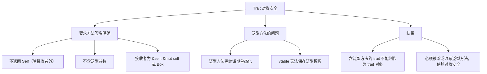

# Rust Object Safety

## 目录

- [Rust Object Safety](#rust-object-safety)
  - [目录](#目录)
  - [1. 对象安全的定义](#1-对象安全的定义)
  - [2. 对象安全的必要条件](#2-对象安全的必要条件)
  - [3. 示例说明](#3-示例说明)
    - [示例1：对象安全的 trait](#示例1对象安全的-trait)
    - [示例2：不符合对象安全要求的 trait](#示例2不符合对象安全要求的-trait)
  - [4. 对象安全的限制与设计权衡](#4-对象安全的限制与设计权衡)
  - [总结](#总结)
  - [1. 返回 `Self` 类型的问题](#1-返回-self-类型的问题)
  - [2. 泛型参数的问题](#2-泛型参数的问题)
  - [3. 总结](#3-总结)
  - [1. 什么是对象安全（Object Safety）](#1-什么是对象安全object-safety)
    - [对象安全需要满足的主要条件](#对象安全需要满足的主要条件)
  - [2. 为什么需要对象安全](#2-为什么需要对象安全)
  - [3. 反例与示例](#3-反例与示例)
    - [3.1 反例：返回 `Self` 的方法](#31-反例返回-self-的方法)
    - [3.2 反例：泛型方法](#32-反例泛型方法)
    - [3.3 对象安全的示例](#33-对象安全的示例)
  - [4. 思维导图](#4-思维导图)
  - [5. 总结](#5-总结)
  - [1. Trait 对象安全概述](#1-trait-对象安全概述)
  - [2. 泛型方法与对象安全](#2-泛型方法与对象安全)
    - [2.1 泛型方法不满足对象安全要求](#21-泛型方法不满足对象安全要求)
    - [2.2 理解对象安全规范](#22-理解对象安全规范)
  - [3. 举例说明](#3-举例说明)
    - [3.1 不对象安全的 trait 示例](#31-不对象安全的-trait-示例)
    - [3.2 对象安全的 trait 示例](#32-对象安全的-trait-示例)
  - [思维导图](#思维导图)
  - [--总结](#--总结)
    - [-总结](#-总结)

下面详细介绍 Rust 中对象安全（Object Safety）的定义、解释和所受到的限制。

## 1. 对象安全的定义

在 Rust 中，一个 trait 是否能被用于动态分发
（例如，构造 `&dyn Trait` 或 `Box<dyn Trait>` 这种 trait 对象）取决于它是否是**对象安全**的。
**简单来说，一个 trait 如果允许在不知道具体实现类型的情况下调用它的方法，就称为对象安全。**
**对象安全性保证了 trait 的所有方法都能通过动态分发机制安全调用。**

## 2. 对象安全的必要条件

为了使一个 trait 成为对象安全的，需要满足以下条件：

1. **方法不使用未固定的泛型参数**  
   - **要求**：trait 中的方法不能是泛型方法（即方法本身不能带有类型参数）。  
   - **原因**：泛型方法依赖于编译时具体类型信息，而 trait 对象旨在提供运行时动态调用，无法支持泛型方法的单态化（Monomorphization）。

2. **方法接收者（Receiver）的限制**  
   - **要求**：方法必须使用 `self`、`&self` 或 `&mut self` 作为接收者，而不能使用其他形式。  
   - **说明**：这样编译器才能通过 trait 对象的指针调用对应的方法。

3. **返回类型不能裸露地使用 `Self`**  
   - **要求**：如果方法返回一个值，则其返回类型中不能直接是 `Self`（如 `fn foo(&self) -> Self;`）。  
   - **原因**：trait 对象没有确定的大小，无法通过动态分发返回一个未知大小的具体类型。  
   - **例外**：如果返回的是指针包装类型，比如 `Box<Self>`、`Rc<Self>` 等，则是允许的，因为这些指针具有固定大小，可用于动态分发。

4. **额外的 Sized 限制**  
   - **要求**：trait 本身不能依赖于 `Self: Sized` 限定（除非为某些特定方法添加该约束，而这些方法不会通过 trait 对象调用）。  
   - **原因**：trait 对象必须适用于大小未知的动态类型，如果 trait 附带 `Self: Sized` 的隐藏要求，就会破坏这种兼容性。

## 3. 示例说明

### 示例1：对象安全的 trait

```rust:src/object_safe.rs
// 定义一个对象安全的 trait，因为所有方法都满足对象安全要求
trait ObjectSafe {
    // 接收者为 &self，且方法不返回裸 Self
    fn foo(&self);

    // 返回 Box<Self> 是允许的，因为包装类型尺寸固定
    fn clone_box(&self) -> Box<dyn ObjectSafe>;
}

// 实现该 trait 的示例类型
struct MyType {
    value: i32,
}

impl ObjectSafe for MyType {
    fn foo(&self) {
        println!("MyType foo, value: {}", self.value);
    }

    fn clone_box(&self) -> Box<dyn ObjectSafe> {
        // 通过 Box 克隆当前实例
        Box::new(MyType { value: self.value })
    }
}

fn main() {
    let instance = MyType { value: 100 };
    // 使用 trait 对象进行动态分发
    let obj: &dyn ObjectSafe = &instance;
    obj.foo();
}
```

在这个示例中，所有方法都采用 `&self` 作为接收者，没有使用泛型，并且返回值类型均满足限制，
因此 `ObjectSafe` trait 是对象安全的，可以构造 trait 对象进行动态分发。

### 示例2：不符合对象安全要求的 trait

```rust:src/non_object_safe.rs
// 定义一个不对象安全的 trait
trait NonObjectSafe {
    // 返回裸露的 Self 会导致对象安全性问题
    fn duplicate(&self) -> Self;
}
```

在这个例子中，由于方法 `duplicate` 直接返回 `Self`（即调用者的具体类型），
所以无法在不知道具体类型的情况下通过 trait 对象调用，因而 `NonObjectSafe` 不能用作 trait 对象。

## 4. 对象安全的限制与设计权衡

对象安全性虽然为动态分发提供了支持，但也带来了一些限制和设计考量：

- **限制泛型方法使用**  
  - **问题**：在对象安全 trait 中不能定义带有方法级别泛型参数的方法。  
  - **影响**：这可能限制接口设计的灵活性，迫使设计者利用其他方式（例如借助关联类型）来实现多态性。

- **限制返回裸 Self 类型**  
  - **问题**：返回 `Self` 的方法不能通过 trait 对象调用。  
  - **解决方案**：可采用返回 `Box<Self>`、`Rc<Self>` 或其他包装类型来规避这一限制。

- **设计上的权衡**  
  - **动态分发与静态分发的选择**：使用 trait 对象时，必须放弃一些编译时静态优化特性。对象安全 trait 只能用于那些在运行时可以确定调用方法的情况。  
  - **接口设计影响**：为了使 trait 成为对象安全，开发者需在接口设计时避免某些灵活性，比如泛型方法和直接返回具体 Self 值，这要求在设计时需要在灵活性与动态调用兼容性之间找到平衡。

## 总结

- **定义**：对象安全性决定了一个 trait 是否可以被用来创建 trait 对象，从而实现运行时动态分发。  
- **必要条件**：包括不使用方法级泛型、接收者必须为 `self`（或引用形式）、返回类型中不能裸露使用 `Self` 以及不能附带全局的 `Self: Sized` 要求。  
- **限制**：对象安全 trait 的设计会在方法灵活性上受到一定限制，可能无法支持直接返回 Self 或泛型方法，这在一定程度上影响了接口设计的多样性，但为动态分发提供了必要的安全保障。

通过理解这些要求和限制，可以更好地设计和使用 trait 对象，从而在需要动态多态的场景下充分发挥 Rust 的安全特性。

下面详细说明为何在 Rust 的对象安全要求中，不允许 trait 方法返回 `Self` 类型或包含泛型参数。

## 1. 返回 `Self` 类型的问题

**背景**：  
当我们使用 trait 对象（例如 `Box<dyn Trait>` 或 `&dyn Trait`）时，实际上就失去了具体实现类型的信息。也就是说，虽然在编译时我们知道某个类型实现了 trait，但转换为 trait 对象后，编译器就无法确认该对象到底属于哪种具体类型。

**问题所在**：  

- 如果 trait 方法的返回值为 `Self`，那么该方法在具体实现时会返回具体类型的实例。如果用 trait 对象来调用该方法，编译器无法在运行时通过动态调度确定正确的返回类型。  
- 对象安全要求在动态分派下方法签名必须明确且稳定，而 `Self` 代表调用该方法时的具体类型，这在 trait 对象中是不明确的。

**举例说明**：  
假设有如下 trait：

```rust
trait Cloneable {
    fn clone_box(&self) -> Self;
}
```

对于具体类型来说，实现 `clone_box` 方法返回一个与自身相同的实例没有问题；  
但如果我们写成动态调用：

```rust
fn clone_it(item: &dyn Cloneable) -> Box<dyn Cloneable> {
    // 如何从 &dyn Cloneable 得到正确的返回类型？无法确定
    Box::new(item.clone_box())
}
```

在上面的代码中，我们无法确定 `clone_box` 返回的具体类型是什么，因此不能安全地进行动态分派。
为了形成稳定的 API，Trait 对象要求方法返回的类型必须在 trait 对象级别上可确定，而 `Self` 并不满足这一点。

## 2. 泛型参数的问题

**背景**：  
泛型方法在编译时会通过单态化生成具体实现。
但动态调度（trait 对象）是在运行时通过虚表（vtable）来调用方法，而虚表要求所有方法签名在编译时已完全确定。

**问题所在**：  

- 如果 trait 方法带有未确定的泛型参数（例如方法中有类型参数或带有泛型的返回值），
- 在进行动态分派时，编译器就无法构造对应的虚表，因为每一种泛型参数组合都会产生不同的函数签名。  
- 换句话说，虚表的每个条目必须描述一个明确的函数签名，
- 而带泛型的方法无法满足这一点，因为它们必须先在编译期确定具体类型才能调用。

**举例说明**：  
例如有如下 trait：

```rust
trait Transformer {
    fn transform<T>(&self, value: T) -> T;
}
```

在这个 trait 中，`transform` 方法有一个未固定的泛型参数 `T`。  
当我们尝试将该 trait 做成 trait 对象时，

```rust
fn use_transformer(t: &dyn Transformer) {
    // 编译器无法通过虚表确定 transform 方法具体调用哪种实例化
    let result = t.transform(123);
}
```

上面的代码无法正常工作，因为 `transform` 方法的签名在不同 `T` 的具体化时是不一样的，
虚表无法预先存放所有可能的实例化版本，因此这种带泛型的方法就不能用于动态分派。

## 3. 总结

- **返回 `Self` 类型**：  
  当 trait 方法返回 `Self` 时，其具体返回类型依赖于调用者的具体类型；
  而 trait 对象失去了具体类型信息，无法确定返回类型，这就破坏了动态分派的稳定性，从而使得该 trait 不满足对象安全要求。

- **泛型参数**：  
  带有泛型参数的方法无法在 trait 对象的虚表中确定具体的函数签名，
  动态分派需要每个方法的签名在编译时完全确定，因此包含泛型参数的 trait 方法也会使 trait 不对象安全。

因此，为了让 trait 能够用于动态分派（构成 trait 对象），它们的方法必须满足“对象安全”的要求，
即所有方法的签名必须在编译时确定、不能依赖于调用时具体类型的信息（如返回 `Self` 或带有未固定泛型参数的方法），从而确保在运行时可以通过虚表准确调用对应方法。

下面介绍 Rust 中“object safe”（对象安全）的定义、原因、常见的反例，并通过实例和思维导图解释这些概念的内在联系。

## 1. 什么是对象安全（Object Safety）

**对象安全**指的是一个 trait 是否能够被“转化”为 trait 对象（例如 `&dyn Trait`、`Box<dyn Trait>` 等），以便在运行时使用动态分派调用其方法。
也就是说，如果一个 trait 满足对象安全的条件，就可以隐藏具体类型，只依赖于该 trait 的接口进行编程。

### 对象安全需要满足的主要条件

1. **方法签名中不能出现未被限制的 Self**  
   如果 trait 中的方法返回 `Self` 或者参数中出现 `Self`（除了接收者之外），那么在动态分派时无法确定返回类型或参数类型，因此该方法导致整个 trait 不对象安全。

2. **方法不能有泛型参数**  
   泛型方法要求在调用时确定具体的类型参数，违背了在trait对象中隐藏具体实现类型的初衷，因此包含泛型参数的方法也不能被动态调度。

3. **必须有明确的接收者类型**  
   方法的接收者（例如 `&self`、`&mut self`、`Box<Self>`）要能通过 trait 对象动态调用，而不能是类似 `self`（按值传递）的非对象安全接收方式。

简而言之，一个 trait 中的所有方法都必须满足：  

- 方法中不能直接或间接地使用 `Self`（除了作为接收者部分）。  
- 方法不能是泛型的（不允许额外的类型参数）。

## 2. 为什么需要对象安全

- **动态分派需求**  
  当我们使用 trait 对象（例如 `Box<dyn Trait>`）时，编译器在运行时通过虚表（vtable）来确定具体的方法实现。
  为了保证这种动态分派能正常运行，trait 的所有方法都必须具有统一且不依赖于具体类型的信息。

- **隐藏具体实现**  
  对象安全允许我们将不同的类型（实现了相同 trait 的类型）以统一接口进行处理，而不需要在编译期间知道具体类型。这样能更好地实现解耦和接口抽象。

## 3. 反例与示例

### 3.1 反例：返回 `Self` 的方法

下面这个 trait 由于包含返回 `Self` 的方法，导致无法作为 trait 对象使用：

```rust:src/non_object_safe/self_return.rs
// 该 trait 不对象安全，因为 make_self 返回了 Self。
trait NonObjectSafe {
    fn do_something(&self);
    fn make_self() -> Self;
}
```

如果尝试对其创建 trait 对象，如 `Box<dyn NonObjectSafe>`，编译器会报错，提示 trait 不满足对象安全要求。

### 3.2 反例：泛型方法

另外一个常见反例是包含泛型方法的 trait：

```rust:src/non_object_safe/generic_method.rs
trait GenericMethod {
    // 泛型方法导致 trait 不能作为 trait 对象
    fn do_generic<T>(&self, data: T);
}
```

由于 `do_generic` 方法在调用时需要确定具体类型参数，所以编译器无法在动态分派时生成一个统一的调用接口，这也会使得该 trait 无法被转成 trait 对象。

### 3.3 对象安全的示例

下面是一个满足对象安全要求的 trait 示例：

```rust:src/object_safe/example.rs
trait ObjectSafe {
    // 接收者为 &self，返回类型固定，不涉及 Self。
    fn do_something(&self);
    
    // 此种写法是允许的，方法中使用了 Self 但仅限于接收者形式。
    fn describe(&self) -> String;
}

// 实现该 trait 的具体类型
struct MyType;

impl ObjectSafe for MyType {
    fn do_something(&self) {
        println!("MyType doing something!");
    }
    
    fn describe(&self) -> String {
        "I am MyType".to_string()
    }
}

// 此时可以构造 trait 对象
fn call_it(obj: &dyn ObjectSafe) {
    obj.do_something();
    println!("{}", obj.describe());
}
```

在这个例子中，`ObjectSafe` 满足所有要求，因此可以安全转换为 trait 对象进行动态调用。

## 4. 思维导图

下面使用 Mermaid 绘制一份思维导图，总结 Rust 对象安全的核心概念、原因以及反例的关系：

```mermaid:diagram/rust_object_safe.mmd
flowchart TD
    A[Rust 对象安全]
    
    A --> B[定义]
    B --> B1[Trait 可转为 trait 对象]
    B --> B2[支持动态分派]
    
    A --> C[必要条件]
    C --> C1[方法不返回 Self]
    C --> C2[方法中不使用泛型参数]
    C --> C3[接收者必须为 &self, &mut self 或 Box<Self>]
    
    A --> D[原因]
    D --> D1[保证动态分派可靠性]
    D --> D2[隐藏具体实现细节]
    D --> D3[实现接口抽象]
    
    A --> E[反例]
    E --> E1[返回 Self 的方法]
    E --> E2[包含泛型方法]
    
    E1 --- F[示例: fn make_self() -> Self]
    E2 --- G[示例: fn do_generic<T>(&self, data: T)]
    
    A --> H[对象安全示例]
    H --> H1[只包含 &self 方法且返回固定类型]
```

## 5. 总结

- **对象安全**是确保 trait 对象能在运行时通过统一接口分派方法的基本要求。
- 为了满足对象安全，trait 中的方法不能返回 `Self`（作为输出或参数形式）或使用泛型方法，并且接收者必须采用引用或智能指针等形式。
- 如果违反这些规则（如返回 `Self` 或者存在泛型方法），则相应的 trait 不能被用于动态分派，无法构造 trait 对象。
- 通过对比对象安全与非对象安全的写法，可以清楚地看出 Rust 在设计 trait 对象时所需的严格约束，从而保证接口抽象和动态调用的安全性。

以上就是关于 Rust 对象安全的定义、原因、反例和详细解释，以及相应的思维导图。

下面介绍一下 Rust 中 trait 的对象安全规范，以及为什么包含泛型方法的 trait 不满足对象安全要求。
下面从定义、原因、举例以及思维导图四个方面说明这一问题。

## 1. Trait 对象安全概述

**对象安全（Object Safety）** 指的是一个 trait 是否能转化为 trait 对象（例如 `&dyn Trait` 或 `Box<dyn Trait>`），从而在运行时进行动态分派调用。
为了保证 trait 对象可以采用统一的虚表（vtable）机制进行调用，其 trait 的方法必须满足一定的条件。主要要求包括：

- 方法的签名中不能出现无法在运行时确定的 `Self` 类型信息（例如返回 `Self` 或用作参数的非接收者位置）。
- 方法不能为泛型调用（即方法中不能有额外的泛型参数），因为对于泛型方法，编译器需要在调用时进行单态化，而 trait 对象在运行时无法确定具体类型。
- 接收者必须通过引用或智能指针形式传递（如 `&self`、`&mut self` 或 `Box<Self>`）。

简单来说，如果一个 trait 中存在泛型方法，则该方法在 trait 对象中无法被动态分派，因为其泛型参数在运行时无法确定，从而违反对象安全的要求。

## 2. 泛型方法与对象安全

### 2.1 泛型方法不满足对象安全要求

在 trait 中定义的泛型方法，例如：

```rust:title:泛型方法示例（不对象安全）
trait MyTrait {
    // 含有泛型参数的方法
    fn generic_method<T>(&self, value: T);
}
```

这种方法会在编译时根据不同的 `T` 生成多个版本（单态化）。
但是，当你将 `MyTrait` 用作 trait 对象时（例如 `Box<dyn MyTrait>`），
编译器需要确定方法的具体调用地址，而由于 `generic_method` 是对所有 `T` 都适用的泛型方法，
vtable 无法保存一个“通用模板”来处理它。
因此，包含这种泛型方法的 trait 无法构建 trait 对象，会出现编译错误。

### 2.2 理解对象安全规范

对象安全的要求确保所调用的所有方法在运行时通过单一的 vtable 调用被分派出来。具体来说：

- **方法签名中的泛型参数**：泛型方法需要编译期决定具体类型后生成多份代码，而 trait 对象只有一个 vtable 记录某个确定的函数指针，无法在运行时根据不同类型生成对应代码，所以泛型方法无法被纳入。
- **方法返回类型涉及 Self**：如果方法返回 `Self`，那么在 trait 对象中具体返回值的类型就无法确定，因为 `Self` 表示实现该 trait 的具体类型，而 trait 对象隐藏了这个信息。

因此，为了能够将 trait 制作成 trait 对象，
其所有方法都必须满足“即使在抽象之后依然能通过单一具体函数指针调用”的要求，
从而使得动态分派成为可能。

## 3. 举例说明

### 3.1 不对象安全的 trait 示例

下面的例子展示了一个包含泛型方法的 trait，当试图构造 trait 对象时会出错：

```rust:title:不对象安全的 trait 示例
trait NonObjectSafe {
    // 泛型方法导致 NonObjectSafe 不能转为 trait 对象
    fn generic_method<T>(&self, value: T);
}

// 尝试将其作为 trait 对象使用，会报错：
fn use_trait_object(obj: &dyn NonObjectSafe) {
    // 无法调用 generic_method，因为泛型参数 T 无法确定
    // obj.generic_method(42);
}
```

编译器会指出 `generic_method` 使用了泛型参数，不符合对象安全要求。

### 3.2 对象安全的 trait 示例

下面是一个符合对象安全要求的 trait 示例：

```rust:title:对象安全的 trait 示例
trait ObjectSafe {
    // 普通方法（无泛型参数，返回固定类型）是对象安全的
    fn do_something(&self);
    fn describe(&self) -> String;
}

struct MyStruct;

impl ObjectSafe for MyStruct {
    fn do_something(&self) {
        println!("MyStruct doing something");
    }
    
    fn describe(&self) -> String {
        "I am MyStruct".to_string()
    }
}

// 此时可以创建 trait 对象
fn use_object_safe(obj: &dyn ObjectSafe) {
    obj.do_something();
    println!("{}", obj.describe());
}
```

在这个例子中，所有方法的签名都不带额外泛型参数，而且返回类型固定，
因此 `ObjectSafe` 可以被转为 trait 对象进行动态分派。

## 思维导图

使用 Mermaid 绘制思维导图，总结泛型方法与对象安全的关系：



## --总结

- **泛型方法**：在 trait 中的泛型方法由于其调用依赖于编译期的单态化机制，因此不能在 trait 对象中使用。这是因为 trait 对象必须通过单一 vtable 动态分派，而泛型方法无法提供这种统一接口。
- **对象安全规范**：要求 trait 的所有方法都不能在签名中依赖于未确定的类型信息（如泛型参数、返回 `Self` 等），以保证在运行时能够明确调用到具体实现。
- **理解关键**：当设计 trait 时，若考虑到后续需要通过动态分派使用 trait 对象，则避免在 trait 中定义泛型方法或返回类型含有 `Self` 的方法。必要时，可以将泛型功能转为在具体实现或其他辅助层解决。

通过这种理解和设计，我们可以更好地运用 trait 对象，实现接口抽象与动态分派，同时又不失灵活性。

下面讨论 Rust 中泛型 trait 在指定了具体类型参数后是否对象安全，以及如何理解 trait 的对象安全规范。回答要点如下：

1. **泛型 trait 与对象安全的关系**  
   Rust 允许 trait 定义时带有泛型参数，例如：

   ```rust:src/example_trait_generic.rs
   // 带有泛型参数 T 的 trait
   pub trait MyTrait<T> {
       fn do_something(&self) -> T;
   }
   ```

   当你使用这个 trait 时，可以选择为泛型参数指定具体类型，例如 `dyn MyTrait<u32>`。
   如果 trait 内的所有方法在签名上满足对象安全规则（例如没有额外的泛型方法、没有返回 `Self` 之类的问题），
   那么**指定了具体泛型参数后的 trait 对象是对象安全的**。

2. **对象安全规则回顾**  
   要构建 trait 对象（如 `&dyn Trait` 或 `Box<dyn Trait>`），trait 必须满足以下条件：
   - **方法签名不允许额外泛型参数**：如果 trait 中的方法自身定义了新的泛型参数，那么该方法就不能在运行时确定具体类型，从而不能通过 vtable 进行动态分派。
   - **不返回 `Self`（除作为接收者外）**：方法返回类型如果涉及 `Self`（代表具体实现类型），会破坏 trait 对象的抽象性。
   - **接收者必须是引用或智能指针**（如 `&self`、`&mut self` 或 `Box<Self>`）。

3. **指定泛型参数后的 trait 是否对象安全**  
   指定泛型参数（如 `dyn MyTrait<u32>`）只解决了 trait 外部泛型参数的问题，但并不自动处理 trait 内其他可能导致对象不安全的方法。
   例如：

   - 如果 trait 中没有额外的泛型方法，且所有方法均符合上述对象安全要求，那么我们使用 `dyn MyTrait<u32>` 时是对象安全的。
   - 如果 trait 还定义了带有额外泛型参数的方法，那么即使为外部泛型参数指定了具体值，也依然会导致该方法无法进行动态分派，从而使整个 trait 不能作为 trait 对象使用。

   **举例说明：**

   *示例 1：对象安全的 trait（指定泛型参数后）*

   ```rust:src/object_safe_trait.rs
   pub trait ObjectSafeTrait<T> {
       // 方法签名没有额外泛型参数
       fn get(&self) -> T;
   }
   
   // 实现该 trait
   pub struct MyStruct;
   
   impl ObjectSafeTrait<u32> for MyStruct {
       fn get(&self) -> u32 {
           42
       }
   }
   
   // 指定了具体类型后的 trait 对象使用：
   fn use_object_safe(obj: &dyn ObjectSafeTrait<u32>) {
       println!("value: {}", obj.get());
   }
   ```

   在这个例子中，`ObjectSafeTrait<u32>` 是对象安全的，因为所有方法都符合规则，因此可通过 `&dyn ObjectSafeTrait<u32>` 构建 trait 对象。

   *示例 2：不对象安全的 trait（泛型方法）*

   ```rust:src/non_object_safe_trait.rs
   pub trait NonObjectSafeTrait<T> {
       // 泛型方法仍然存在
       fn generic_method<U>(&self, value: U);
   }
   ```

   即便我们写作 `dyn NonObjectSafeTrait<u32>`，因为方法 `generic_method<U>` 带有额外的泛型参数 `U`，导致 trait 不满足对象安全要求，从而无法构造 trait 对象。

4. **思维导图说明**

   使用 Mermaid 绘制一份思维导图，总结泛型 trait 指定具体类型后是否对象安全的关系和关键点：

   ```mermaid:diagram/generic_trait_object_safety.mmd
   flowchart TD
       A[泛型 Trait 定义]
       A --> B[外部泛型参数]
       B --> B1[如 MyTrait<T>]
       
       A --> C[对象安全要求]
       C --> C1[方法不含额外泛型参数]
       C --> C2[方法不返回 Self]
       C --> C3[接收者为 &self / &mut self / Box<Self>]
       
       A --> D[指定具体类型后的 trait]
       D --> D1[示例：dyn MyTrait<u32>]
       D1 --> E[对象安全？]
       E --> F[若所有方法满足条件 → 对象安全]
       E --> G[若存在泛型方法 → 不对象安全]
   ```

### -总结

- **指定外部泛型参数**将泛型 trait 实例化为特定类型（例如 `dyn MyTrait<u32>`）后，
能消除外部泛型的不确定性，但仍要求 trait 内部所有方法遵守对象安全规则。
- **对象安全的核心要求**：方法不能具有额外的泛型参数，不能返回 `Self`（除接收者之外），
并且接收者必须是引用或智能指针。
- **因此**：如果一个泛型 trait 在指定具体类型参数后，其方法签名均满足对象安全要求，
则该 trait 对象是对象安全的；否则，即使外部参数指定后，仍可能因某些方法不符合条件而不对象安全。
