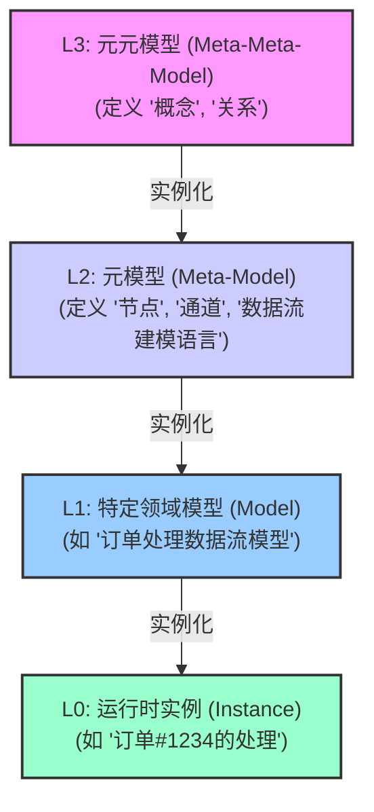
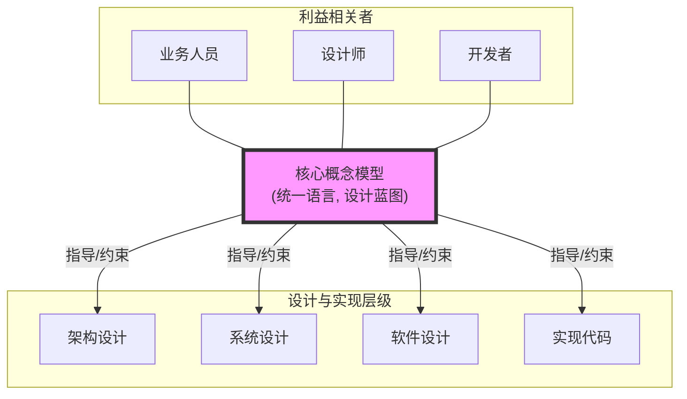
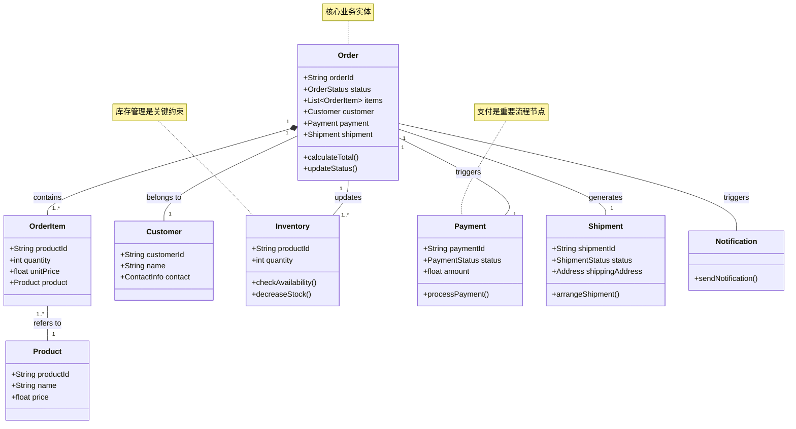
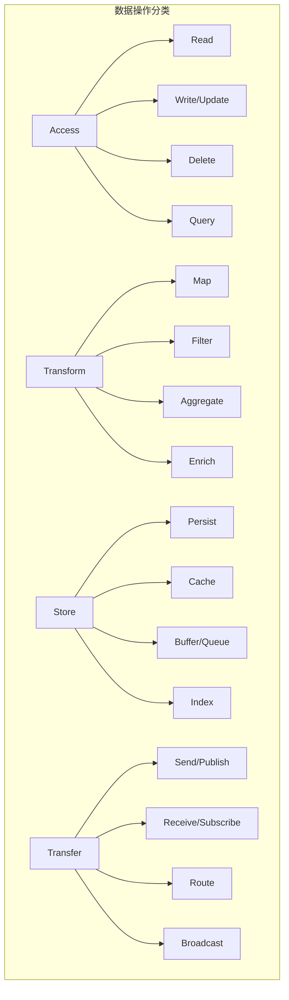
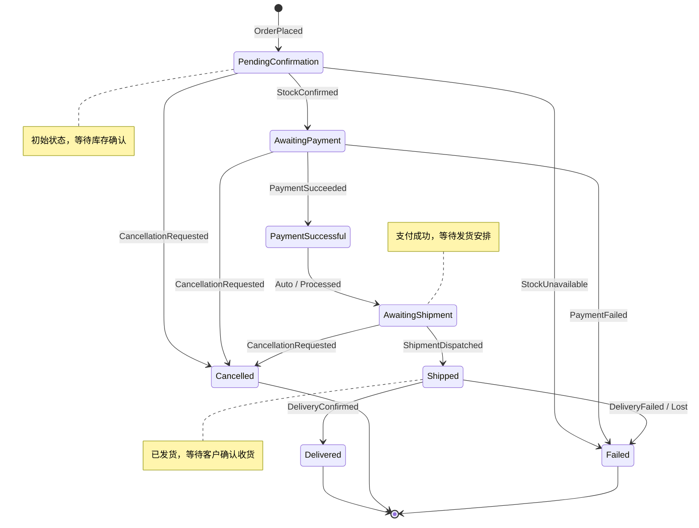
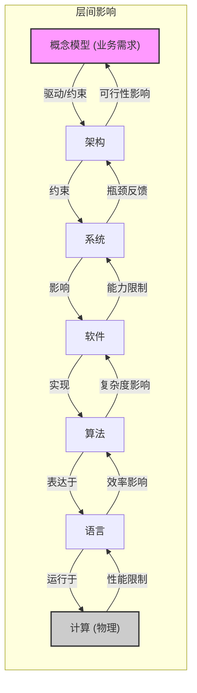

# 数据流的综合视角：从元模型到实践的系统性分析

**注意**: Markdown 渲染器需要支持 Mermaid 才能正确显示这些图表。如果您的环境不支持，您会看到代码块。

## 目录

- [数据流的综合视角：从元模型到实践的系统性分析](#数据流的综合视角从元模型到实践的系统性分析)
  - [目录](#目录)
  - [1. 引言：为何关注数据流与元模型？](#1-引言为何关注数据流与元模型)
    - [1.1 数据流的重要性](#11-数据流的重要性)
    - [1.2 元模型视角的价值](#12-元模型视角的价值)
    - [1.3 本文结构与视角说明](#13-本文结构与视角说明)
  - [2. 核心概念与基础框架](#2-核心概念与基础框架)
    - [2.1 数据流的精确定义](#21-数据流的精确定义)
    - [2.2 数据流的核心维度](#22-数据流的核心维度)
    - [2.3 元模型-模型层次结构](#23-元模型-模型层次结构)
    - [2.4 贯穿案例：订单处理系统](#24-贯穿案例订单处理系统)
  - [3. 概念模型：统一语言与设计蓝图](#3-概念模型统一语言与设计蓝图)
    - [3.1 概念模型的核心作用](#31-概念模型的核心作用)
    - [3.2 构建概念模型（以订单处理为例）](#32-构建概念模型以订单处理为例)
    - [3.3 概念模型的贯穿体现](#33-概念模型的贯穿体现)
  - [4. 数据流语义与操作的多维分析](#4-数据流语义与操作的多维分析)
    - [4.1 数据操作分类](#41-数据操作分类)
    - [4.2 数据流状态与转换语义](#42-数据流状态与转换语义)
      - [4.2.1 状态机表示（订单状态示例）](#421-状态机表示订单状态示例)
      - [4.2.2 状态性质与转换类型](#422-状态性质与转换类型)
  - [5. 分层数据流模型：从计算到业务](#5-分层数据流模型从计算到业务)
    - [5.1 概述：层次划分与整合视角](#51-概述层次划分与整合视角)
    - [5.2 计算层](#52-计算层)
    - [5.3 编程语言层](#53-编程语言层)
    - [5.4 算法设计层](#54-算法设计层)
    - [5.5 软件设计层](#55-软件设计层)
    - [5.6 系统设计层](#56-系统设计层)
    - [5.7 架构设计层](#57-架构设计层)
    - [5.8 业务模型层](#58-业务模型层)
    - [5.9 层间交互与影响](#59-层间交互与影响)
  - [6. 模型关系与跨层映射](#6-模型关系与跨层映射)
    - [6.1 模型内关系分析](#61-模型内关系分析)
    - [6.2 跨层次映射类型与特性](#62-跨层次映射类型与特性)
    - [6.3 同构与同态的应用](#63-同构与同态的应用)
  - [7. 形式化方法：严谨性与实践应用](#7-形式化方法严谨性与实践应用)
    - [7.1 为何需要形式化？](#71-为何需要形式化)
    - [7.2 数据流属性的形式化表达](#72-数据流属性的形式化表达)
    - [7.3 深入应用：类型系统与数据流安全](#73-深入应用类型系统与数据流安全)
    - [7.4 深入应用：模型检查与状态验证](#74-深入应用模型检查与状态验证)
    - [7.5 形式化的挑战与平衡](#75-形式化的挑战与平衡)
  - [8. 系统性设计与优化](#8-系统性设计与优化)
    - [8.1 数据流驱动的设计流程](#81-数据流驱动的设计流程)
    - [8.2 常见数据流优化模式](#82-常见数据流优化模式)
    - [8.3 理论与实践的衔接](#83-理论与实践的衔接)
  - [9. 行业应用与案例](#9-行业应用与案例)
    - [9.1 行业特定模式概述](#91-行业特定模式概述)
    - [9.2 案例分析：贯穿案例的实现考量](#92-案例分析贯穿案例的实现考量)
  - [10. 结论：数据流的综合价值](#10-结论数据流的综合价值)
  - [11. 术语表](#11-术语表)
  - [12. 思维导图](#12-思维导图)

---

## 1. 引言：为何关注数据流与元模型？

### 1.1 数据流的重要性

在现代软件系统中，数据不再仅仅是静态存储的实体，而是动态流动的核心资源。从用户交互、服务通信到后台处理，数据流贯穿了系统的每一个角落。理解、建模和优化数据流对于构建高效、可靠、可扩展的系统至关重要。传统的控制流视角不足以完全捕捉系统的动态行为，数据流视角提供了分析系统性能、并发、一致性和资源消耗的关键维度。

### 1.2 元模型视角的价值

面对数据流在不同抽象层次（从硬件到业务逻辑）的复杂表现，我们需要一个结构化的方法来理解和管理这种复杂性。元模型（Meta-Model）视角提供了一种强大的工具：

- **统一框架**：定义了描述数据流模型的基本概念、关系和规则，提供了一致的理解基础。
- **层次化分析**：支持在不同抽象层级（元元模型、元模型、模型、实例）上分析数据流。
- **严谨性**：为形式化分析和验证提供了基础。
- **可重用性**：元模型可以被实例化，用于构建特定领域的模型。

### 1.3 本文结构与视角说明

本文旨在整合多个视角，提供一个关于数据流的全面、系统性的论述。我们将融合：

- **系统性框架视角**（原`view05`）：关注数据流在软件工程生命周期中的作用，包括设计方法、领域模式等。
- **语义与操作视角**（原`view06`）：关注数据流的内在含义、状态转换以及在不同抽象层级上的具体操作（访问、转换、存储、传递）。
- **元模型视角**（原`view07`）：关注数据流模型的结构、不同层级模型间的关系以及形式化映射。

本文将以 **概念模型** 作为核心线索，展示其如何在不同层级和视角中发挥统一语言和设计蓝图的作用。我们将通过一个贯穿始终的 **订单处理系统案例** 来具体说明相关概念和实践。

---

## 2. 核心概念与基础框架

### 2.1 数据流的精确定义

**数据流(Data Flow)** 是指数据单元在系统内或系统间的 **移动**、**转换** 和 **处理** 过程。它不仅关注数据本身，更关注其流动的 **动态特性**。

形式化定义：数据流可表示为 $DF = (S, V, P, T, Q)$

- $S$: 数据源集合 (Sources)
- $V$: 数据值域 (Value Domain) - 数据单元的类型和结构
- $P$: 处理/转换节点集合 (Processing Nodes) - $p: V_{in} \rightarrow V_{out}$
- $T$: 传输通道集合 (Transport Channels / Edges) - 连接 $S$, $P$, 和数据汇 (Sinks)
- $Q$: 质量/时序属性集合 (Qualitative/Temporal Properties) - 如速率、延迟、顺序、一致性等

(注：此定义整合了原定义，更强调处理节点和传输通道)

### 2.2 数据流的核心维度

理解数据流需要从多个维度进行分析：

- **结构维度**：数据流的静态拓扑，包括源、汇、处理节点、通道及其连接关系。*(元模型视角侧重)*
- **语义维度**：数据单元的含义、类型以及转换操作的意义。*(语义操作视角侧重)*
- **操作维度**：对数据进行的具体操作，如访问、转换、存储、传递。*(语义操作视角侧重)*
- **量化维度**：吞吐量、速率、体积等可测量的流量特性。*(系统性框架视角侧重)*
- **时序维度**：延迟、处理时间、抖动、顺序等时间相关特性。*(系统性框架视角侧重)*
- **状态维度**：积压、缓冲、完整性、一致性等反映系统状态的特性。*(多视角均涉及)*
- **控制维度**：背压、流量控制、优先级等影响数据流动的机制。*(系统性框架视角侧重)*

### 2.3 元模型-模型层次结构

理解数据流模型本身需要一个层次化的框架：



- **图示说明**：此图展示了从最高层的元元模型（定义基础构造块）到元模型（定义建模语言），再到具体模型（特定领域表示），最终到运行时实例的实例化过程。

### 2.4 贯穿案例：订单处理系统

为了更好地说明各层级和概念，我们将使用一个简化的**电子商务订单处理系统**作为贯穿案例。其核心流程包括：

1. **接收订单** (Receive Order)：客户提交订单请求。
2. **验证订单** (Validate Order)：检查订单信息完整性、商品有效性。
3. **检查库存** (Check Inventory)：确认商品是否有足够库存。
4. **处理支付** (Process Payment)：通过支付网关处理支付。
5. **更新库存** (Update Inventory)：扣减已售商品库存。
6. **安排发货** (Arrange Shipment)：生成发货单，通知物流。
7. **通知客户** (Notify Customer)：告知订单状态更新。

我们将展示这个流程中的数据（订单信息、库存状态、支付结果等）如何在不同抽象层级流动和转换。

---

## 3. 概念模型：统一语言与设计蓝图

概念模型是理解和设计复杂系统的基石，它定义了领域内的核心概念及其关系，为所有后续的设计层级提供统一的语言和语义基础。

### 3.1 概念模型的核心作用

- **统一语言**：为业务人员、设计师、开发者提供共同的术语和理解，消除歧义。
- **领域核心**：捕捉业务领域最本质的概念和规则，不受具体技术实现的影响。
- **设计蓝图**：作为后续架构、系统、软件设计的输入和约束，指导设计决策。
- **稳定性锚点**：核心概念相对稳定，为应对技术和需求的快速变化提供基础。
- **知识传承**：显式化和结构化领域知识，便于维护和传承。



- **图示说明**：此图展示了概念模型作为中心枢纽，连接不同的利益相关者（提供统一语言），并指导和约束后续的架构、系统、软件设计及实现。

### 3.2 构建概念模型（以订单处理为例）

对于我们的订单处理系统，核心概念可能包括：

- **概念 (Concepts)**：`Order`, `Customer`, `Product`, `OrderItem`, `Inventory`, `Payment`, `Shipment`, `Notification`
- **关系 (Relationships)**：`包含`, `关联`, `属于`, `触发`, `导致`, `生成`
- **核心规则 (Rules/Invariants)**：订单总额计算规则, 库存检查规则, 支付发货规则等。



- **图示说明**：这是一个简化的UML类图，展示了订单处理系统中的核心概念及其关系。例如，一个 `Order` 包含多个 `OrderItem`，每个 `OrderItem` 关联一个 `Product`。`Order` 还与 `Customer`, `Payment`, `Shipment`, `Inventory` 和 `Notification` 存在关联。

### 3.3 概念模型的贯穿体现

概念模型不是孤立存在的，它贯穿于所有设计层级：

- **业务模型层**：直接体现概念模型，定义业务流程和规则。
- **架构设计层**：架构风格的选择（如事件驱动）需支持概念间的交互（如订单状态变更事件）。
- **系统设计层**：服务划分（如订单服务、库存服务）应围绕核心概念组织。数据库模式设计反映概念及其关系。
- **软件设计层**：类和接口的设计（如 `Order` 类、`InventoryService` 接口）是对概念模型的代码实现。
- **算法设计层**：库存检查算法、支付处理逻辑直接操作概念模型的实例。
- **编程语言层**：类型系统（如定义 `Order` 结构体）为概念提供静态保障。

在后续章节分析各层级时，我们将不断回溯到这个概念模型，展示其指导作用。

---

## 4. 数据流语义与操作的多维分析

本节聚焦于数据流的“内容”和“行为”，探讨数据的含义、状态以及作用于数据的操作。

### 4.1 数据操作分类

数据在流动过程中会经历各种操作，可从语义上分为几类：

1. **访问 (Access)**：获取或修改数据的存在或值。
2. **转换 (Transform)**：改变数据的格式、结构或派生新数据。
3. **存储 (Store)**：管理数据的生命周期和位置。
4. **传递 (Transfer)**：在不同位置或组件间移动数据。



- **图示说明**：此图将数据操作分为四大类（访问、转换、存储、传递），并列出了每类下的具体操作示例。

**Rust 代码示例 (部分操作类型)**:

```rust
// 假设有 Order, PaymentResult 等结构体

// 转换操作 (Map): 将 Order 转换为简化的 OrderSummary
fn transform_order_to_summary(order: &Order) -> OrderSummary { /* ... */ }

// 转换操作 (Filter): 筛选出需要发货的订单
fn filter_orders_ready_for_shipment(orders: Vec<Order>) -> Vec<Order> { /* ... */ }

// 访问操作 (Update): 更新订单状态
fn update_order_status(order: &mut Order, new_status: OrderStatus) { /* ... */ }

// 传递操作 (Publish - 模拟): 发布订单创建事件
fn publish_order_created_event(order: &Order, event_bus: &impl EventBus) { /* ... */ }
```

### 4.2 数据流状态与转换语义

数据流不仅传递数据，也驱动系统状态的变迁。

#### 4.2.1 状态机表示（订单状态示例）

使用状态机可以清晰地描述核心实体（如订单）的状态转换。

**订单状态机 (简化)**：



- **图示说明**：这是一个简化的订单状态机图。箭头表示状态转换，标签表示触发转换的事件。它清晰地展示了订单从创建到完成或失败的可能路径。

**Rust 代码示例 (状态枚举与转换)**:

```rust
#[derive(Debug, Clone, PartialEq, Eq)]
enum OrderStatus { /* ...状态定义... */ }

#[derive(Debug)]
enum OrderEvent { /* ...事件定义... */ }

impl OrderStatus {
    // 状态转换逻辑
    fn transition(self, event: OrderEvent) -> Result<OrderStatus, &'static str> { /* ...转换实现... */ }
}

// 使用示例
let current_status = OrderStatus::AwaitingPayment;
let event = OrderEvent::PaymentSucceeded;
match current_status.transition(event) {
    Ok(new_status) => println!("状态更新为: {:?}", new_status), // 输出: 状态更新为: PaymentSuccessful
    Err(e) => eprintln!("错误: {}", e),
}
```

- **代码说明**：此 Rust 代码定义了 `OrderStatus` 和 `OrderEvent` 枚举，并通过 `transition` 方法实现了状态转换逻辑。这直接反映了状态机模型，并通过 Rust 的类型系统提供了编译时的部分检查。

#### 4.2.2 状态性质与转换类型

- **静态性质**：数据在某个状态下必须满足的约束（如 `PaymentSuccessful` 状态的订单总金额必须大于0）。
- **动态性质**：状态转换过程中的属性（如支付操作的原子性）。
- **转换类型**：
  - *保持转换*：保持关键性质（如更新客户地址不改变订单状态）。
  - *变更转换*：改变状态和性质（如支付成功）。

---

## 5. 分层数据流模型：从计算到业务

本节整合不同视角，系统性地分析数据流在各个抽象层级的表现，并强调与**概念模型**和**贯穿案例**的联系。

### 5.1 概述：层次划分与整合视角

我们将数据流的分析划分为以下主要层次，并结合**语义/操作**和**元模型**视角进行分析：

```mermaid
graph TD
    subgraph Abstraction Levels
        direction TB
        L8[<b>8. 概念模型层</b><br/>(核心概念, 规则)]
        L7[<b>7. 业务模型层</b><br/>(流程, 事件)]
        L6[<b>6. 架构设计层</b><br/>(风格, 质量属性)]
        L5[<b>5. 系统设计层</b><br/>(服务, 资源, 协议)]
        L4[<b>4. 软件设计层</b><br/>(组件, 接口, 模式)]
        L3[<b>3. 算法设计层</b><br/>(数据结构, 步骤)]
        L2[<b>2. 编程语言层</b><br/>(变量, 类型, 语句)]
        L1[<b>1. 计算层</b><br/>(指令, 内存, 硬件)]
    end

    L8 -- 指导/约束 --> L7;
    L7 -- 驱动 --> L6;
    L6 -- 约束 --> L5;
    L5 -- 影响 --> L4;
    L4 -- 实现 --> L3;
    L3 -- 表达 --> L2;
    L2 -- 编译/运行于 --> L1;

    style L8 fill:#f9f,stroke:#333,stroke-width:2px
    style L1 fill:#ccc,stroke:#333,stroke-width:2px

```

- **图示说明**：此图展示了从底层的计算层到顶层的概念模型层的不同抽象层次。箭头大致表示了层级间的依赖和影响关系（高层指导低层，低层支撑高层）。

### 5.2 计算层

- **核心关注**：数据的物理表示（位/字节）、内存/寄存器传输、CPU指令执行。
- **语义/操作视角**：涉及 `Load`, `Store`, `ALU` 操作，数据流体现为电信号在总线上的传递。
- **元模型视角**：元模型定义 `Register`, `MemoryLocation`, `Instruction` 等概念。模型实例是具体的 CPU 架构和内存布局。
- **概念模型链接**：计算层是所有上层概念最终的物理实现基础，但直接映射关系不明显。
- **贯穿案例链接**：订单处理最终依赖 CPU 指令和内存操作完成计算。性能优化（如缓存局部性）与此层相关。

### 5.3 编程语言层

- **核心关注**：变量、类型、表达式、语句、函数调用中的数据流动。
- **语义/操作视角**：涉及 `Assignment`, `ParameterPassing`, `FieldAccess` 等操作。数据流体现为变量值的传递和修改。类型系统是核心语义约束。
- **元模型视角**：元模型定义 `Variable`, `Type`, `Expression`, `Function` 等概念。模型实例是具体的源代码。
- **概念模型链接**：语言中的结构体/类（如 `struct Order`) 直接映射概念模型中的概念。类型系统强制实施概念的部分约束。
- **贯穿案例链接**：定义 `Order`, `Product` 等结构体，函数参数传递订单对象，变量存储订单状态。

**Rust 代码示例 (类型系统与概念模型)**：

```rust
// 概念模型中的 Order 概念映射到 Rust 结构体
#[derive(Debug, Clone)] // 添加 Debug 和 Clone trait
struct Order { /* ... 字段 ... */ }

// 概念模型中的 OrderItem 概念
#[derive(Debug, Clone)]
struct OrderItem { /* ... 字段 ... */ }

// 类型系统确保了 Order 结构符合预期
fn process_new_order(order: &mut Order) -> Result<(), String> { /* ... 函数体 ... */ }
```

- **代码说明**：展示了如何将概念模型映射到 Rust 的 `struct`，以及类型系统和函数签名如何定义和约束数据流。

### 5.4 算法设计层

- **核心关注**：数据结构的选择与操作、算法步骤间的逻辑数据流。
- **语义/操作视角**：关注算法的 `Map`, `Filter`, `Aggregate` 等逻辑转换。数据流体现为数据在算法步骤间的传递和变换。算法不变量是关键语义。
- **元模型视角**：元模型定义 `DataStructure`, `AlgorithmStep`, `Complexity` 等概念。模型实例是具体的算法描述（伪代码或流程图）。
- **概念模型链接**：算法直接操作概念模型的实例（如库存检查算法操作 `Inventory` 概念）。算法的选择受概念关系和规则的影响。
- **贯穿案例链接**：库存检查算法（输入 `OrderItem` 列表，查询 `Inventory`，输出可用性），订单总价计算算法。

### 5.5 软件设计层

- **核心关注**：组件、模块、接口、设计模式间的数据交互。
- **语义/操作视角**：涉及 `MethodCall`, `EventPublication`, `MessageQueue` 等通信机制。数据流体现为组件间的消息或数据对象传递。接口契约定义了数据流的格式和语义。
- **元模型视角**：元模型定义 `Component`, `Interface`, `Message`, `Pattern` 等概念。模型实例是软件架构图或设计文档。
- **概念模型链接**：组件（如 `OrderService`, `InventoryComponent`）通常围绕核心概念设计。接口定义了对概念的操作。设计模式（如观察者模式用于状态通知）实现了概念间的交互。
- **贯穿案例链接**：`OrderService` 调用 `InventoryService` 的 `checkStock` 接口；订单状态改变时 `OrderService` 发布 `OrderUpdatedEvent`。

```mermaid
graph LR
    subgraph "软件设计层 (订单处理)"
        Client -->|REST API Request| OrderService;
        OrderService -->|checkStock()| InventoryService;
        InventoryService -->|stockLevel| OrderService;
        OrderService -->|processPayment()| PaymentService;
        PaymentService -->|paymentResult| OrderService;
        OrderService -->|updateStock()| InventoryService;
        OrderService -->|arrangeShipment()| ShipmentService;
        OrderService -->|OrderUpdatedEvent| EventBus;
        NotificationService -- subscribes --> EventBus;
    end
    style Client fill:#eee,stroke:#333
    style EventBus fill:#ccf,stroke:#333
```

- **图示说明**：此图展示了订单处理系统中主要组件（服务）之间的数据流和交互（方法调用和事件发布）。

### 5.6 系统设计层

- **核心关注**：分布式服务、资源、中间件、网络协议间的数据流。
- **语义/操作视角**：关注服务间的 `Request/Response`, 消息队列的 `Produce/Consume`。数据流涉及跨网络传输，序列化/反序列化是关键操作。一致性模型（强/最终）是核心语义。
- **元模型视角**：元模型定义 `Service`, `Resource`, `Middleware`, `Protocol`, `ConsistencyLevel` 等概念。模型实例是系统部署图或架构文档。
- **概念模型链接**：分布式服务通常对应领域的限界上下文（Bounded Context），其边界由概念模型指导。系统间的数据交换格式需要能表示核心概念。
- **贯穿案例链接**：`Order Service` 通过 REST API 或 gRPC 调用 `Payment Service`；使用 Kafka 传递订单事件；选择最终一致性处理库存更新。

### 5.7 架构设计层

- **核心关注**：系统整体结构、架构风格、质量属性、跨领域关注点。
- **语义/操作视角**：关注宏观数据流模式（如管道-过滤器、事件驱动）。架构决策影响全局数据流特性（性能、可靠性）。
- **元模型视角**：元模型定义 `Layer`, `Subsystem`, `ArchitecturalStyle`, `QualityAttribute` 等概念。模型实例是架构蓝图或视图。
- **概念模型链接**：架构风格的选择应支持核心概念的交互模式（如事件溯源适合需要历史追溯的 `Order` 概念）。质量属性（如订单处理的低延迟）约束了架构选择。
- **贯穿案例链接**：选择事件驱动架构来解耦订单、库存、支付和发货服务；为满足低延迟要求，支付服务采用特定的优化策略。

### 5.8 业务模型层

- **核心关注**：业务流程、业务规则、业务事件、业务实体状态转换。
- **语义/操作视角**：数据流直接体现业务逻辑（如订单流程状态流转）。业务规则定义了数据的验证和转换逻辑。
- **元模型视角**：元模型定义 `BusinessProcess`, `BusinessRule`, `BusinessEvent`, `BusinessEntity` 等概念。模型实例是 BPMN 图或业务规则文档。
- **概念模型链接**：业务模型层是最贴近概念模型的层次，直接操作和实现概念模型中定义的实体、关系和规则。
- **贯穿案例链接**：订单处理的完整业务流程图（BPMN），定义“满减优惠”的业务规则，订单状态机的业务逻辑实现。

### 5.9 层间交互与影响

各层次数据流并非孤立，而是相互影响：

- **自顶向下**：业务需求（概念模型）驱动架构选择，架构约束系统设计，系统设计影响软件实现，最终影响计算层资源使用。
- **自底向上**：计算层性能（如缓存命中率）影响语言层效率，算法复杂度影响软件设计选择，系统瓶颈可能迫使业务流程调整。
- **挑战**：保持跨层次的一致性、追踪变更影响、进行跨层优化。
- **关键**：清晰的接口定义、明确的抽象边界以及 **贯穿始终的概念模型** 有助于管理这种复杂性。



- **图示说明**：此图展示了不同抽象层级之间自顶向下（驱动/约束）和自底向上（限制/反馈）的相互影响关系。

---

## 6. 模型关系与跨层映射

本节深入探讨模型内部以及模型之间的关系，特别是不同抽象层次间的映射。

### 6.1 模型内关系分析

在一个特定层次的模型内部，元素之间存在多种关系：

- **结构关系**：`包含`, `关联`, `聚合`, `依赖` (如订单包含订单项)。
- **行为关系**：`调用`, `触发`, `订阅`, `读/写` (如订单服务调用库存服务)。
- **语义关系**：`泛化/特化` (IsA), `实现` (如具体支付处理器实现支付接口)。
- **分析方法**：图论分析（中心性、连通性）、依赖分析、耦合度/内聚度度量。

### 6.2 跨层次映射类型与特性

连接不同抽象层次模型的关键在于映射：

- **映射类型**：
  - `细化 (Refinement)`：高层抽象 -> 低层具体 (概念模型 -> 类设计)。
  - `抽象 (Abstraction)`：低层具体 -> 高层概括 (代码 -> 设计模式)。
  - `实现 (Realization)`：规约 -> 实现 (接口 -> 类)。
- **映射特性**：
  - `单射 (Injective)`：一对一映射。
  - `满射 (Surjective)`：目标全覆盖。
  - `双射 (Bijective)`：一一对应（同构的基础）。
- **形式化**：可以使用 `f: L_i -> L_j` 表示映射，并分析其保持的属性（如结构、操作）。

```mermaid
graph TD
    subgraph "跨层次映射类型"
        HighLevel["高层抽象 (L_i)"]
        LowLevel["低层具体 (L_j)"]

        HighLevel -- "细化 (Refinement)" --> LowLevel;
        LowLevel -- "抽象 (Abstraction)" --> HighLevel;
        Specification["规约"] -- "实现 (Realization)" --> Implementation["实现"];
    end

    subgraph "映射特性示例 (集合映射)"
        A[集合 A<br/>{a1, a2}]
        B[集合 B<br/>{b1, b2, b3}]
        C[集合 C<br/>{c1}]

        subgraph "单射 (Injective)"
            direction LR
            a1_i --> b1_i["b1"];
            a2_i --> b2_i["b2"];
            a1_i{"a1"} -- f1 --> b1_i;
            a2_i{"a2"} -- f1 --> b2_i;
            style b3_i fill:#eee, stroke:#ccc
            b3_i("b3<br/>(未被映射)");

        end
        subgraph "满射 (Surjective)"
            direction LR
             a1_s{"a1"} -- f2 --> c1_s["c1"];
             a2_s{"a2"} -- f2 --> c1_s;

        end
         subgraph "双射 (Bijective)"
             direction LR
            a1_b{"a1"} -- f3 --> b1_b["b1"];
            a2_b{"a2"} -- f3 --> b2_b["b2"];

        end

    end


```

- **图示说明**：顶部展示了主要的垂直映射类型：细化、抽象和实现。底部通过简单的集合映射示例说明了单射（每个源映射到唯一目标，目标可剩余）、满射（所有目标都被映射）和双射（一一对应）的概念。

### 6.3 同构与同态的应用

- **同构 (Isomorphism)**：结构完全等价，一一对应。理想情况，但在不同抽象层级间少见。若存在，则高低层模型可完全相互推导。
- **同态 (Homomorphism)**：保持操作结构。常见于接口与实现、父类与子类关系。允许在高层进行推理，并保证其在低层同样有效（在保持的操作范围内）。
- **应用**：验证模型一致性、确保低层实现符合高层设计、进行模型转换和代码生成。

---

## 7. 形式化方法：严谨性与实践应用

形式化方法利用数学和逻辑工具来描述、分析和验证系统属性，可以显著提高数据流系统的质量。

### 7.1 为何需要形式化？

- **消除歧义**：提供精确、无歧义的规范。
- **早期错误发现**：在设计阶段发现逻辑错误和不一致。
- **保证关键属性**：严格证明系统的正确性、安全性、一致性等。
- **自动化分析**：利用工具进行模型检查、定理证明。
- **复杂性管理**：提供处理复杂交互和并发的系统性方法。

### 7.2 数据流属性的形式化表达

可以使用逻辑（如谓词逻辑、时序逻辑LTL/CTL）来精确描述数据流属性：

- **安全性 (Safety)**：坏事永不发生 (如 `□ (¬ deadlock)` - 永远没有死锁)。
- **活性 (Liveness)**：好事终将发生 (如 `□ (request → ◊ response)` - 每个请求最终都会得到响应)。
- **顺序性 (Ordering)**：事件按特定顺序发生 (如 `EventA precedes EventB`)。
- **有界性 (Boundedness)**：资源使用或延迟在界限内 (如 `□ (queue_length < MAX)`)。

### 7.3 深入应用：类型系统与数据流安全

强类型系统（如 Rust）是一种轻量级但强大的形式化方法，可用于保证数据流的某些属性：

- **类型保证**：确保操作应用于正确类型的数据，防止类型错误。
- **状态编码**：将数据流的不同阶段编码为不同类型（如 `RawData` -> `ValidatedData` -> `ProcessedData`），编译器强制执行正确的处理顺序。
- **资源管理**：所有权和生命周期系统（如 Rust 的借用检查器）可以防止数据竞争、悬垂指针等并发和内存安全问题，保证数据流在并发环境下的完整性。

**Rust 示例 (利用类型系统保证处理流程)**:

```rust
// 使用类型标记数据状态
struct RawOrderData(String);
struct ValidatedOrder { /* ... */ }
struct PaidOrder(ValidatedOrder);
struct ShippedOrder(PaidOrder);

// 函数签名强制处理流程
fn parse_order(raw: RawOrderData) -> Result<ValidatedOrder, &'static str> { /* ... */ }
fn process_payment(order: ValidatedOrder) -> Result<PaidOrder, &'static str> { /* ... */ }
fn ship_order(order: PaidOrder) -> Result<ShippedOrder, &'static str> { /* ... */ }

fn complete_order_flow(raw_data: RawOrderData) -> Result<(), &'static str> {
    let validated = parse_order(raw_data)?;
    let paid = process_payment(validated)?;
    let _shipped = ship_order(paid)?;
    println!("Order flow completed successfully!");
    Ok(())
}

// 调用示例
let raw = RawOrderData("some raw order string".to_string());
let result = complete_order_flow(raw);
println!("Result: {:?}", result);
```

- **代码说明**：此示例通过不同类型强制订单处理必须按 `Parse -> Payment -> Ship` 的顺序进行，编译时即可发现流程错误。

### 7.4 深入应用：模型检查与状态验证

模型检查是一种自动化的形式化验证技术，用于检查系统模型是否满足给定的形式规约（通常用时序逻辑表示）。

- **原理**：系统被建模为状态转换系统，规约描述期望的属性。模型检查器探索所有可能的状态路径，检查是否存在违反规约的路径（反例）。
- **应用**：验证并发协议、检查安全/活性属性、验证状态机逻辑。
- **工具**：SPIN, TLA+, UPPAAL。
- **挑战**：状态空间爆炸。

**示例场景 (订单状态机验证)**：
使用模型检查工具验证订单状态机模型是否满足诸如“最终会到达终结状态”、“不会从已发货回到待支付”等属性。

### 7.5 形式化的挑战与平衡

- **成本与收益**：权衡投入与质量提升。
- **适用性**：选择合适的方法和工具。
- **集成**：融入现有开发流程。
- **关键在于平衡**：在关键模块应用形式化。

---

## 8. 系统性设计与优化

本节结合系统性框架视角，讨论数据流驱动的设计流程和优化策略。

### 8.1 数据流驱动的设计流程

一个系统性的、以数据流为中心的设计流程可能包含以下阶段：

1. **需求分析**：识别数据流相关需求和约束。*(回溯概念模型)*
2. **架构设计**：选择适合数据流的架构风格。*(概念模型指导)*
3. **详细设计**：设计接口、逻辑、缓冲、错误处理。*(接口体现概念)*
4. **实现与测试**：高效可靠地实现，进行针对性测试。*(类型系统保障)*
5. **运维与演化**：监控、自适应控制、规划演化。*(监控反映概念)*

### 8.2 常见数据流优化模式

- **性能**：批处理、缓存/局部性、并行化、异步处理、零拷贝。
- **可靠性**：冗余、断路器、重试/幂等、校验和。
- **可扩展性**：分片、负载均衡、队列缓冲、弹性伸缩。
- **可维护性**：标准化接口、模块化、可观察性。

**贯穿案例优化示例**：
对 `Check Inventory` 使用缓存；`Process Payment` 使用异步；`Notify Customer` 使用消息队列；为 `Receive Order` 实现负载均衡。

### 8.3 理论与实践的衔接

- **理论指导实践**：排队论估算缓冲，控制论设计背压。
- **实践反馈理论**：性能瓶颈揭示模型局限。
- **模式语言**：封装理论和实践经验。
- **关键在于映射**：理解理论模型与工程实践的对应和差异。

---

## 9. 行业应用与案例

### 9.1 行业特定模式概述

不同行业演化出特定的数据流模式：

- **金融**：低延迟、高可靠、事务一致性。
- **物联网**：海量连接、边缘计算、数据聚合。
- **实时控制**：硬实时、确定性、闭环反馈。
- **大数据分析**：大规模、弹性、流批一体。
- **多媒体**：高带宽、低延迟、自适应码率。

### 9.2 案例分析：贯穿案例的实现考量

回顾我们的**订单处理系统案例**，在实现时需要考虑：

- **架构**：事件驱动（如Kafka）。
- **服务**：微服务划分（Order, Inventory, Payment, Shipment）。
- **数据存储**：关系型/文档型DB，事件存储，缓存（Redis）。
- **一致性**：最终一致性（事件驱动），关键步骤强一致性（Saga/分布式事务）。
- **通信**：REST/gRPC/消息。
- **优化**：缓存、异步、负载均衡。
- **形式化应用点**：类型系统保流程，API契约定义，支付/库存逻辑模型检查。

---

## 10. 结论：数据流的综合价值

通过整合系统性框架、语义操作和元模型视角，我们对数据流有了更全面、更深入的理解。这种综合视角的核心价值在于：

- **统一性**：提供了一个连接硬件底层到业务顶层的统一分析框架，以概念模型为核心线索。
- **严谨性**：引入了形式化方法和元模型思维，提高了分析和设计的精确度。
- **实践性**：紧密结合设计模式、架构风格、优化策略和行业实践，指导实际系统构建。
- **系统性**：强调分层、关系、映射和跨层影响，培养全局和系统性思维。

掌握数据流的综合视角，对于设计和实现健壮、高效、可演化的现代软件系统至关重要。

---

## 11. 术语表

- **元模型 (Meta-Model)**：描述模型的模型，定义建模语言。
- **模型 (Model)**：对现实世界或系统的抽象表示。
- **概念模型 (Conceptual Model)**：领域核心概念、关系和规则的表示，独立于技术实现。
- **数据流 (Data Flow)**：数据单元的移动、转换和处理过程及其动态特性。
- **形式化方法 (Formal Methods)**：基于数学和逻辑的系统描述、分析和验证技术。
- **状态机 (State Machine)**：描述系统状态及状态间转换的模型。
- **映射 (Mapping)**：不同模型或抽象层次元素间的对应关系。
- **同构 (Isomorphism)**：保持结构和语义的一一对应映射。
- **同态 (Homomorphism)**：保持操作结构的映射。
- **类型系统 (Type System)**：编程语言中定义数据类型和约束规则的系统。
- **模型检查 (Model Checking)**：自动验证模型是否满足形式规约的技术。
- **LTL/CTL**：线性时序逻辑/计算树逻辑，用于表达时序属性。
- **限界上下文 (Bounded Context)**：领域驱动设计中，定义模型适用边界的概念。
- **CQRS (Command Query Responsibility Segregation)**：命令与查询责任分离模式。
- **事件溯源 (Event Sourcing)**：通过存储事件序列来记录系统状态变化。
- **背压 (Backpressure)**：下游向上游传递拥塞信号的流量控制机制。
- **幂等性 (Idempotence)**：操作执行一次和多次效果相同。

---

## 12. 思维导图

```text
数据流的综合视角：从元模型到实践
│
├── 1. 引言
│   ├── 数据流重要性
│   ├── 元模型视角价值
│   └── 本文结构与视角 (系统框架 + 语义操作 + 元模型)
│
├── 2. 核心概念与基础框架
│   ├── 数据流精确定义 (五元组: 源, 值域, 处理, 通道, 属性)
│   ├── 数据流核心维度 (结构, 语义, 操作, 量化, 时序, 状态, 控制)
│   ├── 元模型-模型层次结构 + [图]
│   └── 贯穿案例引入: 订单处理系统
│
├── 3. 概念模型：统一语言与设计蓝图
│   ├── 核心作用 + [图]
│   ├── 构建示例 (订单系统: 概念, 关系, 规则) + [图]
│   └── 贯穿体现 (指导各设计层级)
│
├── 4. 数据流语义与操作的多维分析
│   ├── 数据操作分类 (访问, 转换, 存储, 传递) + [图] + Rust示例
│   └── 数据流状态与转换语义
│       ├── 状态机表示 (订单状态示例 + [图] + Rust代码)
│       └── 状态性质与转换类型
│
├── 5. 分层数据流模型：从计算到业务 (整合视角)
│   ├── 概述 (层次划分, 整合说明) + [图]
│   ├── 计算层 (物理表示, 指令流)
│   ├── 编程语言层 (变量, 类型, 表达式流) + Rust示例
│   ├── 算法设计层 (数据结构, 算法步骤流)
│   ├── 软件设计层 (组件, 接口, 模式交互流) + [图]
│   ├── 系统设计层 (服务, 资源, 中间件交互流)
│   ├── 架构设计层 (风格, 质量属性影响宏观流)
│   ├── 业务模型层 (流程, 规则, 实体状态流)
│   └── 层间交互与影响 (自顶向下, 自底向上, 挑战) + [图]
│
├── 6. 模型关系与跨层映射
│   ├── 模型内关系分析 (结构, 行为, 语义关系; 分析方法)
│   ├── 跨层次映射类型与特性 (细化, 抽象, 实现; 单射, 满射, 双射) + [图]
│   └── 同构与同态 (特性与应用: 验证, 追踪, 同步)
│
├── 7. 形式化方法：严谨性与实践应用
│   ├── 为何需要形式化 (消除歧义, 早期纠错, 保证属性)
│   ├── 属性的形式化表达 (安全性, 活性, 时序, 一致性)
│   ├── 深入应用: 类型系统 (状态编码, 资源管理) + Rust示例
│   ├── 深入应用: 模型检查 (状态验证, 并发协议) + 场景示例
│   └── 形式化的挑战与平衡 (成本收益, 适用性, 集成)
│
├── 8. 系统性设计与优化
│   ├── 数据流驱动的设计流程 (需求->架构->设计->实现->运维)
│   ├── 常见数据流优化模式 (性能, 可靠性, 扩展性, 可维护性) + 案例应用
│   └── 理论与实践的衔接 (理论指导实践, 实践反馈理论, 模式语言)
│
├── 9. 行业应用与案例
│   ├── 行业特定模式概述 (金融, 物联, 实时, 大数据, 多媒体)
│   └── 案例分析: 贯穿案例实现考量 (架构, 服务, 存储, 一致性, 优化)
│
├── 10. 结论：数据流的综合价值
│    ├── 统一性 (跨层连接)
│    ├── 严谨性 (形式化精确)
│    ├── 实践性 (指导构建)
│    └── 系统性 (全局思维)
│
├── 11. 术语表 (关键术语解释)
│
└── 12. 思维导图 (本文结构)
```
