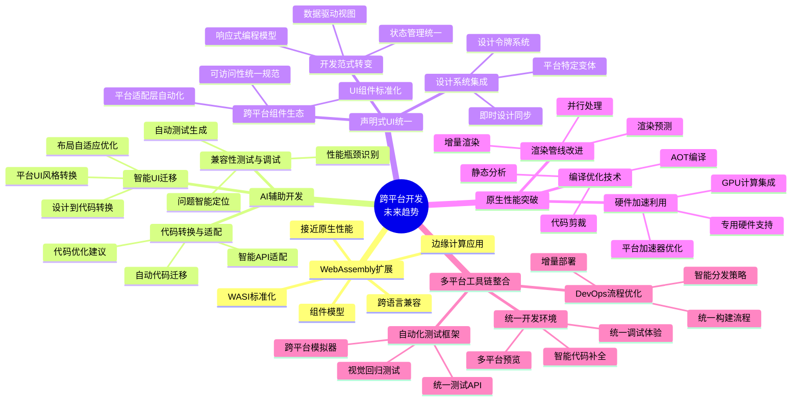

# 跨平台开发架构的未来发展趋势

## 目录

- [跨平台开发架构的未来发展趋势](#跨平台开发架构的未来发展趋势)
  - [目录](#目录)
  - [1. 引言](#1-引言)
  - [2. WebAssembly生态系统扩展](#2-webassembly生态系统扩展)
    - [2.1 WebAssembly及其基础设施](#21-webassembly及其基础设施)
    - [2.2 跨语言兼容性](#22-跨语言兼容性)
    - [2.3 性能优势与应用场景](#23-性能优势与应用场景)
  - [3. AI辅助跨平台开发](#3-ai辅助跨平台开发)
    - [3.1 代码转换与适配](#31-代码转换与适配)
    - [3.2 兼容性测试与调试](#32-兼容性测试与调试)
    - [3.3 智能UI迁移](#33-智能ui迁移)
  - [4. 声明式UI框架统一](#4-声明式ui框架统一)
    - [4.1 开发范式转变](#41-开发范式转变)
    - [4.2 跨平台组件生态](#42-跨平台组件生态)
    - [4.3 设计系统集成](#43-设计系统集成)
  - [5. 原生性能突破](#5-原生性能突破)
    - [5.1 编译优化技术](#51-编译优化技术)
    - [5.2 硬件加速利用](#52-硬件加速利用)
    - [5.3 渲染管线改进](#53-渲染管线改进)
  - [6. 多平台工具链整合](#6-多平台工具链整合)
    - [6.1 统一开发环境](#61-统一开发环境)
    - [6.2 自动化测试框架](#62-自动化测试框架)
    - [6.3 DevOps流程优化](#63-devops流程优化)
  - [7. 思维导图](#7-思维导图)
  - [8. 总结](#8-总结)

## 1. 引言

跨平台开发技术正处于快速演进阶段，从早期简单的"写一次，到处运行"理念，发展为多种成熟的架构解决方案。
未来几年，跨平台开发将迎来多个关键技术突破和范式转变，这些趋势将重塑开发者构建多平台应用的方式。

本文将详细探讨五大关键趋势，并分析它们如何影响未来跨平台开发生态系统。

## 2. WebAssembly生态系统扩展

### 2.1 WebAssembly及其基础设施

WebAssembly (Wasm) 作为一种低级字节码格式，正在改变跨平台开发的基础架构：

- **WASI (WebAssembly System Interface)** 标准化将使Wasm超越浏览器，扩展到服务器、物联网设备等
- **组件模型** 将实现不同编程语言编写的Wasm模块间无缝互操作
- **垃圾回收提案** 将提升内存密集型应用的性能并简化编程模型

```rust
// Rust代码 - 可编译为WebAssembly运行在多平台
#[wasm_bindgen]
pub struct TaskManager {
    tasks: Vec<Task>,
}

#[wasm_bindgen]
impl TaskManager {
    pub fn new() -> TaskManager {
        TaskManager { tasks: Vec::new() }
    }

    pub fn add_task(&mut self, title: String, priority: u8) -> usize {
        let task = Task::new(title, priority);
        let id = self.tasks.len();
        self.tasks.push(task);
        id
    }

    pub fn get_task_json(&self, id: usize) -> String {
        if id < self.tasks.len() {
            return serde_json::to_string(&self.tasks[id]).unwrap();
        }
        "{}".to_string()
    }
}
```

### 2.2 跨语言兼容性

WebAssembly将消除语言选择与平台支持之间的限制：

- **语言无关性** 将允许开发者使用擅长的语言（Rust、C++、C#、AssemblyScript等）开发跨平台应用
- **统一运行时** 将简化不同语言模块集成，创建混合语言应用
- **互操作性标准** 将实现跨语言类型映射和函数调用的一致性

```typescript
// TypeScript与WebAssembly互操作示例
import { TaskManager } from './task_manager.wasm';

async function initApp() {
  // 动态加载Wasm模块（由Rust编译而来）
  const taskManagerModule = await WebAssembly.instantiateStreaming(
    fetch('/task_manager.wasm'),
    {}
  );
  
  const taskManager = taskManagerModule.instance.exports as TaskManager;
  
  // 在JS/TS中使用Rust编写的功能
  const taskId = taskManager.add_task("完成报告", 2);
  const taskJson = taskManager.get_task_json(taskId);
  
  console.log(`创建的任务: ${taskJson}`);
}
```

### 2.3 性能优势与应用场景

WebAssembly将为跨平台应用带来显著性能提升：

- **接近原生的执行速度** 使复杂计算和游戏引擎可以高效运行在多平台
- **快速启动时间** 优化应用初始化性能，缩小与原生应用差距
- **适合计算密集型场景** 包括图像处理、音频分析、机器学习等

## 3. AI辅助跨平台开发

### 3.1 代码转换与适配

人工智能将极大简化跨平台代码转换流程：

- **自动代码迁移** - AI系统能分析现有单平台代码，生成等效的跨平台实现
- **智能API适配** - 自动映射平台特定API到跨平台等效实现
- **代码优化建议** - 推荐提升跨平台兼容性和性能的代码改进

```typescript
// AI辅助代码转换示例
// 原始Android Java代码
/*
public class LocationManager {
    private FusedLocationProviderClient fusedLocationClient;
    
    public LocationManager(Context context) {
        fusedLocationClient = LocationServices.getFusedLocationProviderClient(context);
    }
    
    public void getCurrentLocation(LocationCallback callback) {
        if (ActivityCompat.checkSelfPermission(context, 
            Manifest.permission.ACCESS_FINE_LOCATION) != PackageManager.PERMISSION_GRANTED) {
            callback.onError("Permission denied");
            return;
        }
        
        fusedLocationClient.getLastLocation()
            .addOnSuccessListener(location -> {
                if (location != null) {
                    callback.onLocation(location.getLatitude(), location.getLongitude());
                } else {
                    callback.onError("Location unavailable");
                }
            })
            .addOnFailureListener(e -> callback.onError(e.getMessage()));
    }
}
*/

// AI生成的跨平台TypeScript实现
class LocationService {
  private platform: 'ios' | 'android' | 'web';
  
  constructor() {
    this.platform = this.detectPlatform();
  }
  
  private detectPlatform(): 'ios' | 'android' | 'web' {
    if (typeof navigator !== 'undefined') {
      if (/android/i.test(navigator.userAgent)) return 'android';
      if (/iphone|ipad|ipod/i.test(navigator.userAgent)) return 'ios';
      return 'web';
    }
    // 默认为web
    return 'web';
  }
  
  async getCurrentLocation(): Promise<{latitude: number, longitude: number}> {
    switch (this.platform) {
      case 'android':
        return await this.getAndroidLocation();
      case 'ios':
        return await this.getIOSLocation();
      case 'web':
        return await this.getWebLocation();
    }
  }
  
  private async getAndroidLocation(): Promise<{latitude: number, longitude: number}> {
    // 调用React Native/Capacitor等框架的Android特定实现
    try {
      const location = await NativeModules.Location.getCurrentPosition();
      return {
        latitude: location.latitude,
        longitude: location.longitude
      };
    } catch (error) {
      throw new Error(`Failed to get Android location: ${error.message}`);
    }
  }
  
  private async getIOSLocation(): Promise<{latitude: number, longitude: number}> {
    // iOS实现
    // ...类似Android的实现
  }
  
  private async getWebLocation(): Promise<{latitude: number, longitude: number}> {
    return new Promise((resolve, reject) => {
      if (!navigator.geolocation) {
        reject(new Error('Geolocation not supported'));
        return;
      }
      
      navigator.geolocation.getCurrentPosition(
        (position) => {
          resolve({
            latitude: position.coords.latitude,
            longitude: position.coords.longitude
          });
        },
        (error) => {
          reject(new Error(`Geolocation error: ${error.message}`));
        }
      );
    });
  }
}
```

### 3.2 兼容性测试与调试

AI将提升跨平台应用测试效率：

- **自动化测试生成** - 根据应用行为自动生成跨平台测试用例
- **智能问题定位** - 分析平台特定错误并提供针对性修复方案
- **性能瓶颈识别** - 发现并优化跨平台代码中的性能问题

### 3.3 智能UI迁移

AI工具将简化UI跨平台适配：

- **设计到代码转换** - 从设计文件自动生成多平台UI代码
- **平台UI风格转换** - 智能调整UI以符合各平台设计规范
- **布局自适应优化** - 为不同屏幕尺寸自动生成适配方案

## 4. 声明式UI框架统一

### 4.1 开发范式转变

声明式UI正成为跨平台开发的统一范式：

- **与命令式编程对比** - 从直接操作UI元素转变为描述UI状态
- **数据驱动视图** - UI自动响应状态变化，减少平台差异性
- **代码共享程度提升** - 相同的声明式代码可在多平台运行

```dart
// Flutter声明式UI示例
class TaskListScreen extends StatelessWidget {
  final List<Task> tasks;
  
  const TaskListScreen({Key? key, required this.tasks}) : super(key: key);
  
  @override
  Widget build(BuildContext context) {
    return Scaffold(
      appBar: AppBar(title: Text('任务列表')),
      body: tasks.isEmpty
          ? Center(child: Text('没有任务'))
          : ListView.builder(
              itemCount: tasks.length,
              itemBuilder: (context, index) {
                final task = tasks[index];
                return ListTile(
                  title: Text(task.title),
                  subtitle: Text(task.description ?? ''),
                  leading: Icon(
                    task.isCompleted 
                        ? Icons.check_circle 
                        : Icons.circle_outlined
                  ),
                  onTap: () {
                    // 处理任务点击
                  },
                );
              },
            ),
      floatingActionButton: FloatingActionButton(
        child: Icon(Icons.add),
        onPressed: () {
          // 添加新任务
        },
      ),
    );
  }
}
```

### 4.2 跨平台组件生态

组件库将在不同平台间实现功能和外观一致性：

- **UI组件标准化** - 跨平台组件抽象将减少平台差异
- **平台适配层自动化** - 组件自动适应各平台交互模式
- **可访问性统一规范** - 确保跨平台应用符合各平台可访问性要求

### 4.3 设计系统集成

设计系统将与跨平台开发深度集成：

- **设计令牌系统** - 统一的设计变量支持多平台主题适配
- **即时设计同步** - 设计变更自动反映到跨平台应用
- **平台特定变体** - 在保持设计一致性的同时支持平台特色

```typescript
// React Native与设计系统集成示例
import { Text, View, TouchableOpacity } from 'react-native';
import { useTheme, Button, Card } from './design-system';

function TaskCard({ task, onComplete }) {
  const theme = useTheme(); // 获取当前主题配置
  
  // 使用设计系统组件和主题令牌
  return (
    <Card 
      style={{ 
        marginBottom: theme.spacing.medium,
        backgroundColor: theme.colors.surface
      }}
    >
      <View style={{ padding: theme.spacing.medium }}>
        <Text style={{ 
          fontSize: theme.typography.sizes.title,
          fontWeight: theme.typography.weights.medium,
          color: theme.colors.onSurface
        }}>
          {task.title}
        </Text>
        
        {task.description ? (
          <Text style={{ 
            marginTop: theme.spacing.small,
            fontSize: theme.typography.sizes.body,
            color: theme.colors.onSurfaceSecondary
          }}>
            {task.description}
          </Text>
        ) : null}
        
        <Button 
          variant="primary"
          size="small"
          onPress={onComplete}
          style={{ marginTop: theme.spacing.medium }}
        >
          完成任务
        </Button>
      </View>
    </Card>
  );
}
```

## 5. 原生性能突破

### 5.1 编译优化技术

新一代编译技术将显著提升跨平台应用性能：

- **静态分析与AOT编译** - 提前编译优化跨平台代码
- **平台特定优化管道** - 根据目标平台生成高效机器码
- **代码剪裁技术** - 移除未使用代码减小应用体积

```kotlin
// Kotlin Multiplatform示例 - 平台特定优化
expect class CryptoHelper {
    fun encrypt(data: String, key: String): String
    fun decrypt(data: String, key: String): String
}

// Android实现 - 利用平台优化
actual class CryptoHelper {
    private val cipher = Cipher.getInstance("AES/GCM/NoPadding")
    
    actual fun encrypt(data: String, key: String): String {
        // 使用Android优化的加密库
        return androidOptimizedEncrypt(data, key)
    }
    
    actual fun decrypt(data: String, key: String): String {
        // 使用Android优化的解密库
        return androidOptimizedDecrypt(data, key)
    }
    
    private fun androidOptimizedEncrypt(data: String, key: String): String {
        // 使用Android特定的安全硬件加速
        // ...
    }
}

// iOS实现 - 利用平台优化
actual class CryptoHelper {
    actual fun encrypt(data: String, key: String): String {
        // 使用iOS的CommonCrypto和安全飞地
        return iosOptimizedEncrypt(data, key) 
    }
    
    actual fun decrypt(data: String, key: String): String {
        // 使用iOS的CommonCrypto和安全飞地
        return iosOptimizedDecrypt(data, key)
    }
    
    private fun iosOptimizedEncrypt(data: String, key: String): String {
        // 使用iOS特定的加密硬件加速
        // ...
    }
}
```

### 5.2 硬件加速利用

跨平台框架将更有效利用硬件加速能力：

- **GPU计算集成** - 图形处理和计算任务使用GPU加速
- **专用硬件支持** - 访问神经网络处理器、图像信号处理器等
- **平台特定加速器使用** - 智能调用各平台最佳性能API

### 5.3 渲染管线改进

UI渲染性能将获得显著提升：

- **增量渲染优化** - 只更新变化的UI部分
- **并行渲染技术** - 多线程处理UI构建和渲染
- **渲染预测机制** - 预测用户操作提前渲染内容

## 6. 多平台工具链整合

### 6.1 统一开发环境

一体化工具将简化跨平台开发流程：

- **多平台预览集成** - 实时预览各平台应用外观
- **统一调试体验** - 跨平台断点和状态检查
- **智能代码补全** - 针对各平台的API智能建议

```json
// 统一开发环境配置示例 (VSCode settings.json)
{
  "cross-platform-dev.platforms": [
    "android",
    "ios",
    "web",
    "desktop"
  ],
  "cross-platform-dev.preview": {
    "enabled": true,
    "simultaneousDevices": [
      {
        "platform": "android",
        "deviceId": "Pixel_4_API_30"
      },
      {
        "platform": "ios",
        "deviceId": "iPhone 13"
      },
      {
        "platform": "web",
        "browsers": ["chrome", "firefox"]
      }
    ]
  },
  "cross-platform-dev.debugging": {
    "syncBreakpoints": true,
    "crossPlatformVariables": true,
    "smartStepping": true
  },
  "cross-platform-dev.codeAnalysis": {
    "platformCompatibility": true,
    "performanceAnalysis": true
  }
}
```

### 6.2 自动化测试框架

跨平台测试将变得更加高效：

- **统一测试API** - 一套测试代码验证多平台行为
- **视觉回归测试** - 自动检测UI在不同平台的一致性
- **跨平台模拟器集成** - 并行运行多平台测试

```typescript
// 跨平台测试框架示例
import { test, expect } from '@cross-platform/testing';

test.describe('任务管理功能', () => {
  test('用户可以创建新任务', async ({ app }) => {
    // 在所有平台上执行相同测试
    await app.goToScreen('TaskList');
    
    // 获取初始任务数量
    const initialTaskCount = await app.getElementCount('task-item');
    
    // 点击添加按钮
    await app.tap('add-task-button');
    
    // 填写任务表单
    await app.fillTextField('task-title-input', '完成报告');
    await app.tap('save-task-button');
    
    // 验证任务已添加
    const newTaskCount = await app.getElementCount('task-item');
    expect(newTaskCount).toBe(initialTaskCount + 1);
    
    // 验证任务内容
    const lastTaskText = await app.getElementText('task-item:last-child');
    expect(lastTaskText).toContain('完成报告');
  });
  
  test('用户可以将任务标记为已完成', async ({ app }) => {
    await app.goToScreen('TaskList');
    
    // 点击第一个任务的完成按钮
    await app.tap('task-item:first-child .complete-button');
    
    // 验证任务状态已更新
    const taskStatus = await app.getElementAttribute('task-item:first-child', 'data-completed');
    expect(taskStatus).toBe('true');
    
    // 验证视觉状态 - 自动检查不同平台上的视觉表现
    await app.expectScreenshot('task-list-with-completed-task').toMatchSnapshot();
  });
});
```

### 6.3 DevOps流程优化

持续集成/持续部署将适应跨平台需求：

- **统一构建流程** - 一次触发构建所有目标平台
- **增量部署优化** - 只更新变化的平台特定代码
- **智能分发策略** - 根据用户设备特点定向分发适配版本

```yaml
# 跨平台CI/CD配置示例 (.github/workflows/cross-platform-ci.yml)
name: Cross-Platform CI/CD

on:
  push:
    branches: [ main ]
  pull_request:
    branches: [ main ]

jobs:
  analyze:
    name: Analyze code
    runs-on: ubuntu-latest
    steps:
      - uses: actions/checkout@v3
      - name: Run code analysis
        run: npm run lint && npm run type-check
      
  test:
    name: Run tests
    needs: analyze
    strategy:
      matrix:
        platform: [web, android, ios, desktop]
    runs-on: ${{ matrix.platform == 'ios' && 'macos-latest' || 'ubuntu-latest' }}
    steps:
      - uses: actions/checkout@v3
      
      - name: Setup environment for ${{ matrix.platform }}
        uses: ./.github/actions/setup-${{ matrix.platform }}
        
      - name: Run tests for ${{ matrix.platform }}
        run: npm run test:${{ matrix.platform }}
        
      - name: Upload test results
        uses: actions/upload-artifact@v3
        with:
          name: test-results-${{ matrix.platform }}
          path: test-results/
  
  build:
    name: Build applications
    needs: test
    strategy:
      matrix:
        platform: [web, android, ios, desktop]
        include:
          - platform: android
            build_command: npm run build:android
            artifact_path: android/app/build/outputs/apk/release/
          - platform: ios
            build_command: npm run build:ios
            artifact_path: ios/build/
          - platform: web
            build_command: npm run build:web
            artifact_path: dist/web/
          - platform: desktop
            build_command: npm run build:desktop
            artifact_path: dist/desktop/
    runs-on: ${{ matrix.platform == 'ios' && 'macos-latest' || 'ubuntu-latest' }}
    steps:
      - uses: actions/checkout@v3
      
      - name: Setup environment for ${{ matrix.platform }}
        uses: ./.github/actions/setup-${{ matrix.platform }}
        
      - name: Build ${{ matrix.platform }} application
        run: ${{ matrix.build_command }}
        
      - name: Upload build artifacts
        uses: actions/upload-artifact@v3
        with:
          name: app-${{ matrix.platform }}
          path: ${{ matrix.artifact_path }}
  
  deploy:
    name: Deploy applications
    needs: build
    if: github.ref == 'refs/heads/main' # 只在main分支上部署
    runs-on: ubuntu-latest
    steps:
      - uses: actions/checkout@v3
      
      - name: Download all artifacts
        uses: actions/download-artifact@v3
        
      - name: Deploy to app stores and hosting
        run: npm run deploy-all
```

## 7. 思维导图



## 8. 总结

跨平台开发的未来将由五大关键趋势共同塑造：

1. **WebAssembly生态系统扩展** 将使任何语言编写的代码都能以接近原生的性能在多平台运行，模糊平台边界

2. **AI辅助开发** 将极大简化跨平台代码转换、测试和调试过程，降低开发复杂度

3. **声明式UI框架统一** 将提供一致的开发范式和组件生态，在保持平台特性的同时提高代码共享率

4. **原生性能突破** 将通过编译优化、硬件加速和渲染改进，缩小与原生应用的性能差距

5. **多平台工具链整合** 将提供统一的开发、测试和部署体验，提高跨平台开发效率

这些技术趋势将相互促进，共同推动跨平台开发进入新时代。
开发者将能够以更低的成本、更高的效率开发出接近原生体验的多平台应用。

然而，跨平台开发的核心原则—抽象、隔离、共享与适配—将始终保持不变。
理解这些基本原则和新兴技术趋势，将是开发者在未来跨平台开发领域取得成功的关键。
