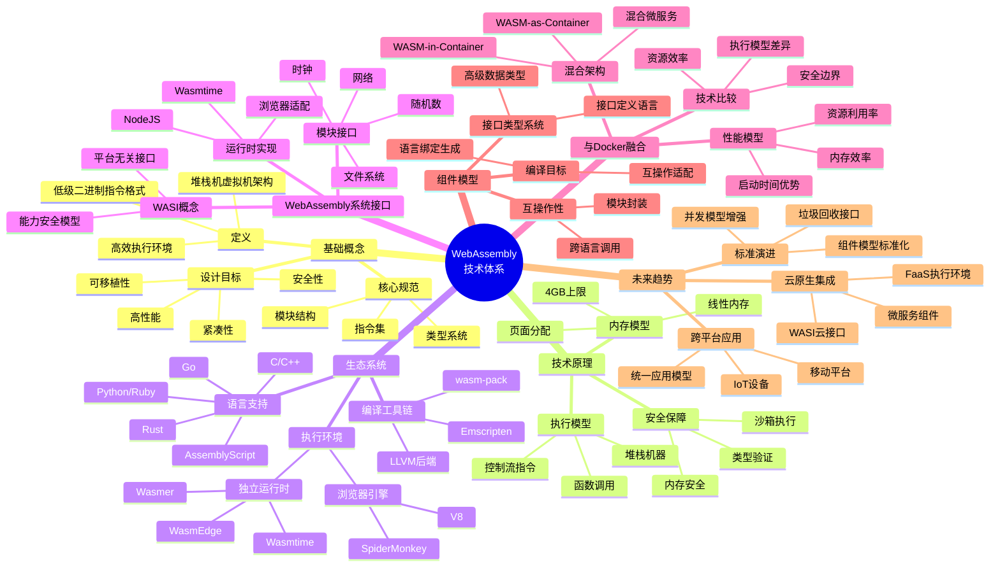

# WebAssembly的概念、原理与技术分析

## 目录

- [WebAssembly的概念、原理与技术分析](#webassembly的概念原理与技术分析)
  - [目录](#目录)
  - [1. WebAssembly基本概念](#1-webassembly基本概念)
    - [1.1 定义与设计目标](#11-定义与设计目标)
    - [1.2 核心规范](#12-核心规范)
    - [1.3 形式语义](#13-形式语义)
  - [2. 技术原理与架构](#2-技术原理与架构)
    - [2.1 内存模型](#21-内存模型)
    - [2.2 执行模型](#22-执行模型)
    - [2.3 类型系统](#23-类型系统)
  - [3. WebAssembly生态系统](#3-webassembly生态系统)
    - [3.1 执行环境](#31-执行环境)
    - [3.2 编译工具链](#32-编译工具链)
    - [3.3 语言支持](#33-语言支持)
  - [4. WebAssembly与Docker的融合](#4-webassembly与docker的融合)
    - [4.1 技术定义与比较](#41-技术定义与比较)
    - [4.2 混合部署架构](#42-混合部署架构)
    - [4.3 性能模型分析](#43-性能模型分析)
  - [5. 未来发展趋势](#5-未来发展趋势)
    - [5.1 组件模型与标准化](#51-组件模型与标准化)
    - [5.2 云原生集成](#52-云原生集成)
    - [5.3 跨平台应用](#53-跨平台应用)
  - [6. 思维导图](#6-思维导图)

## 1. WebAssembly基本概念

### 1.1 定义与设计目标

WebAssembly (Wasm) 是一种低级二进制指令格式，基于堆栈机器的虚拟机架构，旨在成为高级语言的编译目标，提供接近原生的执行速度。

**设计目标**：

- **高性能**：执行效率接近原生机器码
- **安全性**：在沙箱环境中执行，内存安全且无副作用
- **可移植性**：硬件、平台和语言无关
- **紧凑性**：二进制格式设计为高效下载
- **开放性**：开放标准，支持调试工具

**形式定义**：WebAssembly可以形式化定义为一个元组 $W = (T, F, G, M, I, E)$，其中：

- $T$ 是类型集合（数值和引用类型）
- $F$ 是指令集合（控制流、内存访问、数值运算等）
- $G$ 是全局状态空间
- $M$ 是模块定义
- $I$ 是导入接口
- $E$ 是导出接口

### 1.2 核心规范

WebAssembly核心规范定义了模块结构、指令集和执行语义：

**模块结构**：

- Types部分：函数类型定义
- Import部分：从宿主环境导入的外部函数、表、内存、全局变量
- Function部分：函数定义
- Table部分：函数引用表
- Memory部分：线性内存区域
- Global部分：全局变量
- Export部分：向宿主环境公开的接口
- Element部分：表的初始化数据
- Data部分：内存的初始化数据

**指令集**：

- 控制指令：分支、循环、调用
- 参数栈指令：局部变量操作
- 内存指令：加载、存储
- 数值指令：算术、逻辑、比较操作
- 表操作指令：访问函数表

### 1.3 形式语义

WebAssembly的形式语义基于以下原则：

**类型系统**：

- 静态类型检查确保指令操作类型正确
- 验证器执行类型检查，确保程序安全执行
- 类型系统可形式化为 $\Gamma \vdash e : \tau$，表示在上下文 $\Gamma$ 中表达式 $e$ 具有类型 $\tau$

**执行语义**：

- 操作语义定义指令如何改变运行时状态
- 可表示为状态转换规则：$(s, f) \xrightarrow{i} (s', f')$，其中 $s$ 是栈，$f$ 是帧，$i$ 是指令

**内存安全**：

- 内存边界检查确保访问合法
- 执行流控制确保跳转到有效指令位置

## 2. 技术原理与架构

### 2.1 内存模型

WebAssembly使用线性内存模型：

- 单一连续字节数组作为内存空间
- 默认限制为4GB (使用32位索引)
- 内存可按页(64KB)动态扩展
- 通过索引直接访问，无垃圾回收开销

```javascript
// JavaScript中访问WebAssembly内存
const memory = new WebAssembly.Memory({ initial: 10, maximum: 100 });
const view = new Uint8Array(memory.buffer);

// 写入数据
view[0] = 42;

// 传递给WebAssembly模块
const importObject = { env: { memory } };
WebAssembly.instantiateStreaming(fetch('module.wasm'), importObject)
  .then(obj => {
    // 使用共享内存
    const result = obj.instance.exports.processMemory();
    console.log(result);
  });
```

### 2.2 执行模型

WebAssembly执行模型基于堆栈机器：

- 指令操作隐式堆栈
- 函数调用使用调用栈
- 执行流程由控制指令管理

**执行状态**可表示为：

- 堆栈 $S$
- 局部变量 $L$
- 存储 $\sigma = (tab, mem, glob)$

**指令评估关系**：
$S; L; \sigma \vdash e \Rightarrow S'; L'; \sigma'$

### 2.3 类型系统

WebAssembly的类型系统包括：

**值类型**：

- $t ::= i32 \mid i64 \mid f32 \mid f64 \mid \text{externref} \mid \text{funcref}$

**函数类型**：

- $ft ::= t_1^* \rightarrow t_2^*$（参数类型列表映射到结果类型列表）

**子类型关系**：

- 反身性：$t <: t$
- 传递性：如果 $t_1 <: t_2$ 且 $t_2 <: t_3$ 则 $t_1 <: t_3$
- 函数子类型：如果 $t_1' <: t_1$ 且 $t_2 <: t_2'$ 则 $(t_1 \rightarrow t_2) <: (t_1' \rightarrow t_2')$

## 3. WebAssembly生态系统

### 3.1 执行环境

目前WebAssembly执行环境主要分为以下几类：

**浏览器引擎**：

- **V8** (Chrome, Edge, Node.js)：基于TurboFan编译器
- **SpiderMonkey** (Firefox)：分层编译策略
- **JavaScriptCore** (Safari)：集成B3 JIT编译器

**独立运行时**：

- **Wasmtime**：基于Cranelift代码生成器，专注于安全和WASI支持
- **Wasmer**：注重跨平台和嵌入能力
- **WAMR** (WebAssembly Micro Runtime)：为IoT设备优化的轻量级运行时
- **WasmEdge**：云原生场景的高性能运行时

### 3.2 编译工具链

**LLVM后端**：

- Clang/LLVM提供将C/C++编译到Wasm的路径
- 支持optimizations和link-time optimizations
- Binaryen提供了wasm优化和转换工具

**语言特定工具**：

- **Emscripten**：C/C++到WebAssembly的完整工具链
- **wasm-pack**：Rust Wasm构建工具
- **AssemblyScript**：TypeScript子集到WebAssembly编译器

### 3.3 语言支持

**一级支持**（原生编译到WebAssembly）：

- **Rust**：通过wasm-bindgen提供完整支持
- **C/C++**：通过Emscripten和Clang
- **AssemblyScript**：专为WebAssembly设计的TypeScript子集
- **Zig**：原生支持编译到WebAssembly
- **Go**：1.11版本后提供编译到WebAssembly支持

**二级支持**（通过中间层编译）：

- **Python**：PyScript, Pyodide通过编译CPython
- **Ruby**：Ruby.wasm项目
- **Java**：TeaVM, JWebAssembly将Java字节码转换为Wasm
- **C#/.NET**：Blazor框架，通过mono编译.NET运行时

## 4. WebAssembly与Docker的融合

### 4.1 技术定义与比较

WebAssembly与Docker容器技术的融合创造了新的应用部署模型：

**形式化定义**：
WebAssembly模块是一个确定性计算单元 $M_{wasm}$，具有以下特性：
$$M_{wasm} = (code, imports, exports, memory, tables)$$

**与容器比较**：

| 特性 | WebAssembly | 传统容器 |
|-----|------------|---------|
| 执行模型 | 沙箱内字节码解释/编译 | 原生二进制执行 |
| 启动时间 | 毫秒级 | 秒级 |
| 内存占用 | 极低 (MB级) | 低至中等 (几十至几百MB) |
| 安全边界 | 内存安全，能力模型 | 命名空间隔离 |
| 跨平台性 | 跨OS和CPU架构 | 架构相关，需镜像适配 |
| 生态系统 | 成长中 | 成熟 |

### 4.2 混合部署架构

WebAssembly与容器的融合创造了多种部署模式，实现优势互补：

1. **WASM-in-Container模式**：
   - WebAssembly模块运行在容器内
   - 容器提供环境依赖和系统接口
   - 形式化表示：$(M_{wasm})$ 在 $(C)$ 内执行

2. **WASM-as-Container模式**：
   - WebAssembly直接作为应用执行单元
   - 使用容器编排工具管理WASM模块
   - 形式化表示：$(M_{wasm})$ 替代 $(C)$ 执行

3. **混合微服务架构**：
   - 状态服务使用传统容器
   - 无状态计算使用WASM
   - 统一网络和服务发现

### 4.3 性能模型分析

WebAssembly与容器的性能特性对比：

**启动时间模型**：

容器启动时间：
$$T_{container} = T_{pull} + T_{extract} + T_{create} + T_{start}$$

WebAssembly启动时间：
$$T_{wasm} = T_{fetch} + T_{compile} + T_{instantiate}$$

一般情况下：
$$T_{wasm} \approx 10^{-3} \times T_{container}$$

**内存效率模型**：

对于n个实例，容器内存使用：
$$M_{containers}(n) = \sum_{i=1}^{n} (M_{base} + M_{app_i})$$

WebAssembly内存使用：
$$M_{wasm}(n) = M_{runtime} + \sum_{i=1}^{n} M_{instance_i}$$

其中 $M_{instance} \ll M_{base}$，因此 $M_{wasm}(n) \ll M_{containers}(n)$ 当 $n$ 较大时。

## 5. 未来发展趋势

### 5.1 组件模型与标准化

WebAssembly组件模型是一项重要扩展，提供模块化和跨语言互操作标准：

- **接口类型系统**：字符串、记录、变体、列表等高级类型
- **面向接口设计**：定义模块间通信协议
- **语言无关**：适用于所有编译到WebAssembly的语言

近期重点（1-2年）：

- 组件模型标准化
- 垃圾回收接口
- 异常处理机制

中期发展（2-4年）：

- 并发与线程扩展
- SIMD扩展增强
- 安全性增强

### 5.2 云原生集成

WebAssembly与云原生技术的融合将带来新的部署模型：

- **WASI云接口**：标准化云服务访问
- **无服务器函数**：WebAssembly作为FaaS执行单元
- **混合微服务**：WebAssembly与容器协同工作
- **边缘计算**：轻量级WebAssembly运行时适合边缘设备

### 5.3 跨平台应用

WebAssembly正在改变跨平台应用开发方式：

- 从浏览器扩展到服务器、IoT、移动应用
- 实现真正的"一次编译，到处运行"
- 统一的Web、移动和桌面应用开发模型

## 6. 思维导图


