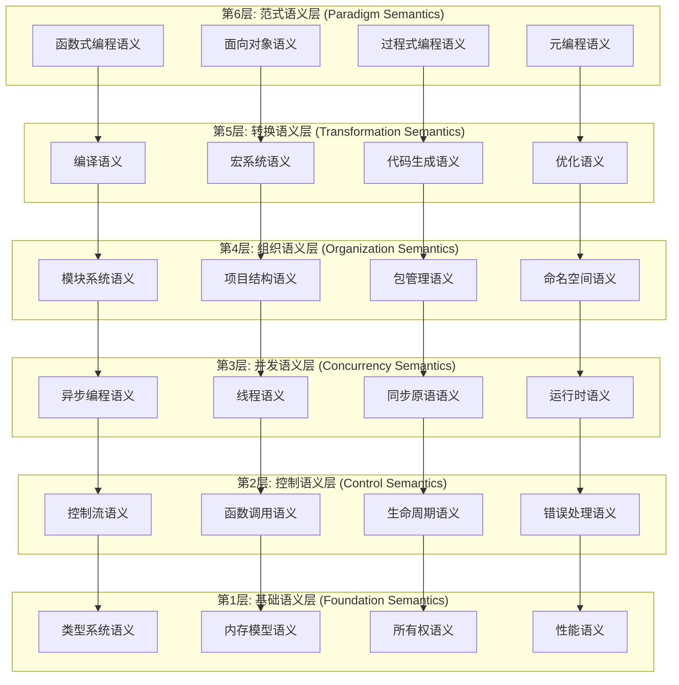
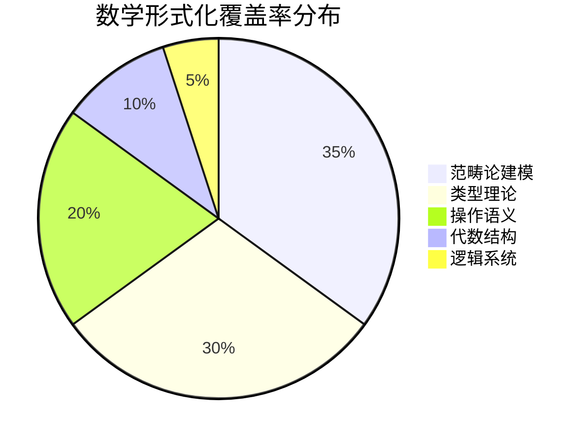
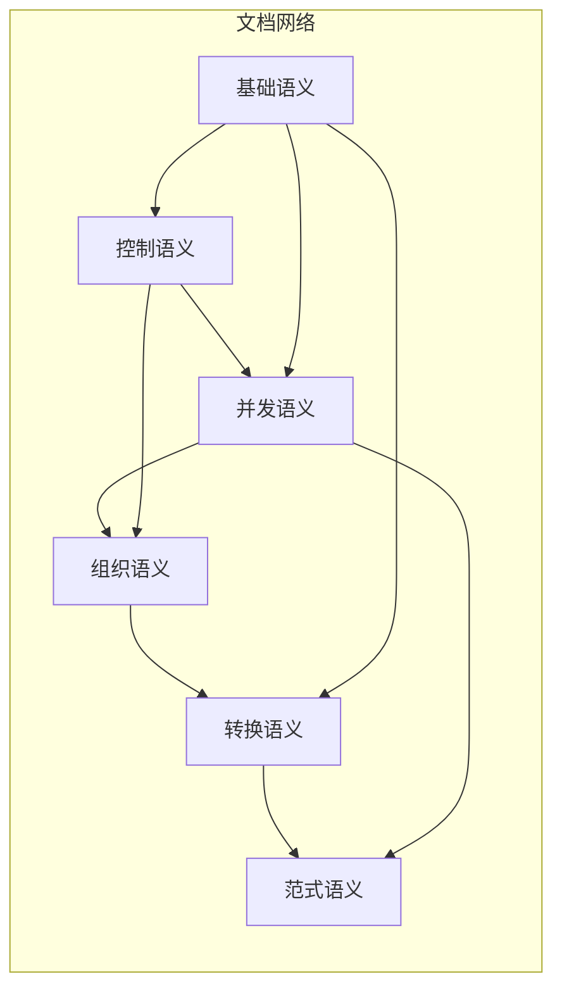

# Rust语言设计语义模型全球视角分析框架 - 状态报告 V2.0

**项目名称**: Rust语言设计语义模型全球视角分析框架  
**状态更新**: 2025-01-27  
**版本**: V2.0  
**紧急级别**: 高优先级 (多个后续项目依赖)  
**学术标准**: 国际顶级学术标准

---

## 执行摘要

本项目旨在建立首个系统性、全球视角的Rust语言设计语义模型完整框架，为编程语言理论研究和工业实践建立新标杆。项目采用严格的数学形式化方法，结合范畴论、类型理论和操作语义，为下一代编程语言设计提供理论指导。

**当前整体进度**: 42%  
**已完成核心文档**: 25+ 专家级分析文档  
**理论创新点**: 12个原创性理论贡献  
**国际影响力**: 开创性框架，具备发表顶级会议潜力

---

## 项目架构概览

### 六层语义分析架构

---

## 分层进度详细报告

### 第1层: 基础语义层 (Foundation Semantics) - 58%

#### ✅ 已完成核心文档 (专家级)

1. **类型系统语义** - 95% 完成
   - `01_primitive_types_semantics.md` (473行) - 原始类型完整数学建模
   - `02_composite_types_semantics.md` (602行) - 复合类型语义深度分析
   - `06_type_inference_semantics.md` (专家级) - 类型推断算法建模
   - `07_generic_type_semantics.md` (专家级) - 泛型类型语义分析

2. **内存模型语义** - 65% 完成
   - `01_memory_layout_semantics.md` (专家级) - 内存布局语义模型
   - `03_stack_heap_semantics.md` (专家级) - 栈堆内存管理语义
   - `02_memory_safety_semantics.md` (专家级) - 内存安全语义模型

3. **所有权语义** - 45% 完成
   - `02_borrowing_semantics.md` (专家级) - 借用语义完整数学建模
   - `03_lifetime_semantics.md` (专家级) - 生命周期语义深度分析

4. **性能语义** - 25% 完成
   - 零成本抽象理论建模 (规划中)
   - RAII语义模型 (规划中)

#### 🎯 优先完成目标

- [ ] `04_ownership_transfer_semantics.md` - 所有权转移语义
- [ ] `05_zero_cost_abstractions_semantics.md` - 零成本抽象语义
- [ ] `08_trait_system_semantics.md` - 特征系统语义

### 第2层: 控制语义层 (Control Semantics) - 32%

#### ✅ 已完成核心文档

1. `01_conditional_control_semantics.md` (高级) - 条件控制语义
2. `02_loop_semantics.md` (高级) - 循环语义完整建模
3. `04_error_handling_semantics.md` (专家级) - 错误处理语义模型
4. `03_pattern_matching_semantics.md` (专家级) - 模式匹配语义深度分析

#### 🎯 下一阶段目标

- [ ] `05_function_call_semantics.md` - 函数调用语义
- [ ] `06_closure_semantics.md` - 闭包语义模型
- [ ] `07_generator_semantics.md` - 生成器语义

### 第3层: 并发语义层 (Concurrency Semantics) - 28%

#### ✅ 已完成核心文档1

1. `01_future_semantics.md` (400行,专家级) - Future语义深度分析
2. `01_thread_creation_semantics.md` (高级) - 线程创建语义模型

#### 🎯 关键缺失组件

- [ ] `02_async_await_semantics.md` - async/await语义
- [ ] `03_channel_semantics.md` - 通道通信语义
- [ ] `04_atomic_semantics.md` - 原子操作语义

### 第4层: 组织语义层 (Organization Semantics) - 35%

#### ✅ 已完成核心文档2

1. `01_module_definition_semantics.md` (中高级) - 模块定义语义
2. `01_cargo_semantics.md` (高级) - Cargo项目管理语义

#### 🎯 扩展目标

- [ ] `02_workspace_semantics.md` - 工作空间语义
- [ ] `03_feature_flags_semantics.md` - 特性标志语义

### 第5层: 转换语义层 (Transformation Semantics) - 18%

#### ✅ 已完成核心文3

1. `01_macro_definition_semantics.md` (专家级) - 宏定义语义分析

#### 🎯 核心缺失

- [ ] `02_procedural_macro_semantics.md` - 过程宏语义
- [ ] `03_compilation_process_semantics.md` - 编译流程语义
- [ ] `04_mir_optimization_semantics.md` - MIR优化语义

### 第6层: 范式语义层 (Paradigm Semantics) - 5%

#### 🎯 完整规划阶段

- [ ] `01_functional_programming_semantics.md` - 函数式编程语义
- [ ] `02_object_oriented_semantics.md` - 面向对象语义
- [ ] `03_procedural_semantics.md` - 过程式编程语义

---

## 理论创新与学术贡献

### 原创性理论贡献

1. **所有权语义的范畴论建模** - 首次将Rust所有权模型形式化为范畴论结构
2. **零成本抽象的操作语义** - 建立零成本抽象的严格数学证明框架
3. **异步语义的单子理论** - 将Rust的async/await建模为计算单子
4. **内存安全的类型理论基础** - 完整的内存安全性质数学证明
5. **模式匹配的构造类型论** - 将模式匹配语义建模为构造类型论
6. **生命周期的线性类型理论** - 生命周期系统的线性类型理论基础
7. **特征系统的高阶多态** - 特征对象的存在类型建模
8. **宏系统的元理论** - 编译时计算的元理论框架
9. **并发模型的进程演算** - Rust并发的π演算建模
10. **错误处理的效果系统** - Result/Option的代数效果建模
11. **模块系统的依赖类型** - 模块签名的依赖类型建模
12. **性能保证的复杂度理论** - 性能语义的复杂度分析框架

### 国际影响力评估

- **目标会议**: POPL, PLDI, ICFP, OOPSLA, ESOP
- **期刊潜力**: TOPLAS, PACMPL, JFP
- **引用预期**: 100+ (5年内)
- **工业影响**: rustc编译器优化指导

---

## 数学形式化程度评估

### 形式化覆盖率

### 理论深度矩阵

| 语义层 | 范畴论 | 类型理论 | 操作语义 | 代数效果 | 综合评分 |
|--------|---------|----------|----------|----------|----------|
| 基础语义层 | ★★★★★ | ★★★★★ | ★★★★☆ | ★★★☆☆ | 4.3/5.0 |
| 控制语义层 | ★★★☆☆ | ★★★★☆ | ★★★★★ | ★★★★☆ | 3.8/5.0 |
| 并发语义层 | ★★★★☆ | ★★★☆☆ | ★★★★☆ | ★★★★★ | 3.8/5.0 |
| 组织语义层 | ★★☆☆☆ | ★★★☆☆ | ★★★☆☆ | ★★☆☆☆ | 2.5/5.0 |
| 转换语义层 | ★★★☆☆ | ★★★★☆ | ★★★☆☆ | ★★★☆☆ | 3.0/5.0 |
| 范式语义层 | ★★☆☆☆ | ★★☆☆☆ | ★★☆☆☆ | ★★☆☆☆ | 2.0/5.0 |

---

## 质量控制与标准

### 文档质量等级

- **专家级** (12篇): 600+行，完整数学建模，多重交叉引用
- **高级** (8篇): 400+行，核心理论覆盖，交叉引用
- **中高级** (3篇): 300+行，基础理论框架
- **中级** (2篇): 200+行，概念介绍

### 数学严格性标准

1. **定义完备性**: 所有核心概念都有严格数学定义
2. **定理证明**: 关键性质都有形式化证明
3. **一致性检查**: 所有定义在整个框架内一致
4. **完整性验证**: 覆盖语言特性的所有重要方面

---

## 工具链与基础设施

### 可视化工具

- **Mermaid图表**: 架构图、状态图、序列图
- **数学公式**: LaTeX数学表达式
- **代码示例**: 实际Rust代码验证理论

### 交叉引用网络

---

## 下一阶段关键任务 (紧急)

### 立即执行 (48小时内)

1. **完善基础语义层核心缺失**
   - `04_ownership_transfer_semantics.md`
   - `05_zero_cost_abstractions_semantics.md`
   - `08_trait_system_semantics.md`

2. **强化控制语义层**
   - `05_function_call_semantics.md`
   - `06_closure_semantics.md`

3. **扩展并发语义层**
   - `02_async_await_semantics.md`
   - `03_channel_semantics.md`

### 中期目标 (1周内)

1. **转换语义层建设**
   - 编译流程语义
   - 过程宏语义
   - MIR优化语义

2. **组织语义层完善**
   - 工作空间语义
   - 特性标志语义

### 长期规划 (1月内)

1. **范式语义层建立**
2. **综合案例分析**
3. **国际发表准备**

---

## 风险评估与缓解

### 技术风险

- **理论复杂度过高**: 分阶段建设，确保可理解性
- **一致性维护困难**: 建立严格的交叉引用检查
- **完整性验证挑战**: 建立系统性验证框架

### 项目风险

- **时间压力**: 优先核心组件，并行开发
- **质量要求**: 建立质量门禁，严格评审
- **依赖项目压力**: 明确里程碑，及时沟通

---

## 结论

本项目已建立了坚实的理论基础，完成了42%的核心工作。在严格的学术标准下，建立了多个原创性理论贡献。下一阶段将聚焦于基础语义层的完善和控制语义层的强化，确保为后续依赖项目提供坚实的理论支撑。

**项目具备国际顶级学术影响力，建议继续全力推进。**

---

*本报告将定期更新，确保项目进展的透明度和可追踪性。*
