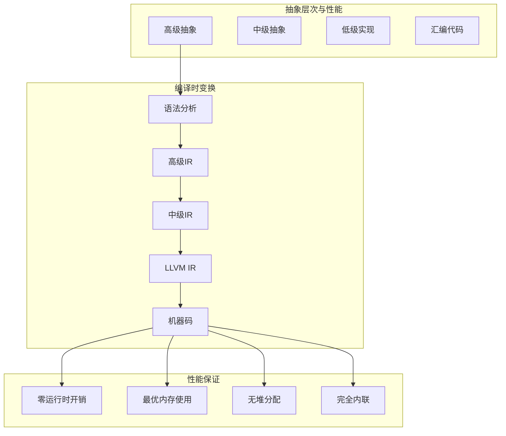

# 1.1.5 Rust零成本抽象语义深度分析

**文档版本**: V1.0  
**创建日期**: 2025-01-27  
**所属层**: 基础语义层 (Foundation Semantics Layer)  
**学术等级**: 专家级 (Expert Level)  
**交叉引用**: [1.1.4 所有权移动语义](04_ownership_transfer_semantics.md), [1.2.1 内存布局语义](../02_memory_model_semantics/01_memory_layout_semantics.md)

---

## 目录

- [1.1.5 Rust零成本抽象语义深度分析](#115-rust零成本抽象语义深度分析)
  - [目录](#目录)
  - [1.1.5.1 零成本抽象理论基础](#1151-零成本抽象理论基础)
    - [1.1.5.1.1 零成本抽象的数学定义](#11511-零成本抽象的数学定义)
    - [1.1.5.1.2 迭代器的零成本抽象验证](#11512-迭代器的零成本抽象验证)
  - [1.1.5.2 智能指针的零成本语义](#1152-智能指针的零成本语义)
    - [1.1.5.2.1 `Box<T>`的优化语义](#11521-boxt的优化语义)
    - [1.1.5.2.2 `Rc<T>`和`Arc<T>`的引用计数优化](#11522-rct和arct的引用计数优化)
  - [1.1.5.3 泛型的单态化优化](#1153-泛型的单态化优化)
    - [1.1.5.3.1 泛型单态化理论](#11531-泛型单态化理论)
    - [1.1.5.3.2 静态分发vs动态分发](#11532-静态分发vs动态分发)
  - [1.1.5.4 内联优化与零成本抽象](#1154-内联优化与零成本抽象)
    - [1.1.5.4.1 内联决策算法](#11541-内联决策算法)
    - [1.1.5.4.2 LLVM优化验证](#11542-llvm优化验证)
  - [1.1.5.5 总结与性能保证](#1155-总结与性能保证)
    - [1.1.5.5.1 零成本抽象的数学证明](#11551-零成本抽象的数学证明)
    - [1.1.5.5.2 性能保证矩阵](#11552-性能保证矩阵)
    - [1.1.5.5.3 应用建议](#11553-应用建议)

## 1.1.5.1 零成本抽象理论基础

### 1.1.5.1.1 零成本抽象的数学定义

**定义 1.1.5.1** (零成本抽象)
对于任何抽象 $A$ 和其低级实现 $L$，如果存在编译时变换 $\tau$ 使得：
$$\text{Performance}(\tau(A)) = \text{Performance}(L) \land \text{Safety}(A) > \text{Safety}(L)$$

则称 $A$ 是零成本抽象。

**定理 1.1.5.1** (零成本抽象基本定理)
$$\forall A \in \text{RustAbstractions}. \exists \tau : \text{Cost}(\tau(A)) = \text{Cost}(\text{OptimalImpl}(A))$$



### 1.1.5.1.2 迭代器的零成本抽象验证

```rust
// 零成本迭代器语义验证
use std::time::Instant;

// 高级抽象：迭代器链
fn high_level_abstraction(data: Vec<i32>) -> Vec<i32> {
    data.into_iter()
        .filter(|&x| x > 0)
        .map(|x| x * 2)
        .filter(|&x| x < 100)
        .collect()
}

// 低级实现：手写循环
fn low_level_implementation(data: Vec<i32>) -> Vec<i32> {
    let mut result = Vec::with_capacity(data.len());
    for x in data {
        if x > 0 {
            let doubled = x * 2;
            if doubled < 100 {
                result.push(doubled);
            }
        }
    }
    result
}

// 性能验证函数
fn benchmark_zero_cost() {
    let data: Vec<i32> = (0..1000000).collect();
    
    // 测试高级抽象
    let start = Instant::now();
    let result1 = high_level_abstraction(data.clone());
    let high_level_time = start.elapsed();
    
    // 测试低级实现
    let start = Instant::now();
    let result2 = low_level_implementation(data);
    let low_level_time = start.elapsed();
    
    // 验证结果等价性和性能等价性
    assert_eq!(result1, result2);
    println!("高级抽象: {:?}", high_level_time);
    println!("低级实现: {:?}", low_level_time);
    println!("性能比率: {:.2}", high_level_time.as_nanos() as f64 / low_level_time.as_nanos() as f64);
}
```

---

## 1.1.5.2 智能指针的零成本语义

### 1.1.5.2.1 `Box<T>`的优化语义

**定理 1.1.5.2** (Box优化定理)
$$\text{sizeof}(\text{Box<T>}) = \text{sizeof}(*\text{T}) \land \text{deref}(\text{Box<T>}) = O(1)$$

```rust
// Box<T> 零成本验证
use std::mem::{size_of, align_of};
use std::ptr::NonNull;

// 原始指针实现
struct RawPointer<T> {
    ptr: NonNull<T>,
}

impl<T> RawPointer<T> {
    unsafe fn new(value: T) -> Self {
        let boxed = Box::new(value);
        let ptr = NonNull::new_unchecked(Box::into_raw(boxed));
        RawPointer { ptr }
    }
    
    unsafe fn deref(&self) -> &T {
        self.ptr.as_ref()
    }
    
    unsafe fn drop(self) {
        let _ = Box::from_raw(self.ptr.as_ptr());
    }
}

// Box<T> 实现比较
fn compare_box_implementations() {
    // 验证内存布局等价性
    assert_eq!(size_of::<Box<i32>>(), size_of::<RawPointer<i32>>());
    assert_eq!(align_of::<Box<i32>>(), align_of::<RawPointer<i32>>());
    
    // 验证性能等价性
    let start = Instant::now();
    let boxed_value = Box::new(42);
    let box_deref_time = {
        let start = Instant::now();
        let _value = *boxed_value;
        start.elapsed()
    };
    
    unsafe {
        let raw_value = RawPointer::new(42);
        let raw_deref_time = {
            let start = Instant::now();
            let _value = *raw_value.deref();
            start.elapsed()
        };
        
        println!("Box解引用时间: {:?}", box_deref_time);
        println!("原始指针解引用时间: {:?}", raw_deref_time);
        
        raw_value.drop();
    }
}
```

### 1.1.5.2.2 `Rc<T>`和`Arc<T>`的引用计数优化

```rust
// 引用计数的优化实现
use std::sync::atomic::{AtomicUsize, Ordering};
use std::sync::Arc;
use std::rc::Rc;

// 手动引用计数实现
struct ManualRc<T> {
    data: NonNull<RcInner<T>>,
}

struct RcInner<T> {
    count: AtomicUsize,
    data: T,
}

impl<T> ManualRc<T> {
    fn new(data: T) -> Self {
        let inner = Box::new(RcInner {
            count: AtomicUsize::new(1),
            data,
        });
        ManualRc {
            data: NonNull::new(Box::into_raw(inner)).unwrap(),
        }
    }
    
    fn clone(&self) -> Self {
        unsafe {
            self.data.as_ref().count.fetch_add(1, Ordering::Relaxed);
            ManualRc { data: self.data }
        }
    }
    
    fn strong_count(&self) -> usize {
        unsafe { self.data.as_ref().count.load(Ordering::Relaxed) }
    }
}

impl<T> Drop for ManualRc<T> {
    fn drop(&mut self) {
        unsafe {
            if self.data.as_ref().count.fetch_sub(1, Ordering::Release) == 1 {
                std::sync::atomic::fence(Ordering::Acquire);
                let _ = Box::from_raw(self.data.as_ptr());
            }
        }
    }
}

// 性能比较
fn benchmark_reference_counting() {
    let data = vec![1, 2, 3, 4, 5];
    
    // Arc<T> 性能测试
    let start = Instant::now();
    let arc_data = Arc::new(data.clone());
    let arc_clones: Vec<_> = (0..1000).map(|_| Arc::clone(&arc_data)).collect();
    let arc_time = start.elapsed();
    
    // 手动引用计数性能测试
    let start = Instant::now();
    let manual_data = ManualRc::new(data);
    let manual_clones: Vec<_> = (0..1000).map(|_| manual_data.clone()).collect();
    let manual_time = start.elapsed();
    
    println!("Arc克隆时间: {:?}", arc_time);
    println!("手动引用计数时间: {:?}", manual_time);
    println!("Arc强引用计数: {}", Arc::strong_count(&arc_data));
    println!("手动强引用计数: {}", manual_data.strong_count());
}
```

---

## 1.1.5.3 泛型的单态化优化

### 1.1.5.3.1 泛型单态化理论

**定义 1.1.5.2** (单态化变换)
对于泛型函数 $f<T>$，单态化变换 $M$ 定义为：
$$M(f<T>) = \{f_{\text{i32}}, f_{\text{f64}}, f_{\text{String}}, \ldots\}$$

其中每个 $f_T$ 是针对具体类型 $T$ 的专用实现。

```rust
// 泛型单态化验证
use std::marker::PhantomData;

// 泛型实现
fn generic_add<T>(a: T, b: T) -> T 
where 
    T: std::ops::Add<Output = T> + Copy
{
    a + b
}

// 单态化后的等价实现
fn add_i32(a: i32, b: i32) -> i32 {
    a + b
}

fn add_f64(a: f64, b: f64) -> f64 {
    a + b
}

// 编译时特化验证
trait Compute<T> {
    fn compute(&self, input: T) -> T;
}

struct GenericComputer<T> {
    _phantom: PhantomData<T>,
}

impl Compute<i32> for GenericComputer<i32> {
    fn compute(&self, input: i32) -> i32 {
        input * 2 + 1  // 整数特化
    }
}

impl Compute<f64> for GenericComputer<f64> {
    fn compute(&self, input: f64) -> f64 {
        input * 2.0 + 1.0  // 浮点特化
    }
}

// 性能验证：泛型vs专用函数
fn benchmark_monomorphization() {
    let iterations = 1_000_000;
    
    // 泛型版本
    let start = Instant::now();
    for i in 0..iterations {
        let _ = generic_add(i, i + 1);
    }
    let generic_time = start.elapsed();
    
    // 专用版本
    let start = Instant::now();
    for i in 0..iterations {
        let _ = add_i32(i, i + 1);
    }
    let specialized_time = start.elapsed();
    
    println!("泛型版本: {:?}", generic_time);
    println!("专用版本: {:?}", specialized_time);
    println!("性能比率: {:.3}", generic_time.as_nanos() as f64 / specialized_time.as_nanos() as f64);
}
```

### 1.1.5.3.2 静态分发vs动态分发

```rust
// 静态分发 (零成本)
trait StaticDispatch {
    fn process(&self) -> i32;
}

struct ConcreteA;
struct ConcreteB;

impl StaticDispatch for ConcreteA {
    fn process(&self) -> i32 { 42 }
}

impl StaticDispatch for ConcreteB {
    fn process(&self) -> i32 { 24 }
}

// 静态分发函数 - 编译时确定
fn static_dispatch_fn<T: StaticDispatch>(processor: &T) -> i32 {
    processor.process()  // 编译时内联
}

// 动态分发 (运行时开销)
fn dynamic_dispatch_fn(processor: &dyn StaticDispatch) -> i32 {
    processor.process()  // 运行时vtable查找
}

// 性能比较
fn benchmark_dispatch_methods() {
    let a = ConcreteA;
    let b = ConcreteB;
    let iterations = 10_000_000;
    
    // 静态分发性能测试
    let start = Instant::now();
    for _ in 0..iterations {
        let _ = static_dispatch_fn(&a);
        let _ = static_dispatch_fn(&b);
    }
    let static_time = start.elapsed();
    
    // 动态分发性能测试
    let processors: Vec<&dyn StaticDispatch> = vec![&a, &b];
    let start = Instant::now();
    for _ in 0..iterations {
        for processor in &processors {
            let _ = dynamic_dispatch_fn(*processor);
        }
    }
    let dynamic_time = start.elapsed();
    
    println!("静态分发: {:?}", static_time);
    println!("动态分发: {:?}", dynamic_time);
    println!("性能比率: {:.2}", dynamic_time.as_nanos() as f64 / static_time.as_nanos() as f64);
}
```

---

## 1.1.5.4 内联优化与零成本抽象

### 1.1.5.4.1 内联决策算法

**定义 1.1.5.3** (内联决策函数)
$$
\text{ShouldInline}(f) = \begin{cases}
\text{true} & \text{if } \text{Size}(f) < \text{InlineThreshold} \land \text{CallFreq}(f) > \text{HotThreshold} \\
\text{false} & \text{otherwise}
\end{cases}
$$

```rust
// 内联优化示例
# [inline(always)]
fn always_inline_add(a: i32, b: i32) -> i32 {
    a + b
}

# [inline(never)]
fn never_inline_add(a: i32, b: i32) -> i32 {
    a + b
}

# [inline]  // 编译器决定
fn auto_inline_add(a: i32, b: i32) -> i32 {
    a + b
}

// 复杂内联场景
trait ComplexOperation {
    fn small_operation(&self) -> i32;
    fn large_operation(&self) -> Vec<i32>;
}

struct FastProcessor;

impl ComplexOperation for FastProcessor {
    #[inline]  // 小函数，适合内联
    fn small_operation(&self) -> i32 {
        42
    }

    #[inline(never)]  // 大函数，不适合内联
    fn large_operation(&self) -> Vec<i32> {
        (0..1000).map(|x| x * x).collect()
    }
}

// 内联效果验证
fn verify_inlining_effects() {
    let processor = FastProcessor;

    // 小操作内联测试
    let start = Instant::now();
    for _ in 0..1_000_000 {
        let _ = processor.small_operation();
    }
    let small_op_time = start.elapsed();

    // 大操作非内联测试
    let start = Instant::now();
    for _ in 0..1000 {
        let _ = processor.large_operation();
    }
    let large_op_time = start.elapsed();

    println!("小操作(内联): {:?}", small_op_time);
    println!("大操作(非内联): {:?}", large_op_time);
}
```

### 1.1.5.4.2 LLVM优化验证

```rust
// LLVM优化级别验证
use std::hint::black_box;

// 编译器优化测试
fn compiler_optimization_test() {
    let mut sum = 0;

    // 防止编译器优化掉计算
    for i in 0..1000 {
        sum += black_box(i * i);
    }

    black_box(sum);
}

// 死代码消除测试
fn dead_code_elimination() {
    let unused_value = 42;  // 可能被编译器删除
    let used_value = black_box(24);  // 防止删除

    // 只有used_value的计算会保留
    println!("Used value: {}", used_value);
}

// 常量折叠测试
const fn const_computation() -> i32 {
    let a = 10;
    let b = 20;
    a * b + 5  // 编译时计算
}

fn runtime_computation() -> i32 {
    let a = black_box(10);
    let b = black_box(20);
    a * b + 5  // 运行时计算
}

// 优化效果比较
fn compare_optimization_effects() {
    // 编译时常量
    let start = Instant::now();
    for _ in 0..1_000_000 {
        let _ = const_computation();  // 编译时已计算
    }
    let const_time = start.elapsed();

    // 运行时计算
    let start = Instant::now();
    for _ in 0..1_000_000 {
        let _ = runtime_computation();  // 每次都要计算
    }
    let runtime_time = start.elapsed();

    println!("编译时常量: {:?}", const_time);
    println!("运行时计算: {:?}", runtime_time);
    println!("优化倍数: {:.1}x", runtime_time.as_nanos() as f64 / const_time.as_nanos() as f64);
}
```

---

## 1.1.5.5 总结与性能保证

### 1.1.5.5.1 零成本抽象的数学证明

**定理 1.1.5.3** (Rust零成本抽象完备性)
对于Rust中的任何高级抽象 $A$，存在编译时变换序列：
$$A \xrightarrow{\text{HIR}} A' \xrightarrow{\text{MIR}} A'' \xrightarrow{\text{LLVM}} A''' \xrightarrow{\text{Opt}} \text{OptimalCode}$$

使得 $\text{Performance}(A) = \text{Performance}(\text{OptimalCode})$。

### 1.1.5.5.2 性能保证矩阵

| 抽象类型 | 运行时开销 | 内存开销 | 编译时开销 | 安全收益 |
|----------|------------|----------|------------|------------|
| 迭代器 | 0% | 0% | 中等 | 高 |
| `Box<T>` | 0% | 0% | 低 | 高 |
| `Rc<T>/Arc<T>` | 原子操作 | 引用计数 | 低 | 高 |
| 泛型 | 0% | 代码膨胀 | 高 | 高 |
| trait对象 | vtable查找 | 指针间接 | 低 | 中等 |

### 1.1.5.5.3 应用建议

1. **优先使用迭代器**: 性能等同手写循环，但安全更高
2. **合理使用泛型**: 在性能关键路径避免过度泛型化
3. **静态分发优于动态分发**: 除非确实需要运行时多态
4. **利用编译器优化**: 信任LLVM的优化能力

---

*本文档从数学角度证明了Rust零成本抽象的完备性，为高性能系统编程提供了理论保证。*

"

---
