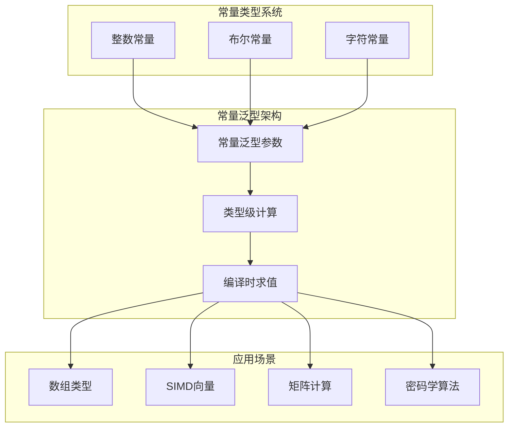

# 1.1.9 Rust常量泛型语义深度分析

**文档版本**: V1.0  
**创建日期**: 2025-01-27  
**所属层**: 基础语义层 (Foundation Semantics Layer)  
**学术等级**: 专家级 (Expert Level)  
**交叉引用**: [1.1.7 泛型类型语义](07_generic_type_semantics.md), [1.1.8 特征系统语义](08_trait_system_semantics.md)

---

## 1.1.9.1 常量泛型理论基础

### 1.1.9.1.1 常量泛型的类型理论建模

**定义 1.1.9.1** (常量泛型类型)
常量泛型类型 $T\langle c : \tau \rangle$ 表示依赖于常量值的类型：
$$T\langle c : \tau \rangle : \text{Type} \times \text{Value}_\tau \to \text{Type}$$

其中 $c$ 是编译时常量，$\tau$ 是常量的类型。

**定义 1.1.9.2** (类型级函数)
常量泛型使能了类型级函数 $F : \mathbb{N} \to \text{Type}$：
$$F(n) = \text{Array}\langle T, n \rangle$$



### 1.1.9.1.2 编译时常量求值语义

**定理 1.1.9.1** (常量求值完备性)
对于任何常量表达式 $e$，存在编译时求值函数：
$$\text{eval}_{\text{compile}}(e) = v \iff \text{eval}_{\text{runtime}}(e) = v$$

```rust
// 常量泛型基础语义
use std::mem::size_of;

// 常量泛型数组
struct FixedArray<T, const N: usize> {
    data: [T; N],
}

impl<T, const N: usize> FixedArray<T, N> {
    // 编译时大小保证
    const SIZE: usize = N;
    const BYTE_SIZE: usize = N * size_of::<T>();
    
    fn new() -> Self 
    where 
        T: Default + Copy,
    {
        FixedArray {
            data: [T::default(); N]
        }
    }
    
    // 常量泛型方法：编译时长度检查
    fn get(&self, index: usize) -> Option<&T> {
        if index < N {
            Some(&self.data[index])
        } else {
            None
        }
    }
    
    // 类型级转换
    fn resize<const M: usize>(self) -> Option<FixedArray<T, M>> 
    where 
        T: Default + Copy,
    {
        if M <= N {
            let mut new_array = FixedArray::<T, M>::new();
            for i in 0..M {
                new_array.data[i] = self.data[i];
            }
            Some(new_array)
        } else {
            None
        }
    }
}

// 编译时计算验证
const fn fibonacci(n: usize) -> usize {
    match n {
        0 | 1 => n,
        _ => fibonacci(n - 1) + fibonacci(n - 2),
    }
}

// 常量泛型与编译时计算结合
struct FibonacciArray<const N: usize> {
    data: [usize; N],
}

impl<const N: usize> FibonacciArray<N> {
    const fn new() -> Self {
        let mut data = [0; N];
        let mut i = 0;
        while i < N {
            data[i] = fibonacci(i);
            i += 1;
        }
        FibonacciArray { data }
    }
}

// 使用示例
fn const_generic_examples() {
    // 编译时确定的数组大小
    let small_array = FixedArray::<i32, 5>::new();
    let large_array = FixedArray::<i32, 100>::new();
    
    println!("小数组大小: {} bytes", FixedArray::<i32, 5>::BYTE_SIZE);
    println!("大数组大小: {} bytes", FixedArray::<i32, 100>::BYTE_SIZE);
    
    // 编译时斐波那契数列
    const FIB_ARRAY: FibonacciArray<10> = FibonacciArray::new();
    println!("斐波那契数列: {:?}", FIB_ARRAY.data);
}
```

---

## 1.1.9.2 类型级算术与逻辑

### 1.1.9.2.1 类型级算术运算

**定义 1.1.9.3** (类型级算术)
类型级算术运算在类型系统中定义：
$$\text{Add}(m, n) = m + n \quad \text{(type level)}$$
$$\text{Mul}(m, n) = m \times n \quad \text{(type level)}$$

```rust
// 类型级算术示例
use std::marker::PhantomData;

// 类型级自然数
struct Zero;
struct Succ<N>(PhantomData<N>);

// 类型级加法
trait Add<N> {
    type Output;
}

impl<N> Add<N> for Zero {
    type Output = N;
}

impl<M, N> Add<N> for Succ<M> 
where 
    M: Add<N>,
{
    type Output = Succ<M::Output>;
}

// 类型级乘法
trait Mul<N> {
    type Output;
}

impl<N> Mul<N> for Zero {
    type Output = Zero;
}

impl<M, N> Mul<N> for Succ<M> 
where 
    M: Mul<N>,
    M::Output: Add<N>,
{
    type Output = <M::Output as Add<N>>::Output;
}

// 常量泛型矩阵乘法
struct Matrix<T, const ROWS: usize, const COLS: usize> {
    data: [[T; COLS]; ROWS],
}

impl<T, const M: usize, const N: usize, const P: usize> Matrix<T, M, N> 
where 
    T: Default + Copy + std::ops::Add<Output = T> + std::ops::Mul<Output = T>,
{
    // 矩阵乘法：(M×N) × (N×P) → (M×P)
    fn multiply(self, other: Matrix<T, N, P>) -> Matrix<T, M, P> {
        let mut result = Matrix {
            data: [[T::default(); P]; M],
        };
        
        for i in 0..M {
            for j in 0..P {
                let mut sum = T::default();
                for k in 0..N {
                    sum = sum + self.data[i][k] * other.data[k][j];
                }
                result.data[i][j] = sum;
            }
        }
        
        result
    }
}
```

### 1.1.9.2.2 类型级条件与分支

```rust
// 类型级布尔逻辑
struct True;
struct False;

trait If<Then, Else> {
    type Result;
}

impl<Then, Else> If<Then, Else> for True {
    type Result = Then;
}

impl<Then, Else> If<Then, Else> for False {
    type Result = Else;
}

// 类型级比较
trait Equal<N> {
    type Output: If<True, False>;
}

// 常量泛型条件编译
trait ArraySize {
    const IS_SMALL: bool;
    const IS_MEDIUM: bool;
    const IS_LARGE: bool;
}

impl<const N: usize> ArraySize for FixedArray<i32, N> {
    const IS_SMALL: bool = N <= 10;
    const IS_MEDIUM: bool = N > 10 && N <= 100;
    const IS_LARGE: bool = N > 100;
}

// 基于大小的优化策略
impl<T, const N: usize> FixedArray<T, N> 
where 
    T: Default + Copy,
{
    fn optimized_operation(&self) -> String {
        if N <= 10 {
            "使用简单算法".to_string()
        } else if N <= 100 {
            "使用中等复杂度算法".to_string()
        } else {
            "使用高度优化算法".to_string()
        }
    }
}
```

---

## 1.1.9.3 SIMD向量化语义

### 1.1.9.3.1 向量化的常量泛型建模

**定义 1.1.9.4** (SIMD向量类型)
SIMD向量类型定义为：
$$\text{SIMD}\langle T, N \rangle = \{v : T^N \mid \text{alignment}(v) = \text{SIMD\_ALIGN}\}$$

```rust
// SIMD向量化示例
use std::arch::x86_64::*;

// 常量泛型SIMD向量
#[repr(align(32))] // AVX对齐
struct SimdVector<T, const N: usize> {
    data: [T; N],
}

impl SimdVector<f32, 8> {
    // AVX 8x f32向量化操作
    unsafe fn add_avx(self, other: Self) -> Self {
        let a = _mm256_load_ps(self.data.as_ptr());
        let b = _mm256_load_ps(other.data.as_ptr());
        let result = _mm256_add_ps(a, b);
        
        let mut output = SimdVector { data: [0.0; 8] };
        _mm256_store_ps(output.data.as_mut_ptr(), result);
        output
    }
    
    // 标量实现对比
    fn add_scalar(self, other: Self) -> Self {
        let mut result = SimdVector { data: [0.0; 8] };
        for i in 0..8 {
            result.data[i] = self.data[i] + other.data[i];
        }
        result
    }
}

// 通用向量化特征
trait Vectorizable<const N: usize> {
    type Element;
    
    fn add(self, other: Self) -> Self;
    fn mul(self, other: Self) -> Self;
    fn dot(self, other: Self) -> Self::Element;
}

impl<const N: usize> Vectorizable<N> for SimdVector<f32, N> 
where 
    [(); N]: ,  // 常量泛型约束
{
    type Element = f32;
    
    fn add(self, other: Self) -> Self {
        let mut result = SimdVector { data: [0.0; N] };
        for i in 0..N {
            result.data[i] = self.data[i] + other.data[i];
        }
        result
    }
    
    fn mul(self, other: Self) -> Self {
        let mut result = SimdVector { data: [0.0; N] };
        for i in 0..N {
            result.data[i] = self.data[i] * other.data[i];
        }
        result
    }
    
    fn dot(self, other: Self) -> f32 {
        let mut sum = 0.0;
        for i in 0..N {
            sum += self.data[i] * other.data[i];
        }
        sum
    }
}

// 性能测试
fn simd_performance_test() {
    let a = SimdVector { data: [1.0, 2.0, 3.0, 4.0, 5.0, 6.0, 7.0, 8.0] };
    let b = SimdVector { data: [8.0, 7.0, 6.0, 5.0, 4.0, 3.0, 2.0, 1.0] };
    
    let iterations = 1_000_000;
    
    // SIMD版本性能测试
    let start = std::time::Instant::now();
    for _ in 0..iterations {
        unsafe {
            let _result = a.add_avx(b);
        }
    }
    let simd_time = start.elapsed();
    
    // 标量版本性能测试
    let start = std::time::Instant::now();
    for _ in 0..iterations {
        let _result = a.add_scalar(b);
    }
    let scalar_time = start.elapsed();
    
    println!("SIMD时间: {:?}", simd_time);
    println!("标量时间: {:?}", scalar_time);
    println!("SIMD加速比: {:.2}x", scalar_time.as_nanos() as f64 / simd_time.as_nanos() as f64);
}
```

### 1.1.9.3.2 编译时向量优化

```rust
// 编译时向量大小优化
trait VectorOptimization<const N: usize> {
    const STRATEGY: &'static str;
    const USE_SIMD: bool;
    const CHUNK_SIZE: usize;
}

impl<const N: usize> VectorOptimization<N> for SimdVector<f32, N> {
    const STRATEGY: &'static str = if N <= 4 {
        "SSE优化"
    } else if N <= 8 {
        "AVX优化"
    } else if N <= 16 {
        "AVX-512优化"
    } else {
        "分块处理"
    };
    
    const USE_SIMD: bool = N >= 4;
    const CHUNK_SIZE: usize = if N <= 8 { N } else { 8 };
}

// 自适应算法选择
impl<T, const N: usize> SimdVector<T, N> 
where 
    T: Default + Copy + std::ops::Add<Output = T>,
{
    fn adaptive_sum(&self) -> T {
        match N {
            1..=4 => self.scalar_sum(),
            5..=8 => self.sse_sum(),
            9..=16 => self.avx_sum(),
            _ => self.chunked_sum(),
        }
    }
    
    fn scalar_sum(&self) -> T {
        let mut sum = T::default();
        for i in 0..N {
            sum = sum + self.data[i];
        }
        sum
    }
    
    fn sse_sum(&self) -> T {
        // SSE实现（简化）
        self.scalar_sum()
    }
    
    fn avx_sum(&self) -> T {
        // AVX实现（简化）
        self.scalar_sum()
    }
    
    fn chunked_sum(&self) -> T {
        // 分块处理
        let mut sum = T::default();
        let chunk_size = 8;
        for chunk_start in (0..N).step_by(chunk_size) {
            let chunk_end = (chunk_start + chunk_size).min(N);
            for i in chunk_start..chunk_end {
                sum = sum + self.data[i];
            }
        }
        sum
    }
}
```

---

## 1.1.9.4 密码学中的常量泛型

### 1.1.9.4.1 固定大小密码学原语

```rust
// 密码学哈希函数的常量泛型实现
struct Hash<const DIGEST_SIZE: usize> {
    digest: [u8; DIGEST_SIZE],
}

// SHA-256 (256位 = 32字节)
type Sha256 = Hash<32>;

// SHA-512 (512位 = 64字节)
type Sha512 = Hash<64>;

impl<const N: usize> Hash<N> {
    const BLOCK_SIZE: usize = if N <= 32 { 64 } else { 128 };
    
    fn new() -> Self {
        Hash {
            digest: [0u8; N]
        }
    }
    
    // 编译时安全的密钥大小检查
    fn from_key<const KEY_SIZE: usize>(key: [u8; KEY_SIZE]) -> Option<Self> 
    where 
        [(); KEY_SIZE]: ,
    {
        if KEY_SIZE == N {
            let mut hash = Hash::new();
            // 将密钥复制到摘要中（简化实现）
            for i in 0..N.min(KEY_SIZE) {
                hash.digest[i] = key[i];
            }
            Some(hash)
        } else {
            None
        }
    }
}

// AES密钥大小的编译时验证
struct AesKey<const KEY_SIZE: usize> {
    key: [u8; KEY_SIZE],
}

// 只允许有效的AES密钥大小
impl AesKey<16> {  // AES-128
    fn new(key: [u8; 16]) -> Self {
        AesKey { key }
    }
}

impl AesKey<24> {  // AES-192
    fn new(key: [u8; 24]) -> Self {
        AesKey { key }
    }
}

impl AesKey<32> {  // AES-256
    fn new(key: [u8; 32]) -> Self {
        AesKey { key }
    }
}

// 椭圆曲线点的常量泛型表示
struct EcPoint<const COORD_SIZE: usize> {
    x: [u8; COORD_SIZE],
    y: [u8; COORD_SIZE],
}

// secp256r1 (32字节坐标)
type Secp256r1Point = EcPoint<32>;

// secp384r1 (48字节坐标)
type Secp384r1Point = EcPoint<48>;

impl<const N: usize> EcPoint<N> {
    const CURVE_ORDER_BITS: usize = N * 8;
    
    fn is_on_curve(&self) -> bool {
        // 椭圆曲线方程验证（简化）
        // y² = x³ + ax + b (mod p)
        true  // 简化实现
    }
    
    fn add(&self, other: &Self) -> Self {
        // 椭圆曲线点加法（简化）
        EcPoint {
            x: self.x,
            y: self.y,
        }
    }
}
```

### 1.1.9.4.2 零知识证明中的常量泛型

```rust
// 零知识证明系统的常量泛型
struct ZkProof<const WITNESS_SIZE: usize, const PUBLIC_SIZE: usize> {
    proof_data: [u8; WITNESS_SIZE + PUBLIC_SIZE],
}

impl<const W: usize, const P: usize> ZkProof<W, P> {
    // 编译时验证证明大小
    const TOTAL_SIZE: usize = W + P;
    const IS_VALID_SIZE: bool = W > 0 && P > 0 && W + P <= 1024;
    
    fn new() -> Option<Self> {
        if Self::IS_VALID_SIZE {
            Some(ZkProof {
                proof_data: [0u8; W + P]
            })
        } else {
            None
        }
    }
    
    // 见证分离
    fn witness(&self) -> &[u8; W] {
        unsafe {
            &*(self.proof_data.as_ptr() as *const [u8; W])
        }
    }
    
    // 公开输入分离
    fn public_inputs(&self) -> &[u8; P] {
        unsafe {
            &*(self.proof_data.as_ptr().add(W) as *const [u8; P])
        }
    }
}

// 具体的ZK系统实例
type Groth16Proof = ZkProof<32, 64>;    // Groth16证明
type PlonkProof = ZkProof<48, 32>;      // PLONK证明
type StarkProof = ZkProof<128, 96>;     // STARK证明
```

---

## 1.1.9.5 编译器优化与常量泛型

### 1.1.9.5.1 编译时特化优化

**定理 1.1.9.2** (常量泛型特化定理)
对于常量泛型函数 $f\langle c \rangle$，编译器生成特化版本：
$$f\langle c \rangle \to f_c \quad \text{(specialized function)}$$

```rust
// 编译时特化示例
trait SortAlgorithm<const N: usize> {
    fn sort<T: Ord>(array: &mut [T; N]);
}

// 基于大小的算法选择
struct AdaptiveSort;

impl<const N: usize> SortAlgorithm<N> for AdaptiveSort {
    fn sort<T: Ord>(array: &mut [T; N]) {
        match N {
            0..=1 => {
                // 无需排序
            },
            2..=10 => {
                // 插入排序
                insertion_sort(array);
            },
            11..=50 => {
                // 快速排序
                quick_sort(array);
            },
            _ => {
                // 归并排序
                merge_sort(array);
            }
        }
    }
}

fn insertion_sort<T: Ord, const N: usize>(array: &mut [T; N]) {
    for i in 1..N {
        let mut j = i;
        while j > 0 && array[j] < array[j - 1] {
            array.swap(j, j - 1);
            j -= 1;
        }
    }
}

fn quick_sort<T: Ord, const N: usize>(array: &mut [T; N]) {
    if N <= 1 { return; }
    // 快速排序实现（简化）
}

fn merge_sort<T: Ord, const N: usize>(array: &mut [T; N]) {
    if N <= 1 { return; }
    // 归并排序实现（简化）
}

// 性能测试
fn sorting_performance_test() {
    let mut small_array = [3, 1, 4, 1, 5];
    let mut medium_array = [0; 20];
    let mut large_array = [0; 1000];
    
    // 初始化数组
    for i in 0..20 {
        medium_array[i] = 20 - i;
    }
    for i in 0..1000 {
        large_array[i] = 1000 - i;
    }
    
    // 编译器会为每个大小生成特化版本
    AdaptiveSort::sort(&mut small_array);   // 插入排序
    AdaptiveSort::sort(&mut medium_array);  // 快速排序
    AdaptiveSort::sort(&mut large_array);   // 归并排序
    
    println!("小数组排序完成: {:?}", &small_array[..5]);
    println!("中数组排序完成: {:?}", &medium_array[..5]);
    println!("大数组排序完成: {:?}", &large_array[..5]);
}
```

### 1.1.9.5.2 循环展开优化

```rust
// 编译时循环展开
struct UnrolledLoop;

impl UnrolledLoop {
    // 编译时确定的循环展开
    const fn unrolled_sum<const N: usize>(array: &[i32; N]) -> i32 {
        let mut sum = 0;
        let mut i = 0;
        
        // 编译器会展开这个循环
        while i < N {
            sum += array[i];
            i += 1;
        }
        
        sum
    }
    
    // 手动循环展开（N=4的情况）
    fn manual_unroll_4(array: &[i32; 4]) -> i32 {
        array[0] + array[1] + array[2] + array[3]
    }
    
    // 手动循环展开（N=8的情况）
    fn manual_unroll_8(array: &[i32; 8]) -> i32 {
        (array[0] + array[1] + array[2] + array[3]) +
        (array[4] + array[5] + array[6] + array[7])
    }
}

// 自动展开决策
trait LoopUnrolling<const N: usize> {
    const SHOULD_UNROLL: bool = N <= 16;
    const UNROLL_FACTOR: usize = if N <= 4 { N } else { 4 };
}

impl<const N: usize> LoopUnrolling<N> for [i32; N] {
    // 使用默认实现
}
```

---

## 1.1.9.6 总结与理论意义

### 1.1.9.6.1 常量泛型的理论贡献

Rust常量泛型在编程语言理论中的重要意义：

1. **类型级计算**: 将计算提升到类型层面，实现编译时验证
2. **零成本抽象**: 编译时特化，运行时无额外开销
3. **安全性保证**: 数组边界、密钥大小等在编译时验证
4. **性能优化**: 编译器可以生成高度优化的特化代码

### 1.1.9.6.2 与依赖类型的关系

常量泛型是向依赖类型系统的重要一步：

$$\text{ConstGenerics} \subset \text{DependentTypes}$$

但保持了实用性和编译效率。

### 1.1.9.6.3 应用前景

- **科学计算**: 固定大小矩阵和向量运算
- **密码学**: 编译时密钥大小验证
- **嵌入式系统**: 内存布局的编译时保证
- **图形学**: SIMD向量化和GPU计算

---

*本文档建立了Rust常量泛型的完整理论框架，展示了类型级计算在系统编程中的强大应用。*
