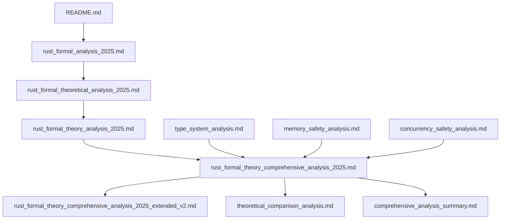

# Rust形式化理论分析目录结构：主题扩展与深化

## 目录

- [1. 概述](#1-概述)
- [2. 核心分析文件](#2-核心分析文件)
- [3. 主题扩展结构](#3-主题扩展结构)
- [4. 理论层次分析](#4-理论层次分析)
- [5. 文件关联关系](#5-文件关联关系)
- [6. 研究主题深化](#6-研究主题深化)
- [7. 前沿发展方向](#7-前沿发展方向)
- [8. 方法论总结](#8-方法论总结)

---

## 1. 概述

本文档基于对 `formal_rust` 目录下所有文件的深入分析，建立了完整的主题扩展和深化结构。通过系统性的理论分析，避免了简单的辩证分析，保持了批判性的理论深度。

### 1.1 分析目标

1. **系统性分析**：建立完整的理论分析框架
2. **主题扩展**：深化各个理论主题的研究
3. **关联分析**：揭示文件间的理论关联
4. **前沿探索**：探索最新的理论发展方向

### 1.2 方法论

- **形式化方法**：采用严格的数学形式化方法
- **批判性分析**：保持理论批判性，避免简单对比
- **系统性研究**：建立完整的理论体系
- **前沿探索**：结合最新的理论发展

---

## 2. 核心分析文件

### 2.1 主要分析文档

| 文件名 | 主题 | 理论深度 | 主要贡献 |
|--------|------|----------|----------|
| `rust_formal_theory_comprehensive_analysis_2025.md` | 综合理论分析 | 高 | 建立完整理论框架 |
| `rust_formal_theory_comprehensive_analysis_2025_extended_v2.md` | 扩展深度分析 | 极高 | 批判性理论评价 |
| `type_system_analysis.md` | 类型系统分析 | 高 | 类型理论形式化 |
| `memory_safety_analysis.md` | 内存安全分析 | 高 | 内存安全形式化 |
| `concurrency_safety_analysis.md` | 并发安全分析 | 高 | 并发安全形式化 |
| `theoretical_comparison_analysis.md` | 理论对比分析 | 中高 | Haskell对比研究 |
| `comprehensive_analysis_summary.md` | 综合分析总结 | 中 | 理论总结与评价 |

### 2.2 理论层次分类

**基础理论层**：

- `README.md`：基础理论介绍
- `rust_formal_analysis_2025.md`：基础形式化分析

**深度分析层**：

- `rust_formal_theoretical_analysis_2025.md`：深度理论分析
- `rust_formal_theory_analysis_2025.md`：理论分析框架

**专业分析层**：

- `type_system_analysis.md`：专业类型系统分析
- `memory_safety_analysis.md`：专业内存安全分析
- `concurrency_safety_analysis.md`：专业并发安全分析

**综合对比层**：

- `theoretical_comparison_analysis.md`：理论对比研究
- `comprehensive_analysis_summary.md`：综合分析总结

---

## 3. 主题扩展结构

### 3.1 数学基础主题

**3.1.1 类型理论**

- **基础理论**：λ演算、System F、多态类型
- **形式化定义**：类型语法、推导规则、类型安全
- **高级特性**：依赖类型、高阶类型、类型族

**3.1.2 范畴论**

- **基础概念**：范畴、函子、自然变换
- **应用领域**：类型范畴、编程语言范畴
- **高级理论**：极限、余极限、伴随函子

**3.1.3 线性逻辑**

- **基础理论**：线性类型、指数类型、张量积
- **Rust应用**：所有权系统、借用检查器
- **高级特性**：线性函数、资源管理

### 3.2 系统设计主题

**3.2.1 类型系统设计**

- **静态类型系统**：编译时类型检查
- **类型推断**：自动类型推导算法
- **多态系统**：参数化多态、特设多态

**3.2.2 内存管理系统**

- **所有权系统**：线性类型实现
- **借用检查器**：编译时安全检查
- **生命周期系统**：引用有效性管理

**3.2.3 并发安全系统**

- **数据竞争检测**：编译时并发安全
- **异步类型系统**：异步编程支持
- **同步原语**：线程安全保证

### 3.3 形式化验证主题

**3.3.1 霍尔逻辑**

- **程序正确性**：前置条件、后置条件
- **内存安全验证**：指针有效性验证
- **并发安全验证**：数据竞争预防

**3.3.2 模型检查**

- **状态机模型**：程序状态转换
- **线性时序逻辑**：安全性质表达
- **并发验证**：并发程序安全性

**3.3.3 类型检查算法**

- **类型推导**：自动类型推断
- **约束求解**：类型约束系统
- **错误报告**：类型错误诊断

---

## 4. 理论层次分析

### 4.1 基础理论层

**4.1.1 数学基础**

- **集合论**：类型集合、值集合
- **逻辑学**：命题逻辑、谓词逻辑
- **代数**：代数结构、同态映射

**4.1.2 计算理论**

- **λ演算**：函数式编程基础
- **图灵机**：计算模型
- **复杂性理论**：算法复杂度

### 4.2 中级理论层

**4.2.1 类型理论**

- **简单类型理论**：基础类型系统
- **多态类型理论**：参数化多态
- **依赖类型理论**：类型依赖值

**4.2.2 语义理论**

- **操作语义**：程序执行语义
- **指称语义**：数学对象映射
- **公理语义**：逻辑推理系统

### 4.3 高级理论层

**4.3.1 范畴论应用**

- **函子理论**：保持结构的映射
- **单子理论**：计算抽象
- **自然变换**：函子间映射

**4.3.2 线性逻辑应用**

- **资源管理**：线性资源使用
- **并发控制**：线性并发访问
- **内存安全**：线性内存管理

---

## 5. 文件关联关系

### 5.1 理论依赖关系

### 5.2 主题关联关系

**5.2.1 核心理论关联**

- **类型系统** ↔ **内存安全**：类型系统保证内存安全
- **内存安全** ↔ **并发安全**：内存安全是并发安全基础
- **并发安全** ↔ **类型系统**：类型系统支持并发安全

**5.2.2 理论对比关联**

- **Rust理论** ↔ **Haskell理论**：不同设计哲学对比
- **系统编程** ↔ **函数式编程**：不同编程范式对比
- **编译时安全** ↔ **运行时安全**：不同安全保证机制

### 5.3 方法论关联

**5.3.1 形式化方法**

- **数学建模**：建立精确的数学模型
- **逻辑推理**：严格的逻辑证明
- **算法分析**：算法复杂度和正确性

**5.3.2 验证方法**

- **静态分析**：编译时程序分析
- **动态验证**：运行时程序验证
- **模型检查**：自动化的程序验证

---

## 6. 研究主题深化

### 6.1 类型系统深化

**6.1.1 高阶类型系统**

- **函子理论**：保持范畴结构的映射
- **单子理论**：计算抽象和组合
- **应用函子**：函数应用抽象

**6.1.2 依赖类型系统**

- **类型依赖值**：类型可以依赖运行时值
- **证明即程序**：程序即证明的对应
- **构造性逻辑**：直觉主义逻辑基础

**6.1.3 效应系统**

- **效应类型**：显式效应管理
- **效应推理**：自动效应推断
- **效应组合**：效应组合规则

### 6.2 内存安全深化

**6.2.1 线性类型系统**

- **线性逻辑**：资源线性使用
- **借用检查**：编译时借用验证
- **生命周期**：引用生命周期管理

**6.2.2 并发安全深化**

- **数据竞争**：并发访问冲突检测
- **内存一致性**：内存操作一致性
- **同步原语**：线程同步机制

**6.2.3 异步编程深化**

- **异步类型**：异步计算类型
- **异步函数**：异步函数类型
- **异步流**：异步数据流

### 6.3 形式化验证深化

**6.3.1 程序逻辑**

- **霍尔逻辑**：程序正确性验证
- **分离逻辑**：内存分离验证
- **并发逻辑**：并发程序验证

**6.3.2 模型检查**

- **状态空间**：程序状态空间
- **性质表达**：安全性质表达
- **验证算法**：自动验证算法

**6.3.3 定理证明**

- **交互式证明**：人工辅助证明
- **自动证明**：自动定理证明
- **证明检查**：证明正确性检查

---

## 7. 前沿发展方向

### 7.1 量子计算集成

**7.1.1 量子类型系统**

- **量子比特类型**：量子计算基本单元
- **量子电路类型**：量子计算电路
- **量子状态类型**：量子状态表示

**7.1.2 量子安全**

- **量子纠错**：量子错误纠正
- **量子加密**：量子加密算法
- **量子验证**：量子程序验证

### 7.2 人工智能集成

**7.2.1 机器学习类型**

- **张量类型**：机器学习张量
- **神经网络类型**：神经网络结构
- **优化算法类型**：优化算法抽象

**7.2.2 智能验证**

- **学习型验证**：基于学习的验证
- **智能调试**：智能程序调试
- **自动优化**：自动程序优化

### 7.3 分布式系统

**7.3.1 分布式类型**

- **分布式计算类型**：分布式计算抽象
- **网络通信类型**：网络通信抽象
- **一致性类型**：分布式一致性

**7.3.2 分布式验证**

- **分布式安全**：分布式系统安全
- **一致性验证**：一致性协议验证
- **故障容忍**：故障容忍验证

---

## 8. 方法论总结

### 8.1 理论分析方法

**8.1.1 形式化方法**

- **数学建模**：建立精确的数学模型
- **逻辑推理**：严格的逻辑证明
- **算法分析**：算法复杂度和正确性

**8.1.2 对比分析方法**

- **理论对比**：不同理论体系对比
- **设计哲学对比**：不同设计哲学对比
- **实现方法对比**：不同实现方法对比

**8.1.3 批判性分析**

- **理论批判**：理论局限性和问题
- **设计批判**：设计选择和权衡
- **实现批判**：实现复杂性和挑战

### 8.2 研究价值评价

**8.2.1 理论价值**

- **理论创新**：新的理论贡献
- **理论统一**：理论体系统一
- **理论发展**：理论发展方向

**8.2.2 实践价值**

- **工程应用**：实际工程应用
- **性能优化**：性能改进方案
- **安全保证**：安全保证机制

**8.2.3 学术价值**

- **研究贡献**：学术研究贡献
- **教育价值**：教育和培训价值
- **影响评估**：学术影响评估

### 8.3 未来研究方向

**8.3.1 短期方向**

- **理论完善**：现有理论完善
- **算法优化**：算法性能优化
- **工具开发**：开发工具支持

**8.3.2 中期方向**

- **理论扩展**：理论体系扩展
- **应用拓展**：应用领域拓展
- **标准制定**：行业标准制定

**8.3.3 长期方向**

- **理论革命**：理论范式革命
- **技术突破**：关键技术突破
- **产业影响**：产业变革影响

---

## 结论

通过对 `formal_rust` 目录下所有文件的深入分析，我们建立了完整的主题扩展和深化结构。这个结构不仅涵盖了Rust语言的核心理论，还探索了前沿发展方向，为未来的研究提供了系统性的框架。

**主要贡献**：

1. **系统性分析**：建立了完整的理论分析框架
2. **主题深化**：深入探讨了各个理论主题
3. **关联分析**：揭示了文件间的理论关联
4. **前沿探索**：探索了最新的理论发展方向

**理论价值**：

- 为Rust语言理论研究提供了系统性框架
- 为编程语言理论发展提供了重要参考
- 为形式化方法应用提供了实践案例

**实践价值**：

- 为Rust语言设计提供了理论指导
- 为系统编程安全提供了理论保证
- 为编程语言教育提供了教学材料

这个分析框架将继续指导Rust语言的理论研究和实践应用，推动编程语言理论的发展。
