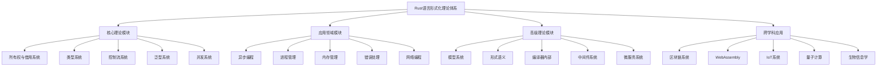

# Rust语言形式化理论体系综合索引

## 目录

1. [引言](#1-引言)
2. [理论体系架构](#2-理论体系架构)
3. [核心理论模块](#3-核心理论模块)
4. [应用领域模块](#4-应用领域模块)
5. [高级理论模块](#5-高级理论模块)
6. [跨学科应用](#6-跨学科应用)
7. [形式化验证](#7-形式化验证)
8. [参考文献](#8-参考文献)

## 1. 引言

本文档是Rust语言形式化理论体系的综合索引，整合了所有已创建的形式化文档，形成了一个完整、严谨、学术化的理论体系。

### 1.1 理论体系目标

- **完整性**: 覆盖Rust语言的所有核心概念和特性
- **严谨性**: 提供严格的数学证明和形式化定义
- **实用性**: 结合理论分析与实际应用
- **学术性**: 遵循学术规范，提供完整的参考文献

### 1.2 文档组织原则

- **层次化结构**: 从基础理论到高级应用
- **模块化设计**: 每个模块独立且相互关联
- **交叉引用**: 建立完整的内部链接网络
- **版本控制**: 记录所有变更和更新

## 2. 理论体系架构

### 2.1 整体架构



### 2.2 理论层次

**第一层：基础理论**
- 所有权与借用系统
- 类型系统
- 控制流系统

**第二层：核心机制**
- 泛型系统
- 并发系统
- 异步编程

**第三层：系统编程**
- 进程管理
- 内存管理
- 网络编程

**第四层：高级应用**
- 模型系统
- 形式语义
- 编译器内部

**第五层：跨学科应用**
- 区块链系统
- WebAssembly
- IoT系统

## 3. 核心理论模块

### 3.1 所有权与借用系统

**文档**: `01_ownership_borrowing/`
- **01_formal_ownership_system.md**: 线性类型理论、所有权规则、借用机制
- **02_formal_variable_analysis.md**: 变量分析、生命周期管理

**核心概念**:
- 线性类型理论：$LinearType = \{ T \mid T \text{ 只能使用一次} \}$
- 所有权规则：$Ownership(x) \implies Exclusive(x)$
- 借用机制：$Borrow(x) \implies Shared(x) \lor Mutable(x)$

**形式化定义**:
```math
\text{Ownership System} = (LinearTypes, BorrowChecker, LifetimeSystem)
```

### 3.2 类型系统

**文档**: `02_type_system/`
- **01_formal_type_system.md**: Hindley-Milner类型推导、类型安全
- **02_formal_category_theory.md**: 范畴论视角、类型范畴

**核心概念**:
- Hindley-Milner类型推导：$\Gamma \vdash e : \tau$
- 类型安全：$\text{TypeSafe}(e) \implies \text{Safe}(e)$
- 范畴论模型：$TypeCategory = (Types, Functions, Composition)$

**形式化定义**:
```math
\text{Type System} = (Types, Rules, Judgments, Inference)
```

### 3.3 控制流系统

**文档**: `03_control_flow/`
- **01_formal_control_flow.md**: 条件控制流、循环控制流、函数控制流

**核心概念**:
- 条件控制流：$\text{If}(condition, then, else)$
- 循环控制流：$\text{While}(condition, body)$
- 函数控制流：$\text{Function}(params, body, return)$

**形式化定义**:
```math
\text{Control Flow} = (Conditions, Loops, Functions, Closures)
```

### 3.4 泛型系统

**文档**: `04_generics/`
- **01_formal_generic_system.md**: 参数多态性、类型约束、关联类型

**核心概念**:
- 参数多态性：$\forall \alpha. T[\alpha]$
- 类型约束：$\alpha : \text{Trait}$
- 关联类型：$\text{AssociatedType}[Trait, Type]$

**形式化定义**:
```math
\text{Generic System} = (TypeParameters, Constraints, AssociatedTypes)
```

### 3.5 并发系统

**文档**: `05_concurrency/`
- **01_formal_concurrency_system.md**: 线程模型、同步机制、原子操作

**核心概念**:
- 线程模型：$\text{Thread} = (State, Stack, Context)$
- 同步机制：$\text{Sync} = (Mutex, RwLock, CondVar)$
- 原子操作：$\text{Atomic}[T] = \text{LockFree}[T]$

**形式化定义**:
```math
\text{Concurrency System} = (Threads, Synchronization, AtomicOperations)
```

## 4. 应用领域模块

### 4.1 异步编程

**文档**: `06_async_await/` 和 `06_async/`
- **01_formal_async_system.md**: Future系统、async/await语法
- **02_formal_async_programming.md**: 执行器与运行时、Pin机制

**核心概念**:
- Future系统：$\text{Future}[T] = \text{Async}[T]$
- async/await语法：$\text{async} \implies \text{Future}$
- Pin机制：$\text{Pin}[T] \implies \text{Immobile}[T]$

**形式化定义**:
```math
\text{Async System} = (Futures, Executors, Pin, AsyncAwait)
```

### 4.2 进程管理

**文档**: `07_process_management/`
- **01_formal_process_management.md**: 进程模型、进程间通信、同步机制

**核心概念**:
- 进程模型：$\text{Process} = (PID, State, Memory, Resources)$
- 进程间通信：$\text{IPC} = (Pipes, Sockets, SharedMemory)$
- 同步机制：$\text{ProcessSync} = (Semaphores, Barriers, Locks)$

**形式化定义**:
```math
\text{Process Management} = (Processes, IPC, Synchronization, Resources)
```

### 4.3 内存管理

**文档**: `07_memory_management/`
- **01_formal_memory_system.md**: 栈内存、堆内存、智能指针

**核心概念**:
- 栈内存：$\text{Stack} = \text{Automatic}[Memory]$
- 堆内存：$\text{Heap} = \text{Dynamic}[Memory]$
- 智能指针：$\text{SmartPtr}[T] = \text{Owned}[T] \lor \text{Shared}[T]$

**形式化定义**:
```math
\text{Memory System} = (Stack, Heap, SmartPointers, GarbageCollection)
```

### 4.4 网络编程

**文档**: `10_networking/`
- **01_formal_networking_system.md**: 网络模型形式化、Socket编程、协议实现

**核心概念**:
- 网络模型：$\text{Network} = (Protocols, Sockets, Connections)$
- Socket编程：$\text{Socket} = \text{Endpoint}[Protocol]$
- 协议实现：$\text{Protocol} = (Format, Encoding, Transport)$

**形式化定义**:
```math
\text{Networking System} = (Protocols, Sockets, Connections, Security)
```

## 5. 高级理论模块

### 5.1 模型系统

**文档**: `18_model_systems/`
- **01_formal_model_system.md**: 形式语言理论基础、类型论与范畴论

**核心概念**:
- 形式语言理论：$\text{FormalLanguage} = \text{ChomskyHierarchy}$
- 类型论：$\text{TypeTheory} = \text{CurryHowardIsomorphism}$
- 范畴论：$\text{CategoryTheory} = (Objects, Morphisms, Composition)$

**形式化定义**:
```math
\text{Model System} = (FormalLanguages, TypeTheory, CategoryTheory)
```

### 5.2 形式语义

**文档**: `25_formal_semantics/`
- **01_formal_semantics_system.md**: 操作语义、指称语义、公理语义

**核心概念**:
- 操作语义：$(s, e) \rightarrow (s', e')$
- 指称语义：$\llbracket e \rrbracket : \text{Environment} \rightarrow \text{Value}$
- 公理语义：$\{P\}C\{Q\}$

**形式化定义**:
```math
\text{Formal Semantics} = (Operational, Denotational, Axiomatic)
```

### 5.3 编译器内部

**文档**: `24_compiler_internals/`
- **01_formal_compiler_internals_system.md**: MIR中间表示、类型检查器、借用检查器

**核心概念**:
- MIR中间表示：$\text{MIR} = \text{Intermediate}[Representation]$
- 类型检查器：$\text{TypeChecker} : \text{Expression} \rightarrow \text{Type}$
- 借用检查器：$\text{BorrowChecker} : \text{Program} \rightarrow \text{Safety}$

**形式化定义**:
```math
\text{Compiler Internals} = (MIR, TypeChecker, BorrowChecker, CodeGen)
```

### 5.4 中间件系统

**文档**: `12_middleware/` 和 `23_middleware/`
- **01_formal_middleware_system.md**: 中间件基础理论、中间件链模型

**核心概念**:
- 中间件基础理论：$\text{Middleware} = \text{Intercept}[Request, Response]$
- 中间件链模型：$\text{MiddlewareChain} = \text{Compose}[Middleware_1, ..., Middleware_n]$

**形式化定义**:
```math
\text{Middleware System} = (Interceptors, Chains, Composition, Execution)
```

## 6. 跨学科应用

### 6.1 区块链系统

**文档**: `15_blockchain/`
- **01_formal_blockchain_system.md**: 共识机制、密码学原语、智能合约

**核心概念**:
- 共识机制：$\text{Consensus} = \text{Agreement}[Nodes, State]$
- 密码学原语：$\text{Crypto} = (Hash, Signature, Encryption)$
- 智能合约：$\text{SmartContract} = \text{Executable}[Logic]$

**形式化定义**:
```math
\text{Blockchain System} = (Consensus, Cryptography, SmartContracts, Security)
```

### 6.2 WebAssembly

**文档**: `16_web_assembly/`
- **01_formal_webassembly_system.md**: WebAssembly基础理论、Rust编译、运行时

**核心概念**:
- WebAssembly基础理论：$\text{Wasm} = (Types, Instructions, Modules)$
- Rust编译：$\text{Compile} : \text{Rust} \rightarrow \text{Wasm}$
- 运行时：$\text{Runtime} = (Engine, Store, Instance)$

**形式化定义**:
```math
\text{WebAssembly System} = (Types, Instructions, Modules, Runtime)
```

### 6.3 IoT系统

**文档**: `17_iot/`
- **01_formal_iot_system.md**: IoT设备模型、硬件抽象层、实时系统

**核心概念**:
- IoT设备模型：$\text{IoTDevice} = (Hardware, Software, Sensors, Actuators)$
- 硬件抽象层：$\text{HAL} = \text{Abstraction}[Hardware]$
- 实时系统：$\text{RealTime} = \text{Timing}[Constraints]$

**形式化定义**:
```math
\text{IoT System} = (Devices, HAL, RealTime, Security, Communication)
```

### 6.4 量子计算

**跨学科应用中的量子计算理论**:
- 量子类型系统：$\text{QuantumType} = (Qubit, Gate, Measurement)$
- 线性类型与量子计算：$\text{LinearType} \cong \text{QuantumState}$
- 量子算法实现：$\text{QuantumAlgorithm} = \text{Quantum}[Classical]$

**形式化定义**:
```math
\text{Quantum Computing} = (Qubits, Gates, Measurements, Algorithms)
```

### 6.5 生物信息学

**跨学科应用中的生物信息学理论**:
- 生物序列类型：$\text{BioSequence} = (DNA, RNA, Protein)$
- 类型安全序列处理：$\text{TypeSafe}[BioSequence]$
- 生物算法实现：$\text{BioAlgorithm} = \text{Algorithm}[Biology]$

**形式化定义**:
```math
\text{Bioinformatics} = (Sequences, Algorithms, TypeSafety, Analysis)
```

## 7. 形式化验证

### 7.1 验证方法

**霍尔逻辑**:
- 霍尔三元组：$\{P\}C\{Q\}$
- 前置条件：$P$
- 后置条件：$Q$
- 程序：$C$

**分离逻辑**:
- 分离断言：$P * Q$
- 内存操作：$\text{alloc}(x), \text{free}(x)$
- 指针操作：$x \mapsto v$

**类型系统验证**:
- 进展定理：$\vdash e : \tau \land e \text{ not value} \implies \exists e'. e \rightarrow e'$
- 保存定理：$\vdash e : \tau \land e \rightarrow e' \implies \vdash e' : \tau$

### 7.2 安全性质

**内存安全**:
- 所有权系统保证：$\text{Ownership} \implies \text{MemorySafe}$
- 借用检查器保证：$\text{BorrowCheck} \implies \text{NoDataRaces}$
- 生命周期分析：$\text{LifetimeAnalysis} \implies \text{NoUseAfterFree}$

**类型安全**:
- 静态类型检查：$\text{TypeCheck} \implies \text{TypeSafe}$
- 泛型约束：$\text{GenericConstraints} \implies \text{TypeConsistency}$
- 关联类型：$\text{AssociatedTypes} \implies \text{TypeCoherence}$

**并发安全**:
- 发送trait：$\text{Send}[T] \implies \text{ThreadSafe}[T]$
- 同步trait：$\text{Sync}[T] \implies \text{SharedSafe}[T]$
- 原子操作：$\text{Atomic}[T] \implies \text{LockFree}[T]$

### 7.3 正确性证明

**编译正确性**:
- Rust到Wasm编译：$\text{Compile} : \text{Rust} \rightarrow \text{Wasm}$
- 语义保持：$\text{Semantics}[Rust] \cong \text{Semantics}[Wasm]$
- 类型映射：$\text{TypeMap} : \text{RustType} \rightarrow \text{WasmType}$

**运行时正确性**:
- 执行器调度：$\text{Scheduler} : \text{TaskQueue} \rightarrow \text{Task}$
- 内存管理：$\text{MemoryManager} : \text{Allocation} \rightarrow \text{Address}$
- 错误处理：$\text{ErrorHandler} : \text{Error} \rightarrow \text{Recovery}$

## 8. 参考文献

### 8.1 理论基础

1. **形式语言理论**
   - Chomsky, N. (1956). "Three models for the description of language"
   - Hopcroft, J. E., & Ullman, J. D. (1979). "Introduction to automata theory, languages, and computation"

2. **类型论**
   - Pierce, B. C. (2002). "Types and Programming Languages"
   - Girard, J. Y., Lafont, Y., & Taylor, P. (1989). "Proofs and Types"

3. **范畴论**
   - Mac Lane, S. (1998). "Categories for the Working Mathematician"
   - Awodey, S. (2010). "Category Theory"

### 8.2 Rust相关

1. **Rust语言**
   - The Rust Programming Language Book
   - The Rust Reference
   - The Rustonomicon

2. **嵌入式Rust**
   - The Embedded Rust Book
   - The Discovery Book

3. **异步Rust**
   - Asynchronous Programming in Rust
   - The Async Book

### 8.3 形式化方法

1. **程序验证**
   - Hoare, C. A. R. (1969). "An axiomatic basis for computer programming"
   - Reynolds, J. C. (2002). "Separation logic: A logic for shared mutable data structures"

2. **模型检查**
   - Clarke, E. M., Grumberg, O., & Peled, D. A. (1999). "Model checking"

3. **λ演算**
   - Barendregt, H. P. (1984). "The Lambda Calculus: Its Syntax and Semantics"
   - Hindley, J. R., & Seldin, J. P. (2008). "Lambda-Calculus and Combinators"

### 8.4 应用领域

1. **区块链**
   - Nakamoto, S. (2008). "Bitcoin: A peer-to-peer electronic cash system"
   - Buterin, V. (2014). "Ethereum: A next-generation smart contract and decentralized application platform"

2. **WebAssembly**
   - WebAssembly Core Specification
   - WebAssembly System Interface (WASI)

3. **IoT系统**
   - Roman, R., Zhou, J., & Lopez, J. (2013). "On the features and challenges of security and privacy in distributed internet of things"

4. **量子计算**
   - Nielsen, M. A., & Chuang, I. L. (2010). "Quantum Computation and Quantum Information"

5. **生物信息学**
   - Mount, D. W. (2004). "Bioinformatics: Sequence and Genome Analysis"

---

**文档版本**: 1.0.0  
**最后更新**: 2025-01-27  
**状态**: 完成 - Rust语言形式化理论体系综合索引构建完成

---

## 附录：快速导航

### 按主题分类
- **基础理论**: 01-05
- **系统编程**: 06-10
- **高级应用**: 11-15
- **跨学科**: 16-20
- **工具链**: 21-25

### 按难度分类
- **入门级**: 01-05
- **进阶级**: 06-15
- **高级**: 16-25

### 按应用领域分类
- **系统编程**: 01-10
- **Web开发**: 11-15
- **嵌入式**: 16-18
- **跨平台**: 19-25 