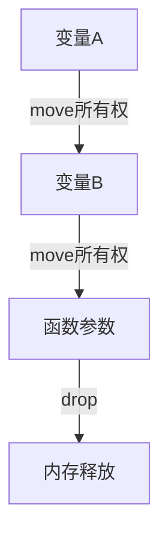
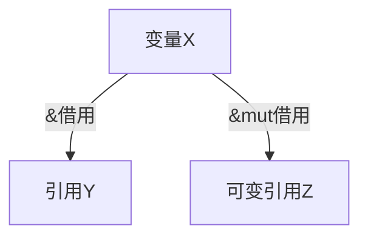
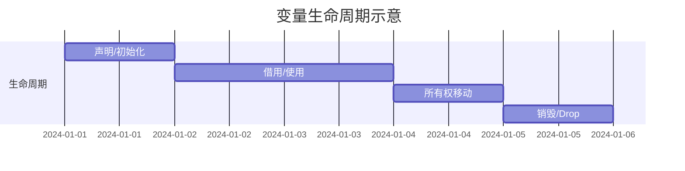

# 05. Rust变量系统的多维分析与哲学批判

## 目录

- [05. Rust变量系统的多维分析与哲学批判](#05-rust变量系统的多维分析与哲学批判)
  - [目录](#目录)
  - [1. 哲学批判性分析](#1-哲学批判性分析)
  - [2. 变量的本体论与类型系统](#2-变量的本体论与类型系统)
    - [2.1 变量的定义与本体论](#21-变量的定义与本体论)
    - [2.2 类型系统与变量的身份](#22-类型系统与变量的身份)
    - [2.3 Copy语义与所有权](#23-copy语义与所有权)
  - [3. 生命周期与作用域](#3-生命周期与作用域)
    - [3.1 块作用域、函数作用域、模块作用域](#31-块作用域函数作用域模块作用域)
    - [3.2 生命周期标注与静态分析](#32-生命周期标注与静态分析)
    - [3.3 非词法生命周期与NLL](#33-非词法生命周期与nll)
  - [4. 可变性与内部可变性](#4-可变性与内部可变性)
    - [4.1 不变性与可变性](#41-不变性与可变性)
    - [4.2 内部可变性模式](#42-内部可变性模式)
    - [4.3 可变性与并发安全](#43-可变性与并发安全)
  - [5. 所有权与借用规则](#5-所有权与借用规则)
    - [5.1 所有权原则](#51-所有权原则)
    - [5.2 借用类型与排他性](#52-借用类型与排他性)
    - [5.3 生命周期与借用检查](#53-生命周期与借用检查)
  - [6. 数据流、执行流与变量状态](#6-数据流执行流与变量状态)
    - [6.1 所有权移动的数据流图](#61-所有权移动的数据流图)
    - [6.2 借用的数据通道](#62-借用的数据通道)
    - [6.3 控制流与变量生命周期](#63-控制流与变量生命周期)
  - [7. 多表征与形式化证明](#7-多表征与形式化证明)
    - [7.1 变量生命周期流程图](#71-变量生命周期流程图)
    - [7.2 所有权移动示意图](#72-所有权移动示意图)
    - [7.3 变量系统的形式化符号](#73-变量系统的形式化符号)
  - [8. 跨范式与工程实践](#8-跨范式与工程实践)
    - [8.1 函数式、面向对象、系统编程视角](#81-函数式面向对象系统编程视角)
    - [8.2 工程最佳实践与陷阱](#82-工程最佳实践与陷阱)
  - [9. 总结与未来值值值展望](#9-总结与未来值值值展望)

---

## 1. 哲学批判性分析

Rust变量系统不仅是内存安全和并发安全的技术实现，更是现代编程语言哲学的集中体现。变量的本体论、类型系统的本质、所有权与借用的哲学基础、生命周期的形式化表达，均体现了对"资源唯一性""状态可控性""数据流与控制流统一性"的深刻思考。变量的多维度分析（本体、类型、生命周期、可变性、所有权、数据流、执行流、并发安全等）揭示了Rust设计背后的哲学追问：如何在不依赖垃圾回收的前提下，实现系统级别的安全与高效？

> **哲学思考**：变量的"所有权"是否等同于现实世界的"占有"？生命周期的形式化是否能完全规避悬垂引用？可变性与不变性的张力如何影响并发安全？这些问题不仅是技术问题，更是哲学与工程的交汇点。

---

## 2. 变量的本体论与类型系统

### 2.1 变量的定义与本体论

- 变量是类型的实例，是值的载体。
- 变量的本体论涉及"存在性"（是否有效）、"唯一性"（所有权）、"可变性"等。

### 2.2 类型系统与变量的身份

- Rust类型系统通过静态类型、类型推断、泛型等机制，约束变量的身份与行为。
- 范畴论视角下，类型为对象，变量为对象的实例，态射为变量与类型的映射。

### 2.3 Copy语义与所有权

- 实现Copy特征的变量可按位复制，非Copy类型遵循所有权移动。
- 数学符号：
  - 设 \( x: T \) 表示变量x属于类型T。
  - Copy: \( \forall x: T,\ \text{Copy}(x) \implies x' = x \land x \text{仍然有效} \)
  - Move: \( x \rightarrow y \implies x \text{无效},\ y \text{获得所有权} \)

---

## 3. 生命周期与作用域

### 3.1 块作用域、函数作用域、模块作用域

- 块作用域：由`{}`界定，变量随块进入/离开而创建/销毁。
- 函数作用域：参数、局部变量随函数调用创建/销毁。
- 模块作用域：影响可见性与命名空间。

### 3.2 生命周期标注与静态分析

- 生命周期（lifetime）是引用有效性的静态保证。
- 生命周期标注（如`'a`）用于描述引用间的依赖关系。
- 编译器通过借用检查器静态分析生命周期，防止悬垂引用。

### 3.3 非词法生命周期与NLL

- 非词法生命周期（NLL）允许引用的实际生命周期短于词法作用域，提高灵活性。

---

## 4. 可变性与内部可变性

### 4.1 不变性与可变性

- 默认不可变（`let`），可变需`mut`。
- 可变性影响执行流、数据流、并发安全。

### 4.2 内部可变性模式

- 通过`Cell<T>`、`RefCell<T>`、`Mutex<T>`等类型实现。
- 允许在不可变引用下修改内部状态，依赖运行时检查或锁机制。

### 4.3 可变性与并发安全

- 可变性与线程安全密切相关，`Send`/`Sync`标记、内部可变性类型的线程安全。

---

## 5. 所有权与借用规则

### 5.1 所有权原则

- 每个值有唯一所有者，所有权可移动（move），可复制（Copy），或借用（borrow）。

### 5.2 借用类型与排他性

- 不可变借用（&T）：可有多个，不可修改。
- 可变借用（&mut T）：同一时刻只能有一个，允许修改。
- 数学符号：
  - \( \forall x,\ \text{Borrow}(x) \implies \text{Ref}(x) \lor \text{MutRef}(x) \)
  - \( \text{MutRef}(x) \implies \nexists\ \text{Ref}(x) \land \nexists\ \text{MutRef}(x') \)

### 5.3 生命周期与借用检查

- 借用检查器在编译期静态分析所有权与借用关系，防止数据竞争与悬垂引用。

---

## 6. 数据流、执行流与变量状态

### 6.1 所有权移动的数据流图

### 6.2 借用的数据通道

### 6.3 控制流与变量生命周期

- 控制流结构体体体（if、match、loop等）影响变量的作用域与生命周期。
- 变量在分支、循环、块内的生命周期严格受控。

---

## 7. 多表征与形式化证明

### 7.1 变量生命周期流程图

### 7.2 所有权移动示意图

- 见6.1

### 7.3 变量系统的形式化符号

- 变量声明：\( \text{let}\ x: T = v \)
- 不变性：\( \neg \exists\ s,\ x = s(x) \)（不可变变量无状态变迁）
- 可变性：\( \exists\ s,\ x = s(x) \)（可变变量允许状态变迁）
- 借用规则：见5.2

---

## 8. 跨范式与工程实践

### 8.1 函数式、面向对象、系统编程视角

- 函数式：强调不变性、纯函数、数据流。
- 面向对象：封装、可变性、生命周期管理。
- 系统编程：资源控制、零成本抽象、并发安全。

### 8.2 工程最佳实践与陷阱

- 推荐：优先使用不可变变量，最小化可变性作用域。
- 谨慎使用内部可变性，避免数据竞争。
- 理解所有权移动与借用规则，防止悬垂引用。

---

## 9. 总结与未来值值值展望

Rust变量系统通过所有权、借用、生命周期、可变性等机制，实现了内存安全、并发安全和高性能。未来值值值，随着NLL、异步编程、并发模型等特征的演进，变量系统将更加灵活与强大。

---

[返回目录](#目录)

"

---

<!-- 以下为按标准模板自动补全的占位章节，待后续填充 -->
"
## 概述
(待补充，参考 STANDARD_DOCUMENT_TEMPLATE_2025.md)\n
## 技术背景
(待补充，参考 STANDARD_DOCUMENT_TEMPLATE_2025.md)\n
## 核心概念
(待补充，参考 STANDARD_DOCUMENT_TEMPLATE_2025.md)\n
## 技术实现
(待补充，参考 STANDARD_DOCUMENT_TEMPLATE_2025.md)\n
## 形式化分析
(待补充，参考 STANDARD_DOCUMENT_TEMPLATE_2025.md)\n
## 应用案例
(待补充，参考 STANDARD_DOCUMENT_TEMPLATE_2025.md)\n
## 性能分析
(待补充，参考 STANDARD_DOCUMENT_TEMPLATE_2025.md)\n
## 常见问题
(待补充，参考 STANDARD_DOCUMENT_TEMPLATE_2025.md)\n
## 未来值值展望
(待补充，参考 STANDARD_DOCUMENT_TEMPLATE_2025.md)\n

