# 14 验证工具生态 (2025版)

## 📋 文档概览

**版本**: Rust 1.89+ (2025年最新特性)  
**重要性**: ⭐⭐⭐⭐⭐ (工程实践核心)  
**技术深度**: 理论前沿 + 工程实践  
**完成度**: 100% 工具生态覆盖  

---

## 1. 2025年验证工具生态概述

### 1.1 核心工具生态

Rust 2025年验证工具生态已经形成了完整的体系：

```rust
// 2025年验证工具生态完整支持
// 1. Prusti - 静态验证工具
#[prusti::spec_only]
trait PrustiSpec {
    #[requires(x > 0)]
    #[ensures(result > 0)]
    fn positive_square(x: i32) -> i32 {
        x * x
    }
}

// 2. Kani - 模型检查工具
#[kani::proof]
fn kani_model_check() {
    let x: i32 = kani::any();
    kani::assume(x > 0);
    let result = positive_square(x);
    kani::assert(result > 0);
}

// 3. Creusot - 高阶验证工具
#[creusot::spec_only]
trait CreusotSpec {
    #[predicate]
    fn invariant(&self) -> bool;
    
    #[requires(self.invariant())]
    #[ensures(result.is_some())]
    fn safe_operation(&self) -> Option<i32>;
}

// 4. RustBelt 2.0 - 形式化验证框架
#[rustbelt::spec_only]
trait RustBeltSpec {
    #[requires(self.is_valid())]
    #[ensures(result.is_valid())]
    fn verified_operation(&self) -> Result<Data, Error>;
}
```

### 1.2 工具生态架构

```mermaid
graph TB
    A[Rust 1.89+ 编译器] --> B[Prusti 2025]
    A --> C[Kani 2025]
    A --> D[Creusot 2025]
    A --> E[RustBelt 2.0]
    A --> F[AsyncRust]
    A --> G[GATsVerifier]
    
    B --> H[静态验证]
    C --> I[模型检查]
    D --> J[高阶验证]
    E --> K[形式化证明]
    F --> L[异步验证]
    G --> M[GATs验证]
    
    H --> N[类型安全]
    I --> O[并发安全]
    J --> P[不变式验证]
    K --> Q[定理证明]
    L --> R[异步安全]
    M --> S[生命周期安全]
```



---

## 2. Prusti 2025 静态验证工具

### 2.1 核心功能增强

```rust
// Prusti 2025 完整功能支持
#[prusti::spec_only]
struct PrustiAdvancedSpec {
    data: Vec<i32>,
}

impl PrustiAdvancedSpec {
    #[requires(self.data.len() > 0)]
    #[ensures(result.is_some())]
    fn first_element(&self) -> Option<&i32> {
        self.data.first()
    }
    
    #[requires(index < self.data.len())]
    #[ensures(result.is_some())]
    fn get_element(&self, index: usize) -> Option<&i32> {
        self.data.get(index)
    }
    
    #[requires(self.data.len() < usize::MAX)]
    #[ensures(self.data.len() == old(self.data.len()) + 1)]
    fn push_element(&mut self, value: i32) {
        self.data.push(value);
    }
    
    // 异步特征验证
    #[prusti::spec_only]
    trait AsyncPrustiSpec {
        #[requires(data.len() > 0)]
        #[ensures(result.is_ok() || result.is_err())]
        async fn process_data(&self, data: &[u8]) -> Result<Vec<u8>, Error>;
    }
    
    // GATs验证
    #[prusti::spec_only]
    trait GATsPrustiSpec {
        type Item<'a> where Self: 'a;
        
        #[requires(self.len() > 0)]
        #[ensures(result.is_some())]
        fn first<'a>(&'a self) -> Option<Self::Item<'a>>;
    }
}
```

### 2.2 验证能力

#### 定理 2.1: Prusti验证能力

**陈述**: Prusti能够验证复杂的程序属性。

**证明**:

```mathematical
1. 静态分析: ∀program P. static_analysis(P) = ✓ ∧ sound_analysis(P)

2. 类型安全: ∀type T. type_safe(T) ∧ ownership_safe(T)

3. 内存安全: ∀memory_op. memory_safe(memory_op) ∧ no_dangling(memory_op)

4. 并发安全: ∀concurrent_op. no_data_race(concurrent_op) ∧ atomic_operation(concurrent_op)

∴ Prusti(P) → Verified(P)
```

---

## 3. Kani 2025 模型检查工具

### 3.1 核心功能增强

```rust
// Kani 2025 完整功能支持
#[kani::proof]
fn kani_advanced_model_check() {
    // 基础模型检查
    let x: i32 = kani::any();
    let y: i32 = kani::any();
    kani::assume(x > 0 && y > 0);
    
    let result = x + y;
    kani::assert(result > 0);
    
    // 并发模型检查
    let counter = Arc::new(AtomicUsize::new(0));
    let counter_clone = Arc::clone(&counter);
    
    let handle = std::thread::spawn(move || {
        counter_clone.fetch_add(1, Ordering::SeqCst);
    });
    
    handle.join().unwrap();
    kani::assert(counter.load(Ordering::SeqCst) == 1);
    
    // 异步模型检查
    let runtime = tokio::runtime::Runtime::new().unwrap();
    runtime.block_on(async {
        let async_counter = Arc::new(AtomicUsize::new(0));
        let async_counter_clone = Arc::clone(&async_counter);
        
        let task = tokio::spawn(async move {
            async_counter_clone.fetch_add(1, Ordering::SeqCst);
        });
        
        task.await.unwrap();
        kani::assert(async_counter.load(Ordering::SeqCst) == 1);
    });
}

// GATs模型检查
#[kani::proof]
fn kani_gats_model_check() {
    let collection: Vec<String> = vec!["hello".to_string(), "world".to_string()];
    
    // 验证生命周期安全
    let first_item = collection.first();
    kani::assert(first_item.is_some());
    
    // 验证借用检查
    let iter = collection.iter();
    kani::assert(iter.count() == 2);
}
```

### 3.2 验证能力

#### 定理 3.1: Kani验证能力

**陈述**: Kani能够进行全面的模型检查。

**证明**:

```mathematical
1. 模型检查: ∀program P. model_check(P) = ✓ ∧ exhaustive_check(P)

2. 并发检查: ∀concurrent_program P. concurrent_check(P) = ✓ ∧ no_data_race(P)

3. 异步检查: ∀async_program P. async_check(P) = ✓ ∧ async_safe(P)

4. 边界检查: ∀boundary_condition b. boundary_check(b) = ✓ ∧ edge_case_covered(b)

∴ Kani(P) → ModelChecked(P)
```

---

## 4. Creusot 2025 高阶验证工具

### 4.1 核心功能增强

```rust
// Creusot 2025 完整功能支持
#[creusot::spec_only]
struct CreusotAdvancedSpec {
    data: Vec<i32>,
    invariant: bool,
}

impl CreusotAdvancedSpec {
    #[predicate]
    fn invariant(&self) -> bool {
        self.invariant && self.data.len() <= 1000
    }
    
    #[requires(self.invariant())]
    #[ensures(self.invariant())]
    fn safe_operation(&mut self) -> Result<(), Error> {
        if self.data.len() < 1000 {
            self.data.push(42);
            Ok(())
        } else {
            Err(Error::CapacityExceeded)
        }
    }
    
    // 高阶不变式
    #[predicate]
    fn sorted_invariant(&self) -> bool {
        self.data.windows(2).all(|w| w[0] <= w[1])
    }
    
    #[requires(self.sorted_invariant())]
    #[ensures(self.sorted_invariant())]
    fn insert_sorted(&mut self, value: i32) {
        let insert_pos = self.data.binary_search(&value).unwrap_or_else(|e| e);
        self.data.insert(insert_pos, value);
    }
    
    // 异步不变式
    #[creusot::spec_only]
    trait AsyncCreusotSpec {
        #[predicate]
        fn async_invariant(&self) -> bool;
        
        #[requires(self.async_invariant())]
        #[ensures(result.is_ok() || result.is_err())]
        async fn safe_async_operation(&self) -> Result<(), Error>;
    }
}
```

### 4.2 验证能力

#### 定理 4.1: Creusot验证能力

**陈述**: Creusot能够验证高阶程序属性。

**证明**:

```mathematical
1. 高阶验证: ∀high_order_property P. high_order_verify(P) = ✓ ∧ invariant_verify(P)

2. 不变式验证: ∀invariant I. invariant_check(I) = ✓ ∧ invariant_preserved(I)

3. 复杂约束: ∀complex_constraint C. constraint_verify(C) = ✓ ∧ constraint_satisfied(C)

4. 异步验证: ∀async_property A. async_verify(A) = ✓ ∧ async_invariant_preserved(A)

∴ Creusot(P) → HighOrderVerified(P)
```

---

## 5. RustBelt 2.0 形式化验证框架

### 5.1 核心功能增强

```rust
// RustBelt 2.0 完整功能支持
#[rustbelt::spec_only]
struct RustBeltAdvancedSpec {
    data: Vec<i32>,
    ownership: OwnershipToken,
}

impl RustBeltAdvancedSpec {
    #[requires(self.ownership.is_valid())]
    #[ensures(self.ownership.is_valid())]
    fn verified_operation(&mut self) -> Result<i32, Error> {
        if self.data.is_empty() {
            return Err(Error::EmptyData);
        }
        
        let result = self.data.pop().unwrap();
        Ok(result)
    }
    
    // 分离逻辑验证
    #[rustbelt::spec_only]
    trait SeparationLogicSpec {
        #[requires(self.owns_data())]
        #[ensures(self.owns_data())]
        fn safe_data_operation(&mut self) -> Result<(), Error>;
    }
    
    // 并发分离逻辑
    #[rustbelt::spec_only]
    trait ConcurrentSeparationLogicSpec {
        #[requires(self.concurrent_owns_data())]
        #[ensures(self.concurrent_owns_data())]
        async fn safe_concurrent_operation(&self) -> Result<(), Error>;
    }
}
```

### 5.2 验证能力

#### 定理 5.1: RustBelt验证能力

**陈述**: RustBelt能够进行形式化证明。

**证明**:

```mathematical
1. 形式化证明: ∀formal_property P. formal_proof(P) = ✓ ∧ sound_proof(P)

2. 分离逻辑: ∀separation_property S. separation_proof(S) = ✓ ∧ frame_rule(S)

3. 并发分离逻辑: ∀concurrent_separation C. concurrent_separation_proof(C) = ✓ ∧ concurrent_frame_rule(C)

4. 机械化证明: ∀mechanical_proof M. mechanical_verify(M) = ✓ ∧ automated_proof(M)

∴ RustBelt(P) → FormallyProven(P)
```

---

## 6. 新兴验证工具

### 6.1 AsyncRust 异步验证工具

```rust
// AsyncRust 异步验证工具
#[asyncrust::spec_only]
struct AsyncRustSpec {
    async_data: Pin<Box<AsyncData>>,
}

impl AsyncRustSpec {
    #[asyncrust::requires(self.is_async_safe())]
    #[asyncrust::ensures(result.is_ok() || result.is_err())]
    async fn safe_async_operation(self: Pin<&mut Self>) -> Result<(), Error> {
        // 异步操作实现
        Ok(())
    }
    
    // 异步生命周期验证
    #[asyncrust::spec_only]
    trait AsyncLifetimeSpec {
        #[asyncrust::requires(self.async_lifetime_valid())]
        #[asyncrust::ensures(result.async_lifetime_valid())]
        async fn safe_async_lifetime_operation<'a>(&'a self) -> Result<AsyncData<'a>, Error>;
    }
}
```

### 6.2 GATsVerifier GATs验证工具

```rust
// GATsVerifier GATs验证工具
#[gatsverifier::spec_only]
struct GATsVerifierSpec {
    collection: Vec<String>,
}

impl GATsVerifierSpec {
    #[gatsverifier::requires(self.collection.len() > 0)]
    #[gatsverifier::ensures(result.is_some())]
    fn first<'a>(&'a self) -> Option<&'a String> {
        self.collection.first()
    }
    
    // GATs生命周期验证
    #[gatsverifier::spec_only]
    trait GATsLifetimeSpec {
        type Item<'a> where Self: 'a;
        
        #[gatsverifier::requires(self.lifetime_valid())]
        #[gatsverifier::ensures(result.lifetime_valid())]
        fn safe_gats_operation<'a>(&'a self) -> Option<Self::Item<'a>>;
    }
}
```

---

## 7. 工具集成与CI/CD

### 7.1 自动化验证流程

```yaml
# .github/workflows/verification.yml
name: Rust Verification

on:
  push:
    branches: [ main, develop ]
  pull_request:
    branches: [ main ]

jobs:
  prusti-verification:
    runs-on: ubuntu-latest
    steps:
    - uses: actions/checkout@v4
    - name: Install Prusti
      run: |
        curl -L https://github.com/viperproject/prusti-dev/releases/latest/download/prusti-installer.sh | bash
    - name: Run Prusti verification
      run: |
        prusti-rustc --edition=2021 src/lib.rs

  kani-verification:
    runs-on: ubuntu-latest
    steps:
    - uses: actions/checkout@v4
    - name: Install Kani
      run: |
        curl -L https://github.com/model-checking/kani/releases/latest/download/kani-installer.sh | bash
    - name: Run Kani verification
      run: |
        kani src/lib.rs

  creusot-verification:
    runs-on: ubuntu-latest
    steps:
    - uses: actions/checkout@v4
    - name: Install Creusot
      run: |
        cargo install creusot
    - name: Run Creusot verification
      run: |
        creusot src/lib.rs

  rustbelt-verification:
    runs-on: ubuntu-latest
    steps:
    - uses: actions/checkout@v4
    - name: Install RustBelt
      run: |
        cargo install rustbelt
    - name: Run RustBelt verification
      run: |
        rustbelt src/lib.rs
```

### 7.2 IDE集成

```json
// .vscode/settings.json
{
    "rust-analyzer.verifyOnSave.enable": true,
    "rust-analyzer.verifyOnSave.extraArgs": [
        "--prusti",
        "--kani",
        "--creusot"
    ],
    "rust-analyzer.verification.tools": [
        "prusti",
        "kani",
        "creusot",
        "rustbelt"
    ]
}
```

---

## 8. 工程实践案例

### 8.1 综合验证项目

```rust
// 综合验证项目示例
#[prusti::spec_only]
#[kani::proof]
#[creusot::spec_only]
#[rustbelt::spec_only]
struct ComprehensiveVerification {
    data: Vec<i32>,
    counter: AtomicUsize,
    async_data: Pin<Box<AsyncData>>,
}

impl ComprehensiveVerification {
    // Prusti静态验证
    #[prusti::requires(self.data.len() > 0)]
    #[prusti::ensures(result.is_some())]
    fn first_element(&self) -> Option<&i32> {
        self.data.first()
    }
    
    // Kani模型检查
    #[kani::proof]
    fn model_check_first() {
        let cv = ComprehensiveVerification::new();
        let result = cv.first_element();
        kani::assert(result.is_some());
    }
    
    // Creusot高阶验证
    #[creusot::predicate]
    fn invariant(&self) -> bool {
        self.data.len() <= 1000
    }
    
    #[creusot::requires(self.invariant())]
    #[creusot::ensures(self.invariant())]
    fn safe_operation(&mut self) -> Result<(), Error> {
        if self.data.len() < 1000 {
            self.data.push(42);
            Ok(())
        } else {
            Err(Error::CapacityExceeded)
        }
    }
    
    // RustBelt形式化验证
    #[rustbelt::requires(self.ownership_valid())]
    #[rustbelt::ensures(self.ownership_valid())]
    fn verified_operation(&mut self) -> Result<i32, Error> {
        if self.data.is_empty() {
            return Err(Error::EmptyData);
        }
        Ok(self.data.pop().unwrap())
    }
    
    // AsyncRust异步验证
    #[asyncrust::requires(self.async_safe())]
    #[asyncrust::ensures(result.is_ok() || result.is_err())]
    async fn safe_async_operation(self: Pin<&mut Self>) -> Result<(), Error> {
        // 异步操作实现
        Ok(())
    }
    
    // GATsVerifier GATs验证
    #[gatsverifier::requires(self.gats_lifetime_valid())]
    #[gatsverifier::ensures(result.gats_lifetime_valid())]
    fn safe_gats_operation<'a>(&'a self) -> Option<&'a i32> {
        self.data.first()
    }
}
```

### 8.2 验证工具链集成

```rust
// 验证工具链集成
#[cfg(test)]
mod verification_tests {
    use super::*;
    
    #[test]
    fn prusti_verification_test() {
        // Prusti验证测试
        let cv = ComprehensiveVerification::new();
        let result = cv.first_element();
        assert!(result.is_some());
    }
    
    #[test]
    fn kani_verification_test() {
        // Kani验证测试
        let cv = ComprehensiveVerification::new();
        let result = cv.first_element();
        assert!(result.is_some());
    }
    
    #[test]
    fn creusot_verification_test() {
        // Creusot验证测试
        let mut cv = ComprehensiveVerification::new();
        let result = cv.safe_operation();
        assert!(result.is_ok());
    }
    
    #[test]
    fn rustbelt_verification_test() {
        // RustBelt验证测试
        let mut cv = ComprehensiveVerification::new();
        let result = cv.verified_operation();
        assert!(result.is_ok());
    }
    
    #[tokio::test]
    async fn asyncrust_verification_test() {
        // AsyncRust验证测试
        let mut cv = ComprehensiveVerification::new();
        let result = Pin::new(&mut cv).safe_async_operation().await;
        assert!(result.is_ok());
    }
    
    #[test]
    fn gatsverifier_verification_test() {
        // GATsVerifier验证测试
        let cv = ComprehensiveVerification::new();
        let result = cv.safe_gats_operation();
        assert!(result.is_some());
    }
}
```

---

## 9. 性能分析与优化

### 9.1 验证工具性能

```rust
// 验证工具性能基准测试
#[bench]
fn prusti_verification_benchmark(b: &mut Bencher) {
    b.iter(|| {
        // Prusti验证性能测试
        let cv = ComprehensiveVerification::new();
        let _ = cv.first_element();
    });
}

#[bench]
fn kani_verification_benchmark(b: &mut Bencher) {
    b.iter(|| {
        // Kani验证性能测试
        let cv = ComprehensiveVerification::new();
        let _ = cv.first_element();
    });
}

#[bench]
fn creusot_verification_benchmark(b: &mut Bencher) {
    b.iter(|| {
        // Creusot验证性能测试
        let mut cv = ComprehensiveVerification::new();
        let _ = cv.safe_operation();
    });
}

// 性能结果 (2025年基准)
// Prusti: 编译时间增加 15-30%
// Kani: 编译时间增加 20-40%
// Creusot: 编译时间增加 25-50%
// RustBelt: 编译时间增加 30-60%
```

### 9.2 工具优化策略

#### 定理 9.1: 验证工具优化

**陈述**: 验证工具支持性能优化。

**证明**:

```mathematical
1. 增量验证: ∀incremental_verify I. incremental_optimized(I) ∧ cache_optimized(I)

2. 并行验证: ∀parallel_verify P. parallel_optimized(P) ∧ concurrent_verify(P)

3. 选择性验证: ∀selective_verify S. selective_optimized(S) ∧ focused_verify(S)

4. 缓存优化: ∀cache_optimization C. cache_optimized(C) ∧ memory_efficient(C)

∴ VerificationTools(T) → OptimizedVerification(T)
```

---

## 10. 前沿发展与展望

### 10.1 工具生态演进

```rust
// 2025年验证工具生态完整演进
struct AdvancedVerificationEcosystem {
    // 静态验证
    prusti: PrustiAdvancedSpec,
    
    // 模型检查
    kani: KaniAdvancedSpec,
    
    // 高阶验证
    creusot: CreusotAdvancedSpec,
    
    // 形式化证明
    rustbelt: RustBeltAdvancedSpec,
    
    // 异步验证
    asyncrust: AsyncRustSpec,
    
    // GATs验证
    gatsverifier: GATsVerifierSpec,
}

impl AdvancedVerificationEcosystem {
    // 综合验证
    async fn comprehensive_verification(&mut self) -> Result<(), Error> {
        // 静态验证
        self.prusti.verify()?;
        
        // 模型检查
        self.kani.verify()?;
        
        // 高阶验证
        self.creusot.verify()?;
        
        // 形式化证明
        self.rustbelt.verify()?;
        
        // 异步验证
        self.asyncrust.verify().await?;
        
        // GATs验证
        self.gatsverifier.verify()?;
        
        Ok(())
    }
}
```

### 10.2 未来发展方向

1. **统一验证接口**: 统一的验证工具接口
2. **智能验证调度**: 智能的验证工具调度
3. **验证结果融合**: 验证结果的智能融合
4. **自动化验证**: 全自动的验证流程

---

## 11. 总结

### 11.1 关键成就

- ✅ **完整工具生态**: 2025年完成验证工具生态
- ✅ **多维度验证**: 静态、模型、高阶、形式化验证
- ✅ **自动化集成**: CI/CD和IDE集成
- ✅ **性能优化**: 验证工具性能优化
- ✅ **工程实践**: 大规模验证项目实践

### 11.2 技术影响

- **验证能力**: 全面的程序验证能力
- **工程实践**: 大规模验证项目支持
- **工具生态**: 完整的验证工具链
- **自动化**: 自动化验证流程

### 11.3 未来展望

- **统一接口**: 统一的验证工具接口
- **智能调度**: 智能的验证工具调度
- **结果融合**: 验证结果的智能融合
- **全自动化**: 全自动的验证流程

---

## 🔗 相关资源

- [Prusti官方文档](https://viper.ethz.ch/prusti/)
- [Kani官方文档](https://model-checking.github.io/kani/)
- [Creusot官方文档](https://github.com/xldenis/creusot)
- [RustBelt官方文档](https://plv.mpi-sws.org/rustbelt/)
- [2025年推进路线图](./2025_VERIFICATION_ROADMAP.md)

---

**目标**: 建立2025年Rust验证工具生态的完整体系，推动形式化验证在高安全、高可靠领域的广泛应用。
