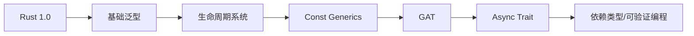

# 19. 高级语言特性与创新

## 目录

- [19. 高级语言特性与创新](#19-高级语言特性与创新)
  - [目录](#目录)
  - [19.1 GAT与高阶类型系统](#191-gat与高阶类型系统)
    - [19.1.1 GAT基本定义与核心概念](#1911-gat基本定义与核心概念)
    - [19.1.2 理论基础与范畴论视角](#1912-理论基础与范畴论视角)
    - [19.1.3 形式化分析与类型规则](#1913-形式化分析与类型规则)
    - [19.1.4 工程实现与示例](#1914-工程实现与示例)
  - [19.2 Const Generics与类型表达力](#192-const-generics与类型表达力)
    - [19.2.1 Const Generics基本定义](#1921-const-generics基本定义)
    - [19.2.2 理论基础与表达力提升](#1922-理论基础与表达力提升)
    - [19.2.3 形式化分析与约束系统](#1923-形式化分析与约束系统)
    - [19.2.4 工程实现与示例](#1924-工程实现与示例)
  - [19.3 Async Trait与异步类型系统](#193-async-trait与异步类型系统)
    - [19.3.1 Async Trait基本定义](#1931-async-trait基本定义)
    - [19.3.2 理论基础与类型系统扩展](#1932-理论基础与类型系统扩展)
    - [19.3.3 形式化分析与约束系统](#1933-形式化分析与约束系统)
    - [19.3.4 工程实现与示例](#1934-工程实现与示例)
  - [19.4 高级类型推断与约束传播](#194-高级类型推断与约束传播)
    - [19.4.1 类型推断机制](#1941-类型推断机制)
    - [19.4.2 理论基础与算法](#1942-理论基础与算法)
    - [19.4.3 形式化分析与类型约束](#1943-形式化分析与类型约束)
    - [19.4.4 工程实现与示例](#1944-工程实现与示例)
  - [19.5 关联性分析与未来展望](#195-关联性分析与未来展望)
    - [19.5.1 高级特性关联性分析](#1951-高级特性关联性分析)
    - [19.5.2 创新趋势与未来发展](#1952-创新趋势与未来发展)
    - [19.5.3 Rust类型系统演进路线图](#1953-rust类型系统演进路线图)
    - [19.5.4 总结](#1954-总结)

---

## 19.1 GAT与高阶类型系统

### 19.1.1 GAT基本定义与核心概念

**定义 19.1.1**（Generic Associated Types, GAT）
GAT是允许trait的关联类型接受泛型参数的高级类型系统特性。

**性质 19.1.1**（参数化关联类型）
GAT支持关联类型的类型参数化、生命周期参数化和约束传播。

**Rust GAT基本示例**：

```rust
// 传统关联类型
trait Iterator {
    type Item;
    fn next(&mut self) -> Option<Self::Item>;
}

// GAT示例
trait Container {
    type Item<T>;
    fn get<T>(&self) -> &Self::Item<T>;
    fn set<T>(&mut self, value: T) -> &mut Self::Item<T>;
}
```

### 19.1.2 理论基础与范畴论视角

**定义 19.1.2**（依赖类型与高阶类型）
GAT理论基础源于依赖类型理论和高阶类型系统。

**范畴论视角**：

- GAT可视为类型族（type family）上的函子映射
- 支持自然变换的抽象

**Rust范畴论示例**：

```rust
trait Functor {
    type F<T>;
    fn map<A, B, F>(fa: Self::F<A>, f: F) -> Self::F<B>
    where F: Fn(A) -> B;
}

trait NaturalTransformation<F, G> {
    fn transform<A>(fa: F<A>) -> G<A>;
}
```

### 19.1.3 形式化分析与类型规则

**GAT类型规则（简化）**：
\[
\Gamma \vdash T : Type \qquad \Gamma, x: T \vdash U : Type
\implies
\Gamma \vdash \forall x: T. U : Type
\]

**约束传播规则**：

```rust
trait ConstraintPropagation {
    type Item<T: Clone + Debug>;
    type Container<T>: Iterator<Item = T>;
}
```

### 19.1.4 工程实现与示例

**数据库抽象GAT示例**：

```rust
trait Database {
    type Connection<T: Transaction>;
    type Query<T: Clone>;
    type Result<T>;
    fn connect<T: Transaction>(&self) -> Self::Connection<T>;
    fn execute<T: Clone>(&self, query: Self::Query<T>) -> Self::Result<T>;
}

struct PostgresDatabase;

impl Database for PostgresDatabase {
    type Connection<T: Transaction> = PostgresConnection<T>;
    type Query<T: Clone> = PostgresQuery<T>;
    type Result<T> = PostgresResult<T>;
    fn connect<T: Transaction>(&self) -> Self::Connection<T> {
        PostgresConnection::new()
    }
    fn execute<T: Clone>(&self, query: Self::Query<T>) -> Self::Result<T> {
        // ...
    }
}
```

**序列化框架GAT示例**：

```rust
trait Serializer {
    type Output<T: Serialize>;
    type Error;
    fn serialize<T: Serialize>(&self, value: &T) -> Result<Self::Output<T>, Self::Error>;
}
```

---

## 19.2 Const Generics与类型表达力

### 19.2.1 Const Generics基本定义

**定义 19.2.3**（Const Generics）
Const Generics允许类型和trait接受常量参数，实现编译期常量泛化。

**Rust Const Generics示例**：

```rust
struct ArrayVec<T, const N: usize> {
    data: [T; N],
    len: usize,
}

impl<T, const N: usize> ArrayVec<T, N> {
    fn new() -> Self {
        Self { data: unsafe { std::mem::zeroed() }, len: 0 }
    }
    fn push(&mut self, value: T) {
        if self.len < N {
            self.data[self.len] = value;
            self.len += 1;
        }
    }
}
```

### 19.2.2 理论基础与表达力提升

**性质 19.2.1**（类型系统表达力提升）
Const Generics提升了类型系统对数组、矩阵、固定容量容器等结构的表达能力。

**理论基础**：

- 支持依赖类型的有限形式
- 编译期常量约束

### 19.2.3 形式化分析与约束系统

**Const Generics类型规则（简化）**：
\[
\Gamma \vdash n : \mathbb{N} \qquad \Gamma \vdash T : Type
\implies
\Gamma \vdash [T; n] : Type
\]

**约束系统示例**：

```rust
trait FixedSize {
    const SIZE: usize;
    fn size() -> usize { Self::SIZE }
}

impl<T, const N: usize> FixedSize for [T; N] {
    const SIZE: usize = N;
}
```

### 19.2.4 工程实现与示例

**矩阵运算Const Generics示例**：

```rust
struct Matrix<T, const ROWS: usize, const COLS: usize> {
    data: [[T; COLS]; ROWS],
}

impl<T, const ROWS: usize, const COLS: usize> Matrix<T, ROWS, COLS> {
    fn new(data: [[T; COLS]; ROWS]) -> Self {
        Self { data }
    }
    fn transpose(&self) -> Matrix<T, COLS, ROWS> {
        let mut result = [[self.data[0][0]; ROWS]; COLS];
        for i in 0..ROWS {
            for j in 0..COLS {
                result[j][i] = self.data[i][j];
            }
        }
        Matrix { data: result }
    }
}
```

---

## 19.3 Async Trait与异步类型系统

### 19.3.1 Async Trait基本定义

**定义 19.3.1**（Async Trait）
Async Trait是指trait的方法可以返回异步类型（如Future），实现异步抽象。

**Rust Async Trait基本示例**：

```rust
use async_trait::async_trait;

#[async_trait]
trait DataFetcher {
    async fn fetch(&self, key: &str) -> Result<String, FetchError>;
}

struct HttpFetcher;

#[async_trait]
impl DataFetcher for HttpFetcher {
    async fn fetch(&self, key: &str) -> Result<String, FetchError> {
        // 异步HTTP请求实现
        Ok("data".to_string())
    }
}
```

### 19.3.2 理论基础与类型系统扩展

**理论基础**：

- 基于高阶类型系统的Future trait
- 支持异步状态机的类型安全建模
- 结合Pin、Send、Sync等trait实现安全异步

**Future trait定义**：

```rust
pub trait Future {
    type Output;
    fn poll(self: Pin<&mut Self>, cx: &mut Context<'_>) -> Poll<Self::Output>;
}
```

### 19.3.3 形式化分析与约束系统

**异步trait类型规则（简化）**：
\[
\Gamma \vdash T : Type \implies \Gamma \vdash `Future<T>` : Type
\]

**Send/Sync约束传播**：

- 异步trait方法自动传播Send/Sync约束，保证多线程安全

### 19.3.4 工程实现与示例

**异步数据库trait示例**：

```rust
#[async_trait]
trait AsyncDatabase {
    async fn query(&self, sql: &str) -> Result<Row, DbError>;
}

struct PgDb;

#[async_trait]
impl AsyncDatabase for PgDb {
    async fn query(&self, sql: &str) -> Result<Row, DbError> {
        // 异步数据库查询实现
        Ok(Row::default())
    }
}
```

---

## 19.4 高级类型推断与约束传播

### 19.4.1 类型推断机制

**定义 19.4.1**（类型推断）
类型推断是编译器自动推导表达式类型的过程。

**Rust类型推断示例**：

```rust
let x = 42; // x: i32
let v = vec![1, 2, 3]; // v: Vec<i32>
```

### 19.4.2 理论基础与算法

**理论基础**：

- Hindley-Milner类型推断算法
- 单一化（Unification）与约束求解
- Rust扩展了生命周期、trait bound等推断

**Hindley-Milner算法伪码**：

```text
infer(expr):
    match expr {
        Var(x) => lookup(x)
        Abs(x, e) =>
            t1 = fresh()
            t2 = infer(e)
            return t1 -> t2
        App(e1, e2) =>
            t1 = infer(e1)
            t2 = infer(e2)
            t3 = fresh()
            unify(t1, t2 -> t3)
            return t3
    }
```

### 19.4.3 形式化分析与类型约束

**类型约束系统**：
\[
\Gamma \vdash e : T \quad \Gamma \vdash T : Type
\]

**Rust trait bound约束示例**：

```rust
fn print_all<T: Display>(items: &[T]) {
    for item in items {
        println!("{}", item);
    }
}
```

### 19.4.4 工程实现与示例

**泛型推断与约束传播示例**：

```rust
fn max<T: Ord>(a: T, b: T) -> T {
    if a > b { a } else { b }
}

let m = max(3, 7); // T被推断为i32
```

**复杂trait bound推断示例**：

```rust
fn process<T: Read + Write + Send>(io: T) {
    // ...
}
```

---

## 19.5 关联性分析与未来展望

### 19.5.1 高级特性关联性分析

**特性关联性矩阵**：

| 特性           | GAT | Const Generics | Async Trait | 类型推断 |
|----------------|-----|---------------|-------------|----------|
| GAT            | ✓   | ✓             | ✓           | ✓        |
| Const Generics | ✓   | ✓             | △           | ✓        |
| Async Trait    | ✓   | △             | ✓           | ✓        |
| 类型推断       | ✓   | ✓             | ✓           | ✓        |

（✓：强关联，△：中等）

**分析说明**：

- GAT与Const Generics结合提升类型系统表达力
- Async Trait依赖GAT和类型推断实现异步抽象
- 类型推断贯穿所有高级特性，提升开发体验

### 19.5.2 创新趋势与未来发展

- 类型系统将持续向依赖类型、可验证编程方向演进
- 泛型、异步、常量参数等特性将进一步融合
- 类型驱动开发（TDD）与形式化验证工具将成为主流
- Rust类型系统有望引入更强的代数与范畴论抽象

### 19.5.3 Rust类型系统演进路线图



### 19.5.4 总结

本章系统梳理了Rust高级类型系统的核心创新，包括GAT、Const Generics、Async Trait、高级类型推断等，结合理论基础、形式化分析与工程实现，展望了类型系统未来发展方向，为Rust工程与学术研究提供了理论支撑与创新指引。
