# 从数据处理视角分析系统边界：形式化方法与多维度解析

## 目录

- [从数据处理视角分析系统边界：形式化方法与多维度解析](#从数据处理视角分析系统边界形式化方法与多维度解析)
  - [目录](#目录)
  - [引言：系统边界的多维度理解](#引言系统边界的多维度理解)
  - [形式化论证与系统边界](#形式化论证与系统边界)
    - [基本概念与定义](#基本概念与定义)
    - [形式化证明方法](#形式化证明方法)
    - [代数数据类型与边界表示](#代数数据类型与边界表示)
  - [元模型与模型层次](#元模型与模型层次)
    - [元模型的角色](#元模型的角色)
    - [模型转换与边界穿越](#模型转换与边界穿越)
    - [多级模型架构](#多级模型架构)
  - [边界类型的多层次分析](#边界类型的多层次分析)
    - [分层架构中的边界](#分层架构中的边界)
    - [维度交叉的边界区域](#维度交叉的边界区域)
    - [领域驱动设计中的边界](#领域驱动设计中的边界)
  - [数据处理与边界转换](#数据处理与边界转换)
    - [数据流转换模式](#数据流转换模式)
    - [边界通信协议](#边界通信协议)
    - [边界一致性保障](#边界一致性保障)
  - [静态分析与动态分析](#静态分析与动态分析)
    - [静态边界分析方法](#静态边界分析方法)
    - [动态边界监控技术](#动态边界监控技术)
    - [形式化验证与边界安全](#形式化验证与边界安全)
  - [Rust中的系统边界实现](#rust中的系统边界实现)
    - [所有权与借用作为边界机制](#所有权与借用作为边界机制)
    - [类型系统与边界保障](#类型系统与边界保障)
    - [代码示例：多维边界管理](#代码示例多维边界管理)
  - [边界设计的哲学思考](#边界设计的哲学思考)
    - [边界的必要性与局限性](#边界的必要性与局限性)
    - [形式与功能的平衡](#形式与功能的平衡)
  - [结论与展望](#结论与展望)
  - [思维导图](#思维导图)

## 引言：系统边界的多维度理解

系统边界是软件与系统工程中的基础概念，它定义了不同组件、层次、维度和领域之间的分界线。
从数据处理的视角来看，系统边界不仅是物理或逻辑上的分割，更是数据流转、转换和交互的关键节点。
本文将从形式化方法出发，结合Rust语言的特性，全面分析系统边界在不同层面的表现形式及其理论基础。

在复杂系统中，边界不再是单一的、线性的概念，而是呈现多维度、多层次的复杂网络结构。
理解这种复杂性，需要我们从形式理论、元模型、静态/动态分析等多个角度进行审视和解析。

## 形式化论证与系统边界

### 基本概念与定义

从形式化的角度，我们可以将系统边界定义为一种关系结构：

```math
定义1：系统边界 B 是一个三元组 B = (S₁, S₂, R)，其中：
- S₁ 和 S₂ 是两个不同的系统或子系统
- R 是从 S₁ 到 S₂ 的关系集合，描述数据和控制如何在系统间传递
```

边界的形式化描述有助于我们精确理解系统的分割与交互模式。
在范畴论的视角下，我们可以将系统看作对象，将边界交互看作态射：

```haskell
class SystemBoundary b where
  -- 边界定义
  data Boundary
  data Interface
  
  -- 边界操作
  expose :: Component → Boundary → Interface
  connect :: Interface → Interface → Connection
  hide :: Component → Boundary → Component
  
  -- 边界特性
  encapsulation :: Component → EncapsulationDegree
  information_hiding :: Component → InformationHidingLevel
```

### 形式化证明方法

系统边界的正确性可以通过形式化方法进行验证和证明。
常用的形式化证明方法包括：

1. **模型检查**：验证系统在所有可能状态下都满足边界的不变性
2. **定理证明**：使用逻辑推导验证边界的数学性质
3. **类型理论**：通过类型系统保障边界的安全性和完整性

证明示例：边界的完整性定理

```math
定理：如果系统 S 的所有边界 B₁, B₂, ..., Bₙ 都满足完整性条件 C，
      则系统 S 的任何状态转换都不会违反系统不变量 I。

证明：
1. 假设存在状态转换 T 违反了系统不变量 I
2. 此转换 T 必须通过某个边界 Bᵢ 影响系统状态
3. 由边界 Bᵢ 的完整性条件 C 可知，任何通过 Bᵢ 的转换都保持 I
4. 这与假设矛盾
5. 因此，不存在违反系统不变量的状态转换
```

### 代数数据类型与边界表示

在函数式编程范式中，我们可以使用代数数据类型（ADT）来形式化表示系统边界：

```rust
// 系统组件类型
enum Component {
    Core(CoreComponent),
    Service(ServiceComponent),
    Interface(InterfaceComponent),
    Adapter(AdapterComponent),
}

// 边界类型
enum Boundary {
    Layer(LayerBoundary),     // 层次边界
    Domain(DomainBoundary),   // 领域边界
    Dimension(DimensionBoundary), // 维度边界
    Physical(PhysicalBoundary),   // 物理边界
}

// 边界交互通道
struct Channel<T> {
    source: Component,
    target: Component,
    protocol: Protocol,
    data_type: PhantomData<T>,
}

// 边界协议
enum Protocol {
    Synchronous(SyncProtocol),
    Asynchronous(AsyncProtocol),
    MessageBased(MessageProtocol),
    StreamBased(StreamProtocol),
}
```

这种形式化表示有助于在设计阶段发现边界设计中的潜在问题，并提供严格的理论基础。

## 元模型与模型层次

### 元模型的角色

元模型是描述模型的模型，在系统边界分析中具有关键作用。
元模型定义了如何表示和操作边界，为不同层次和领域的边界提供统一的描述框架。

```rust
// 元模型定义
struct MetaModel {
    // 边界元素类型定义
    boundary_types: Vec<BoundaryTypeDefinition>,
    // 交互模式定义
    interaction_patterns: Vec<InteractionPatternDefinition>,
    // 验证规则定义
    validation_rules: Vec<ValidationRuleDefinition>,
    // 转换规则定义
    transformation_rules: Vec<TransformationRuleDefinition>,
}

// 具体模型是元模型的实例
struct ConcreteModel {
    meta_model: MetaModel,
    boundary_instances: Vec<BoundaryInstance>,
    interaction_instances: Vec<InteractionInstance>,
}
```

### 模型转换与边界穿越

当数据穿越系统边界时，往往需要进行模型转换。
这种转换可以形式化为从源模型到目标模型的映射函数：

```rust
trait ModelTransformer<S, T> {
    // 模型转换函数
    fn transform(&self, source: &S) -> Result<T, TransformError>;
    
    // 验证转换的正确性
    fn validate_transformation(&self, source: &S, target: &T) -> bool;
    
    // 获取转换的元数据
    fn get_transformation_metadata(&self) -> TransformationMetadata;
}

// 边界转换器示例
struct BoundaryTransformer<S, T> {
    source_domain: DomainDescriptor,
    target_domain: DomainDescriptor,
    transformation_rules: Vec<TransformationRule<S, T>>,
}

impl<S, T> ModelTransformer<S, T> for BoundaryTransformer<S, T> {
    fn transform(&self, source: &S) -> Result<T, TransformError> {
        // 应用转换规则从S转换到T
        // ...
    }
    
    // ...其他方法实现
}
```

### 多级模型架构

在复杂系统中，边界通常存在于多层模型架构中，从高度抽象的概念模型到具体的实现模型：

```math
1. 元模型层：定义边界的基本概念和表示方法
2. 概念模型层：描述系统的领域概念和逻辑组织
3. 逻辑模型层：设计系统的模块结构和交互方式
4. 物理模型层：规划系统的部署架构和资源分配
5. 实现模型层：编码和配置的具体实现细节
```

每一层之间存在着映射关系，上层模型为下层模型提供指导，下层模型则是上层模型的具体化。

## 边界类型的多层次分析

### 分层架构中的边界

分层架构是系统设计中最常见的模式之一，每一层都有明确的职责和边界：

```rust
// 分层架构的边界定义
enum LayerType {
    Presentation,    // 表现层
    Application,     // 应用层
    Domain,          // 领域层
    Infrastructure,  // 基础设施层
}

struct LayerBoundary {
    source_layer: LayerType,
    target_layer: LayerType,
    allowed_dependencies: DependencyRule,
    data_transformation_rules: Vec<TransformationRule>,
}

// 层间依赖规则
enum DependencyRule {
    Strict,              // 只允许相邻层依赖
    SkipLayer,           // 允许跳过一层依赖
    DependencyInversion, // 依赖倒置原则
    Arbitrary,           // 任意依赖（不推荐）
}
```

分层架构中的边界关注点主要包括：

- 层间通信的规范化接口
- 依赖规则的明确定义
- 层间数据转换的标准化

### 维度交叉的边界区域

系统往往存在多个维度，这些维度的交叉形成了复杂的边界区域：

```rust
// 系统维度类型
enum DimensionType {
    Quantitative,    // 量化维度
    Temporal,        // 时序维度
    State,           // 状态维度
    Control,         // 控制维度
    Spatial,         // 空间维度
    Quality,         // 质量维度
}

// 维度交叉区域
struct DimensionCrossing {
    dimensions: Vec<DimensionType>,
    crossing_concerns: Vec<CrossingConcern>,
    balance_strategies: Vec<BalanceStrategy>,
}

// 交叉关注点
struct CrossingConcern {
    name: String,
    affected_dimensions: Vec<DimensionType>,
    tradeoffs: Vec<Tradeoff>,
}
```

维度交叉区域的关键特性：

- 权衡多个维度的需求和约束
- 处理维度间可能存在的冲突
- 优化维度交叉区域的整体性能

### 领域驱动设计中的边界

领域驱动设计（DDD）中的限界上下文（Bounded Context）是一种重要的边界类型：

```rust
// 限界上下文
struct BoundedContext {
    name: String,
    domain_model: DomainModel,
    ubiquitous_language: UbiquitousLanguage,
    context_map: ContextMap,
}

// 上下文映射关系
enum ContextRelationship {
    SharedKernel,        // 共享内核
    CustomerSupplier,    // 客户-供应商
    Conformist,          // 遵从者
    AnticorruptionLayer, // 防腐层
    OpenHostService,     // 开放主机服务
    PublishedLanguage,   // 发布语言
    SeparateWays,        // 各行其道
}

// 上下文映射
struct ContextMapping {
    source_context: BoundedContext,
    target_context: BoundedContext,
    relationship: ContextRelationship,
    integration_strategy: IntegrationStrategy,
}
```

领域边界的特点：

- 基于业务概念和语言的自然分割
- 明确定义上下文间的集成模式
- 保护模型完整性的防腐机制

## 数据处理与边界转换

### 数据流转换模式

数据在穿越系统边界时需要进行转换，常见的转换模式包括：

```rust
// 数据转换模式
enum DataTransformationPattern {
    Mapping,             // 直接映射
    Enrichment,          // 数据充实
    Filtering,           // 数据过滤
    Aggregation,         // 数据聚合
    Splitting,           // 数据分割
    Protocol,            // 协议转换
    Format,              // 格式转换
    Semantic,            // 语义转换
}

// 数据转换器
struct DataTransformer<S, T> {
    pattern: DataTransformationPattern,
    transformation_rules: Vec<TransformationRule<S, T>>,
    validation_rules: Vec<ValidationRule<T>>,
}

impl<S, T> DataTransformer<S, T> {
    // 执行转换
    fn transform(&self, source: S) -> Result<T, TransformError> {
        // 实现转换逻辑
        // ...
    }
}
```

### 边界通信协议

边界处的通信协议定义了不同组件或系统间如何交换数据：

```rust
// 通信协议类型
enum CommunicationProtocol {
    RestApi(RestApiSpec),
    GraphQL(GraphQLSchema),
    Grpc(GrpcServiceDefinition),
    MessageQueue(MessageQueueConfig),
    EventBus(EventBusConfig),
    SharedMemory(SharedMemoryConfig),
    FileSystem(FileSystemProtocol),
}

// 协议适配器
struct ProtocolAdapter<S, T> {
    source_protocol: CommunicationProtocol,
    target_protocol: CommunicationProtocol,
    adapter_strategy: AdapterStrategy,
}

impl<S, T> ProtocolAdapter<S, T> {
    // 协议转换
    fn adapt(&self, source_message: S) -> Result<T, AdaptError> {
        // 实现协议适配逻辑
        // ...
    }
}
```

### 边界一致性保障

保证边界处数据的一致性是系统设计的关键挑战：

```rust
// 一致性策略
enum ConsistencyStrategy {
    StrongConsistency,   // 强一致性
    EventualConsistency, // 最终一致性
    CausalConsistency,   // 因果一致性
    SessionConsistency,  // 会话一致性
}

// 一致性管理器
struct ConsistencyManager {
    strategy: ConsistencyStrategy,
    verification_mechanisms: Vec<VerificationMechanism>,
    reconciliation_strategies: Vec<ReconciliationStrategy>,
}

impl ConsistencyManager {
    // 验证一致性
    fn verify_consistency(&self, state_a: &State, state_b: &State) -> ConsistencyResult {
        // 实现一致性验证
        // ...
    }
    
    // 数据调和
    fn reconcile(&self, states: Vec<State>) -> Result<State, ReconciliationError> {
        // 实现数据调和
        // ...
    }
}
```

## 静态分析与动态分析

### 静态边界分析方法

静态分析通过分析源代码和设计文档来识别和验证系统边界：

```rust
// 静态边界分析器
struct StaticBoundaryAnalyzer {
    code_analyzers: Vec<CodeAnalyzer>,
    model_analyzers: Vec<ModelAnalyzer>,
    boundary_rules: Vec<BoundaryRule>,
}

impl StaticBoundaryAnalyzer {
    // 执行静态分析
    fn analyze(&self, codebase: &Codebase, models: &[Model]) -> AnalysisReport {
        // 分析代码中的边界
        let code_findings = self.analyze_code(codebase);
        
        // 分析模型中的边界
        let model_findings = self.analyze_models(models);
        
        // 整合发现并生成报告
        self.generate_report(code_findings, model_findings)
    }
    
    // 分析代码
    fn analyze_code(&self, codebase: &Codebase) -> Vec<CodeFinding> {
        // ...
    }
    
    // 分析模型
    fn analyze_models(&self, models: &[Model]) -> Vec<ModelFinding> {
        // ...
    }
    
    // 生成报告
    fn generate_report(&self, code_findings: Vec<CodeFinding>, model_findings: Vec<ModelFinding>) -> AnalysisReport {
        // ...
    }
}
```

静态分析工具可以检测：

- 边界定义的一致性
- 边界违规的依赖
- 潜在的边界漏洞

### 动态边界监控技术

动态分析通过运行时监控来观察和验证系统边界的行为：

```rust
// 动态边界监控器
struct DynamicBoundaryMonitor {
    probes: Vec<BoundaryProbe>,
    data_collectors: Vec<DataCollector>,
    analyzers: Vec<RuntimeAnalyzer>,
    alerting_system: AlertingSystem,
}

impl DynamicBoundaryMonitor {
    // 启动监控
    fn start_monitoring(&self) -> MonitoringSession {
        // 部署探针
        self.deploy_probes();
        
        // 配置数据收集
        self.configure_collectors();
        
        // 创建监控会话
        MonitoringSession::new()
    }
    
    // 分析运行时边界行为
    fn analyze_boundary_behavior(&self, session: &MonitoringSession) -> BehaviorAnalysis {
        // 收集数据
        let data = self.collect_data(session);
        
        // 分析数据
        self.analyze_data(data)
    }
    
    // 部署探针
    fn deploy_probes(&self) {
        // ...
    }
    
    // 配置收集器
    fn configure_collectors(&self) {
        // ...
    }
    
    // 收集数据
    fn collect_data(&self, session: &MonitoringSession) -> BoundaryData {
        // ...
    }
    
    // 分析数据
    fn analyze_data(&self, data: BoundaryData) -> BehaviorAnalysis {
        // ...
    }
}
```

动态监控能够捕获：

- 边界处的性能瓶颈
- 运行时边界违规情况
- 边界行为的异常模式

### 形式化验证与边界安全

通过形式化方法验证边界的安全性和正确性：

```rust
// 形式化验证器
struct FormalVerifier {
    formal_models: Vec<FormalModel>,
    properties: Vec<Property>,
    verification_techniques: Vec<VerificationTechnique>,
}

impl FormalVerifier {
    // 执行形式化验证
    fn verify(&self) -> VerificationResult {
        // 为每个模型验证属性
        let results = self.formal_models.iter()
            .flat_map(|model| {
                self.properties.iter()
                    .map(|property| self.verify_property(model, property))
                    .collect::<Vec<PropertyVerificationResult>>()
            })
            .collect();
        
        // 综合结果
        VerificationResult { property_results: results }
    }
    
    // 验证单个属性
    fn verify_property(&self, model: &FormalModel, property: &Property) -> PropertyVerificationResult {
        // 选择适当的验证技术
        let technique = self.select_verification_technique(model, property);
        
        // 执行验证
        technique.verify(model, property)
    }
    
    // 选择验证技术
    fn select_verification_technique(&self, model: &FormalModel, property: &Property) -> &VerificationTechnique {
        // ...
    }
}
```

形式化验证能够证明：

- 边界的不变性保持
- 跨边界通信的安全性
- 系统在边界处的稳定性

## Rust中的系统边界实现

### 所有权与借用作为边界机制

Rust的所有权和借用系统可以看作是语言层面的边界机制：

```rust
// 所有权边界示例
struct ResourceOwner {
    resource: Resource,
}

impl ResourceOwner {
    // 转移所有权（跨越边界）
    fn transfer_ownership(self) -> Resource {
        self.resource
    }
    
    // 借用（临时边界穿越）
    fn borrow_resource(&self) -> &Resource {
        &self.resource
    }
    
    // 可变借用（临时边界穿越，带权限）
    fn borrow_resource_mut(&mut self) -> &mut Resource {
        &mut self.resource
    }
}

// 使用方
fn usage_example() {
    let owner = ResourceOwner { resource: Resource::new() };
    
    // 不可变借用（读取权限）
    let resource_ref = owner.borrow_resource();
    
    // 可变借用（修改权限）
    let mut owner_mut = owner;
    let resource_mut_ref = owner_mut.borrow_resource_mut();
    
    // 所有权转移（完全控制权）
    let resource = owner_mut.transfer_ownership();
}
```

所有权系统建立的边界特点：

- 明确的资源归属和生命周期
- 严格的访问权限控制
- 编译时验证的边界安全

### 类型系统与边界保障

Rust的类型系统提供了强大的边界保障机制：

```rust
// 类型边界示例
trait BoundaryProtocol {
    type InputData;
    type OutputData;
    
    fn process(&self, input: Self::InputData) -> Self::OutputData;
}

// 层边界实现
struct LayerBoundaryImpl<I, O> {
    transformer: Box<dyn Fn(I) -> O>,
}

impl<I, O> BoundaryProtocol for LayerBoundaryImpl<I, O> {
    type InputData = I;
    type OutputData = O;
    
    fn process(&self, input: Self::InputData) -> Self::OutputData {
        (self.transformer)(input)
    }
}

// 类型安全的边界穿越
fn cross_boundary<B: BoundaryProtocol>(
    boundary: &B,
    data: B::InputData
) -> B::OutputData {
    boundary.process(data)
}
```

类型系统保障的边界特性：

- 静态类型检查防止非法边界穿越
- 泛型和trait约束确保边界协议兼容
- 类型状态模式实现状态安全的边界转换

### 代码示例：多维边界管理

下面是一个综合示例，展示如何在Rust中实现一个多维边界管理系统：

```rust
// 定义边界类型
enum BoundaryKind {
    Layer,      // 分层边界
    Domain,     // 领域边界
    Process,    // 进程边界
    Thread,     // 线程边界
}

// 边界定义
struct Boundary<I, O> {
    kind: BoundaryKind,
    name: String,
    transformer: Box<dyn Fn(I) -> Result<O, BoundaryError>>,
    validator: Box<dyn Fn(&I) -> bool>,
}

impl<I, O> Boundary<I, O> {
    // 创建新边界
    fn new(
        kind: BoundaryKind,
        name: String,
        transformer: Box<dyn Fn(I) -> Result<O, BoundaryError>>,
        validator: Box<dyn Fn(&I) -> bool>,
    ) -> Self {
        Self { kind, name, transformer, validator }
    }
    
    // 穿越边界
    fn cross(&self, input: I) -> Result<O, BoundaryError> {
        // 首先验证输入是否有效
        if !(self.validator)(&input) {
            return Err(BoundaryError::ValidationFailed);
        }
        
        // 执行转换
        (self.transformer)(input)
    }
}

// 边界管理器
struct BoundaryManager {
    boundaries: HashMap<String, Box<dyn Any>>,
}

impl BoundaryManager {
    // 创建新管理器
    fn new() -> Self {
        Self { boundaries: HashMap::new() }
    }
    
    // 注册边界
    fn register<I: 'static, O: 'static>(&mut self, boundary: Boundary<I, O>) {
        self.boundaries.insert(boundary.name.clone(), Box::new(boundary));
    }
    
    // 获取边界
    fn get<I: 'static, O: 'static>(&self, name: &str) -> Option<&Boundary<I, O>> {
        self.boundaries.get(name)
            .and_then(|b| b.downcast_ref::<Boundary<I, O>>())
    }
    
    // 穿越边界
    fn cross<I: 'static, O: 'static>(&self, name: &str, input: I) -> Result<O, BoundaryError> {
        match self.get::<I, O>(name) {
            Some(boundary) => boundary.cross(input),
            None => Err(BoundaryError::BoundaryNotFound),
        }
    }
}

// 错误类型
enum BoundaryError {
    ValidationFailed,
    TransformationFailed,
    BoundaryNotFound,
}

// 使用示例
fn main() {
    // 创建边界管理器
    let mut manager = BoundaryManager::new();
    
    // 注册层边界
    let presentation_to_application = Boundary::new(
        BoundaryKind::Layer,
        "presentation_to_application".to_string(),
        Box::new(|dto: UserDTO| -> Result<UserCommand, BoundaryError> {
            // 转换逻辑
            Ok(UserCommand {
                user_id: dto.id,
                action: dto.action_type.parse().map_err(|_| BoundaryError::TransformationFailed)?,
            })
        }),
        Box::new(|dto: &UserDTO| {
            // 验证逻辑
            !dto.id.is_empty() && !dto.action_type.is_empty()
        }),
    );
    
    manager.register(presentation_to_application);
    
    // 注册领域边界
    let user_to_payment = Boundary::new(
        BoundaryKind::Domain,
        "user_to_payment".to_string(),
        Box::new(|user: User| -> Result<PaymentRequest, BoundaryError> {
            // 领域转换逻辑
            Ok(PaymentRequest {
                user_id: user.id,
                amount: user.balance,
            })
        }),
        Box::new(|user: &User| {
            // 领域验证逻辑
            user.status == UserStatus::Active
        }),
    );
    
    manager.register(user_to_payment);
    
    // 使用边界穿越
    let user_dto = UserDTO {
        id: "user123".to_string(),
        action_type: "PAYMENT".to_string(),
    };
    
    // 穿越表示层到应用层边界
    let user_command = manager.cross::<UserDTO, UserCommand>(
        "presentation_to_application", 
        user_dto
    ).expect("边界穿越失败");
    
    // 获取用户数据（模拟）
    let user = User {
        id: user_command.user_id,
        balance: 100.0,
        status: UserStatus::Active,
    };
    
    // 穿越用户领域到支付领域边界
    let payment_request = manager.cross::<User, PaymentRequest>(
        "user_to_payment", 
        user
    ).expect("领域边界穿越失败");
    
    println!("支付请求已创建: 用户 {}, 金额 {}", 
             payment_request.user_id, 
             payment_request.amount);
}

// 数据类型定义
struct UserDTO {
    id: String,
    action_type: String,
}

struct UserCommand {
    user_id: String,
    action: UserAction,
}

enum UserAction {
    Payment,
    Profile,
    Order,
}

impl std::str::FromStr for UserAction {
    type Err = ();
    
    fn from_str(s: &str) -> Result<Self, Self::Err> {
        match s.to_uppercase().as_str() {
            "PAYMENT" => Ok(UserAction::Payment),
            "PROFILE" => Ok(UserAction::Profile),
            "ORDER" => Ok(UserAction::Order),
            _ => Err(()),
        }
    }
}

struct User {
    id: String,
    balance: f64,
    status: UserStatus,
}

enum UserStatus {
    Active,
    Inactive,
    Suspended,
}

struct PaymentRequest {
    user_id: String,
    amount: f64,
}
```

这个示例展示了如何使用Rust实现一个灵活的边界管理系统，支持不同类型的边界定义和安全的边界穿越。
它结合了Rust的类型系统、所有权机制和错误处理，确保边界操作的安全性和正确性。

## 边界设计的哲学思考

### 边界的必要性与局限性

系统边界既是必要的，也有其内在限制：

**边界的必要性**：

1. **复杂性管理**：边界将系统分割成可管理的部分，降低整体复杂度
2. **关注点分离**：边界帮助分离不同的关注点，使各部分专注于特定职责
3. **安全保障**：边界限制了错误和攻击的传播范围，提高系统整体安全性
4. **演化支持**：边界允许系统的不同部分以不同速率独立演化

**边界的局限性**：

1. **通信开销**：边界增加了组件间通信的复杂性和性能开销
2. **一致性挑战**：跨边界维护数据一致性是一个复杂问题
3. **设计复杂性**：边界设计本身是一项复杂工作，需要平衡多种因素
4. **认知负担**：理解和维护复杂的边界系统增加了开发者的认知负担

### 形式与功能的平衡

边界设计需要权衡形式化严谨性和实用功能性：

1. **形式化的价值**：
   - 提供严格的理论基础和证明方法
   - 确保边界设计的一致性和可验证性
   - 支持自动化分析和验证

2. **功能性的需求**：
   - 满足业务和技术要求
   - 适应变化和演化
   - 支持开发效率和可维护性

3. **平衡策略**：
   - 在关键边界应用严格的形式化方法
   - 在演化频繁的区域保持灵活性
   - 使用自动化工具降低形式化的成本
   - 建立清晰的边界设计原则和模式库

## 结论与展望

系统边界是软件和系统设计中的核心概念，从数据处理的视角来看，
它不仅是组件和系统的分界线，更是数据流转换和交互的关键节点。
通过形式化方法和多维度分析，我们可以更深入地理解系统边界的本质和作用。

关键发现：

1. 系统边界存在于多个层次、维度和领域中，形成了一个复杂的网络结构
2. 形式化方法提供了严谨的边界定义、验证和证明机制
3. 元模型和模型转换是理解和管理边界的重要工具
4. 静态和动态分析提供了互补的边界验证方法
5. Rust语言的所有权和类型系统为实现安全边界提供了强大支持

未来的研究方向：

1. 自适应边界：能够根据运行时条件动态调整边界特性
2. 智能边界分析：使用机器学习优化边界设计和管理
3. 形式化与实用性的更好结合：开发更易用的形式化边界设计工具
4. 跨领域边界模式：探索在不同领域间通用的边界设计模式

系统边界的设计和管理将继续是软件工程和系统设计中的重要课题，
随着系统复杂性的增加和分布式架构的普及，对边界的深入理解和有效管理将变得越来越重要。

## 思维导图

```mermaid
graph TD
    A[系统边界多维视角] --> B[形式化论证与证明]
    A --> C[元模型与模型层次]
    A --> D[边界类型分析]
    A --> E[数据处理与转换]
    A --> F[静态与动态分析]
    A --> G[Rust实现]
    A --> H[哲学思考]
    
    B --> B1[基本概念与定义]
    B --> B2[形式化证明方法]
    B --> B3[代数数据类型表示]
    
    C --> C1[元模型角色]
    C --> C2[模型转换]
    C --> C3[多级模型架构]
    
    D --> D1[分层架构边界]
    D --> D2[维度交叉边界]
    D --> D3[领域驱动边界]
    
    E --> E1[数据流转换模式]
    E --> E2[边界通信协议]
    E --> E3[边界一致性]
    
    F --> F1[静态边界分析]
    F --> F2[动态边界监控]
    F --> F3[形式化验证]
    
    G --> G1[所有权与借用]
    G --> G2[类型系统保障]
    G --> G3[多维边界代码]
    
    H --> H1[必要性与局限性]
    H --> H2[形式与功能平衡]
    
    B1 --> B11[三元组定义]
    B1 --> B12[范畴论视角]
    
    B2 --> B21[模型检查]
    B2 --> B22[定理证明]
    B2 --> B23[类型理论]
    
    C1 --> C11[元模型定义]
    C1 --> C12[边界元素规范]
    
    C2 --> C21[映射函数]
    C2 --> C22[验证机制]
    
    D1 --> D11[层间依赖]
    D1 --> D12[层间转换]
    
    D2 --> D21[维度交叉区]
    D2 --> D22[权衡策略]
    
    D3 --> D31[限界上下文]
    D3 --> D32[上下文映射]
    
    E1 --> E11[转换模式类型]
    E1 --> E12[转换器实现]
    
    E2 --> E21[协议类型]
    E2 --> E22[适配器]
    
    E3 --> E31[一致性策略]
    E3 --> E32[一致性验证]
    
    F1 --> F11[代码分析]
    F1 --> F12[设计分析]
    
    F2 --> F21[运行时监控]
    F2 --> F22[异常检测]
    
    G1 --> G11[资源边界]
    G1 --> G12[访问控制]
    
    G2 --> G21[类型安全]
    G2 --> G22[Trait边界]
    
    G3 --> G31[边界管理器]
    G3 --> G32[边界穿越]
    
    H1 --> H11[边界价值]
    H1 --> H12[边界成本]
    
    H2 --> H21[形式化价值]
    H2 --> H22[实用需求]
```



通过这个思维导图，我们可以清晰地看到系统边界在不同维度和层次的结构与关联。
从形式化的基础理论，到具体的实现技术，再到哲学层面的思考，
形成了一个完整的知识体系，帮助我们更全面地理解和应用系统边界的概念。
