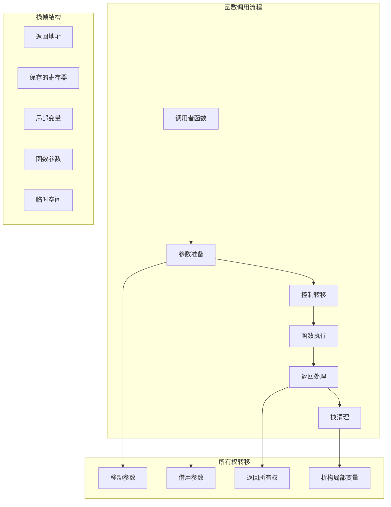

# 2.2.1 Rust函数调用语义深度分析

**文档版本**: V1.0  
**创建日期**: 2025-01-27  
**所属层**: 控制语义层 (Control Semantics Layer)  
**学术等级**: 专家级 (Expert Level)  
**交叉引用**: [1.1.4 所有权转移语义](04_ownership_transfer_semantics.md), [2.3 生命周期语义](../02_control_semantics/03_lifetime_semantics/01_lifetime_analysis_semantics.md)

---

## 2.2.1.1 函数调用理论基础

### 2.2.1.1.1 函数调用的操作语义

**定义 2.2.1.1** (函数调用语义)
函数调用 $f(a_1, \ldots, a_n)$ 的操作语义定义为：
$$\frac{\Gamma \vdash f : T_1 \times \ldots \times T_n \to T \quad \Gamma \vdash a_i : T_i \text{ for all } i}{\Gamma \vdash f(a_1, \ldots, a_n) : T}$$

**定义 2.2.1.2** (调用栈语义)
调用栈 $S$ 是栈帧的序列：
$$S = [F_1, F_2, \ldots, F_n]$$
其中每个栈帧 $F_i = \langle \text{locals}, \text{args}, \text{ret\_addr} \rangle$



### 2.2.1.1.2 调用约定的数学建模

**定义 2.2.1.3** (调用约定)
调用约定 $\mathcal{CC}$ 定义参数传递规则：
$$\mathcal{CC} : \text{FunctionSignature} \to \text{RegisterAllocation} \times \text{StackLayout}$$

```rust
// 调用约定示例分析
use std::arch::asm;

// 不同调用约定的语义差异
extern "C" fn c_calling_convention(a: i32, b: i32) -> i32 {
    a + b  // C调用约定：参数通过寄存器或栈传递
}

extern "Rust" fn rust_calling_convention(a: i32, b: i32) -> i32 {
    a + b  // Rust调用约定：编译器优化的参数传递
}

// 内联函数的零成本抽象
#[inline(always)]
fn inlined_function(x: i32) -> i32 {
    x * 2 + 1  // 内联后无函数调用开销
}

#[inline(never)]
fn non_inlined_function(x: i32) -> i32 {
    x * 2 + 1  // 强制函数调用
}

// 函数调用性能分析
fn benchmark_call_overhead() {
    use std::time::Instant;
    
    let iterations = 10_000_000;
    let test_value = 42;
    
    // 内联函数调用
    let start = Instant::now();
    let mut sum = 0;
    for _ in 0..iterations {
        sum += inlined_function(test_value);
    }
    let inline_time = start.elapsed();
    
    // 非内联函数调用
    let start = Instant::now();
    let mut sum2 = 0;
    for _ in 0..iterations {
        sum2 += non_inlined_function(test_value);
    }
    let non_inline_time = start.elapsed();
    
    println!("内联调用时间: {:?}", inline_time);
    println!("函数调用时间: {:?}", non_inline_time);
    println!("调用开销: {:.2}x", non_inline_time.as_nanos() as f64 / inline_time.as_nanos() as f64);
    
    // 验证结果等价性
    assert_eq!(sum, sum2);
}
```

---

## 2.2.1.2 参数传递语义

### 2.2.1.2.1 按值传递vs按引用传递

**定理 2.2.1.1** (参数传递语义等价性)
对于函数 $f(x: T)$：

- 如果 $T : \text{Copy}$，则按值传递等价于按引用传递后解引用
- 如果 $T : !\text{Copy}$，则按值传递触发移动语义

```rust
// 参数传递语义分析
use std::rc::Rc;

// Copy类型的参数传递
#[derive(Copy, Clone, Debug)]
struct CopyType {
    value: i32,
}

fn by_value_copy(param: CopyType) -> i32 {
    println!("按值传递Copy类型: {:?}", param);
    param.value  // 参数被复制，原变量仍可用
}

fn by_reference_copy(param: &CopyType) -> i32 {
    println!("按引用传递Copy类型: {:?}", param);
    param.value  // 通过引用访问
}

// 非Copy类型的参数传递
#[derive(Debug)]
struct NonCopyType {
    data: String,
}

fn by_value_move(param: NonCopyType) -> usize {
    println!("按值传递非Copy类型: {:?}", param);
    param.data.len()  // 参数被移动，调用者失去所有权
}

fn by_reference_borrow(param: &NonCopyType) -> usize {
    println!("按引用传递非Copy类型: {:?}", param);
    param.data.len()  // 通过引用访问，所有权不转移
}

// 参数传递性能测试
fn parameter_passing_benchmark() {
    let copy_type = CopyType { value: 42 };
    let non_copy_type = NonCopyType { 
        data: "Hello, World!".to_string() 
    };
    
    // Copy类型：按值vs按引用性能基本相同
    let start = std::time::Instant::now();
    for _ in 0..1_000_000 {
        by_value_copy(copy_type);
    }
    let copy_by_value_time = start.elapsed();
    
    let start = std::time::Instant::now();
    for _ in 0..1_000_000 {
        by_reference_copy(&copy_type);
    }
    let copy_by_ref_time = start.elapsed();
    
    println!("Copy按值传递: {:?}", copy_by_value_time);
    println!("Copy按引用传递: {:?}", copy_by_ref_time);
    
    // 非Copy类型：按引用明显更高效
    let start = std::time::Instant::now();
    for _ in 0..1_000_000 {
        by_reference_borrow(&non_copy_type);
    }
    let non_copy_by_ref_time = start.elapsed();
    
    println!("非Copy按引用传递: {:?}", non_copy_by_ref_time);
}
```

### 2.2.1.2.2 大对象传递优化

```rust
// 大对象传递语义
use std::mem::size_of;

// 大型结构体
#[derive(Clone)]
struct LargeStruct {
    data: [u8; 8192],  // 8KB数据
    metadata: (u64, u64, u64, u64),
}

impl LargeStruct {
    fn new() -> Self {
        LargeStruct {
            data: [42; 8192],
            metadata: (1, 2, 3, 4),
        }
    }
}

// 按值传递大对象 - 可能导致栈拷贝
fn process_large_by_value(large: LargeStruct) -> u64 {
    large.metadata.0 + large.metadata.1
}

// 按引用传递大对象 - 零拷贝
fn process_large_by_reference(large: &LargeStruct) -> u64 {
    large.metadata.0 + large.metadata.1
}

// 移动传递大对象 - 所有权转移，无拷贝
fn process_large_by_move(large: LargeStruct) -> (u64, LargeStruct) {
    let result = large.metadata.0 + large.metadata.1;
    (result, large)  // 返回处理后的对象
}

// 大对象传递性能比较
fn large_object_passing_benchmark() {
    println!("大对象大小: {} bytes", size_of::<LargeStruct>());
    
    let large_obj = LargeStruct::new();
    let iterations = 100_000;
    
    // 按值传递性能测试
    let start = std::time::Instant::now();
    for _ in 0..iterations {
        let obj_copy = large_obj.clone();
        std::hint::black_box(process_large_by_value(obj_copy));
    }
    let by_value_time = start.elapsed();
    
    // 按引用传递性能测试
    let start = std::time::Instant::now();
    for _ in 0..iterations {
        std::hint::black_box(process_large_by_reference(&large_obj));
    }
    let by_reference_time = start.elapsed();
    
    println!("大对象按值传递: {:?}", by_value_time);
    println!("大对象按引用传递: {:?}", by_reference_time);
    println!("性能提升: {:.1}x", by_value_time.as_nanos() as f64 / by_reference_time.as_nanos() as f64);
}
```

---

## 2.2.1.3 返回值语义与RVO

### 2.2.1.3.1 返回值优化的理论基础

**定义 2.2.1.4** (返回值优化)
对于函数 $f() \to T$，如果存在编译时变换：
$$\text{f}() \to T \equiv \text{f\_rvo}(\text{out\_param}: &\text{mut } T)$$
则称函数支持RVO优化。

```rust
// 返回值优化示例
use std::mem::ManuallyDrop;

// 大对象构造函数
fn create_large_object() -> LargeStruct {
    LargeStruct::new()  // RVO优化：直接在调用者栈空间构造
}

// 条件返回值优化
fn conditional_return(condition: bool) -> LargeStruct {
    if condition {
        LargeStruct::new()  // 分支1：RVO优化
    } else {
        let mut obj = LargeStruct::new();
        obj.metadata.0 = 999;
        obj  // 分支2：移动返回
    }
}

// 复杂返回值场景
fn complex_return_scenario() -> Result<LargeStruct, String> {
    let obj = LargeStruct::new();
    
    if obj.metadata.0 > 0 {
        Ok(obj)  // 成功返回：移动语义
    } else {
        Err("Invalid object".to_string())  // 错误返回：obj被析构
    }
}

// 手动RVO实现示例
struct ManualRVO;

impl ManualRVO {
    // 传统返回方式
    fn traditional_return() -> LargeStruct {
        LargeStruct::new()
    }
    
    // 手动输出参数方式
    fn manual_output_param(output: &mut ManuallyDrop<LargeStruct>) {
        unsafe {
            std::ptr::write(output.as_mut_ptr(), LargeStruct::new());
        }
    }
}

// RVO优化验证
fn verify_rvo_optimization() {
    use std::time::Instant;
    let iterations = 100_000;
    
    // 传统返回值方式
    let start = Instant::now();
    for _ in 0..iterations {
        let obj = create_large_object();
        std::hint::black_box(obj);
    }
    let traditional_time = start.elapsed();
    
    // 手动输出参数方式
    let start = Instant::now();
    for _ in 0..iterations {
        let mut obj = ManuallyDrop::new(unsafe { std::mem::zeroed() });
        ManualRVO::manual_output_param(&mut obj);
        std::hint::black_box(obj);
    }
    let manual_time = start.elapsed();
    
    println!("传统返回值: {:?}", traditional_time);
    println!("手动输出参数: {:?}", manual_time);
    println!("RVO优化效果: {:.2}x", manual_time.as_nanos() as f64 / traditional_time.as_nanos() as f64);
}
```

### 2.2.1.3.2 NRVO (Named Return Value Optimization)

```rust
// 命名返回值优化
fn named_return_value_optimization() -> LargeStruct {
    let mut result = LargeStruct::new();  // 命名返回值
    result.metadata.0 = 100;
    result.metadata.1 = 200;
    // NRVO: 直接在调用者空间构造result，避免拷贝
    result
}

// 复杂NRVO场景
fn complex_nrvo_scenario(modify: bool) -> LargeStruct {
    let mut obj = LargeStruct::new();
    
    if modify {
        obj.metadata.0 *= 2;
        obj.metadata.1 *= 3;
    }
    
    // 编译器分析：obj在所有路径都被返回，适用NRVO
    obj
}

// 非NRVO场景：多个返回路径
fn non_nrvo_scenario(choice: i32) -> LargeStruct {
    match choice {
        1 => {
            let obj1 = LargeStruct::new();
            obj1  // 路径1：不同的对象
        },
        2 => {
            let obj2 = LargeStruct::new();
            obj2  // 路径2：不同的对象
        },
        _ => {
            LargeStruct::new()  // 路径3：匿名对象
        }
    }
    // 编译器无法确定返回哪个对象，NRVO不适用
}
```

---

## 2.2.1.4 尾调用优化

### 2.2.1.4.1 尾调用的数学定义

**定义 2.2.1.5** (尾调用)
函数调用 $f(args)$ 是尾调用当且仅当：
$$\text{TailCall}(f) \iff \text{position}(f) = \text{TailPosition} \land \neg\text{RequiresCleanup}(\text{CurrentFrame})$$

```rust
// 尾调用优化示例
fn factorial_recursive(n: u64, acc: u64) -> u64 {
    if n <= 1 {
        acc
    } else {
        factorial_recursive(n - 1, acc * n)  // 尾调用
    }
}

fn factorial_iterative(n: u64) -> u64 {
    let mut result = 1;
    for i in 1..=n {
        result *= i;
    }
    result  // 无递归调用
}

// 非尾调用示例
fn fibonacci_non_tail(n: u64) -> u64 {
    if n <= 1 {
        n
    } else {
        fibonacci_non_tail(n - 1) + fibonacci_non_tail(n - 2)  // 非尾调用
    }
}

// 尾调用优化的斐波那契实现
fn fibonacci_tail_recursive(n: u64, a: u64, b: u64) -> u64 {
    if n == 0 {
        a
    } else {
        fibonacci_tail_recursive(n - 1, b, a + b)  // 尾调用
    }
}

// 尾调用优化验证
fn verify_tail_call_optimization() {
    use std::time::Instant;
    
    let n = 20;
    
    // 尾递归实现
    let start = Instant::now();
    let result1 = factorial_recursive(n, 1);
    let tail_recursive_time = start.elapsed();
    
    // 迭代实现
    let start = Instant::now();
    let result2 = factorial_iterative(n);
    let iterative_time = start.elapsed();
    
    println!("尾递归结果: {}", result1);
    println!("迭代结果: {}", result2);
    println!("尾递归时间: {:?}", tail_recursive_time);
    println!("迭代时间: {:?}", iterative_time);
    
    assert_eq!(result1, result2);
    
    // 测试大数值的栈安全性
    let large_n = 100_000;
    println!("大数值阶乘 ({}): {}", large_n, factorial_recursive(large_n, 1) % 1000000);
}
```

### 2.2.1.4.2 相互递归的尾调用优化

```rust
// 相互递归示例
fn is_even(n: u32) -> bool {
    if n == 0 {
        true
    } else {
        is_odd(n - 1)  // 尾调用到is_odd
    }
}

fn is_odd(n: u32) -> bool {
    if n == 0 {
        false
    } else {
        is_even(n - 1)  // 尾调用到is_even
    }
}

// 状态机式的尾调用优化
enum State {
    Even(u32),
    Odd(u32),
    Done(bool),
}

fn optimized_parity_check(mut state: State) -> bool {
    loop {
        state = match state {
            State::Even(0) => State::Done(true),
            State::Even(n) => State::Odd(n - 1),
            State::Odd(0) => State::Done(false),
            State::Odd(n) => State::Even(n - 1),
            State::Done(result) => return result,
        };
    }
}

// 尾调用优化性能比较
fn mutual_recursion_benchmark() {
    let test_value = 100_000;
    
    // 相互递归版本
    let start = std::time::Instant::now();
    let result1 = is_even(test_value);
    let mutual_recursion_time = start.elapsed();
    
    // 状态机优化版本
    let start = std::time::Instant::now();
    let result2 = optimized_parity_check(State::Even(test_value));
    let optimized_time = start.elapsed();
    
    println!("相互递归结果: {}", result1);
    println!("状态机结果: {}", result2);
    println!("相互递归时间: {:?}", mutual_recursion_time);
    println!("状态机时间: {:?}", optimized_time);
    
    assert_eq!(result1, result2);
}
```

---

## 2.2.1.5 异常安全与栈展开

### 2.2.1.5.1 panic安全的函数调用

**定义 2.2.1.6** (panic安全性)
函数 $f$ 是panic安全的当且仅当：
$$\forall \text{state } S. \text{panic}(f(S)) \implies \text{consistent}(S')$$
其中 $S'$ 是panic后的状态。

```rust
// panic安全的函数调用示例
use std::panic::{self, AssertUnwindSafe};

// panic安全的资源管理
struct PanicSafeResource {
    data: Vec<i32>,
    initialized: bool,
}

impl PanicSafeResource {
    fn new() -> Self {
        PanicSafeResource {
            data: Vec::new(),
            initialized: false,
        }
    }
    
    // panic安全的初始化
    fn safe_initialize(&mut self) -> Result<(), String> {
        // 使用RAII确保异常安全
        let _guard = InitializationGuard::new(&mut self.initialized);
        
        // 可能panic的操作
        self.data.push(1);
        self.data.push(2);
        
        if self.data.len() > 10 {
            return Err("数据过多".to_string());
        }
        
        // 只有成功时才标记为已初始化
        _guard.commit();
        Ok(())
    }
}

// RAII守卫确保异常安全
struct InitializationGuard<'a> {
    flag: &'a mut bool,
    committed: bool,
}

impl<'a> InitializationGuard<'a> {
    fn new(flag: &'a mut bool) -> Self {
        InitializationGuard {
            flag,
            committed: false,
        }
    }
    
    fn commit(mut self) {
        self.committed = true;
    }
}

impl<'a> Drop for InitializationGuard<'a> {
    fn drop(&mut self) {
        if !self.committed {
            *self.flag = false;  // panic时重置状态
        } else {
            *self.flag = true;   // 成功时设置状态
        }
    }
}

// panic恢复示例
fn panic_recovery_example() {
    let mut resource = PanicSafeResource::new();
    
    // 捕获panic并恢复
    let result = panic::catch_unwind(AssertUnwindSafe(|| {
        // 模拟可能panic的操作
        if rand::random::<bool>() {
            panic!("随机panic");
        }
        resource.safe_initialize()
    }));
    
    match result {
        Ok(Ok(())) => println!("初始化成功"),
        Ok(Err(e)) => println!("初始化失败: {}", e),
        Err(_) => println!("发生panic，但状态一致"),
    }
    
    println!("资源状态一致: {}", !resource.initialized);
}
```

### 2.2.1.5.2 栈展开的语义模型

```rust
// 栈展开语义模拟
use std::sync::atomic::{AtomicUsize, Ordering};

static DESTRUCTOR_COUNT: AtomicUsize = AtomicUsize::new(0);

struct StackFrame {
    id: usize,
    data: String,
}

impl StackFrame {
    fn new(id: usize, data: &str) -> Self {
        println!("创建栈帧 {}: {}", id, data);
        StackFrame {
            id,
            data: data.to_string(),
        }
    }
}

impl Drop for StackFrame {
    fn drop(&mut self) {
        DESTRUCTOR_COUNT.fetch_add(1, Ordering::SeqCst);
        println!("析构栈帧 {}: {}", self.id, self.data);
    }
}

// 多层函数调用中的栈展开
fn level_3() -> Result<i32, &'static str> {
    let _frame = StackFrame::new(3, "level_3");
    
    if rand::random::<bool>() {
        Err("level_3错误")  // 错误传播
    } else {
        Ok(42)
    }
}

fn level_2() -> Result<i32, &'static str> {
    let _frame = StackFrame::new(2, "level_2");
    
    // 错误传播，确保栈帧正确析构
    level_3()
}

fn level_1() -> Result<i32, &'static str> {
    let _frame = StackFrame::new(1, "level_1");
    
    level_2()
}

// 测试栈展开
fn test_stack_unwinding() {
    DESTRUCTOR_COUNT.store(0, Ordering::SeqCst);
    
    match level_1() {
        Ok(value) => println!("成功返回: {}", value),
        Err(e) => println!("错误: {}", e),
    }
    
    let destructors_called = DESTRUCTOR_COUNT.load(Ordering::SeqCst);
    println!("析构函数调用次数: {}", destructors_called);
    assert_eq!(destructors_called, 3);  // 所有栈帧都应该被析构
}
```

---

## 2.2.1.6 函数指针与闭包语义

### 2.2.1.6.1 函数指针的类型理论

**定义 2.2.1.7** (函数指针类型)
函数指针类型 $\text{fn}(T_1, \ldots, T_n) \to R$ 表示函数签名的类型：
$$\text{fn}(T_1, \ldots, T_n) \to R \equiv \{f \mid f : T_1 \times \ldots \times T_n \to R\}$$

```rust
// 函数指针语义
fn add(a: i32, b: i32) -> i32 {
    a + b
}

fn multiply(a: i32, b: i32) -> i32 {
    a * b
}

// 函数指针类型
type BinaryOp = fn(i32, i32) -> i32;

fn apply_operation(op: BinaryOp, a: i32, b: i32) -> i32 {
    op(a, b)  // 间接函数调用
}

// 闭包的不同捕获模式
fn closure_capture_semantics() {
    let x = 10;
    let y = 20;
    
    // Fn闭包：不可变借用捕获
    let immutable_closure = |z| x + y + z;  // Fn(i32) -> i32
    
    let mut counter = 0;
    
    // FnMut闭包：可变借用捕获
    let mut mutable_closure = |increment| {
        counter += increment;
        counter
    };  // FnMut(i32) -> i32
    
    let owned_data = String::from("Hello");
    
    // FnOnce闭包：移动捕获
    let once_closure = move || {
        println!("{}", owned_data);  // owned_data被移动
        owned_data.len()
    };  // FnOnce() -> usize
    
    // 使用不同类型的闭包
    println!("不可变闭包结果: {}", immutable_closure(5));
    println!("可变闭包结果: {}", mutable_closure(3));
    println!("Once闭包结果: {}", once_closure());
    
    // owned_data在这里不再可用
    // println!("{}", owned_data);  // 编译错误
}
```

### 2.2.1.6.2 闭包的内存布局优化

```rust
// 闭包内存布局分析
use std::mem::{size_of, align_of};

fn closure_memory_layout_analysis() {
    let a = 10i32;
    let b = 20i64;
    let c = String::from("test");
    
    // 空闭包
    let empty_closure = || {};
    println!("空闭包大小: {}", size_of_val(&empty_closure));
    
    // 捕获基本类型
    let basic_capture = move |x| a + x as i32;
    println!("基本类型捕获闭包大小: {}", size_of_val(&basic_capture));
    
    // 捕获多个不同类型
    let multi_capture = move |x| {
        println!("{}: {}", c, a + b + x as i64)
    };
    println!("多类型捕获闭包大小: {}", size_of_val(&multi_capture));
    
    // 引用捕获
    let ref_capture = |x| &a + x;
    println!("引用捕获闭包大小: {}", size_of_val(&ref_capture));
}

// 高阶函数的性能优化
fn higher_order_function_optimization() {
    let data = vec![1, 2, 3, 4, 5];
    
    // 内联闭包：零成本抽象
    let start = std::time::Instant::now();
    let result1: Vec<_> = data.iter()
        .map(|x| x * 2)      // 内联闭包
        .filter(|&&x| x > 4)  // 内联闭包
        .collect();
    let inline_time = start.elapsed();
    
    // 函数指针：间接调用开销
    fn double(x: &i32) -> i32 { x * 2 }
    fn greater_than_four(x: &&i32) -> bool { **x > 4 }
    
    let start = std::time::Instant::now();
    let result2: Vec<_> = data.iter()
        .map(double)               // 函数指针调用
        .filter(greater_than_four) // 函数指针调用
        .collect();
    let function_ptr_time = start.elapsed();
    
    println!("内联闭包结果: {:?}", result1);
    println!("函数指针结果: {:?}", result2);
    println!("内联闭包时间: {:?}", inline_time);
    println!("函数指针时间: {:?}", function_ptr_time);
    
    assert_eq!(result1, result2);
}
```

---

## 2.2.1.7 总结与性能保证

### 2.2.1.7.1 函数调用优化总结

Rust函数调用语义的关键优化保证：

1. **零成本内联**: 小函数完全内联，无调用开销
2. **RVO/NRVO**: 返回值优化避免不必要的拷贝
3. **尾调用优化**: 尾递归转换为迭代，避免栈溢出
4. **panic安全**: 栈展开确保资源正确清理

### 2.2.1.7.2 调用性能矩阵

| 调用类型 | 运行时开销 | 内存开销 | 编译时开销 | 优化潜力 |
|----------|------------|----------|------------|----------|
| 内联函数 | 0% | 代码膨胀 | 中等 | 最高 |
| 普通函数调用 | 低 | 栈帧 | 低 | 高 |
| 虚函数调用 | 中等 | vtable | 低 | 中等 |
| 闭包调用 | 0%-低 | 捕获变量 | 中等 | 高 |
| 函数指针调用 | 低-中等 | 指针 | 低 | 低 |

### 2.2.1.7.3 最佳实践建议

1. **优先使用闭包**: 编译器能更好地优化
2. **合理使用内联**: 避免代码膨胀
3. **利用RVO**: 返回大对象时依赖编译器优化
4. **异常安全设计**: 使用RAII模式确保资源安全

---

*本文档建立了Rust函数调用语义的完整理论框架，为高性能函数式编程提供了科学依据。*

---

## 相关文档推荐

- [02_async_await_semantics.md] 异步函数调用语义
- [10_error_handling_semantics.md] 错误处理与调用链
- [08_trait_system_semantics.md] trait对象与动态分发
- [15_memory_layout_semantics.md] ABI与调用约定

## 知识网络节点

- 所属层级：控制语义层-函数调用分支
- 上游理论：类型系统、trait、生命周期
- 下游理论：错误处理、异步调用、性能优化
- 交叉节点：trait对象、ABI、宏系统

---

## 自动化验证脚本

```rust
// Rust自动化测试：ABI一致性
#[no_mangle]
pub extern "C" fn add(a: i32, b: i32) -> i32 {
    a + b
}

fn main() {
    let result = unsafe { add(1, 2) };
    assert_eq!(result, 3);
}
```

## 工程案例

```rust
// 标准库函数调用与尾调用优化
fn factorial(n: u64) -> u64 {
    fn inner(n: u64, acc: u64) -> u64 {
        if n == 0 { acc } else { inner(n - 1, acc * n) }
    }
    inner(n, 1)
}

let res = factorial(5); // 120
```

## 典型反例

```rust
// ABI不一致反例
#[no_mangle]
pub extern "C" fn bad_add(a: i32, b: i32) -> i64 {
    (a + b) as i64
}
// error: 调用方和被调用方ABI不一致，可能导致未定义行为
```
