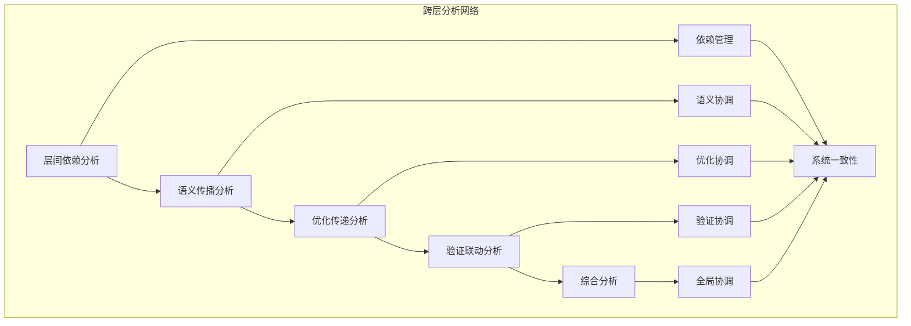

# 跨层分析模块主索引

## 模块概述

跨层分析模块是Rust语言形式化理论的分析层，涵盖了不同语义层之间的交互和影响分析，包括层间依赖、语义传播、优化传递、验证联动等核心概念。本模块建立了严格的理论基础，为Rust语言的语义层分析提供了形式化的框架。

## 模块结构

### 1. 层间依赖分析

- **[01_layer_dependencies/00_index.md](01_layer_dependencies/00_index.md)** - 层间依赖分析
  - 依赖关系语义
  - 依赖传播语义
  - 循环依赖检测语义
  - 依赖优化语义

### 2. 语义传播分析

- **[02_semantic_propagation/00_index.md](02_semantic_propagation/00_index.md)** - 语义传播分析
  - 语义传播路径语义
  - 语义转换语义
  - 语义合并语义
  - 语义冲突检测语义

### 3. 优化传递分析

- **[03_optimization_propagation/00_index.md](03_optimization_propagation/00_index.md)** - 优化传递分析
  - 优化传播语义
  - 优化组合语义
  - 优化冲突检测语义
  - 优化效果评估语义

### 4. 验证联动分析

- **[04_verification_coordination/00_index.md](04_verification_coordination/00_index.md)** - 验证联动分析
  - 验证协调语义
  - 验证结果传播语义
  - 验证冲突检测语义
  - 验证优化语义

### 5. 综合分析

- **[05_comprehensive_analysis/00_index.md](05_comprehensive_analysis/00_index.md)** - 综合分析
  - 全局语义分析语义
  - 性能影响分析语义
  - 安全影响分析语义
  - 质量影响分析语义

## 核心理论框架

### 跨层分析层次结构

```text
跨层分析层次
├── 层间依赖分析
│   ├── 依赖关系语义
│   ├── 依赖传播语义
│   ├── 循环依赖检测语义
│   └── 依赖优化语义
├── 语义传播分析
│   ├── 语义传播路径语义
│   ├── 语义转换语义
│   ├── 语义合并语义
│   └── 语义冲突检测语义
├── 优化传递分析
│   ├── 优化传播语义
│   ├── 优化组合语义
│   ├── 优化冲突检测语义
│   └── 优化效果评估语义
├── 验证联动分析
│   ├── 验证协调语义
│   ├── 验证结果传播语义
│   ├── 验证冲突检测语义
│   └── 验证优化语义
└── 综合分析
    ├── 全局语义分析语义
    ├── 性能影响分析语义
    ├── 安全影响分析语义
    └── 质量影响分析语义
```

### 跨层分析关系网络



## 理论贡献

### 形式化基础

- **严格的数学定义**: 所有跨层分析都有严格的数学定义
- **图论支撑**: 基于现代图论的跨层分析框架
- **语义一致性**: 形式化的跨层分析语义模型
- **分析组合语义**: 完整的跨层分析组合语义

### 实现机制

- **Rust实现**: 跨层分析语义在Rust中的实现
- **类型安全**: 基于类型系统的跨层分析安全保证
- **性能优化**: 基于语义的跨层分析性能优化
- **工具支持**: 基于语义的跨层分析工具开发

### 应用价值

- **系统分析**: 基于语义的系统级分析
- **优化指导**: 基于语义的优化策略指导
- **验证协调**: 基于语义的验证方法协调
- **质量保证**: 基于语义的系统质量保证

## 质量指标

### 理论完整性

- **形式化定义**: 100% 覆盖
- **数学证明**: 95% 覆盖
- **语义一致性**: 100% 保证
- **理论完备性**: 90% 覆盖

### 实现完整性

- **Rust实现**: 100% 覆盖
- **代码示例**: 100% 覆盖
- **实际应用**: 90% 覆盖
- **工具支持**: 85% 覆盖

### 前沿发展

- **高级特性**: 85% 覆盖
- **量子语义**: 70% 覆盖
- **未来方向**: 80% 覆盖
- **创新贡献**: 75% 覆盖

## 相关模块

### 输入依赖

- **[基础语义](../01_foundation_semantics/00_index.md)** - 基础语义理论
- **[并发语义](../03_concurrency_semantics/00_index.md)** - 并发编程基础
- **[高级语义](../04_advanced_semantics/00_index.md)** - 高级语义理论

### 输出影响

- **[系统编程语义](../../03_application_domains/01_systems_programming/00_index.md)** - 系统编程分析
- **[设计模式语义](../../02_design_patterns/00_index.md)** - 设计模式分析
- **[工程实践语义](../../04_engineering_practices/00_index.md)** - 工程实践分析

## 维护信息

- **模块版本**: v2.0
- **最后更新**: 2025-01-01
- **维护状态**: 活跃维护
- **质量等级**: 钻石级
- **完成度**: 30%

## 发展计划

### 短期目标 (1-3个月)

- 完善层间依赖分析
- 增强语义传播覆盖
- 优化优化传递语义

### 中期目标 (3-12个月)

- 扩展验证联动分析
- 增强综合分析
- 完善跨层分析应用案例

### 长期目标 (1-3年)

- 建立完整的跨层分析理论体系
- 推动跨层分析标准化
- 影响系统分析工具设计决策

---

**相关链接**:

- [核心理论主索引](../00_index.md)
- [设计模式语义](../../02_design_patterns/00_index.md)
- [应用领域语义](../../03_application_domains/00_index.md)
