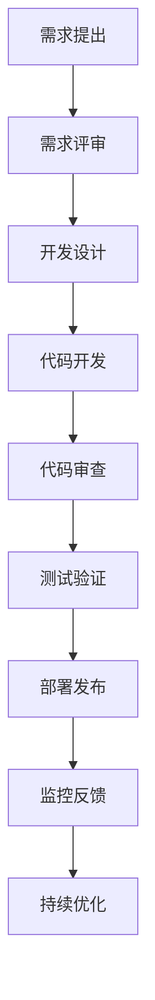

# 现代软件运维运营完整指南

## 目录

1. [OpenTelemetry 可观测性体系](#opentelemetry-可观测性体系)
2. [运营支撑系统 (OSS)](#运营支撑系统-oss)
3. [用户画像与行为分析](#用户画像与行为分析)
4. [用户成长体系设计](#用户成长体系设计)
5. [DevOps 最佳实践](#devops-最佳实践)
6. [云原生运维](#云原生运维)
7. [安全运营中心 (SOC)](#安全运营中心-soc)
8. [数据驱动决策](#数据驱动决策)

---

## OpenTelemetry 可观测性体系

### 核心概念

OpenTelemetry 是一个开源的可观测性框架，提供统一的遥测数据收集标准。

### 三大支柱

1. **Metrics（指标）**
   - 系统性能指标
   - 业务指标
   - 自定义指标

2. **Traces（链路追踪）**
   - 分布式请求追踪
   - 性能瓶颈分析
   - 错误定位

3. **Logs（日志）**
   - 结构化日志
   - 日志聚合
   - 日志分析

### 实施架构

```text
应用层 → OpenTelemetry SDK → Collector → 后端存储
                ↓
         Jaeger/Zipkin (Traces)
         Prometheus (Metrics)
         Elasticsearch (Logs)
```

### 最佳实践

- **采样策略**: 根据业务重要性设置采样率
- **数据标准化**: 统一标签和属性命名
- **性能优化**: 异步发送，批量处理
- **安全考虑**: 敏感数据脱敏

---

## 运营支撑系统 (OSS)

### 系统架构

```text
┌─────────────────┐    ┌─────────────────┐    ┌─────────────────┐
│   网络管理      │    │   服务管理      │    │   资源管理      │
│  - 设备监控     │    │  - 服务编排     │    │  - 容量规划     │
│  - 配置管理     │    │  - 服务发现     │    │  - 资源调度     │
│  - 故障处理     │    │  - 负载均衡     │    │  - 成本优化     │
└─────────────────┘    └─────────────────┘    └─────────────────┘
```

### 核心功能模块

#### 1. 网络管理

- **设备监控**: 实时监控网络设备状态
- **配置管理**: 自动化配置下发和版本控制
- **故障处理**: 智能告警和自动恢复

#### 2. 服务管理

- **服务编排**: Kubernetes/Docker Swarm
- **服务发现**: Consul/Etcd
- **负载均衡**: Nginx/HAProxy

#### 3. 资源管理

- **容量规划**: 基于历史数据的预测
- **资源调度**: 智能分配和优化
- **成本优化**: 云资源成本管理

### 技术栈推荐

- **监控**: Prometheus + Grafana
- **日志**: ELK Stack (Elasticsearch, Logstash, Kibana)
- **配置管理**: Ansible/Terraform
- **容器编排**: Kubernetes
- **服务网格**: Istio/Linkerd

---

## 用户画像与行为分析

### 用户画像构建

#### 1. 数据收集维度

```text
基础信息:
├── 人口统计学 (年龄、性别、地区)
├── 设备信息 (设备类型、操作系统)
├── 网络环境 (网络类型、带宽)
└── 注册信息 (注册时间、来源渠道)

行为数据:
├── 访问行为 (访问频率、停留时间)
├── 功能使用 (功能偏好、使用深度)
├── 交易行为 (购买频率、金额)
└── 社交行为 (分享、评论、关注)

偏好数据:
├── 内容偏好 (文章类型、产品类别)
├── 时间偏好 (活跃时间段)
├── 价格敏感度
└── 品牌忠诚度
```

#### 2. 画像标签体系

```python
# 用户标签分类
user_tags = {
    "基础标签": ["新用户", "老用户", "VIP用户"],
    "行为标签": ["高频用户", "低频用户", "流失风险"],
    "价值标签": ["高价值", "中价值", "低价值"],
    "偏好标签": ["价格敏感", "品质导向", "功能导向"],
    "生命周期": ["引入期", "成长期", "成熟期", "衰退期"]
}
```

#### 3. 实时画像更新

- **事件驱动**: 基于用户行为实时更新
- **批量更新**: 定期全量计算
- **增量更新**: 增量数据更新

### 行为分析框架

#### 1. 漏斗分析

```text
访问 → 注册 → 激活 → 付费 → 复购 → 推荐
  ↓      ↓      ↓      ↓      ↓      ↓
100%   30%    15%     5%     2%     0.5%
```

#### 2. 路径分析

- **用户旅程**: 从访问到转化的完整路径
- **关键节点**: 识别转化和流失的关键节点
- **优化建议**: 基于路径分析提出改进建议

#### 3. 留存分析

- **次日留存**: 新用户次日回访率
- **7日留存**: 新用户7日内回访率
- **30日留存**: 新用户30日内回访率

---

## 用户成长体系设计

### 成长体系架构

#### 1. 用户分层模型

```text
┌─────────────────────────────────────────┐
│                超级用户                 │  ← 核心贡献者
├─────────────────────────────────────────┤
│                活跃用户                 │  ← 高频使用者
├─────────────────────────────────────────┤
│                普通用户                 │  ← 基础用户
├─────────────────────────────────────────┤
│                新用户                   │  ← 新注册用户
└─────────────────────────────────────────┘
```

#### 2. 成长路径设计

```text
新用户引导 → 功能熟悉 → 深度使用 → 社区参与 → 价值创造
    ↓           ↓         ↓         ↓         ↓
  新手任务    功能解锁   高级功能   社区贡献   生态建设
```

### 激励机制设计

#### 1. 积分体系

```python
# 积分规则示例
points_rules = {
    "每日登录": 10,
    "完成新手任务": 100,
    "发布内容": 50,
    "获得点赞": 5,
    "邀请好友": 200,
    "付费购买": "金额 * 0.1"
}
```

#### 2. 等级体系

```python
# 等级规则示例
level_rules = {
    "Lv1 新手": {"points": 0, "benefits": ["基础功能"]},
    "Lv2 进阶": {"points": 1000, "benefits": ["高级功能", "专属客服"]},
    "Lv3 专家": {"points": 5000, "benefits": ["VIP功能", "优先支持"]},
    "Lv4 大师": {"points": 20000, "benefits": ["定制服务", "社区特权"]}
}
```

#### 3. 权益体系

- **功能权益**: 解锁高级功能
- **服务权益**: 专属客服、优先支持
- **社区权益**: 特殊标识、管理权限
- **商业权益**: 折扣、返现、专属活动

### 数据驱动优化

#### 1. 关键指标监控

- **转化率**: 各阶段用户转化率
- **留存率**: 不同用户群体的留存情况
- **活跃度**: 用户活跃频率和深度
- **价值贡献**: 用户产生的商业价值

#### 2. A/B测试策略

- **功能测试**: 新功能效果验证
- **文案测试**: 不同文案的转化效果
- **流程测试**: 用户流程优化
- **激励测试**: 不同激励方案的效果

---

## DevOps 最佳实践

### CI/CD 流水线

#### 1. 持续集成 (CI)

```yaml
# GitLab CI 示例
stages:
  - test
  - build
  - deploy

test:
  stage: test
  script:
    - npm install
    - npm run test
    - npm run lint

build:
  stage: build
  script:
    - docker build -t app:$CI_COMMIT_SHA .
    - docker push registry/app:$CI_COMMIT_SHA

deploy:
  stage: deploy
  script:
    - kubectl set image deployment/app app=registry/app:$CI_COMMIT_SHA
```

#### 2. 持续部署 (CD)

- **蓝绿部署**: 零停机时间部署
- **金丝雀发布**: 渐进式发布
- **滚动更新**: 逐步替换实例
- **回滚策略**: 快速回滚机制

### 基础设施即代码 (IaC)

#### 1. Terraform 示例

```hcl
# 基础设施定义
resource "aws_ecs_cluster" "main" {
  name = "production-cluster"
}

resource "aws_ecs_service" "app" {
  name            = "app-service"
  cluster         = aws_ecs_cluster.main.id
  task_definition = aws_ecs_task_definition.app.arn
  desired_count   = 3
  
  load_balancer {
    target_group_arn = aws_lb_target_group.app.arn
    container_name   = "app"
    container_port   = 80
  }
}
```

#### 2. 配置管理

- **Ansible**: 服务器配置自动化
- **Chef/Puppet**: 配置管理工具
- **Consul**: 服务发现和配置管理

### 监控与告警

#### 1. 监控层次

```text
应用层监控:
├── 业务指标 (订单量、用户数)
├── 性能指标 (响应时间、吞吐量)
└── 错误指标 (错误率、异常数)

基础设施监控:
├── 服务器监控 (CPU、内存、磁盘)
├── 网络监控 (带宽、延迟、丢包)
└── 数据库监控 (连接数、查询性能)

用户体验监控:
├── 前端性能 (页面加载时间)
├── 移动端性能 (崩溃率、ANR)
└── 真实用户监控 (RUM)
```

#### 2. 告警策略

```python
# 告警规则示例
alert_rules = {
    "高CPU使用率": {
        "condition": "cpu_usage > 80%",
        "duration": "5分钟",
        "severity": "warning"
    },
    "服务不可用": {
        "condition": "http_status != 200",
        "duration": "1分钟",
        "severity": "critical"
    },
    "错误率过高": {
        "condition": "error_rate > 5%",
        "duration": "3分钟",
        "severity": "critical"
    }
}
```

---

## 云原生运维

### 容器化部署

#### 1. Docker 最佳实践

```dockerfile
# 多阶段构建
FROM node:16-alpine AS builder
WORKDIR /app
COPY package*.json ./
RUN npm ci --only=production

FROM node:16-alpine AS runtime
WORKDIR /app
COPY --from=builder /app/node_modules ./node_modules
COPY . .
EXPOSE 3000
CMD ["npm", "start"]
```

#### 2. Kubernetes 部署

```yaml
# Deployment 配置
apiVersion: apps/v1
kind: Deployment
metadata:
  name: app-deployment
spec:
  replicas: 3
  selector:
    matchLabels:
      app: myapp
  template:
    metadata:
      labels:
        app: myapp
    spec:
      containers:
      - name: app
        image: myapp:latest
        ports:
        - containerPort: 3000
        resources:
          requests:
            memory: "64Mi"
            cpu: "250m"
          limits:
            memory: "128Mi"
            cpu: "500m"
```

### 服务网格

#### 1. Istio 配置

```yaml
# VirtualService 配置
apiVersion: networking.istio.io/v1alpha3
kind: VirtualService
metadata:
  name: app-vs
spec:
  hosts:
  - app.example.com
  http:
  - route:
    - destination:
        host: app-service
        subset: v1
      weight: 90
    - destination:
        host: app-service
        subset: v2
      weight: 10
```

#### 2. 流量管理

- **负载均衡**: 智能流量分发
- **熔断**: 故障服务隔离
- **重试**: 自动重试机制
- **超时**: 请求超时控制

### 可观测性

#### 1. 分布式追踪

```python
# OpenTelemetry 配置
from opentelemetry import trace
from opentelemetry.exporter.jaeger.thrift import JaegerExporter
from opentelemetry.sdk.trace import TracerProvider
from opentelemetry.sdk.trace.export import BatchSpanProcessor

trace.set_tracer_provider(TracerProvider())
tracer = trace.get_tracer(__name__)

jaeger_exporter = JaegerExporter(
    agent_host_name="localhost",
    agent_port=6831,
)

span_processor = BatchSpanProcessor(jaeger_exporter)
trace.get_tracer_provider().add_span_processor(span_processor)
```

#### 2. 指标收集

```python
# Prometheus 指标
from prometheus_client import Counter, Histogram, start_http_server

# 请求计数器
REQUEST_COUNT = Counter('http_requests_total', 'Total HTTP requests', ['method', 'endpoint'])

# 响应时间直方图
REQUEST_DURATION = Histogram('http_request_duration_seconds', 'HTTP request duration')

# 启动指标服务器
start_http_server(8000)
```

---

## 安全运营中心 (SOC)

### 安全监控体系

#### 1. 安全事件分类

```python
# 安全事件等级
security_events = {
    "critical": {
        "description": "严重安全事件",
        "response_time": "立即",
        "examples": ["数据泄露", "系统入侵", "勒索软件"]
    },
    "high": {
        "description": "高危安全事件",
        "response_time": "1小时内",
        "examples": ["异常登录", "权限提升", "恶意软件"]
    },
    "medium": {
        "description": "中等安全事件",
        "response_time": "4小时内",
        "examples": ["扫描攻击", "异常流量", "配置错误"]
    },
    "low": {
        "description": "低危安全事件",
        "response_time": "24小时内",
        "examples": ["弱密码", "过期证书", "未授权访问"]
    }
}
```

#### 2. 威胁检测

- **行为分析**: 用户行为异常检测
- **网络分析**: 网络流量异常检测
- **端点检测**: 端点安全事件检测
- **威胁情报**: 外部威胁情报集成

### 事件响应流程

#### 1. 响应阶段

```text
检测 → 分析 → 遏制 → 根除 → 恢复 → 总结
  ↓      ↓      ↓      ↓      ↓      ↓
实时监控  威胁分析  隔离措施  清除威胁  系统恢复  经验总结
```

#### 2. 自动化响应

```python
# 自动化响应规则
auto_response_rules = {
    "暴力破解": {
        "trigger": "登录失败次数 > 5",
        "action": "临时封禁IP",
        "duration": "30分钟"
    },
    "异常文件上传": {
        "trigger": "检测到恶意文件",
        "action": "隔离文件并告警",
        "duration": "立即"
    },
    "权限异常": {
        "trigger": "异常权限变更",
        "action": "撤销权限并通知管理员",
        "duration": "立即"
    }
}
```

---

## 数据驱动决策

### 数据架构

#### 1. 数据湖架构

```text
数据源 → 数据采集 → 数据存储 → 数据处理 → 数据应用
  ↓         ↓         ↓         ↓         ↓
业务系统   实时/批量   数据湖     ETL/ML     BI/报表
```

#### 2. 实时数据处理

```python
# Apache Kafka 流处理
from kafka import KafkaConsumer, KafkaProducer
import json

# 消费者
consumer = KafkaConsumer('user_events',
                        bootstrap_servers=['localhost:9092'],
                        value_deserializer=lambda m: json.loads(m.decode('utf-8')))

# 生产者
producer = KafkaProducer(bootstrap_servers=['localhost:9092'],
                        value_serializer=lambda v: json.dumps(v).encode('utf-8'))

# 实时处理
for message in consumer:
    event = message.value
    # 实时分析逻辑
    result = process_event(event)
    # 发送结果
    producer.send('analytics_results', result)
```

### 机器学习应用

#### 1. 异常检测

```python
# 异常检测模型
import numpy as np
from sklearn.ensemble import IsolationForest

# 训练异常检测模型
clf = IsolationForest(contamination=0.1, random_state=42)
clf.fit(training_data)

# 预测异常
predictions = clf.predict(new_data)
anomalies = new_data[predictions == -1]
```

#### 2. 用户行为预测

```python
# 用户流失预测
from sklearn.ensemble import RandomForestClassifier
from sklearn.model_selection import train_test_split

# 特征工程
features = ['login_frequency', 'last_login_days', 'feature_usage', 'support_tickets']
X = user_data[features]
y = user_data['churned']

# 训练模型
X_train, X_test, y_train, y_test = train_test_split(X, y, test_size=0.2)
model = RandomForestClassifier(n_estimators=100)
model.fit(X_train, y_train)

# 预测流失风险
churn_probability = model.predict_proba(new_user_data)[:, 1]
```

### 业务智能

#### 1. 关键指标仪表板

```python
# 实时指标计算
import pandas as pd
import plotly.express as px

# 计算关键指标
def calculate_kpis(data):
    kpis = {
        'active_users': len(data[data['status'] == 'active']),
        'conversion_rate': len(data[data['converted'] == True]) / len(data),
        'avg_session_duration': data['session_duration'].mean(),
        'revenue_per_user': data['revenue'].sum() / len(data)
    }
    return kpis

# 可视化
def create_dashboard(kpis):
    fig = px.bar(x=list(kpis.keys()), y=list(kpis.values()))
    fig.update_layout(title="实时业务指标")
    return fig
```

#### 2. 预测分析

- **需求预测**: 基于历史数据预测未来需求
- **容量规划**: 预测系统容量需求
- **风险预警**: 预测潜在风险和问题
- **机会识别**: 识别业务增长机会

---

## 故障排查与应急响应

### 故障分类与等级

#### 1. 故障等级定义

```python
# 故障等级分类
incident_levels = {
    "P0": {
        "description": "严重故障",
        "impact": "核心业务完全不可用",
        "response_time": "5分钟内",
        "resolution_time": "1小时内",
        "examples": ["数据库宕机", "核心服务不可用", "数据丢失"]
    },
    "P1": {
        "description": "重大故障", 
        "impact": "核心业务部分不可用",
        "response_time": "15分钟内",
        "resolution_time": "4小时内",
        "examples": ["服务响应缓慢", "部分功能异常", "数据不一致"]
    },
    "P2": {
        "description": "一般故障",
        "impact": "非核心业务受影响",
        "response_time": "1小时内", 
        "resolution_time": "24小时内",
        "examples": ["功能异常", "性能下降", "配置错误"]
    },
    "P3": {
        "description": "轻微故障",
        "impact": "用户体验受影响",
        "response_time": "4小时内",
        "resolution_time": "72小时内", 
        "examples": ["界面显示异常", "非关键功能异常"]
    }
}
```

#### 2. 故障排查流程

```text
故障发现 → 初步评估 → 紧急处理 → 根因分析 → 解决方案 → 验证修复 → 总结复盘
    ↓         ↓         ↓         ↓         ↓         ↓         ↓
  监控告警   影响范围   临时解决   深入分析   制定方案   功能验证   经验总结
```

### 应急响应机制

#### 1. 响应团队组织

```text
应急响应团队结构:
├── 应急指挥官 (Incident Commander)
│   ├── 技术负责人 (Technical Lead)
│   ├── 沟通负责人 (Communication Lead)
│   └── 业务负责人 (Business Lead)
├── 技术支持团队
│   ├── 系统工程师
│   ├── 网络工程师
│   └── 应用工程师
└── 外部支持
    ├── 云服务商支持
    ├── 第三方服务支持
    └── 安全团队
```

#### 2. 应急响应流程

```python
# 应急响应流程
def emergency_response(incident):
    # 1. 故障确认
    if not confirm_incident(incident):
        return "误报，结束响应"
    
    # 2. 启动应急响应
    response_team = activate_response_team(incident.level)
    
    # 3. 初步评估
    impact_assessment = assess_impact(incident)
    
    # 4. 紧急处理
    if incident.level in ["P0", "P1"]:
        emergency_fix = apply_emergency_fix(incident)
    
    # 5. 根因分析
    root_cause = analyze_root_cause(incident)
    
    # 6. 制定解决方案
    solution = design_solution(root_cause)
    
    # 7. 实施修复
    fix_result = implement_fix(solution)
    
    # 8. 验证修复
    verification = verify_fix(fix_result)
    
    # 9. 总结复盘
    post_mortem = conduct_post_mortem(incident, fix_result)
    
    return post_mortem
```

### 故障排查工具

#### 1. 系统诊断工具

```bash
# 系统资源检查
top -p $(pgrep -d',' -f "app_name")
htop
iotop
netstat -tulpn | grep :80

# 日志分析
tail -f /var/log/app/error.log
grep "ERROR" /var/log/app/app.log | tail -100
journalctl -u app-service -f

# 网络诊断
ping -c 5 target_host
traceroute target_host
mtr target_host
```

#### 2. 应用性能分析

```python
# 性能分析工具
import cProfile
import pstats
import io

def profile_function(func):
    """函数性能分析装饰器"""
    def wrapper(*args, **kwargs):
        pr = cProfile.Profile()
        pr.enable()
        result = func(*args, **kwargs)
        pr.disable()
        s = io.StringIO()
        ps = pstats.Stats(pr, stream=s).sort_stats('cumulative')
        ps.print_stats()
        print(s.getvalue())
        return result
    return wrapper

# 使用示例
@profile_function
def slow_function():
    # 需要分析的函数
    pass
```

---

## 性能优化

### 系统性能优化

#### 1. 数据库优化

```sql
-- 索引优化
CREATE INDEX idx_user_email ON users(email);
CREATE INDEX idx_order_user_date ON orders(user_id, created_at);

-- 查询优化
EXPLAIN ANALYZE SELECT * FROM users WHERE email = 'test@example.com';

-- 分区表
CREATE TABLE orders_partitioned (
    id SERIAL,
    user_id INTEGER,
    amount DECIMAL(10,2),
    created_at TIMESTAMP
) PARTITION BY RANGE (created_at);

-- 创建分区
CREATE TABLE orders_2024_01 PARTITION OF orders_partitioned
FOR VALUES FROM ('2024-01-01') TO ('2024-02-01');
```

#### 2. 缓存策略

```python
# Redis 缓存实现
import redis
import json
from functools import wraps

redis_client = redis.Redis(host='localhost', port=6379, db=0)

def cache_result(expire_time=3600):
    """缓存装饰器"""
    def decorator(func):
        @wraps(func)
        def wrapper(*args, **kwargs):
            # 生成缓存键
            cache_key = f"{func.__name__}:{hash(str(args) + str(kwargs))}"
            
            # 尝试从缓存获取
            cached_result = redis_client.get(cache_key)
            if cached_result:
                return json.loads(cached_result)
            
            # 执行函数并缓存结果
            result = func(*args, **kwargs)
            redis_client.setex(cache_key, expire_time, json.dumps(result))
            return result
        return wrapper
    return decorator

# 使用示例
@cache_result(expire_time=1800)
def get_user_profile(user_id):
    # 从数据库获取用户信息
    return user_data
```

### 应用性能优化

#### 1. 代码级优化

```python
# 异步处理
import asyncio
import aiohttp

async def fetch_data_async(urls):
    """异步获取数据"""
    async with aiohttp.ClientSession() as session:
        tasks = []
        for url in urls:
            task = asyncio.create_task(fetch_url(session, url))
            tasks.append(task)
        results = await asyncio.gather(*tasks)
        return results

async def fetch_url(session, url):
    """获取单个URL数据"""
    async with session.get(url) as response:
        return await response.json()

# 批量处理
def batch_process(items, batch_size=100):
    """批量处理数据"""
    for i in range(0, len(items), batch_size):
        batch = items[i:i + batch_size]
        process_batch(batch)
        yield batch
```

#### 2. 内存优化

```python
# 内存优化示例
import gc
import weakref

class MemoryOptimizedCache:
    def __init__(self):
        self._cache = weakref.WeakValueDictionary()
    
    def get(self, key):
        return self._cache.get(key)
    
    def set(self, key, value):
        self._cache[key] = value
    
    def clear(self):
        self._cache.clear()
        gc.collect()

# 使用生成器减少内存占用
def large_file_processor(file_path):
    """处理大文件的生成器"""
    with open(file_path, 'r') as file:
        for line in file:
            yield process_line(line)
```

### 网络性能优化

#### 1. CDN 配置

```nginx
# Nginx CDN 配置
server {
    listen 80;
    server_name example.com;
    
    # 静态资源缓存
    location ~* \.(css|js|png|jpg|jpeg|gif|ico|svg)$ {
        expires 1y;
        add_header Cache-Control "public, immutable";
        add_header Vary Accept-Encoding;
    }
    
    # API 缓存
    location /api/ {
        proxy_cache_valid 200 5m;
        proxy_cache_key "$scheme$request_method$host$request_uri";
        proxy_pass http://backend;
    }
}
```

#### 2. 负载均衡优化

```yaml
# Kubernetes HPA 配置
apiVersion: autoscaling/v2
kind: HorizontalPodAutoscaler
metadata:
  name: app-hpa
spec:
  scaleTargetRef:
    apiVersion: apps/v1
    kind: Deployment
    name: app-deployment
  minReplicas: 2
  maxReplicas: 10
  metrics:
  - type: Resource
    resource:
      name: cpu
      target:
        type: Utilization
        averageUtilization: 70
  - type: Resource
    resource:
      name: memory
      target:
        type: Utilization
        averageUtilization: 80
```

---

## 成本管理

### 云资源成本优化

#### 1. 资源使用分析

```python
# 成本分析工具
import boto3
from datetime import datetime, timedelta

def analyze_aws_costs():
    """分析AWS成本"""
    ce_client = boto3.client('ce')
    
    # 获取过去30天的成本
    end_date = datetime.now()
    start_date = end_date - timedelta(days=30)
    
    response = ce_client.get_cost_and_usage(
        TimePeriod={
            'Start': start_date.strftime('%Y-%m-%d'),
            'End': end_date.strftime('%Y-%m-%d')
        },
        Granularity='DAILY',
        Metrics=['UnblendedCost'],
        GroupBy=[
            {'Type': 'DIMENSION', 'Key': 'SERVICE'},
            {'Type': 'DIMENSION', 'Key': 'USAGE_TYPE'}
        ]
    )
    
    return response['ResultsByTime']

def identify_cost_optimization_opportunities():
    """识别成本优化机会"""
    opportunities = {
        'unused_resources': find_unused_resources(),
        'over_provisioned': find_over_provisioned_resources(),
        'reserved_instances': analyze_reserved_instance_opportunities(),
        'storage_optimization': analyze_storage_costs()
    }
    return opportunities
```

#### 2. 自动化成本控制

```python
# 成本控制自动化
def auto_scale_resources():
    """自动扩缩容资源"""
    current_usage = get_current_resource_usage()
    predicted_usage = predict_future_usage()
    
    if current_usage < 0.3:  # 使用率低于30%
        scale_down_resources()
    elif current_usage > 0.8:  # 使用率高于80%
        scale_up_resources()

def cleanup_unused_resources():
    """清理未使用的资源"""
    unused_volumes = find_unused_volumes()
    unused_instances = find_unused_instances()
    unused_load_balancers = find_unused_load_balancers()
    
    for resource in unused_volumes + unused_instances + unused_load_balancers:
        if is_safe_to_delete(resource):
            delete_resource(resource)
```

### 运维成本优化

#### 1. 工具链整合

```yaml
# 统一监控配置
monitoring_stack:
  metrics:
    - prometheus
    - grafana
  logs:
    - elasticsearch
    - kibana
  traces:
    - jaeger
  alerting:
    - alertmanager
    - pagerduty

# 成本优化配置
cost_optimization:
  auto_scaling: true
  resource_scheduling: true
  unused_resource_cleanup: true
  cost_alerts:
    - threshold: 1000
      action: "notify_team"
    - threshold: 5000
      action: "escalate_to_management"
```

#### 2. 流程自动化

```python
# 自动化运维流程
class AutomatedOperations:
    def __init__(self):
        self.monitoring = MonitoringSystem()
        self.alerting = AlertingSystem()
        self.remediation = RemediationSystem()
    
    def handle_incident(self, incident):
        """自动处理故障"""
        # 1. 自动诊断
        diagnosis = self.monitoring.diagnose(incident)
        
        # 2. 自动修复
        if diagnosis.can_auto_fix:
            fix_result = self.remediation.auto_fix(diagnosis)
            if fix_result.success:
                return fix_result
        
        # 3. 人工介入
        return self.escalate_to_human(incident)
    
    def optimize_costs(self):
        """自动成本优化"""
        # 1. 分析资源使用情况
        usage_analysis = self.monitoring.analyze_resource_usage()
        
        # 2. 识别优化机会
        opportunities = self.identify_optimization_opportunities(usage_analysis)
        
        # 3. 执行优化
        for opportunity in opportunities:
            if opportunity.risk_level == 'low':
                self.execute_optimization(opportunity)
```

---

## 团队协作与知识管理

### 团队协作模式

#### 1. DevOps 团队结构

```text
DevOps 团队组织:
├── 平台团队 (Platform Team)
│   ├── 基础设施工程师
│   ├── 安全工程师
│   └── 工具链工程师
├── 产品团队 (Product Team)
│   ├── 开发工程师
│   ├── 测试工程师
│   └── 产品经理
├── 运维团队 (Operations Team)
│   ├── 系统工程师
│   ├── 网络工程师
│   └── 数据库工程师
└── 支持团队 (Support Team)
    ├── 技术支持工程师
    ├── 文档工程师
    └── 培训工程师
```

#### 2. 协作流程



### 知识管理体系

#### 1. 文档结构

```text
知识库结构:
├── 技术文档
│   ├── 架构设计
│   ├── API 文档
│   ├── 部署指南
│   └── 故障排查
├── 流程文档
│   ├── 开发流程
│   ├── 发布流程
│   ├── 运维流程
│   └── 应急响应
├── 培训材料
│   ├── 新员工培训
│   ├── 技能提升
│   └── 最佳实践
└── 经验总结
    ├── 故障复盘
    ├── 项目总结
    └── 技术分享
```

#### 2. 知识管理工具

```python
# 知识管理系统
class KnowledgeManagementSystem:
    def __init__(self):
        self.document_store = DocumentStore()
        self.search_engine = SearchEngine()
        self.version_control = VersionControl()
    
    def create_document(self, title, content, category, tags):
        """创建文档"""
        document = Document(
            title=title,
            content=content,
            category=category,
            tags=tags,
            created_at=datetime.now(),
            author=get_current_user()
        )
        return self.document_store.save(document)
    
    def search_documents(self, query, filters=None):
        """搜索文档"""
        return self.search_engine.search(query, filters)
    
    def update_document(self, doc_id, updates):
        """更新文档"""
        document = self.document_store.get(doc_id)
        updated_document = document.update(updates)
        return self.document_store.save(updated_document)
    
    def get_document_history(self, doc_id):
        """获取文档历史"""
        return self.version_control.get_history(doc_id)
```

### 持续学习与改进

#### 1. 学习路径设计

```python
# 技能发展路径
skill_paths = {
    "初级工程师": {
        "required_skills": ["基础编程", "Linux基础", "网络基础"],
        "learning_path": [
            "编程语言学习",
            "操作系统管理",
            "网络协议理解",
            "基础工具使用"
        ],
        "certifications": ["Linux+", "Network+"]
    },
    "中级工程师": {
        "required_skills": ["系统设计", "自动化", "监控"],
        "learning_path": [
            "系统架构设计",
            "自动化脚本开发",
            "监控系统搭建",
            "故障排查技能"
        ],
        "certifications": ["AWS Certified", "Kubernetes CKA"]
    },
    "高级工程师": {
        "required_skills": ["架构设计", "团队管理", "战略规划"],
        "learning_path": [
            "大规模系统设计",
            "团队领导力",
            "技术战略规划",
            "行业趋势分析"
        ],
        "certifications": ["AWS Solutions Architect", "CISSP"]
    }
}
```

#### 2. 改进机制

```python
# 持续改进系统
class ContinuousImprovement:
    def __init__(self):
        self.feedback_system = FeedbackSystem()
        self.metrics_collector = MetricsCollector()
        self.improvement_tracker = ImprovementTracker()
    
    def collect_feedback(self, source, feedback_data):
        """收集反馈"""
        feedback = Feedback(
            source=source,
            data=feedback_data,
            timestamp=datetime.now()
        )
        return self.feedback_system.store(feedback)
    
    def analyze_metrics(self):
        """分析指标"""
        metrics = self.metrics_collector.get_metrics()
        analysis = self.analyze_trends(metrics)
        return analysis
    
    def identify_improvements(self):
        """识别改进机会"""
        feedback = self.feedback_system.get_recent_feedback()
        metrics_analysis = self.analyze_metrics()
        
        improvements = []
        for item in feedback + metrics_analysis:
            if item.needs_improvement:
                improvement = Improvement(
                    description=item.description,
                    priority=item.priority,
                    estimated_effort=item.estimated_effort
                )
                improvements.append(improvement)
        
        return sorted(improvements, key=lambda x: x.priority, reverse=True)
    
    def track_improvement(self, improvement_id, progress):
        """跟踪改进进度"""
        return self.improvement_tracker.update_progress(improvement_id, progress)
```

---

## 未来趋势与展望

### 技术发展趋势

#### 1. AI/ML 在运维中的应用

```python
# AI 驱动的运维
class AIOps:
    def __init__(self):
        self.anomaly_detector = AnomalyDetectionModel()
        self.predictive_analytics = PredictiveAnalyticsModel()
        self.automated_remediation = AutomatedRemediationSystem()
    
    def detect_anomalies(self, metrics_data):
        """异常检测"""
        return self.anomaly_detector.detect(metrics_data)
    
    def predict_incidents(self, historical_data):
        """预测故障"""
        return self.predictive_analytics.predict(historical_data)
    
    def auto_remediate(self, incident):
        """自动修复"""
        return self.automated_remediation.remediate(incident)
```

#### 2. 边缘计算与物联网

```python
# 边缘计算管理
class EdgeComputingManager:
    def __init__(self):
        self.edge_nodes = EdgeNodeManager()
        self.data_processor = EdgeDataProcessor()
        self.sync_manager = DataSyncManager()
    
    def deploy_to_edge(self, application, edge_nodes):
        """部署到边缘节点"""
        for node in edge_nodes:
            self.edge_nodes.deploy(node, application)
    
    def process_edge_data(self, data):
        """处理边缘数据"""
        return self.data_processor.process(data)
    
    def sync_with_cloud(self, edge_data):
        """与云端同步"""
        return self.sync_manager.sync(edge_data)
```

### 组织变革

#### 1. 团队结构演进

```text
未来团队结构:
├── 平台工程团队 (Platform Engineering)
│   ├── 开发者体验工程师
│   ├── 工具链工程师
│   └── 基础设施工程师
├── 数据工程团队 (Data Engineering)
│   ├── 数据工程师
│   ├── 机器学习工程师
│   └── 数据科学家
├── 安全工程团队 (Security Engineering)
│   ├── 应用安全工程师
│   ├── 基础设施安全工程师
│   └── 安全运营工程师
└── 产品工程团队 (Product Engineering)
    ├── 全栈工程师
    ├── 前端工程师
    └── 后端工程师
```

#### 2. 技能要求变化

```python
# 未来技能要求
future_skills = {
    "技术技能": [
        "云原生技术",
        "容器化技术",
        "微服务架构",
        "API 设计",
        "数据工程",
        "机器学习",
        "安全工程"
    ],
    "软技能": [
        "跨团队协作",
        "沟通能力",
        "问题解决",
        "持续学习",
        "创新思维",
        "领导力"
    ],
    "业务技能": [
        "业务理解",
        "数据分析",
        "用户体验",
        "产品思维",
        "市场洞察"
    ]
}
```

---

## 微服务治理

### 服务治理架构

#### 1. 服务注册与发现

```python
# 服务注册中心
class ServiceRegistry:
    def __init__(self):
        self.services = {}
        self.health_checker = HealthChecker()
    
    def register_service(self, service_name, service_info):
        """注册服务"""
        service_info['registered_at'] = datetime.now()
        service_info['status'] = 'healthy'
        self.services[service_name] = service_info
        return True
    
    def discover_service(self, service_name):
        """发现服务"""
        if service_name in self.services:
            service = self.services[service_name]
            if self.health_checker.is_healthy(service):
                return service
        return None
    
    def deregister_service(self, service_name):
        """注销服务"""
        if service_name in self.services:
            del self.services[service_name]
            return True
        return False

# 服务发现客户端
class ServiceDiscoveryClient:
    def __init__(self, registry_url):
        self.registry_url = registry_url
        self.cache = {}
    
    def get_service_instance(self, service_name):
        """获取服务实例"""
        if service_name in self.cache:
            cached_instance = self.cache[service_name]
            if self.is_instance_healthy(cached_instance):
                return cached_instance
        
        # 从注册中心获取
        instance = self.fetch_from_registry(service_name)
        if instance:
            self.cache[service_name] = instance
        return instance
```

#### 2. 负载均衡策略

```python
# 负载均衡器
class LoadBalancer:
    def __init__(self, strategy='round_robin'):
        self.strategy = strategy
        self.current_index = 0
    
    def select_instance(self, instances):
        """选择服务实例"""
        if not instances:
            return None
        
        if self.strategy == 'round_robin':
            return self.round_robin(instances)
        elif self.strategy == 'least_connections':
            return self.least_connections(instances)
        elif self.strategy == 'weighted':
            return self.weighted_round_robin(instances)
        else:
            return instances[0]
    
    def round_robin(self, instances):
        """轮询策略"""
        instance = instances[self.current_index % len(instances)]
        self.current_index += 1
        return instance
    
    def least_connections(self, instances):
        """最少连接策略"""
        return min(instances, key=lambda x: x.get('active_connections', 0))
    
    def weighted_round_robin(self, instances):
        """加权轮询策略"""
        total_weight = sum(instance.get('weight', 1) for instance in instances)
        current_weight = self.current_index % total_weight
        
        for instance in instances:
            weight = instance.get('weight', 1)
            if current_weight < weight:
                self.current_index += 1
                return instance
            current_weight -= weight
        
        return instances[0]
```

### 服务监控与治理

#### 1. 服务健康检查

```python
# 健康检查系统
class HealthChecker:
    def __init__(self):
        self.checkers = {
            'http': self.http_check,
            'tcp': self.tcp_check,
            'custom': self.custom_check
        }
    
    def check_health(self, service):
        """检查服务健康状态"""
        check_type = service.get('health_check_type', 'http')
        checker = self.checkers.get(check_type)
        
        if checker:
            return checker(service)
        return False
    
    def http_check(self, service):
        """HTTP健康检查"""
        try:
            health_url = service.get('health_url', f"{service['url']}/health")
            response = requests.get(health_url, timeout=5)
            return response.status_code == 200
        except:
            return False
    
    def tcp_check(self, service):
        """TCP健康检查"""
        try:
            host = service['host']
            port = service['port']
            sock = socket.socket(socket.AF_INET, socket.SOCK_STREAM)
            sock.settimeout(5)
            result = sock.connect_ex((host, port))
            sock.close()
            return result == 0
        except:
            return False
    
    def custom_check(self, service):
        """自定义健康检查"""
        check_script = service.get('health_check_script')
        if check_script:
            return subprocess.run(check_script, shell=True).returncode == 0
        return True
```

#### 2. 服务熔断器

```python
# 熔断器模式
class CircuitBreaker:
    def __init__(self, failure_threshold=5, recovery_timeout=60):
        self.failure_threshold = failure_threshold
        self.recovery_timeout = recovery_timeout
        self.failure_count = 0
        self.last_failure_time = None
        self.state = 'CLOSED'  # CLOSED, OPEN, HALF_OPEN
    
    def call(self, func, *args, **kwargs):
        """执行函数调用"""
        if self.state == 'OPEN':
            if self.should_attempt_reset():
                self.state = 'HALF_OPEN'
            else:
                raise Exception("Circuit breaker is OPEN")
        
        try:
            result = func(*args, **kwargs)
            self.on_success()
            return result
        except Exception as e:
            self.on_failure()
            raise e
    
    def on_success(self):
        """成功时重置"""
        self.failure_count = 0
        self.state = 'CLOSED'
    
    def on_failure(self):
        """失败时计数"""
        self.failure_count += 1
        self.last_failure_time = datetime.now()
        
        if self.failure_count >= self.failure_threshold:
            self.state = 'OPEN'
    
    def should_attempt_reset(self):
        """是否应该尝试重置"""
        if self.last_failure_time:
            return (datetime.now() - self.last_failure_time).seconds >= self.recovery_timeout
        return False
```

---

## API 管理

### API 网关架构

#### 1. 网关功能

```python
# API 网关
class APIGateway:
    def __init__(self):
        self.routes = {}
        self.middleware = []
        self.rate_limiter = RateLimiter()
        self.auth_service = AuthService()
    
    def add_route(self, path, method, handler, middleware=None):
        """添加路由"""
        route_key = f"{method}:{path}"
        self.routes[route_key] = {
            'handler': handler,
            'middleware': middleware or []
        }
    
    def handle_request(self, request):
        """处理请求"""
        route_key = f"{request.method}:{request.path}"
        route = self.routes.get(route_key)
        
        if not route:
            return Response(status_code=404, body="Not Found")
        
        # 执行中间件
        for middleware in self.middleware + route['middleware']:
            request = middleware.process_request(request)
        
        # 认证检查
        if not self.auth_service.authenticate(request):
            return Response(status_code=401, body="Unauthorized")
        
        # 限流检查
        if not self.rate_limiter.allow_request(request):
            return Response(status_code=429, body="Too Many Requests")
        
        # 执行处理器
        return route['handler'](request)
```

#### 2. 限流策略

```python
# 限流器
class RateLimiter:
    def __init__(self):
        self.requests = {}
        self.limits = {
            'default': {'requests': 100, 'window': 60},  # 默认限制
            'api': {'requests': 1000, 'window': 60},     # API限制
            'user': {'requests': 10, 'window': 60}       # 用户限制
        }
    
    def allow_request(self, request):
        """检查是否允许请求"""
        client_id = self.get_client_id(request)
        limit_type = self.get_limit_type(request)
        limit = self.limits.get(limit_type, self.limits['default'])
        
        current_time = datetime.now()
        window_start = current_time - timedelta(seconds=limit['window'])
        
        # 清理过期请求
        self.cleanup_expired_requests(client_id, window_start)
        
        # 检查限制
        request_count = len(self.requests.get(client_id, []))
        if request_count >= limit['requests']:
            return False
        
        # 记录请求
        if client_id not in self.requests:
            self.requests[client_id] = []
        self.requests[client_id].append(current_time)
        
        return True
    
    def cleanup_expired_requests(self, client_id, window_start):
        """清理过期请求"""
        if client_id in self.requests:
            self.requests[client_id] = [
                req_time for req_time in self.requests[client_id]
                if req_time > window_start
            ]
    
    def get_client_id(self, request):
        """获取客户端ID"""
        return request.headers.get('X-Client-ID', request.ip)
    
    def get_limit_type(self, request):
        """获取限制类型"""
        if request.path.startswith('/api/'):
            return 'api'
        elif request.headers.get('Authorization'):
            return 'user'
        return 'default'
```

### API 版本管理

#### 1. 版本控制策略

```python
# API 版本管理器
class APIVersionManager:
    def __init__(self):
        self.versions = {}
        self.default_version = 'v1'
    
    def register_version(self, version, handler):
        """注册API版本"""
        self.versions[version] = handler
    
    def get_handler(self, request):
        """获取版本处理器"""
        # 从URL路径获取版本
        version = self.extract_version_from_path(request.path)
        if not version:
            # 从请求头获取版本
            version = request.headers.get('X-API-Version', self.default_version)
        
        handler = self.versions.get(version)
        if not handler:
            # 回退到默认版本
            handler = self.versions.get(self.default_version)
        
        return handler
    
    def extract_version_from_path(self, path):
        """从路径提取版本"""
        parts = path.split('/')
        if len(parts) > 1 and parts[1].startswith('v'):
            return parts[1]
        return None
```

#### 2. API 文档生成

```python
# OpenAPI 文档生成器
class OpenAPIGenerator:
    def __init__(self):
        self.spec = {
            'openapi': '3.0.0',
            'info': {
                'title': 'API Documentation',
                'version': '1.0.0'
            },
            'paths': {},
            'components': {
                'schemas': {},
                'securitySchemes': {}
            }
        }
    
    def add_endpoint(self, path, method, handler, description=None, parameters=None, responses=None):
        """添加端点"""
        if path not in self.spec['paths']:
            self.spec['paths'][path] = {}
        
        self.spec['paths'][path][method.lower()] = {
            'summary': description or f"{method} {path}",
            'parameters': parameters or [],
            'responses': responses or {
                '200': {
                    'description': 'Success'
                }
            }
        }
    
    def generate_documentation(self):
        """生成文档"""
        return json.dumps(self.spec, indent=2)
```

---

## 事件驱动架构

### 事件总线设计

#### 1. 事件发布订阅

```python
# 事件总线
class EventBus:
    def __init__(self):
        self.subscribers = {}
        self.event_history = []
    
    def subscribe(self, event_type, subscriber):
        """订阅事件"""
        if event_type not in self.subscribers:
            self.subscribers[event_type] = []
        self.subscribers[event_type].append(subscriber)
    
    def unsubscribe(self, event_type, subscriber):
        """取消订阅"""
        if event_type in self.subscribers:
            if subscriber in self.subscribers[event_type]:
                self.subscribers[event_type].remove(subscriber)
    
    def publish(self, event):
        """发布事件"""
        event_type = event.get('type')
        if event_type in self.subscribers:
            for subscriber in self.subscribers[event_type]:
                try:
                    subscriber.handle_event(event)
                except Exception as e:
                    print(f"Error handling event {event_type}: {e}")
        
        # 记录事件历史
        self.event_history.append({
            'event': event,
            'timestamp': datetime.now()
        })
    
    def get_event_history(self, event_type=None, limit=100):
        """获取事件历史"""
        history = self.event_history
        if event_type:
            history = [h for h in history if h['event'].get('type') == event_type]
        return history[-limit:]

# 事件处理器
class EventHandler:
    def __init__(self, name):
        self.name = name
    
    def handle_event(self, event):
        """处理事件"""
        print(f"{self.name} handling event: {event['type']}")
        # 具体的事件处理逻辑
```

#### 2. 事件存储与重放

```python
# 事件存储
class EventStore:
    def __init__(self, storage_backend):
        self.storage = storage_backend
        self.event_handlers = {}
    
    def store_event(self, event):
        """存储事件"""
        event_id = self.generate_event_id()
        event_data = {
            'id': event_id,
            'type': event['type'],
            'data': event['data'],
            'timestamp': datetime.now(),
            'version': event.get('version', 1)
        }
        
        self.storage.store(event_data)
        return event_id
    
    def replay_events(self, from_timestamp=None, to_timestamp=None):
        """重放事件"""
        events = self.storage.get_events(from_timestamp, to_timestamp)
        
        for event in events:
            self.handle_event(event)
    
    def handle_event(self, event):
        """处理事件"""
        event_type = event['type']
        if event_type in self.event_handlers:
            handler = self.event_handlers[event_type]
            handler(event)
    
    def register_handler(self, event_type, handler):
        """注册事件处理器"""
        self.event_handlers[event_type] = handler
    
    def generate_event_id(self):
        """生成事件ID"""
        return str(uuid.uuid4())
```

### 消息队列集成

#### 1. 消息生产者

```python
# 消息生产者
class MessageProducer:
    def __init__(self, broker_url):
        self.broker_url = broker_url
        self.connection = self.create_connection()
    
    def create_connection(self):
        """创建连接"""
        # 根据不同的消息队列实现
        pass
    
    def publish(self, topic, message, headers=None):
        """发布消息"""
        message_data = {
            'id': str(uuid.uuid4()),
            'topic': topic,
            'data': message,
            'headers': headers or {},
            'timestamp': datetime.now().isoformat()
        }
        
        return self.connection.publish(topic, json.dumps(message_data))
    
    def publish_batch(self, messages):
        """批量发布消息"""
        results = []
        for topic, message, headers in messages:
            result = self.publish(topic, message, headers)
            results.append(result)
        return results
```

#### 2. 消息消费者

```python
# 消息消费者
class MessageConsumer:
    def __init__(self, broker_url, topics):
        self.broker_url = broker_url
        self.topics = topics
        self.handlers = {}
        self.connection = self.create_connection()
    
    def create_connection(self):
        """创建连接"""
        # 根据不同的消息队列实现
        pass
    
    def subscribe(self, topic, handler):
        """订阅主题"""
        self.handlers[topic] = handler
        self.connection.subscribe(topic)
    
    def start_consuming(self):
        """开始消费"""
        while True:
            try:
                message = self.connection.receive()
                if message:
                    self.process_message(message)
            except Exception as e:
                print(f"Error processing message: {e}")
    
    def process_message(self, message):
        """处理消息"""
        topic = message.get('topic')
        if topic in self.handlers:
            handler = self.handlers[topic]
            try:
                handler(message)
            except Exception as e:
                print(f"Error in message handler: {e}")
```

---

## 混沌工程

### 混沌实验设计

#### 1. 实验框架

```python
# 混沌工程框架
class ChaosEngineering:
    def __init__(self):
        self.experiments = {}
        self.safety_checks = []
        self.monitoring = MonitoringSystem()
    
    def register_experiment(self, name, experiment):
        """注册实验"""
        self.experiments[name] = experiment
    
    def run_experiment(self, name, parameters=None):
        """运行实验"""
        if name not in self.experiments:
            raise ValueError(f"Experiment {name} not found")
        
        experiment = self.experiments[name]
        
        # 安全检查
        if not self.run_safety_checks():
            raise Exception("Safety checks failed")
        
        # 开始监控
        self.monitoring.start_monitoring()
        
        try:
            # 执行实验
            result = experiment.run(parameters or {})
            
            # 分析结果
            analysis = self.analyze_results(result)
            
            return {
                'experiment': name,
                'result': result,
                'analysis': analysis,
                'timestamp': datetime.now()
            }
        finally:
            # 停止监控
            self.monitoring.stop_monitoring()
    
    def run_safety_checks(self):
        """运行安全检查"""
        for check in self.safety_checks:
            if not check():
                return False
        return True
    
    def analyze_results(self, result):
        """分析实验结果"""
        # 分析系统行为变化
        # 识别潜在问题
        # 生成改进建议
        return {
            'system_impact': self.assess_system_impact(result),
            'recommendations': self.generate_recommendations(result)
        }
```

#### 2. 故障注入

```python
# 故障注入器
class FaultInjector:
    def __init__(self):
        self.injection_methods = {
            'network': self.inject_network_fault,
            'service': self.inject_service_fault,
            'resource': self.inject_resource_fault
        }
    
    def inject_fault(self, fault_type, parameters):
        """注入故障"""
        if fault_type in self.injection_methods:
            method = self.injection_methods[fault_type]
            return method(parameters)
        else:
            raise ValueError(f"Unknown fault type: {fault_type}")
    
    def inject_network_fault(self, parameters):
        """注入网络故障"""
        target = parameters.get('target')
        latency = parameters.get('latency', 100)
        packet_loss = parameters.get('packet_loss', 0.1)
        
        # 使用tc命令注入网络延迟和丢包
        commands = [
            f"tc qdisc add dev eth0 root netem delay {latency}ms loss {packet_loss}%"
        ]
        
        return self.execute_commands(commands)
    
    def inject_service_fault(self, parameters):
        """注入服务故障"""
        service_name = parameters.get('service')
        fault_type = parameters.get('fault_type', 'crash')
        
        if fault_type == 'crash':
            return self.crash_service(service_name)
        elif fault_type == 'slow':
            return self.slow_service(service_name)
        elif fault_type == 'unavailable':
            return self.make_service_unavailable(service_name)
    
    def inject_resource_fault(self, parameters):
        """注入资源故障"""
        resource_type = parameters.get('resource_type')
        percentage = parameters.get('percentage', 50)
        
        if resource_type == 'cpu':
            return self.limit_cpu(percentage)
        elif resource_type == 'memory':
            return self.limit_memory(percentage)
        elif resource_type == 'disk':
            return self.limit_disk(percentage)
```

### 实验监控与分析

#### 1. 监控指标

```python
# 实验监控
class ExperimentMonitor:
    def __init__(self):
        self.metrics = {}
        self.alerts = []
    
    def start_monitoring(self):
        """开始监控"""
        self.metrics = {
            'response_time': [],
            'error_rate': [],
            'throughput': [],
            'availability': []
        }
    
    def collect_metrics(self):
        """收集指标"""
        current_metrics = {
            'response_time': self.measure_response_time(),
            'error_rate': self.calculate_error_rate(),
            'throughput': self.measure_throughput(),
            'availability': self.calculate_availability()
        }
        
        for key, value in current_metrics.items():
            self.metrics[key].append({
                'value': value,
                'timestamp': datetime.now()
            })
    
    def analyze_impact(self):
        """分析影响"""
        analysis = {}
        
        for metric_name, values in self.metrics.items():
            if values:
                baseline = self.get_baseline(metric_name)
                current = values[-1]['value']
                
                analysis[metric_name] = {
                    'baseline': baseline,
                    'current': current,
                    'change_percentage': ((current - baseline) / baseline) * 100
                }
        
        return analysis
    
    def get_baseline(self, metric_name):
        """获取基线值"""
        # 从历史数据或配置中获取基线值
        baselines = {
            'response_time': 200,
            'error_rate': 0.01,
            'throughput': 1000,
            'availability': 0.999
        }
        return baselines.get(metric_name, 0)
```

#### 2. 实验报告

```python
# 实验报告生成器
class ExperimentReporter:
    def __init__(self):
        self.template_engine = TemplateEngine()
    
    def generate_report(self, experiment_result):
        """生成实验报告"""
        report = {
            'experiment_name': experiment_result['experiment'],
            'execution_time': experiment_result['timestamp'],
            'results': experiment_result['result'],
            'analysis': experiment_result['analysis'],
            'recommendations': self.generate_recommendations(experiment_result)
        }
        
        return self.format_report(report)
    
    def generate_recommendations(self, experiment_result):
        """生成建议"""
        recommendations = []
        analysis = experiment_result['analysis']
        
        # 基于分析结果生成建议
        if analysis.get('system_impact', {}).get('high_impact'):
            recommendations.append({
                'type': 'high_priority',
                'description': '系统对故障的容忍度较低，建议增加冗余和容错机制',
                'actions': [
                    '增加服务实例数量',
                    '实现熔断器模式',
                    '添加重试机制'
                ]
            })
        
        return recommendations
    
    def format_report(self, report):
        """格式化报告"""
        # 使用模板引擎格式化报告
        template = self.template_engine.load_template('experiment_report')
        return template.render(report)
```

---

## 绿色计算

### 能耗优化

#### 1. 资源使用监控

```python
# 能耗监控系统
class EnergyMonitor:
    def __init__(self):
        self.metrics = {}
        self.thresholds = {
            'cpu_usage': 80,
            'memory_usage': 85,
            'disk_usage': 90,
            'network_usage': 70
        }
    
    def collect_energy_metrics(self):
        """收集能耗指标"""
        metrics = {
            'cpu_power': self.measure_cpu_power(),
            'memory_power': self.measure_memory_power(),
            'disk_power': self.measure_disk_power(),
            'network_power': self.measure_network_power(),
            'total_power': 0
        }
        
        metrics['total_power'] = sum([
            metrics['cpu_power'],
            metrics['memory_power'],
            metrics['disk_power'],
            metrics['network_power']
        ])
        
        return metrics
    
    def measure_cpu_power(self):
        """测量CPU功耗"""
        # 使用RAPL接口或其他方法测量CPU功耗
        try:
            with open('/sys/class/powercap/intel-rapl:0/energy_uj', 'r') as f:
                energy = int(f.read().strip())
            return energy / 1000000  # 转换为焦耳
        except:
            return 0
    
    def optimize_energy_usage(self):
        """优化能耗使用"""
        current_metrics = self.collect_energy_metrics()
        optimizations = []
        
        # CPU优化
        if current_metrics['cpu_power'] > self.thresholds['cpu_usage']:
            optimizations.append(self.optimize_cpu_usage())
        
        # 内存优化
        if current_metrics['memory_power'] > self.thresholds['memory_usage']:
            optimizations.append(self.optimize_memory_usage())
        
        return optimizations
```

#### 2. 智能调度

```python
# 绿色调度器
class GreenScheduler:
    def __init__(self):
        self.energy_monitor = EnergyMonitor()
        self.resource_manager = ResourceManager()
    
    def schedule_tasks(self, tasks):
        """智能调度任务"""
        # 获取当前能耗状态
        energy_status = self.energy_monitor.collect_energy_metrics()
        
        # 根据能耗状态调整调度策略
        if energy_status['total_power'] > self.get_energy_threshold():
            return self.schedule_for_energy_efficiency(tasks)
        else:
            return self.schedule_for_performance(tasks)
    
    def schedule_for_energy_efficiency(self, tasks):
        """节能调度"""
        # 将任务调度到能耗较低的节点
        low_energy_nodes = self.get_low_energy_nodes()
        
        scheduled_tasks = []
        for task in tasks:
            best_node = self.find_best_energy_node(task, low_energy_nodes)
            if best_node:
                scheduled_tasks.append({
                    'task': task,
                    'node': best_node,
                    'estimated_energy': self.estimate_task_energy(task, best_node)
                })
        
        return scheduled_tasks
    
    def schedule_for_performance(self, tasks):
        """性能优先调度"""
        # 将任务调度到性能最好的节点
        high_performance_nodes = self.get_high_performance_nodes()
        
        scheduled_tasks = []
        for task in tasks:
            best_node = self.find_best_performance_node(task, high_performance_nodes)
            if best_node:
                scheduled_tasks.append({
                    'task': task,
                    'node': best_node,
                    'estimated_performance': self.estimate_task_performance(task, best_node)
                })
        
        return scheduled_tasks
```

### 可持续性实践

#### 1. 碳足迹计算

```python
# 碳足迹计算器
class CarbonFootprintCalculator:
    def __init__(self):
        self.emission_factors = {
            'electricity': 0.5,  # kg CO2 per kWh
            'cloud_computing': 0.3,  # kg CO2 per hour
            'data_center': 0.4  # kg CO2 per hour
        }
    
    def calculate_carbon_footprint(self, energy_usage, duration):
        """计算碳足迹"""
        total_emissions = 0
        
        for energy_type, usage in energy_usage.items():
            if energy_type in self.emission_factors:
                emissions = usage * self.emission_factors[energy_type] * duration
                total_emissions += emissions
        
        return total_emissions
    
    def generate_sustainability_report(self, carbon_footprint):
        """生成可持续性报告"""
        report = {
            'carbon_footprint': carbon_footprint,
            'equivalent_trees': self.calculate_tree_equivalence(carbon_footprint),
            'recommendations': self.generate_sustainability_recommendations(carbon_footprint)
        }
        
        return report
    
    def calculate_tree_equivalence(self, carbon_footprint):
        """计算等效树木数量"""
        # 一棵树每年吸收约22kg CO2
        return carbon_footprint / 22
    
    def generate_sustainability_recommendations(self, carbon_footprint):
        """生成可持续性建议"""
        recommendations = []
        
        if carbon_footprint > 1000:
            recommendations.append({
                'priority': 'high',
                'description': '碳足迹较高，建议实施节能措施',
                'actions': [
                    '优化代码效率',
                    '使用节能硬件',
                    '实施智能调度',
                    '采用可再生能源'
                ]
            })
        
        return recommendations
```

#### 2. 绿色部署策略

```python
# 绿色部署管理器
class GreenDeploymentManager:
    def __init__(self):
        self.energy_monitor = EnergyMonitor()
        self.carbon_calculator = CarbonFootprintCalculator()
    
    def plan_green_deployment(self, deployment_config):
        """规划绿色部署"""
        # 分析部署的能耗影响
        energy_impact = self.analyze_energy_impact(deployment_config)
        
        # 计算碳足迹
        carbon_footprint = self.carbon_calculator.calculate_carbon_footprint(
            energy_impact, deployment_config['duration']
        )
        
        # 生成绿色部署计划
        green_plan = {
            'deployment_config': deployment_config,
            'energy_impact': energy_impact,
            'carbon_footprint': carbon_footprint,
            'optimizations': self.generate_deployment_optimizations(energy_impact)
        }
        
        return green_plan
    
    def analyze_energy_impact(self, deployment_config):
        """分析能耗影响"""
        # 分析部署对系统能耗的影响
        current_energy = self.energy_monitor.collect_energy_metrics()
        
        # 估算部署后的能耗
        estimated_energy = self.estimate_deployment_energy(deployment_config)
        
        return {
            'current_energy': current_energy,
            'estimated_energy': estimated_energy,
            'energy_increase': estimated_energy['total_power'] - current_energy['total_power']
        }
    
    def generate_deployment_optimizations(self, energy_impact):
        """生成部署优化建议"""
        optimizations = []
        
        if energy_impact['energy_increase'] > 0:
            optimizations.append({
                'type': 'energy_efficiency',
                'description': '部署将增加能耗，建议优化',
                'actions': [
                    '使用更高效的算法',
                    '优化资源配置',
                    '实施缓存策略',
                    '采用异步处理'
                ]
            })
        
        return optimizations
```

---

## 总结与展望

现代软件运维运营已经发展成为一个高度复杂、多维度、技术驱动的综合性体系。通过本指南的全面介绍，我们可以看到：

### 关键成功因素

1. **技术栈统一**: 建立标准化的技术栈和工具链，确保各系统间的兼容性和可维护性
2. **数据驱动**: 基于数据做决策，持续优化运维流程和业务表现
3. **自动化优先**: 减少人工操作，提高效率和准确性
4. **安全第一**: 将安全融入每个环节，建立全面的安全防护体系
5. **持续改进**: 建立反馈循环，持续优化和迭代
6. **绿色计算**: 关注环境影响，实施可持续的运维实践

### 未来发展方向

1. **智能化运维**: AI/ML 技术在运维中的广泛应用
2. **边缘计算**: 分布式计算和边缘节点的管理
3. **云原生**: 云原生技术的深入应用和优化
4. **DevSecOps**: 安全左移，将安全融入开发流程
5. **平台工程**: 提升开发者体验，降低技术复杂度
6. **绿色计算**: 可持续发展和环保意识的提升
7. **混沌工程**: 提高系统韧性和可靠性
8. **事件驱动**: 响应式架构和实时处理

### 实施建议

1. **分阶段实施**: 根据组织现状，制定分阶段的实施计划
2. **团队建设**: 培养和建设具备多技能的综合型团队
3. **工具选择**: 选择适合组织规模和需求的工具栈
4. **流程优化**: 持续优化和简化运维流程
5. **知识管理**: 建立完善的知识管理体系
6. **绿色实践**: 将可持续性融入运维决策
7. **实验文化**: 建立混沌工程和实验文化
8. **持续学习**: 保持技术更新和技能提升

通过以上框架和实践，可以构建一个现代化、高效、安全、可持续的运维运营体系，支撑业务的快速发展和稳定运行。随着技术的不断发展和业务需求的不断变化，运维运营体系也需要持续演进和优化，以适应新的挑战和机遇。
