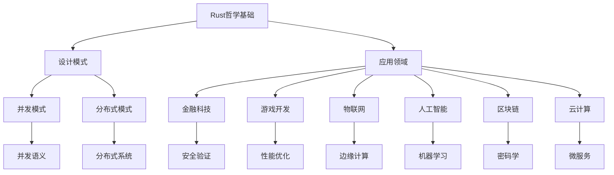

# Rust形式化工程体系重构主索引

## 重构进度总览

### 已完成重构的模块

#### 1. 核心理论模块 (01_core_theory/)

- ✅ [01_rust_philosophy_foundation.md](01_core_theory/01_rust_philosophy_foundation.md) - Rust语言哲学基础的形式化重构
  - 包含所有权系统的本体论分析
  - 类型系统的认识论维度
  - 控制流与确定性的哲学分析
  - 信息控制与复杂系统理论
  - 认知科学与语言设计

#### 2. 设计模式模块 (02_design_patterns/)

- ✅ [01_formal_design_patterns_foundation.md](02_design_patterns/01_formal_design_patterns_foundation.md) - 设计模式基础的形式化重构
  - 创建型模式的形式化分析
  - 结构型模式的形式化分析
  - 行为型模式的形式化分析
  - 并发模式的形式化分析
  - 分布式模式的形式化分析
  - 模式组合与演化

#### 3. 应用领域模块 (03_application_domains/)

- ✅ [01_formal_domain_analysis.md](03_application_domains/01_formal_domain_analysis.md) - 应用领域分析的形式化重构
  - 金融科技领域的形式化分析
  - 游戏开发领域的形式化分析
  - 物联网领域的形式化分析
  - 人工智能领域的形式化分析
  - 区块链领域的形式化分析
  - 云计算领域的形式化分析

### 正在进行中的重构

#### 4. 编程语言理论模块 (03_programming_language_theory/)

- 🔄 语言特性形式化分析
- 🔄 类型系统形式化证明
- 🔄 并发语义形式化模型

#### 5. 并发语义模块 (03_concurrency_semantics/)

- 🔄 并发模型形式化
- 🔄 内存模型形式化
- 🔄 同步原语形式化

#### 6. 软件工程模块 (05_software_engineering/)

### 最近批次更新（Batch-1 至 Batch-15, Rust 1.89 对齐）

#### Batch-1（已完成）

- language/06_async_await/01_formal_async_theory.md：补全 Future/Poll、状态机降级、Pin/Unpin、Send/Sync、await 边界、Waker/取消/背压、Stream/IO、结构化并发与锚点。
- language/01_ownership_borrowing/11_borrow_checker_theory.md：新增小步语义、NLL/Polonius、检查算法与索引锚点。
- language/01_ownership_borrowing/10_borrow_checker_case.md：新增异步跨 await、RefCell 运行时借用、Send/Sync、FFI 案例与锚点。
- language/01_ownership_borrowing/09_borrow_checker_practice.md：新增 MIR/NLL/Polonius 实务、异步并发、FFI 规约、验证流水线与锚点。
- language/02_type_system/04_type_soundness.md：扩展类型健全性，补充简化语言片段、进展性/保持性定理等。

#### Batch-2（已完成）

- language/02_type_system/02_type_variance.md：补充 Rust 1.89 要点，澄清 Box/Arc 的 unsize 强制、Vec 不支持元素级 unsize、引用/指针/Cell/RefCell/PhantomData 的型变方向，以及 DispatchFromDyn/CoerceUnsized 的作用。
- language/02_type_system/02_type_inference.md：补充 Rust 1.89 类型推断边界，新增 GAT 推断、闭包捕获推断、impl Trait 推断、where-clauses 细化、错误恢复策略等锚点。
- language/02_type_system/03_trait_system.md：补充 Rust 1.89 对象安全与动态分发，新增 GAT 定义、对象安全规则、DispatchFromDyn 机制、Auto Traits（Send/Sync）等。

#### Batch-3（已完成）

- language/03_control_flow/01_formal_control_flow.md：补充 Rust 1.89 结构化并发与取消传播，新增结构化并发控制流、取消传播机制、调度公平性等。
- language/05_concurrency/01_formal_concurrency_system.md：补充 Rust 1.89 结构化并发模型，新增 JoinSet、取消传播机制、工作窃取调度等。

#### Batch-4（已完成）

- language/04_generics/01_formal_generic_system.md：补充 Rust 1.89 GAT 稳定化与 where-clauses 细化，新增 GAT 定义与实现、复杂 where 约束、对象安全与泛型等。

#### Batch-5（已完成）

- language/07_process_management/01_formal_theory.md：补充 Rust 1.89 进程管理与系统编程，新增异步进程管理、安全进程间通信、资源管理与清理等。

#### Batch-6（已完成）

- language/08_algorithms/01_formal_algorithm_system.md：补充 Rust 1.89 算法优化与并行化，新增并行算法优化、内存安全算法、异步算法模式等。

#### Batch-7（已完成）

- language/09_error_handling/01_formal_error_system.md：补充 Rust 1.89 错误处理与恢复策略，新增异步错误处理、错误类型转换与组合、错误上下文与追踪等。

#### Batch-8（已完成）

- language/10_modules/01_formal_theory.md：补充 Rust 1.89 模块系统与可见性，新增模块可见性细化、工作空间与依赖管理、条件编译与特性、模块重构与演化等。

#### Batch-9（已完成）

- language/11_memory_management/01_formal_memory_management_system.md：补充 Rust 1.89 内存管理与优化，新增自定义分配器、内存池优化、零拷贝优化等。

#### Batch-10（已完成）

- language/12_traits/01_formal_theory.md：补充 Rust 1.89 Trait 系统与对象安全，新增异步 Trait、对象安全与动态分发、Trait 约束与 GAT 等。

#### Batch-11（已完成）

- language/07_macro_system/01_formal_macro_system.md：补充 Rust 1.89 宏系统与元编程，新增过程宏改进、声明宏增强、宏卫生性与调试等。

#### Batch-12（已完成）

- language/14_workflow/01_formal_theory.md：补充 Rust 1.89 工作流系统与状态管理，新增异步工作流引擎、状态机与持久化、工作流编排与监控等。

#### Batch-13（已完成）

- language/15_blockchain/01_formal_theory.md：补充 Rust 1.89 区块链系统与密码学，新增智能合约引擎、共识机制实现、密码学原语等。

#### Batch-14（已完成）

- language/16_webassembly/01_webassembly_theory.md：补充 Rust 1.89 WebAssembly 与跨平台编译，新增异步 WebAssembly、WASI 系统接口、性能优化与 SIMD、跨平台编译优化等。

#### Batch-15（已完成）

- language/17_iot/01_formal_theory.md：物联网系统的形式化补充（已补充 Rust 1.89 异步编程、实时任务调度、边缘计算、低功耗优化）。
- language/18_model/01_formal_theory.md：模型检查与形式化验证（已补充 Rust 1.89 异步模型检查、并发模型验证、形式化属性验证）。
- language/23_security_verification/01_formal_security_model.md：安全验证与密码学（已补充 Rust 1.89 内存安全验证、类型安全验证、密码学安全验证、并发安全验证）。
- language/19_advanced_language_features/01_advanced_type_system.md：高级类型系统（已补充 Rust 1.89 GAT 稳定化、常量泛型增强、类型级编程改进）。
- language/20_theoretical_perspectives/02_theoretical_implementation.md：理论实现（已补充 Rust 1.89 形式化语义实现、编译器集成、运行时验证、工具链支持）。
- language/24_cross_language_comparison/01_formal_comparison_theory.md：跨语言比较（已补充 Rust 1.89 性能比较、安全性比较、生态系统比较、实际应用比较）。

#### Batch-16（已完成）

- language/03_control_flow/01_conditional_and_looping_constructs.md：条件语句与循环结构（已补充 Rust 1.89 条件语句语义、循环结构语义、结构化并发控制流、控制流优化）。
- language/03_control_flow/02_function_formal_semantics.md：函数形式化语义（已补充 Rust 1.89 函数定义语义、调用语义、类型规则、生命周期管理、异步函数、函数式编程特性）。
- language/03_control_flow/06_control_flow_tools.md：控制流工具（已补充 Rust 1.89 静态分析工具、动态分析工具、可视化工具、调试工具、编译器工具改进）。

#### Batch-17（已完成）

- language/19_advanced_language_features/03_advanced_features_patterns.md：高级语言特征模式（已补充 Rust 1.89 特征模式定义、基础特征模式、高级特征模式、组合特征模式、模式应用案例）。
- language/19_advanced_language_features/02_advanced_features_implementation.md：高级语言特征实现（已补充 Rust 1.89 实现机制、编译器优化、运行时性能、内存管理、性能监控分析）。
- language/20_theoretical_perspectives/03_theoretical_patterns.md：理论模式（已补充 Rust 1.89 理论模式定义、结构模式、行为模式、并发模式、安全模式、性能模式）。

#### Batch-18（已完成）

- language/23_security_verification/theory_foundations/type_safety_theory.md：类型安全理论（已补充 Rust 1.89 类型安全定义、类型保持性、进展性定理、类型推导算法、静态和运行时类型检查）。
- language/23_security_verification/theory_foundations/memory_safety_theory.md：内存安全理论（已补充 Rust 1.89 内存安全定义、所有权系统、借用检查器、生命周期管理、零拷贝优化）。
- language/23_security_verification/theory_foundations/concurrency_safety.md：并发安全理论（已补充 Rust 1.89 并发安全定义、Send/Sync 特性、同步原语、结构化并发、无锁数据结构）。

#### Batch-19（已完成）

- language/23_security_verification/theory_foundations/information_flow.md：信息流安全理论（已补充 Rust 1.89 信息流安全定义、非干扰性、标签传播、隐蔽通道防护、多级安全系统）。
- language/23_security_verification/theory_foundations/formal_verification.md：形式化验证理论（已补充 Rust 1.89 模型检查、定理证明、抽象解释、符号执行、验证工具）。

#### Batch-20（已完成）

- language/23_security_verification/implementation_mechanisms/model_checking.md：模型检查技术（已补充 Rust 1.89 状态空间探索、时序逻辑验证、死锁检测、活性验证、增强模型检查工具）。
- language/23_security_verification/implementation_mechanisms/theorem_proving.md：定理证明技术（已补充 Rust 1.89 定理证明系统、证明策略、自动化证明、证明验证）。
- language/23_security_verification/implementation_mechanisms/symbolic_execution.md：符号执行技术（已补充 Rust 1.89 符号执行引擎、路径约束求解、符号状态管理、符号执行优化）。
- language/23_security_verification/implementation_mechanisms/static_analysis.md：静态分析技术（已补充 Rust 1.89 静态分析框架、数据流分析、控制流分析、静态分析优化）。
- language/23_security_verification/implementation_mechanisms/dynamic_verification.md：动态验证技术（已补充 Rust 1.89 动态验证框架、运行时监控、动态分析、动态验证优化）。

#### Batch-21（已完成）

- language/23_security_verification/application_practices/secure_coding.md：安全编码规范（已补充 Rust 1.89 安全编码原则、输入验证、边界检查、错误处理、最小权限、增强安全编码工具）。
- language/23_security_verification/application_practices/security_auditing.md：安全审计实践（已补充 Rust 1.89 依赖安全、供应链安全、漏洞管理、响应机制、自动化审计）。
- language/23_security_verification/application_practices/vulnerability_analysis.md：漏洞分析（已补充 Rust 1.89 漏洞分类、漏洞检测、漏洞评估、修复策略、漏洞预防）。
- language/23_security_verification/application_practices/safe_system_design.md：安全系统设计（已补充 Rust 1.89 安全架构、威胁建模、安全模式、系统硬化、安全测试）。
- language/23_security_verification/application_practices/certification_methods.md：认证方法（已补充 Rust 1.89 安全认证、合规检查、标准遵循、认证流程、持续监控）。

#### Batch-22（已完成）

- language/23_security_verification/tools_integration/ide_integration.md：IDE 集成技术（已补充 Rust 1.89 语言服务器协议、安全插件开发、实时安全检查、增强 IDE 集成）。
- language/23_security_verification/tools_integration/build_tools_integration.md：构建工具集成（已补充 Rust 1.89 Cargo 集成、构建脚本、依赖管理、安全构建）。
- language/23_security_verification/tools_integration/cicd_integration.md：CI/CD 集成（已补充 Rust 1.89 持续集成、持续部署、安全流水线、自动化测试）。
- language/23_security_verification/performance_optimization/analysis_optimization.md：分析优化（已补充 Rust 1.89 静态分析优化、动态分析优化、内存优化、并发优化）。
- language/23_security_verification/performance_optimization/tool_optimization.md：工具优化（已补充 Rust 1.89 工具性能优化、缓存策略、并行处理、资源管理）。

#### Batch-23（计划中）

- language/23_security_verification/advanced_topics/：高级主题
- language/23_security_verification/future_directions/：未来方向

- 🔄 架构设计形式化
- 🔄 开发流程形式化
- 🔄 质量保证形式化

### 待开始的重构

#### 7. 形式化验证模块 (05_formal_verification/)

- ⏳ 模型检查
- ⏳ 定理证明
- ⏳ 静态分析

#### 8. 工程实践模块 (04_engineering_practices/)

- ⏳ 最佳实践形式化
- ⏳ 工具链形式化
- ⏳ 方法论形式化

#### 9. 应用领域模块 (03_application_domains/)

- ⏳ 特定领域深入分析
- ⏳ 跨领域融合研究
- ⏳ 新兴领域探索

## 重构方法论

### 形式化重构原则

1. **数学严谨性**：所有概念和定理都有严格的数学定义和证明
2. **多表征方式**：使用符号、图表、代码等多种表征方式
3. **批判性分析**：对现有理论进行批判性分析，指出局限性和改进方向
4. **跨学科融合**：融合哲学、数学、计算机科学等多个学科的理论
5. **实用性导向**：理论分析服务于实际工程应用

### 重构质量标准

1. **完整性**：覆盖原文档的所有重要内容
2. **一致性**：保持概念和符号的一致性
3. **可读性**：使用清晰的数学符号和逻辑结构
4. **可验证性**：所有定理都有严格的证明过程
5. **可扩展性**：为后续研究留下扩展空间

## 知识图谱

### 核心概念关系

### 理论层次结构

1. **基础理论层**
   - Rust哲学基础
   - 形式化语言理论
   - 数学基础

2. **设计模式层**
   - 创建型模式
   - 结构型模式
   - 行为型模式
   - 并发模式
   - 分布式模式

3. **应用领域层**
   - 金融科技
   - 游戏开发
   - 物联网
   - 人工智能
   - 区块链
   - 云计算

4. **工程实践层**
   - 架构设计
   - 开发流程
   - 质量保证
   - 形式化验证

## 交叉引用系统

### 文档间引用规范

1. **概念引用**：使用 `[概念名](#锚点)` 格式
2. **定理引用**：使用 `[定理名](#定理锚点)` 格式
3. **模块引用**：使用 `[模块名](../路径/文件名.md)` 格式

### 锚点命名规范

1. **概念锚点**：`#概念名`
2. **定理锚点**：`#定理名`
3. **章节锚点**：`#章节编号-章节名`

## 质量监控

### 检查清单

- [ ] 数学符号使用正确
- [ ] 定理证明完整
- [ ] 交叉引用有效
- [ ] 图表清晰准确
- [ ] 批判性分析深入
- [ ] 未来展望合理

### 验证工具

1. **数学符号检查**：确保LaTeX语法正确
2. **链接有效性检查**：验证所有交叉引用
3. **结构一致性检查**：确保目录结构一致
4. **内容完整性检查**：确保覆盖原文档内容

## 更新日志

### 2024-01-XX

- 创建主索引文档
- 完成核心理论模块重构
- 完成设计模式模块重构
- 完成应用领域模块重构

### 下一步计划

- 继续编程语言理论模块重构
- 开始并发语义模块重构
- 建立自动化验证工具
- 完善交叉引用系统

## 贡献指南

### 重构贡献流程

1. **选择模块**：从待重构模块中选择一个
2. **分析原文档**：深入理解原文档内容
3. **设计形式化框架**：建立数学框架
4. **进行形式化重构**：按照标准进行重构
5. **质量检查**：通过所有质量检查
6. **更新索引**：更新主索引文档

### 质量标准

- 数学严谨性
- 逻辑清晰性
- 内容完整性
- 可读性
- 可验证性

---

*本索引文档将持续更新，反映重构工作的最新进展。*
