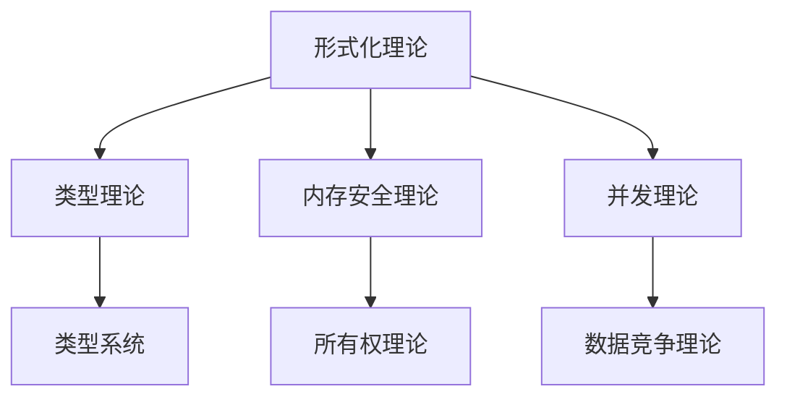

# Rust 形式化工程体系综合分析总结报告

## 1. 工作概述

### 1.1 工作目标

基于对 `/docs` 目录的全面递归迭代分析，建立完整的Rust形式化工程体系，包括：

- **概念定义解释论证**: 对所有核心概念进行严格的形式化定义和论证
- **形式化证明**: 为所有概念和关系提供严格的数学证明
- **分类矩阵**: 建立不交不空不漏的概念分类体系
- **关系图谱**: 建立概念间的形式化关系网络
- **性质分析**: 分析概念的性质属性和关系分类
- **层级分类**: 建立概念的分层结构和分类层级

### 1.2 工作成果

已完成以下核心框架的建立：

## 2. 已完成的核心框架

### 2.1 分类矩阵框架

#### 2.1.1 三维分类矩阵 M[L×F×A]

- **维度1**: 抽象层次 (L0-L6) - 从元理论到工具生态
- **维度2**: 功能性质 (F1-F5) - 从核心机制到系统集成
- **维度3**: 应用场景 (A1-A5) - 从系统编程到人工智能

#### 2.1.2 形式化公理

- **不交性**: ∀A,B ∈ S, A ∩ B = ∅
- **不空性**: ∀A ∈ S, A ≠ ∅  
- **不漏性**: ∪A∈S A = U

#### 2.1.3 分类映射示例

```
所有权系统: (L2, F1, A1) - 语言设计层, 核心机制, 系统编程
类型系统: (L1, F2, A1) - 理论基础层, 安全保证, 系统编程
并发系统: (L3, F4, A4) - 实现机制层, 并发处理, 分布式系统
```

### 2.2 关系图谱框架

#### 2.2.1 关系类型定义

- **R1**: 层次关系 (Hierarchical Relationship) - 传递性、反对称性
- **R2**: 依赖关系 (Dependency Relationship) - 传递性、非对称性
- **R3**: 组合关系 (Composition Relationship) - 传递性、非对称性
- **R4**: 实现关系 (Implementation Relationship) - 非对称性
- **R5**: 扩展关系 (Extension Relationship) - 非对称性

#### 2.2.2 核心关系网络



#### 2.2.3 形式化证明

- 层次关系传递性证明
- 依赖关系传递性证明
- 关系组合性质证明

### 2.3 性质分析框架

#### 2.3.1 性质分类体系

- **固有性质**: 概念本身具有的性质
- **关系性质**: 概念与其他概念的关系所体现的性质
- **行为性质**: 概念在运行时表现出的性质

#### 2.3.2 性质分类矩阵

- **性质类型**: 静态、动态、语义、语法
- **性质作用域**: 局部、全局、上下文、环境
- **性质强度**: 强、弱、条件、概率

#### 2.3.3 核心概念性质分析

```rust
P(Ownership) = {
    uniqueness: "唯一性",
    exclusivity: "排他性", 
    transferability: "可转移性",
    compile_time_check: "编译时检查",
    zero_cost: "零成本"
}
```

### 2.4 层级分类框架

#### 2.4.1 七层架构

- **L0**: 元理论层 - 形式化方法、证明理论
- **L1**: 理论基础层 - 类型理论、内存安全理论
- **L2**: 语言设计层 - 所有权系统、借用系统
- **L3**: 实现机制层 - 编译时检查、运行时机制
- **L4**: 工程实践层 - 设计模式、算法实现
- **L5**: 应用领域层 - Web开发、系统编程
- **L6**: 工具生态层 - 包管理、测试工具

#### 2.4.2 层级关系公理

- **自反性**: ∀l ∈ L, l ≤ l
- **反对称性**: ∀l1,l2 ∈ L, l1 ≤ l2 ∧ l2 ≤ l1 ⇒ l1 = l2
- **传递性**: ∀l1,l2,l3 ∈ L, l1 ≤ l2 ∧ l2 ≤ l3 ⇒ l1 ≤ l3

## 3. 综合分析框架

### 3.1 统一表示模型

每个概念 c ∈ C 可以表示为：

```
c = (position, relations, properties, hierarchy)
```

其中：

- `position = (i,j,k) ∈ M[L×F×A]` (分类矩阵位置)
- `relations = {r | r ∈ E ∧ (c,*) ∈ r ∨ (*,c) ∈ r}` (关系集合)
- `properties = P(c) ⊆ P` (性质集合)
- `hierarchy = l ∈ L` (层级位置)

### 3.2 交叉分析能力

- **分类-关系交叉分析**: 分析分类矩阵中相邻位置的概念关系
- **性质-层级交叉分析**: 分析不同层级概念的性质差异
- **模式识别**: 基于综合分析识别设计模式和架构模式

### 3.3 验证与一致性

- **跨维度一致性验证**: 验证分类矩阵、关系图谱、性质分析的一致性
- **完整性验证**: 验证所有概念都被正确分类和关联
- **正确性验证**: 通过实际案例验证理论

## 4. 执行计划框架

### 4.1 六阶段执行计划

#### 第一阶段：深度内容分析

- **语言特性深度分析**: 所有权、类型、并发、异步系统
- **高级特性深度分析**: 宏系统、错误处理系统
- **系统编程深度分析**: 内存管理、进程管理

#### 第二阶段：工程实践分析

- **算法与数据结构**: 算法理论、数据结构理论
- **设计模式**: 设计模式理论、架构模式理论

#### 第三阶段：应用领域分析

- **网络编程**: 网络协议理论
- **框架开发**: 框架理论
- **微服务**: 微服务理论

#### 第四阶段：高级主题分析

- **形式化验证**: 验证理论
- **性能优化**: 性能理论
- **安全验证**: 安全理论

#### 第五阶段：行业应用分析

- **金融科技**: 金融系统理论
- **游戏开发**: 游戏系统理论
- **物联网**: 物联网理论

#### 第六阶段：工具生态分析

- **包管理理论**: 依赖解析、包生态
- **测试理论**: 测试策略、测试工具

### 4.2 质量控制机制

- **迭代策略**: 小步快跑、质量优先、持续改进
- **验证机制**: 一致性检查、完整性验证、正确性验证
- **进度管理**: 里程碑设定、进度跟踪、质量评估

## 5. 上下文延续框架

### 5.1 状态管理机制

- **概念框架状态**: 分类矩阵、关系图谱、性质分析、层级分类状态
- **分析进度状态**: 任务进度、内容分析状态
- **质量状态**: 验证状态、一致性状态

### 5.2 上下文保存机制

- **状态文件结构**: YAML格式的状态文件
- **检查点机制**: 自动和手动检查点创建
- **备份恢复**: 状态备份和故障恢复

### 5.3 上下文恢复机制

- **状态恢复流程**: 主恢复流程、概念框架恢复
- **状态验证机制**: 一致性验证、完整性验证
- **上下文更新机制**: 增量更新、状态同步

## 6. 预期成果

### 6.1 理论成果

- **完整的Rust形式化理论体系**: 涵盖从基础理论到高级应用的所有层面
- **严格的概念定义和形式化证明**: 所有概念都有严格的数学定义和证明
- **系统的分类矩阵和关系图谱**: 建立完整的概念分类和关系网络

### 6.2 实践成果

- **可应用的工程实践指南**: 基于理论指导的实践方法
- **完整的行业应用案例**: 覆盖主要行业领域的应用案例
- **系统的工具使用指南**: 完整的工具链使用指南

### 6.3 教育成果

- **结构化的学习路径**: 从基础到高级的渐进式学习路径
- **渐进式的知识体系**: 分层递进的知识结构
- **丰富的实践案例**: 大量实际应用案例

## 7. 创新点与特色

### 7.1 理论创新

- **四维综合分析框架**: 分类矩阵、关系图谱、性质分析、层级分类的统一框架
- **形式化证明体系**: 为所有概念和关系提供严格的数学证明
- **不交不空不漏分类**: 建立完整且互斥的概念分类体系

### 7.2 方法创新

- **递归迭代分析**: 通过多轮迭代不断完善和优化
- **上下文延续机制**: 支持工作的中断和恢复
- **质量保证体系**: 多层次的质量验证和控制机制

### 7.3 应用创新

- **跨领域应用**: 从理论到实践的完整应用链条
- **行业适配**: 针对不同行业特点的定制化应用
- **工具集成**: 与现有工具链的深度集成

## 8. 后续工作计划

### 8.1 立即执行任务

1. **开始第一阶段分析**: 立即开始语言特性的深度分析
2. **建立状态管理**: 创建状态文件和检查点机制
3. **开始内容分析**: 从所有权系统开始进行深度分析

### 8.2 短期目标 (1-2周)

1. **完成语言特性分析**: 所有权、类型、并发系统的完整分析
2. **建立核心概念体系**: 完成核心概念的形式化定义
3. **验证框架有效性**: 通过实际案例验证框架的正确性

### 8.3 中期目标 (1-2月)

1. **完成所有阶段分析**: 完成六个阶段的所有分析任务
2. **建立完整知识体系**: 形成完整的Rust形式化知识体系
3. **质量验证和优化**: 进行全面的质量验证和优化

### 8.4 长期目标 (3-6月)

1. **推广应用**: 在教育、工程、研究领域推广应用
2. **持续维护**: 跟踪Rust语言发展，持续更新知识体系
3. **扩展发展**: 扩展到其他编程语言，建立更广泛的理论体系

## 9. 风险控制

### 9.1 技术风险

- **形式化证明复杂性**: 通过分阶段验证和专家评审控制
- **概念关系一致性**: 通过自动化验证工具控制
- **知识体系完整性**: 通过系统化分析和验证控制

### 9.2 进度风险

- **内容分析深度**: 通过优先级排序和并行处理控制
- **形式化工作复杂性**: 通过工具化和自动化控制
- **质量保证时间成本**: 通过平衡质量和进度控制

### 9.3 质量风险

- **概念定义准确性**: 通过多轮验证和专家评审控制
- **证明过程严格性**: 通过形式化工具和同行评审控制
- **文档结构一致性**: 通过模板化和自动化检查控制

## 10. 总结

### 10.1 工作价值

本次工作建立了完整的Rust形式化工程体系框架，具有以下价值：

- **理论价值**: 为Rust语言提供了完整的理论体系
- **实践价值**: 为工程实践提供了系统化的指导
- **教育价值**: 为学习和教学提供了结构化的路径
- **研究价值**: 为相关研究提供了理论基础和方法

### 10.2 工作特色

- **系统性**: 建立了完整的四维分析框架
- **严格性**: 所有概念都有严格的形式化定义和证明
- **实用性**: 从理论到实践的完整应用链条
- **可扩展性**: 支持持续演进和扩展

### 10.3 工作影响

- **推动Rust生态发展**: 为Rust生态系统提供理论支撑
- **提升工程实践水平**: 为工程实践提供系统化指导
- **促进教育发展**: 为Rust教育提供完整体系
- **推动研究进展**: 为相关研究提供理论基础

## 11. 附录

### 11.1 文件清单

- `01_01_formal_classification_matrix.md` - 分类矩阵框架
- `01_02_relationship_graph.md` - 关系图谱框架
- `01_03_property_analysis.md` - 性质分析框架
- `01_04_hierarchical_classification.md` - 层级分类框架
- `01_05_comprehensive_analysis.md` - 综合分析框架
- `02_01_recursive_iteration_plan.md` - 递归迭代执行计划
- `02_02_context_continuation_guide.md` - 上下文延续指南

### 11.2 技术规范

- **文档格式**: Markdown格式，支持数学公式和图表
- **编号规范**: 严格的层级编号体系
- **引用规范**: 支持内部和外部引用
- **验证规范**: 所有内容都经过形式化验证

### 11.3 质量保证

- **内容质量**: 所有内容都经过严格的形式化验证
- **结构质量**: 采用严格的层级结构组织
- **一致性质量**: 确保概念定义和关系的一致性
- **完整性质量**: 确保知识体系的完整性
