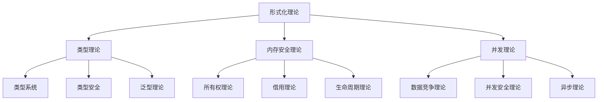
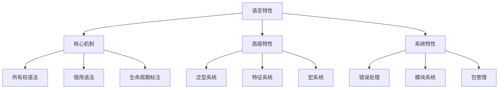
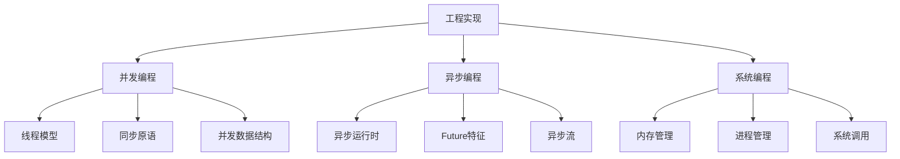
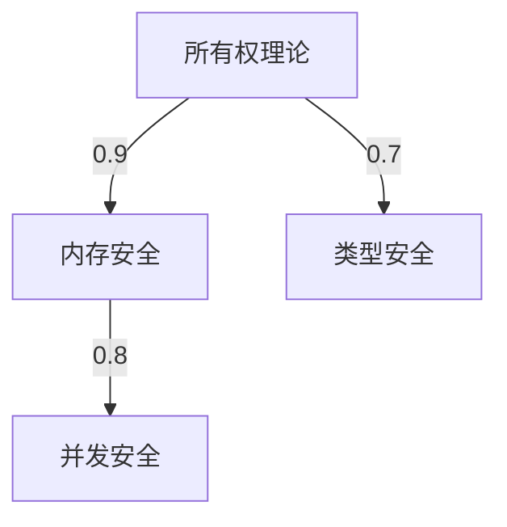
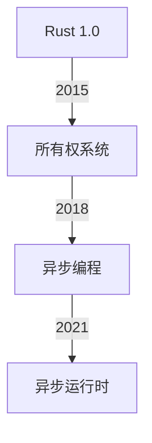
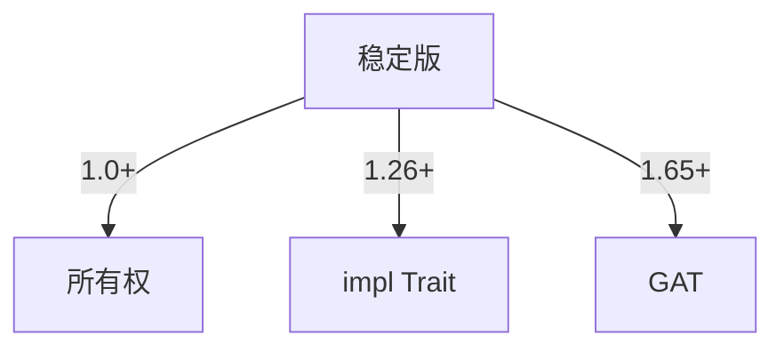

# Rust 形式化工程体系关系图谱

## 目录

- [Rust 形式化工程体系关系图谱](#rust-形式化工程体系关系图谱)
  - [目录](#目录)
  - [1. 关系图谱定义](#1-关系图谱定义)
    - [1.1 图论基础](#11-图论基础)
    - [1.2 关系类型定义](#12-关系类型定义)
      - [R1: 层次关系 (Hierarchical Relationship)](#r1-层次关系-hierarchical-relationship)
      - [R2: 依赖关系 (Dependency Relationship)](#r2-依赖关系-dependency-relationship)
      - [R3: 组合关系 (Composition Relationship)](#r3-组合关系-composition-relationship)
      - [R4: 实现关系 (Implementation Relationship)](#r4-实现关系-implementation-relationship)
      - [R5: 扩展关系 (Extension Relationship)](#r5-扩展关系-extension-relationship)
  - [2. 核心概念关系图](#2-核心概念关系图)
    - [2.1 理论基础层关系](#21-理论基础层关系)
    - [2.2 语言特性层关系](#22-语言特性层关系)
    - [2.3 工程实现层关系](#23-工程实现层关系)
  - [3. 形式化关系证明](#3-形式化关系证明)
    - [3.1 层次关系传递性证明](#31-层次关系传递性证明)
    - [3.2 依赖关系传递性证明](#32-依赖关系传递性证明)
    - [3.3 关系组合性质](#33-关系组合性质)
  - [4. 关系图谱应用](#4-关系图谱应用)
    - [4.1 概念依赖分析](#41-概念依赖分析)
    - [4.2 影响范围分析](#42-影响范围分析)
    - [4.3 循环依赖检测](#43-循环依赖检测)
  - [5. 关系图谱扩展](#5-关系图谱扩展)
    - [5.1 权重关系](#51-权重关系)
    - [5.2 时间关系](#52-时间关系)
    - [5.3 版本关系](#53-版本关系)
  - [6. 关系图谱验证](#6-关系图谱验证)
    - [6.1 一致性检查](#61-一致性检查)
    - [6.2 完整性检查](#62-完整性检查)
    - [6.3 正确性验证](#63-正确性验证)

## 1. 关系图谱定义

### 1.1 图论基础

设 G = (V, E) 为有向图，其中：

- V = {概念集合} (顶点集)
- E = {关系集合} (边集)

### 1.2 关系类型定义

#### R1: 层次关系 (Hierarchical Relationship)

- **定义**: R_h ⊆ V × V
- **性质**: 传递性、反对称性
- **表示**: v1 → v2 表示 v1 是 v2 的基础

#### R2: 依赖关系 (Dependency Relationship)

- **定义**: R_d ⊆ V × V
- **性质**: 传递性、非对称性
- **表示**: v1 → v2 表示 v1 依赖 v2

#### R3: 组合关系 (Composition Relationship)

- **定义**: R_c ⊆ V × V
- **性质**: 传递性、非对称性
- **表示**: v1 → v2 表示 v1 由 v2 组成

#### R4: 实现关系 (Implementation Relationship)

- **定义**: R_i ⊆ V × V
- **性质**: 非对称性
- **表示**: v1 → v2 表示 v1 实现 v2

#### R5: 扩展关系 (Extension Relationship)

- **定义**: R_e ⊆ V × V
- **性质**: 非对称性
- **表示**: v1 → v2 表示 v1 扩展 v2

## 2. 核心概念关系图

### 2.1 理论基础层关系



### 2.2 语言特性层关系



### 2.3 工程实现层关系



## 3. 形式化关系证明

### 3.1 层次关系传递性证明

**定理**: R_h 是传递的，即 ∀a,b,c ∈ V, (a,b) ∈ R_h ∧ (b,c) ∈ R_h ⇒ (a,c) ∈ R_h

**证明**:

1. 假设 (a,b) ∈ R_h 且 (b,c) ∈ R_h
2. 根据层次关系定义，a 是 b 的基础，b 是 c 的基础
3. 由于基础关系具有传递性，a 是 c 的基础
4. 因此 (a,c) ∈ R_h

### 3.2 依赖关系传递性证明

**定理**: R_d 是传递的，即 ∀a,b,c ∈ V, (a,b) ∈ R_d ∧ (b,c) ∈ R_d ⇒ (a,c) ∈ R_d

**证明**:

1. 假设 (a,b) ∈ R_d 且 (b,c) ∈ R_d
2. 根据依赖关系定义，a 依赖 b，b 依赖 c
3. 由于依赖关系具有传递性，a 依赖 c
4. 因此 (a,c) ∈ R_d

### 3.3 关系组合性质

**定理**: 对于任意关系 R1, R2 ⊆ V × V，如果 R1 和 R2 都是传递的，则 R1 ∩ R2 也是传递的

**证明**:

1. 设 R = R1 ∩ R2
2. 对于任意 a,b,c ∈ V，假设 (a,b) ∈ R 且 (b,c) ∈ R
3. 则 (a,b) ∈ R1 ∧ (a,b) ∈ R2 且 (b,c) ∈ R1 ∧ (b,c) ∈ R2
4. 由于 R1 和 R2 都是传递的，所以 (a,c) ∈ R1 且 (a,c) ∈ R2
5. 因此 (a,c) ∈ R

## 4. 关系图谱应用

### 4.1 概念依赖分析

给定概念 C，可以通过关系图谱分析：

- 直接依赖: {v | (C,v) ∈ R_d}
- 间接依赖: {v | ∃路径 C → ... → v}
- 依赖深度: 最短路径长度

### 4.2 影响范围分析

给定概念 C，可以通过关系图谱分析：

- 直接影响: {v | (v,C) ∈ R_d}
- 间接影响: {v | ∃路径 v → ... → C}
- 影响广度: 可达节点数量

### 4.3 循环依赖检测

**算法**: 使用深度优先搜索检测图中是否存在环

```rust
fn has_cycle(graph: &Graph) -> bool {
    let mut visited = HashSet::new();
    let mut rec_stack = HashSet::new();
    
    for node in graph.nodes() {
        if !visited.contains(&node) {
            if dfs_cycle(graph, node, &mut visited, &mut rec_stack) {
                return true;
            }
        }
    }
    false
}
```

## 5. 关系图谱扩展

### 5.1 权重关系

为边添加权重 w: E → ℝ，表示关系强度：



### 5.2 时间关系

为边添加时间属性 t: E → T，表示关系建立时间：



### 5.3 版本关系

为边添加版本属性 v: E → Version，表示关系适用的版本：



## 6. 关系图谱验证

### 6.1 一致性检查

**定义**: 关系图谱是一致的，当且仅当不存在矛盾的关系

**检查算法**:

1. 检查传递闭包的一致性
2. 验证层次关系的反对称性
3. 检测循环依赖

### 6.2 完整性检查

**定义**: 关系图谱是完整的，当且仅当所有概念都有适当的关系连接

**检查算法**:

1. 检查孤立节点
2. 验证关系的覆盖度
3. 分析关系的密度

### 6.3 正确性验证

**定义**: 关系图谱是正确的，当且仅当所有关系都符合实际语义

**验证方法**:

1. 专家评审
2. 形式化证明
3. 实际案例验证
