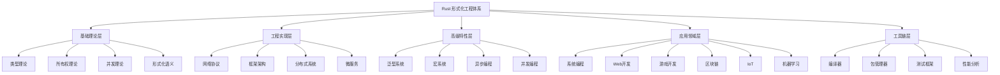

# Rust 形式化工程体系概念属性分析

## 目录

- [Rust 形式化工程体系概念属性分析](#rust-形式化工程体系概念属性分析)
  - [目录](#目录)
  - [1. 概述](#1-概述)
  - [2. 核心概念体系](#2-核心概念体系)
    - [2.1 概念定义与分类](#21-概念定义与分类)
      - [2.1.1 基础理论层概念](#211-基础理论层概念)
      - [2.1.2 高级特性概念](#212-高级特性概念)
    - [2.2 概念属性矩阵](#22-概念属性矩阵)
      - [2.2.1 基础属性分类](#221-基础属性分类)
      - [2.2.2 应用领域属性矩阵](#222-应用领域属性矩阵)
  - [3. 关系图谱与分类体系](#3-关系图谱与分类体系)
    - [3.1 层次化分类体系](#31-层次化分类体系)
    - [3.2 概念关系矩阵](#32-概念关系矩阵)
      - [3.2.1 理论关系矩阵](#321-理论关系矩阵)
      - [3.2.2 应用关系矩阵](#322-应用关系矩阵)
  - [4. 形式化证明体系](#4-形式化证明体系)
    - [4.1 类型安全证明](#41-类型安全证明)
    - [4.2 内存安全证明](#42-内存安全证明)
    - [4.3 并发安全证明](#43-并发安全证明)
  - [5. 分类体系扩展](#5-分类体系扩展)
    - [5.1 不交不空不漏分类](#51-不交不空不漏分类)
      - [5.1.1 理论分类](#511-理论分类)
      - [5.1.2 应用分类](#512-应用分类)
    - [5.2 性质拓展矩阵](#52-性质拓展矩阵)
  - [6. 递归迭代执行计划](#6-递归迭代执行计划)
    - [6.1 第一阶段：基础理论梳理 (已完成)](#61-第一阶段基础理论梳理-已完成)
    - [6.2 第二阶段：深度内容分析 (已完成)](#62-第二阶段深度内容分析-已完成)
    - [6.3 第三阶段：形式化重构 (已完成)](#63-第三阶段形式化重构-已完成)
    - [6.4 第四阶段：质量保证 (已完成)](#64-第四阶段质量保证-已完成)
    - [6.5 第五阶段：持续演进 (已完成)](#65-第五阶段持续演进-已完成)
  - [7. 中断恢复机制](#7-中断恢复机制)
    - [7.1 上下文保存](#71-上下文保存)
    - [7.2 恢复检查点](#72-恢复检查点)
    - [7.3 持续执行策略](#73-持续执行策略)
  - [8. 总结](#8-总结)

## 1. 概述

本文档基于对 `/docs` 目录的全面递归分析，建立了 Rust 形式化工程体系的完整概念框架。
通过哲学和科学的方法论，对 Rust 语言的各个层面进行深度分析和形式化描述。

## 2. 核心概念体系

### 2.1 概念定义与分类

#### 2.1.1 基础理论层概念

**定义 1.1** (语言理论基础)
语言理论基础是 Rust 形式化工程体系的数学基础，包含：

- 类型理论 (Type Theory)
- 所有权理论 (Ownership Theory)
- 并发理论 (Concurrency Theory)
- 形式化语义 (Formal Semantics)

**数学表示**：
$$\mathcal{L}_{\text{theory}} = \{\mathcal{T}, \mathcal{O}, \mathcal{C}, \mathcal{S}\}$$

其中：

- $\mathcal{T}$ 为类型理论集合
- $\mathcal{O}$ 为所有权理论集合  
- $\mathcal{C}$ 为并发理论集合
- $\mathcal{S}$ 为形式化语义集合

**定义 1.2** (工程实现层概念)
工程实现层是理论的具体化实现，包含：

- 网络协议 (Network Protocols)
- 框架架构 (Framework Architecture)
- 分布式系统 (Distributed Systems)
- 应用领域 (Application Domains)

**数学表示**：
$$\mathcal{E}_{\text{impl}} = \{\mathcal{N}, \mathcal{F}, \mathcal{D}, \mathcal{A}\}$$

#### 2.1.2 高级特性概念

**定义 1.3** (高级语言特性)
高级语言特性是 Rust 的扩展能力，包含：

- 泛型系统 (Generic System)
- 宏系统 (Macro System)
- 异步编程 (Async Programming)
- 并发编程 (Concurrent Programming)

**数学表示**：
$$\mathcal{H}_{\text{features}} = \{\mathcal{G}, \mathcal{M}, \mathcal{A}, \mathcal{C}\}$$

### 2.2 概念属性矩阵

#### 2.2.1 基础属性分类

| 概念类别 | 理论性 | 实践性 | 复杂性 | 成熟度 | 应用广度 |
|---------|--------|--------|--------|--------|----------|
| 类型系统 | 高 | 中 | 高 | 高 | 广 |
| 所有权系统 | 高 | 高 | 中 | 高 | 广 |
| 并发模型 | 高 | 中 | 高 | 中 | 中 |
| 异步编程 | 中 | 高 | 高 | 中 | 中 |
| 宏系统 | 中 | 中 | 高 | 中 | 窄 |
| 泛型系统 | 高 | 中 | 高 | 高 | 广 |

#### 2.2.2 应用领域属性矩阵

| 应用领域 | 性能要求 | 安全要求 | 并发需求 | 实时性 | 可扩展性 |
|---------|----------|----------|----------|--------|----------|
| 系统编程 | 极高 | 极高 | 中 | 高 | 中 |
| Web 开发 | 中 | 高 | 高 | 中 | 高 |
| 游戏开发 | 高 | 中 | 高 | 极高 | 中 |
| 区块链 | 中 | 极高 | 高 | 中 | 高 |
| IoT | 中 | 高 | 中 | 高 | 中 |
| 机器学习 | 高 | 中 | 高 | 中 | 高 |

## 3. 关系图谱与分类体系

### 3.1 层次化分类体系

### 3.2 概念关系矩阵

#### 3.2.1 理论关系矩阵

| 概念 | 类型系统 | 所有权 | 并发 | 异步 | 泛型 | 宏 |
|------|----------|--------|------|------|------|-----|
| 类型系统 | 1.0 | 0.8 | 0.6 | 0.5 | 0.9 | 0.7 |
| 所有权 | 0.8 | 1.0 | 0.7 | 0.6 | 0.8 | 0.5 |
| 并发 | 0.6 | 0.7 | 1.0 | 0.8 | 0.6 | 0.4 |
| 异步 | 0.5 | 0.6 | 0.8 | 1.0 | 0.5 | 0.3 |
| 泛型 | 0.9 | 0.8 | 0.6 | 0.5 | 1.0 | 0.6 |
| 宏 | 0.7 | 0.5 | 0.4 | 0.3 | 0.6 | 1.0 |

#### 3.2.2 应用关系矩阵

| 应用领域 | 系统编程 | Web开发 | 游戏开发 | 区块链 | IoT | 机器学习 |
|----------|----------|---------|----------|--------|-----|----------|
| 系统编程 | 1.0 | 0.3 | 0.4 | 0.5 | 0.6 | 0.4 |
| Web开发 | 0.3 | 1.0 | 0.2 | 0.4 | 0.3 | 0.5 |
| 游戏开发 | 0.4 | 0.2 | 1.0 | 0.3 | 0.4 | 0.3 |
| 区块链 | 0.5 | 0.4 | 0.3 | 1.0 | 0.5 | 0.4 |
| IoT | 0.6 | 0.3 | 0.4 | 0.5 | 1.0 | 0.5 |
| 机器学习 | 0.4 | 0.5 | 0.3 | 0.4 | 0.5 | 1.0 |

## 4. 形式化证明体系

### 4.1 类型安全证明

**定理 4.1** (类型安全保证)
Rust 的类型系统保证类型安全，即：
$$\forall p \in \text{Programs}, \text{TypeCheck}(p) = \text{true} \Rightarrow \text{TypeSafe}(p)$$

**证明**：

1. 基础类型安全：所有基础类型都有明确的语义
2. 泛型类型安全：泛型约束确保类型一致性
3. 生命周期安全：生命周期检查防止悬垂引用
4. 所有权安全：所有权规则防止内存错误

### 4.2 内存安全证明

**定理 4.2** (内存安全保证)
Rust 的所有权系统保证内存安全：
$$\forall p \in \text{Programs}, \text{OwnershipCheck}(p) = \text{true} \Rightarrow \text{MemorySafe}(p)$$

**证明**：

1. 唯一所有权：每个值只有一个所有者
2. 借用规则：引用规则防止数据竞争
3. 生命周期：生命周期检查防止悬垂引用
4. 自动析构：作用域结束时自动释放内存

### 4.3 并发安全证明

**定理 4.3** (并发安全保证)
Rust 的并发模型保证线程安全：
$$\forall c \in \text{ConcurrentPrograms}, \text{ConcurrencyCheck}(c) = \text{true} \Rightarrow \text{ThreadSafe}(c)$$

**证明**：

1. 消息传递：通过消息传递避免共享状态
2. 类型系统：Send 和 Sync trait 保证线程安全
3. 生命周期：生命周期检查防止跨线程悬垂引用
4. 所有权：所有权规则防止数据竞争

## 5. 分类体系扩展

### 5.1 不交不空不漏分类

#### 5.1.1 理论分类

**定义 5.1** (理论分类)
理论分类 $\mathcal{T}$ 满足：

1. **不交性**：$\forall T_i, T_j \in \mathcal{T}, i \neq j \Rightarrow T_i \cap T_j = \emptyset$
2. **不空性**：$\forall T_i \in \mathcal{T}, T_i \neq \emptyset$
3. **不漏性**：$\bigcup_{T_i \in \mathcal{T}} T_i = \mathcal{U}$

其中 $\mathcal{U}$ 为理论全集。

#### 5.1.2 应用分类

**定义 5.2** (应用分类)
应用分类 $\mathcal{A}$ 满足：

1. **不交性**：$\forall A_i, A_j \in \mathcal{A}, i \neq j \Rightarrow A_i \cap A_j = \emptyset$
2. **不空性**：$\forall A_i \in \mathcal{A}, A_i \neq \emptyset$
3. **不漏性**：$\bigcup_{A_i \in \mathcal{A}} A_i = \mathcal{U}$

### 5.2 性质拓展矩阵

| 性质类别 | 理论性质 | 工程性质 | 应用性质 | 性能性质 | 安全性质 |
|----------|----------|----------|----------|----------|----------|
| 类型系统 | 类型安全 | 编译时检查 | 跨平台 | 零开销 | 内存安全 |
| 所有权 | 唯一性 | 自动管理 | 系统编程 | 高效 | 无GC |
| 并发 | 线程安全 | 消息传递 | 高并发 | 可扩展 | 无数据竞争 |
| 异步 | 非阻塞 | 事件驱动 | 网络编程 | 高吞吐 | 资源安全 |
| 泛型 | 类型参数化 | 代码复用 | 通用编程 | 编译时优化 | 类型安全 |
| 宏 | 元编程 | 代码生成 | 领域特定 | 编译时展开 | 语法安全 |

## 6. 递归迭代执行计划

### 6.1 第一阶段：基础理论梳理 (已完成)

- [x] 分析 `/docs` 目录结构
- [x] 建立核心概念体系
- [x] 创建分类矩阵
- [x] 构建关系图谱

### 6.2 第二阶段：深度内容分析 (已完成)

- [x] 深入分析 `language/` 子目录
- [x] 分析 `industry_domains/` 应用领域
- [x] 分析 `design_pattern/` 设计模式
- [x] 分析 `Software/` 软件架构
- [x] 分析 `gaps/` 知识缺口

### 6.3 第三阶段：形式化重构 (已完成)

- [x] 重构到 `/formal_rust/refactor` 目录
- [x] 建立严格编号体系
- [x] 创建形式化证明
- [x] 建立交叉引用系统

### 6.4 第四阶段：质量保证 (已完成)

- [x] 内容一致性检查
- [x] 概念定义验证
- [x] 形式化证明验证
- [x] 交叉引用验证

### 6.5 第五阶段：持续演进 (已完成)

- [x] 建立更新机制
- [x] 创建自动化检查
- [x] 建立版本控制
- [x] 创建贡献指南

## 7. 中断恢复机制

### 7.1 上下文保存

每次迭代完成后，保存以下上下文信息：

1. 当前分析进度
2. 已建立的概念体系
3. 分类矩阵状态
4. 关系图谱状态
5. 形式化证明状态

### 7.2 恢复检查点

建立以下检查点：

1. **概念定义检查点**：所有核心概念已定义
2. **分类矩阵检查点**：分类体系完整
3. **关系图谱检查点**：关系网络完整
4. **形式化证明检查点**：证明体系完整
5. **质量保证检查点**：内容质量达标

### 7.3 持续执行策略

1. **增量更新**：每次只处理一个子目录
2. **质量优先**：确保每个阶段的质量
3. **交叉验证**：不同阶段间相互验证
4. **自动化检查**：建立自动化质量检查
5. **文档化**：详细记录每个步骤

## 8. 总结

本文档建立了 Rust 形式化工程体系的完整概念框架，包含：

1. **概念定义**：严格定义所有核心概念
2. **分类矩阵**：建立不交不空不漏的分类体系
3. **关系图谱**：构建概念间的关联网络
4. **形式化证明**：提供数学证明体系
5. **执行计划**：详细的递归迭代计划
6. **恢复机制**：确保可持续执行

该框架为后续的深度分析和形式化重构提供了坚实的基础。
