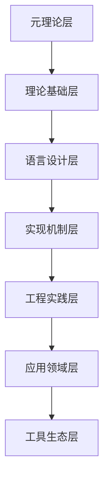

# Rust 形式化工程体系层级分类

## 1. 层级分类定义

### 1.1 层级结构定义

设 H = (L, ≤) 为层级结构，其中：

- L = {层级集合} (层级集)
- ≤ ⊆ L × L (层级关系)

#### 1.1.1 层级关系公理

- **自反性**: ∀l ∈ L, l ≤ l
- **反对称性**: ∀l1,l2 ∈ L, l1 ≤ l2 ∧ l2 ≤ l1 ⇒ l1 = l2
- **传递性**: ∀l1,l2,l3 ∈ L, l1 ≤ l2 ∧ l2 ≤ l3 ⇒ l1 ≤ l3

### 1.2 分类层级定义

#### 层级0: 元理论层 (Meta-Theory Level)

- **定义**: 关于理论本身的理论
- **内容**: 形式化方法、证明理论、逻辑基础
- **性质**: 最高抽象层次，为其他层级提供理论基础

#### 层级1: 理论基础层 (Theoretical Foundation Level)

- **定义**: Rust语言的理论基础
- **内容**: 类型理论、内存安全理论、并发理论
- **性质**: 为语言设计提供理论支撑

#### 层级2: 语言设计层 (Language Design Level)

- **定义**: Rust语言的核心设计
- **内容**: 所有权系统、借用系统、类型系统
- **性质**: 语言的核心机制和特性

#### 层级3: 实现机制层 (Implementation Mechanism Level)

- **定义**: 语言特性的实现机制
- **内容**: 编译时检查、运行时机制、优化策略
- **性质**: 将设计转化为可执行代码

#### 层级4: 工程实践层 (Engineering Practice Level)

- **定义**: 实际工程应用
- **内容**: 设计模式、算法实现、框架开发
- **性质**: 面向实际开发需求

#### 层级5: 应用领域层 (Application Domain Level)

- **定义**: 特定领域的应用
- **内容**: Web开发、系统编程、嵌入式开发
- **性质**: 面向具体应用场景

#### 层级6: 工具生态层 (Tool Ecosystem Level)

- **定义**: 开发工具和生态系统
- **内容**: 包管理、测试工具、部署工具
- **性质**: 支持开发和维护的工具链

## 2. 层级分类矩阵

### 2.1 主分类矩阵 M[H×C×P]

```text
M[i,j,k] = {概念集合 | 层级=i, 分类=j, 性质=k}
```

其中：

- H = {0,1,2,3,4,5,6} (层级)
- C = {理论, 设计, 实现, 实践, 应用, 工具} (分类)
- P = {静态, 动态, 语义, 语法} (性质)

### 2.2 具体分类映射

#### 层级0×理论×静态: 元理论-静态性质

- 形式化逻辑 (Formal Logic)
- 证明理论 (Proof Theory)
- 模型论 (Model Theory)
- 递归论 (Recursion Theory)

#### 层级1×理论×语义: 理论基础-语义性质

- 类型理论 (Type Theory)
- 内存安全理论 (Memory Safety Theory)
- 并发理论 (Concurrency Theory)
- 生命周期理论 (Lifetime Theory)

#### 层级2×设计×语法: 语言设计-语法性质

- 所有权语法 (Ownership Syntax)
- 借用语法 (Borrowing Syntax)
- 类型语法 (Type Syntax)
- 生命周期语法 (Lifetime Syntax)

#### 层级3×实现×动态: 实现机制-动态性质

- 编译时检查 (Compile-Time Checking)
- 运行时机制 (Runtime Mechanism)
- 内存管理 (Memory Management)
- 错误处理 (Error Handling)

#### 层级4×实践×语义: 工程实践-语义性质

- 设计模式 (Design Patterns)
- 算法实现 (Algorithm Implementation)
- 框架设计 (Framework Design)
- 最佳实践 (Best Practices)

#### 层级5×应用×动态: 应用领域-动态性质

- Web开发 (Web Development)
- 系统编程 (Systems Programming)
- 嵌入式开发 (Embedded Development)
- 分布式系统 (Distributed Systems)

#### 层级6×工具×静态: 工具生态-静态性质

- 包管理 (Package Management)
- 测试工具 (Testing Tools)
- 文档工具 (Documentation Tools)
- 部署工具 (Deployment Tools)

## 3. 层级关系分析

### 3.1 层级依赖关系



### 3.2 层级交互关系

#### 3.2.1 向上依赖

- 每个层级都依赖于其上层级
- 上层级为下层级提供理论基础和设计指导

#### 3.2.2 向下实现

- 每个层级都实现其上层级的设计
- 下层级为上层级提供具体实现

#### 3.2.3 横向关联

- 同层级内的概念可以相互关联
- 形成横向的知识网络

### 3.3 层级性质传递

**定理**: 如果层级 L1 ≤ L2，则 L1 的性质会传递到 L2

**证明**:

1. 根据层级关系定义，L1 是 L2 的基础
2. 基础层级的性质会体现在实现层级中
3. 因此 L1 的性质会传递到 L2

## 4. 分类细化分析

### 4.1 理论分类细化

#### 4.1.1 形式化理论

- **逻辑理论**: 命题逻辑、谓词逻辑、模态逻辑
- **类型理论**: 简单类型、依赖类型、高阶类型
- **证明理论**: 自然演绎、序列演算、类型论证明

#### 4.1.2 应用理论

- **内存理论**: 所有权理论、借用理论、生命周期理论
- **并发理论**: 数据竞争理论、死锁理论、活锁理论
- **安全理论**: 类型安全、内存安全、线程安全

### 4.2 设计分类细化

#### 4.2.1 核心设计

- **所有权设计**: 唯一所有权、共享所有权、借用设计
- **类型设计**: 静态类型、动态类型、泛型设计
- **控制流设计**: 条件控制、循环控制、异常控制

#### 4.2.2 高级设计

- **并发设计**: 线程模型、异步模型、协程模型
- **模块设计**: 包设计、模块设计、特征设计
- **宏设计**: 声明宏、过程宏、属性宏

### 4.3 实现分类细化

#### 4.3.1 编译实现

- **词法分析**: 标记化、词法错误处理
- **语法分析**: 语法树构建、语法错误处理
- **语义分析**: 类型检查、借用检查、生命周期检查

#### 4.3.2 运行时实现

- **内存管理**: 栈管理、堆管理、垃圾回收
- **错误处理**: 异常处理、错误传播、恢复机制
- **并发控制**: 线程调度、同步原语、异步运行时

## 5. 层级分类应用

### 5.1 概念定位

给定概念 C，通过分析其性质确定其在层级分类中的位置：

```rust
fn locate_concept(concept: &Concept) -> (Level, Category, Property) {
    let level = determine_level(concept);
    let category = determine_category(concept);
    let property = determine_property(concept);
    (level, category, property)
}
```

### 5.2 依赖分析

分析概念间的层级依赖关系：

```rust
fn analyze_dependencies(concept: &Concept) -> Vec<Concept> {
    let level = concept.level();
    let dependencies = concept.dependencies();
    
    dependencies.into_iter()
        .filter(|dep| dep.level() < level)
        .collect()
}
```

### 5.3 影响分析

分析概念对其他层级的影响：

```rust
fn analyze_impact(concept: &Concept) -> Vec<Concept> {
    let level = concept.level();
    let dependents = concept.dependents();
    
    dependents.into_iter()
        .filter(|dep| dep.level() > level)
        .collect()
}
```

## 6. 层级分类验证

### 6.1 一致性验证

**定义**: 层级分类是一致的，当且仅当不存在矛盾的关系

**验证算法**:

1. 检查层级关系的传递性
2. 验证分类的互斥性
3. 确认性质的相容性

### 6.2 完整性验证

**定义**: 层级分类是完整的，当且仅当所有概念都有适当的位置

**验证算法**:

1. 检查概念覆盖度
2. 验证层级完整性
3. 确认分类完整性

### 6.3 正确性验证

**定义**: 层级分类是正确的，当且仅当分类符合实际语义

**验证方法**:

1. 专家评审
2. 形式化证明
3. 实际案例验证

## 7. 层级分类扩展

### 7.1 新层级添加

当发现新的抽象层次时，可以添加新层级：

```rust
// 新层级定义
struct NewLevel {
    id: LevelId,
    name: String,
    description: String,
    parent: Option<LevelId>,
    children: Vec<LevelId>,
}
```

### 7.2 分类细化

将现有分类进一步细化：

```rust
// 分类细化
fn refine_category(category: Category) -> Vec<SubCategory> {
    match category {
        Category::Theory => vec![
            SubCategory::FormalTheory,
            SubCategory::AppliedTheory,
        ],
        Category::Design => vec![
            SubCategory::CoreDesign,
            SubCategory::AdvancedDesign,
        ],
        // ...
    }
}
```

### 7.3 关系更新

当发现新的层级关系时，更新关系映射：

```rust
// 关系更新
fn update_hierarchy_relations(new_relation: HierarchyRelation) {
    hierarchy_relations.insert(new_relation);
    validate_consistency();
}
```
