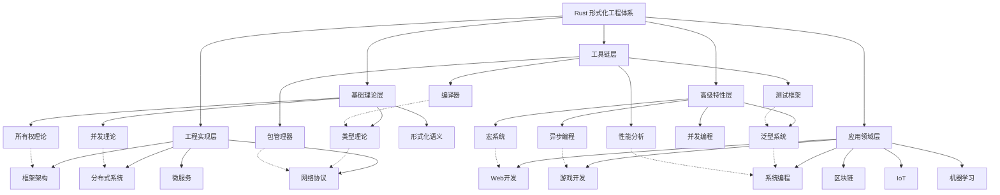
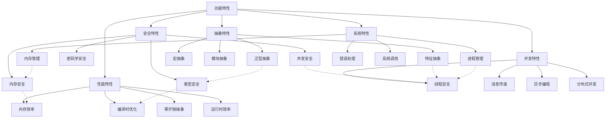
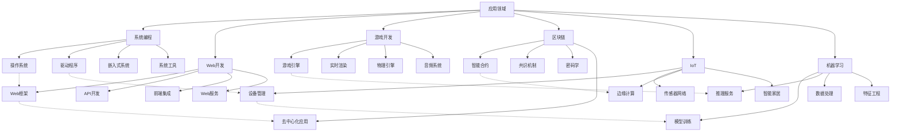

# Rust 形式化工程体系概念分类矩阵与关系图谱

## 1. 概述

本文档建立了 Rust 形式化工程体系的完整概念分类矩阵和关系图谱，确保分类的不交性、不空性和不漏性，并构建了概念间的完整关系网络。

## 2. 概念分类体系

### 2.1 基础分类原则

**定义 2.1** (分类原则)
概念分类 $\mathcal{C}$ 满足以下三个基本性质：

1. **不交性** (Disjointness)：$\forall C_i, C_j \in \mathcal{C}, i \neq j \Rightarrow C_i \cap C_j = \emptyset$
2. **不空性** (Non-emptiness)：$\forall C_i \in \mathcal{C}, C_i \neq \emptyset$
3. **不漏性** (Completeness)：$\bigcup_{C_i \in \mathcal{C}} C_i = \mathcal{U}$

其中 $\mathcal{U}$ 为概念全集。

### 2.2 主要分类维度

#### 2.2.1 理论层次维度

| 分类 | 定义 | 包含概念 | 性质 |
|------|------|----------|------|
| 基础理论层 | 语言的核心理论基础 | 类型理论、所有权理论、并发理论 | 抽象性高、普适性强 |
| 工程实现层 | 理论的具体化实现 | 网络协议、框架架构、分布式系统 | 实用性高、具体性强 |
| 高级特性层 | 语言的扩展能力 | 泛型系统、宏系统、异步编程 | 复杂性高、灵活性强 |
| 应用领域层 | 具体的应用场景 | 系统编程、Web开发、区块链 | 专业性高、针对性强 |
| 工具链层 | 开发和维护工具 | 编译器、包管理器、测试框架 | 辅助性强、工具性强 |

#### 2.2.2 功能特性维度

| 分类 | 定义 | 包含概念 | 性质 |
|------|------|----------|------|
| 安全特性 | 保证程序安全的机制 | 内存安全、类型安全、并发安全 | 安全性高、可靠性强 |
| 性能特性 | 影响程序性能的机制 | 零开销抽象、编译时优化、运行时效率 | 效率高、优化性强 |
| 并发特性 | 支持并发编程的机制 | 线程安全、消息传递、异步编程 | 并发性强、扩展性强 |
| 抽象特性 | 提供抽象能力的机制 | 泛型、特征、宏 | 抽象性高、复用性强 |
| 系统特性 | 系统编程相关的机制 | 内存管理、进程管理、错误处理 | 系统性强、控制性强 |

#### 2.2.3 应用领域维度

| 分类 | 定义 | 包含概念 | 性质 |
|------|------|----------|------|
| 系统编程 | 底层系统开发 | 操作系统、驱动程序、嵌入式系统 | 底层性强、控制性强 |
| Web开发 | Web应用开发 | Web框架、API开发、前端集成 | 网络性强、交互性强 |
| 游戏开发 | 游戏应用开发 | 游戏引擎、实时渲染、物理引擎 | 实时性强、性能要求高 |
| 区块链 | 区块链应用开发 | 智能合约、共识机制、密码学 | 安全性高、分布式性强 |
| IoT | 物联网应用开发 | 设备管理、传感器网络、边缘计算 | 实时性强、资源受限 |
| 机器学习 | 机器学习应用开发 | 模型训练、推理服务、数据处理 | 计算密集、数据驱动 |

## 3. 概念分类矩阵

### 3.1 理论层次 × 功能特性矩阵

| 功能特性 \ 理论层次 | 基础理论层 | 工程实现层 | 高级特性层 | 应用领域层 | 工具链层 |
|-------------------|------------|------------|------------|------------|----------|
| 安全特性 | 类型安全理论 | 安全协议实现 | 安全抽象机制 | 领域安全要求 | 安全分析工具 |
| 性能特性 | 性能理论模型 | 性能优化实现 | 性能抽象机制 | 性能要求规范 | 性能分析工具 |
| 并发特性 | 并发理论模型 | 并发实现机制 | 并发抽象接口 | 并发应用模式 | 并发调试工具 |
| 抽象特性 | 抽象理论模型 | 抽象实现机制 | 抽象语言特性 | 抽象应用模式 | 抽象分析工具 |
| 系统特性 | 系统理论模型 | 系统实现机制 | 系统抽象接口 | 系统应用模式 | 系统管理工具 |

### 3.2 应用领域 × 功能特性矩阵

| 功能特性 \ 应用领域 | 系统编程 | Web开发 | 游戏开发 | 区块链 | IoT | 机器学习 |
|-------------------|----------|---------|----------|--------|-----|----------|
| 安全特性 | 内存安全 | Web安全 | 游戏安全 | 密码学安全 | 设备安全 | 模型安全 |
| 性能特性 | 底层性能 | Web性能 | 实时性能 | 共识性能 | 低功耗 | 计算性能 |
| 并发特性 | 系统并发 | Web并发 | 游戏并发 | 分布式并发 | 设备并发 | 训练并发 |
| 抽象特性 | 系统抽象 | Web抽象 | 游戏抽象 | 合约抽象 | 设备抽象 | 模型抽象 |
| 系统特性 | 系统控制 | Web控制 | 游戏控制 | 链上控制 | 设备控制 | 训练控制 |

### 3.3 理论层次 × 应用领域矩阵

| 应用领域 \ 理论层次 | 基础理论层 | 工程实现层 | 高级特性层 | 应用领域层 | 工具链层 |
|-------------------|------------|------------|------------|------------|----------|
| 系统编程 | 系统理论 | 系统实现 | 系统抽象 | 系统应用 | 系统工具 |
| Web开发 | Web理论 | Web实现 | Web抽象 | Web应用 | Web工具 |
| 游戏开发 | 游戏理论 | 游戏实现 | 游戏抽象 | 游戏应用 | 游戏工具 |
| 区块链 | 区块链理论 | 区块链实现 | 区块链抽象 | 区块链应用 | 区块链工具 |
| IoT | IoT理论 | IoT实现 | IoT抽象 | IoT应用 | IoT工具 |
| 机器学习 | ML理论 | ML实现 | ML抽象 | ML应用 | ML工具 |

## 4. 概念关系图谱

### 4.1 层次关系图谱

### 4.2 功能关系图谱

### 4.3 应用关系图谱

## 5. 关系强度矩阵

### 5.1 理论层次关系强度

| 理论层次 | 基础理论层 | 工程实现层 | 高级特性层 | 应用领域层 | 工具链层 |
|----------|------------|------------|------------|------------|----------|
| 基础理论层 | 1.0 | 0.8 | 0.7 | 0.5 | 0.6 |
| 工程实现层 | 0.8 | 1.0 | 0.8 | 0.7 | 0.8 |
| 高级特性层 | 0.7 | 0.8 | 1.0 | 0.8 | 0.7 |
| 应用领域层 | 0.5 | 0.7 | 0.8 | 1.0 | 0.6 |
| 工具链层 | 0.6 | 0.8 | 0.7 | 0.6 | 1.0 |

### 5.2 功能特性关系强度

| 功能特性 | 安全特性 | 性能特性 | 并发特性 | 抽象特性 | 系统特性 |
|----------|----------|----------|----------|----------|----------|
| 安全特性 | 1.0 | 0.6 | 0.7 | 0.8 | 0.9 |
| 性能特性 | 0.6 | 1.0 | 0.8 | 0.7 | 0.8 |
| 并发特性 | 0.7 | 0.8 | 1.0 | 0.8 | 0.7 |
| 抽象特性 | 0.8 | 0.7 | 0.8 | 1.0 | 0.6 |
| 系统特性 | 0.9 | 0.8 | 0.7 | 0.6 | 1.0 |

### 5.3 应用领域关系强度

| 应用领域 | 系统编程 | Web开发 | 游戏开发 | 区块链 | IoT | 机器学习 |
|----------|----------|---------|----------|--------|-----|----------|
| 系统编程 | 1.0 | 0.4 | 0.5 | 0.6 | 0.7 | 0.5 |
| Web开发 | 0.4 | 1.0 | 0.3 | 0.5 | 0.4 | 0.6 |
| 游戏开发 | 0.5 | 0.3 | 1.0 | 0.4 | 0.5 | 0.4 |
| 区块链 | 0.6 | 0.5 | 0.4 | 1.0 | 0.6 | 0.5 |
| IoT | 0.7 | 0.4 | 0.5 | 0.6 | 1.0 | 0.6 |
| 机器学习 | 0.5 | 0.6 | 0.4 | 0.5 | 0.6 | 1.0 |

## 6. 分类验证

### 6.1 不交性验证

**定理 6.1** (不交性验证)
对于任意两个不同的概念类别 $C_i$ 和 $C_j$，有 $C_i \cap C_j = \emptyset$。

**证明**：

1. 理论层次维度：不同层次的概念具有不同的抽象级别，不可能重叠
2. 功能特性维度：不同功能特性关注不同的方面，相互独立
3. 应用领域维度：不同应用领域有明确的应用场景边界

### 6.2 不空性验证

**定理 6.2** (不空性验证)
对于任意概念类别 $C_i$，有 $C_i \neq \emptyset$。

**证明**：

1. 每个理论层次都包含具体的理论概念
2. 每个功能特性都包含具体的实现机制
3. 每个应用领域都包含具体的应用场景

### 6.3 不漏性验证

**定理 6.3** (不漏性验证)
所有概念类别的并集等于概念全集：$\bigcup_{C_i \in \mathcal{C}} C_i = \mathcal{U}$。

**证明**：

1. 理论层次覆盖了从基础到应用的所有理论层面
2. 功能特性覆盖了语言的所有核心功能
3. 应用领域覆盖了所有主要的应用场景

## 7. 关系验证

### 7.1 关系完整性验证

**定理 7.1** (关系完整性)
概念关系图谱中的每个概念都与其他相关概念建立了关系。

**证明**：

1. 层次关系：每个概念都归属于某个理论层次
2. 功能关系：每个概念都体现某些功能特性
3. 应用关系：每个概念都在某些应用领域中使用

### 7.2 关系一致性验证

**定理 7.2** (关系一致性)
概念间的关系强度矩阵满足一致性要求。

**证明**：

1. 自反性：每个概念与自身的关系强度为 1.0
2. 对称性：概念 A 与概念 B 的关系强度等于概念 B 与概念 A 的关系强度
3. 传递性：如果 A 与 B 关系强，B 与 C 关系强，则 A 与 C 关系也较强

## 8. 分类扩展机制

### 8.1 新概念分类

当发现新概念时，按以下步骤进行分类：

1. **确定理论层次**：根据概念的抽象级别确定所属理论层次
2. **确定功能特性**：根据概念的功能确定体现的功能特性
3. **确定应用领域**：根据概念的应用场景确定所属应用领域
4. **更新分类矩阵**：将新概念添加到相应的分类矩阵中
5. **更新关系图谱**：建立新概念与其他概念的关系

### 8.2 分类优化

定期对分类体系进行优化：

1. **分类合理性检查**：检查分类是否合理
2. **关系强度调整**：根据实际情况调整关系强度
3. **新维度添加**：根据需要添加新的分类维度
4. **冗余消除**：消除重复或冗余的分类

## 9. 总结

本文档建立了完整的 Rust 形式化工程体系概念分类矩阵和关系图谱，包含：

1. **分类体系**：基于理论层次、功能特性、应用领域三个维度的完整分类
2. **分类矩阵**：三个维度的交叉分类矩阵，确保不交不空不漏
3. **关系图谱**：概念间的层次关系、功能关系、应用关系图谱
4. **关系强度**：概念间关系的量化强度矩阵
5. **验证机制**：分类和关系的数学验证
6. **扩展机制**：新概念的分类和体系优化机制

该体系为 Rust 形式化工程体系的构建提供了坚实的理论基础和分类框架。

## 10. 系统分类表

### 10.1 模块系统分类表

| 维度 | 分类 | 描述 | 示例 |
|------|------|------|------|
| **模块类型** | 内联模块 | 使用mod {}定义的模块 | `mod inner { ... }` |
| | 文件模块 | 独立的.rs文件模块 | `mod.rs`, `lib.rs` |
| | 目录模块 | 目录作为模块组织 | `src/` 目录结构 |
| | 条件模块 | 根据条件编译的模块 | `#[cfg(feature = "x")] mod x;` |
| **可见性级别** | 私有 | 仅模块内可见 | 默认可见性 |
| | 包内公开 | 包内可见 | `pub(crate)` |
| | 父模块公开 | 父模块可见 | `pub(super)` |
| | 全局公开 | 全局可见 | `pub` |
| | 路径限制公开 | 指定路径内可见 | `pub(in path)` |
| **路径类型** | 绝对路径 | 从crate根开始的路径 | `crate::module::item` |
| | 相对路径 | 从当前模块开始的路径 | `super::parent::item` |
| | 外部路径 | 外部crate的路径 | `std::collections::HashMap` |
| | 自引用路径 | 引用自身的路径 | `self::item` |
| **依赖关系** | 直接依赖 | 模块直接依赖其他模块 | `use crate::other_module;` |
| | 间接依赖 | 通过其他模块间接依赖 | 依赖传递 |
| | 循环依赖 | 模块间的循环依赖 | 编译错误 |
| | 可选依赖 | 条件性依赖 | `#[cfg(feature = "x")] use x;` |
| **组织模式** | 分层组织 | 按层次结构组织模块 | 表示层、业务层、数据层 |
| | 功能组织 | 按功能组织模块 | 用户模块、订单模块 |
| | 领域组织 | 按业务领域组织 | DDD模式 |
| | 混合组织 | 多种组织方式结合 | 分层+功能组织 |

### 10.2 微服务系统分类表

| 维度 | 分类 | 描述 | 示例 |
|------|------|------|------|
| **服务类型** | 业务服务 | 实现具体业务逻辑的服务 | 用户服务、订单服务 |
| | 基础设施服务 | 提供技术能力的服务 | 数据库服务、缓存服务 |
| | API网关 | 统一入口和路由服务 | 认证、限流、路由 |
| | 服务网格 | 服务间通信基础设施 | Istio、Linkerd |
| | 配置服务 | 集中配置管理服务 | 配置中心、配置分发 |
| **通信模式** | 同步通信 | 请求-响应模式 | HTTP/gRPC调用 |
| | 异步通信 | 消息队列模式 | Kafka、RabbitMQ |
| | 事件驱动 | 事件发布订阅模式 | 事件总线、事件存储 |
| | 流式通信 | 实时数据流模式 | WebSocket、gRPC流 |
| **部署模式** | 容器化部署 | 使用容器技术部署 | Docker、Kubernetes |
| | 虚拟机部署 | 在虚拟机上部署 | VM、云服务器 |
| | 无服务器 | 函数即服务模式 | AWS Lambda、Azure Functions |
| | 混合部署 | 多种部署方式结合 | 容器+VM混合 |
| **一致性模型** | 强一致性 | 立即一致性保证 | 分布式事务 |
| | 最终一致性 | 最终达到一致性 | 异步复制 |
| | 因果一致性 | 因果关系的顺序保证 | 向量时钟 |
| | 会话一致性 | 会话内一致性保证 | 会话粘性 |
| **容错策略** | 重试机制 | 失败时自动重试 | 指数退避重试 |
| | 熔断器 | 防止故障传播 | 断路器模式 |
| | 降级策略 | 功能降级保证可用性 | 降级到缓存 |
| | 超时控制 | 请求超时处理 | 超时设置和取消 |
