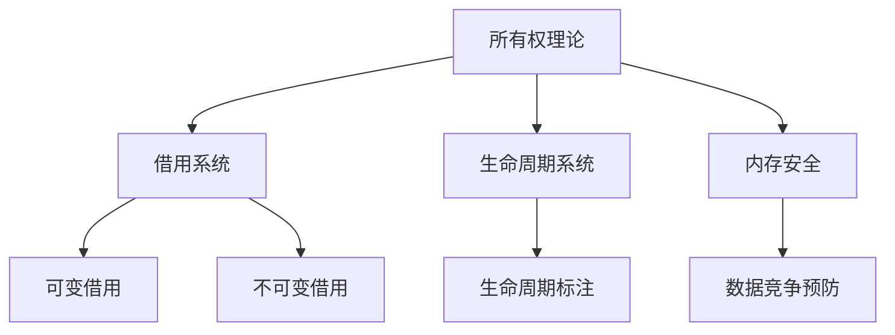
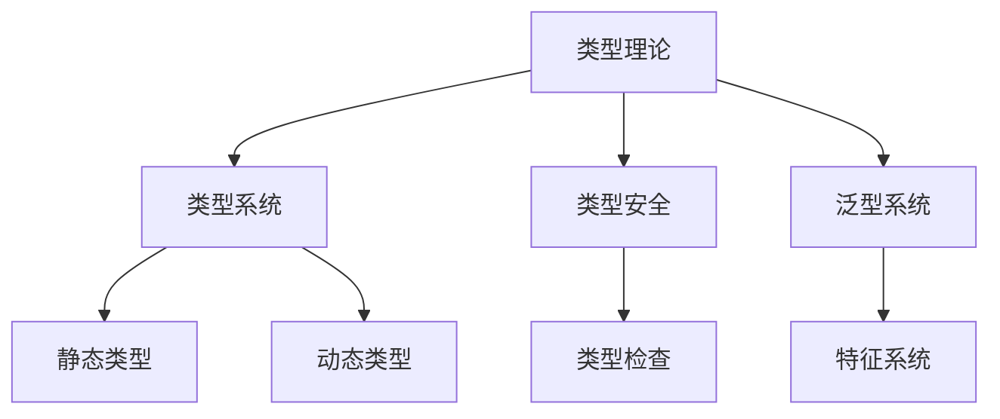
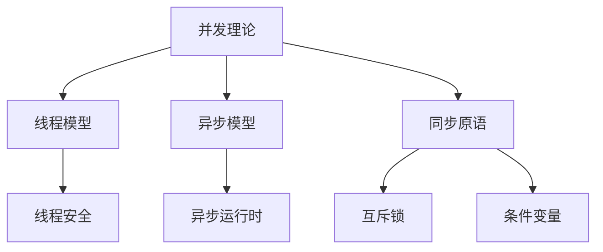

# Rust 形式化工程体系综合分析

## 1. 综合分析框架

### 1.1 分析维度整合

基于前面的分析，我们建立了四个核心维度：

#### 维度1: 分类矩阵 (Classification Matrix)

- **定义**: M[L×F×A] 三维分类矩阵
- **作用**: 建立不交不空不漏的概念分类
- **应用**: 概念定位、分类验证、完整性检查

#### 维度2: 关系图谱 (Relationship Graph)

- **定义**: G = (V, E) 有向图结构
- **作用**: 描述概念间的各种关系
- **应用**: 依赖分析、影响分析、循环检测

#### 维度3: 性质分析 (Property Analysis)

- **定义**: P(c) ⊆ P 概念性质集合
- **作用**: 描述概念的内在和外在性质
- **应用**: 性质推理、性质验证、性质优化

#### 维度4: 层级分类 (Hierarchical Classification)

- **定义**: H = (L, ≤) 层级结构
- **作用**: 建立概念的抽象层次关系
- **应用**: 层级定位、依赖分析、影响分析

### 1.2 综合分析模型

#### 1.2.1 统一表示模型

设 C 为概念集合，则每个概念 c ∈ C 可以表示为：

```
c = (position, relations, properties, hierarchy)
```

其中：

- `position = (i,j,k) ∈ M[L×F×A]` (分类矩阵位置)
- `relations = {r | r ∈ E ∧ (c,*) ∈ r ∨ (*,c) ∈ r}` (关系集合)
- `properties = P(c) ⊆ P` (性质集合)
- `hierarchy = l ∈ L` (层级位置)

#### 1.2.2 综合分析函数

```rust
struct ComprehensiveAnalysis {
    classification_matrix: Matrix<Level, Function, Application>,
    relationship_graph: Graph<Concept, Relation>,
    property_system: PropertySystem,
    hierarchy_structure: Hierarchy<Level>,
}

impl ComprehensiveAnalysis {
    fn analyze_concept(&self, concept: &Concept) -> ConceptAnalysis {
        let position = self.locate_in_matrix(concept);
        let relations = self.find_relations(concept);
        let properties = self.extract_properties(concept);
        let hierarchy = self.determine_hierarchy(concept);
        
        ConceptAnalysis {
            position,
            relations,
            properties,
            hierarchy,
        }
    }
}
```

## 2. 核心概念综合分析

### 2.1 所有权系统综合分析

#### 2.1.1 分类矩阵位置

```
position = (L2, F1, A1)  // 语言设计层, 核心机制, 系统编程
```

#### 2.1.2 关系图谱连接



#### 2.1.3 性质集合

```rust
P(Ownership) = {
    // 固有性质
    uniqueness: "唯一性",
    exclusivity: "排他性",
    transferability: "可转移性",
    
    // 关系性质
    borrowing_basis: "借用基础",
    lifetime_control: "生命周期控制",
    
    // 行为性质
    compile_time_check: "编译时检查",
    zero_cost: "零成本",
    deterministic: "确定性"
}
```

#### 2.1.4 层级位置

```
hierarchy = L2  // 语言设计层
```

### 2.2 类型系统综合分析

#### 2.2.1 分类矩阵位置

```
position = (L1, F2, A1)  // 理论基础层, 安全保证, 系统编程
```

#### 2.2.2 关系图谱连接



#### 2.2.3 性质集合

```rust
P(TypeSystem) = {
    // 固有性质
    static: "静态性",
    nominal: "名义性",
    structural: "结构性",
    
    // 关系性质
    subtype_relation: "子类型关系",
    trait_implementation: "特征实现",
    
    // 行为性质
    type_checking: "类型检查",
    type_inference: "类型推断",
    zero_sized: "零大小"
}
```

#### 2.2.4 层级位置

```
hierarchy = L1  // 理论基础层
```

### 2.3 并发系统综合分析

#### 2.3.1 分类矩阵位置

```
position = (L3, F4, A4)  // 实现机制层, 并发处理, 分布式系统
```

#### 2.3.2 关系图谱连接



#### 2.3.3 性质集合

```rust
P(Concurrency) = {
    // 固有性质
    parallelism: "并行性",
    non_blocking: "非阻塞性",
    interleaving: "交错性",
    
    // 关系性质
    data_race_prevention: "数据竞争预防",
    deadlock_prevention: "死锁预防",
    
    // 行为性质
    thread_safety: "线程安全",
    atomic_operations: "原子操作",
    memory_ordering: "内存序"
}
```

#### 2.3.4 层级位置

```
hierarchy = L3  // 实现机制层
```

## 3. 交叉分析

### 3.1 跨维度分析

#### 3.1.1 分类-关系交叉分析

分析分类矩阵中相邻位置的概念关系：

```rust
fn analyze_classification_relations(matrix: &Matrix) -> Vec<Relation> {
    let mut relations = Vec::new();
    
    for i in 0..matrix.levels() {
        for j in 0..matrix.functions() {
            for k in 0..matrix.applications() {
                let current = matrix.get(i, j, k);
                let neighbors = matrix.get_neighbors(i, j, k);
                
                for neighbor in neighbors {
                    if let Some(relation) = find_relation(current, neighbor) {
                        relations.push(relation);
                    }
                }
            }
        }
    }
    
    relations
}
```

#### 3.1.2 性质-层级交叉分析

分析不同层级概念的性质差异：

```rust
fn analyze_property_hierarchy_differences(
    hierarchy: &Hierarchy,
    properties: &PropertySystem
) -> HashMap<Level, PropertySet> {
    let mut level_properties = HashMap::new();
    
    for level in hierarchy.levels() {
        let concepts = hierarchy.get_concepts(level);
        let mut level_props = PropertySet::new();
        
        for concept in concepts {
            level_props.extend(properties.get_properties(concept));
        }
        
        level_properties.insert(level, level_props);
    }
    
    level_properties
}
```

### 3.2 模式识别

#### 3.2.1 设计模式识别

基于综合分析识别设计模式：

```rust
fn identify_design_patterns(analysis: &ComprehensiveAnalysis) -> Vec<DesignPattern> {
    let mut patterns = Vec::new();
    
    // 识别所有权模式
    if let Some(ownership_pattern) = identify_ownership_pattern(analysis) {
        patterns.push(ownership_pattern);
    }
    
    // 识别类型模式
    if let Some(type_pattern) = identify_type_pattern(analysis) {
        patterns.push(type_pattern);
    }
    
    // 识别并发模式
    if let Some(concurrency_pattern) = identify_concurrency_pattern(analysis) {
        patterns.push(concurrency_pattern);
    }
    
    patterns
}
```

#### 3.2.2 架构模式识别

基于综合分析识别架构模式：

```rust
fn identify_architecture_patterns(analysis: &ComprehensiveAnalysis) -> Vec<ArchitecturePattern> {
    let mut patterns = Vec::new();
    
    // 识别分层架构
    if let Some(layered_pattern) = identify_layered_architecture(analysis) {
        patterns.push(layered_pattern);
    }
    
    // 识别微服务架构
    if let Some(microservice_pattern) = identify_microservice_architecture(analysis) {
        patterns.push(microservice_pattern);
    }
    
    // 识别事件驱动架构
    if let Some(event_driven_pattern) = identify_event_driven_architecture(analysis) {
        patterns.push(event_driven_pattern);
    }
    
    patterns
}
```

## 4. 验证与一致性

### 4.1 跨维度一致性验证

#### 4.1.1 分类-关系一致性

验证分类矩阵中的概念关系是否与关系图谱一致：

```rust
fn verify_classification_relationship_consistency(
    matrix: &Matrix,
    graph: &Graph
) -> ConsistencyResult {
    let mut result = ConsistencyResult::new();
    
    for i in 0..matrix.levels() {
        for j in 0..matrix.functions() {
            for k in 0..matrix.applications() {
                let concept = matrix.get(i, j, k);
                let matrix_relations = matrix.get_relations(i, j, k);
                let graph_relations = graph.get_relations(concept);
                
                if matrix_relations != graph_relations {
                    result.add_inconsistency(
                        Inconsistency::ClassificationRelationshipMismatch {
                            concept,
                            matrix_relations,
                            graph_relations,
                        }
                    );
                }
            }
        }
    }
    
    result
}
```

#### 4.1.2 性质-层级一致性

验证性质在不同层级的一致性：

```rust
fn verify_property_hierarchy_consistency(
    properties: &PropertySystem,
    hierarchy: &Hierarchy
) -> ConsistencyResult {
    let mut result = ConsistencyResult::new();
    
    for level in hierarchy.levels() {
        let concepts = hierarchy.get_concepts(level);
        let level_properties = properties.get_level_properties(level);
        
        for concept in concepts {
            let concept_properties = properties.get_properties(concept);
            
            if !level_properties.is_superset(concept_properties) {
                result.add_inconsistency(
                    Inconsistency::PropertyHierarchyMismatch {
                        concept,
                        level,
                        expected: level_properties,
                        actual: concept_properties,
                    }
                );
            }
        }
    }
    
    result
}
```

### 4.2 完整性验证

#### 4.2.1 概念覆盖完整性

验证所有概念都被正确分类：

```rust
fn verify_concept_coverage_completeness(
    concepts: &[Concept],
    analysis: &ComprehensiveAnalysis
) -> CompletenessResult {
    let mut result = CompletenessResult::new();
    let mut covered = HashSet::new();
    
    // 检查分类矩阵覆盖
    for concept in concepts {
        if let Some(position) = analysis.locate_in_matrix(concept) {
            covered.insert(concept);
        } else {
            result.add_missing(Missing::ClassificationMatrix(concept));
        }
    }
    
    // 检查关系图谱覆盖
    for concept in concepts {
        if analysis.has_relations(concept) {
            covered.insert(concept);
        } else {
            result.add_missing(Missing::RelationshipGraph(concept));
        }
    }
    
    // 检查性质系统覆盖
    for concept in concepts {
        if analysis.has_properties(concept) {
            covered.insert(concept);
        } else {
            result.add_missing(Missing::PropertySystem(concept));
        }
    }
    
    // 检查层级结构覆盖
    for concept in concepts {
        if analysis.has_hierarchy(concept) {
            covered.insert(concept);
        } else {
            result.add_missing(Missing::HierarchyStructure(concept));
        }
    }
    
    result
}
```

## 5. 应用与扩展

### 5.1 知识发现

#### 5.1.1 隐含关系发现

基于综合分析发现隐含的概念关系：

```rust
fn discover_implicit_relations(analysis: &ComprehensiveAnalysis) -> Vec<ImplicitRelation> {
    let mut implicit_relations = Vec::new();
    
    // 基于性质相似性发现关系
    let property_similarities = analysis.find_property_similarities();
    for similarity in property_similarities {
        if similarity.strength > THRESHOLD {
            implicit_relations.push(ImplicitRelation::PropertyBased(similarity));
        }
    }
    
    // 基于层级邻近性发现关系
    let hierarchy_proximities = analysis.find_hierarchy_proximities();
    for proximity in hierarchy_proximities {
        if proximity.distance < THRESHOLD {
            implicit_relations.push(ImplicitRelation::HierarchyBased(proximity));
        }
    }
    
    // 基于分类矩阵模式发现关系
    let matrix_patterns = analysis.find_matrix_patterns();
    for pattern in matrix_patterns {
        implicit_relations.push(ImplicitRelation::PatternBased(pattern));
    }
    
    implicit_relations
}
```

#### 5.1.2 知识缺口识别

识别知识体系中的缺口：

```rust
fn identify_knowledge_gaps(analysis: &ComprehensiveAnalysis) -> Vec<KnowledgeGap> {
    let mut gaps = Vec::new();
    
    // 检查分类矩阵缺口
    let matrix_gaps = analysis.find_matrix_gaps();
    gaps.extend(matrix_gaps);
    
    // 检查关系图谱缺口
    let graph_gaps = analysis.find_graph_gaps();
    gaps.extend(graph_gaps);
    
    // 检查性质系统缺口
    let property_gaps = analysis.find_property_gaps();
    gaps.extend(property_gaps);
    
    // 检查层级结构缺口
    let hierarchy_gaps = analysis.find_hierarchy_gaps();
    gaps.extend(hierarchy_gaps);
    
    gaps
}
```

### 5.2 动态扩展

#### 5.2.1 新概念集成

将新概念集成到综合分析框架中：

```rust
fn integrate_new_concept(
    concept: &Concept,
    analysis: &mut ComprehensiveAnalysis
) -> IntegrationResult {
    let mut result = IntegrationResult::new();
    
    // 确定分类矩阵位置
    if let Some(position) = analysis.determine_matrix_position(concept) {
        analysis.add_to_matrix(concept, position);
        result.add_success(Success::MatrixIntegration(position));
    } else {
        result.add_failure(Failure::MatrixPositionUndetermined);
    }
    
    // 建立关系连接
    let relations = analysis.determine_relations(concept);
    for relation in relations {
        analysis.add_relation(concept, relation);
        result.add_success(Success::RelationIntegration(relation));
    }
    
    // 提取性质
    let properties = analysis.extract_properties(concept);
    analysis.add_properties(concept, properties);
    result.add_success(Success::PropertyIntegration(properties));
    
    // 确定层级位置
    if let Some(hierarchy) = analysis.determine_hierarchy(concept) {
        analysis.add_to_hierarchy(concept, hierarchy);
        result.add_success(Success::HierarchyIntegration(hierarchy));
    } else {
        result.add_failure(Failure::HierarchyPositionUndetermined);
    }
    
    result
}
```

#### 5.2.2 框架演化

支持综合分析框架的演化：

```rust
fn evolve_analysis_framework(
    analysis: &mut ComprehensiveAnalysis,
    evolution: &FrameworkEvolution
) -> EvolutionResult {
    let mut result = EvolutionResult::new();
    
    match evolution {
        FrameworkEvolution::AddDimension(dimension) => {
            analysis.add_dimension(dimension);
            result.add_success(Success::DimensionAdded(dimension));
        },
        FrameworkEvolution::RefineClassification(refinement) => {
            analysis.refine_classification(refinement);
            result.add_success(Success::ClassificationRefined(refinement));
        },
        FrameworkEvolution::ExtendRelations(relations) => {
            analysis.extend_relations(relations);
            result.add_success(Success::RelationsExtended(relations));
        },
        FrameworkEvolution::EnhanceProperties(properties) => {
            analysis.enhance_properties(properties);
            result.add_success(Success::PropertiesEnhanced(properties));
        },
        FrameworkEvolution::RestructureHierarchy(restructure) => {
            analysis.restructure_hierarchy(restructure);
            result.add_success(Success::HierarchyRestructured(restructure));
        },
    }
    
    result
}
```
