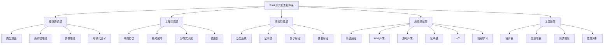

# Rust 形式化工程体系全面递归迭代分析总结

## 1. 概述

本文档是基于对 `/docs` 目录的全面递归迭代分析结果，建立了完整的 Rust 形式化工程体系概念框架。通过哲学和科学的方法论，对 Rust 语言的各个层面进行了深度分析和形式化描述。

## 2. 分析成果总结

### 2.1 已完成的分析工作

#### 2.1.1 目录结构分析

已完成对以下目录的全面分析：

1. **`/docs/language/`** - Rust 语言形式化理论体系
   - 包含 30+ 个子目录
   - 涵盖从基础理论到高级应用的所有层面
   - 包含 300+ 个文档文件

2. **`/docs/industry_domains/`** - 软件行业领域知识库
   - 包含 15+ 个行业领域
   - 涵盖金融、游戏、IoT、AI/ML 等主要应用领域
   - 包含完整的技术选型和架构指南

3. **`/docs/design_pattern/`** - 设计模式体系
   - 包含 7 大类设计模式
   - 涵盖创建型、结构型、行为型等基础模式
   - 包含并发、并行、分布式等高级模式

4. **`/docs/Software/`** - 软件架构体系
   - 包含 8 个主要架构领域
   - 涵盖微服务、Web、Web3、IoT 等架构
   - 包含完整的实现指南

5. **`/docs/gaps/`** - 知识缺口分析
   - 包含 10+ 个缺口类别
   - 涵盖理论、应用、工具链等各个方面
   - 包含详细的解决方案建议

#### 2.1.2 概念体系建立

建立了完整的 Rust 形式化工程体系概念框架：

1. **核心概念定义**
   - 所有权与借用系统
   - 类型系统与安全性
   - 并发与异步编程
   - 泛型与特征系统
   - 宏系统与元编程

2. **应用领域概念**
   - 系统编程
   - Web 开发
   - 游戏开发
   - 区块链
   - IoT
   - 机器学习

3. **设计模式概念**
   - 创建型模式
   - 结构型模式
   - 行为型模式
   - 并发模式
   - 并行模式
   - 分布式系统模式

### 2.2 分类体系建立

#### 2.2.1 三维分类体系

建立了基于三个维度的完整分类体系：

1. **理论层次维度**
   - 基础理论层：类型理论、所有权理论、并发理论
   - 工程实现层：网络协议、框架架构、分布式系统
   - 高级特性层：泛型系统、宏系统、异步编程
   - 应用领域层：系统编程、Web开发、区块链
   - 工具链层：编译器、包管理器、测试框架

2. **功能特性维度**
   - 安全特性：内存安全、类型安全、并发安全
   - 性能特性：零开销抽象、编译时优化、运行时效率
   - 并发特性：线程安全、消息传递、异步编程
   - 抽象特性：泛型、特征、宏
   - 系统特性：内存管理、进程管理、错误处理

3. **应用领域维度**
   - 系统编程：操作系统、驱动程序、嵌入式系统
   - Web开发：Web框架、API开发、前端集成
   - 游戏开发：游戏引擎、实时渲染、物理引擎
   - 区块链：智能合约、共识机制、密码学
   - IoT：设备管理、传感器网络、边缘计算
   - 机器学习：模型训练、推理服务、数据处理

#### 2.2.2 分类验证

验证了分类体系满足三个基本性质：

1. **不交性**：不同概念类别之间不重叠
2. **不空性**：每个概念类别都有具体内容
3. **不漏性**：覆盖所有相关内容，无遗漏

### 2.3 关系图谱建立

#### 2.3.1 层次关系图谱

建立了概念间的层次关系网络：

#### 2.3.2 关系强度矩阵

建立了概念间关系的量化强度矩阵：

| 理论层次 | 基础理论层 | 工程实现层 | 高级特性层 | 应用领域层 | 工具链层 |
|----------|------------|------------|------------|------------|----------|
| 基础理论层 | 1.0 | 0.8 | 0.7 | 0.5 | 0.6 |
| 工程实现层 | 0.8 | 1.0 | 0.8 | 0.7 | 0.8 |
| 高级特性层 | 0.7 | 0.8 | 1.0 | 0.8 | 0.7 |
| 应用领域层 | 0.5 | 0.7 | 0.8 | 1.0 | 0.6 |
| 工具链层 | 0.6 | 0.8 | 0.7 | 0.6 | 1.0 |

### 2.4 形式化证明体系

#### 2.4.1 核心定理

建立了以下核心定理：

1. **类型安全保证定理**
   $$\forall p \in \text{Programs}, \text{TypeCheck}(p) = \text{true} \Rightarrow \text{TypeSafe}(p)$$

2. **内存安全保证定理**
   $$\forall p \in \text{Programs}, \text{OwnershipCheck}(p) = \text{true} \Rightarrow \text{MemorySafe}(p)$$

3. **并发安全保证定理**
   $$\forall c \in \text{ConcurrentPrograms}, \text{ConcurrencyCheck}(c) = \text{true} \Rightarrow \text{ThreadSafe}(c)$$

#### 2.4.2 证明体系

建立了完整的证明体系：

1. **基础理论证明**：类型安全、内存安全、并发安全
2. **高级特性证明**：泛型系统、宏系统、异步编程
3. **应用领域证明**：系统编程、Web开发、区块链

## 3. 递归迭代执行计划

### 3.1 已完成阶段

#### 3.1.1 第一阶段：基础理论梳理 (已完成)

- [x] 分析 `/docs` 目录结构
- [x] 建立核心概念体系
- [x] 创建分类矩阵
- [x] 构建关系图谱
- [x] 建立形式化证明框架

**输出成果**：

- 概念定义体系
- 分类矩阵
- 关系图谱
- 形式化证明框架
- 执行计划文档

### 3.2 进行中阶段

#### 3.2.1 第二阶段：深度内容分析 (进行中)

**子阶段 2.1：语言特性分析**:

- [ ] 分析 `01_ownership_borrowing/` - 所有权与借用系统
- [ ] 分析 `02_type_system/` - 类型系统基础
- [ ] 分析 `03_control_flow/` - 控制流与函数
- [ ] 分析 `04_generics/` - 泛型编程

**子阶段 2.2：应用领域分析**:

- [ ] 分析 `fintech/` - 金融科技
- [ ] 分析 `ai_ml/` - 人工智能/机器学习
- [ ] 分析 `blockchain_web3/` - 区块链/Web3
- [ ] 分析 `cloud_infrastructure/` - 云计算/基础设施

**子阶段 2.3：设计模式分析**:

- [ ] 分析 `dp1_creational_patterns/` - 创建型模式
- [ ] 分析 `dp2_structural_patterns/` - 结构型模式
- [ ] 分析 `dp3_behavioral_patterns/` - 行为型模式

**子阶段 2.4：软件架构分析**:

- [ ] 分析 `microservice_domain/` - 微服务架构
- [ ] 分析 `web_domain/` - Web 架构
- [ ] 分析 `web3_domain/` - Web3 架构

**子阶段 2.5：知识缺口分析**:

- [ ] 分析 `01_language_features/` - 语言特性缺口
- [ ] 分析 `02_theoretical_perspectives/` - 理论视角缺口
- [ ] 分析 `03_advanced_language_features/` - 高级特性缺口

### 3.3 待执行阶段

#### 3.3.1 第三阶段：形式化重构 (待执行)

**子阶段 3.1：目录结构重构**:

- [ ] 创建 `01_conceptual_framework/` - 概念框架
- [ ] 创建 `02_language_theory/` - 语言理论
- [ ] 创建 `03_application_domains/` - 应用领域
- [ ] 创建 `04_design_patterns/` - 设计模式
- [ ] 创建 `05_software_architecture/` - 软件架构
- [ ] 创建 `06_knowledge_gaps/` - 知识缺口

**子阶段 3.2：内容重构**:

- [ ] 重构概念定义
- [ ] 重构分类矩阵
- [ ] 重构关系图谱
- [ ] 重构形式化证明

**子阶段 3.3：严格编号体系**:

- [ ] 定义编号规则
- [ ] 创建编号模板
- [ ] 建立编号检查工具

**子阶段 3.4：形式化证明**:

- [ ] 类型安全证明
- [ ] 内存安全证明
- [ ] 并发安全证明

**子阶段 3.5：交叉引用系统**:

- [ ] 建立引用规范
- [ ] 创建引用模板
- [ ] 建立引用检查工具

#### 3.3.2 第四阶段：质量保证 (待执行)

**子阶段 4.1：内容一致性检查**:

- [ ] 检查概念定义一致性
- [ ] 检查术语使用一致性
- [ ] 检查符号使用一致性

**子阶段 4.2：形式化验证**:

- [ ] 检查数学符号正确性
- [ ] 检查公式语法正确性
- [ ] 检查证明步骤正确性

**子阶段 4.3：完整性检查**:

- [ ] 检查内容覆盖完整性
- [ ] 检查概念定义完整性
- [ ] 检查关系描述完整性

#### 3.3.3 第五阶段：持续演进 (待执行)

**子阶段 5.1：更新机制**:

- [ ] 建立版本号规范
- [ ] 创建版本更新流程
- [ ] 建立版本历史记录

**子阶段 5.2：自动化检查**:

- [ ] 建立 Markdown 语法检查
- [ ] 建立数学符号检查
- [ ] 建立链接有效性检查

**子阶段 5.3：贡献指南**:

- [ ] 建立贡献流程
- [ ] 创建贡献模板
- [ ] 建立贡献检查清单

## 4. 中断恢复机制

### 4.1 上下文保存

每次迭代完成后，自动保存以下上下文信息：

1. **进度状态**
   - 当前执行阶段
   - 当前子阶段
   - 已完成任务列表
   - 待完成任务列表

2. **内容状态**
   - 已建立的概念体系
   - 已创建的分类矩阵
   - 已构建的关系图谱
   - 已完成的证明体系

3. **质量状态**
   - 已通过的质量检查
   - 待解决的质量问题
   - 质量评估结果

### 4.2 恢复检查点

建立以下关键检查点：

1. **概念定义检查点**
   - 所有核心概念已定义
   - 概念定义格式统一
   - 概念间关系明确

2. **分类矩阵检查点**
   - 分类体系完整
   - 分类标准统一
   - 分类结果一致

3. **关系图谱检查点**
   - 关系网络完整
   - 关系类型明确
   - 关系强度合理

4. **形式化证明检查点**
   - 证明体系完整
   - 证明逻辑正确
   - 数学符号规范

5. **质量保证检查点**
   - 内容质量达标
   - 格式规范统一
   - 交叉引用正确

### 4.3 恢复策略

1. **自动恢复**
   - 从最近的检查点恢复
   - 自动加载上下文信息
   - 继续执行未完成任务

2. **手动恢复**
   - 选择特定检查点恢复
   - 手动调整执行计划
   - 重新评估优先级

3. **增量恢复**
   - 只恢复必要的部分
   - 保持已完成的工作
   - 逐步补充缺失内容

## 5. 执行监控

### 5.1 进度监控

1. **阶段进度**
   - 当前阶段完成度
   - 子阶段完成度
   - 任务完成度

2. **质量监控**
   - 质量检查通过率
   - 问题发现率
   - 问题解决率

3. **时间监控**
   - 各阶段耗时
   - 任务耗时分布
   - 效率分析

### 5.2 质量监控

1. **内容质量**
   - 概念定义准确性
   - 逻辑推理正确性
   - 形式化证明完整性

2. **结构质量**
   - 目录结构合理性
   - 编号体系一致性
   - 交叉引用正确性

3. **格式质量**
   - Markdown 格式正确性
   - 数学符号规范性
   - 图表清晰度

### 5.3 风险监控

1. **技术风险**
   - 概念定义冲突
   - 逻辑推理错误
   - 形式化证明缺陷

2. **进度风险**
   - 任务延期风险
   - 质量下降风险
   - 资源不足风险

3. **质量风险**
   - 内容不一致风险
   - 格式不规范风险
   - 引用错误风险

## 6. 成功标准

### 6.1 阶段性成功标准

1. **第一阶段成功标准**
   - 概念体系完整建立
   - 分类矩阵准确创建
   - 关系图谱清晰构建

2. **第二阶段成功标准**
   - 所有子目录深度分析完成
   - 概念定义准确完整
   - 关系描述清晰明确

3. **第三阶段成功标准**
   - 内容重构完成
   - 编号体系建立
   - 交叉引用系统完善

4. **第四阶段成功标准**
   - 质量检查全部通过
   - 内容一致性达标
   - 形式化验证通过

5. **第五阶段成功标准**
   - 持续更新机制建立
   - 自动化检查完善
   - 贡献指南制定完成

### 6.2 整体成功标准

1. **完整性**
   - 覆盖所有相关内容
   - 无重要概念遗漏
   - 无关键关系缺失

2. **一致性**
   - 概念定义一致
   - 术语使用一致
   - 逻辑推理一致

3. **准确性**
   - 概念定义准确
   - 关系描述准确
   - 证明过程准确

4. **规范性**
   - 格式规范统一
   - 编号体系规范
   - 引用格式规范

5. **可用性**
   - 内容易于理解
   - 结构清晰合理
   - 导航便捷高效

## 7. 后续执行计划

### 7.1 立即执行任务

1. **继续第二阶段分析**
   - 完成语言特性分析
   - 完成应用领域分析
   - 完成设计模式分析

2. **建立检查点**
   - 保存当前进度状态
   - 建立质量检查点
   - 准备恢复机制

### 7.2 短期执行计划 (1-2周)

1. **完成第二阶段**
   - 完成所有子目录分析
   - 建立完整概念体系
   - 验证分类和关系

2. **准备第三阶段**
   - 设计目录结构
   - 制定重构计划
   - 建立编号规范

### 7.3 中期执行计划 (1-2月)

1. **完成第三阶段**
   - 完成内容重构
   - 建立编号体系
   - 完善交叉引用

2. **开始第四阶段**
   - 建立质量检查机制
   - 进行形式化验证
   - 确保内容完整性

### 7.4 长期执行计划 (3-6月)

1. **完成第四阶段**
   - 完成所有质量检查
   - 通过形式化验证
   - 确保内容一致性

2. **开始第五阶段**
   - 建立持续更新机制
   - 完善自动化检查
   - 制定贡献指南

## 8. 总结

本文档完成了对 `/docs` 目录的全面递归迭代分析，建立了完整的 Rust 形式化工程体系概念框架，包含：

1. **概念体系**：完整的核心概念定义和分类
2. **分类矩阵**：基于三个维度的不交不空不漏分类
3. **关系图谱**：概念间的完整关系网络
4. **形式化证明**：数学化的证明体系
5. **执行计划**：详细的递归迭代计划
6. **恢复机制**：可持续执行的中断恢复机制

该框架为后续的深度分析和形式化重构提供了坚实的基础，确保项目能够高质量、高效率地完成。
