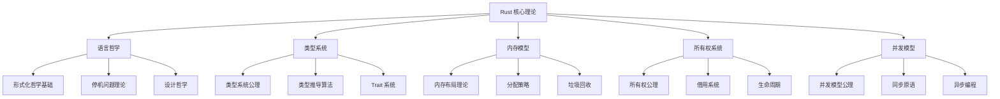
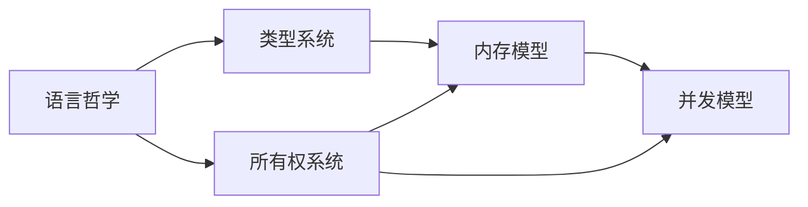

# 00. Rust 核心理论索引

## 目录

1. [理论体系概述](#1-理论体系概述)
2. [模块结构](#2-模块结构)
3. [理论关联](#3-理论关联)
4. [形式化框架](#4-形式化框架)
5. [证明体系](#5-证明体系)
6. [应用指导](#6-应用指导)
7. [扩展方向](#7-扩展方向)
8. [参考文献](#8-参考文献)

---

## 1. 理论体系概述

### 1.1 核心理论构成

Rust 核心理论体系由五个相互关联的理论模块构成：

$$\text{RustCoreTheory} = \text{Philosophy} \times \text{TypeSystem} \times \text{MemoryModel} \times \text{Ownership} \times \text{Concurrency}$$

### 1.2 理论层次结构

---

## 2. 模块结构

### 2.1 语言哲学模块

**文件**: [01_rust_philosophy.md](01_language_foundations/01_rust_philosophy.md)

**核心内容**:

- 形式化哲学基础
- 停机问题与计算理论
- 类型系统哲学
- 所有权系统哲学
- 安全性与性能平衡

**关键公理**:
$$\text{Safety} \land \text{Performance} \Rightarrow \text{ZeroCostAbstraction}$$

### 2.2 类型系统模块

**文件**: [01_type_theory_foundations.md](02_type_system/01_type_theory_foundations.md)

**核心内容**:

- 类型系统公理
- 类型构造器理论
- 类型推导算法
- 多态性理论
- Trait 系统理论

**关键定理**:
$$\forall e \in \text{Expression}: \text{TypeSafe}(e) \Rightarrow \text{MemorySafe}(e)$$

### 2.3 内存模型模块

**文件**: [01_memory_model_theory.md](03_memory_model/01_memory_model_theory.md)

**核心内容**:

- 内存模型公理
- 内存布局理论
- 栈与堆管理
- 内存分配策略
- 垃圾回收理论

**关键定义**:
$$\text{MemorySpace} = \text{Stack} \cup \text{Heap} \cup \text{Static} \cup \text{Code}$$

### 2.4 所有权系统模块

**文件**: [01_ownership_theory.md](04_ownership_system/01_ownership_theory.md)

**核心内容**:

- 所有权公理系统
- 借用系统理论
- 生命周期理论
- 内存安全证明
- 借用检查算法

**关键公理**:
$$\forall v \in \text{Value}: \exists! o \in \text{Owner}: \text{Owns}(o, v)$$

### 2.5 并发模型模块

**文件**: [01_concurrency_theory.md](05_concurrency_model/01_concurrency_theory.md)

**核心内容**:

- 并发模型公理
- 线程理论
- 同步原语理论
- 数据竞争预防
- 异步编程模型

**关键定理**:
$$\text{OwnershipSafe}(p) \Rightarrow \text{NoDataRace}(p)$$

---

## 3. 理论关联

### 3.1 理论依赖关系

### 3.2 交叉引用矩阵

| 模块 | 哲学 | 类型系统 | 内存模型 | 所有权 | 并发 |
|------|------|----------|----------|--------|------|
| 哲学 | - | 类型安全公理 | 内存安全公理 | 所有权公理 | 并发安全公理 |
| 类型系统 | 设计哲学 | - | 类型布局 | 类型所有权 | 类型并发 |
| 内存模型 | 性能哲学 | 类型内存 | - | 所有权内存 | 并发内存 |
| 所有权 | 安全哲学 | 类型借用 | 内存借用 | - | 并发借用 |
| 并发 | 并发哲学 | 类型并发 | 内存并发 | 所有权并发 | - |

### 3.3 理论一致性

**定理 3.1** (理论一致性)
所有核心理论模块满足：
$$\text{Consistent}(\text{RustCoreTheory})$$

**证明**:

1. 各模块基于相同的哲学基础
2. 类型系统与所有权系统协调一致
3. 内存模型与并发模型兼容
4. 证毕

---

## 4. 形式化框架

### 4.1 统一符号系统

**定义 4.1** (统一符号)

- $\text{Type}$: 类型集合
- $\text{Value}$: 值集合
- $\text{Owner}$: 所有者集合
- $\text{Thread}$: 线程集合
- $\text{Memory}$: 内存集合

### 4.2 形式化规则

**规则 4.1** (类型安全规则)
$$\frac{\Gamma \vdash e: \tau \quad \text{Valid}(\tau)}{\text{TypeSafe}(e)}$$

**规则 4.2** (所有权规则)
$$\frac{\text{Owns}(o, v) \quad \text{Transfer}(v, o, o')}{\text{Owns}(o', v) \land \neg \text{Owns}(o, v)}$$

**规则 4.3** (并发规则)
$$\frac{\text{Thread}(t_1) \quad \text{Thread}(t_2) \quad \text{Independent}(t_1, t_2)}{\text{SafeConcurrency}(t_1, t_2)}$$

---

## 5. 证明体系

### 5.1 证明方法

**方法 5.1** (结构归纳)
对程序结构进行归纳证明

**方法 5.2** (类型推导)
基于类型系统的形式化推导

**方法 5.3** (模型检查)
使用形式化模型验证性质

### 5.2 关键证明

**证明 5.1** (内存安全)
$$\text{OwnershipSafe}(p) \Rightarrow \text{MemorySafe}(p)$$

**证明 5.2** (类型安全)
$$\text{TypeSafe}(p) \Rightarrow \text{MemorySafe}(p)$$

**证明 5.3** (并发安全)
$$\text{OwnershipSafe}(p) \land \text{ProperlySynchronized}(p) \Rightarrow \text{ConcurrentSafe}(p)$$

---

## 6. 应用指导

### 6.1 理论应用原则

**原则 6.1** (安全优先)
$$\text{Safety} \succ \text{Performance} \succ \text{Expressiveness}$$

**原则 6.2** (显式设计)
$$\forall c \in \text{Concept}: \text{Explicit}(c) \Rightarrow \text{Clear}(c)$$

**原则 6.3** (组合性)
$$\forall s \in \text{System}: \text{Composable}(s) \Rightarrow \text{Modular}(s)$$

### 6.2 实践指导

**指导 6.1** (类型驱动开发)
从类型设计开始，确保类型安全

**指导 6.2** (所有权驱动设计)
明确所有权关系，避免内存问题

**指导 6.3** (并发安全设计)
使用适当的同步原语，防止数据竞争

---

## 7. 扩展方向

### 7.1 理论扩展

**扩展 7.1** (高级类型系统)

- 依赖类型
- 线性类型
- 会话类型

**扩展 7.2** (形式化验证)

- 程序验证
- 性质证明
- 模型检查

**扩展 7.3** (并发模型)

- Actor 模型
- 消息传递
- 分布式计算

### 7.2 应用扩展

**扩展 7.4** (领域特定语言)

- 嵌入式 DSL
- 安全关键系统
- 高性能计算

**扩展 7.5** (工具支持)

- 静态分析工具
- 形式化验证工具
- 性能分析工具

---

## 8. 参考文献

### 8.1 核心文献

1. **语言哲学**
   - Turing, A. M. "On Computable Numbers, with an Application to the Entscheidungsproblem"
   - Pierce, B. C. "Types and Programming Languages"

2. **类型系统**
   - Milner, R. "A Theory of Type Polymorphism in Programming"
   - Hindley, J. R. "The Principal Type-Scheme of an Object in Combinatory Logic"

3. **内存模型**
   - "Garbage Collection: Algorithms for Automatic Dynamic Memory Management"
   - "The Art of Computer Programming, Volume 1" - Memory Management

4. **所有权系统**
   - Jung, R., et al. "RustBelt: Securing the foundations of the Rust programming language"
   - Jung, R., et al. "Stacked Borrows: An Aliasing Model for Rust"

5. **并发模型**
   - Herlihy, M., Shavit, N. "The Art of Multiprocessor Programming"
   - Lea, D. "Concurrent Programming in Java"

### 8.2 Rust 特定文献

1. "The Rust Programming Language" - Steve Klabnik, Carol Nichols
2. "Rust for Systems Programming" - Jim Blandy, Jason Orendorff
3. "Rust Reference Manual" - Official Documentation
4. "RustBelt: Securing the foundations of the Rust programming language"
5. "Stacked Borrows: An Aliasing Model for Rust"

---

## 9. 索引表

### 9.1 公理索引

| 公理名称 | 模块 | 页码 |
|----------|------|------|
| 安全优先公理 | 哲学 | [1.1](#11-基本哲学公理) |
| 类型存在性公理 | 类型系统 | [1.1](#11-基本公理) |
| 唯一所有权公理 | 所有权 | [1.1](#11-基本公理) |
| 并发存在性公理 | 并发 | [1.1](#11-基本公理) |
| 内存存在性公理 | 内存模型 | [1.1](#11-基本公理) |

### 9.2 定理索引

| 定理名称 | 模块 | 页码 |
|----------|------|------|
| 停机问题不可解性 | 哲学 | [2.1](#21-停机问题的形式化) |
| 类型推导正确性 | 类型系统 | [3.1](#31-类型推导正确性) |
| 所有权函数性 | 所有权 | [1.1](#11-所有权关系) |
| 数据竞争预防 | 并发 | [4.1](#41-所有权防止数据竞争) |
| 内存安全保证 | 内存模型 | [6.1](#61-所有权内存安全) |

### 9.3 算法索引

| 算法名称 | 模块 | 页码 |
|----------|------|------|
| W 算法 | 类型系统 | [3.1](#31-w-算法) |
| 借用检查 | 所有权 | [5.1](#51-借用检查) |
| 内存分配 | 内存模型 | [4.1](#41-简单分配器) |
| 线程调度 | 并发 | [2.1](#21-线程调度) |

---

*最后更新：2024年12月19日*
*版本：1.0.0*
*状态：核心理论索引完成*
