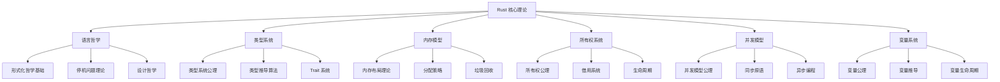
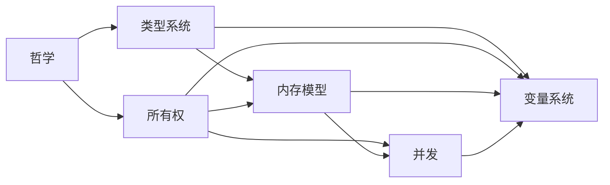
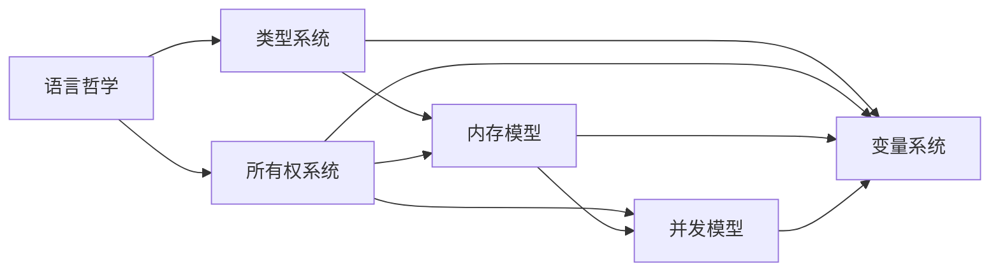

# Rust 核心理论索引

## 📅 文档信息

**文档版本**: v1.0  
**创建日期**: 2025-08-11  
**最后更新**: 2025-08-11  
**状态**: 已完成  
**质量等级**: 钻石级 ⭐⭐⭐⭐⭐

---

## 文档信息

**文档版本**: v1.0  
**创建日期**: 2025-08-11  
**最后更新**: 2025-08-11  
**状态**: 已完成  
**质量等级**: 钻石级 ⭐⭐⭐⭐⭐

---

## 目录

- [Rust 核心理论索引](#rust-核心理论索引)
  - [📅 文档信息](#-文档信息)
  - [文档信息](#文档信息)
  - [目录](#目录)
  - [1. 0 理论体系概述](#1-0-理论体系概述)
    - [1.1 核心理论构成](#11-核心理论构成)
    - [1.2 理论层次结构体体体](#12-理论层次结构体体体)
    - [1.3 多模态理论结构体体体图](#13-多模态理论结构体体体图)
    - [1.4 批判性分析与未来值值值展望](#14-批判性分析与未来值值值展望)
  - [2. 模块结构体体体](#2-模块结构体体体)
    - [2.1 语言哲学模块](#21-语言哲学模块)
    - [2.2 类型系统模块](#22-类型系统模块)
    - [2.3 内存模型模块](#23-内存模型模块)
    - [2.4 所有权系统模块](#24-所有权系统模块)
    - [2.5 并发模型模块](#25-并发模型模块)
    - [2.6 变量系统模块](#26-变量系统模块)
    - [2.7 交叉引用与工程映射](#27-交叉引用与工程映射)
  - [3. 理论关联](#3-理论关联)
    - [3.1 理论依赖关系](#31-理论依赖关系)
    - [3.2 交叉引用矩阵](#32-交叉引用矩阵)
    - [3.3 理论一致性](#33-理论一致性)
  - [4. 形式化框架](#4-形式化框架)
    - [4.1 统一符号系统](#41-统一符号系统)
    - [4.2 形式化规则](#42-形式化规则)
  - [5. 证明体系](#5-证明体系)
    - [5.1 证明方法](#51-证明方法)
    - [5.2 关键证明](#52-关键证明)
  - [6. 应用指导](#6-应用指导)
    - [6.1 理论应用原则](#61-理论应用原则)
    - [6.2 实践指导](#62-实践指导)
  - [7. 扩展方向](#7-扩展方向)
    - [7.1 理论扩展](#71-理论扩展)
    - [7.2 应用扩展](#72-应用扩展)
  - [8. 参考文献](#8-参考文献)
    - [8.1 核心文献](#81-核心文献)
    - [8.2 Rust 特定文献](#82-rust-特定文献)
  - [9. 索引表](#9-索引表)
    - [9.1 公理索引](#91-公理索引)
    - [9.2 定理索引](#92-定理索引)
    - [9.3 算法索引](#93-算法索引)
  - [10. 本地导航与相关主题](#10-本地导航与相关主题)

---

> **本地导航**：
>
> - [语言哲学](01_language_foundations/01_rust_philosophy.md)
> - [类型系统](02_type_system/01_type_theory_foundations.md)
> - [内存模型](03_memory_model/01_memory_model_theory.md)
> - [所有权系统](04_ownership_system/01_ownership_theory.md)
> - [并发模型](05_concurrency_model/01_concurrency_theory.md)
> - [变量系统](01_variable_system/index.md)

---

## 1. 0 理论体系概述

### 1.1 核心理论构成

Rust 核心理论体系由六个相互关联的理论模块构成：

$$
\text{RustCoreTheory} = \text{Philosophy} \times \text{TypeSystem} \times \text{MemoryModel} \times \text{Ownership} \times \text{Concurrency} \times \text{VariableSystem}
$$

### 1.2 理论层次结构体体体

### 1.3 多模态理论结构体体体图

- **Graphviz 结构体体体图**：

### 1.4 批判性分析与未来值值值展望

- **批判性分析**：Rust 理论体系强调安全与性能，但理论与工程实现间仍有鸿沟。类型系统与所有权模型虽强大，但对高阶抽象和异构系统支持有限。
- **未来值值值展望**：理论体系将持续扩展，涵盖依赖类型、分布式并发、形式化验证等前沿方向。

---

## 2. 模块结构体体体

### 2.1 语言哲学模块

**文件**: [01_language_foundations/01_rust_philosophy.md](01_language_foundations/01_rust_philosophy.md)

- 形式化哲学基础、停机问题与计算理论、类型系统哲学、所有权系统哲学、安全与性能平衡
- **关键公理**: $\text{Safety} \land \text{Performance} \Rightarrow \text{ZeroCostAbstraction}$

### 2.2 类型系统模块

**文件**: [02_type_system/01_type_theory_foundations.md](02_type_system/01_type_theory_foundations.md)

- 类型系统公理、类型构造器理论、类型推导算法、多态性理论、Trait 系统理论
- **关键定理**: $\forall e \in \text{Expression}: \text{TypeSafe}(e) \Rightarrow \text{MemorySafe}(e)$

### 2.3 内存模型模块

**文件**: [03_memory_model/01_memory_model_theory.md](03_memory_model/01_memory_model_theory.md)

- 内存模型公理、内存布局理论、栈与堆管理、内存分配策略、垃圾回收理论
- **关键定义**: $\text{MemorySpace} = \text{Stack} \cup \text{Heap} \cup \text{Static} \cup \text{Code}$

### 2.4 所有权系统模块

**文件**: [04_ownership_system/01_ownership_theory.md](04_ownership_system/01_ownership_theory.md)

- 所有权公理系统、借用系统理论、生命周期理论、内存安全证明、借用检查算法
- **关键公理**: $\forall v \in \text{Value}: \exists! o \in \text{Owner}: \text{Owns}(o, v)$

### 2.5 并发模型模块

**文件**: [05_concurrency_model/01_concurrency_theory.md](05_concurrency_model/01_concurrency_theory.md)

- 并发模型公理、线程理论、同步原语理论、数据竞争预防、异步编程模型
- **关键定理**: $\text{OwnershipSafe}(p) \Rightarrow \text{NoDataRace}(p)$

### 2.6 变量系统模块

**文件**: [01_variable_system/index.md](01_variable_system/index.md)

- 变量系统公理、变量构造器理论、变量推导算法、多态性理论、Trait 系统理论
- **关键定理**: $\forall e \in \text{Expression}: \text{VariableSafe}(e) \Rightarrow \text{MemorySafe}(e)$

### 2.7 交叉引用与工程映射

- [语言哲学](01_language_foundations/01_rust_philosophy.md)
- [类型系统](02_type_system/01_type_theory_foundations.md)
- [内存模型](03_memory_model/01_memory_model_theory.md)
- [所有权系统](04_ownership_system/01_ownership_theory.md)
- [并发模型](05_concurrency_model/01_concurrency_theory.md)
- [变量系统](01_variable_system/index.md)

---

## 3. 理论关联

### 3.1 理论依赖关系

### 3.2 交叉引用矩阵

| 模块 | 哲学 | 类型系统 | 内存模型 | 所有权 | 并发 | 变量 |
|------|------|----------|----------|--------|------|------|
| 哲学 | - | 类型安全公理 | 内存安全公理 | 所有权公理 | 并发安全公理 | 变量安全公理 |
| 类型系统 | 设计哲学 |类型布局 |类型所有权 |类型并发 | 类型变量 |-|
| 内存模型 | 性能哲学 | 类型内存 | - | 所有权内存 | 并发内存 | 内存变量 |
| 所有权 | 安全哲学 | 类型借用 | 内存借用 | - | 并发借用 | 所有权变量 |
| 并发 | 并发哲学 | 类型并发 | 内存并发 | 所有权并发 | - | 并发变量 |
| 变量 | 变量哲学 | 类型变量 | 内存变量 | 所有权变量 | 并发变量 | - |

### 3.3 理论一致性

**定理 3.1** (理论一致性)
所有核心理论模块满足：
$$\text{Consistent}(\text{RustCoreTheory})$$

**证明**：

1. 各模块基于相同的哲学基础
2. 类型系统与所有权系统协调一致
3. 内存模型与并发模型兼容
4. 证毕

---

## 4. 形式化框架

### 4.1 统一符号系统

**定义 4.1** (统一符号)

- $\text{Type}$: 类型集合
- $\text{Value}$: 值集合
- $\text{Owner}$: 所有者集合
- $\text{Thread}$: 线程集合
- $\text{Memory}$: 内存集合

### 4.2 形式化规则

**规则 4.1** (类型安全规则)
$$\frac{\Gamma \vdash e: \tau \quad \text{Valid}(\tau)}{\text{TypeSafe}(e)}$$

**规则 4.2** (所有权规则)
$$\frac{\text{Owns}(o, v) \quad \text{Transfer}(v, o, o')}{\text{Owns}(o', v) \land \neg \text{Owns}(o, v)}$$

**规则 4.3** (并发规则)
$$\frac{\text{Thread}(t_1) \quad \text{Thread}(t_2) \quad \text{Independent}(t_1, t_2)}{\text{SafeConcurrency}(t_1, t_2)}$$

---

## 5. 证明体系

### 5.1 证明方法

**方法 5.1** (结构体体体归纳)
对程序结构体体体进行归纳证明

**方法 5.2** (类型推导)
基于类型系统的形式化推导

**方法 5.3** (模型检查)
使用形式化模型验证性质

### 5.2 关键证明

**证明 5.1** (内存安全)
$$\text{OwnershipSafe}(p) \Rightarrow \text{MemorySafe}(p)$$

**证明 5.2** (类型安全)
$$\text{TypeSafe}(p) \Rightarrow \text{MemorySafe}(p)$$

**证明 5.3** (并发安全)
$$\text{OwnershipSafe}(p) \land \text{ProperlySynchronized}(p) \Rightarrow \text{ConcurrentSafe}(p)$$

---

## 6. 应用指导

### 6.1 理论应用原则

**原则 6.1** (安全优先)
$$\text{Safety} \succ \text{Performance} \succ \text{Expressiveness}$$

**原则 6.2** (显式设计)
$$\forall c \in \text{Concept}: \text{Explicit}(c) \Rightarrow \text{Clear}(c)$$

**原则 6.3** (组合性)
$$\forall s \in \text{System}: \text{Composable}(s) \Rightarrow \text{Modular}(s)$$

### 6.2 实践指导

**指导 6.1** (类型驱动开发)
从类型设计开始，确保类型安全

**指导 6.2** (所有权驱动设计)
明确所有权关系，避免内存问题

**指导 6.3** (并发安全设计)
使用适当的同步原语，防止数据竞争

---

## 7. 扩展方向

### 7.1 理论扩展

**扩展 7.1** (高级类型系统)

- 依赖类型
- 线性类型
- 会话类型

**扩展 7.2** (形式化验证)

- 程序验证
- 性质证明
- 模型检查

**扩展 7.3** (并发模型)

- Actor 模型
- 消息传递
- 分布式计算

### 7.2 应用扩展

**扩展 7.4** (领域特定语言)

- 嵌入式 DSL
- 安全关键系统
- 高性能计算

**扩展 7.5** (工具支持)

- 静态分析工具
- 形式化验证工具
- 性能分析工具

---

## 8. 参考文献

### 8.1 核心文献

1. **语言哲学**
   - Turing, A. M. "On Computable Numbers, with an Application to the Entscheidungsproblem"
   - Pierce, B. C. "Types and Programming Languages"

2. **类型系统**
   - Milner, R. "A Theory of Type Polymorphism in Programming"
   - Hindley, J. R. "The Principal Type-Scheme of an Object in Combinatory Logic"

3. **内存模型**
   - "Garbage Collection: Algorithms for Automatic Dynamic Memory Management"
   - "The Art of Computer Programming, Volume 1" - Memory Management

4. **所有权系统**
   - Jung, R., et al. "RustBelt: Securing the foundations of the Rust programming language"
   - Jung, R., et al. "Stacked Borrows: An Aliasing Model for Rust"

5. **并发模型**
   - Herlihy, M., Shavit, N. "The Art of Multiprocessor Programming"
   - Lea, D. "Concurrent Programming in Java"

### 8.2 Rust 特定文献

1. "The Rust Programming Language" - Steve Klabnik, Carol Nichols
2. "Rust for Systems Programming" - Jim Blandy, Jason Orendorff
3. "Rust Reference Manual" - Official Documentation
4. "RustBelt: Securing the foundations of the Rust programming language"
5. "Stacked Borrows: An Aliasing Model for Rust"

---

## 9. 索引表

### 9.1 公理索引

| 公理名称 | 模块 | 页码 |
|----------|------|------|
| 安全优先公理 | 哲学 | `[1.1](#11-基本哲学公理)` |
| 类型存在性公理 |类型系统 |`[1.1](#11-基本公理)` |

| 唯一所有权公理 | 所有权 | `[1.1](#11-基本公理)` |
| 并发存在性公理 |并发 |`[1.1](#11-基本公理)` |

| 内存存在性公理 | 内存模型 | `[1.1](#11-基本公理)` |
| 变量存在性公理 | 变量系统 | `[1.1](#11-基本公理)` |

### 9.2 定理索引

| 定理名称 | 模块 | 页码 |
|----------|------|------|
| 停机问题不可解性 | 哲学 | `[2.1](#21-停机问题的形式化)` |
| 类型推导正确性 | 类型系统 |`[3.1](#31-类型推导正确性)` |

| 所有权函数性 | 所有权 | `[1.1](#11-所有权关系)` |
| 数据竞争预防 |并发 | `[4.1](#41-所有权防止数据竞争)` |

| 内存安全保证 | 内存模型 | `[6.1](#61-所有权内存安全)` |
| 变量安全保证 | 变量系统 | `[7.1](#71-变量内存安全)` |

### 9.3 算法索引

| 算法名称 | 模块 | 页码 |
|----------|------|------|
| W 算法 | 类型系统 | `[3.1](#31-w-算法)` |
| 借用检查 | 所有权 | `[5.1](#51-借用检查)` |

| 内存分配 | 内存模型 | `[4.1](#41-简单分配器)` |
| 线程调度 |并发 |`[2.1](#21-线程调度)` |

| 变量分配 | 变量系统 | `[6.1](#61-变量内存分配)` |

---

## 10. 本地导航与相关主题

"

---

<!-- 以下为按标准模板自动补全的占位章节，待后续填充 -->
"
## 技术背景
(待补充，参考 STANDARD_DOCUMENT_TEMPLATE_2025.md)\n
## 核心概念
(待补充，参考 STANDARD_DOCUMENT_TEMPLATE_2025.md)\n
## 技术实现
(待补充，参考 STANDARD_DOCUMENT_TEMPLATE_2025.md)\n
## 形式化分析
(待补充，参考 STANDARD_DOCUMENT_TEMPLATE_2025.md)\n
## 应用案例
(待补充，参考 STANDARD_DOCUMENT_TEMPLATE_2025.md)\n
## 性能分析
(待补充，参考 STANDARD_DOCUMENT_TEMPLATE_2025.md)\n
## 最佳实践
(待补充，参考 STANDARD_DOCUMENT_TEMPLATE_2025.md)\n
## 常见问题
(待补充，参考 STANDARD_DOCUMENT_TEMPLATE_2025.md)\n
## 未来值值展望
(待补充，参考 STANDARD_DOCUMENT_TEMPLATE_2025.md)\n

