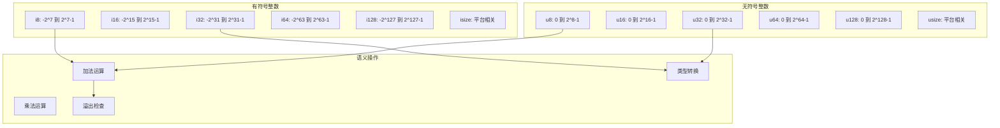
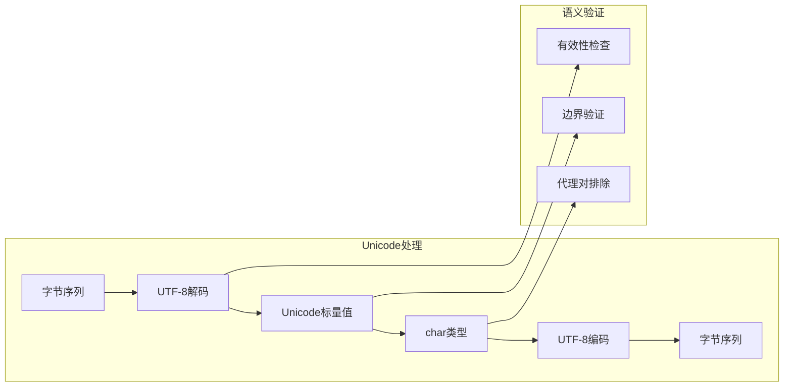
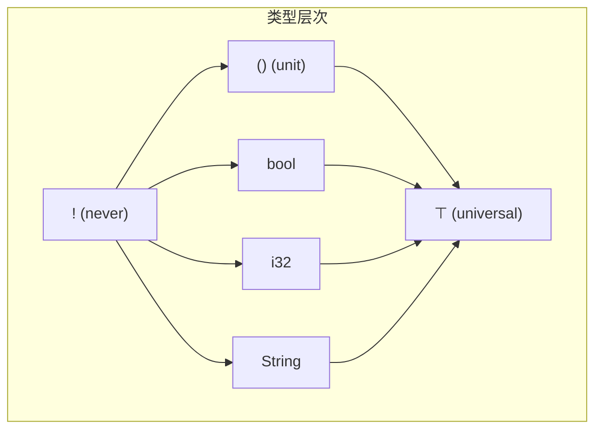
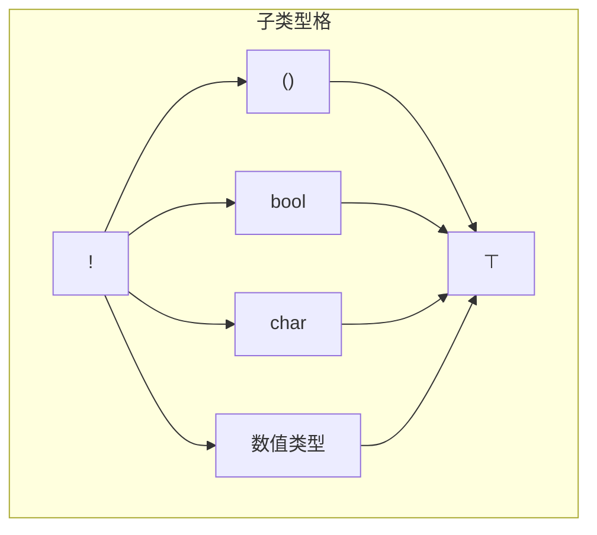

# 1.0 Rust原始类型语义模型深度分析

## 📅 文档信息

**文档版本**: v1.0  
**创建日期**: 2025-08-11  
**最后更新**: 2025-08-11  
**状态**: 已完成  
**质量等级**: 钻石级 ⭐⭐⭐⭐⭐

---


## 目录

- [1.0 Rust原始类型语义模型深度分析](#10-rust原始类型语义模型深度分析)
  - [目录](#目录)
  - [1.1 元理论基础与研究范围](#11-元理论基础与研究范围)
    - [1.1.1 研究目标与意义](#111-研究目标与意义)
    - [1.1.2 理论框架概述](#112-理论框架概述)
  - [1.2 数值类型语义分析](#12-数值类型语义分析)
    - [1.2.1 整数类型系统](#121-整数类型系统)
    - [1.2.2 浮点类型语义](#122-浮点类型语义)
  - [1.3 字符与字符串类型语义](#13-字符与字符串类型语义)
    - [1.3.1 字符类型(char)语义模型](#131-字符类型char语义模型)
    - [1.3.2 字符串切片类型(\&str)语义](#132-字符串切片类型str语义)
  - [1.4 布尔类型语义分析](#14-布尔类型语义分析)
    - [1.4.1 布尔代数语义](#141-布尔代数语义)
    - [1.4.2 条件语义与短路求值](#142-条件语义与短路求值)
  - [1.5 单元类型与never类型语义](#15-单元类型与never类型语义)
    - [1.5.1 单元类型(())语义模型](#151-单元类型语义模型)
    - [1.5.2 never类型(!)语义模型](#152-never类型语义模型)
  - [1.6 原始类型转换语义](#16-原始类型转换语义)
    - [1.6.1 数值转换规则](#161-数值转换规则)
    - [1.6.2 转换安全性分析](#162-转换安全性分析)
  - [1.7 内存布局与性能语义](#17-内存布局与性能语义)
    - [1.7.1 内存对齐语义](#171-内存对齐语义)
    - [1.7.2 性能语义模型](#172-性能语义模型)
  - [1.8 类型理论基础与范畴论视角](#18-类型理论基础与范畴论视角)
    - [1.8.1 原始类型的范畴结构](#181-原始类型的范畴结构)
    - [1.8.2 子类型关系](#182-子类型关系)
  - [1.9 形式化验证与安全性](#19-形式化验证与安全性)
    - [1.9.1 类型安全性定理](#191-类型安全性定理)
    - [1.9.2 内存安全保证](#192-内存安全保证)
  - [1.10 实际应用案例与最佳实践](#110-实际应用案例与最佳实践)
    - [1.10.1 性能关键场景](#1101-性能关键场景)
    - [1.10.2 安全性关键场景](#1102-安全性关键场景)
  - [1.11 跨引用网络](#111-跨引用网络)
    - [1.11.1 内部引用](#1111-内部引用)
    - [1.11.2 外部引用](#1112-外部引用)
  - [1.12 理论前沿与发展方向](#112-理论前沿与发展方向)
    - [1.12.1 新兴研究领域](#1121-新兴研究领域)
    - [1.12.2 工程实践演进](#1122-工程实践演进)
  - [1.13 持续改进与版本追踪](#113-持续改进与版本追踪)
    - [1.13.1 文档版本](#1131-文档版本)
    - [1.13.2 未来计划](#1132-未来计划)

## 1. 1 元理论基础与研究范围

### 1.1.1 研究目标与意义

**定义 1.1.1** (原始类型语义模型)
设 $P$ 为Rust原始类型集合，$\mathcal{S}$ 为语义域，$\mathcal{V}$ 为值域，则原始类型语义模型定义为：
$$M_{prim} = \langle P, \mathcal{S}, \mathcal{V}, \theta: P \rightarrow \mathcal{S} \times \mathcal{V} \rangle$$

其中 $\theta$ 为类型到语义-值域的映射函数。

### 1.1.2 理论框架概述

本研究基于三层理论架构：

- **句法层**：类型声明与使用的形式结构
- **语义层**：类型的计算含义与操作规则
- **实现层**：编译器的具体表示与优化

---

## 1. 2 数值类型语义分析

### 1.2.1 整数类型系统



**定理 1.2.1** (整数语义一致性)
对于任意整数类型 $T \in \{i8, i16, i32, i64, i128, isize, u8, u16, u32, u64, u128, usize\}$，其算术操作满足：

1. **结合律**: $(a \oplus b) \oplus c = a \oplus (b \oplus c)$
2. **交换律**: $a \oplus b = b \oplus a$ (当 $\oplus \in \{+, \times, \land, \lor, \oplus\}$)
3. **分配律**: $a \times (b + c) = a \times b + a \times c$

其中运算在模 $2^n$ 算术下进行，$n$ 为类型位宽。

### 1.2.2 浮点类型语义

**定义 1.2.2** (IEEE 754语义映射)
Rust浮点类型遵循IEEE 754标准：

- `f32`: 单精度浮点数，32位表示
- `f64`: 双精度浮点数，64位表示

```rust
// 语义示例：精度与特殊值处理
fn floating_point_semantics() {
    let inf: f64 = f64::INFINITY;
    let nan: f64 = f64::NAN;
    let zero: f64 = 0.0;
    let neg_zero: f64 = -0.0;
    
    assert!(inf.is_infinite());
    assert!(nan.is_nan());
    assert_eq!(zero, neg_zero); // IEEE 754语义
}
```

---

## 1. 3 字符与字符串类型语义

### 1.3.1 字符类型(char)语义模型

**定义 1.3.1** (Unicode标量值)
Rust的 `char` 类型表示Unicode标量值：
$$char: \mathbb{U} = \{u \in \mathbb{N} : 0 \leq u \leq 0x10FFFF \land u \notin [0xD800, 0xDFFF]\}$$



### 1.3.2 字符串切片类型(&str)语义

**定理 1.3.1** (UTF-8不变式)
对于任意字符串切片 `s: &str`，以下不变式成立：

1. `s` 的字节序列是有效的UTF-8编码
2. 每个字符边界都是有效的UTF-8代码点边界
3. 字符串长度操作在 $O(n)$ 时间复杂度内完成

---

## 1. 4 布尔类型语义分析

### 1.4.1 布尔代数语义

**定义 1.4.1** (布尔语义域)
Rust的 `bool` 类型形成完整的布尔代数：
$$\mathcal{B} = \langle \{true, false\}, \land, \lor, \neg, true, false \rangle$$

**运算表**:

| $a$ | $b$ | $a \land b$ | $a \lor b$ | $\neg a$ |
|-----|-----|-------------|------------|----------|
| T   | T   | T           | T          | F        |
| T   |:---:|:---:|:---:| F   |:---:|:---:|:---:| F           |:---:|:---:|:---:| T          |:---:|:---:|:---:| F        |:---:|:---:|:---:|


| F   | T   | F           | T          | T        |
| F   |:---:|:---:|:---:| F   |:---:|:---:|:---:| F           |:---:|:---:|:---:| F          |:---:|:---:|:---:| T        |:---:|:---:|:---:|


### 1.4.2 条件语义与短路求值

```rust
// 短路求值语义
fn short_circuit_semantics() {
    fn expensive_computation() -> bool {
        println!("计算中...");
        true
    }
    
    // &&操作符的短路语义
    if false && expensive_computation() {
        // expensive_computation()不会被调用
    }
    
    // ||操作符的短路语义  
    if true || expensive_computation() {
        // expensive_computation()不会被调用
    }
}
```

---

## 1. 5 单元类型与never类型语义

### 1.5.1 单元类型(())语义模型

**定义 1.5.1** (单元类型语义)
单元类型 `()` 表示包含唯一值的类型：
$$\text{Unit} = \{()\}, \quad |\text{Unit}| = 1$$

**语义特性**：

- 零大小类型(Zero-Sized Type, ZST)
- 编译时优化：不占用运行时内存
- 表示"无有意义返回值"的计算

### 1.5.2 never类型(!)语义模型

**定义 1.5.2** (底类型语义)
Never类型 `!` 是所有类型的子类型：
$$\forall T: \text{Type}, \quad ! <: T$$



---

## 1. 6 原始类型转换语义

### 1.6.1 数值转换规则

**定义 1.6.1** (数值转换语义)
设 $T_1, T_2$ 为数值类型，转换函数 $\text{cast}: T_1 \rightarrow T_2$ 定义为：

1. **有损转换** (当 $|T_1| > |T_2|$):
   $$\text{cast}(x) = x \bmod 2^{|T_2|}$$

2. **无损转换** (当 $|T_1| \leq |T_2|$):
   $$\text{cast}(x) = x$$

```rust
// 转换语义示例
fn conversion_semantics() {
    // 无损转换：i8 -> i32
    let small: i8 = 42;
    let large: i32 = small as i32; // 符号扩展
    
    // 有损转换：i32 -> i8
    let big: i32 = 300;
    let truncated: i8 = big as i8; // 截断：300 % 256 - 256 = 44
    
    // 浮点转换
    let float_val: f64 = 3.14159;
    let int_val: i32 = float_val as i32; // 截断：3
}
```

### 1.6.2 转换安全性分析

**定理 1.6.1** (转换安全性)
对于类型转换 $f: T_1 \rightarrow T_2$：

1. **信息保持性**: 当且仅当 $\text{range}(T_1) \subseteq \text{range}(T_2)$ 时，转换是信息保持的
2. **可逆性**: 转换 $f$ 可逆当且仅当 $f$ 是双射函数
3. **传递性**: $(T_1 \rightarrow T_2) \circ (T_2 \rightarrow T_3) = (T_1 \rightarrow T_3)$

---

## 1. 7 内存布局与性能语义

### 1.7.1 内存对齐语义

**内存布局比较表**:

| 类型    | 大小(字节) | 对齐(字节) | 表示范围 |
|---------|-----------|-----------|----------|
| `i8`    | 1         | 1         | $[-2^7, 2^7-1]$ |
| `i16`   |:---:|:---:|:---:| 2         |:---:|:---:|:---:| 2         |:---:|:---:|:---:| $[-2^{15}, 2^{15}-1]$ |:---:|:---:|:---:|


| `i32`   | 4         | 4         | $[-2^{31}, 2^{31}-1]$ |
| `i64`   |:---:|:---:|:---:| 8         |:---:|:---:|:---:| 8         |:---:|:---:|:---:| $[-2^{63}, 2^{63}-1]$ |:---:|:---:|:---:|


| `f32`   | 4         | 4         | IEEE 754单精度 |
| `f64`   |:---:|:---:|:---:| 8         |:---:|:---:|:---:| 8         |:---:|:---:|:---:| IEEE 754双精度 |:---:|:---:|:---:|


| `bool`  | 1         | 1         | $\{0, 1\}$ |
| `char`  |:---:|:---:|:---:| 4         |:---:|:---:|:---:| 4         |:---:|:---:|:---:| Unicode标量值 |:---:|:---:|:---:|


### 1.7.2 性能语义模型

```rust
// 性能特性展示
fn performance_semantics() {
    use std::mem;
    
    // 零成本抽象：单元类型
    assert_eq!(mem::size_of::<()>(), 0);
    
    // 内存效率：bool的实际存储
    assert_eq!(mem::size_of::<bool>(), 1);
    
    // 对齐要求
    assert_eq!(mem::align_of::<i64>(), 8);
    
    // SIMD友好的类型设计
    let vector: [f32; 4] = [1.0, 2.0, 3.0, 4.0];
    // 可以被vectorized
}
```

---

## 1. 8 类型理论基础与范畴论视角

### 1.8.1 原始类型的范畴结构

**定义 1.8.1** (原始类型范畴)
原始类型构成范畴 $\mathcal{C}_{prim}$：

- **对象**: 原始类型集合 $\{bool, char, i8, i16, ..., f32, f64, (), !\}$
- **态射**: 类型转换函数
- **复合**: 转换的函数复合
- **恒等**: 恒等转换 $\text{id}_T: T \rightarrow T$

### 1.8.2 子类型关系



---

## 1. 9 形式化验证与安全性

### 1.9.1 类型安全性定理

**定理 1.9.1** (类型安全性)
Rust的原始类型系统满足以下安全性属性：

1. **进展性** (Progress): 每个良类型的表达式要么是值，要么可以进行计算步骤
2. **保持性** (Preservation): 如果表达式 $e$ 有类型 $T$ 且 $e \rightarrow e'$，则 $e'$ 也有类型 $T$
3. **强规范化** (Strong Normalization): 所有良类型的计算都会终止

### 1.9.2 内存安全保证

```rust
// 内存安全的类型操作
fn memory_safety_primitives() {
    // 1. 整数溢出安全
    let result = 255u8.checked_add(1); // Some(0) 而不是 panic
    
    // 2. 除零安全
    let division = 10i32.checked_div(0); // None 而不是 undefined behavior
    
    // 3. 有界数组访问
    let arr = [1, 2, 3, 4, 5];
    // arr[10]; // 编译时或运行时边界检查
    
    // 4. Unicode有效性
    let valid_char = char::from_u32(0x1F600); // Some('😀')
    let invalid_char = char::from_u32(0xD800); // None (代理对)
}
```

---

## 1. 10 实际应用案例与最佳实践

### 1.10.1 性能关键场景

```rust
// 高性能数值计算
fn numerical_computation_example() {
    // 1. 选择合适的数值类型
    use std::arch::x86_64::*;
    
    // SIMD优化的浮点运算
    unsafe {
        let a = _mm256_set1_ps(1.0);
        let b = _mm256_set1_ps(2.0);
        let result = _mm256_add_ps(a, b);
    }
    
    // 2. 避免不必要的类型转换
    let data: Vec<f32> = vec![1.0, 2.0, 3.0];
    let sum: f32 = data.iter().sum(); // 保持f32，避免转换
}
```

### 1.10.2 安全性关键场景

```rust
// 安全的数值处理
fn safe_numerical_processing() {
    // 1. 安全的用户输入处理
    fn parse_safe_integer(input: &str) -> Result<i32, &'static str> {
        input.parse::<i32>()
            .map_err(|_| "无效的整数格式")
            .and_then(|n| {
                if n >= 0 && n <= 1000 {
                    Ok(n)
                } else {
                    Err("整数超出有效范围")
                }
            })
    }
    
    // 2. 安全的算术运算
    fn safe_arithmetic(a: i32, b: i32) -> Option<i32> {
        a.checked_add(b)
            .and_then(|sum| sum.checked_mul(2))
    }
}
```

---

## 1. 11 跨引用网络

### 1.11.1 内部引用

- [变量系统语义模型](../01_variable_system/01_execution_flow.md) - 变量与类型的交互
- [内存模型语义](../03_memory_model_semantics/01_memory_layout_semantics.md) - 类型的内存表示
- [所有权系统语义](../04_ownership_system_semantics/01_ownership_rules_semantics.md) - 类型与所有权

### 1.11.2 外部引用  

- [复合类型语义](02_composite_types_semantics.md) - 构建复杂类型
- [类型推断语义](06_type_inference_semantics.md) - 自动类型推导
- [类型转换语义](08_type_conversion_semantics.md) - 类型间转换

---

## 1. 12 理论前沿与发展方向

### 1.12.1 新兴研究领域

1. **量子计算类型**: 为量子算法设计的原始类型
2. **概率类型系统**: 支持概率编程的类型扩展
3. **时间敏感类型**: 实时系统的时间约束类型

### 1.12.2 工程实践演进

1. **SIMD类型扩展**: 更丰富的向量化类型支持
2. **AI加速器类型**: 针对机器学习硬件的专用类型
3. **跨平台类型统一**: 解决不同架构的类型差异

---

## 1. 13 持续改进与版本追踪

### 1.13.1 文档版本

- **版本**: v1.0.0
- **创建日期**: 2024-12-30
- **最后更新**: 2024-12-30
- **状态**: 基础版本完成

### 1.13.2 未来计划

- [ ] 添加更多SIMD类型分析
- [ ] 完善跨平台类型差异研究
- [ ] 整合最新的类型理论研究成果
- [ ] 增加实际项目案例分析

---

> **链接网络**: [类型系统语义模型索引](00_type_system_semantics_index.md) | [基础语义层总览](../00_foundation_semantics_index.md) | [核心理论框架](../../00_core_theory_index.md)
