# 2.0 Rust复合类型语义模型深度分析

## 📅 文档信息

**文档版本**: v1.0  
**创建日期**: 2025-08-11  
**最后更新**: 2025-08-11  
**状态**: 已完成  
**质量等级**: 钻石级 ⭐⭐⭐⭐⭐

---


## 目录

- [2.0 Rust复合类型语义模型深度分析](#20-rust复合类型语义模型深度分析)
  - [目录](#目录)
  - [2.1 复合类型理论基础](#21-复合类型理论基础)
    - [2.1.1 复合类型范畴论框架](#211-复合类型范畴论框架)
    - [2.1.2 类型构造的语义层次](#212-类型构造的语义层次)
  - [2.2 数组类型语义分析](#22-数组类型语义分析)
    - [2.2.1 固定大小数组语义](#221-固定大小数组语义)
    - [2.2.2 切片类型语义](#222-切片类型语义)
  - [2.3 元组类型语义分析](#23-元组类型语义分析)
    - [2.3.1 元组类型代数结构](#231-元组类型代数结构)
    - [2.3.2 单元类型与空元组](#232-单元类型与空元组)
  - [2.4 结构体类型语义分析](#24-结构体类型语义分析)
    - [2.4.1 命名字段结构体](#241-命名字段结构体)
    - [2.4.2 元组结构体语义](#242-元组结构体语义)
    - [2.4.3 单元结构体语义](#243-单元结构体语义)
  - [2.5 枚举类型语义分析](#25-枚举类型语义分析)
    - [2.5.1 和类型语义基础](#251-和类型语义基础)
    - [2.5.2 枚举的内存表示](#252-枚举的内存表示)
    - [2.5.3 模式匹配语义](#253-模式匹配语义)
  - [2.6 函数指针与闭包类型](#26-函数指针与闭包类型)
    - [2.6.1 函数指针类型语义](#261-函数指针类型语义)
    - [2.6.2 闭包类型语义](#262-闭包类型语义)
  - [2.7 智能指针类型语义](#27-智能指针类型语义)
    - [2.7.1 `Box<T>`语义模型](#271-boxt语义模型)
    - [2.7.2 `Rc<T>`和`Arc<T>`语义](#272-rct和arct语义)
  - [2.8 复合类型的类型理论](#28-复合类型的类型理论)
    - [2.8.1 积类型与和类型的对偶性](#281-积类型与和类型的对偶性)
    - [2.8.2 递归类型的不动点语义](#282-递归类型的不动点语义)
  - [2.9 复合类型的内存布局优化](#29-复合类型的内存布局优化)
    - [2.9.1 结构体字段重排](#291-结构体字段重排)
    - [2.9.2 枚举表示优化](#292-枚举表示优化)
  - [2.10 跨引用网络](#210-跨引用网络)
    - [2.10.1 内部引用](#2101-内部引用)
    - [2.10.2 外部引用](#2102-外部引用)
  - [2.11 理论前沿与发展方向](#211-理论前沿与发展方向)
    - [2.11.1 依赖类型扩展](#2111-依赖类型扩展)
    - [2.11.2 高级类型构造](#2112-高级类型构造)
  - [2.12 持续改进与版本追踪](#212-持续改进与版本追踪)
    - [2.12.1 文档版本](#2121-文档版本)
    - [2.12.2 改进计划](#2122-改进计划)

## 2. 1 复合类型理论基础

### 2.1.1 复合类型范畴论框架

**定义 2.1.1** (复合类型构造函子)
设 $\mathcal{C}$ 为类型范畴，复合类型构造器定义为函子：
$$F: \mathcal{C}^n \rightarrow \mathcal{C}$$

其中主要构造器包括：

- **积类型**: $F_{prod}(T_1, T_2, ..., T_n) = T_1 \times T_2 \times ... \times T_n$
- **和类型**: $F_{sum}(T_1, T_2, ..., T_n) = T_1 + T_2 + ... + T_n$
- **函数类型**: $F_{func}(T_1, T_2) = T_1 \rightarrow T_2$
- **递归类型**: $F_{rec}(\lambda T. F(T))$

### 2.1.2 类型构造的语义层次

```mermaid
graph TB
    subgraph "语义层次结构"
        L1[原始类型层]
        L2[基础复合类型层]
        L3[高级复合类型层]
        L4[泛型类型层]
        L5[特质对象层]
    end
    
    subgraph "构造操作"
        PROD[积运算 ×]
        SUM[和运算 +]
        FUNC[函数类型 →]
        REC[递归类型 μ]
        POLY[多态类型 ∀]
    end
    
    L1 --> L2
    L2 --> L3
    L3 --> L4
    L4 --> L5
    
    PROD --> L2
    SUM --> L2
    FUNC --> L3
    REC --> L3
    POLY --> L4
```



---

## 2. 2 数组类型语义分析

### 2.2.1 固定大小数组语义

**定义 2.2.1** (数组类型语义)
固定大小数组 `[T; N]` 的语义为：
$$[T; N] = T^N = \underbrace{T \times T \times ... \times T}_{N \text{次}}$$

**类型不变式**：

1. **大小确定性**: $\text{size}([T; N]) = N \times \text{size}(T)$
2. **内存连续性**: 数组元素在内存中连续存储
3. **边界安全性**: 索引访问在编译时或运行时进行边界检查

```rust
// 数组语义示例
fn array_semantics() {
    // 1. 类型安全的数组操作
    let arr: [i32; 5] = [1, 2, 3, 4, 5];
    
    // 编译时已知大小
    assert_eq!(std::mem::size_of_val(&arr), 5 * 4); // 5个i32
    
    // 2. 内存布局保证
    let ptr = arr.as_ptr();
    unsafe {
        assert_eq!(*ptr, 1);
        assert_eq!(*ptr.add(1), 2); // 连续内存
    }
    
    // 3. 边界检查
    // let invalid = arr[10]; // 编译时错误或运行时panic
}
```

### 2.2.2 切片类型语义

**定义 2.2.2** (切片语义模型)
切片 `&[T]` 是数组的视图，语义上为：
$$\&[T] = \{(ptr, len) : ptr \in \text{Ptr}(T), len \in \mathbb{N}\}$$

**切片不变式**：

```mermaid
stateDiagram-v2
    [*] --> ValidSlice
    ValidSlice --> InvalidAccess: 越界访问
    ValidSlice --> ValidSlice: 安全操作
    InvalidAccess --> [*]: panic!
    
    note right of ValidSlice
        ptr指向有效内存
        len ≤ 分配大小
        生命周期有效
    end note
```



---

## 2. 3 元组类型语义分析

### 2.3.1 元组类型代数结构

**定义 2.3.1** (元组类型语义)
$n$-元组类型 $(T_1, T_2, ..., T_n)$ 的语义为笛卡尔积：
$$\text{Tuple}_n(T_1, ..., T_n) = T_1 \times T_2 \times ... \times T_n$$

**元组投影函数**：
$$\pi_i: T_1 \times ... \times T_n \rightarrow T_i$$

```rust
// 元组语义操作
fn tuple_semantics() {
    // 1. 元组构造与解构
    let tuple: (i32, f64, String) = (42, 3.14, "hello".to_string());
    
    // 投影操作
    let first: i32 = tuple.0;    // π₁
    let second: f64 = tuple.1;   // π₂
    let third: String = tuple.2; // π₃
    
    // 2. 模式匹配解构
    let (x, y, z) = tuple;
    
    // 3. 类型同构
    let nested: ((i32, f64), String) = ((42, 3.14), "hello".to_string());
    // (A × B) × C ≅ A × (B × C) 结合律
}
```

### 2.3.2 单元类型与空元组

**定理 2.3.1** (单元类型同构性)
单元类型 `()` 与零元组同构：
$$() \cong \text{Tuple}_0 \cong \mathbf{1}$$

其中 $\mathbf{1}$ 是范畴论中的终对象。

---

## 2. 4 结构体类型语义分析

### 2.4.1 命名字段结构体

**定义 2.4.1** (结构体语义映射)
结构体 `struct S { f1: T1, f2: T2, ..., fn: Tn }` 等价于标记元组：
$$S \cong \{f_1: T_1, f_2: T_2, ..., f_n: T_n\}$$

**字段访问语义**：
$$\text{access}(s, f_i) = \pi_i(\text{untag}(s))$$

```rust
// 结构体语义示例
#[derive(Debug, Clone)]
struct Point3D {
    x: f64,
    y: f64,
    z: f64,
}

fn struct_semantics() {
    // 1. 构造函数语义
    let p = Point3D { x: 1.0, y: 2.0, z: 3.0 };
    
    // 2. 字段访问的内存布局
    use std::mem;
    assert_eq!(mem::size_of::<Point3D>(), 3 * mem::size_of::<f64>());
    
    // 3. 字段重排与优化
    let ptr = &p as *const Point3D as *const f64;
    unsafe {
        assert_eq!(*ptr, 1.0);           // x字段
        assert_eq!(*ptr.add(1), 2.0);    // y字段
        assert_eq!(*ptr.add(2), 3.0);    // z字段
    }
}
```

### 2.4.2 元组结构体语义

**定义 2.4.2** (元组结构体同构)
元组结构体 `struct Wrapper(T)` 与单元素元组同构：
$$\text{Wrapper}(T) \cong (T,)$$

但具有不同的名义类型标识。

### 2.4.3 单元结构体语义

**定义 2.4.3** (单元结构体语义)
单元结构体 `struct Unit;` 等价于单元类型：
$$\text{Unit} \cong ()$$

但在类型系统中具有独特的标识。

---

## 2. 5 枚举类型语义分析

### 2.5.1 和类型语义基础

**定义 2.5.1** (枚举类型语义)
枚举 `enum E { V1(T1), V2(T2), ..., Vn(Tn) }` 的语义为标记联合：
$$E \cong T_1 + T_2 + ... + T_n$$

**注入函数**：
$$\text{inj}_i: T_i \rightarrow E$$

```mermaid
graph LR
    subgraph "和类型构造"
        T1[T₁] --> E
        T2[T₂] --> E  
        T3[T₃] --> E
        TN[Tₙ] --> E
    end
    
    subgraph "模式匹配"
        E --> M{match}
        M --> A1[分支1]
        M --> A2[分支2]
        M --> A3[分支3]
        M --> AN[分支n]
    end
    
    E -.-> tag[标记字段]
    E -.-> data[数据字段]
```



### 2.5.2 枚举的内存表示

```rust
// 枚举语义与内存布局
#[derive(Debug)]
enum Message {
    Quit,                        // 单元变体
    Move { x: i32, y: i32 },    // 结构体变体
    Write(String),              // 元组变体
    ChangeColor(i32, i32, i32), // 多字段元组变体
}

fn enum_semantics() {
    use std::mem;
    
    // 1. 判别式(discriminant)语义
    let msg = Message::Write("hello".to_string());
    let discriminant = unsafe { *((&msg) as *const _ as *const u8) };
    
    // 2. 内存布局优化
    // 枚举大小 = max(变体大小) + 判别式大小
    println!("Message size: {}", mem::size_of::<Message>());
    
    // 3. 空指针优化
    let opt: Option<&i32> = None;
    // Option<&T> 与 &T 具有相同的内存表示
    assert_eq!(mem::size_of::<Option<&i32>>(), mem::size_of::<&i32>());
}
```

### 2.5.3 模式匹配语义

**定义 2.5.3** (模式匹配语义)
模式匹配是和类型的案例分析：
$$\text{match } e \text{ with } \{p_1 \Rightarrow e_1, ..., p_n \Rightarrow e_n\}$$

等价于：
$$\text{case}(e, [p_1 \mapsto e_1, ..., p_n \mapsto e_n])$$

```rust
// 完整性与排他性检查
fn pattern_matching_semantics(msg: Message) -> String {
    match msg {
        Message::Quit => "quit".to_string(),
        Message::Move { x, y } => format!("move to ({}, {})", x, y),
        Message::Write(text) => text,
        Message::ChangeColor(r, g, b) => format!("color ({}, {}, {})", r, g, b),
        // 编译器保证：所有情况都被覆盖(完整性)
        // 编译器保证：没有重复模式(排他性)
    }
}
```

---

## 2. 6 函数指针与闭包类型

### 2.6.1 函数指针类型语义

**定义 2.6.1** (函数指针语义)
函数指针类型 `fn(T1, T2, ..., Tn) -> R` 表示函数的类型：
$$\text{fn}(T_1, ..., T_n) \rightarrow R \cong T_1 \times ... \times T_n \rightarrow R$$

```rust
// 函数指针语义
fn function_pointer_semantics() {
    // 1. 函数作为一等值
    fn add(a: i32, b: i32) -> i32 { a + b }
    fn multiply(a: i32, b: i32) -> i32 { a * b }
    
    let operation: fn(i32, i32) -> i32 = add;
    assert_eq!(operation(3, 4), 7);
    
    // 2. 高阶函数
    fn apply_twice(f: fn(i32) -> i32, x: i32) -> i32 {
        f(f(x))
    }
    
    fn increment(x: i32) -> i32 { x + 1 }
    assert_eq!(apply_twice(increment, 5), 7);
    
    // 3. 函数指针的零成本抽象
    use std::mem;
    assert_eq!(mem::size_of::<fn()>(), mem::size_of::<usize>());
}
```

### 2.6.2 闭包类型语义

**定义 2.6.2** (闭包类型分类)
Rust闭包根据环境捕获方式分为三类：

1. **Fn**: 不可变借用环境
2. **FnMut**: 可变借用环境  
3. **FnOnce**: 获取环境所有权

```mermaid
graph TB
    subgraph "闭包特征层次"
        FnOnce[FnOnce]
        FnMut[FnMut]
        Fn[Fn]
    end
    
    subgraph "环境捕获"
        Move[move 语义]
        BorrowMut[&mut 借用]
        BorrowImm[& 借用]
    end
    
    FnOnce --> FnMut
    FnMut --> Fn
    
    Move --> FnOnce
    BorrowMut --> FnMut
    BorrowImm --> Fn
```



```rust
// 闭包语义分析
fn closure_semantics() {
    let x = 42;
    let y = 24;
    
    // 1. Fn闭包：不可变捕获
    let read_only = || x + y;
    println!("{}", read_only()); // 可以多次调用
    println!("{}", read_only());
    
    // 2. FnMut闭包：可变捕获
    let mut count = 0;
    let mut increment = || {
        count += 1;
        count
    };
    println!("{}", increment()); // 1
    println!("{}", increment()); // 2
    
    // 3. FnOnce闭包：获取所有权
    let data = vec![1, 2, 3];
    let consume = move || {
        data // 移动data的所有权
    };
    let consumed_data = consume();
    // consume(); // 编译错误：已经被消费
}
```

---

## 2. 7 智能指针类型语义

### 2.7.1 `Box<T>`语义模型

**定义 2.7.1** (堆分配指针语义)
`Box<T>` 提供堆上T的唯一所有权：
$$\text{Box}\langle T \rangle \cong \text{Owned}(\text{Heap}(T))$$

```rust
// Box语义分析
fn box_semantics() {
    // 1. 堆分配与所有权
    let boxed_value = Box::new(42);
    
    // 2. 解引用语义
    assert_eq!(*boxed_value, 42);
    
    // 3. 移动语义
    let moved_box = boxed_value;
    // println!("{}", boxed_value); // 编译错误：值已移动
    
    // 4. 递归类型构造
    enum List {
        Nil,
        Cons(i32, Box<List>),
    }
    
    let list = List::Cons(1, Box::new(
        List::Cons(2, Box::new(List::Nil))
    ));
}
```

### 2.7.2 `Rc<T>`和`Arc<T>`语义

**定义 2.7.2** (引用计数指针语义)

- `Rc<T>`: 单线程引用计数
- `Arc<T>`: 原子引用计数

$$\text{Rc}\langle T \rangle \cong \text{Shared}(\text{Heap}(T)) \times \text{RefCount}$$

```rust
// 引用计数语义
use std::rc::Rc;
use std::sync::Arc;

fn reference_counting_semantics() {
    // 1. Rc语义：共享所有权
    let data = Rc::new(vec![1, 2, 3]);
    let data1 = Rc::clone(&data);
    let data2 = Rc::clone(&data);
    
    assert_eq!(Rc::strong_count(&data), 3);
    
    // 2. Arc语义：线程安全共享
    let shared_data = Arc::new(42);
    let handles: Vec<_> = (0..10).map(|_| {
        let data = Arc::clone(&shared_data);
        std::thread::spawn(move || {
            println!("Thread sees: {}", *data);
        })
    }).collect();
    
    for handle in handles {
        handle.join().unwrap();
    }
}
```

---

## 2. 8 复合类型的类型理论

### 2.8.1 积类型与和类型的对偶性

**定理 2.8.1** (积和对偶性)
在类型范畴中，积类型与和类型满足分配律：
$$A \times (B + C) \cong (A \times B) + (A \times C)$$

**应用示例**：

```rust
// 类型分配律的Rust表示
enum Either<B, C> {
    Left(B),
    Right(C),
}

struct ProductLeft<A, B>(A, B);
struct ProductRight<A, C>(A, C);

enum Distributed<A, B, C> {
    Left(ProductLeft<A, B>),
    Right(ProductRight<A, C>),
}

// (A, Either<B, C>) ≅ Distributed<A, B, C>
```

### 2.8.2 递归类型的不动点语义

**定义 2.8.2** (递归类型不动点)
递归类型 `T = F(T)` 的语义为函子 `F` 的最小不动点：
$$T = \mu F = \text{fix}(F)$$

```rust
// 递归类型示例
enum Tree<T> {
    Leaf(T),
    Node(Box<Tree<T>>, Box<Tree<T>>),
}

// Tree<T> = T + (Tree<T> × Tree<T>)
// 即 Tree = μX. T + (X × X)
```

---

## 2. 9 复合类型的内存布局优化

### 2.9.1 结构体字段重排

**内存布局优化规则**：

1. **对齐要求**: 字段按照对齐要求排列
2. **填充最小化**: 减少内存填充
3. **缓存友好**: 考虑CPU缓存行大小

```rust
// 内存布局比较
#[repr(C)]  // C语言兼容布局
struct UnoptimizedStruct {
    a: u8,     // 1字节
    b: u64,    // 8字节，需要7字节填充
    c: u8,     // 1字节，需要7字节填充
}  // 总计：24字节

#[repr(C)]
struct OptimizedStruct {
    b: u64,    // 8字节
    a: u8,     // 1字节
    c: u8,     // 1字节，共2字节，需要6字节填充
}  // 总计：16字节
```

### 2.9.2 枚举表示优化

```rust
// 枚举优化示例
enum OptimizedEnum {
    Variant1,                    // 0字节数据
    Variant2(NonZeroU32),       // 非零优化
    Variant3(Box<i32>),         // 空指针优化
}

// 由于优化，可能不需要额外的判别式字段
```

---

## 2. 10 跨引用网络

### 2.10.1 内部引用

- [原始类型语义](01_primitive_types_semantics.md) - 构建复合类型的基础
- [类型推断语义](06_type_inference_semantics.md) - 复合类型的推断规则
- [内存模型语义](../03_memory_model_semantics/01_memory_layout_semantics.md) - 内存布局细节

### 2.10.2 外部引用

- [所有权系统语义](../04_ownership_system_semantics/01_ownership_rules_semantics.md) - 复合类型的所有权规则
- [泛型系统语义](../../05_transformation_semantics/04_generic_system_semantics/01_generic_parameters_semantics.md) - 泛型复合类型
- [trait系统语义](../../05_transformation_semantics/03_trait_system_semantics/01_trait_definition_semantics.md) - 类型能力扩展

---

## 2. 11 理论前沿与发展方向

### 2.11.1 依赖类型扩展

1. **长度索引类型**: `Vec<T, n>` 其中 `n` 是编译时已知长度
2. **效果类型**: 在类型中编码副作用信息
3. **线性类型**: 资源使用的精确控制

### 2.11.2 高级类型构造

1. **高阶种类**: `type Constructor<F<_>>`
2. **关联类型族**: 更灵活的类型关联
3. **类型级计算**: 编译时类型计算

---

## 2. 12 持续改进与版本追踪

### 2.12.1 文档版本

- **版本**: v1.0.0
- **创建日期**: 2024-12-30
- **最后更新**: 2024-12-30
- **状态**: 核心内容完成

### 2.12.2 改进计划

- [ ] 添加更多高级复合类型示例
- [ ] 深化内存布局优化分析
- [ ] 完善递归类型的形式化处理
- [ ] 增加性能测试案例

---

> **链接网络**: [类型系统语义模型索引](00_type_system_semantics_index.md) | [基础语义层总览](../00_foundation_semantics_index.md) | [核心理论框架](../../00_core_theory_index.md)
