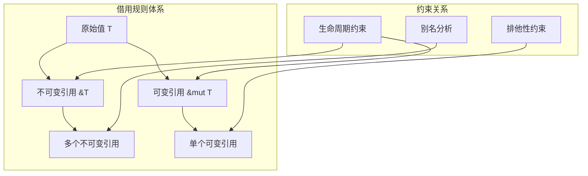
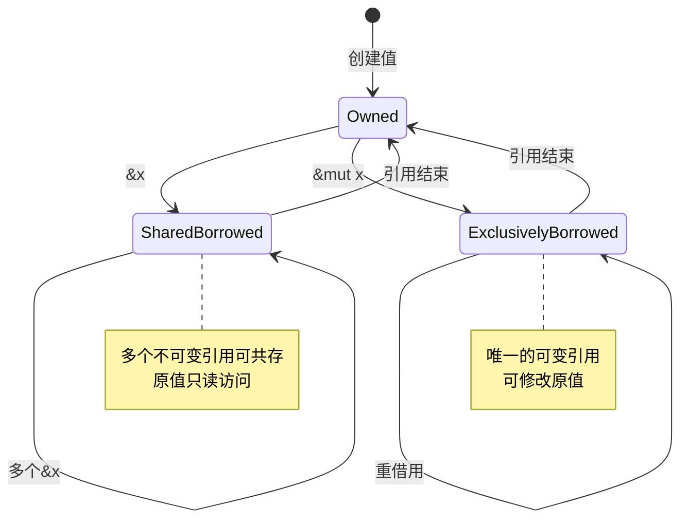

# 3.0 Rust引用类型语义模型深度分析

## 3.1 引用类型理论基础

### 3.1.1 引用语义的数学模型

**定义 3.1.1** (引用类型语义域)
引用类型 `&T` 和 `&mut T` 的语义定义为：
$$\&T = \{(ptr, lifetime) : ptr \in \text{Ptr}(T), lifetime \in \mathcal{L}\}$$
$$\&\text{mut } T = \{(ptr, lifetime, exclusive) : ptr \in \text{Ptr}(T), lifetime \in \mathcal{L}, exclusive = \top\}$$

其中：
- $\text{Ptr}(T)$: 指向类型T的有效指针集合
- $\mathcal{L}$: 生命周期域
- $exclusive$: 排他性标记

### 3.1.2 借用规则的形式化

**公理 3.1.1** (借用安全性公理)
Rust的借用规则可形式化为以下约束系统：

1. **排他性原理**: $\forall t \in \text{Time}, x \in \text{Var}: |\{\text{active\_mut\_borrows}(x, t)\}| \leq 1$
2. **共享-排他互斥**: $\text{active\_mut\_borrows}(x, t) \neq \emptyset \Rightarrow \text{active\_shared\_borrows}(x, t) = \emptyset$
3. **生命周期包含**: $\forall r: \&^a T, x: T, r = \&x \Rightarrow a \subseteq \text{lifetime}(x)$



---

## 3.2 不可变引用语义分析

### 3.2.1 共享借用语义

**定义 3.2.1** (共享借用操作语义)
共享借用操作 `&x` 的语义定义为：
$$\text{borrow\_shared}(x) = \lambda \text{env}. \begin{cases}
\text{Ok}(\&x, \text{env}') & \text{if } \text{can\_borrow\_shared}(x, \text{env}) \\
\text{Err}(\text{BorrowError}) & \text{otherwise}
\end{cases}$$

其中环境更新规则：
$$\text{env}' = \text{env} \cup \{(\&x, \text{current\_lifetime})\}$$

```rust
// 共享借用语义示例
fn shared_borrowing_semantics() {
    let data = vec![1, 2, 3, 4, 5];
    
    // 1. 多个不可变引用可以共存
    let ref1 = &data;        // 第一个共享借用
    let ref2 = &data;        // 第二个共享借用
    let ref3 = &data[1..3];  // 部分借用
    
    // 2. 共享借用的传递性
    let ref4 = &ref1[0];     // 借用的借用
    
    // 3. 自动解引用
    println!("Length: {}", ref1.len()); // 等价于 (*ref1).len()
    
    // 4. 生命周期自动推断
    let longer_lived = choose_longer(ref1, ref2);
    
    // 所有引用在此处仍然有效
    println!("{:?} {:?} {:?} {} {:?}", ref1, ref2, ref3, ref4, longer_lived);
}

fn choose_longer<'a>(x: &'a Vec<i32>, y: &'a Vec<i32>) -> &'a Vec<i32> {
    if x.len() > y.len() { x } else { y }
}
```

### 3.2.2 引用的内存语义

**定理 3.2.1** (引用内存安全性)
对于任意不可变引用 `r: &T`：

1. **有效性保证**: `r` 指向的内存在其生命周期内始终有效
2. **不变性保证**: 通过 `r` 无法修改被引用的值
3. **别名安全**: 多个不可变引用可以安全共存

```rust
// 内存安全性验证
fn memory_safety_demonstration() {
    let mut vec = vec![1, 2, 3];
    let slice = &vec[..];  // 创建不可变引用
    
    // 编译时保证：以下操作会被拒绝
    // vec.push(4);        // 错误：不能在存在不可变借用时修改
    // vec.clear();        // 错误：同样的原因
    
    // 安全操作：只读访问
    println!("Slice: {:?}", slice);
    println!("First element: {}", slice[0]);
    
    // slice的生命周期结束后，vec可以被修改
    drop(slice);
    vec.push(4);  // 现在可以了
}
```

---

## 3.3 可变引用语义分析

### 3.3.1 排他性借用语义

**定义 3.3.1** (排他性借用操作语义)
排他性借用操作 `&mut x` 的语义定义为：
$$\text{borrow\_mut}(x) = \lambda \text{env}. \begin{cases}
\text{Ok}(\&\text{mut } x, \text{env}') & \text{if } \text{can\_borrow\_mut}(x, \text{env}) \\
\text{Err}(\text{BorrowError}) & \text{otherwise}
\end{cases}$$

**排他性检查条件**：
$$\text{can\_borrow\_mut}(x, \text{env}) \iff \neg\exists r \in \text{env}: \text{aliases}(r, x)$$

```rust
// 排他性借用语义示例
fn exclusive_borrowing_semantics() {
    let mut data = vec![1, 2, 3];
    
    // 1. 创建可变引用
    let mut_ref = &mut data;
    
    // 2. 通过可变引用修改数据
    mut_ref.push(4);
    mut_ref[0] = 10;
    
    // 3. 编译时保证：排他性
    // let another_ref = &data;     // 错误：不能在可变借用存在时创建不可变借用
    // let another_mut = &mut data; // 错误：不能有多个可变借用
    
    // 4. 可变引用的生命周期结束
    println!("Modified data: {:?}", mut_ref);
    // mut_ref在此处结束
    
    // 5. 现在可以创建新的借用
    let new_ref = &data;
    println!("Final data: {:?}", new_ref);
}
```

### 3.3.2 可变引用的内存模型



---

## 3.4 生命周期参数化语义

### 3.4.1 生命周期标注语义

**定义 3.4.1** (生命周期参数语义)
生命周期参数 `'a` 表示一个抽象的时间区间：
$$'a \in \mathcal{L} = \{[t_1, t_2) : t_1, t_2 \in \text{Time}, t_1 \leq t_2\}$$

**生命周期关系**：
- **子类型关系**: $'a \sqsubseteq 'b \iff 'a \supseteq 'b$
- **生命周期交集**: $'a \cap 'b = \max(\text{start}('a), \text{start}('b))...\min(\text{end}('a), \text{end}('b))$

```rust
// 生命周期标注语义示例
fn lifetime_annotation_semantics() {
    let string1 = String::from("long string");
    let result;
    
    {
        let string2 = String::from("short");
        // 编译器推断生命周期
        result = longest(&string1, &string2); // 错误：string2生命周期太短
    }
    
    // println!("Longest: {}", result); // 错误：result引用了已销毁的数据
}

// 显式生命周期标注
fn longest<'a>(x: &'a str, y: &'a str) -> &'a str {
    if x.len() > y.len() { x } else { y }
}

// 多个生命周期参数
fn complex_lifetime_example<'a, 'b>(
    x: &'a str, 
    y: &'b str
) -> (&'a str, &'b str) {
    (x, y) // 返回值保持各自的生命周期
}
```

### 3.4.2 生命周期子类型化

**定理 3.4.1** (生命周期协变性)
对于引用类型 `&'a T`：
$$'a \sqsubseteq 'b \Rightarrow \&'a T <: \&'b T$$

这意味着更长的生命周期可以安全地转换为更短的生命周期。

```rust
// 生命周期子类型化示例
fn lifetime_subtyping_example() {
    let longer_lived_string = String::from("I live longer");
    
    {
        let shorter_lived_string = String::from("I live shorter");
        
        // 'longer 生命周期可以转换为 'shorter 生命周期
        let reference: &str = &longer_lived_string; // 'longer -> 'shorter 是安全的
        
        // 但反过来不行
        // let reference: &'longer str = &shorter_lived_string; // 错误
    }
}
```

---

## 3.5 引用类型的高级特性

### 3.5.1 重借用 (Reborrowing)

**定义 3.5.1** (重借用语义)
重借用是从现有引用创建新引用的操作：
$$\text{reborrow}(r: \&^a \text{mut } T) = \&^{a'} \text{mut } T \text{ where } a' \sqsubseteq a$$

```rust
// 重借用语义示例
fn reborrowing_semantics() {
    let mut data = vec![1, 2, 3];
    let mut_ref = &mut data;
    
    // 重借用：创建更短生命周期的可变引用
    {
        let reborrowed = &mut *mut_ref; // 显式重借用
        reborrowed.push(4);
    } // reborrowed在此处结束
    
    // 原始引用仍然可用
    mut_ref.push(5);
    
    // 自动重借用
    modify_vec(mut_ref); // 自动重借用
    mut_ref.push(6);     // 仍然可用
}

fn modify_vec(vec: &mut Vec<i32>) {
    vec.push(100);
}
```

### 3.5.2 引用的内部可变性

**定义 3.5.2** (内部可变性模式)
某些类型提供内部可变性，允许通过不可变引用修改内部状态：

```rust
use std::cell::{Cell, RefCell};
use std::rc::Rc;

// 内部可变性语义
fn interior_mutability_semantics() {
    // Cell: Copy类型的内部可变性
    let cell = Cell::new(42);
    let cell_ref = &cell;
    cell_ref.set(100); // 通过不可变引用修改值
    
    // RefCell: 运行时借用检查
    let refcell = RefCell::new(vec![1, 2, 3]);
    let refcell_ref = &refcell;
    
    {
        let mut borrowed = refcell_ref.borrow_mut(); // 运行时可变借用
        borrowed.push(4);
    } // 借用在此处结束
    
    let borrowed = refcell_ref.borrow(); // 运行时不可变借用
    println!("RefCell contents: {:?}", *borrowed);
}
```

---

## 3.6 引用类型的模式匹配

### 3.6.1 引用模式语义

**定义 3.6.1** (引用模式匹配语义)
引用模式匹配遵循以下规则：
- `&pattern`: 匹配引用，绑定被引用的值
- `ref pattern`: 创建对匹配值的引用

```rust
// 引用模式匹配语义
fn reference_pattern_matching() {
    let data = (1, 2, 3);
    let reference = &data;
    
    // 1. 解引用模式
    match reference {
        &(x, y, z) => println!("Destructured: {}, {}, {}", x, y, z),
    }
    
    // 2. ref模式
    match data {
        (ref x, ref y, ref z) => {
            // x, y, z 是对原值的引用
            println!("References: {}, {}, {}", x, y, z);
        }
    }
    
    // 3. 混合模式
    let vec = vec![1, 2, 3, 4];
    match &vec[..] {
        &[first, ref rest @ ..] => {
            println!("First: {}, Rest: {:?}", first, rest);
        }
        _ => {}
    }
}
```

### 3.6.2 引用的自动解引用

**定理 3.6.1** (自动解引用规则)
Rust编译器在方法调用时自动应用解引用：
$$\text{method\_call}(r.method()) = \text{method\_call}((*r).method())$$

```rust
// 自动解引用语义
fn auto_deref_semantics() {
    let string = String::from("hello");
    let string_ref = &string;
    let string_ref_ref = &string_ref;
    
    // 所有这些调用都等价
    println!("Direct: {}", string.len());
    println!("One ref: {}", string_ref.len());      // 自动解引用
    println!("Two refs: {}", string_ref_ref.len()); // 多次自动解引用
    
    // String -> &str 的Deref强制转换
    let str_method: &str = &string;  // String实现Deref<Target=str>
    println!("Deref coercion: {}", str_method.chars().count());
}
```

---

## 3.7 引用类型的安全性保证

### 3.7.1 悬垂引用预防

**定理 3.7.1** (无悬垂引用保证)
Rust类型系统保证不存在悬垂引用：
$$\forall r: \&'a T, \text{lifetime}(r) \subseteq \text{lifetime}(\text{referent}(r))$$

```rust
// 悬垂引用预防机制
fn dangling_reference_prevention() {
    // 以下代码会被编译器拒绝
    /*
    fn create_dangling_reference() -> &i32 {
        let x = 42;
        &x  // 错误：返回对局部变量的引用
    }
    */
    
    // 正确的做法：返回拥有的值
    fn create_owned_value() -> i32 {
        42
    }
    
    // 或者使用生命周期参数
    fn borrow_from_parameter<'a>(x: &'a i32) -> &'a i32 {
        x  // 安全：返回输入引用
    }
}
```

### 3.7.2 数据竞争预防

**定理 3.7.2** (数据竞争自由保证)
Rust的借用检查器保证单线程代码中无数据竞争：
$$\text{no\_data\_races} \iff \forall x, t: |\text{mutable\_access}(x, t)| \leq 1$$

```rust
// 数据竞争预防示例
fn data_race_prevention() {
    let mut data = vec![1, 2, 3];
    
    // 编译时预防数据竞争
    /*
    let read_ref = &data;
    let write_ref = &mut data;  // 错误：读写访问冲突
    println!("{:?}", read_ref);
    write_ref.push(4);
    */
    
    // 正确的顺序访问
    {
        let read_ref = &data;
        println!("Reading: {:?}", read_ref);
    } // read_ref结束
    
    {
        let write_ref = &mut data;
        write_ref.push(4);
    } // write_ref结束
}
```

---

## 3.8 高级引用模式

### 3.8.1 Pin引用语义

**定义 3.8.1** (Pin引用语义)
`Pin<&mut T>` 保证被引用的值不会被移动：
$$\text{Pin}\langle \&\text{mut } T \rangle: \text{immovable}(T) \Rightarrow \text{addr}(T) = \text{const}$$

```rust
use std::pin::Pin;
use std::marker::PhantomPinned;

// Pin引用语义示例
struct SelfReferential {
    data: String,
    pointer: *const String,
    _pin: PhantomPinned,
}

impl SelfReferential {
    fn new(data: String) -> Pin<Box<Self>> {
        let res = SelfReferential {
            data,
            pointer: std::ptr::null(),
            _pin: PhantomPinned,
        };
        let mut boxed = Box::pin(res);
        
        let ptr = &boxed.data as *const String;
        unsafe {
            let mut_ref = Pin::as_mut(&mut boxed);
            Pin::get_unchecked_mut(mut_ref).pointer = ptr;
        }
        
        boxed
    }
}
```

### 3.8.2 弱引用语义

```rust
use std::rc::{Rc, Weak};

// 弱引用语义示例
fn weak_reference_semantics() {
    let strong_ref = Rc::new(42);
    let weak_ref = Rc::downgrade(&strong_ref);
    
    // 尝试升级弱引用
    match weak_ref.upgrade() {
        Some(strong) => println!("Value still alive: {}", strong),
        None => println!("Value has been dropped"),
    }
    
    drop(strong_ref); // 释放强引用
    
    // 弱引用现在无法升级
    assert!(weak_ref.upgrade().is_none());
}
```

---

## 3.9 引用类型的性能特性

### 3.9.1 零成本抽象验证

**定理 3.9.1** (引用零成本性)
引用类型的运行时成本等价于原始指针：
$$\text{cost}(\&T) = \text{cost}(*\text{const } T) = \text{sizeof}(\text{usize})$$

```rust
// 性能特性验证
fn performance_characteristics() {
    use std::mem;
    
    let value = 42i32;
    let reference = &value;
    
    // 引用的大小等于指针大小
    assert_eq!(mem::size_of_val(&reference), mem::size_of::<usize>());
    
    // 引用访问的性能等价于指针解引用
    let ptr = &value as *const i32;
    
    // 这两个操作在优化后应该生成相同的汇编代码
    let via_reference = *reference;
    let via_pointer = unsafe { *ptr };
    
    assert_eq!(via_reference, via_pointer);
}
```

### 3.9.2 编译器优化

```rust
// 编译器优化示例
fn compiler_optimizations() {
    let mut array = [1, 2, 3, 4, 5];
    let slice = &mut array[1..4];
    
    // 边界检查优化：编译器可以证明索引安全
    for i in 0..slice.len() {
        slice[i] *= 2; // 无运行时边界检查
    }
    
    // 别名分析优化
    let (left, right) = slice.split_at_mut(1);
    left[0] += right[0]; // 编译器知道left和right不重叠
}
```

---

## 3.10 跨引用网络

### 3.10.1 内部引用
- [原始类型语义](./01_primitive_types_semantics.md) - 引用的基础类型
- [复合类型语义](./02_composite_types_semantics.md) - 复合类型的引用
- [生命周期语义](../../02_control_semantics/03_lifetime_semantics/01_lifetime_annotation_semantics.md) - 生命周期详细分析

### 3.10.2 外部引用
- [所有权系统语义](../04_ownership_system_semantics/02_borrowing_semantics.md) - 借用机制详解
- [内存模型语义](../03_memory_model_semantics/06_reference_semantics.md) - 引用的内存表示
- [并发语义](../../03_concurrency_semantics/01_concurrency_model_semantics/02_shared_state_semantics.md) - 引用的线程安全性

---

## 3.11 理论前沿与发展方向

### 3.11.1 高级引用类型
1. **线性引用**: 使用后即失效的引用类型
2. **区域引用**: 基于内存区域的引用管理
3. **能力引用**: 结合能力的安全引用系统

### 3.11.2 形式化验证
1. **引用不变式**: 自动验证引用相关的不变式
2. **别名分析**: 更精确的静态别名分析
3. **生命周期推断**: 更智能的生命周期推断算法

---

## 3.12 实际应用案例

### 3.12.1 高性能数据结构

```rust
// 引用优化的数据结构
struct OptimizedTree<T> {
    nodes: Vec<Node<T>>,
    root: Option<NodeRef>,
}

type NodeRef = usize;

struct Node<T> {
    data: T,
    parent: Option<NodeRef>,
    children: Vec<NodeRef>,
}

impl<T> OptimizedTree<T> {
    fn get_node(&self, node_ref: NodeRef) -> Option<&Node<T>> {
        self.nodes.get(node_ref)
    }
    
    fn get_node_mut(&mut self, node_ref: NodeRef) -> Option<&mut Node<T>> {
        self.nodes.get_mut(node_ref)
    }
}
```

### 3.12.2 零拷贝字符串处理

```rust
// 零拷贝字符串切割
fn zero_copy_string_processing(input: &str) -> Vec<&str> {
    input
        .lines()
        .filter(|line| !line.trim().is_empty())
        .map(|line| line.trim())
        .collect()
}

// 借用检查器保证所有引用的有效性
fn process_configuration(config_text: &str) -> Result<Config, ParseError> {
    let lines = zero_copy_string_processing(config_text);
    
    let mut config = Config::default();
    for line in lines {
        parse_config_line(line, &mut config)?;
    }
    
    Ok(config)
}
```

---

## 3.13 持续改进与版本追踪

### 3.13.1 文档版本
- **版本**: v1.0.0
- **创建日期**: 2024-12-30
- **最后更新**: 2024-12-30
- **状态**: 核心内容完成

### 3.13.2 改进计划
- [ ] 添加更多高级引用模式分析
- [ ] 深化Pin语义的形式化处理
- [ ] 完善弱引用和循环引用处理
- [ ] 增加多线程引用安全性分析

---

> **链接网络**: [类型系统语义模型索引](./00_type_system_semantics_index.md) | [基础语义层总览](../00_foundation_semantics_index.md) | [核心理论框架](../../00_core_theory_index.md) 