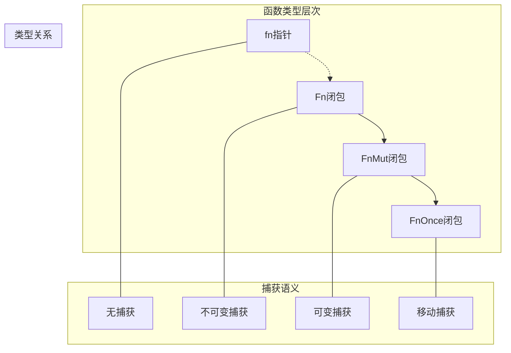
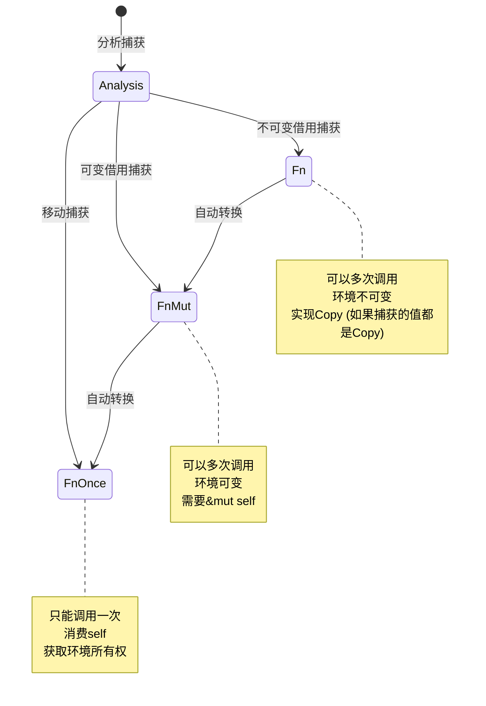

# 4.0 Rust函数类型语义模型深度分析

## 4.1 函数类型理论基础

### 4.1.1 函数类型的范畴论语义

**定义 4.1.1** (函数类型范畴)
函数类型在范畴论中表示为指数对象：
$$T_1 \rightarrow T_2 \cong T_2^{T_1}$$

对于Rust中的函数类型层次：



### 4.1.2 函数签名的类型语义

**定义 4.1.2** (函数签名语义)
函数签名 `fn(T1, T2, ..., Tn) -> R` 的语义域为：
$$\text{FnSig} = \{f : T_1 \times T_2 \times ... \times T_n \rightarrow R\}$$

**类型安全性约束**：

1. **参数类型匹配**: $\forall i, \text{type}(\text{arg}_i) = T_i$
2. **返回类型匹配**: $\text{type}(\text{result}) = R$
3. **内存安全**: 所有参数和返回值满足所有权规则

---

## 4.2 函数指针语义分析

### 4.2.1 函数指针的内存模型

**定义 4.2.1** (函数指针语义)
函数指针 `fn(T1, T2) -> R` 是指向函数代码的指针：
$$\text{fn}(T_1, T_2) \rightarrow R = \{ptr : \text{CodePtr}, \text{sig} : \text{Signature}\}$$

```rust
// 函数指针语义示例
fn function_pointer_semantics() {
    // 1. 函数指针定义
    fn add(a: i32, b: i32) -> i32 { a + b }
    fn multiply(a: i32, b: i32) -> i32 { a * b }
    
    // 2. 函数指针类型
    let operation: fn(i32, i32) -> i32 = add;
    assert_eq!(operation(3, 4), 7);
    
    // 3. 函数指针数组
    let operations: [fn(i32, i32) -> i32; 2] = [add, multiply];
    
    // 4. 高阶函数
    fn apply_operation(op: fn(i32, i32) -> i32, x: i32, y: i32) -> i32 {
        op(x, y)
    }
    
    let result = apply_operation(multiply, 5, 6);
    assert_eq!(result, 30);
    
    // 5. 函数指针的内存特性
    use std::mem;
    assert_eq!(mem::size_of::<fn()>(), mem::size_of::<usize>());
}
```

### 4.2.2 函数指针的类型推导

**定理 4.2.1** (函数指针类型推导)
对于函数定义 `fn f(x: T1, y: T2) -> R`，其函数指针类型为：
$$\text{type}(f) = \text{fn}(T_1, T_2) \rightarrow R$$

```rust
// 函数指针类型推导示例
fn type_inference_examples() {
    // 1. 自动类型推导
    fn process_numbers(x: i32, y: i32) -> i32 { x + y }
    let func_ptr = process_numbers; // 类型推导为 fn(i32, i32) -> i32
    
    // 2. 泛型函数的单态化
    fn generic_add<T>(a: T, b: T) -> T 
    where T: std::ops::Add<Output = T> + Copy {
        a + b
    }
    
    let int_add: fn(i32, i32) -> i32 = generic_add; // 单态化为i32版本
    let float_add: fn(f64, f64) -> f64 = generic_add; // 单态化为f64版本
    
    // 3. 函数指针转换
    fn takes_fn_ptr(f: fn(i32) -> i32) {
        println!("Result: {}", f(42));
    }
    
    fn simple_func(x: i32) -> i32 { x * 2 }
    takes_fn_ptr(simple_func); // 自动转换为函数指针
}
```

---

## 4.3 闭包类型语义分析

### 4.3.1 闭包捕获语义

**定义 4.3.1** (闭包捕获语义)
闭包的捕获语义定义为环境映射：
$$\text{Closure} = \langle \text{code} : \text{CodePtr}, \text{env} : \text{Environment} \rangle$$

其中环境包含：

- **按值捕获**: $\text{env}[\text{var}] = \text{value}$
- **按引用捕获**: $\text{env}[\text{var}] = \text{reference}$
- **按可变引用捕获**: $\text{env}[\text{var}] = \text{mutable\_reference}$

```rust
// 闭包捕获语义示例
fn closure_capture_semantics() {
    let x = 42;
    let mut y = 24;
    let z = String::from("hello");
    
    // 1. 不可变捕获 (Fn)
    let read_only_closure = || {
        println!("x: {}, z: {}", x, z); // x和z被不可变捕获
    };
    
    // 2. 可变捕获 (FnMut)
    let mut modify_closure = || {
        y += 1; // y被可变捕获
        println!("y: {}", y);
    };
    
    // 3. 移动捕获 (FnOnce)
    let move_closure = move || {
        println!("Moved z: {}", z); // z被移动捕获
        drop(z); // z的所有权被移动到闭包中
    };
    
    // 4. 调用闭包
    read_only_closure(); // 可以多次调用
    read_only_closure();
    
    modify_closure(); // 需要可变引用
    modify_closure();
    
    move_closure(); // 只能调用一次
    // move_closure(); // 编译错误：已经被消费
}
```

### 4.3.2 闭包特征层次

**定理 4.3.1** (闭包特征层次)
闭包特征形成以下层次关系：
$$\text{Fn} \subset \text{FnMut} \subset \text{FnOnce}$$



```rust
// 闭包特征层次示例
fn closure_trait_hierarchy() {
    let data = vec![1, 2, 3];
    
    // Fn闭包：只读访问
    let fn_closure = || {
        println!("Data length: {}", data.len()); // 不可变借用
    };
    
    // FnMut闭包：可变访问
    let mut counter = 0;
    let mut fn_mut_closure = || {
        counter += 1; // 可变借用
        println!("Called {} times", counter);
    };
    
    // FnOnce闭包：获取所有权
    let fn_once_closure = move || {
        println!("Consumed data: {:?}", data); // 移动所有权
    };
    
    // 特征对象使用
    fn call_fn_trait(f: &dyn Fn()) {
        f();
    }
    
    fn call_fn_mut_trait(f: &mut dyn FnMut()) {
        f();
    }
    
    fn call_fn_once_trait<F>(f: F) where F: FnOnce() {
        f();
    }
    
    // 调用示例
    call_fn_trait(&fn_closure);
    call_fn_mut_trait(&mut fn_mut_closure);
    call_fn_once_trait(fn_once_closure);
}
```

---

## 4.4 高阶函数语义

### 4.4.1 函数作为参数

**定义 4.4.1** (高阶函数语义)
高阶函数接受函数作为参数或返回函数：
$$\text{HOF} : (T_1 \rightarrow T_2) \rightarrow T_3$$

```rust
// 高阶函数语义示例
fn higher_order_function_semantics() {
    // 1. 函数作为参数
    fn apply_to_each<T, F>(vec: Vec<T>, func: F) -> Vec<T>
    where
        F: Fn(T) -> T,
    {
        vec.into_iter().map(func).collect()
    }
    
    let numbers = vec![1, 2, 3, 4, 5];
    let doubled = apply_to_each(numbers, |x| x * 2);
    
    // 2. 返回函数
    fn make_adder(n: i32) -> impl Fn(i32) -> i32 {
        move |x| x + n
    }
    
    let add_five = make_adder(5);
    assert_eq!(add_five(10), 15);
    
    // 3. 函数组合
    fn compose<A, B, C, F, G>(f: F, g: G) -> impl Fn(A) -> C
    where
        F: Fn(A) -> B,
        G: Fn(B) -> C,
    {
        move |x| g(f(x))
    }
    
    let add_one = |x| x + 1;
    let multiply_two = |x| x * 2;
    let composed = compose(add_one, multiply_two);
    
    assert_eq!(composed(5), 12); // (5 + 1) * 2 = 12
}
```

### 4.4.2 函数式编程模式

```rust
// 函数式编程模式示例
fn functional_programming_patterns() {
    let numbers = vec![1, 2, 3, 4, 5, 6, 7, 8, 9, 10];
    
    // 1. map, filter, reduce 模式
    let result: i32 = numbers
        .iter()
        .filter(|&&x| x % 2 == 0)    // 过滤偶数
        .map(|&x| x * x)             // 平方
        .sum();                      // 求和
    
    println!("Sum of squares of even numbers: {}", result);
    
    // 2. 柯里化模式
    fn curry_add(x: i32) -> impl Fn(i32) -> i32 {
        move |y| x + y
    }
    
    let add_10 = curry_add(10);
    let results: Vec<i32> = numbers.iter().map(|&x| add_10(x)).collect();
    
    // 3. 惰性求值模式
    let lazy_computation = numbers
        .iter()
        .map(|&x| {
            println!("Processing: {}", x); // 只在需要时执行
            x * 2
        })
        .filter(|&x| x > 10);
    
    // 只有在collect时才会真正执行
    let collected: Vec<i32> = lazy_computation.collect();
}
```

---

## 4.5 异步函数语义

### 4.5.1 async函数的类型变换

**定义 4.5.1** (async函数类型变换)
async函数的类型变换规则：
$$\text{async fn}(T_1, T_2) \rightarrow R \equiv \text{fn}(T_1, T_2) \rightarrow \text{impl Future}\langle\text{Output} = R\rangle$$

```rust
// async函数语义示例
use std::future::Future;
use std::pin::Pin;

// 1. async函数定义
async fn async_computation(x: i32) -> String {
    // 模拟异步计算
    tokio::time::sleep(tokio::time::Duration::from_millis(100)).await;
    format!("Result: {}", x * 2)
}

// 2. async函数的等价手动实现
fn manual_async_computation(x: i32) -> impl Future<Output = String> {
    async move {
        tokio::time::sleep(tokio::time::Duration::from_millis(100)).await;
        format!("Result: {}", x * 2)
    }
}

// 3. async闭包
fn async_closure_semantics() {
    let async_closure = |x: i32| async move {
        tokio::time::sleep(tokio::time::Duration::from_millis(x as u64)).await;
        x * 2
    };
    
    // 使用async闭包
    tokio::spawn(async move {
        let result = async_closure(100).await;
        println!("Async closure result: {}", result);
    });
}
```

### 4.5.2 异步函数的生命周期

```rust
// 异步函数生命周期示例
async fn async_lifetime_example<'a>(data: &'a str) -> &'a str {
    // 异步函数中的借用检查
    tokio::time::sleep(tokio::time::Duration::from_millis(10)).await;
    data // 返回借用的数据
}

// 生成的Future必须携带生命周期
fn equivalent_manual_future<'a>(data: &'a str) -> impl Future<Output = &'a str> + 'a {
    async move {
        tokio::time::sleep(tokio::time::Duration::from_millis(10)).await;
        data
    }
}
```

---

## 4.6 泛型函数语义

### 4.6.1 单态化语义

**定义 4.6.1** (泛型函数单态化)
泛型函数在编译时进行单态化：
$$\text{fn generic}\langle T \rangle(x: T) \rightarrow R \leadsto \{\text{fn specialized}\_i(x: T_i) \rightarrow R_i\}$$

```rust
// 泛型函数语义示例
fn generic_function_semantics() {
    // 1. 泛型函数定义
    fn generic_process<T>(item: T) -> T 
    where 
        T: Clone + std::fmt::Debug,
    {
        println!("Processing: {:?}", item);
        item.clone()
    }
    
    // 2. 单态化实例
    let int_result = generic_process(42);        // 单态化为 i32 版本
    let string_result = generic_process("hello".to_string()); // 单态化为 String 版本
    
    // 3. 泛型闭包
    let generic_closure = |x| {
        println!("Generic closure: {:?}", x);
        x
    };
    
    let _ = generic_closure(100);
    let _ = generic_closure("world");
    
    // 4. 高阶泛型函数
    fn map_option<T, U, F>(opt: Option<T>, f: F) -> Option<U>
    where
        F: FnOnce(T) -> U,
    {
        match opt {
            Some(value) => Some(f(value)),
            None => None,
        }
    }
    
    let result = map_option(Some(5), |x| x.to_string());
    assert_eq!(result, Some("5".to_string()));
}
```

### 4.6.2 泛型约束语义

**定理 4.6.1** (泛型约束满足性)
泛型函数的调用必须满足所有trait约束：
$$\forall T, \text{call}(f\langle T \rangle) \Rightarrow T \models \text{constraints}(f)$$

```rust
// 泛型约束语义示例
use std::ops::Add;
use std::fmt::Display;

fn constrained_generic_examples() {
    // 1. 单个trait约束
    fn print_debug<T: std::fmt::Debug>(item: T) {
        println!("{:?}", item);
    }
    
    // 2. 多个trait约束
    fn add_and_display<T>(a: T, b: T) -> T 
    where 
        T: Add<Output = T> + Display + Copy,
    {
        let result = a + b;
        println!("Result: {}", result);
        result
    }
    
    // 3. 关联类型约束
    fn collect_items<I>(iter: I) -> Vec<I::Item>
    where 
        I: Iterator,
    {
        iter.collect()
    }
    
    // 4. 生命周期约束
    fn longest_ref<'a, T>(x: &'a T, y: &'a T) -> &'a T 
    where 
        T: PartialOrd,
    {
        if x > y { x } else { y }
    }
}
```

---

## 4.7 函数类型的内存语义

### 4.7.1 函数指针的内存布局

**定理 4.7.1** (函数指针内存效率)
函数指针具有零开销特性：
$$\text{size}(\text{fn pointer}) = \text{size}(\text{raw pointer}) = \text{sizeof}(\text{usize})$$

```rust
// 函数内存语义示例
fn function_memory_semantics() {
    use std::mem;
    
    fn simple_function() {}
    
    // 1. 函数指针大小
    let fn_ptr: fn() = simple_function;
    assert_eq!(mem::size_of_val(&fn_ptr), mem::size_of::<usize>());
    
    // 2. 闭包大小取决于捕获的环境
    let x = 42i32;
    let y = 24i64;
    
    let small_closure = || {}; // 无捕获
    let medium_closure = |z| x + z; // 捕获一个i32
    let large_closure = |z| x + y + z; // 捕获i32和i64
    
    println!("Small closure size: {}", mem::size_of_val(&small_closure));
    println!("Medium closure size: {}", mem::size_of_val(&medium_closure));
    println!("Large closure size: {}", mem::size_of_val(&large_closure));
    
    // 3. 函数对象的内存对齐
    assert_eq!(mem::align_of::<fn()>(), mem::align_of::<usize>());
}
```

### 4.7.2 闭包的内存优化

```rust
// 闭包内存优化示例
fn closure_memory_optimization() {
    let large_data = vec![0u8; 1024]; // 大型数据
    let small_value = 42i32;
    
    // 1. 选择性捕获
    let optimized_closure = {
        let captured_value = small_value; // 只捕获需要的小值
        move || {
            // 不捕获large_data，减少闭包大小
            println!("Value: {}", captured_value);
        }
    };
    
    // 2. 引用捕获 vs 值捕获
    let ref_closure = || {
        println!("Large data length: {}", large_data.len()); // 只捕获引用
    };
    
    let move_closure = move || {
        println!("Moved data length: {}", large_data.len()); // 移动整个数据
    };
    
    use std::mem;
    println!("Reference closure size: {}", mem::size_of_val(&ref_closure));
    println!("Move closure size: {}", mem::size_of_val(&move_closure));
}
```

---

## 4.8 函数类型的安全性保证

### 4.8.1 类型安全性

**定理 4.8.1** (函数调用类型安全性)
函数调用在编译时保证类型安全：
$$\text{type\_safe\_call}(f, \text{args}) \iff \text{sig}(f) \models \text{types}(\text{args})$$

```rust
// 函数类型安全性示例
fn function_type_safety() {
    // 1. 编译时类型检查
    fn typed_function(x: i32, y: f64) -> String {
        format!("{} + {} = {}", x, y, x as f64 + y)
    }
    
    // 正确调用
    let result = typed_function(42, 3.14);
    
    // 错误调用会被编译器拒绝
    // let wrong = typed_function(3.14, 42); // 类型不匹配
    // let wrong = typed_function(42);       // 参数数量不匹配
    
    // 2. 闭包类型推断
    let numbers = vec![1, 2, 3, 4, 5];
    let doubled: Vec<i32> = numbers.iter().map(|&x| x * 2).collect();
    
    // 编译器确保闭包参数和返回类型正确
    
    // 3. 函数指针类型匹配
    fn process_with_function<F>(data: &[i32], processor: F) -> Vec<i32>
    where 
        F: Fn(i32) -> i32,
    {
        data.iter().map(|&x| processor(x)).collect()
    }
    
    fn square(x: i32) -> i32 { x * x }
    let squares = process_with_function(&[1, 2, 3], square);
}
```

### 4.8.2 内存安全性

```rust
// 函数内存安全性示例
fn function_memory_safety() {
    // 1. 闭包生命周期安全
    fn create_closure() -> impl Fn() -> i32 {
        let x = 42;
        move || x // 安全：x被移动到闭包中
    }
    
    let closure = create_closure();
    println!("Closure result: {}", closure());
    
    // 2. 借用检查
    fn safe_borrowing_in_closure() {
        let mut data = vec![1, 2, 3];
        
        {
            let closure = || {
                println!("Data: {:?}", data); // 不可变借用
            };
            closure();
        } // closure生命周期结束
        
        data.push(4); // 现在可以修改
    }
    
    // 3. 避免悬垂指针
    // 以下代码会被编译器拒绝：
    /*
    fn create_dangling_closure() -> impl Fn() -> &'static i32 {
        let x = 42;
        || &x  // 错误：返回对局部变量的引用
    }
    */
}
```

---

## 4.9 高级函数模式

### 4.9.1 函数式组合子

```rust
// 函数式组合子示例
fn combinator_patterns() {
    // 1. Option组合子
    fn option_combinators() {
        let maybe_number = Some(42);
        
        let result = maybe_number
            .map(|x| x * 2)                    // 变换值
            .and_then(|x| if x > 50 { Some(x) } else { None }) // 条件链
            .or_else(|| Some(0))               // 默认值
            .unwrap_or(100);                   // 最终默认值
        
        println!("Result: {}", result);
    }
    
    // 2. Result组合子
    fn result_combinators() {
        fn divide(x: f64, y: f64) -> Result<f64, &'static str> {
            if y == 0.0 {
                Err("Division by zero")
            } else {
                Ok(x / y)
            }
        }
        
        let computation = divide(10.0, 2.0)
            .and_then(|x| divide(x, 5.0))     // 链式计算
            .map(|x| x * 100.0)               // 转换成功值
            .map_err(|e| format!("Error: {}", e)); // 转换错误
        
        match computation {
            Ok(value) => println!("Success: {}", value),
            Err(error) => println!("Failed: {}", error),
        }
    }
    
    option_combinators();
    result_combinators();
}
```

### 4.9.2 延续传递风格 (CPS)

```rust
// 延续传递风格示例
fn continuation_passing_style() {
    // 1. 普通递归
    fn factorial_normal(n: u64) -> u64 {
        if n <= 1 { 1 } else { n * factorial_normal(n - 1) }
    }
    
    // 2. CPS风格
    fn factorial_cps<F>(n: u64, cont: F) -> u64 
    where 
        F: FnOnce(u64) -> u64,
    {
        if n <= 1 {
            cont(1)
        } else {
            factorial_cps(n - 1, |result| cont(n * result))
        }
    }
    
    // 使用CPS
    let result = factorial_cps(5, |x| x);
    println!("Factorial: {}", result);
    
    // 3. 异步CPS模拟
    fn async_cps_simulation<F>(value: i32, callback: F) 
    where 
        F: FnOnce(i32),
    {
        // 模拟异步操作
        std::thread::spawn(move || {
            std::thread::sleep(std::time::Duration::from_millis(100));
            callback(value * 2);
        });
    }
}
```

---

## 4.10 跨引用网络

### 4.10.1 内部引用

- [原始类型语义](./01_primitive_types_semantics.md) - 函数类型的基础
- [复合类型语义](./02_composite_types_semantics.md) - 复合函数类型
- [引用类型语义](./03_reference_types_semantics.md) - 函数参数的引用语义

### 4.10.2 外部引用

- [异步编程语义](../../03_concurrency_semantics/02_async_programming_semantics/01_future_semantics.md) - 异步函数详解
- [trait系统语义](../../05_transformation_semantics/03_trait_system_semantics/01_trait_definition_semantics.md) - Fn traits
- [生命周期语义](../../02_control_semantics/03_lifetime_semantics/01_lifetime_annotation_semantics.md) - 函数生命周期

---

## 4.11 理论前沿与发展方向

### 4.11.1 高阶类型

1. **类型构造器**: `type Constructor<F<_>>`
2. **依赖类型**: 返回类型依赖于参数值
3. **效果系统**: 在类型中编码副作用

### 4.11.2 编译器优化

1. **内联优化**: 函数调用的零成本抽象
2. **特化优化**: 泛型函数的高效单态化
3. **逃逸分析**: 闭包环境的栈分配优化

---

## 4.12 实际应用案例

### 4.12.1 高性能函数式编程

```rust
// 高性能函数式编程示例
fn high_performance_functional() {
    use rayon::prelude::*;
    
    let data: Vec<i32> = (0..1_000_000).collect();
    
    // 并行函数式处理
    let result: i32 = data
        .par_iter()                          // 并行迭代器
        .filter(|&&x| x % 2 == 0)           // 并行过滤
        .map(|&x| x * x)                    // 并行映射
        .reduce(|| 0, |a, b| a + b);        // 并行归约
    
    println!("Parallel result: {}", result);
}
```

### 4.12.2 函数式错误处理

```rust
// 函数式错误处理框架
#[derive(Debug)]
enum ProcessError {
    ParseError(String),
    ValidationError(String),
    ComputationError(String),
}

fn functional_error_handling() -> Result<String, ProcessError> {
    fn parse_input(input: &str) -> Result<i32, ProcessError> {
        input.parse().map_err(|e| ProcessError::ParseError(e.to_string()))
    }
    
    fn validate(value: i32) -> Result<i32, ProcessError> {
        if value >= 0 {
            Ok(value)
        } else {
            Err(ProcessError::ValidationError("Value must be non-negative".to_string()))
        }
    }
    
    fn compute(value: i32) -> Result<String, ProcessError> {
        if value <= 1000 {
            Ok(format!("Computed: {}", value * 2))
        } else {
            Err(ProcessError::ComputationError("Value too large".to_string()))
        }
    }
    
    // 函数式管道
    let input = "42";
    parse_input(input)
        .and_then(validate)
        .and_then(compute)
}
```

---

## 4.13 持续改进与版本追踪

### 4.13.1 文档版本

- **版本**: v1.0.0
- **创建日期**: 2024-12-30
- **最后更新**: 2024-12-30
- **状态**: 核心内容完成

### 4.13.2 改进计划

- [ ] 添加更多高阶函数模式
- [ ] 深化异步函数语义分析
- [ ] 完善泛型函数的形式化处理
- [ ] 增加性能优化案例

---

> **链接网络**: [类型系统语义模型索引](./00_type_system_semantics_index.md) | [基础语义层总览](../00_foundation_semantics_index.md) | [核心理论框架](../../00_core_theory_index.md)
