# 4.0 Rust函数类型语义模型深度分析

## 📅 文档信息

**文档版本**: v1.0  
**创建日期**: 2025-08-11  
**最后更新**: 2025-08-11  
**状态**: 已完成  
**质量等级**: 钻石级 ⭐⭐⭐⭐⭐

---


## 目录

- [4.0 Rust函数类型语义模型深度分析](#40-rust函数类型语义模型深度分析)
  - [目录](#目录)
  - [4.1 函数类型理论基础](#41-函数类型理论基础)
  - [4.2 Rust函数类型实现](#42-rust函数类型实现)
  - [4.3 实际应用案例](#43-实际应用案例)
  - [4.4 理论前沿与发展](#44-理论前沿与发展)

---

## 4. 1 函数类型理论基础

### 4.1.1 Lambda演算基础

**定义 4.1.1** (Lambda表达式)
Lambda表达式定义为：
$$\Lambda = \{x, \lambda x.M, MN : x \in \text{Var}, M, N \in \Lambda\}$$

**Beta归约规则**：
$$(\lambda x.M)N \to_\beta M[x := N]$$

```rust
// Lambda演算在Rust中的体现
fn lambda_calculus_example() {
    let identity = |x| x;
    let add = |x, y| x + y;
    let result = add(3, 4); // Beta归约：add(3, 4) -> 3 + 4 -> 7
    assert_eq!(result, 7);
}
```

### 4.1.2 函数类型的形式化定义

**定义 4.1.2** (函数类型语义域)
函数类型 $A \to B$ 的语义定义为：
$$A \to B = \{f : \text{Domain}(f) = A, \text{Codomain}(f) = B, \text{Total}(f)\}$$

```mermaid
graph TB
    A[输入类型 A] --> C[函数类型 A→B]
    B[输出类型 B] --> C
    C --> D[函数应用]
    D --> E[类型检查]
```



---

## 4. 2 Rust函数类型实现

### 4.2.1 函数指针类型

```rust
// 函数指针类型示例
fn function_pointer_types() {
    let f: fn(i32) -> i32 = |x| x * 2;
    
    fn apply_function<F>(f: F, x: i32) -> i32 
    where F: Fn(i32) -> i32 {
        f(x)
    }
    
    let result = apply_function(|x| x * 3, 5);
    assert_eq!(result, 15);
}
```

### 4.2.2 闭包类型

```rust
// 闭包类型示例
fn closure_types() {
    let factor = 10;
    let multiply = |x| x * factor; // 捕获环境变量
    
    // 闭包trait约束
    fn process_with_closure<F>(f: F, data: Vec<i32>) -> Vec<i32>
    where F: Fn(i32) -> i32 {
        data.into_iter().map(f).collect()
    }
    
    let numbers = vec![1, 2, 3, 4, 5];
    let doubled = process_with_closure(|x| x * 2, numbers);
    assert_eq!(doubled, vec![2, 4, 6, 8, 10]);
}
```

### 4.2.3 高阶函数

```rust
// 高阶函数示例
fn higher_order_functions() {
    let numbers = vec![1, 2, 3, 4, 5];
    
    // map: 对集合中的每个元素应用函数
    let doubled: Vec<i32> = numbers.iter().map(|&x| x * 2).collect();
    
    // filter: 根据谓词过滤元素
    let evens: Vec<i32> = numbers.iter().filter(|&&x| x % 2 == 0).cloned().collect();
    
    // fold: 累积操作
    let sum: i32 = numbers.iter().fold(0, |acc, &x| acc + x);
    
    assert_eq!(doubled, vec![2, 4, 6, 8, 10]);
    assert_eq!(evens, vec![2, 4]);
    assert_eq!(sum, 15);
}
```

---

## 4. 3 实际应用案例

### 4.3.1 回调函数模式

```rust
// 回调函数模式示例
fn callback_pattern() {
    struct EventHandler<F> 
    where F: Fn(&str) {
        callback: F,
    }
    
    impl<F> EventHandler<F> 
    where F: Fn(&str) {
        fn new(callback: F) -> Self {
            EventHandler { callback }
        }
        
        fn handle_event(&self, event: &str) {
            (self.callback)(event);
        }
    }
    
    let handler = EventHandler::new(|event| {
        println!("Handling event: {}", event);
    });
    
    handler.handle_event("user_click");
}
```

### 4.3.2 策略模式

```rust
// 策略模式示例
fn strategy_pattern() {
    trait SortStrategy {
        fn sort(&self, data: &mut [i32]);
    }
    
    struct QuickSort;
    impl SortStrategy for QuickSort {
        fn sort(&self, data: &mut [i32]) {
            data.sort();
        }
    }
    
    struct Sorter<S> 
    where S: SortStrategy {
        strategy: S,
    }
    
    impl<S> Sorter<S> 
    where S: SortStrategy {
        fn new(strategy: S) -> Self {
            Sorter { strategy }
        }
        
        fn sort(&self, data: &mut [i32]) {
            self.strategy.sort(data);
        }
    }
    
    let mut data = vec![3, 1, 4, 1, 5];
    let sorter = Sorter::new(QuickSort);
    sorter.sort(&mut data);
    assert_eq!(data, vec![1, 1, 3, 4, 5]);
}
```

---

## 4. 4 理论前沿与发展

### 4.4.1 依赖类型函数

**定义 4.4.1** (依赖函数类型)
依赖函数类型允许返回值类型依赖于输入值：
$$\Pi x:A. B(x) = \{f : \forall x \in A, f(x) \in B(x)\}$$

```rust
// 依赖类型函数示例（概念性）
fn dependent_function_types() {
    trait DependentFunction<A> {
        type Output;
        fn apply(&self, input: A) -> Self::Output;
    }
    
    struct VecOperation;
    
    impl DependentFunction<Vec<i32>> for VecOperation {
        type Output = usize;
        fn apply(&self, input: Vec<i32>) -> Self::Output {
            input.len()
        }
    }
}
```

### 4.4.2 线性函数类型

**定义 4.4.2** (线性函数类型)
线性函数类型确保函数参数被使用且仅使用一次：
$$\text{Linear}(A \to B) = \{f : \text{use\_once}(f)\}$$

```rust
// 线性函数类型示例
fn linear_function_types() {
    fn linear_operation<F>(f: F, data: String) -> usize
    where F: FnOnce(String) -> usize {
        f(data) // data被消费，不能再次使用
    }
    
    let result = linear_operation(|s| s.len(), "hello".to_string());
    assert_eq!(result, 5);
}
```

---

## 4. 5 总结

本文档分析了Rust函数类型的语义模型，包括：

1. **理论基础**: Lambda演算和类型理论支撑
2. **Rust实现**: 函数指针、闭包、高阶函数
3. **实际应用**: 回调模式、策略模式
4. **理论前沿**: 依赖类型、线性函数类型

这些概念为Rust的函数式编程提供了坚实的理论基础。

---

> **链接网络**: [类型系统语义模型索引](00_type_system_semantics_index.md) | [基础语义层总览](../00_foundation_semantics_index.md) | [核心理论框架](../../00_core_theory_index.md)
