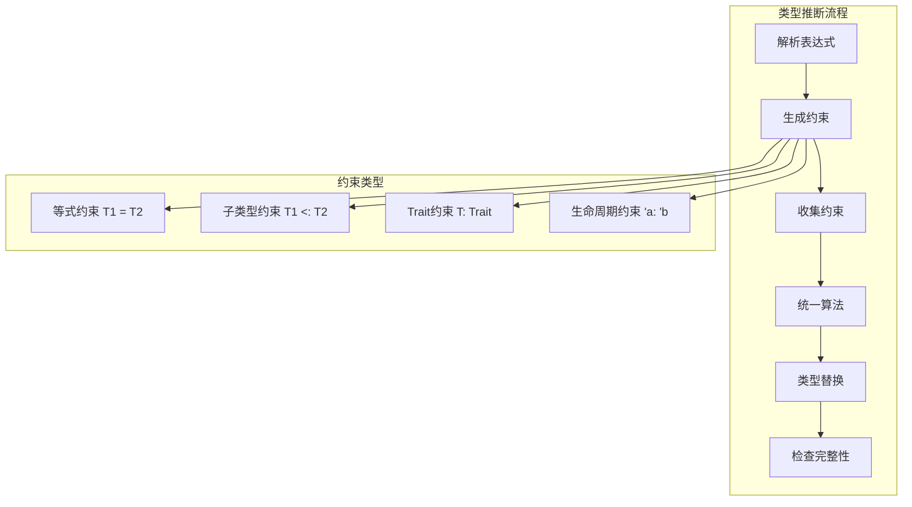

# 1.1.6 Rust类型推断语义模型深度分析

**文档版本**: V1.0  
**创建日期**: 2025-01-27  
**所属层**: 基础语义层 (Foundation Semantics Layer)  
**父模块**: [1.1 类型系统语义](../00_type_system_index.md)  
**交叉引用**: [1.1.1 原始类型语义](01_primitive_types_semantics.md), [1.1.5 Trait类型语义](05_trait_types_semantics.md)

---

## 1.1.6.1 类型推断理论基础

### 1.1.6.1.1 类型推断语义域

**定义 1.1.6.1** (类型推断语义域)
$$\text{TypeInference} = \langle \text{Constraints}, \text{Unification}, \text{Substitution}, \text{Resolution} \rangle$$

其中：

- $\text{Constraints} : \text{Set}(\text{TypeConstraint})$ - 类型约束集合
- $\text{Unification} : \text{Type} \times \text{Type} \rightarrow \text{Substitution}$ - 类型统一
- $\text{Substitution} : \text{TypeVar} \rightarrow \text{Type}$ - 类型变量替换
- $\text{Resolution} : \text{Constraints} \rightarrow \text{TypeMapping}$ - 约束求解

### 1.1.6.1.2 Hindley-Milner算法扩展



---

## 1.1.6.2 基础类型推断

### 1.1.6.2.1 局部变量推断

```rust
// 基础类型推断
fn basic_inference() {
    let x = 42;          // 推断为 i32
    let y = 3.14;        // 推断为 f64
    let s = "hello";     // 推断为 &str
    let v = vec![1, 2];  // 推断为 Vec<i32>
    
    println!("{}, {}, {}, {:?}", x, y, s, v);
}

// 上下文驱动的推断
fn context_driven_inference() {
    let numbers: Vec<i32> = vec![];  // 明确指定类型
    
    let mut data = Vec::new();       // 初始类型未知
    data.push(42);                   // 现在推断为 Vec<i32>
    
    // 函数返回类型推断
    fn identity<T>(x: T) -> T { x }
    let result = identity(42);       // T 推断为 i32
}
```

**类型推断规则**：
$$\frac{\text{expr} : \tau \quad \text{context expects } \sigma}{\text{unify}(\tau, \sigma)} \text{[CONTEXT-INFERENCE]}$$

### 1.1.6.2.2 函数参数推断

```rust
// 闭包参数推断
fn closure_inference() {
    let numbers = vec![1, 2, 3, 4, 5];
    
    // 闭包参数类型从迭代器推断
    let doubled: Vec<i32> = numbers
        .iter()
        .map(|x| x * 2)              // x 推断为 &i32
        .collect();
    
    // 复杂闭包推断
    let filtered: Vec<_> = numbers
        .iter()
        .filter(|&x| x > 2)          // x 推断为 i32
        .collect();                  // 返回类型推断为 Vec<&i32>
}

// 泛型函数调用推断
fn generic_call_inference() {
    fn process<T: Clone>(items: Vec<T>) -> Vec<T> {
        items.iter().cloned().collect()
    }
    
    let strings = vec!["a".to_string(), "b".to_string()];
    let result = process(strings);   // T 推断为 String
}
```

---

## 1.1.6.3 高级推断特性

### 1.1.6.3.1 turbofish语法

```rust
// 显式类型参数
fn turbofish_examples() {
    // 消除歧义的类型指定
    let parsed: i32 = "42".parse().unwrap();
    let parsed2 = "42".parse::<i32>().unwrap();  // turbofish语法
    
    // 集合类型推断
    let numbers = (0..10).collect::<Vec<_>>();
    let map = [(1, "one"), (2, "two")]
        .iter()
        .collect::<std::collections::HashMap<_, _>>();
}

// 复杂泛型推断
fn complex_generic_inference() {
    use std::collections::HashMap;
    
    fn group_by<T, K, F>(items: Vec<T>, key_fn: F) -> HashMap<K, Vec<T>>
    where
        F: Fn(&T) -> K,
        K: Eq + std::hash::Hash,
    {
        let mut map = HashMap::new();
        for item in items {
            let key = key_fn(&item);
            map.entry(key).or_insert_with(Vec::new).push(item);
        }
        map
    }
    
    let words = vec!["apple", "banana", "apricot", "blueberry"];
    let grouped = group_by(words, |s| s.chars().next().unwrap());
    // F, T, K 都被正确推断
}
```

### 1.1.6.3.2 生命周期推断

```rust
// 生命周期省略和推断
fn lifetime_inference() {
    // 简单生命周期推断
    fn first_word(s: &str) -> &str {  // 生命周期自动推断
        s.split_whitespace().next().unwrap_or("")
    }
    
    // 结构体中的生命周期推断
    struct Container<'a> {
        data: &'a str,
    }
    
    impl<'a> Container<'a> {
        fn get_data(&self) -> &str {  // 返回 &'a str
            self.data
        }
    }
}

// 复杂生命周期场景
fn complex_lifetime_inference() {
    fn process_strings<'a>(x: &'a str, y: &'a str) -> &'a str {
        if x.len() > y.len() { x } else { y }
    }
    
    let s1 = String::from("hello");
    let s2 = String::from("world");
    let result = process_strings(&s1, &s2);  // 生命周期自动推断
}
```

---

## 1.1.6.4 推断算法实现

### 1.1.6.4.1 约束生成

```rust
// 类型推断的约束生成（概念性实现）
use std::collections::{HashMap, HashSet};

#[derive(Debug, Clone, PartialEq)]
enum Type {
    Int,
    String,
    Bool,
    Variable(String),
    Function(Box<Type>, Box<Type>),
    Generic(String, Vec<Type>),
}

#[derive(Debug, Clone)]
enum Constraint {
    Equal(Type, Type),
    Implements(Type, String),  // trait约束
}

struct InferenceEngine {
    constraints: Vec<Constraint>,
    substitutions: HashMap<String, Type>,
    next_var: usize,
}

impl InferenceEngine {
    fn new() -> Self {
        InferenceEngine {
            constraints: Vec::new(),
            substitutions: HashMap::new(),
            next_var: 0,
        }
    }
    
    fn fresh_var(&mut self) -> Type {
        let var = format!("T{}", self.next_var);
        self.next_var += 1;
        Type::Variable(var)
    }
    
    fn add_constraint(&mut self, constraint: Constraint) {
        self.constraints.push(constraint);
    }
    
    fn unify(&mut self, t1: &Type, t2: &Type) -> Result<(), String> {
        match (t1, t2) {
            (Type::Int, Type::Int) => Ok(()),
            (Type::String, Type::String) => Ok(()),
            (Type::Bool, Type::Bool) => Ok(()),
            
            (Type::Variable(v), t) | (t, Type::Variable(v)) => {
                self.substitutions.insert(v.clone(), t.clone());
                Ok(())
            }
            
            (Type::Function(a1, r1), Type::Function(a2, r2)) => {
                self.unify(a1, a2)?;
                self.unify(r1, r2)
            }
            
            _ => Err(format!("Cannot unify {:?} with {:?}", t1, t2)),
        }
    }
    
    fn solve_constraints(&mut self) -> Result<(), String> {
        for constraint in self.constraints.clone() {
            match constraint {
                Constraint::Equal(t1, t2) => {
                    self.unify(&t1, &t2)?;
                }
                Constraint::Implements(typ, trait_name) => {
                    // 简化的trait约束处理
                    println!("Checking if {:?} implements {}", typ, trait_name);
                }
            }
        }
        Ok(())
    }
}
```

### 1.1.6.4.2 统一算法

```rust
// Robinson统一算法的Rust实现
fn occurs_check(var: &str, typ: &Type) -> bool {
    match typ {
        Type::Variable(v) => v == var,
        Type::Function(arg, ret) => {
            occurs_check(var, arg) || occurs_check(var, ret)
        }
        Type::Generic(_, args) => {
            args.iter().any(|t| occurs_check(var, t))
        }
        _ => false,
    }
}

fn substitute_type(typ: &Type, substitutions: &HashMap<String, Type>) -> Type {
    match typ {
        Type::Variable(var) => {
            substitutions.get(var).cloned().unwrap_or_else(|| typ.clone())
        }
        Type::Function(arg, ret) => {
            Type::Function(
                Box::new(substitute_type(arg, substitutions)),
                Box::new(substitute_type(ret, substitutions)),
            )
        }
        Type::Generic(name, args) => {
            Type::Generic(
                name.clone(),
                args.iter().map(|t| substitute_type(t, substitutions)).collect(),
            )
        }
        _ => typ.clone(),
    }
}

// 主要统一函数
fn unify_types(t1: &Type, t2: &Type) -> Result<HashMap<String, Type>, String> {
    let mut substitutions = HashMap::new();
    unify_with_substitutions(t1, t2, &mut substitutions)?;
    Ok(substitutions)
}

fn unify_with_substitutions(
    t1: &Type,
    t2: &Type,
    substitutions: &mut HashMap<String, Type>,
) -> Result<(), String> {
    let t1 = substitute_type(t1, substitutions);
    let t2 = substitute_type(t2, substitutions);
    
    match (&t1, &t2) {
        (Type::Variable(v1), Type::Variable(v2)) if v1 == v2 => Ok(()),
        
        (Type::Variable(var), typ) | (typ, Type::Variable(var)) => {
            if occurs_check(var, typ) {
                Err(format!("Occurs check failed: {} in {:?}", var, typ))
            } else {
                substitutions.insert(var.clone(), typ.clone());
                Ok(())
            }
        }
        
        (Type::Function(a1, r1), Type::Function(a2, r2)) => {
            unify_with_substitutions(a1, a2, substitutions)?;
            unify_with_substitutions(r1, r2, substitutions)
        }
        
        (t1, t2) if t1 == t2 => Ok(()),
        
        _ => Err(format!("Cannot unify {:?} with {:?}", t1, t2)),
    }
}
```

---

## 1.1.6.5 推断错误处理

### 1.1.6.5.1 常见推断错误

```rust
// 类型推断错误示例
fn inference_errors() {
    // 错误1：无法推断的类型
    /*
    let mut v = Vec::new();
    // 错误：无法推断T的类型
    println!("{:?}", v);
    */
    
    // 解决方案：提供类型信息
    let mut v: Vec<i32> = Vec::new();
    v.push(42);
    
    // 错误2：类型冲突
    /*
    let x = if true { 42 } else { "hello" };
    // 错误：分支返回不同类型
    */
    
    // 解决方案：使用枚举或trait对象
    enum Value {
        Number(i32),
        Text(String),
    }
    
    let x = if true {
        Value::Number(42)
    } else {
        Value::Text("hello".to_string())
    };
}

// 复杂推断错误
fn complex_inference_errors() {
    use std::collections::HashMap;
    
    // 错误：迭代器类型推断失败
    /*
    let map = HashMap::new();
    let values: Vec<_> = map.values().collect();
    // 错误：无法推断HashMap的类型
    */
    
    // 解决方案：明确指定类型
    let mut map: HashMap<i32, String> = HashMap::new();
    map.insert(1, "one".to_string());
    let values: Vec<_> = map.values().collect();
}
```

### 1.1.6.5.2 错误诊断和修复建议

```rust
// 类型推断的诊断信息
struct TypeInferenceDiagnostic {
    location: String,
    error_type: InferenceErrorType,
    suggestion: String,
}

#[derive(Debug)]
enum InferenceErrorType {
    CannotInfer,
    TypeMismatch,
    AmbiguousType,
    TraitBoundNotSatisfied,
}

impl TypeInferenceDiagnostic {
    fn diagnose_inference_failure(context: &str) -> Self {
        // 模拟编译器的诊断逻辑
        TypeInferenceDiagnostic {
            location: context.to_string(),
            error_type: InferenceErrorType::CannotInfer,
            suggestion: "Consider adding type annotations".to_string(),
        }
    }
    
    fn suggest_fix(&self) -> Vec<String> {
        match self.error_type {
            InferenceErrorType::CannotInfer => vec![
                "Add explicit type annotation".to_string(),
                "Provide more context for inference".to_string(),
            ],
            InferenceErrorType::TypeMismatch => vec![
                "Check branch return types".to_string(),
                "Use type conversion if needed".to_string(),
            ],
            InferenceErrorType::AmbiguousType => vec![
                "Use turbofish syntax ::<Type>".to_string(),
                "Add type annotation to variable".to_string(),
            ],
            InferenceErrorType::TraitBoundNotSatisfied => vec![
                "Add required trait bounds".to_string(),
                "Implement missing trait".to_string(),
            ],
        }
    }
}
```

---

## 1.1.6.6 性能优化

### 1.1.6.6.1 推断算法优化

```rust
// 类型推断的性能优化技术
struct OptimizedInferenceEngine {
    // 使用Union-Find数据结构优化统一
    union_find: UnionFind,
    // 约束图用于依赖分析
    constraint_graph: ConstraintGraph,
    // 缓存推断结果
    inference_cache: HashMap<String, Type>,
}

struct UnionFind {
    parent: HashMap<String, String>,
    rank: HashMap<String, usize>,
}

impl UnionFind {
    fn new() -> Self {
        UnionFind {
            parent: HashMap::new(),
            rank: HashMap::new(),
        }
    }
    
    fn find(&mut self, x: &str) -> String {
        if !self.parent.contains_key(x) {
            self.parent.insert(x.to_string(), x.to_string());
            self.rank.insert(x.to_string(), 0);
        }
        
        let parent = self.parent[x].clone();
        if parent != x {
            let root = self.find(&parent);
            self.parent.insert(x.to_string(), root.clone());
            root
        } else {
            x.to_string()
        }
    }
    
    fn union(&mut self, x: &str, y: &str) {
        let root_x = self.find(x);
        let root_y = self.find(y);
        
        if root_x == root_y {
            return;
        }
        
        let rank_x = self.rank[&root_x];
        let rank_y = self.rank[&root_y];
        
        if rank_x < rank_y {
            self.parent.insert(root_x, root_y);
        } else if rank_x > rank_y {
            self.parent.insert(root_y, root_x);
        } else {
            self.parent.insert(root_y, root_x);
            self.rank.insert(root_x, rank_x + 1);
        }
    }
}

struct ConstraintGraph {
    nodes: HashSet<String>,
    edges: HashMap<String, Vec<String>>,
}

impl ConstraintGraph {
    fn new() -> Self {
        ConstraintGraph {
            nodes: HashSet::new(),
            edges: HashMap::new(),
        }
    }
    
    fn add_dependency(&mut self, from: String, to: String) {
        self.nodes.insert(from.clone());
        self.nodes.insert(to.clone());
        self.edges.entry(from).or_insert_with(Vec::new).push(to);
    }
    
    fn topological_sort(&self) -> Vec<String> {
        // 拓扑排序实现，用于确定推断顺序
        let mut visited = HashSet::new();
        let mut result = Vec::new();
        
        for node in &self.nodes {
            if !visited.contains(node) {
                self.dfs(node, &mut visited, &mut result);
            }
        }
        
        result.reverse();
        result
    }
    
    fn dfs(&self, node: &str, visited: &mut HashSet<String>, result: &mut Vec<String>) {
        visited.insert(node.to_string());
        
        if let Some(neighbors) = self.edges.get(node) {
            for neighbor in neighbors {
                if !visited.contains(neighbor) {
                    self.dfs(neighbor, visited, result);
                }
            }
        }
        
        result.push(node.to_string());
    }
}
```

---

## 1.1.6.7 相关引用与扩展阅读

### 1.1.6.7.1 内部交叉引用

- [1.1.1 原始类型语义](01_primitive_types_semantics.md) - 基础类型系统
- [1.1.5 Trait类型语义](05_trait_types_semantics.md) - Trait约束推断
- [2.2.1 函数定义语义](../../02_control_semantics/02_function_call_semantics/01_function_definition_semantics.md) - 函数类型推断

### 1.1.6.7.2 外部参考文献

1. Damas, L. & Milner, R. *Principal type-schemes for functional programs*. POPL 1982.
2. Rémy, D. *Type inference for records in natural extension of ML*. Research Report 1431, INRIA, 1991.
3. Rust RFC 2089: *Implied bounds*

### 1.1.6.7.3 实现参考

- [rustc_infer](https://doc.rust-lang.org/nightly/nightly-rustc/rustc_infer/index.html) - 类型推断实现
- [rustc_trait_selection](https://doc.rust-lang.org/nightly/nightly-rustc/rustc_trait_selection/index.html) - Trait选择

---

**文档元数据**:

- **复杂度级别**: ⭐⭐⭐⭐ (高级)
- **前置知识**: 类型理论、Hindley-Milner算法、Rust类型系统
- **相关工具**: rustc, rust-analyzer
- **更新频率**: 与Rust类型推断演进同步
- **维护者**: Rust基础语义分析工作组
