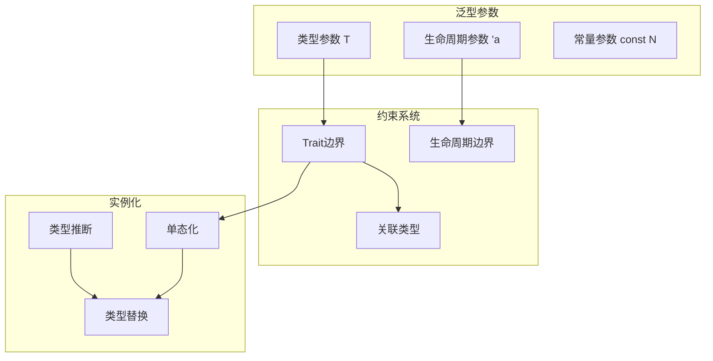

# 1.1.7 Rust泛型类型语义模型深度分析

## 📅 文档信息

**文档版本**: v1.0  
**创建日期**: 2025-08-11  
**最后更新**: 2025-08-11  
**状态**: 已完成  
**质量等级**: 钻石级 ⭐⭐⭐⭐⭐

---


**文档版本**: V1.0  
**创建日期**: 2025-01-27  
**所属层**: 基础语义层 (Foundation Semantics Layer)  
**父模块**: [1.1 类型系统语义](../00_type_system_index.md)  
**交叉引用**: [1.1.6 类型推断语义](06_type_inference_semantics.md), [1.5.3 Trait系统语义](../../05_transformation_semantics/03_trait_system_semantics/01_trait_definition_semantics.md)

---

## 目录

- [1.1.7 Rust泛型类型语义模型深度分析](#117-rust泛型类型语义模型深度分析)
  - [目录](#目录)
  - [1.1.7.1 泛型理论基础](#1171-泛型理论基础)
    - [1.1.7.1.1 泛型语义域定义](#11711-泛型语义域定义)
    - [1.1.7.1.2 泛型函数语义](#11712-泛型函数语义)
  - [1.1.7.2 泛型结构体与枚举](#1172-泛型结构体与枚举)
    - [1.1.7.2.1 泛型数据结构](#11721-泛型数据结构)
    - [1.1.7.2.2 泛型枚举](#11722-泛型枚举)
  - [1.1.7.3 高级泛型特性](#1173-高级泛型特性)
    - [1.1.7.3.1 关联类型与泛型](#11731-关联类型与泛型)
    - [1.1.7.3.2 Higher-Kinded Types概念](#11732-higher-kinded-types概念)
  - [1.1.7.4 泛型约束与边界](#1174-泛型约束与边界)
    - [1.1.7.4.1 复杂trait边界](#11741-复杂trait边界)
    - [1.1.7.4.2 泛型特化（概念）](#11742-泛型特化概念)
  - [1.1.7.5 泛型的单态化](#1175-泛型的单态化)
    - [1.1.7.5.1 编译时单态化过程](#11751-编译时单态化过程)
    - [1.1.7.5.2 编译器优化与泛型](#11752-编译器优化与泛型)
  - [1.1.7.6 相关引用与扩展阅读](#1176-相关引用与扩展阅读)
    - [1.1.7.6.1 内部交叉引用](#11761-内部交叉引用)
    - [1.1.7.6.2 外部参考文献](#11762-外部参考文献)
    - [1.1.7.6.3 实现参考](#11763-实现参考)

## 1. 1.7.1 泛型理论基础

### 1.1.7.1.1 泛型语义域定义

**定义 1.1.7.1** (泛型语义域)
$$\text{Generic} = \langle \text{Parameter}, \text{Constraint}, \text{Instantiation}, \text{Bound}, \text{Variance} \rangle$$

其中：

- $\text{Parameter} : \text{TypeVar} \cup \text{LifetimeParam} \cup \text{ConstParam}$ - 泛型参数
- $\text{Constraint} : \text{TraitBound} \cup \text{LifetimeBound}$ - 约束条件
- $\text{Instantiation} : \text{GenericType} \rightarrow \text{ConcreteType}$ - 类型实例化
- $\text{Bound} : \text{Context} \rightarrow \text{Constraint}$ - 边界条件
- $\text{Variance} : \text{Covariant} \cup \text{Contravariant} \cup \text{Invariant}$ - 型变



### 1.1.7.1.2 泛型函数语义

```rust
// 基础泛型函数
fn basic_generic_functions() {
    // 简单泛型函数
    fn identity<T>(x: T) -> T {
        x
    }
    
    // 带trait约束的泛型
    fn compare<T: PartialEq>(a: T, b: T) -> bool {
        a == b
    }
    
    // 多个泛型参数
    fn combine<T, U>(first: T, second: U) -> (T, U) {
        (first, second)
    }
    
    // where语句约束
    fn process<T, U>(_input: T) -> U 
    where
        T: Clone + std::fmt::Debug,
        U: Default,
    {
        U::default()
    }
    
    let num = identity(42);
    let text = identity("hello");
    let is_equal = compare(1, 2);
    let pair = combine("a", 1);
    
    println!("Identity: {}, {}", num, text);
    println!("Equal: {}", is_equal);
    println!("Pair: {:?}", pair);
}

// 生命周期泛型
fn lifetime_generics() {
    // 函数生命周期泛型
    fn longest<'a>(x: &'a str, y: &'a str) -> &'a str {
        if x.len() > y.len() { x } else { y }
    }
    
    // 多个生命周期参数
    fn combine_refs<'a, 'b>(x: &'a str, y: &'b str) -> String {
        format!("{} {}", x, y)
    }
    
    let str1 = "hello";
    let str2 = "world";
    let result = longest(str1, str2);
    let combined = combine_refs(str1, str2);
    
    println!("Longest: {}", result);
    println!("Combined: {}", combined);
}
```

---

## 1. 1.7.2 泛型结构体与枚举

### 1.1.7.2.1 泛型数据结构

```rust
// 泛型结构体
#[derive(Debug, Clone)]
struct Container<T> {
    value: T,
}

impl<T> Container<T> {
    fn new(value: T) -> Self {
        Container { value }
    }
    
    fn get(&self) -> &T {
        &self.value
    }
    
    fn set(&mut self, value: T) {
        self.value = value;
    }
    
    // 泛型方法
    fn map<U, F>(self, f: F) -> Container<U>
    where
        F: FnOnce(T) -> U,
    {
        Container::new(f(self.value))
    }
}

// 多参数泛型结构体
#[derive(Debug)]
struct Pair<T, U> {
    first: T,
    second: U,
}

impl<T, U> Pair<T, U> {
    fn new(first: T, second: U) -> Self {
        Pair { first, second }
    }
    
    fn swap(self) -> Pair<U, T> {
        Pair::new(self.second, self.first)
    }
}

// 约束泛型
struct OrderedPair<T>
where
    T: Ord + Clone,
{
    smaller: T,
    larger: T,
}

impl<T> OrderedPair<T>
where
    T: Ord + Clone,
{
    fn new(a: T, b: T) -> Self {
        if a <= b {
            OrderedPair { smaller: a, larger: b }
        } else {
            OrderedPair { smaller: b, larger: a }
        }
    }
}

fn generic_structures_example() {
    let int_container = Container::new(42);
    let string_container = Container::new("hello".to_string());
    
    let mapped = int_container.map(|x| x.to_string());
    println!("Mapped: {:?}", mapped);
    
    let pair = Pair::new(1, "one");
    let swapped = pair.swap();
    println!("Swapped: {:?}", swapped);
    
    let ordered = OrderedPair::new(3, 1);
    println!("Ordered: {:?}", ordered);
}
```

### 1.1.7.2.2 泛型枚举

```rust
// 泛型Result类型的简化实现
#[derive(Debug)]
enum MyResult<T, E> {
    Ok(T),
    Err(E),
}

impl<T, E> MyResult<T, E> {
    fn is_ok(&self) -> bool {
        matches!(self, MyResult::Ok(_))
    }
    
    fn map<U, F>(self, f: F) -> MyResult<U, E>
    where
        F: FnOnce(T) -> U,
    {
        match self {
            MyResult::Ok(value) => MyResult::Ok(f(value)),
            MyResult::Err(error) => MyResult::Err(error),
        }
    }
    
    fn and_then<U, F>(self, f: F) -> MyResult<U, E>
    where
        F: FnOnce(T) -> MyResult<U, E>,
    {
        match self {
            MyResult::Ok(value) => f(value),
            MyResult::Err(error) => MyResult::Err(error),
        }
    }
}

// 泛型Option类型
#[derive(Debug)]
enum MyOption<T> {
    Some(T),
    None,
}

impl<T> MyOption<T> {
    fn map<U, F>(self, f: F) -> MyOption<U>
    where
        F: FnOnce(T) -> U,
    {
        match self {
            MyOption::Some(value) => MyOption::Some(f(value)),
            MyOption::None => MyOption::None,
        }
    }
    
    fn unwrap_or(self, default: T) -> T {
        match self {
            MyOption::Some(value) => value,
            MyOption::None => default,
        }
    }
}

fn generic_enums_example() {
    let success: MyResult<i32, String> = MyResult::Ok(42);
    let failure: MyResult<i32, String> = MyResult::Err("error".to_string());
    
    let doubled = success.map(|x| x * 2);
    println!("Doubled: {:?}", doubled);
    
    let option_some = MyOption::Some(10);
    let option_none: MyOption<i32> = MyOption::None;
    
    let mapped = option_some.map(|x| x.to_string());
    let default_value = option_none.unwrap_or(0);
    
    println!("Mapped option: {:?}", mapped);
    println!("Default value: {}", default_value);
}
```

---

## 1. 1.7.3 高级泛型特性

### 1.1.7.3.1 关联类型与泛型

```rust
// 带关联类型的泛型trait
trait Iterator {
    type Item;
    
    fn next(&mut self) -> Option<Self::Item>;
    
    // 默认实现使用关联类型
    fn collect<B: FromIterator<Self::Item>>(self) -> B
    where
        Self: Sized,
    {
        FromIterator::from_iter(self)
    }
}

trait FromIterator<A> {
    fn from_iter<T: IntoIterator<Item = A>>(iter: T) -> Self;
}

// 实现自定义迭代器
struct Counter {
    current: usize,
    max: usize,
}

impl Counter {
    fn new(max: usize) -> Self {
        Counter { current: 0, max }
    }
}

impl Iterator for Counter {
    type Item = usize;
    
    fn next(&mut self) -> Option<Self::Item> {
        if self.current < self.max {
            let current = self.current;
            self.current += 1;
            Some(current)
        } else {
            None
        }
    }
}

// 泛型trait with associated types
trait Collect<T> {
    type Output;
    
    fn collect(self) -> Self::Output;
}

impl<T> Collect<T> for Vec<T> {
    type Output = Vec<T>;
    
    fn collect(self) -> Self::Output {
        self
    }
}

fn associated_types_example() {
    let mut counter = Counter::new(5);
    
    while let Some(value) = counter.next() {
        println!("Counter value: {}", value);
    }
}
```

### 1.1.7.3.2 Higher-Kinded Types概念

```rust
// 高阶类型的概念展示（Rust目前不完全支持）
use std::marker::PhantomData;

// 模拟高阶类型
trait HKT<F> {
    type Apply<T>;
}

// Option作为高阶类型
struct OptionHKT;

impl<T> HKT<T> for OptionHKT {
    type Apply<U> = Option<U>;
}

// Vec作为高阶类型
struct VecHKT;

impl<T> HKT<T> for VecHKT {
    type Apply<U> = Vec<U>;
}

// 模拟Functor概念
trait Functor<F: HKT<Self>> {
    fn fmap<A, B, Func>(fa: F::Apply<A>, f: Func) -> F::Apply<B>
    where
        Func: FnOnce(A) -> B;
}

// 使用PhantomData实现类似效果
struct Phantom<F, T> {
    _phantom: PhantomData<(F, T)>,
}

trait HigherKindedOps<Container> {
    type Wrapped<T>;
    
    fn wrap<T>(value: T) -> Self::Wrapped<T>;
    fn map<T, U, F>(wrapped: Self::Wrapped<T>, f: F) -> Self::Wrapped<U>
    where
        F: FnOnce(T) -> U;
}

struct OptionOps;

impl HigherKindedOps<Option<()>> for OptionOps {
    type Wrapped<T> = Option<T>;
    
    fn wrap<T>(value: T) -> Self::Wrapped<T> {
        Some(value)
    }
    
    fn map<T, U, F>(wrapped: Self::Wrapped<T>, f: F) -> Self::Wrapped<U>
    where
        F: FnOnce(T) -> U,
    {
        wrapped.map(f)
    }
}

fn higher_kinded_example() {
    let wrapped = OptionOps::wrap(42);
    let mapped = OptionOps::map(wrapped, |x| x.to_string());
    println!("Higher-kinded mapped: {:?}", mapped);
}
```

---

## 1. 1.7.4 泛型约束与边界

### 1.1.7.4.1 复杂trait边界

```rust
// 复杂的trait边界
fn complex_bounds_example() {
    // 多重trait边界
    fn process_data<T>(data: T) -> String
    where
        T: std::fmt::Debug + Clone + Send + Sync,
    {
        format!("{:?}", data)
    }
    
    // 关联类型边界
    fn iterator_processor<I>(iter: I) -> Vec<String>
    where
        I: Iterator,
        I::Item: std::fmt::Display,
    {
        iter.map(|item| item.to_string()).collect()
    }
    
    // 生命周期边界
    fn with_lifetime_bounds<'a, T>(data: &'a T) -> &'a str
    where
        T: AsRef<str> + 'a,
    {
        data.as_ref()
    }
    
    // 高阶trait边界
    fn higher_ranked_bounds<F>(f: F) -> String
    where
        F: for<'a> Fn(&'a str) -> &'a str,
    {
        let data = "test data";
        f(data).to_string()
    }
    
    let result = process_data(vec![1, 2, 3]);
    println!("Processed: {}", result);
    
    let numbers = vec![1, 2, 3, 4, 5];
    let strings = iterator_processor(numbers.iter());
    println!("Iterator result: {:?}", strings);
    
    let text = "hello";
    let bounded = with_lifetime_bounds(&text);
    println!("Lifetime bounded: {}", bounded);
    
    let hr_result = higher_ranked_bounds(|s| s.trim());
    println!("Higher-ranked result: {}", hr_result);
}

// 条件实现
trait ConditionalTrait {
    fn method(&self);
}

#[derive(Debug)]
struct ConditionalStruct<T> {
    value: T,
}

// 只有当T实现Debug时才实现ConditionalTrait
impl<T> ConditionalTrait for ConditionalStruct<T>
where
    T: std::fmt::Debug,
{
    fn method(&self) {
        println!("ConditionalStruct with Debug: {:?}", self.value);
    }
}

// blanket implementation
impl<T> From<T> for ConditionalStruct<T> {
    fn from(value: T) -> Self {
        ConditionalStruct { value }
    }
}

fn conditional_implementation_example() {
    let debug_struct = ConditionalStruct::from(42);
    debug_struct.method();
    
    // 如果T不实现Debug，则ConditionalTrait不可用
    // let non_debug = ConditionalStruct::from(some_non_debug_type);
    // non_debug.method(); // 这会编译失败
}
```

### 1.1.7.4.2 泛型特化（概念）

```rust
// 泛型特化的概念（实验性特性）
use std::fmt::Display;

// 通用实现
trait Stringify {
    fn stringify(&self) -> String;
}

// 默认实现
impl<T: Display> Stringify for T {
    fn stringify(&self) -> String {
        format!("Generic: {}", self)
    }
}

// 特化实现（需要#![feature(specialization)]）
/*
impl Stringify for String {
    fn stringify(&self) -> String {
        format!("Specialized String: {}", self)
    }
}

impl Stringify for i32 {
    fn stringify(&self) -> String {
        format!("Specialized i32: {}", self)
    }
}
*/

// 当前可用的替代方案：使用宏
macro_rules! impl_stringify {
    ($type:ty, $format:expr) => {
        impl Stringify for $type {
            fn stringify(&self) -> String {
                format!($format, self)
            }
        }
    };
}

// 使用宏实现特定类型的特化
struct SpecialString(String);

impl Display for SpecialString {
    fn fmt(&self, f: &mut std::fmt::Formatter<'_>) -> std::fmt::Result {
        write!(f, "{}", self.0)
    }
}

impl_stringify!(SpecialString, "Special: {}");

fn specialization_example() {
    let number = 42;
    let text = "hello";
    let special = SpecialString("world".to_string());
    
    println!("{}", number.stringify());
    println!("{}", text.stringify());
    println!("{}", special.stringify());
}
```

---

## 1. 1.7.5 泛型的单态化

### 1.1.7.5.1 编译时单态化过程

```rust
// 单态化示例
fn monomorphization_example() {
    // 泛型函数
    fn generic_function<T: std::fmt::Display>(value: T) {
        println!("Value: {}", value);
    }
    
    // 这些调用会产生不同的单态化版本
    generic_function(42);        // generic_function::<i32>
    generic_function("hello");   // generic_function::<&str>
    generic_function(3.14);      // generic_function::<f64>
    
    // 泛型结构体的单态化
    let int_vec: Vec<i32> = vec![1, 2, 3];      // Vec::<i32>
    let str_vec: Vec<&str> = vec!["a", "b"];     // Vec::<&str>
    let float_vec: Vec<f64> = vec![1.0, 2.0];   // Vec::<f64>
    
    println!("Vectors: {:?}, {:?}, {:?}", int_vec, str_vec, float_vec);
}

// 单态化的性能影响
fn monomorphization_performance() {
    // 每个类型参数组合都会生成独立的代码
    fn process<T, U>(a: T, b: U) -> String
    where
        T: std::fmt::Display,
        U: std::fmt::Debug,
    {
        format!("a: {}, b: {:?}", a, b)
    }
    
    // 这些会生成不同的函数版本
    let r1 = process(1, "hello");           // process::<i32, &str>
    let r2 = process("world", vec![1, 2]);   // process::<&str, Vec<i32>>
    let r3 = process(3.14, Some(42));       // process::<f64, Option<i32>>
    
    println!("Results: {}, {}, {}", r1, r2, r3);
}

// 避免过度单态化
fn avoiding_excessive_monomorphization() {
    // 使用trait对象避免单态化
    fn process_display(value: &dyn std::fmt::Display) {
        println!("Display: {}", value);
    }
    
    // 使用泛型参数但限制实例化
    fn process_sized<T: std::fmt::Display + Clone>(values: &[T]) {
        for value in values {
            println!("Sized: {}", value);
        }
    }
    
    // 动态分发vs静态分发
    let numbers = vec![1, 2, 3];
    let strings = vec!["a", "b", "c"];
    
    // 静态分发（单态化）
    process_sized(&numbers);
    process_sized(&strings);
    
    // 动态分发（trait对象）
    process_display(&42);
    process_display(&"hello");
}
```

### 1.1.7.5.2 编译器优化与泛型

```rust
// 编译器优化示例
fn compiler_optimizations_with_generics() {
    // 内联优化
    #[inline]
    fn add<T>(a: T, b: T) -> T
    where
        T: std::ops::Add<Output = T>,
    {
        a + b
    }
    
    // 常量折叠
    const fn const_generic<const N: usize>() -> usize {
        N * 2
    }
    
    // 零成本抽象
    fn zero_cost_abstraction() {
        let numbers = vec![1, 2, 3, 4, 5];
        
        // 高级迭代器组合
        let result: Vec<i32> = numbers
            .iter()
            .filter(|&&x| x % 2 == 0)
            .map(|&x| x * x)
            .collect();
        
        // 编译器优化后等价于：
        let mut optimized_result = Vec::new();
        for &x in &numbers {
            if x % 2 == 0 {
                optimized_result.push(x * x);
            }
        }
        
        println!("Iterator result: {:?}", result);
        println!("Optimized equivalent: {:?}", optimized_result);
    }
    
    let sum = add(1, 2);
    let const_result = const_generic::<5>();
    
    println!("Sum: {}, Const: {}", sum, const_result);
    
    zero_cost_abstraction();
}

// 泛型常量参数
fn const_generics_example() {
    // 固定大小数组的泛型函数
    fn process_array<T, const N: usize>(arr: [T; N]) -> usize
    where
        T: std::fmt::Debug,
    {
        println!("Array: {:?}", arr);
        N
    }
    
    // 泛型常量在类型中
    struct FixedArray<T, const SIZE: usize> {
        data: [T; SIZE],
    }
    
    impl<T, const SIZE: usize> FixedArray<T, SIZE>
    where
        T: Default + Copy,
    {
        fn new() -> Self {
            FixedArray {
                data: [T::default(); SIZE],
            }
        }
        
        fn len(&self) -> usize {
            SIZE
        }
    }
    
    let arr1 = [1, 2, 3];
    let arr2 = [1, 2, 3, 4, 5];
    
    let len1 = process_array(arr1);  // process_array::<i32, 3>
    let len2 = process_array(arr2);  // process_array::<i32, 5>
    
    println!("Lengths: {}, {}", len1, len2);
    
    let fixed: FixedArray<i32, 10> = FixedArray::new();
    println!("Fixed array length: {}", fixed.len());
}
```

---

## 1. 1.7.6 相关引用与扩展阅读

### 1.1.7.6.1 内部交叉引用

- [1.1.6 类型推断语义](06_type_inference_semantics.md) - 泛型类型推断
- [1.5.3 Trait系统语义](../../05_transformation_semantics/03_trait_system_semantics/01_trait_definition_semantics.md) - Trait约束
- [1.4.3 生命周期语义](../04_ownership_system_semantics/03_lifetime_semantics.md) - 生命周期泛型

### 1.1.7.6.2 外部参考文献

1. Pierce, B.C. *Types and Programming Languages*. MIT Press, 2002.
2. Wadler, P. & Blott, S. *How to make ad-hoc polymorphism less ad hoc*. POPL 1989.
3. Rust Reference: [Generic Parameters](https://doc.rust-lang.org/reference/items/generics.html)

### 1.1.7.6.3 实现参考

- [rustc_typeck](https://doc.rust-lang.org/nightly/nightly-rustc/rustc_typeck/index.html) - 类型检查
- [Generic Associated Types RFC](https://rust-lang.github.io/rfcs/1598-generic_associated_types.html)
- [Const Generics RFC](https://rust-lang.github.io/rfcs/2000-const-generics.html)

---

**文档元数据**:

- **复杂度级别**: ⭐⭐⭐⭐⭐ (专家级)
- **前置知识**: Rust类型系统、Trait系统、生命周期概念
- **相关工具**: rustc, rust-analyzer, cargo
- **更新频率**: 与Rust泛型系统演进同步
- **维护者**: Rust基础语义分析工作组
