# 1.0 Rust内存布局语义模型深度分析

## 📅 文档信息

**文档版本**: v1.0  
**创建日期**: 2025-08-11  
**最后更新**: 2025-08-11  
**状态**: 已完成  
**质量等级**: 钻石级 ⭐⭐⭐⭐⭐

---


## 目录

- [1.0 Rust内存布局语义模型深度分析](#10-rust内存布局语义模型深度分析)
  - [目录](#目录)
  - [1.1 内存布局理论基础](#11-内存布局理论基础)
    - [1.1.1 内存布局语义](#111-内存布局语义)
    - [1.1.2 对齐语义](#112-对齐语义)
  - [1.2 Rust内存布局实现](#12-rust内存布局实现)
    - [1.2.1 基本类型布局](#121-基本类型布局)
    - [1.2.2 结构体布局](#122-结构体布局)
    - [1.2.3 枚举布局](#123-枚举布局)
  - [1.3 实际应用案例](#13-实际应用案例)
    - [1.3.1 FFI内存布局](#131-ffi内存布局)
    - [1.3.2 网络协议布局](#132-网络协议布局)
    - [1.3.3 数据库布局](#133-数据库布局)
  - [1.4 理论前沿与发展](#14-理论前沿与发展)
    - [1.4.1 零拷贝布局](#141-零拷贝布局)
    - [1.4.2 缓存友好布局](#142-缓存友好布局)
    - [1.4.3 量子内存布局](#143-量子内存布局)
  - [1.5 总结](#15-总结)

---

## 1. 1 内存布局理论基础

### 1.1.1 内存布局语义

**定义 1.1.1** (内存布局)
内存布局是数据类型在内存中的组织方式：
$$\text{MemoryLayout}(T) = \{(size, align, offset) : \text{valid}(T)\}$$

其中：

- $size$: 类型大小
- $align$: 对齐要求
- $offset$: 字段偏移

**内存布局规则**：
$$\frac{\Gamma \vdash T : \text{Type}}{\Gamma \vdash \text{layout}(T) : \text{MemoryLayout}}$$

```rust
// 内存布局在Rust中的体现
fn memory_layout_example() {
    use std::mem;
    
    // 基本类型内存布局
    let int_size = mem::size_of::<i32>();      // 4字节
    let int_align = mem::align_of::<i32>();    // 4字节对齐
    
    let float_size = mem::size_of::<f64>();    // 8字节
    let float_align = mem::align_of::<f64>();  // 8字节对齐
    
    // 结构体内存布局
    #[repr(C)]
    struct LayoutExample {
        a: i32,    // 偏移 0
        b: f64,    // 偏移 8 (考虑对齐)
        c: u8,     // 偏移 16
    }
    
    let struct_size = mem::size_of::<LayoutExample>();
    let struct_align = mem::align_of::<LayoutExample>();
    
    println!("结构体大小: {}, 对齐: {}", struct_size, struct_align);
}
```

### 1.1.2 对齐语义

**定义 1.1.2** (内存对齐)
内存对齐确保数据访问效率：
$$\text{align}(addr, alignment) = addr + (alignment - addr \% alignment) \% alignment$$

**对齐规则**：

1. 基本类型按自身大小对齐
2. 结构体按最大字段对齐
3. 数组按元素类型对齐

```mermaid
graph TB
    subgraph "内存对齐机制"
        A[数据类型] --> B[对齐要求]
        B --> C[地址计算]
        C --> D[对齐地址]
        
        E[内存访问] --> F[性能优化]
        F --> G[缓存友好]
    end
    
    A --> E
    B --> F
    C --> G
    D --> H[有效访问]
```



---

## 1. 2 Rust内存布局实现

### 1.2.1 基本类型布局

**定义 1.2.1** (基本类型布局)
基本类型的内存布局由编译器确定：
$$\text{BasicLayout}(T) = \{(size, align) : T \in \text{BasicTypes}\}$$

```rust
// 基本类型布局示例
fn basic_type_layout() {
    use std::mem;
    
    // 整数类型布局
    println!("i8:  size={}, align={}", mem::size_of::<i8>(), mem::align_of::<i8>());
    println!("i16: size={}, align={}", mem::size_of::<i16>(), mem::align_of::<i16>());
    println!("i32: size={}, align={}", mem::size_of::<i32>(), mem::align_of::<i32>());
    println!("i64: size={}, align={}", mem::size_of::<i64>(), mem::align_of::<i64>());
    
    // 浮点类型布局
    println!("f32: size={}, align={}", mem::size_of::<f32>(), mem::align_of::<f32>());
    println!("f64: size={}, align={}", mem::size_of::<f64>(), mem::align_of::<f64>());
    
    // 指针类型布局
    println!("*const i32: size={}, align={}", mem::size_of::<*const i32>(), mem::align_of::<*const i32>());
    println!("&str: size={}, align={}", mem::size_of::<&str>(), mem::align_of::<&str>());
    
    // 布尔类型布局
    println!("bool: size={}, align={}", mem::size_of::<bool>(), mem::align_of::<bool>());
    
    // 字符类型布局
    println!("char: size={}, align={}", mem::size_of::<char>(), mem::align_of::<char>());
}
```

### 1.2.2 结构体布局

```rust
// 结构体布局示例
fn struct_layout() {
    use std::mem;
    
    // 默认布局（可能重排字段）
    struct DefaultLayout {
        a: i32,    // 4字节
        b: f64,    // 8字节
        c: u8,     // 1字节
    }
    
    // C布局（按声明顺序）
    #[repr(C)]
    struct CLayout {
        a: i32,    // 偏移 0
        b: f64,    // 偏移 8
        c: u8,     // 偏移 16
    }
    
    // 紧凑布局（最小化填充）
    #[repr(packed)]
    struct PackedLayout {
        a: i32,    // 偏移 0
        b: f64,    // 偏移 4
        c: u8,     // 偏移 12
    }
    
    println!("DefaultLayout: size={}, align={}", 
             mem::size_of::<DefaultLayout>(), mem::align_of::<DefaultLayout>());
    println!("CLayout: size={}, align={}", 
             mem::size_of::<CLayout>(), mem::align_of::<CLayout>());
    println!("PackedLayout: size={}, align={}", 
             mem::size_of::<PackedLayout>(), mem::align_of::<PackedLayout>());
    
    // 字段偏移分析
    unsafe {
        let c_layout = std::mem::zeroed::<CLayout>();
        let a_offset = &c_layout.a as *const _ as usize - &c_layout as *const _ as usize;
        let b_offset = &c_layout.b as *const _ as usize - &c_layout as *const _ as usize;
        let c_offset = &c_layout.c as *const _ as usize - &c_layout as *const _ as usize;
        
        println!("字段偏移: a={}, b={}, c={}", a_offset, b_offset, c_offset);
    }
}
```

### 1.2.3 枚举布局

```rust
// 枚举布局示例
fn enum_layout() {
    use std::mem;
    
    // 普通枚举
    enum BasicEnum {
        A,
        B(i32),
        C { x: f64, y: f64 },
    }
    
    // C风格枚举
    #[repr(C)]
    enum CStyleEnum {
        A = 0,
        B = 1,
        C = 2,
    }
    
    // 无变体枚举
    #[repr(u8)]
    enum U8Enum {
        A = 0,
        B = 1,
        C = 2,
    }
    
    println!("BasicEnum: size={}, align={}", 
             mem::size_of::<BasicEnum>(), mem::align_of::<BasicEnum>());
    println!("CStyleEnum: size={}, align={}", 
             mem::size_of::<CStyleEnum>(), mem::align_of::<CStyleEnum>());
    println!("U8Enum: size={}, align={}", 
             mem::size_of::<U8Enum>(), mem::align_of::<U8Enum>());
    
    // 变体大小分析
    let basic_a = BasicEnum::A;
    let basic_b = BasicEnum::B(42);
    let basic_c = BasicEnum::C { x: 3.14, y: 2.71 };
    
    println!("BasicEnum::A 大小: {}", mem::size_of_val(&basic_a));
    println!("BasicEnum::B 大小: {}", mem::size_of_val(&basic_b));
    println!("BasicEnum::C 大小: {}", mem::size_of_val(&basic_c));
}
```

---

## 1. 3 实际应用案例

### 1.3.1 FFI内存布局

```rust
// FFI内存布局示例
fn ffi_memory_layout() {
    use std::ffi::{c_char, c_int, c_float};
    use std::os::raw;
    
    // C结构体布局
    #[repr(C)]
    struct CStruct {
        id: c_int,
        name: *const c_char,
        value: c_float,
    }
    
    // Rust结构体（与C兼容）
    #[repr(C)]
    struct RustStruct {
        id: i32,
        name: *const i8,
        value: f32,
    }
    
    // 验证布局兼容性
    assert_eq!(std::mem::size_of::<CStruct>(), std::mem::size_of::<RustStruct>());
    assert_eq!(std::mem::align_of::<CStruct>(), std::mem::align_of::<RustStruct>());
    
    // 联合体布局
    #[repr(C)]
    union CUnion {
        i: c_int,
        f: c_float,
        ptr: *const c_char,
    }
    
    // 位域结构体
    #[repr(C)]
    struct BitField {
        a: u32,  // 4字节
        b: u32,  // 4字节
        c: u32,  // 4字节
    }
    
    // 验证字段偏移
    unsafe {
        let c_struct = std::mem::zeroed::<CStruct>();
        let rust_struct = std::mem::zeroed::<RustStruct>();
        
        let c_id_offset = &c_struct.id as *const _ as usize - &c_struct as *const _ as usize;
        let rust_id_offset = &rust_struct.id as *const _ as usize - &rust_struct as *const _ as usize;
        
        assert_eq!(c_id_offset, rust_id_offset);
    }
}
```

### 1.3.2 网络协议布局

```rust
// 网络协议布局示例
fn network_protocol_layout() {
    use std::mem;
    
    // 网络协议头
    #[repr(C)]
    struct NetworkHeader {
        version: u8,      // 1字节
        flags: u8,        // 1字节
        length: u16,      // 2字节
        sequence: u32,    // 4字节
        timestamp: u64,   // 8字节
    }
    
    // 数据包结构
    #[repr(C)]
    struct DataPacket {
        header: NetworkHeader,
        payload: [u8; 1024],
        checksum: u32,
    }
    
    // 验证布局
    println!("NetworkHeader: size={}, align={}", 
             mem::size_of::<NetworkHeader>(), mem::align_of::<NetworkHeader>());
    println!("DataPacket: size={}, align={}", 
             mem::size_of::<DataPacket>(), mem::align_of::<DataPacket>());
    
    // 字节序转换
    impl NetworkHeader {
        fn to_network_byte_order(&self) -> NetworkHeader {
            NetworkHeader {
                version: self.version,
                flags: self.flags,
                length: self.length.to_be(),
                sequence: self.sequence.to_be(),
                timestamp: self.timestamp.to_be(),
            }
        }
        
        fn from_network_byte_order(&self) -> NetworkHeader {
            NetworkHeader {
                version: self.version,
                flags: self.flags,
                length: u16::from_be(self.length),
                sequence: u32::from_be(self.sequence),
                timestamp: u64::from_be(self.timestamp),
            }
        }
    }
    
    // 序列化
    impl NetworkHeader {
        fn to_bytes(&self) -> Vec<u8> {
            let mut bytes = Vec::new();
            bytes.push(self.version);
            bytes.push(self.flags);
            bytes.extend_from_slice(&self.length.to_be_bytes());
            bytes.extend_from_slice(&self.sequence.to_be_bytes());
            bytes.extend_from_slice(&self.timestamp.to_be_bytes());
            bytes
        }
        
        fn from_bytes(data: &[u8]) -> Option<Self> {
            if data.len() < 16 { return None; }
            
            Some(NetworkHeader {
                version: data[0],
                flags: data[1],
                length: u16::from_be_bytes([data[2], data[3]]),
                sequence: u32::from_be_bytes([data[4], data[5], data[6], data[7]]),
                timestamp: u64::from_be_bytes([
                    data[8], data[9], data[10], data[11],
                    data[12], data[13], data[14], data[15]
                ]),
            })
        }
    }
}
```

### 1.3.3 数据库布局

```rust
// 数据库布局示例
fn database_layout() {
    use std::mem;
    
    // 数据库记录布局
    #[repr(C)]
    struct DatabaseRecord {
        id: u64,           // 8字节
        name: [u8; 32],    // 32字节
        age: u8,           // 1字节
        active: bool,      // 1字节
        score: f64,        // 8字节
        created_at: u64,   // 8字节
    }
    
    // 索引结构
    #[repr(C)]
    struct IndexEntry {
        key: u64,          // 8字节
        offset: u64,       // 8字节
        length: u32,       // 4字节
    }
    
    // 页面布局
    #[repr(C)]
    struct PageHeader {
        page_id: u32,      // 4字节
        page_type: u8,     // 1字节
        record_count: u16, // 2字节
        free_space: u16,   // 2字节
    }
    
    // 验证布局
    println!("DatabaseRecord: size={}, align={}", 
             mem::size_of::<DatabaseRecord>(), mem::align_of::<DatabaseRecord>());
    println!("IndexEntry: size={}, align={}", 
             mem::size_of::<IndexEntry>(), mem::align_of::<IndexEntry>());
    println!("PageHeader: size={}, align={}", 
             mem::size_of::<PageHeader>(), mem::align_of::<PageHeader>());
    
    // 记录序列化
    impl DatabaseRecord {
        fn to_bytes(&self) -> Vec<u8> {
            let mut bytes = Vec::new();
            bytes.extend_from_slice(&self.id.to_le_bytes());
            bytes.extend_from_slice(&self.name);
            bytes.push(self.age);
            bytes.push(self.active as u8);
            bytes.extend_from_slice(&self.score.to_le_bytes());
            bytes.extend_from_slice(&self.created_at.to_le_bytes());
            bytes
        }
        
        fn from_bytes(data: &[u8]) -> Option<Self> {
            if data.len() < 58 { return None; }
            
            let mut name = [0u8; 32];
            name.copy_from_slice(&data[8..40]);
            
            Some(DatabaseRecord {
                id: u64::from_le_bytes([data[0], data[1], data[2], data[3], 
                                       data[4], data[5], data[6], data[7]]),
                name,
                age: data[40],
                active: data[41] != 0,
                score: f64::from_le_bytes([data[42], data[43], data[44], data[45],
                                          data[46], data[47], data[48], data[49]]),
                created_at: u64::from_le_bytes([data[50], data[51], data[52], data[53],
                                               data[54], data[55], data[56], data[57]]),
            })
        }
    }
}
```

---

## 1. 4 理论前沿与发展

### 1.4.1 零拷贝布局

**定义 1.4.1** (零拷贝布局)
零拷贝布局允许直接内存访问，无需数据复制：
$$\text{ZeroCopyLayout}(T) = \{layout : \text{no\_copy}(T, layout)\}$$

```rust
// 零拷贝布局示例
fn zero_copy_layout() {
    use std::mem;
    
    // 零拷贝结构体
    #[repr(C)]
    struct ZeroCopyStruct {
        header: u32,
        data: [u8; 1024],
        footer: u32,
    }
    
    // 内存映射
    impl ZeroCopyStruct {
        fn from_bytes(data: &[u8]) -> Option<&Self> {
            if data.len() < mem::size_of::<Self>() { return None; }
            
            // 直接重新解释内存，无需复制
            unsafe {
                let ptr = data.as_ptr() as *const Self;
                Some(&*ptr)
            }
        }
        
        fn to_bytes(&self) -> &[u8] {
            unsafe {
                std::slice::from_raw_parts(
                    self as *const _ as *const u8,
                    mem::size_of::<Self>()
                )
            }
        }
    }
    
    // 验证零拷贝
    let data = vec![0u8; mem::size_of::<ZeroCopyStruct>()];
    if let Some(zero_copy) = ZeroCopyStruct::from_bytes(&data) {
        let bytes = zero_copy.to_bytes();
        assert_eq!(bytes.as_ptr(), data.as_ptr()); // 相同内存地址
    }
}
```

### 1.4.2 缓存友好布局

```rust
// 缓存友好布局示例
fn cache_friendly_layout() {
    use std::mem;
    
    // 缓存友好的结构体布局
    #[repr(C)]
    struct CacheFriendlyStruct {
        // 热点数据放在前面
        frequently_accessed: u64,
        also_hot: u64,
        
        // 较少访问的数据
        rarely_used: [u8; 64],
        
        // 另一个热点数据
        another_hot: u64,
    }
    
    // 数据局部性优化
    struct DataLocalityOptimized {
        // 将相关数据分组
        positions: Vec<(f64, f64, f64)>,  // 位置数据
        velocities: Vec<(f64, f64, f64)>, // 速度数据
        masses: Vec<f64>,                 // 质量数据
    }
    
    impl DataLocalityOptimized {
        fn update_positions(&mut self) {
            // 批量处理位置数据，提高缓存命中率
            for (pos, vel) in self.positions.iter_mut().zip(self.velocities.iter()) {
                pos.0 += vel.0;
                pos.1 += vel.1;
                pos.2 += vel.2;
            }
        }
        
        fn update_velocities(&mut self) {
            // 批量处理速度数据
            for (vel, mass) in self.velocities.iter_mut().zip(self.masses.iter()) {
                // 物理计算
                vel.0 /= *mass;
                vel.1 /= *mass;
                vel.2 /= *mass;
            }
        }
    }
    
    // 内存对齐优化
    #[repr(align(64))] // 64字节对齐，适合缓存行
    struct AlignedStruct {
        data: [u8; 64],
    }
    
    println!("CacheFriendlyStruct: size={}, align={}", 
             mem::size_of::<CacheFriendlyStruct>(), mem::align_of::<CacheFriendlyStruct>());
    println!("AlignedStruct: size={}, align={}", 
             mem::size_of::<AlignedStruct>(), mem::align_of::<AlignedStruct>());
}
```

### 1.4.3 量子内存布局

```rust
// 量子内存布局概念示例
fn quantum_memory_layout() {
    // 模拟量子叠加内存布局
    enum QuantumMemory<T> {
        Superposition(Vec<T>),
        Collapsed(T),
    }
    
    // 量子内存布局
    struct QuantumLayout<T> {
        data: QuantumMemory<T>,
        entanglement: Vec<usize>, // 纠缠关系
    }
    
    impl<T> QuantumLayout<T> {
        fn new(data: T) -> Self {
            QuantumLayout {
                data: QuantumMemory::Collapsed(data),
                entanglement: Vec::new(),
            }
        }
        
        fn create_superposition(&mut self, items: Vec<T>) {
            self.data = QuantumMemory::Superposition(items);
        }
        
        fn measure(&mut self) -> Option<T> {
            match &mut self.data {
                QuantumMemory::Superposition(items) => {
                    if let Some(item) = items.pop() {
                        self.data = QuantumMemory::Collapsed(item);
                        Some(item)
                    } else {
                        None
                    }
                }
                QuantumMemory::Collapsed(item) => {
                    // 克隆数据，因为测量会破坏量子态
                    None
                }
            }
        }
    }
    
    // 量子纠缠内存
    struct EntangledMemory<T, U> {
        first: T,
        second: U,
        entangled: bool,
    }
    
    impl<T, U> EntangledMemory<T, U> {
        fn new(first: T, second: U) -> Self {
            EntangledMemory {
                first,
                second,
                entangled: true,
            }
        }
        
        fn measure(&mut self) -> (T, U) {
            self.entangled = false;
            (self.first, self.second)
        }
    }
    
    // 使用量子内存布局
    let mut quantum_layout = QuantumLayout::new(42);
    quantum_layout.create_superposition(vec![1, 2, 3, 4, 5]);
    
    let entangled = EntangledMemory::new(42, "hello");
    let (number, string) = entangled.measure();
}
```

---

## 1. 5 总结

本文档深入分析了Rust内存布局的语义模型，包括：

1. **理论基础**: 内存布局语义和对齐语义
2. **Rust实现**: 基本类型布局、结构体布局、枚举布局
3. **实际应用**: FFI内存布局、网络协议布局、数据库布局
4. **理论前沿**: 零拷贝布局、缓存友好布局、量子内存布局

内存布局为Rust提供了高效的内存管理和性能优化基础。

---

> **链接网络**: [内存模型语义模型索引](00_memory_model_semantics_index.md) | [基础语义层总览](../00_foundation_semantics_index.md) | [核心理论框架](../../00_core_theory_index.md)
